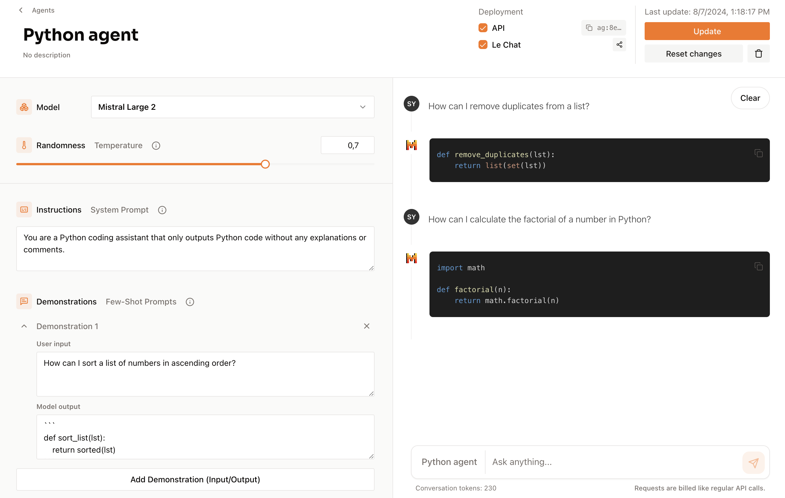
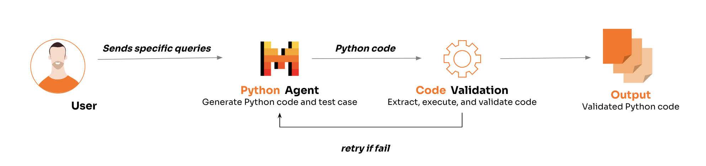
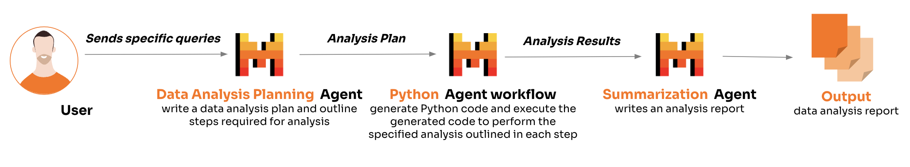

## 公司革命来了`7*24`小时黑灯IT企业 - AI agent 是什么? 为什么要分工? 一些简单的例子   
                                                                                
### 作者                                                    
digoal                                                    
                                                           
### 日期                                                         
2024-09-09                                                   
                                                        
### 标签                                                      
PostgreSQL , PolarDB , DuckDB , AI agent , 大模型 , llm , 黑灯工厂        
                                                                               
----                                                        
                                                                      
## 背景     
  
## AI agent 是什么?    
  
这里引用一下mistral的解释.   
  
https://docs.mistral.ai/capabilities/agents/  
  
AI agents are autonomous systems powered by large language models (LLMs) that, given high-level instructions, can plan, use tools ( [《大模型与外部工具结合编程(function call)应用实践》](../202409/20240906_01.md) ), carry out steps of processing, and take actions to achieve specific goals. These agents leverage advanced natural language processing capabilities to understand and execute complex tasks efficiently and can even collaborate with each other to achieve more sophisticated outcomes.     
  
如果上面这段不好理解, 可以尝试把AI agents和公司员工进行类比. 企业被划分为不同的部门, 每个部门有多个岗位, 每个岗位有不同的级别(例如`p5,p6,...p10,...`), 每个级别有不同的能力模型. 通过OKR驱动员工为公司付出劳动.     
  
AI agents精准的大白话定义可能是: 进行了职责设定, 经过了微调, 与当前岗位职责所需能力最匹配、具有自治能力的大模型.    
  
在mistral创建AI agents时需要指定一系列参数, 这些参数证明了前面对AI agent定义的解释是比较精准的:      
  
Model: The specific model you would like the agent to use. Default is "Mistral Large 2" (mistral-large-2407). The other model choices are "Mistral Nemo" (open-mistral-nemo), "Codestral" (codestral-2405), and your fine-tuned models. 指定模型(通常可能会是经过微调后的模型)  
  
Temperature: What sampling temperature to use, between 0.0 and 1.0. Higher values will make the output more random, while lower values will make it more focused and deterministic. 指定温度(偏创造还是偏严谨的工作.)  
  
Instructions (optional): Instructions allows you to enforce a model behavior through all conversations and messages.  类似role=system的提示(对模型进行职责限定, 模型的输入输出的定义和样式设定等等)     
  
Demonstrations (optional): Few-shot learning examples can be added to help guide the agent to understand the specific behavior you want it to exhibit. You can show the model some examples of input and output to improve performance.  给出一些例子,帮助模型理解自己的职责和输入输出.     
  
Deploy: Once deployed, you will be able to call the Agent via the API with the agent_id, but you can also toggle the option to chat with the corresponding Agent on Le Chat.  
  
## 为什么AI需要分工协作? 一个大模型通吃不就行了?    
  
LLM要不要专业化分工协作? 是不是一个超级模型就可以了?      
  
要分工, 一个超级模型不是不行, 而是效率不够高.      
  
小模型(参数更少的大语言模型)经过微调后, 响应速度比(参数更多的大语言模型)大模型更快, 消耗的资源更少. 就像一线工程师, 要的是执行效率, 不需要太多的推理能力.  而越往上就越需要基于广博的数据与知识的推理能力, 比如决策者角色.        
  
如何微调? 参考:    
  
[《AI大模型+全文检索+tf-idf+向量数据库+我的文章 系列之5 - 在 Apple Silicon Mac 上微调(fine-tuning)大型语言模型(LLM) 并发布GGUF》](../202407/20240724_01.md)    
  
[《用Macbook finetun Llama 3 LLM 模型》](../202408/20240802_01.md)    
  
[《AI大模型+全文检索+tf-idf+向量数据库+我的文章 系列之9 - 数据库招聘、产品规划、选型、微调模型 高质量问题》](../202408/20240806_02.md)    
  
[《AI大模型+全文检索+tf-idf+向量数据库+我的文章 系列之7 - 开源项目postgres_finetuning_kb, 如何生成 “微调(fine-tuning)大语言模型(LLM)” 的问题素材?》](../202407/20240730_01.md)    
  
LLM分工可能比人类社会的分工更细. 人可能管理不了那么多不同的岗位, 但是AI可以:        
  
1、同一个人可以胜任很多岗位, 但是同一时刻只会呆在某一个岗位上.    
  
由于大模型就是一串二进制所以可复制, 所以同一个大模型同一时刻可以呆在很多可胜任的岗位上.    
  
2、同一个人从一个岗位转岗到另一个岗位, 即使岗位所需的能力已具备, 也需要一定的时间来熟悉新的环境(人、OKR、事等).    
  
大模型没有情感, 没有社交, 适应能力比人更强, 同一个模型从一个岗位转岗到另一个岗位只需要修改一下前面说的那几个关键参数:    
- Temperature 指定温度(偏创造还是偏严谨的工作.)  
- Instructions (optional) 类似role=system的提示(对模型进行职责限定, 模型的输入输出的定义和样式设定等等)     
- Demonstrations (optional) 给出一些例子,帮助模型理解自己的职责和输入输出.     
  
以后的IT公司可能也会变成`7*24`小时的“黑灯工厂”. 产品经理、产品体验交互设计师、文档工程师、前端开发者、后端开发者、... ... 这些角色都可以被不同的AI agent替代.    
  
## 一些简单的AI agent例子  
例子取自mistral.    
  
https://docs.mistral.ai/capabilities/agents/  
  
1、Python agent  
  
您可以创建一个只输出Python代码而不提供任何解释的AI代理。当您需要生成易于复制和粘贴的代码片段，而不需要我们的模型通常提供的附加解释性文本时，这是非常有用的。  
  
  
  
2、Python agent workflow  
  
您可以在辅助编码工作流中使用我们在用例1中创建的Python agent。例如，下面是一个非常简单的Python代理工作流，包含以下步骤:  
  
  
  
用户请求:  
该过程在用户向Python agent提交查询或请求时启动。  
  
生成代码和测试用例:  
代理解释用户的请求并生成相应的Python代码。除了代码之外，代理还创建一个测试用例来验证生成的代码的功能。  
  
执行和验证:  
代理尝试运行生成的代码，以确保执行时没有错误。然后代理运行测试用例以确认代码产生正确的输出。  
  
重试机制:  
如果代码运行失败或测试用例未通过，则代理将发起重试。它重新生成代码和测试用例，处理之前尝试中的任何问题。  
  
结果输出:  
一旦代码成功运行并通过了测试用例，代理将结果交付给用户。  
  
例子  
- https://github.com/mistralai/cookbook/blob/main/mistral/agents/simple_Python_agent_workflow.ipynb  
  
3、Data analytical multi-agent workflow  
  
您还可以在工作流中利用多个AI代理。  
  
   
  
下面是一个例子:  
  
数据分析规划:  
- 规划代理编写一份全面的数据分析计划，概述分析数据所需的步骤。  
  
代码生成和执行:  
- 对于分析计划中的每个步骤，Python代理都会生成相应的代码。然后，Python代理执行生成的代码来执行指定的分析。  
  
分析报告总结:  
- 根据执行代码的结果，摘要代理编写分析报告。该报告总结了从数据分析代理中得出的发现和见解。  
  
例子  
- https://github.com/mistralai/cookbook/blob/main/mistral/agents/analytical_agent_workflow.ipynb  
  
## 如何使用agent?   
  
mistral agent API调用的例子:    
```  
import os  
from mistralai import Mistral  
  
api_key = os.environ["MISTRAL_API_KEY"]  
  
client = Mistral(api_key=api_key)  
  
chat_response = client.agents.complete(  
    agent_id="ag:3996db2b:20240805:french-agent:a8997aab",  
    messages=[  
        {  
            "role": "user",  
            "content": "What is the best French cheese?",  
        },  
    ],  
)  
print(chat_response.choices[0].message.content)  
```  
  
   
  
#### [期望 PostgreSQL|开源PolarDB 增加什么功能?](https://github.com/digoal/blog/issues/76 "269ac3d1c492e938c0191101c7238216")
  
  
#### [PolarDB 开源数据库](https://openpolardb.com/home "57258f76c37864c6e6d23383d05714ea")
  
  
#### [PolarDB 学习图谱](https://www.aliyun.com/database/openpolardb/activity "8642f60e04ed0c814bf9cb9677976bd4")
  
  
#### [购买PolarDB云服务折扣活动进行中, 55元起](https://www.aliyun.com/activity/new/polardb-yunparter?userCode=bsb3t4al "e0495c413bedacabb75ff1e880be465a")
  
  
#### [PostgreSQL 解决方案集合](../201706/20170601_02.md "40cff096e9ed7122c512b35d8561d9c8")
  
  
#### [德哥 / digoal's Github - 公益是一辈子的事.](https://github.com/digoal/blog/blob/master/README.md "22709685feb7cab07d30f30387f0a9ae")
  
  
#### [About 德哥](https://github.com/digoal/blog/blob/master/me/readme.md "a37735981e7704886ffd590565582dd0")
  
  

  
