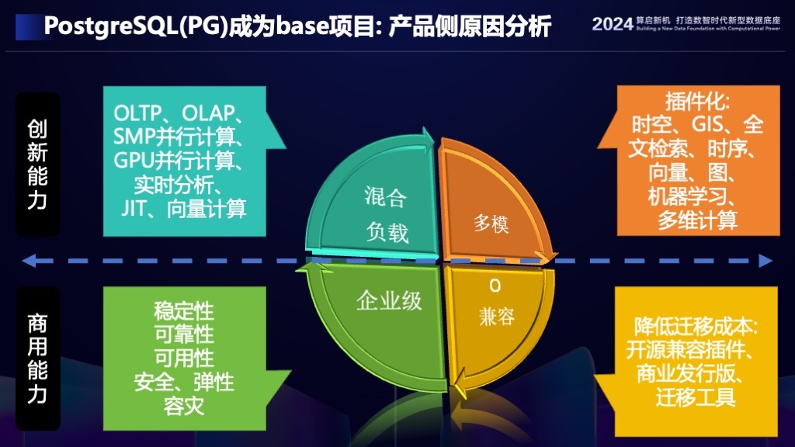
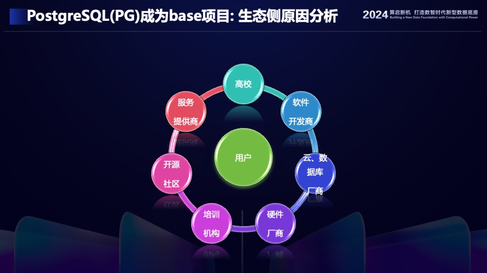
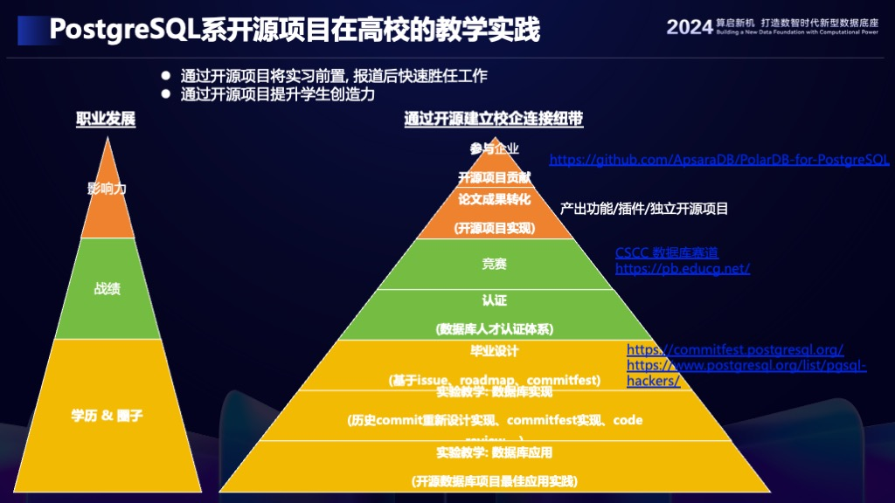
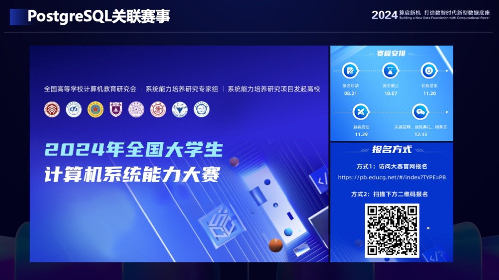

## PostgreSQL深耕中国的技术洞察 PPT     
                                                                                    
### 作者                                                        
digoal                                                        
                                                               
### 日期                                                             
2024-09-15                                                     
                                                            
### 标签                                                          
PostgreSQL , PolarDB , DuckDB , 社区运作 , 根项目条件 , 高校教育    
                                                                                   
----                                                            
                                                                          
## 背景   
  
老陈分享了1和2两个部分, PG中文社区的运作和高校合作.    
  
我分享了3和4, PG成为base项目的原因以及开源项目&高校教育.    
      
1、PostgreSQL成为base项目的原因: 用户侧、产品侧、生态侧    
  
  
  
  
  
  
  
2、PostgreSQL开源项目&高校教育   
  
  
  
3、PostgreSQL开源项目相关全国大学生数据库创新设计赛事  
  
  
  
附: [PostgreSQL深耕中国的技术洞察 PPT下载](20240915_01_doc_001.pptx)  
  
  
  
  
#### [期望 PostgreSQL|开源PolarDB 增加什么功能?](https://github.com/digoal/blog/issues/76 "269ac3d1c492e938c0191101c7238216")
  
  
#### [PolarDB 开源数据库](https://openpolardb.com/home "57258f76c37864c6e6d23383d05714ea")
  
  
#### [PolarDB 学习图谱](https://www.aliyun.com/database/openpolardb/activity "8642f60e04ed0c814bf9cb9677976bd4")
  
  
#### [PostgreSQL 解决方案集合](../201706/20170601_02.md "40cff096e9ed7122c512b35d8561d9c8")
  
  
#### [德哥 / digoal's Github - 公益是一辈子的事.](https://github.com/digoal/blog/blob/master/README.md "22709685feb7cab07d30f30387f0a9ae")
  
  
#### [About 德哥](https://github.com/digoal/blog/blob/master/me/readme.md "a37735981e7704886ffd590565582dd0")
  
  

  
