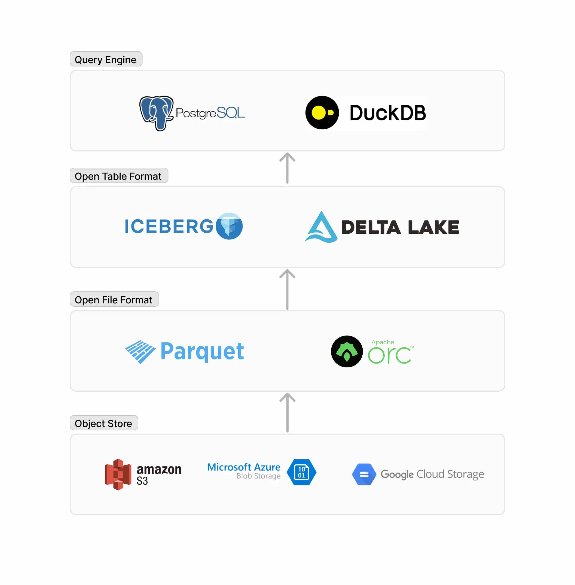

## PostgreSQL 又一 DuckDB 插件: pg_analytics 让PG支持查询Apache Iceberg  
                                                              
### 作者                                  
digoal                                  
                                         
### 日期                                       
2024-09-18                                  
                                      
### 标签                                    
PostgreSQL , PolarDB , DuckDB , iceberg , delta lake , metadata , parquet , orc , oss , s3 , pg_analytics             
                                                             
----                                      
                                                    
## 背景    
原文: https://www.paradedb.com/blog/iceberg_lakehouse  
  
如今，越来越多的用户将历史数据从 Postgres 转移到对象存储 如S3，因为它具有可扩展性和成本效益。其中许多用户还采用了 Apache Iceberg，这是一种允许像 SQL 表一样查询 S3 数据的表格式。  
  
虽然 Trino、Spark 或 Flink 等查询引擎可以与 Iceberg 集成，但 Postgres 却不能。自我们(ParadeDB)推出pg_lakehouse以来，对Iceberg的支持一直是最受欢迎的功能。  
  
我们很高兴地宣布，S3 和 Google Cloud Storage 现在支持 Iceberg 表。pg_lakehouse作为此版本的一部分，我们已用 DuckDB 替换了 DataFusion 查询引擎。我们最初尝试使用 DuckDB 来支持 Iceberg，并且惊喜地发现 DuckDB 加速了我们的工程工作。在这篇blog的后半部分，我们将分享 DataFusion 和 DuckDB 的一些优点和权衡。  
  
## 什么是 Apache Iceberg？  
Iceberg 专为分析大型数据集而构建，是一种围绕 Parquet 等文件组织元数据的开源规范。Iceberg 元数据允许将这些文件(parquet,orc ...)视为具有 “ACID 事务、结构演变、时间旅行和分区”等功能的 SQL 表。因此，Iceberg 通常被称为表格式。  
  
## 在 Postgres 中支持 Iceberg  
  
  
  
目前，Postgres 生态系统缺少与 Iceberg 的互操作性。相反，采用 Iceberg 的 Postgres 用户可能会采用 Trino、Spark 或 Flink 等系统来查询 Iceberg 表。  
  
pg_lakehouse使用PostgreSQL FDW API 为 Postgres 添加对 Iceberg 的支持。以下代码块演示了如何从 Postgres 查询 Iceberg 表。  
```  
CREATE EXTENSION pg_lakehouse;  
  
CREATE FOREIGN DATA WRAPPER iceberg_wrapper  
HANDLER iceberg_fdw_handler  
VALIDATOR iceberg_fdw_validator;  
  
CREATE SERVER iceberg_server  
FOREIGN DATA WRAPPER iceberg_wrapper;  
  
-- Replace the dummy schema with the actual schema  
CREATE FOREIGN TABLE iceberg_table (x INT)  
SERVER iceberg_server  
OPTIONS (files 's3://bucket/iceberg_folder');  
  
-- Success! You can now query the Iceberg table  
SELECT COUNT(*) FROM iceberg_table;  
```  
  
与典型的FDW不同，pg_lakehouse它可以将大多数查询完全pushdown到 DuckDB。这意味着它在 Postgres 内部提供了 DuckDB 的分析性能。您可以在我们之前的blog文章pg_lakehouse中阅读有关我们如何实现这一点的。 https://www.paradedb.com/pages/introducing_lakehouse#how-its-built    
  
## 我们最初选择 DataFusion 的原因  
2024 年 1 月，我们评估了 DuckDB 和 DataFusion 作为 ParadeDB 分析查询引擎的候选方案，最终选择了DataFusion。当时，DataFusion 的几个方面吸引了我们：  
  
### 可扩展性  
DuckDB 和 DataFusion 都是进程内查询系统。但是，DataFusion 面向数据库开发人员，而 DuckDB 面向最终用户。这意味着 DataFusion 的 API 比 DuckDB 的 API 具有更多的扩展点，我们希望这可以简化与 Postgres 的集成路径。  
  
### DataFusion 采用率不断提高  
DataFusion 正在迅速成为现代分析型数据库事实上的查询引擎。流行的时间序列数据库 InfluxDB 依赖于 DataFusion，并为其发展做出了巨大贡献。基于 DataFusion 构建的 Spark 加速器 Comet 于 2024 年 2 月被 Apple 开源。2024 年 6 月，DataFusion 成为 Apache 顶级项目。  
  
### 用 Rust 编写  
DuckDB 是用 C/C++ 编写的，而 DataFusion 是用 Rust 编写的。我们觉得阅读和修改 DataFusion 的代码更舒服。  
  
## 为什么我们改用DuckDB?    
在使用 DataFusion 数月后，我们决定全力投入DuckDB。这并不是因为我们对 DataFusion 不满意, 而是因为我们的用例发生了变化 事实上，我们发现 DataFusion 是一个非常强大且符合人体工程学的库。     
  
我们暂停了pg_analytics老的分支的开发。pg_analytics老的分支使用了 Postgres tableaccess method，这意味着我们有责任实现 Postgres 的许多复杂功能，如WAL、MVCC、对各种事务级别的支持、buffer等。DataFusion 的可扩展性在这里非常有用。  
  
另一方面 pg_lakehouse (现在已经统一到pg_analytics dev分支)，它使用了FDW API，该 API 实现起来更直接，并且不需要查询引擎具有很高的可扩展性。因此，我们开始体会到 DuckDB 的好处：  
  
(事实上, Tom lane老爷子公司crunchy data bridge也是通过fdw用的DuckDB, https://www.crunchydata.com/products/crunchy-bridge-for-analytics )     
  
(还有开源pg_duckdb: https://github.com/duckdb/pg_duckdb  )     
  
### 开箱即用的集成  
DuckDB 的 Iceberg 扩展已经存在一年多。而作为iceberg-rust项目的一部分，Iceberg 对 DataFusion 的支持尚处于起步阶段。DuckDB 还与Delta Lake（Iceberg 的竞争对手）和 Azure ADLS 等对象存储集成。当我们与 DataFusion 构建这些集成时，我们必须将多个库粘合在一起。我们很高兴将测试和维护这些集成的责任转嫁给 DuckDB。  
  
### 最终用户更加熟悉  
当我们推出pg_lakehouse的第一个版本时，我们收到了一些用户的 bug 报告，他们尝试使用 DuckDB glob 模式查询文件，但 DataFusion 无法识别该模式。我们意识到，虽然 DataFusion 在数据库开发人员中享有盛誉，但 DuckDB 为一般开发人员社区所熟悉。被告知pg_lakehouse是“Postgres 中的 DuckDB”的用户似乎立即了解了pg_lakehouse扩展的用例和价值主张。  
  
### 更好的性能  
在很多基准测试中，DuckDB 的性能都超过了 DataFusion。虽然测试用例还不够，DataFusion 的性能正在迎头赶上，但性能的提升引起了对亚秒级查询延迟要求的用户的共鸣。  
  
## 参考  
https://www.paradedb.com/blog/iceberg_lakehouse  
  
https://github.com/paradedb/pg_analytics  
  
https://github.com/davidgasquez/awesome-duckdb  
  
  
#### [期望 PostgreSQL|开源PolarDB 增加什么功能?](https://github.com/digoal/blog/issues/76 "269ac3d1c492e938c0191101c7238216")
  
  
#### [PolarDB 开源数据库](https://openpolardb.com/home "57258f76c37864c6e6d23383d05714ea")
  
  
#### [PolarDB 学习图谱](https://www.aliyun.com/database/openpolardb/activity "8642f60e04ed0c814bf9cb9677976bd4")
  
  
#### [PostgreSQL 解决方案集合](../201706/20170601_02.md "40cff096e9ed7122c512b35d8561d9c8")
  
  
#### [德哥 / digoal's Github - 公益是一辈子的事.](https://github.com/digoal/blog/blob/master/README.md "22709685feb7cab07d30f30387f0a9ae")
  
  
#### [About 德哥](https://github.com/digoal/blog/blob/master/me/readme.md "a37735981e7704886ffd590565582dd0")
  
  

  
