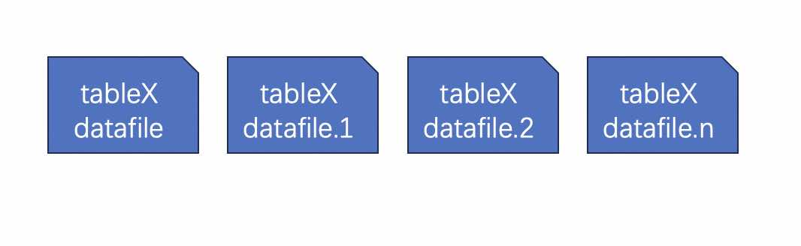
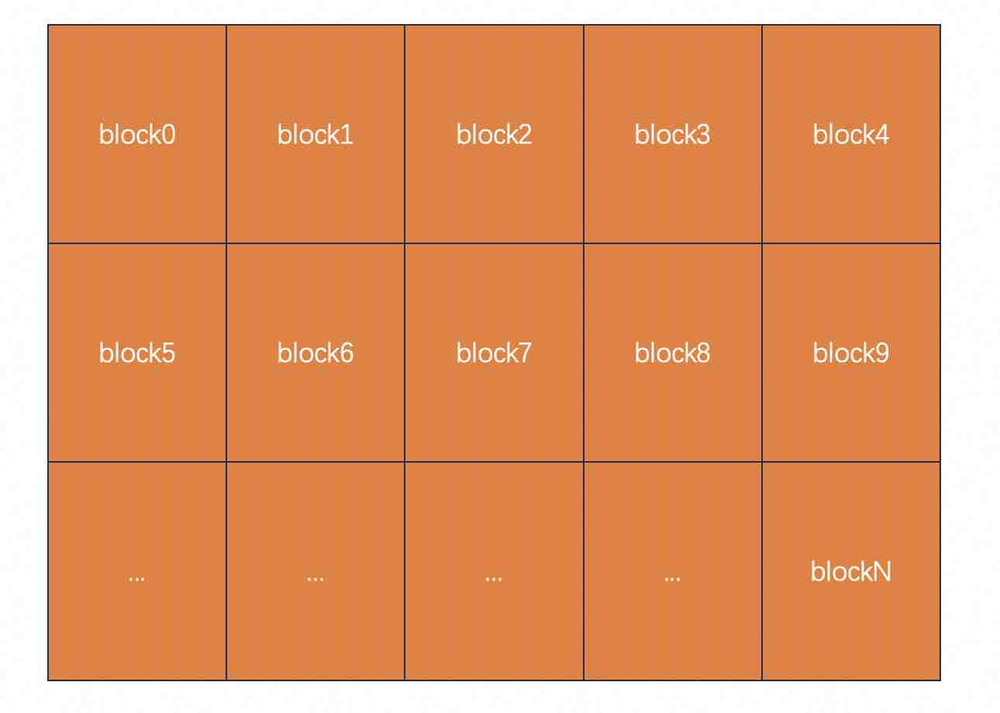
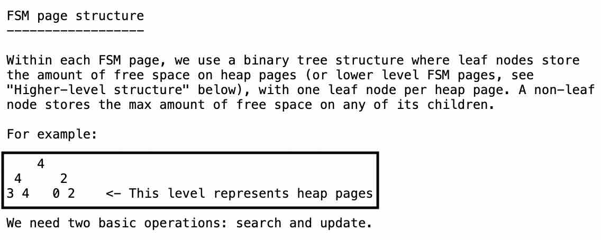

## 数据库筑基课 - 行存之 heap 表组织结构   
                                                                                    
### 作者                                                        
digoal                                                        
                                                               
### 日期                                                             
2024-09-19                                                      
                                                            
### 标签                                                          
PostgreSQL , PolarDB , DuckDB , 应用开发者 , 数据库筑基课 , 表组织结构 , 行存 , heap          
                                                                                   
----                                                            
                                                                          
## 背景      
[《数据库筑基课 - 大纲》](../202409/20240914_01.md)    
  
<b>本节: 行存之 heap 表组织结构</b>     
  
## 简介  
PostgreSQL heap表的显著特点是以无序、行的形式存储数据. 一条记录为一个整体插入到某个block的空闲位置(特殊情况: 当一条记录的长度超过toast_tuple_target尺寸时, 这条记录的变长字段的值经过处理(External不压缩,Extended压缩)后将会move to toast空间(原来处于heap table block tuple内的被搬走的column value存储的则是指向对应toast block的“指针”), 这个以后再细说.) (还有一种特殊情况是如果变长字段都设置为main(仅压缩,不move to toast), 但是当整条记录长度大于TOAST_TUPLE_TARGET_MAIN时也会被强制move to toast.), 如果只有insert操作, 看起来就像在数据文件末尾以append only的形式追加数据.    
  
1、heap 表组织形式:   
  
每个 heap 表对应一系列文件, 包括一系列数据文件(main), fsm文件, vm文件, init文件(仅unlogged表). 使用`pg_relation_filepath(regclass)`函数可以通过表名查询其对应的数据文件前缀.    
  
其中单个数据文件的size上限是编译PostgreSQL软件时通过`--with-segsize`指定的, 默认为1GiB, 当写入的数据量超过1GiB时, 会自动创建新的数据文件, 文件名后缀以数字作为标记.    
  
datafiles layout 如下    
  
  
  
datafile 内部以block形式进行物理划分, 便于寻址(例如访问第10个数据块时, 使用读文件的系统调用, 将blocksize乘以blockid作为offset参数. 非常方便, 所以物理行号ctid其实就是blockNum,itemid/lpNum). 其中blocksize 在编译PostgreSQL软件时通过`--with-blocksize`指定.  默认为8KiB.     
  
datafile layout 如下     
  
     
  
寻址一条记录时, 不仅要知道其blockNum, 还需要知道其在block中的位置. lp(line point) 实际上就记录了这个位置(offset), 而lp自身的位置可以通过计算得到, 例如某个block内的第二条记录(lp2), 实际上就在block head + lp_size 的偏移处.      
  
所以物理行号(ctid)就包含了blockNum和lpN   
```  
select ctid,* from tbl;  
  
返回  
(0,1), ...  
表示0号数据块, 第一条记录.  
```  
  
https://git.postgresql.org/gitweb/?p=postgresql.git;a=blob;f=src/include/storage/bufpage.h;hb=REL_17_STABLE     
  
block layout 如下    
  
    
  
2、查询寻址:   
  
`ctid (blockNum, itemid/lpNum)`     
  
可以直接通过ctid访问某一条记录, 实际上在索引里面 key存储的是索引字段/表达式相关值, value存储的是ctid, 回表时访问ctid指向的heap表中对应的记录(tuple/row).  是否需要回表(index only scan)? 通过VM文件blockNum对应bit value的值判断是否需要回表也需要用到ctid里的blockNum.    
  
```  
select * from table where ctid = '(1,9)';  
  
select * from table where ctid >= '(0,1)' and ctid < '(11,0)';  
```  
  
3、插入记录:    
  
每个表的数据文件都有对应的fsm文件, 每个block的剩余空间用1个字节表示(如果当前值为10, 表示这个block的剩余空间为 `10*blocksize/256`).  fsm 使用binary tree的形式进行组织, 由于blocksize和层级都是已知的, 所以叶子结点的逻辑位置可以反推出其物理位置.  采用这个结构可以快速搜索和刷新每个block的剩余空间.    
  
https://git.postgresql.org/gitweb/?p=postgresql.git;a=blob;f=src/backend/storage/freespace/README;hb=REL_17_STABLE     
  
fsm layout 如下    
  
   
  
插入时根据所需空间选择满足条件的blockNum.     
  
4、更新记录:    
  
注意Postgres Heap表的live tuple和dead tuple都存储在同一数据文件中, 更新记录时, 对老的记录进行打标, 同时会新写入一条记录到数据文件中.    
  
所以更新会导致行号(ctid)的变化, 而索引中value存储的是ctid, 那是不是意味着所有的更新都会导致索引的更新? 为了减少索引的更新, PG引入了HOT-update的概念, 更新时优先在当前block中创建新的记录, 建表时通过设置fillfactor来决定每个block保留多少空间. 所以非索引字段更新频繁的表, 通过配置fillfactor达到HOT-update的效果, 可以显著提升update性能, 降低索引膨胀概率.    
  
[《PostgreSQL Heap Only Tuple - HOT (降低UPDATE引入的索引写IO放大)》](../201809/20180925_02.md)    
  
HOT-update的核心是: block 内的lp链条. 也就是deadtuple的lp本来指向的是dead tuple的offset, HOT-update后该lp会指向live tuple的lp.  因此, 虽然索引value里存储的是dead tuple的lp, 也能找到对应的live tuple.    
  
HOT-update得以实现需要同时满足以下2个条件:  
- 索引key没有更新.    
- 索引value指向的dead tuple与更新后对应的live tuple在同一个block内.    
  
5、垃圾回收(vacuum):    
  
前面提到了Postgres的dead tuple和live tuple都混合在同样的数据文件中, 如果不及时清理dead tuple, 会导致数据文件膨胀, 引发不良后果包括 耗费更多的空间、内存, 性能下降等.    
  
垃圾回收也是个重大课题, 下面简单分享一些点.    
  
5\.1、哪些dead tuple能被回收?   
  
换句话说, 即 哪些tuple version可能被老的事务所用到?  以下xid snapshot中的olddest xid , 在此之后产生的dead tuple version都不能被回收:    
  
long query pg_stat_activity: backend_xmin/backend_xid  
  
long xact pg_stat_activity: backend_xmin/backend_xid  
  
logical replication slot 依赖的解析wal需要的最老catalog dead tuple version pg_replication_slots: xmin   
  
如果有standby, 并且开启了hot_standby_feedback, 那么从库的xid snapshot中的olddest xid, 也需要考虑进来.   
  
所以我们经常会观察到一个现象, 当数据库中有长事务存在时, 如果在长事务开启后发生了大量的更新操作, 被大量更新的表必然会膨胀.     
  
5\.2、回收用到的内存多大合适?  
  
这个考虑的是频繁更新的大表, 扫描heap表时 dead tuple 行号要记录在内存中, 在扫描对应索引时对索引的垃圾版本进行回收. 如果内存存不下表中的所有dead tuple行号, 索引可能会被扫描多遍, 垃圾回收就会非常耗时.     
  
17以前的版本, 参考如下文章:  
  
[《PostgreSQL 垃圾回收参数优化之 - maintenance_work_mem , autovacuum_work_mem》](../201902/20190226_01.md)    
  
17版本开始进行了代码优化, 几乎可以忽略这个问题.    
  
[《PostgreSQL 17 preview - 使用TidStore数据结构存储dead tupleids, 提升vacuum效率, 为什么PG单表不建议超过8.9亿条记录?》](../202404/20240402_02.md)    
  
5\.3、垃圾回收的自动任务调度相关参数(autovacuum)  
  
在多长时间窗口内轮询一遍所有数据库, 检查哪些表需要进行垃圾回收: autovacuum_naptime  
  
表的垃圾记录达到多少阈值后需要进行垃圾回收: autovacuum_vacuum_threshold / autovacuum_vacuum_scale_factor  
  
扫描多少个block后进行sleep: autovacuum_vacuum_cost_limit / vacuum_cost_page_hit / vacuum_cost_page_miss / vacuum_cost_page_dirty   
  
一次sleep多久: autovacuum_vacuum_cost_delay  
  
5\.4、垃圾回收工作进程的并行度  
  
autovacuum_max_workers    
  
注意目前单个表(到最小分区粒度)不支持并行, 目前仅支持: 多个表并行(到最小分区粒度), 单个表的多索引可以并行回收.     
  
5\.5、高频更新的表如何优化  
  
表级别设置垃圾回收的阈值, 提高垃圾回收频率.  
  
如果频繁更新的表是巨大的表, 建议分区.  
  
使用nvme ssd, 低延迟、高IOPS、高吞吐的块设备.  
  
5\.6、膨胀了怎么收缩  
  
如果业务可以暂停, 直接vacuum full.  
  
如果业务不能暂停, 使用pg_repack之类的在线收缩工具.    
  
## 优势 & 适合场景  
  
不需要考虑写入位置, 写入速度快.    
  
以tuple为最小粒度, 以block组织存储, 可以快速定位到一条记录的所有字段, 适合需要经常访问一条记录中多个字段的业务.     
  
适合以OLTP为主的业务场景.    
  
以append only形式追加存储, 配合timescaledb插件/分区表, brin块级索引, 适合时序类业务的热数据高速写入、以及时序数据的小范围检索与聚合分析场景.  配合parquet列存+对象存储, 适合时序类时间冷热分离压缩存储, 配合duckdb插件可以实现时序历史数据的高速分析.    
  
## 劣势 & 不适合场景  
  
dead tuple和live tuple都存放在数据文件中, 不适合高频更新+长事务的混合业务, 非常容易引起膨胀. 非要使用的话建议使用高级ssd并做好监控和处理预案(杀长事务/膨胀收缩等).      
  
一条记录不能超过block size, 不适合超级大宽表业务.     
  
以行为单位组织存储, 压缩率较低, 存储历史数据的成本较高. 访问少量字段并进行大量记录计算时无法使用CPU的批处理能力, 性能相比列存较差.  不适合以OLAP为主的业务场景.    
  
## DEMO   
`create table ... using heap;`     
  
`heap`为默认的tam时可以省略`using heap`.      
  
## 扩展问题   
为什么vacuum heap表只能从磁盘上回收最后一个数据文件末尾的完全空闲的block?    
  
中间的block回收掉的话, 后面的block的位置会发生移动, 导致blockNum的变化, 而索引value里存储的是原来的blockNum, 通过索引将无法正确的访问到目标tuple.    
  
例如索引value里存储的ctid是`(10,9)`, 如果block 8物理空间被回收了, 那么`(10,9)`实际上访问的将会是`(11,9)`.    
  
而回收最后一个数据文件末尾的完全空闲的block不存在这个问题, 因为它后面没有block了.    
  
## 扩展阅读   
- ebook: PostgreSQL 14 internals https://postgrespro.com/community/books/internals   
- ebook: https://www.interdb.jp/pg/   
- manual: https://www.postgresql.org/docs/17/storage.html    
- 代码: src/include/storage/bufpage.h    
- 代码: src/backend/access/heap/heapam.c   
- 代码: src/backend/storage/freespace
- 代码: src/include/access/heaptoast.h   // 什么适合搬运, 阈值TOAST_TUPLE_TARGES是tuple还是datum, 等等问题都可以在这个代码里找到
- 插件: contrib/pg_freespacemap   
- 插件: contrib/pageinspect   
- 插件: pg_repack  
- SQL: `create table ... using`   
- SQL: `alter table alter column - set Storage PLAIN | EXTERNAL | EXTENDED | MAIN`  
- SQL: `pg_relation_filepath(regclass)`   
- 概念: `tuple | dead tuple | live tuple`  
- 概念: `toast`   
- 概念: `table access methods`    
- 概念: `tid`    
- 概念: `HOT-update`    
- 概念: `vacuum`   
- 概念: `blocksize`   
- 概念: `fillfactor`    
- GUC: `toast_tuple_target`   
- GUC: `default_table_access_method`   
- GUC: `enable_tidscan`     
- GUC: `autovacuum_naptime`  
- GUC: `autovacuum_vacuum_threshold / autovacuum_vacuum_scale_factor`  
- GUC: `autovacuum_vacuum_cost_limit / vacuum_cost_page_hit / vacuum_cost_page_miss / vacuum_cost_page_dirty`  
- GUC: `autovacuum_vacuum_cost_delay`  
- GUC: `autovacuum_max_workers`    
- 存储引擎: `zheap`   
- 存储引擎: `zedstore`   
- 数据文件后缀: `FSM` , `VM` , `INIT`   
- blog: [《PostgreSQL Free Space Map Principle》](../201005/20100511_02.md)    
- blog: [《PostgreSQL Heap Only Tuple - HOT (降低UPDATE引入的索引写IO放大)》](../201809/20180925_02.md)    
- blog: [《PostgreSQL物理"备库"的哪些操作或配置(例如hot_standby_feedback)，可能影响"主库"的性能、垃圾回收、IO波动》](../201704/20170410_03.md)    
- blog: [《PostgreSQL 垃圾回收参数优化之 - maintenance_work_mem , autovacuum_work_mem》](../201902/20190226_01.md)    
- blog: [《PostgreSQL 17 preview - 使用TidStore数据结构存储dead tupleids, 提升vacuum效率, 为什么PG单表不建议超过8.9亿条记录?》](../202404/20240402_02.md)    
  
  
#### [期望 PostgreSQL|开源PolarDB 增加什么功能?](https://github.com/digoal/blog/issues/76 "269ac3d1c492e938c0191101c7238216")
  
  
#### [PolarDB 开源数据库](https://openpolardb.com/home "57258f76c37864c6e6d23383d05714ea")
  
  
#### [PolarDB 学习图谱](https://www.aliyun.com/database/openpolardb/activity "8642f60e04ed0c814bf9cb9677976bd4")
  
  
#### [PostgreSQL 解决方案集合](../201706/20170601_02.md "40cff096e9ed7122c512b35d8561d9c8")
  
  
#### [德哥 / digoal's Github - 公益是一辈子的事.](https://github.com/digoal/blog/blob/master/README.md "22709685feb7cab07d30f30387f0a9ae")
  
  
#### [About 德哥](https://github.com/digoal/blog/blob/master/me/readme.md "a37735981e7704886ffd590565582dd0")
  
  

  
