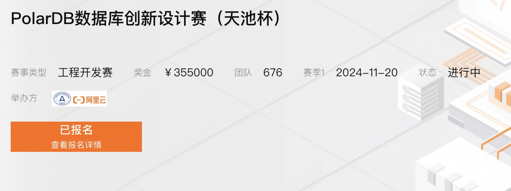
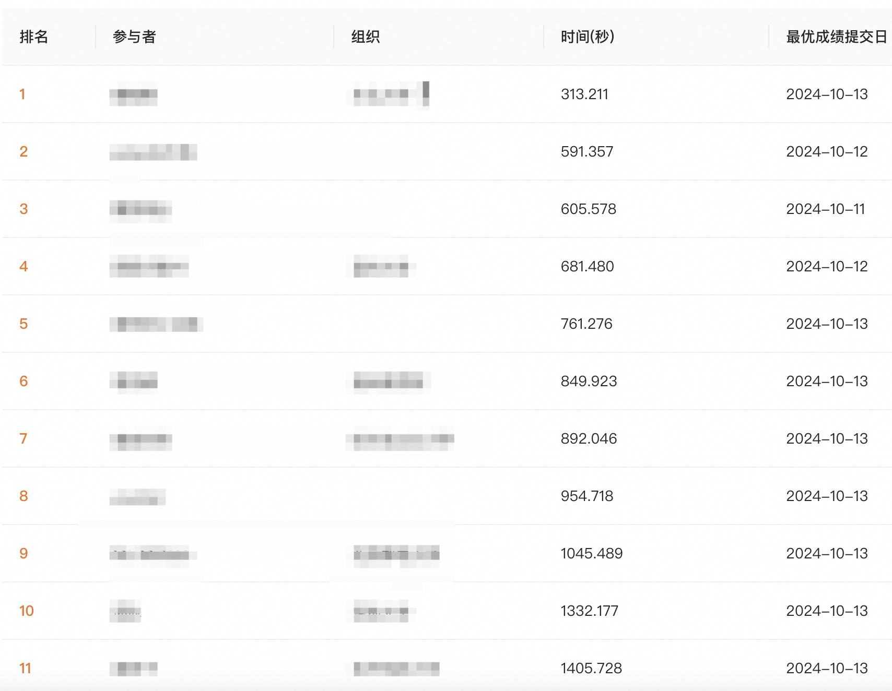

## spacex(隔壁老王)成功了, 你欢呼个啥?    
                                                                                            
### 作者                                                                
digoal                                                                
                                                               
### 日期                                                          
2024-10-14                                                     
                                                                    
### 标签                                                                  
PostgreSQL , PolarDB , DuckDB , 国赛    
                                                                                           
----                                                                    
                                                                                  
## 背景     
## 隔壁老王中了500万, 你欢呼个啥?  
24.10.13 spacex回收成功的消息几乎全网都在欢呼、点赞、转发, 好像比自己中500万还高兴. 可是你欢呼个啥, 那是隔壁老王中了500万, 不是你.    
  
而且就算spacex的成功将来是会改变世界, 未来人类可能移居火星, 将人类文明带到其他星系等等可以畅想的太多了. 但是这些带来的好处离我们还遥远得很远, 能不能接点地气, 实际一点, 生你养你对土地是哪的? 管你医疗、教育、养老的是哪个国家? 哪些企业在给国家机器纳税来维持我们生活的安居乐业? 都是我们自己人好吗. 搞清楚现在是隔壁老王成功了, 不是我们的企业.    
  
真的是气啊!!! 我想给正在脚踏实地做事情的大学生们点赞加油, 就是近期这个国产信创数据库PolarDB的“全国大学生数据库创新设计赛”, 虽然是第1届比赛9月开放报名以来已有600多支队伍参与比赛.  
  
   
  
比赛题目是20GB TPCH数据的导入优化(导入、建立PK、建立约束的总耗时越低越好), 10.8号开始提交初赛成绩, 最开始大家的成绩都不怎么理想, 多的需要3700多秒, 好的也需要2000多秒. 但是随着比赛的推进, 短短几天最好成绩已经到300秒出头了(提升了10几倍, 用商业术语可以称得上颠覆式创新了.), 前十干到了1300秒内. 要知道比赛规则是非常苛刻的, 最终成绩必须是在完成数据库原有所有功能完整性校验对情况下才算有效, 同学们真的太优秀了.      
  
   
  
这个比赛我全程都在QQ群和同学们交流, 同学们的交流非常活跃, 我们的数据库产业是非常有希望的. 别老觉得国外的数据库核心技术高不可攀, 那只是别人比我们先出发, 我们迎头赶上就是了. 哪个国际比赛的大奖少了我们? 别忘了我们是勤劳勇敢的中国人.     
  
## 看清楚, 这才是我们的东西!   
PolarDB for PostgreSQL是阿里云基于PostgreSQL开源代码研发的存算分离架构云原生数据库, 最初基于PG 11的版本研发, 经过数年的云上商业化服务后于2021年持续开放源代码, 约3个月到半年的节奏陆续开源了商业版几乎所有的内核功能, 2024年PolarDB开源已升级到基于PostgreSQL 15的版本.    
  
PolarDB商业模式成熟、现金流稳定, 有产品长期稳健发展的基础, 在业内影响力非常不错(稳居墨天轮数据库排行榜第一/第二), 并且PolarDB通过了国测, 是非常值得长期学习的国产信创数据库.   国测名单查询:  
- http://www.itsec.gov.cn/aqkkcp/cpgg/202312/t20231226_162074.html  
- http://www.itsec.gov.cn/aqkkcp/cpgg/202409/t20240930_194299.html  
  
PolarDB除了云和开源版本，今年还提供了软件发行版也就是可以拿企业版去自己安装部署！ PolarDB for PostgreSQL 各个版本的介绍 (线下软件订阅版、云服务版、开源版):  
- https://www.aliyun.com/activity/database/polardb-v2  
  
PolarDB 线下软件订阅版 询价/商业合作:  
- https://market.aliyun.com/products/56024006/cmfw00066651.html  
  
## 国产数据库周边生态    
当然一款数据库要流行起来, 除了自己要强大, 还离不开生态. 用好周边生态工具, 管理水平战胜90%老司机!!! 下面简单介绍一下国产数据库周边生态.    
  
1、管控软件  
  
鸣嵩(前阿里云数据库总经理 / 研究员)等大佬们创业创办的云猿生, 核心产品是KubeBlocks. 他们的理念是让管理数据库和搭积木一样简单, 如果你要管理很多套并且种类(OLTP\OLAP\NoSQL\KV\TS\MQ等)很多的数据库产品, 推荐首选.    
- https://github.com/apecloud/kubeblocks  
  
PG中文社区核心委员唐成老师的公司乘数开源的Clup, 专用管理PostgreSQL和PolarDB的集群管理软件, 如果你要管理很多套数据库, 推荐选择. 并且Clup还提供了企业版、自研的连接池、分布式存储、一体机、备份平台等, 是企业用户推荐之选.  
- https://www.csudata.com/  
  
若航开源的pigsty, 集成了300多个PG插件的PG集群和PolarDB集群管理软件, 如果你要管理很多套PG或PolarDB数据库, 且对插件有特别多的需求, 推荐选择.  
- https://pigsty.cc/zh/  
  
2、审计监控诊断优化  
  
翟总(曾经是我背后的男人)到海信聚好看后研发的 DBdoctor, 采用ebpf技术, 在对数据库几乎没有影响的情况下实时监控数据库和服务器的各项指标, 发现和诊断问题根因非常方便.  
- https://www.dbdoctor.cn/  
  
天舟老哥的核心产品Bytebase 是位于您和数据库之间的中间件。它是数据库 DevOps 的 GitLab/GitHub，专为开发人员、DBA 和平台工程师打造。  
- https://bytebase.cc/docs/introduction/what-is-bytebase/  
  
D-Smart, Oracle老前辈白老大出品, 专注企业级市场, 将业界顶级DBA经验的产品化作品, 产品功能包括数据库监控、诊断、优化等.  
- https://www.modb.pro/db/567140  
  
3、国产数据库IDE  
  
IDE是开发者的必备工具，例如社区有pgAdmin, 国产IDE则可以看看老程序达刚老师的DeskUI:     
- https://www.deskui.com  
  
4、数据同步&迁移&备份恢复  
  
NineData, 老领导出去创业做的产品, 产品涵盖了数据同步、迁移、备份、比对、devops、chatDBA等.  
- https://www.ninedata.cloud/home  
  
DSG, 非常老牌的数据库同步迁移企业级产品, 支持各种数据库的异构和同构迁移, 用他们的话说, 没有dsg搞不定的迁移, 比goldengate还牛.  
- https://www.dsgdata.com/  

### 公开课
如果你对PolarDB学习感兴趣可以阅读这个公开课系列:    

[《2024-开源PolarDB|PostgreSQL 应用开发者&DBA 公开课》](../202310/20231030_02.md)    
   
### 除了PolarDB还非常值得关注的几款PG栈国产数据库:     
- HaloDB(基于PG兼容PostgreSQL、Oracle、MySQL. http://www.halodbtech.com/ )、  
- IvorySQL(基于开源PG兼容PG、Oracle. https://www.ivorysql.org/zh-cn/ )、  
- ProtonBase(云原生分布式数仓. https://protonbase.com/ )、  
- 成都文武数据库（https://ww-it.cn）  
    
  
#### [期望 PostgreSQL|开源PolarDB 增加什么功能?](https://github.com/digoal/blog/issues/76 "269ac3d1c492e938c0191101c7238216")
  
  
#### [PolarDB 开源数据库](https://openpolardb.com/home "57258f76c37864c6e6d23383d05714ea")
  
  
#### [PolarDB 学习图谱](https://www.aliyun.com/database/openpolardb/activity "8642f60e04ed0c814bf9cb9677976bd4")
  
  
#### [PostgreSQL 解决方案集合](../201706/20170601_02.md "40cff096e9ed7122c512b35d8561d9c8")
  
  
#### [德哥 / digoal's Github - 公益是一辈子的事.](https://github.com/digoal/blog/blob/master/README.md "22709685feb7cab07d30f30387f0a9ae")
  
  
#### [About 德哥](https://github.com/digoal/blog/blob/master/me/readme.md "a37735981e7704886ffd590565582dd0")
  
  

  
