## 数据库筑基课 - 列存之 Parquet       
                                                                                        
### 作者                                                            
digoal                                                            
                                                                   
### 日期                                                                 
2024-10-15                                                         
                                                                
### 标签                                                              
PostgreSQL , PolarDB , DuckDB , 应用开发者 , 数据库筑基课 , 表组织结构 , 列存 , parquet    
                                                                                       
----                                                                
                                                                              
## 背景          
[《数据库筑基课 - 大纲》](../202409/20240914_01.md)        
      
<b>本节: 列存之 Parquet</b>       
      
## 简介    
Apache Parquet 是一种开源的列式数据文件格式，旨在实现高效的数据存储和检索。它提供高性能压缩和编码方案来批量处理复杂数据(包括基础类型数值、时间、字符串、布尔、数组、字节流等, Parquet 从一开始就考虑到了复杂的嵌套数据结构, 也支持嵌套类型例如JSON、list、map、dictionary等)，并且受到许多编程语言和分析工具的支持。    
  
大规模分析型数据处理已经应用的越来越广泛，尤其是当前可以用廉价存储来保存海量业务数据的情况下。如何让分析师和工程师便捷的利用这些数据也变得越来越重要。列式存储（Column-oriented Storage）是大数据场景面向分析型数据的主流存储方式。与行式存储相比，列存由于可以只提取部分数据列、同列同数据类型使得拥有更好的编码及压缩方式对数据进行存储和计算，在 OLAP 场景下也能提供更好的 IO 性能。  
  
Apache Parquet 是由 Twitter 和 Cloudera 最先发起并合作开发的列存项目，也是 2010 年 Google 发表的 Dremel 论文中描述的内部列存格式的开源实现。和一些传统的列式存储（C-Store、MonetDB 等）系统相比，Dremel/Parquet 最大的贡献是支持嵌套格式数据（Nested Data）的列式存储。嵌套格式可以很自然的描述互联网和科学计算等领域的数据，Dremel/Parquet “原生”的支持嵌套格式数据减少了规则化、重新组合这些大规模数据的代价。  
  
Parquet 旨在支持非常高效的压缩和编码方案及扩展能力。多个项目已经证明了对数据应用正确的压缩和编码方案对性能的影响。Parquet 允许在每列级别指定压缩方案，并且具有面向未来性，未来如果发明或实现了更多编码时可以添加至Parquet项目中进行支持(这个怎么做到的呢? 可以简单理解为在meta信息里编入了密语, 用户可以通过密语来找到需要什么lib来支持数据页的加密、压缩、逻辑类型编解码等等, 相当于可以扩展加密、压缩、逻辑类型编解码lib库)。    
   
在parquet.thrift格式中有许多地方可以扩展：    
- 文件版本：文件元数据包含一个版本。通过版本号扩展, lib库根据版本号实现自己对文件的解释.      
- 编码：编码由enum指定，将来还可以添加更多。   
- 页面类型：可以添加额外的页面类型，也可以安全地跳过。 (目前的page type包括 data page, dictionary page, index page等)   
    
虽然是文件存储, 但是Parquet还内置了索引, 包括BRIN范围索引、bloom 索引等. 索引是在往parquet文件写入数据时自动构建的, 索引信息被append到parquet文件末尾(也可以扩展为独立存储). 有了索引, 在读取数据时就可以高效的根据条件过滤不需要访问的page, 大幅提高访问速度.    
  
<b>再次提醒:</b> 不要本能的以为parquet是简单的和text,csv类似的数据文件, 例如我们在一个text文件中搜索时, 肯定是需要整个文件遍历的. 但是Parquet文件内部有自己的数据组织, 有head、row group、column chunk、page、foot(meta + column index存储了索引min,max bound及指向parquet file内的page offset(或换算值). + bloom data(每个page内的column values计算得出的bloom filter mask, 以及指向parquet file内的page offset(或换算值))等).  使得使用parquet能高效存储、检索数据.   而且parquet的封装协议还能升级改进, 也就是说未来可能还能有更高效的组织形式.    
    
Parquet 的设计与计算框架、数据模型以及编程语言无关，可以与任意项目集成，因此应用广泛。目前已经是 Hadoop 大数据生态圈列式存储的事实标准。  
  
## 优势 & 适合场景      
优势  
- 采用列式存储, 仅需访问目标列, 可以减少内存和IO访问  
- 采用列存可以结合CPU批量执行指令, 提高大批量数据处理速度  
- 采用列式存储, 同列同类型, 支持更多的压缩编码技术, 意味着更高压缩比, 更省空间和内存  
- parquet还内置了column index , bloom data, 可以根据where条件对数据进行高效过滤  
  
适合OLAP场景, 数据分析型产品、数据湖产品等. 很多优秀的产品使用Parquet作为数据存储, 例如DuckDB, 云数据库产品结合oss对象存储和Parquet实现的冷热分离存储. 对象存储已经今非昔比支持offset等文件访问接口所以能结合使用parquet的索引功能.         
  
## 劣势 & 不适合场景      
劣势  
- 如果需要查找tuple(记录)的所有字段或大多数字段, 由于是按列分开存储的, 所以需要访问更多的page.  
- 无法支持物理更新、删除, 如果有这类需求, 需要重整数据  
- 不太适合小数据量的高频写入和持久化, 可能导致压缩比下降, 可能导致空间浪费(文件尾部foot信息每次都需要刷新).  
- 不适合高并发的小事务查询(因为没有单点精准索引/secondary index)  
  
不适合OLTP业务场景.    
  
## 原理  
  
### 行存 VS 列存  
比如下图是拥有 A/B/C 3 个字段的简单示意表：  
  
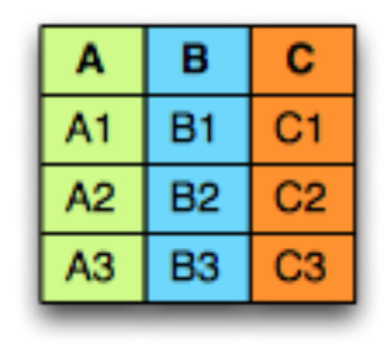  
  
在面向行的存储中，每列的数据依次排成一行，如下所示：  
  
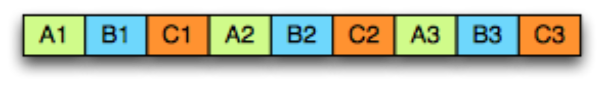  
  
而在面向列的存储中，相同列的数据存储在一起：  
  
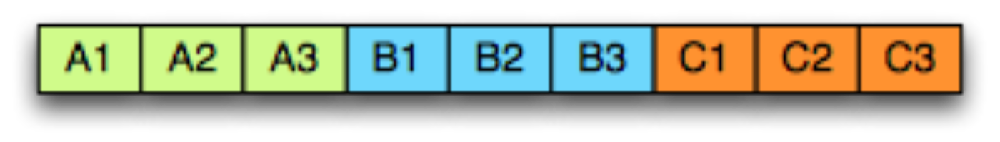  
  
显而易见，行存适用于数据整行读取场景，而列存适用于只读取部分列数据（统计分析等）场景。  
  
### parquet 数据组织结构和术语  
  
<b>Block (hdfs block)</b>：即指 HDFS Block，Parquet 的设计与 HDFS 完全兼容。Block 是 HDFS 文件存储的基本单位，HDFS 会维护一个 Block 的多个副本。在 Hadoop 1.x 版本中 Block 默认大小 64M，Hadoop 2.x 版本中默认大小为 128M。  
  
<b>File</b>：HDFS 文件，保存了该文件的元数据信息，但可以不包含实际数据（由 Block 保存）。  
  
<b>Row group</b>：按照行将数据划分为多个逻辑分区。一个 Row group（行组）由每个列的一个列块（Column Chunk）组成。  
  
<b>Column chunk</b>：一个列的列块，分布在行组(Row group)当中，同一个row group内的Column chunks在文件中保证是连续存储的(例如group 1: columnA chunk, columnB chunk, columnC chunk, ...; group 2: columnA chunk, columnB chunk, columnC chunk, ...;)。  
  
<b>Page</b>：一个列块(Column chunk)切分成多个 Pages（页面），概念上讲，页面是 Parquet 中最小的基础单元（就压缩和编码方面而言）。一个列块(Column chunk)中可以由多个类型的页面组成(例如字典page、数据page. 未来还能扩展更多的page type)。  
  
<b>Hierarchically</b>, a file consists of one or more row groups. A row group contains exactly one column chunk per column. Column chunks contain one or more pages.  
  
<b>并行化执行的基本单元: </b>  
- <b>MapReduce</b> - File/Row Group（一个任务对应一个文件或一个行组）  
- <b>IO</b> - Column chunk（任务中的 IO 以列块为单位进行读取）  
- <b>Encoding/Compression</b> - Page（编码格式和压缩一次以一个页面为单位进行）  
  
<b>配置建议: </b>  
  
<b>行组大小（Row group size）</b>：更大的行组允许更大的列块，这使得可以执行更大的顺序 IO。不过更大的行组需要更大的写缓存。Parquet 建议使用较大的行组（512MB-1GB）。此外由于可能需要读取整个行组，因此最好一个行组能完全适配一个 HDFS Block。因此，HDFS 块大小也需要相应的设置更大。一个较优的读取配置为：行组大小 1GB，HDFS 块大小 1GB，每个 HDFS 文件对应 1 个 HDFS 块。  
  
<b>数据页大小（Data page size）</b>：数据页应视为不可分割的，因此较小的数据页可实现更细粒度的读取（例如单行查找）。但较大的页面可以减少空间的开销（减少 page header 数量）和潜在的较少的解析开销（处理 headers）。Parquet 建议的页面大小为 8KB。  
  
  
### parquet 索引  
  
parquet的范围索引有点类似PG的brin, 支持等值、范围、大于、小于等查询. 实际上就是存储每个page里面列的边界值(例如 `pageN:min(column_value),max(column_value) , pageM , ...` ), 在筛选数据时, 对于已排序字段, 不需要扫描整个brin的内容, 可以使用二分法在brin中进行快速查找, 找到满足条件的pages的offset在parquet file中进行快速访问. 对于非排序字段就和PG brin索引一样扫描整个索引内容来得到满足条件的pages的offset.    
  
parquet的bloom索引有点类似PG的bloom索引, bloom data也在parquet文件末尾, 但是存放在column index的前面.  通过 bloom filter 可以支持等于、不等于查询. 由于是通过少量bit占位来实现的失真存储, 所以不等于一定为真, 等于则可能为假.      
  
关于bloom,brin更详细的原理可以阅读:    
- [《PostgreSQL bloom 索引原理》](../202011/20201128_04.md)    
- [《PostgreSQL 9.6 黑科技 bloom 算法索引，一个索引支撑任意列组合查询》](../201605/20160523_01.md)    
- [《重新发现PostgreSQL之美 - 14 bloom 布隆过滤器索引》](../202106/20210605_07.md)    
- [《PostgreSQL BRIN索引的pages_per_range选项优化与内核代码优化思考》](../201708/20170824_01.md)    
- [《PostgreSQL 物联网黑科技 - 瘦身几百倍的索引(BRIN index)》](../201604/20160414_01.md)    
- [《重新发现PostgreSQL之美 - 13 brin 时序索引》](../202106/20210605_02.md)    
  
  
### 嵌套类型的表达  
  
#### 1、schema 协议  
  
想要深入的了解 Parquet 嵌套类型存储格式首先需要理解它的数据模型。Parquet 采用了一个类似 Google Protobuf 的协议来描述存储数据的 schema。如下是 Parquet 数据 schema 的一个简单示例：  
  
```  
message AddressBook {  
  required string owner;  
  repeated string ownerPhoneNumbers;  
  repeated group contacts {  
    required string name;  
    optional string phoneNumber;  
  }  
}  
```  
  
schema 的最上层是 message(可以简单理解为字段名称)，里面可以包含一系列field。每个field都拥有 3 个属性：重复性（repetition）、类型（type）以及名称（name）。field类型可以是一个 group 或者原子类型（如 int、boolean、string 等），group 可以用来表示数据的嵌套结构。field的重复性有三种情况：  
- required：有且只有一次  
- optional：0 或 1 次  
- repeated：0 或多次  
  
这个模型非常的简洁。一些复杂的数据类型如：Map、List 和 Set 也可以用重复的field（repeated fields） + groups 来表达，因此也就不用再单独定义这些类型。  
  
采用 repeated field 表达 List 或者 Set 的示例：  
  
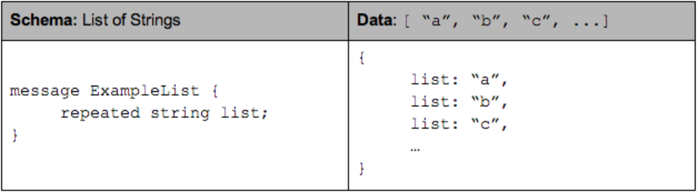  
  
采用 repeated group（包含 key 和 value，其中 key 是 required） 来表达 Map 的示例：  
  
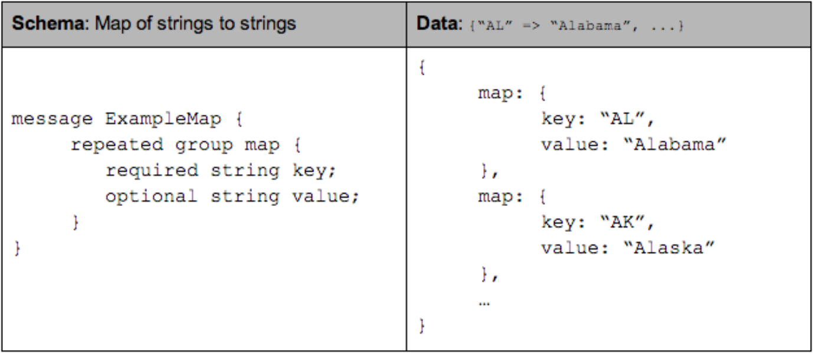  
  
#### 2、列式存储格式  
  
试想一下，为了使数据能够按列存储，对于一条记录（Record），首先要将其按列（Column）进行拆分。对于扁平（Flat）结构数据，拆分比较直观，一个字段即对应一列，而嵌套格式数据会复杂些。Dremel/Parquet 中，提出以树状层级的形式组织 schema 中的字段（Field），树的叶子结点对应一个原子类型字段，这样这个模型能同时覆盖扁平结构和嵌套结构数据（扁平结构只是嵌套结构的一种特例）。嵌套字段的完整路径使用简单的点分符号表示，如，contacts. name。  
  
AddressBook 例子以树状结构展示的样式:   
  
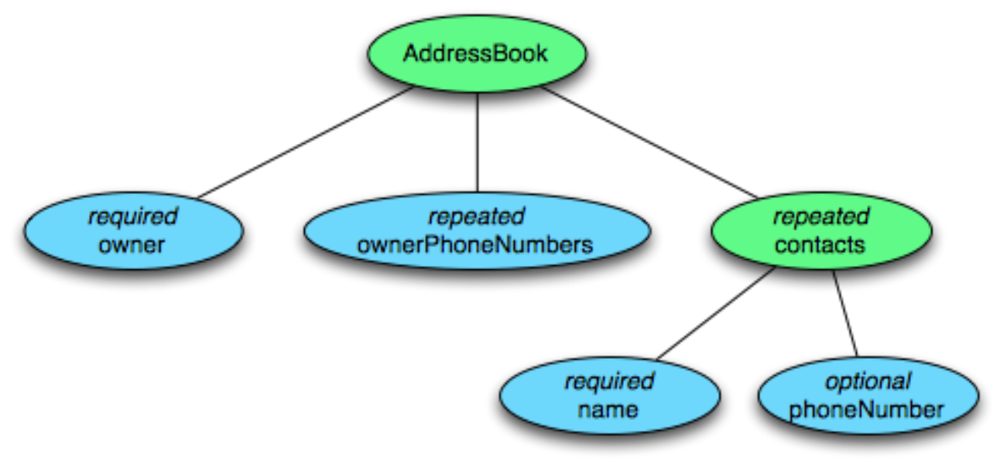  
  
列存连续的存储一个字段的值，以便进行高效的编码压缩及快速的读取。Dremel 中行存 vs 列存的图示：  
  
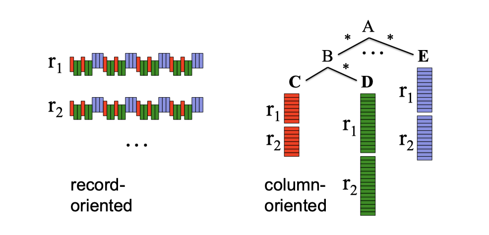  
  
#### 3、Repetition and Definition Levels  
  
嵌套格式数据的Repetition and Definition Levels是最难理解对部分, 我后面会再次解释, 先转载亮亮的文章原文.  
  
对于嵌套格式列存，除了按列拆分进行连续的存储，还需要能够“无损”的保留嵌套格式的结构化信息，以便正确的重建记录。  
  
只有field值不能表达清楚记录的结构。给定一个重复field的两个值，我们不知道此值是在嵌套路径中的什么“级别”被重复的（比如，这些值是来自两个不同的记录(row)，还是相同的记录(row)中两个重复的值）。同样的，给出一个缺失的可选字段，我们不知道整个路径有多少字段被显示定义了。  
  
Dremel 提出了 Repetition Level（重复级别）和 Definition Level（定义级别）两个概念，用以解决这个问题。并实现了记录中任意一个field的恢复都不需要依赖其它field，且可以对任意field子集按原始嵌套格式进行重建。  
  
我后面会用下图这个例子重新梳理讲解  
  
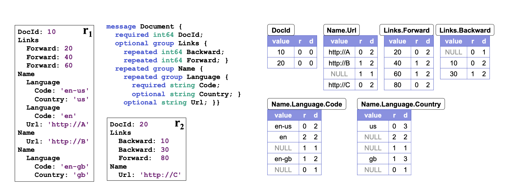  
  
<b>Repetition levels</b>：用以表示在该field路径上哪个节点进行了重复（at what repeated field in the field’s path the value has repeated）。  
  
一个重复field存储的列值，有可能来自不同记录，也可能由同一记录的不同层级节点重复导致。比如图 8 中的 Code field，他在 r1 记录中出现了 3 次，分别是field Name 和 Language 重复导致的，其中 Language 先重复了 2 次，Name field再重复了 1 次。  
  
Repetition Levels 采用数字代表重复节点的层级。根据树形层次结构，根结点为 0、下一层级为 1… 依次类推。根结点的重复暗含了记录的重复，也即 r=0 代表新记录的开始。required 和 optional field不需要 repetition level，只有可重复的field需要。因此，上述 Code field的 repetition levels 范围为 0-2。当我们从上往下扫描 r1 记录，首先遇到 Code 的值是“en-us”，由于它之前没有该field路径相关的field出现，因此 r=0；其次遇到“en”，是 Language 层级重复导致的，r=2；最后遇到“en-gb”，是 Name 层级重复导致的，因此 r=1。所以，Code field的 repetition levels 在 r1 记录中是“0,2,1”。  
  
需要注意的是，r1 记录中的第二个重复 Name，由于其不包含 Code field，为了区分“en-gb”值是来自记录中的第三个 Name 而不是第二个，我们需要在“en”和“en-gb”之间插入一个值“null”。由于它是 Name 级重复的，因此它的 r=1。另外还需要注意一些隐含信息，比如 Code 是 required field类型，因此一旦 Code 出现未定义，则隐含表明其上级 Language 也肯定未定义。  
  
<b>Definition Levels</b>：用以表示该field路径上有多少可选的field实际进行了定义（how many fields in p that could be undefined (because they are optional or repeated) are actually present）。  
  
光有 Repetition Levels 尚无法完全保留嵌套结构信息，考虑上述图 8 中 r1 记录的 Backward field。由于 r1 中未定义 Backward field，因此我们插入一个“null”并设置 r=0。但 Backward 的上级 Links field在 r1 中显式的进行了定义，null 和 r=0 无法再表达出这一层信息。因此需要额外再添加 Definition Levels 定义记录可选field出现的个数，Backward 的路径上出现 1 个可选field Links，因此它的 d=1。  
  
有了 Definition Levels 我们就可以清楚的知道该值出现在field路径的第几层，对未定义field的 null 和field实际的值为 null 也能进行区分。只有 optional 和 repeated field需要 Definition Levels 定义，因为 required field已经隐含了field肯定被定义（这可以减少 Definition Levels 需要描述的数字，并在一定程度上节省后续的存储空间）。另外一些其他的隐含信息：如果 Definition Levels 小于路径中 optional + repeated field的数量，则该field的值肯定为 null；Definition Levels 的值为 0 隐含了 Repeated Levels 也为 0（路径中没有 optional/repeated field或整个路径未定义）。  
   
<b> Definition 和 Repetition levels怎么存储? </b>    
  
对于同一个page里的所有column.field value's definition 和 repetition levels , 使用 RLE 进行编码, 节省空间.  
   
page里每个definition 、 repetition levels 需要用到几个bit? 取决于schema 定义, 也就是“这个page”(我个人认为是单个page范围内的schema定义, 因为放大到整个column chunk的pages好像没必要, 浪费计算资源了)里所有record展开后需要的最大的schema定义.  把 optional, required, repeated field 都完全展开就可以得到 max definition levels、 max repetition levels. 例如路径最长为7, 那么每个r/d 使用3个bit就够了.    
  
  
#### 4、striping and assembly 算法  
  
现在把 Repetition Levels 和 Definition Levels 两个概念一起考虑。还是沿用上述 AddressBook 例子。下表显示了 AddressBook 中每个field的最大重复和定义级别，并解释了为什么它们小于列的深度：  
  
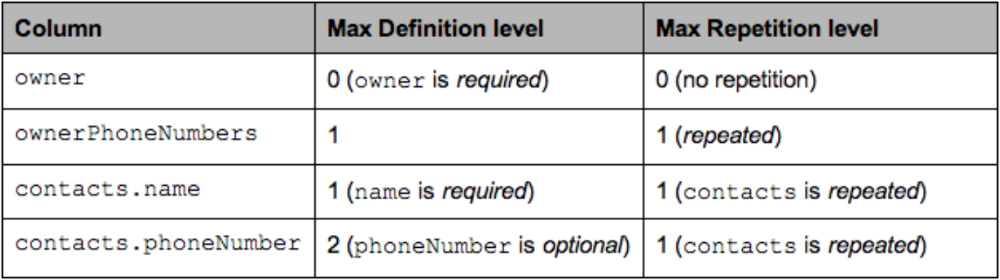  
  
假设这是两条真实的 AddressBook 数据：  
```  
AddressBook {  
  owner: "Julien Le Dem",  
  ownerPhoneNumbers: "555 123 4567",  
  ownerPhoneNumbers: "555 666 1337",  
  contacts: {  
    name: "Dmitriy Ryaboy",  
    phoneNumber: "555 987 6543",  
  },  
  contacts: {  
    name: "Chris Aniszczyk"  
  }  
}  
AddressBook {  
  owner: "A. Nonymous"  
}  
```  
  
我们采用 `contacts.phoneNumber` 字段(field)来演示一下拆解和重组记录的 striping and assembly 算法。  
  
仅针对 `contacts.phoneNumber` 字段投影后，数据具有如下结构：  
```  
AddressBook {  
  contacts: {  
    phoneNumber: "555 987 6543"  
  }  
  contacts: {  
  }  
}  
AddressBook {  
}  
```  
  
计算可得该该字段对应的数据如下（R =重复级别，D =定义级别）：  
  
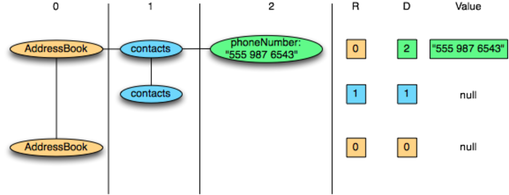  
  
因此我们最终存储的记录数据如下：  
- contacts.phoneNumber: “555 987 6543”  
    - new record: R = 0  
    - value is defined: D = maximum (2)  
- contacts.phoneNumber: null  
    - repeated contacts: R = 1  
    - only defined up to contacts: D = 1  
- contacts: null  
    - new record: R = 0  
    - only defined up to AddressBook: D = 0  
  
使用图表展示（注意其中的 null 值并不会实际存储，原因如上所说只要 Definition Levels 小于其 max 值即隐含该字段值为 null）：  
  
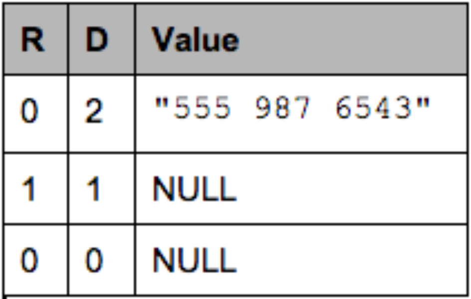  
  
在重组该记录时，我们重复读取该字段的值：  
- R=0, D=2, Value = “555 987 6543”:  
    - R = 0 means a new record. We recreate the nested records from the root until the definition level (here 2)  
    - D = 2 which is the maximum. The value is defined and is inserted.  
- R=1, D=1:  
    - R = 1 means a new entry in the contacts list at level 1.  
    - D = 1 means contacts is defined but not phoneNumber, so we just create an empty contacts.  
- R=0, D=0:  
    - R = 0 means a new record. we create the nested records from the root until the definition level  
    - D = 0 => contacts is actually null, so we only have an empty AddressBook  
  
#### 5、Parquet 文件格式  
  
Parquet 文件格式是自解析的，采用 thrift 格式定义的文件 schema 以及其他元数据信息一起存储在文件的末尾。  
  
文件存储格式示例：  
```  
4-byte magic number "PAR1"
<Column 1 Chunk 1>
<Column 2 Chunk 1>
...
<Column N Chunk 1>
<Column 1 Chunk 2>
<Column 2 Chunk 2>
...
<Column N Chunk 2>
...
<Column 1 Chunk M>
<Column 2 Chunk M>
...
<Column N Chunk M>
File Metadata
4-byte length in bytes of file metadata (little endian)
4-byte magic number "PAR1" 
```  
  
整个文件（表）有 N 个列，划分成了 M 个行组(row group)，每个行组(row group)里每个列都有一个 Chunk, 并且column chunk连续存储。文件的元数据信息存储在数据之后，包含了所有列块元数据信息的起始位置。读取的时候首先从文件末尾读取文件元数据信息，再在其中找到符合筛选条件的 Column Chunk 信息，并依次读取。文件元数据信息放在文件最后是为了方便数据依序一次性写入。   
   
将元数据与数据分离存储的设计。使得未来允许将列(column chunk)拆分为多个文件，或者使用独立的元数据文件(metadata file)表达多个row group文件的信息。  
  
具体的存储格式展示图：  
  
  
  
#### 6、元数据(metadata)信息  
   
Parquet 总共有 2 种类型的元数据：文件元数据 和 page header 元数据。所有元数据都采用 thrift 协议存储( https://github.com/apache/parquet-format/blob/master/src/main/thrift/parquet.thrift )。
   
file metadata 存储在文件末尾, 对应 FileMetaData 数据结构如下,   
```
/**
 * Description for file metadata
 */
struct FileMetaData {
  /** Version of this file **/
  1: required i32 version

  /** Parquet schema for this file.  This schema contains metadata for all the columns.
   * The schema is represented as a tree with a single root.  The nodes of the tree
   * are flattened to a list by doing a depth-first traversal.
   * The column metadata contains the path in the schema for that column which can be
   * used to map columns to nodes in the schema.
   * The first element is the root **/
  2: required list<SchemaElement> schema;

  /** Number of rows in this file **/
  3: required i64 num_rows

  /** Row groups in this file **/
  4: required list<RowGroup> row_groups

  /** Optional key/value metadata **/
  5: optional list<KeyValue> key_value_metadata

  /** String for application that wrote this file.  This should be in the format
   * <Application> version <App Version> (build <App Build Hash>).
   * e.g. impala version 1.0 (build 6cf94d29b2b7115df4de2c06e2ab4326d721eb55)
   **/
  6: optional string created_by

  /**
   * Sort order used for the min_value and max_value fields in the Statistics
   * objects and the min_values and max_values fields in the ColumnIndex
   * objects of each column in this file. Sort orders are listed in the order
   * matching the columns in the schema. The indexes are not necessary the same
   * though, because only leaf nodes of the schema are represented in the list
   * of sort orders.
   *
   * Without column_orders, the meaning of the min_value and max_value fields
   * in the Statistics object and the ColumnIndex object is undefined. To ensure
   * well-defined behaviour, if these fields are written to a Parquet file,
   * column_orders must be written as well.
   *
   * The obsolete min and max fields in the Statistics object are always sorted
   * by signed comparison regardless of column_orders.
   */
  7: optional list<ColumnOrder> column_orders;

  /** 
   * Encryption algorithm. This field is set only in encrypted files
   * with plaintext footer. Files with encrypted footer store algorithm id
   * in FileCryptoMetaData structure.
   */
  8: optional EncryptionAlgorithm encryption_algorithm

  /** 
   * Retrieval metadata of key used for signing the footer. 
   * Used only in encrypted files with plaintext footer. 
   */ 
  9: optional binary footer_signing_key_metadata
}
```
  
data page header存储在每个data page头部, 存储了该页面的encode、统计数据(可选)等信息, 如下  
```
/**
 * New page format allowing reading levels without decompressing the data
 * Repetition and definition levels are uncompressed
 * The remaining section containing the data is compressed if is_compressed is true
 **/
struct DataPageHeaderV2 {
  /** Number of values, including NULLs, in this data page. **/
  1: required i32 num_values
  /** Number of NULL values, in this data page.
      Number of non-null = num_values - num_nulls which is also the number of values in the data section **/
  2: required i32 num_nulls
  /**
   * Number of rows in this data page. Every page must begin at a
   * row boundary (repetition_level = 0): rows must **not** be
   * split across page boundaries when using V2 data pages.
   **/
  3: required i32 num_rows
  /** Encoding used for data in this page **/
  4: required Encoding encoding

  // repetition levels and definition levels are always using RLE (without size in it)

  /** Length of the definition levels */
  5: required i32 definition_levels_byte_length;
  /** Length of the repetition levels */
  6: required i32 repetition_levels_byte_length;

  /**  Whether the values are compressed.
  Which means the section of the page between
  definition_levels_byte_length + repetition_levels_byte_length + 1 and compressed_page_size (included)
  is compressed with the compression_codec.
  If missing it is considered compressed */
  7: optional bool is_compressed = true;

  /** Optional statistics for the data in this page **/
  8: optional Statistics statistics;
}
```
   
具体信息如下所示：  
  
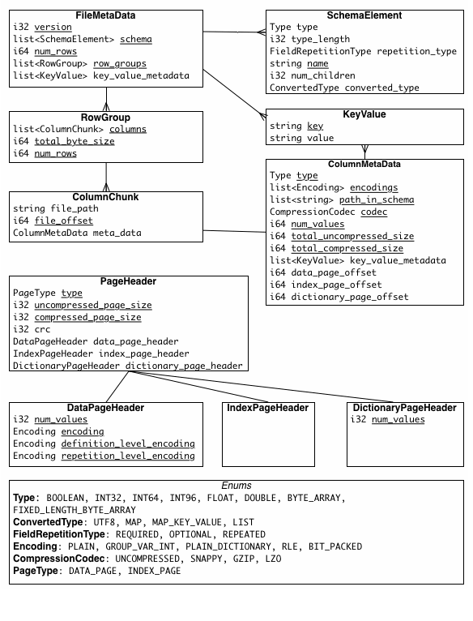  
    
目前支持3类page type, 分别位于文件中的不同位置:   
- data page
- index page
- dictionary page
  
#### 7、Parquet 数据类型  
  
在实现层级上，Parquet 只保留了最精简的部分数据类型，以方便存储和读写。在其上有逻辑类型（Logical Types）以供扩展，比如：逻辑类型 strings 就映射为带有 UTF8 标识的二进制 byte arrays 进行存储。  
  
Types：  
- BOOLEAN: 1 bit boolean  
- INT32: 32 bit signed ints  
- INT64: 64 bit signed ints  
- INT96: 96 bit signed ints  
- FLOAT: IEEE 32-bit floating point values  
- DOUBLE: IEEE 64-bit floating point values  
- BYTE_ARRAY: arbitrarily long byte arrays.
- FIXED_LEN_BYTE_ARRAY: fixed length byte arrays
  
逻辑类型是在以上基础类型之上封装的类型, 更多说明请参考：[LogicalTypes.md](https://github.com/apache/parquet-format/blob/master/LogicalTypes.md)。  
  
  
#### 8、Column chunks 存储  
  
Column chunks 由一个个 Pages 组成. column chunk可以部分或完全用dictionary编码(也就是把column chunk中出现次数很多的/很大的value存储到dictionary page, 在data page里仅值存储字典的序号.)。这意味着实际值以字典序号保存在数据页中，而不是将实际值存储在data page内, 可以节省空间。字典页(dictionary page)必须放在的column chunk的第一个位置。在一个列块(column chunk)中最多只能放置一个字典页(dictionary page), 那么意味着如果该column的选择性很差(distinct value很多), 一个字典页可能存不下所有可能的value, 所以只能部分进行dictionary编码。   
   
dictionary 也可以用来跳过data page scan.   
    
但是对于选择性很差(distinct value很多)的column, 可以使用bloom filter data来解决brin索引过滤效果差问题. 同时可以用来解决非ordered column 索引过滤效果差的问题.     
   
parquet file 还支持可选的 column index，允许reader更有效地跳过不需要的页面。详见[PageIndex](https://github.com/apache/parquet-format/blob/master/PageIndex.md)。     
   
编码参考:       
- [Encodings.md](https://github.com/apache/parquet-format/blob/master/Encodings.md)   
  
#### 9、Data Page
https://parquet.apache.org/docs/file-format/data-pages/   
  
For data pages, the 3 pieces of information are encoded back to back, after the page header. No padding is allowed in the data page.   
  
Data Page 数据结构:     
- Page header. The value of uncompressed_page_size specified in the header is for all the next 3 pieces combined.  
- 1 repetition levels data  
    - 可选部分, based on the schema definition. If the column is not nested (i.e. the path to the column has length 1), we do not encode the repetition levels (it would always have the value 1). 
- 2 definition levels data  
    - 可选部分, based on the schema definition. For data that is required, the definition levels are skipped (if encoded, it will always have the value of the max definition level).   
- 3 encoded values 
    - 必须, For example, in the case where the column is non-nested and required, the data in the page is only the encoded values. 
  
#### 10、Data Page Encoding  
  
数据编码的实现大部分和原理部分所阐述的一致，这里不再重复说明，更多细节可参考：[Encodings.md](https://github.com/apache/parquet-format/blob/master/Encodings.md)。   
  
#### 11、Data Page 压缩
  
https://parquet.apache.org/docs/file-format/data-pages/compression/  
  
Parquet允许在每个列上指定不同的压缩方案，并且是面向未来的(通过协议扩展)，允许未来在实现时添加更多的编码方式。  
  
目前支持的压缩算法  
- SNAPPY
- GZIP
- LZOBROTLI
- LZ4(deprecated . advise users to switch to the newer, interoperable LZ4_RAW codec.)
- ZSTD
- LZ4_RAW
  
   
#### 12、Data Page & metadata 加密
   
包含敏感信息的Parquet文件可以通过加密机制进行保护，该机制对parquet文件的data和metadata进行加密，同时允许常规的Parquet功能（选择列、pushdown、编码和压缩）。   
   
详细参考:   
- https://parquet.apache.org/docs/file-format/data-pages/encryption/  
  
目标:  
- 通过加密保护Parquet数据和元数据，同时允许常规的Parquet功能（选择列、pushdown、编码和压缩）
- 实现“客户端”加密/解密（指“存储客户端”）。“存储服务器”不能看到明文数据、元数据或加密密钥。
- 利用经过身份验证的加密，允许客户端检查数据的完整性  — 确保文件（或文件部分）没有被错误的版本替换(防篡改)，或以其他方式被篡改。
- 允许为不同的列和页脚(metadata存放处, 包括metadata, bloom filter data, column index等)启用不同的加密密钥。
- 允许部分加密  — 只加密包含敏感数据的列。  
- 支持Parquet中支持的所有压缩和编码机制。
- 支持多种加密算法，满足不同的安全和性能要求。
- 启用两种元数据保护模式
    - 充分保护文件元数据
    - 部分保护文件元数据，允许访问加密文件中的未加密列。
- 最小化加密开销 - 就加密文件的大小和写/读操作的吞吐量而言。
      
#### 13、数据损坏和恢复  
  
如果文件元数据损坏，则整个文件将丢失。如果列元数据损坏，则该列块将丢失（但其他行组中该列的列块还可以使用）。如果 page header 损坏，则该列块中的剩余页面都将丢失。如果页面中的数据损坏，则该页面将丢失。较小的文件行组配置，可以更有效地抵抗损坏。  
  
可恢复性: 每次写入row group数据后, 读取前一个row group后面存储的meta信息, 与当前row group meta增量合并为一个新的meta(包含所有row group的信息), 写入当前row group文件末尾. 结合fsync文件持久化, 可以保证数据可靠性. 万一当前写入的meta损坏了, 可以通过找到之前row group的meta, 从而回复之前的所有row group的数据.    
  
#### 14、bloom filter
https://parquet.apache.org/docs/file-format/bloomfilter/    
    
https://github.com/apache/parquet-format/blob/master/BloomFilter.md    
    
当列里的distinct值非常多(如订单号、昵称、手机号、身份证号这类字段), 数据分布边界不清晰(交叉多, 数据未排序)时, dictionary page和column index(brin)都无法对数据进行好的过滤. 因此有了bloom filter, 它可以实现高效的`=`、`in`过滤.        
     
SBBF(split block Bloom filter): 为N个data page给定一个固定大小的空间(例如每个distinct value对应N个bit, 假设有1万个distinct value, 每value对应10bit, 则需要100000 bits的空间), 可以把这个空间简称为SBBF.      
  
one or N pages -> map to one bloom block   (  Each block is 256 bits, broken up into eight contiguous “words”, each consisting of 32 bits. Each word is thought of as an array of bits; each bit is either “set” or “not set”.  )  
    
通过block_insert将column value映射到某些位置的bit中, 将这些位置的bit都修改为1.     
```    
block_insert(IN page id, IN column value' hash) -> OUT void , BUT set bits in SBBF    
```    
     
block_check则反过来, 如果column value映射到某些位置的bit都为1, 返回true(存在), 否则返回false(不存在).  false一定为真, 说明没有insert过这个value.      
```    
block_check(IN SBBF, IN column value' hash) -> OUT true or false    
```    
    
在一个SBBF内, 原值无论多大、同一个值无论有多少条都只需要若干bit. bloom filter data非常省空间且高效. bloom filter data存储位于parquet文件末尾(foot)的column index前面.        
    
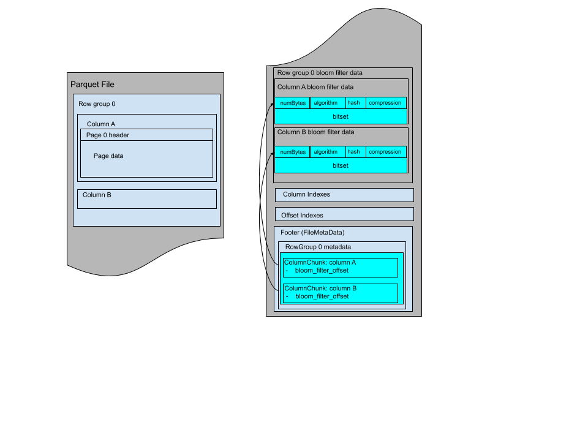  
  
Here are the Bloom filter definitions in thrift:  
```  
/** Block-based algorithm type annotation. **/  
struct SplitBlockAlgorithm {}  
/** The algorithm used in Bloom filter. **/  
union BloomFilterAlgorithm {  
  /** Block-based Bloom filter. **/  
  1: SplitBlockAlgorithm BLOCK;  
}  
  
/** Hash strategy type annotation. xxHash is an extremely fast non-cryptographic hash  
 * algorithm. It uses 64 bits version of xxHash.   
 **/  
struct XxHash {}  
  
/**   
 * The hash function used in Bloom filter. This function takes the hash of a column value  
 * using plain encoding.  
 **/  
union BloomFilterHash {  
  /** xxHash Strategy. **/  
  1: XxHash XXHASH;  
}  
  
/**  
 * The compression used in the Bloom filter.  
 **/  
struct Uncompressed {}  
union BloomFilterCompression {  
  1: Uncompressed UNCOMPRESSED;  
}  
  
/**  
  * Bloom filter header is stored at beginning of Bloom filter data of each column  
  * and followed by its bitset.  
  **/  
struct BloomFilterPageHeader {  
  /** The size of bitset in bytes **/  
  1: required i32 numBytes;  
  /** The algorithm for setting bits. **/  
  2: required BloomFilterAlgorithm algorithm;  
  /** The hash function used for Bloom filter. **/  
  3: required BloomFilterHash hash;  
  /** The compression used in the Bloom filter **/  
  4: required BloomFilterCompression compression;  
}  
  
struct ColumnMetaData {  
  ...  
  /** Byte offset from beginning of file to Bloom filter data. **/  
  14: optional i64 bloom_filter_offset;  
}  
```  
  
bloom filter 假true问题:  
  
后面Parquet pushdown章节的例子中提到了bloom存在假true的问题, 这个是bit conflict导致, 那conflict概率有多大? 这里给了一个例子和一张表格.  
  
使用1024个block(每个block 256 bits)并插入26214个哈希值(也就是26124个唯一值)的假true概率约为1.26%。这1024个block中的每一个都占用256位空间，因此总空间使用量为262,144 bits。这意味着空间位数与唯一值的比例是`10 bits : 1 value`。更多的distinct value会增加分母并降低比率，从而增加假true概率。例如，插入两倍的哈希值（52,428）将每个插入的哈希值的空间位数比例降低到`5 bits : 1 value`，并将假True误报概率提高到18%。插入一半的哈希值（13,107）将每个插入的哈希值的空间位数比率提高到`20 bits : 1 value`，并将假true概率降低到0.04%。  
  
Bits per distinct value |	假true概率   
---|---
6.0	| 10 %    
10.5|	1 %    
16.9|	0.1 %    
26.4|	0.01 %    
41|	0.001 %    
    
如果一个column chunk有100万条记录, 有10万个唯一值, 如果需要将假true概率维持在`0.1 %`内, 需要多少bits?  查上面这个表得到 `16.9 * 100000 = 169万 bits = 1690000/256 = 6601 blocks`  
  
   
## 细说 Repetition and Definition Levels  
  
[ppt](20241015_01_doc_001.pptx)  
  
[excel](20241015_01_doc_002.xlsx)  
  
给出Document列的schema:  
```  
message Document {  
  required int64 DocID;  
  optional group Links {  
    repeated int64 Backward;  
    repeated int64 Forward; }  
  repeated group Name {  
    repeated group Language {  
      requited string Code;  
      optional string Country; }  
    optional string Url; }}  
```  
  
Row1:  
```  
DocID: 10  
Links  
  Forward: 20  
  Forward: 40  
  Forward: 60  
Name  
  Language   
    Code: 'en-us'  
    Country: 'us'  
  Language  
    Code: 'en'    
  Url: 'http://A'  
Name  
  Url: 'http://B'  
Name  
  Language   
    Code: 'en-gb'  
    Country: 'gb'  
```  
  
Row2:   
```  
DocID: 20  
Links  
  Backward: 10  
  Backward: 30  
  Forward: 80  
Name  
  Url: 'http://C'  
```  
  
由于Document列是树状结构, 得到所有field的路径:  
```  
DocID  
Name.Url  
Links.Forward  
Links.Backward  
Name.Language.Code  
Name.Language.Country  
```  
  
<b>Repetition levels：</b>    
  
术语解释: （at what repeated field in the field’s path the value has repeated）.   
   
计算方法: 
- 把每个repeated field想象成1个bit位, 在该field路径中出现过的repeated field都设置为1.   
- 如何计算Repetition levels:   
    - 当前value的路径与上一个value的路径“bitAnd”计算, 得到sum(1). 即:    
        - 在当前路径中哪个repeated节点发生了重复.   
    - 新Row第一次出现的值repetition levels始终为0. 因为新的Row第一次出现的值没有上一个可比较的value, 所以相交始终得到0. (只要repeated=0, 说明这是新Row)    
  
为什么要填NULL?  
- 如上`Row1`和`Row2`的数据, 从上至下扫描数据时, 如果“端节点field”值缺失, 但是在“从顶节点到端节点field”的完整路径(也就是下面2张excel表截图中每个粗框内的第1行第1列指出的路径)中的上层field(或者上上层, 上上...上层 field)有值, 则需要对缺失节点(field)填充NULL.       
  
下图中标黄的为repeated field, 与计算Repetition levels相关  
  
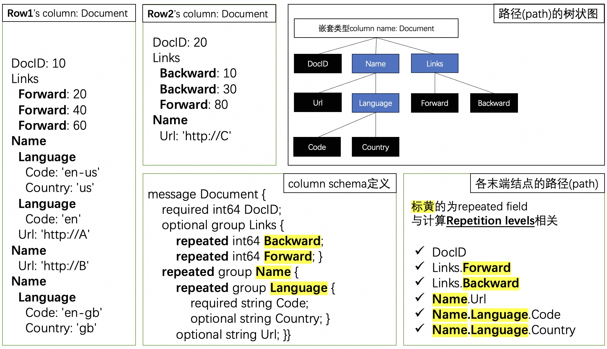  
  
<b>Definition levels: </b>   
   
计算方法:  
- 路径中有几个optional或repeated field?(不含被迫填充NULL的field)  
  
下标黄的为repeated及optional field, 与计算Definition levels相关  
  
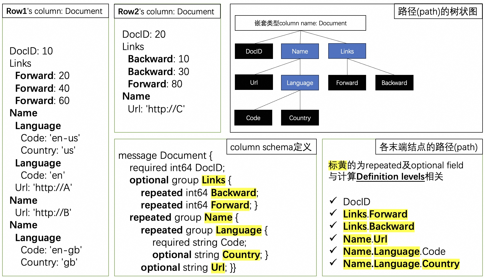  
  
Repetition level 和 Definition levels 计算例子如下表格.    
  
  
  
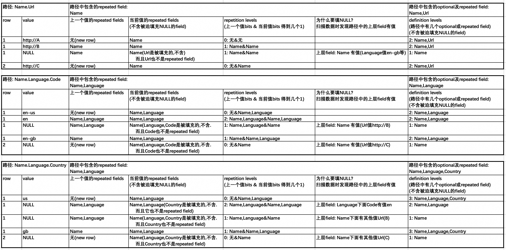  
   
<b> repetition_level_histogram 和 definition_level_histograms 表示data page内每一级有多少条记录. </b>   
  
每个column chunk的每个data page的repetition_level_histogram 和 definition_level_histogram 存储在column index里面(column index存放于parquet file末尾, 所有row group的后面).   
  
repetition_level_histogram :   
  
假设 column chunk所有page包含的数据的repetition level的最大值为: `max_repetition_level`   
  
1个column chunk需要多少空间存储repetition_level_histograms?   
- `(N Data Pages * (max_repetition_level + 1) * i64`  ;  例如某column chunk有`1000`个data page, `max_repetition_level=3`, 那么这个column chunk需要空间: `1000*(3+1)*i64`      
  
data page 1's repetition_level_histogram , 每级用1个i64类型表达如下内容:    
- 0(0级,没有repetition field有填充值): 该data page内共有a条记录没有repetition field有填充值  
- 1(1级,路径中有1个repetition field有填充值): 该data page内共有b条记录路径中有1个repetition field有填充值  
- 2(2级,路径中有2个repetition field有填充值): 该data page内共有c条记录路径中有2个repetition field有填充值  
- 3(3级,路径中有3个repetition field有填充值): 该data page内共有d条记录路径中有3个repetition field有填充值  
  
data page 2's repetition_level_histogram , 每级用1个i64类型表达如下内容:    
- 0(0级): w条  
- 1(1级): x条  
- 2(2级): y条  
- 3(3级): z条  
  
data page 3's repetition_level_histogram , 每级用1个i64类型表达如下内容:    
- ...  
  
data page N's repetition_level_histogram , 每级用1个i64类型表达如下内容:    
- 0(0级): ?条  
- 1(1级): ?条  
- 2(2级): ?条  
- 3(3级): ?条  
  
SizeStatistics  
```  
/**  
 * A structure for capturing metadata for estimating the unencoded,  
 * uncompressed size of data written. This is useful for readers to estimate  
 * how much memory is needed to reconstruct data in their memory model and for  
 * fine grained filter pushdown on nested structures (the histograms contained  
 * in this structure can help determine the number of nulls at a particular  
 * nesting level and maximum length of lists).  
 */  
struct SizeStatistics {  
   /**  
    * The number of physical bytes stored for BYTE_ARRAY data values assuming  
    * no encoding. This is exclusive of the bytes needed to store the length of  
    * each byte array. In other words, this field is equivalent to the `(size  
    * of PLAIN-ENCODING the byte array values) - (4 bytes * number of values  
    * written)`. To determine unencoded sizes of other types readers can use  
    * schema information multiplied by the number of non-null and null values.  
    * The number of null/non-null values can be inferred from the histograms  
    * below.  
    *  
    * For example, if a column chunk is dictionary-encoded with dictionary  
    * ["a", "bc", "cde"], and a data page contains the indices [0, 0, 1, 2],  
    * then this value for that data page should be 7 (1 + 1 + 2 + 3).  
    *  
    * This field should only be set for types that use BYTE_ARRAY as their  
    * physical type.  
    */  
   1: optional i64 unencoded_byte_array_data_bytes;  
   /**  
    * When present, there is expected to be one element corresponding to each  
    * repetition (i.e. size=max repetition_level+1) where each element  
    * represents the number of times the repetition level was observed in the  
    * data.  
    *  
    * This field may be omitted if max_repetition_level is 0 without loss  
    * of information.  
    **/  
   2: optional list<i64> repetition_level_histogram;  
   /**  
    * Same as repetition_level_histogram except for definition levels.  
    *  
    * This field may be omitted if max_definition_level is 0 or 1 without  
    * loss of information.  
    **/  
   3: optional list<i64> definition_level_histogram;  
}  
```  
  
## 细说 Column Index & Offset Index          
     
https://parquet.apache.org/docs/file-format/pageindex/          
      
https://github.com/apache/parquet-format/blob/master/PageIndex.md      
      
https://github.com/apache/parquet-format/blob/master/src/main/thrift/parquet.thrift      
          
每个Column Chunk都可以创建Column Index、Offset Index, 这两个index都是可选的. Offset Index可单独创建, Column Index则必须和Offset Index一同创建.     
          
parquet index的设计目标       
- 通过判断值是否可能落入min value,max value bound直接访问对应data page，提高范围扫描和点查找的I/O效率。特别是:     
    - 对row group的sorted column进行单行查找时，可以精确到目标数据页。  -- `where col = ?   -- col 在该row group内为sorted column`      
    - sorted column上的范围扫描只需要读取包含相关数据的确切数据页。      -- `where col between ? and ?   -- col 在该row group内为sorted column`      
- 提高其他选择性扫描的I/O效率：如果我们在非排序列上有一个非常有选择性的谓词，那么对于其他检索列，我们应该只需要访问包含匹配行的数据页。  ```-- 例如 select a from tbl where b = ? -- b为非排序列但是distinct value很多.  ```       
- 没有选择性谓词的扫描无需额外的解码工作，例如，全行组(row group)扫描。如果reader确定不需要读取索引数据，则不会产生任何开销。    
- 排序列的page index通过仅存储页之间的边界元素来使用最小的存储空间。    
       
    
非设计目标    
- Support for the equivalent of secondary indices, i.e., an index structure sorted on the key values over non-sorted data.    (无需支持)      
          
     
什么是排序列(sorted column/ordered column)?      
- 就是在该column chunk内, 这列的logical value是物理上有序存放的, 如page2的value肯定大于等于page1(正序), 或者反过来(倒序).    
    
ordered column的正反序使用BoundaryOrder表示:     
```    
/**    
 * Enum to annotate whether lists of min/max elements inside ColumnIndex    
 * are ordered and if so, in which direction.    
 */    
enum BoundaryOrder {    
  UNORDERED = 0;    
  ASCENDING = 1;    
  DESCENDING = 2;    
}    
```    
    
data page寻址结构:      
```    
struct PageLocation {          
  /** Offset of the page in the file **/          
  1: required i64 offset          
          
  /**          
   * Size of the page, including header. Sum of compressed_page_size and header          
   * length          
   */          
  2: required i32 compressed_page_size          
          
  /**          
   * Index within the RowGroup of the first row of the page. When an          
   * OffsetIndex is present, pages must begin on row boundaries          
   * (repetition_level = 0).          
   */          
  3: required i64 first_row_index          
}          
```    
    
    
OffsetIndex, 可以独立于ColumnIndex创建, 用于存储每个data page第一条记录在文件中的偏移量(offset)    
```    
/**          
 * Optional offsets for each data page in a ColumnChunk.          
 *          
 * Forms part of the page index, along with ColumnIndex.          
 *          
 * OffsetIndex may be present even if ColumnIndex is not.          
 */          
struct OffsetIndex {          
  /**          
   * PageLocations, ordered by increasing PageLocation.offset. It is required          
   * that page_locations[i].first_row_index < page_locations[i+1].first_row_index.          
   */          
  1: required list<PageLocation> page_locations          
  /**          
   * Unencoded/uncompressed size for BYTE_ARRAY types.          
   *          
   * See documention for unencoded_byte_array_data_bytes in SizeStatistics for          
   * more details on this field.          
   */          
  2: optional list<i64> unencoded_byte_array_data_bytes          
}          
```    
      
      
ColumnIndex 主要存储了每个page的min,max logical value, 同时还包含了一些其他信息, 例如 该page是否全为null值, 有多少条null值, definition level和repetition level柱状图信息等.      
```    
/**          
 * Optional statistics for each data page in a ColumnChunk.          
 *          
 * Forms part the page index, along with OffsetIndex.          
 *          
 * If this structure is present, OffsetIndex must also be present.          
 *          
 * For each field in this structure, <field>[i] refers to the page at          
 * OffsetIndex.page_locations[i]          
 */          
struct ColumnIndex {          
  /**          
   * A list of Boolean values to determine the validity of the corresponding          
   * min and max values. If true, a page contains only null values, and writers          
   * have to set the corresponding entries in min_values and max_values to          
   * byte[0], so that all lists have the same length. If false, the          
   * corresponding entries in min_values and max_values must be valid.          
   */          
  1: required list<bool> null_pages          
          
  /**          
   * Two lists containing lower and upper bounds for the values of each page          
   * determined by the ColumnOrder of the column. These may be the actual          
   * minimum and maximum values found on a page, but can also be (more compact)          
   * values that do not exist on a page. For example, instead of storing ""Blart          
   * Versenwald III", a writer may set min_values[i]="B", max_values[i]="C".          
   * Such more compact values must still be valid values within the column's          
   * logical type. Readers must make sure that list entries are populated before          
   * using them by inspecting null_pages.          
   */          
  2: required list<binary> min_values          
  3: required list<binary> max_values          
          
  /**          
   * Stores whether both min_values and max_values are ordered and if so, in          
   * which direction. This allows readers to perform binary searches in both          
   * lists. Readers cannot assume that max_values[i] <= min_values[i+1], even          
   * if the lists are ordered.          
   */          
  4: required BoundaryOrder boundary_order          
          
  /**          
   * A list containing the number of null values for each page           
   *          
   * Writers SHOULD always write this field even if no null values          
   * are present or the column is not nullable.          
   * Readers MUST distinguish between null_counts not being present           
   * and null_count being 0.          
   * If null_counts are not present, readers MUST NOT assume all           
   * null counts are 0.          
   */          
  5: optional list<i64> null_counts          
          
  /**          
   * Contains repetition level histograms for each page          
   * concatenated together.  The repetition_level_histogram field on          
   * SizeStatistics contains more details.          
   *          
   * When present the length should always be (number of pages *          
   * (max_repetition_level + 1)) elements.          
   *          
   * Element 0 is the first element of the histogram for the first page.          
   * Element (max_repetition_level + 1) is the first element of the histogram          
   * for the second page.          
   **/          
   6: optional list<i64> repetition_level_histograms;          
   /**          
    * Same as repetition_level_histograms except for definitions levels.          
    **/          
   7: optional list<i64> definition_level_histograms;          
}          
```    
      
    
       
    
column index和offset index 挨着存储, 存放于文件末尾, metadata的前面:     
```  
column index  
  row group 0  
    column 0, page 0  
    column 0, page 1  
    column 0, page 2  
    ...  
    column 0, page n  
    column 1, page 0  
    column 1, page 1  
    column 1, page 2  
    ...  
    column 1, page n  
    column 2, page 0  
    ...  
    column n, page 0  
    column n, page 1  
    column n, page 2  
  row group 1  
  ...  
  row group m  
offset index  
  row group 0  
    column 0, page 0  
    column 0, page 1  
    column 0, page 2  
    ...  
    column 0, page n  
    column 1, page 0  
    column 1, page 1  
    column 1, page 2  
    ...  
    column 1, page n  
    column 2, page 0  
    ...  
    column n, page 0  
    column n, page 1  
    column n, page 2  
  row group 1  
  ...  
  row group m  
file metadata  
```  
    
   
## DEMO   
demo可以参考duckdb中parquet的使用  
- [《PG被DuckDB碾压,该反省哪些方面? DuckDB v0.10.3 在Macmini 2023款上的tpch性能表现如何? PostgreSQL使用duckdb_fdw 的tpch加速性能表现如何?》](../202405/20240525_01.md)    
- [《DuckDB 采用外部 parquet 格式存储 - tpch 测试 - in_memory VS in_parquet》](../202209/20220901_05.md)    
- [《DuckDB 数据库的数据能不能超出内存限制? 以及推荐的使用方法 - parquet》](../202209/20220901_03.md)    
- [《DuckDB 读写 Parquet 文件 - 同时支持远程s3, oss, http等parquet文件读写》](../202209/20220901_01.md)    
- [《DuckDB parquet 分区表 / Delta Lake(数据湖) 应用》](../202209/20220905_01.md)    
- [《DuckDB DataLake 场景使用举例 - aliyun OSS对象存储parquet》](../202210/20221026_01.md)    
- [《德说-第140期, duckdb+容器+parquet+对象存储, 实现SaaS场景, 低代码拖拉拽多维度实时分析 降本提效》](../202209/20220913_02.md)    
  
## 扩展问题    
### 1、dictionary 也可以用来跳过data page scan?     
 
注意: 使用dictionary实现pushdown的前提是“distinct较少, 该page里的值都在dictionary page里”.     
   
例子1, 不可以直接skip 的 data page:   
   
如果data page里有digoal(原始值), 但是dictionary里面没有将digoal字典化, 你如果只从dictionary page里的value判断所有page里都没有digoal, 然后就跳过所有scan, 直接返回false, 那么查询结果就不对了.    
   
例子2:   
```
select * from parquet_table where name=digoal; 
```
   
例子2, 可以skip 的 data page有哪些? :   
- 1、通过 column index 获取到满足范围条件的page, 例如: name_min = 'abc', name_max = 'hello'.   
- 2、还能缩小范围吗? 可以: 获取dictionary page内的值, 如果无digoal.    
- 3、data page 内name的值只有dictionary内的value. (没有未字典化的值) ;    -- 假设在column index里用1个bit存储了这个信息(该page是否只包含dictionary page内的值).   PS: 经过对[parquet.thrift](https://github.com/apache/parquet-format/blob/master/src/main/thrift/parquet.thrift) 的分析, 貌似在column index内没有这个信息, 如果能扩展的话就更好了.   
- 4、扫描时可以跳过3的data page  
   
### 2、parquet的pushdown   
  
1、对于仅存储data page min,max value bound的brin索引, 如果数据边界清晰(交叉少)时, 过滤效果就很好.    
```  
data page 1: [1,10]  
data page 2: [20,100]  
data page 3: [101,200]  
data page 4: [201,1000]  
data page 5: [1001,2000]  
  
where id=90 -- 只需要访问data page 2  
where id>90 and id<200 -- 只需要访问data page 2,3  
```  
  
2、对于仅存储data page min,max value bound的brin索引, 如果数据边界不清晰(交叉多)时, 过滤效果就很差.    
```  
data page 1: [1,100]  
data page 2: [2,110]  
data page 3: [5,100]  
data page 4: [90-200]  
data page 5: [50-150]  
  
where id=90, 上面的page都要被访问.   
```  
  
3、distinct值多, 数据边界不清晰(交叉多, 数据未排序)的情况, 如何实现高效的`=`、`in`过滤?      
  
使用 Bloom filter data 实现高效的`=`、`in`过滤.      
   
Bloom filter pushdown 例子:  
  
如果N个data page对应一个SBBF, 查找`col=?`时, 只要在block_check返回false就可以跳过这些data page.    
  
在block_check返回true时可能是假, 因为这个值映射到的bits可能是被其他若干个value占用的. 如  
```  
v1 1,3,5,7   
v2 2,4,5,8   
v3 7,9,10,11    
v4 1,9,13,15  
v5 3,16,17,18  
```  
  
假设v1没有insert过, 但是v2,v3,v4,v5都insert了, 这些值映射的bit位置包含了`1,3,5,7`, 所以block_check(v1)也会返回true, 此时实际上v1并不在其中. 这就是假true.    
  
所以bloom filter无法过滤`<>`,`not in`.  因为不管block_check返回true还是false, 都需要scan该data page.    
  
  
## 扩展阅读    
  
  
  
## 参考  
- Wiki: https://en.wikipedia.org/wiki/Apache_Parquet  
- 文档: https://parquet.apache.org/docs  
- 代码: https://github.com/apache/parquet-format  
- 代码: https://github.com/apache/parquet-format/blob/master/src/main/thrift/parquet.thrift  
- 代码: https://github.com/pixelsdb/pixels/tree/master/cpp   
- blog: https://arrow.apache.org/blog/2022/10/05/arrow-parquet-encoding-part-1  
- blog: https://arrow.apache.org/blog/2022/10/08/arrow-parquet-encoding-part-2  
- blog: https://arrow.apache.org/blog/2022/10/17/arrow-parquet-encoding-part-3  
- blog: [陈亮亮 一文讲透大数据列存标准格式 - Parquet](https://helloyoubeautifulthing.net/blog/2021/01/03/parquet-format/)  
- blog: [处理海量数据：列式存储综述（存储篇）](https://zhuanlan.zhihu.com/p/35622907)
- blog: https://github.com/julienledem/redelm/wiki/The-striping-and-assembly-algorithms-from-the-Dremel-paper   
- 论文: [Dremel: Interactive Analysis of WebScale Datasets](https://storage.googleapis.com/pub-tools-public-publication-data/pdf/36632.pdf)  
- 论文导读: [Dremel made simple with Parquet](https://blog.x.com/engineering/en_us/a/2013/dremel-made-simple-with-parquet)  
- 论文导读翻译: [经典论文翻译导读之《Dremel: Interactive Analysis of WebScale Datasets》](https://blog.csdn.net/macyang/article/details/8566105)  
  
  
#### [期望 PostgreSQL|开源PolarDB 增加什么功能?](https://github.com/digoal/blog/issues/76 "269ac3d1c492e938c0191101c7238216")
  
  
#### [PolarDB 开源数据库](https://openpolardb.com/home "57258f76c37864c6e6d23383d05714ea")
  
  
#### [PolarDB 学习图谱](https://www.aliyun.com/database/openpolardb/activity "8642f60e04ed0c814bf9cb9677976bd4")
  
  
#### [PostgreSQL 解决方案集合](../201706/20170601_02.md "40cff096e9ed7122c512b35d8561d9c8")
  
  
#### [德哥 / digoal's Github - 公益是一辈子的事.](https://github.com/digoal/blog/blob/master/README.md "22709685feb7cab07d30f30387f0a9ae")
  
  
#### [About 德哥](https://github.com/digoal/blog/blob/master/me/readme.md "a37735981e7704886ffd590565582dd0")
  
  

  
