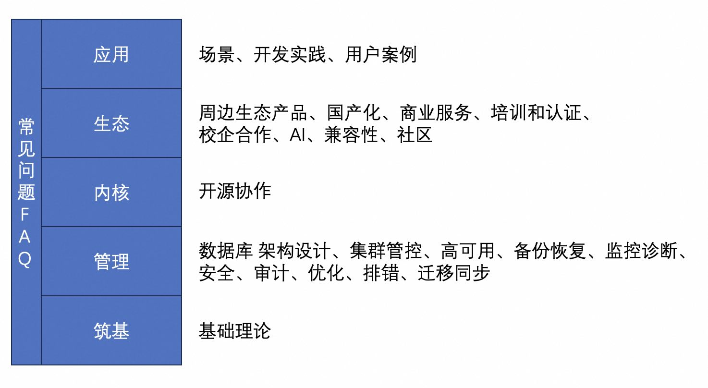

## 德说-第294期, 国产数据库厂商抓狂的痛点,暨 《数据库专家训练营》全国巡讲活动    
                                                                                        
### 作者                                                            
digoal                                                            
                                                                   
### 日期                                                                 
2024-10-28                                                           
                                                                
### 标签                                                              
PostgreSQL , PolarDB , DuckDB , 国产数据库厂商 , 内卷 , 商机 , 产品体验      
                                                                                       
----                                                                
                                                                              
## 背景      
国产数据库厂商都痛点很多, 例如手册不全面、生态不够完善、可以借助的工具较少、实践文档较少、案例较少、专家较少、遇到问题可以找到的资料较少、遇到报错信息不够详细、提供服务的厂商较少、培训和认证体系不够健全、有一些产品的定位不算很清晰、维持生存的压力较大等.     
  
但是个人认为令其抓狂的痛点就2个.    
  
### 国产数据库厂商的痛点     
- 商机在哪?   
- 如何让决策层选择自己的产品?   
  
过国测、各行业标准这些属于针对特定行业/特定时间窗口商机的痛, 个人认为不具备普适性.    
  
### 国产数据库的很多动作核心就是围绕获客这件事情  
- 连接用户  
- 了解用户场景  
- 了解用户痛点  
- 了解用户需求  
- 连接用户决策层  
- 证明自己的产品在技术商务等方面比别家更适合用户     
  
  
虽然我不是钓鱼佬, 不过钓鱼和获客思路很相似:    
- 跟其他钓鱼佬打探一下哪里有鱼, 选择一条河/湖     
- 鱼儿喜欢且不影响生态, 钓鱼佬: 选择饵料、打窝、选择合适的钩子、上料等鱼上钩     
- 鱼儿讨厌且影响生态, 不讲武德: 电击、用毒、撒网、两头拉网沿河拦截     
  
不讲武德的数据库厂商就不提了.     
  
### 国产数据库厂商的痛点有解了?    
  
饵料: 《PostgreSQL中级专家训练营全国巡讲线下活动》    
  
目标: 培训1000名中级PG DBA     
  
深层次目标:   
- 连接用户  
- 了解用户场景  
- 了解用户痛点  
- 了解用户需求  
- 连接用户决策层(还得上其他饵料)  
- 证明自己的产品在技术商务等方面比别家更适合用户(还得上其他饵料)  
  
  
### 不过还需要回答几个问题  
为什么要以PostgreSQL为底子来讲?     
- PostgreSQL是大多数国产数据库的基石, 没人反对吧?  学PG对未来从事国产数据库相关的工作大有裨益.      
  
  
PostgreSQL书已经很多、网上材料也很多, 自学就是了, 为什么还要搞全国巡讲? 会有人来参加吗?    
- 网上分散的知识点很多, 体系化的少. 所谓基础不牢地动山摇啊, 要想往高处走, 还是需要打好基础.     
- 很多网上的资料没有设计动手环节, 晦涩难懂的知识点很难理解.    
- 看网上的材料/买书自学, 学习过程中遇到的问题无法和专家进行实时的交流.    
- 没有标准的测验, 学完也不知道自己掌握了多少. 也没有证书可以对外证明自己的能力.        
- 自学最大的问题是没有进入圈子, 无法在未来的学习中和同行交流, 影响未来的学习和职业发展.      
  
  
### 《PostgreSQL中级专家训练营全国巡讲线下活动》议程设想     
  
议程1 问题收集       
     
议程2 专家分享   
- 筑基: [基础理论](../202409/20240914_01.md)       
- 管理: 数据库 架构设计、集群管控、高可用、备份恢复、监控诊断、安全、审计、优化、排错、迁移同步      
- 内核: 开源协作      
- 生态: 上下游产品、周边生态产品、国产化、商业服务、培训和认证、校企合作、AI、兼容性、社区         
- 对照: 头部开源和商业产品精华对照     
- 应用: 场景、开发实践、用户案例、解决方案       
- 常见问题FAQ、动手实验(自备笔记本参与)        
  
    
    
议程3 大型用户实践分享       
    
议程4 测验和证书颁发    
    
议程5 互动交流, 形式方面可以增加竞技类刺激大家的参与        
    
议程6 建立PostgreSQL中级专家互助交流群    
    
    
大家有任何想法可以随时和我沟通. 同时强烈欢迎有兴趣的企业和朋友一起来推动这个事情.        
    
### 第1期设想
非常欢迎大家的参加和合作, 这个算半公益活动(对参会者免费, 并保证内容是纯纯的干货), 需要场地、小礼品的赞助支持, 如果有茶歇、晚宴的赞助就更佳了. 当然不能白赞助, 在保证内容纯纯干货的前提下可以谈权益互换.            
```
培训前调研:   
  问卷(https://www.wenjuan.com/): 姓名、职务、企业、使用了哪些数据库(产品、业务种类、规模等)、遇到较多的棘手问题(细节、业务背景、架构、复现方法等)、最想了解的内容/产品、其他        (凭问卷签到时领小礼物)     

议程:   
  8:30 ~ 9:00 签到       加入专家群, 凭调研问卷领取小礼物  (激励早来签到, 小礼品先到先得.  也可以现场填写会后领)      
  9:00 ~ 9:05 活动致辞    
  9:05 ~ 9:30 议程1      热身交流, 基于问卷调研 & 现场问答     
  9:30 ~ 10:00 议程2     实验环境搭建  -   Docker、PG、PolarDB       
  10:00 ~ 11:00 议程3    数据库筑基    -   存储结构、索引、扫描方法、类型和运算符、常用扩展插件     
  11:00 ~ 12:00 议程4    数据库应用优化技巧    -  重新发现数据库之美     
  13:00 ~ 14:00 议程5    大模型微调、RAG 实践   - 向量数据库应用 & 召回优化实践    
  14:00 ~ 15:00 议程6    国产数据库进阶 - PolarDB for PG 架构、开源部署、高可用、备份恢复、监控诊断优化、迁移实践、开源社区协作      
  15:00 ~ 16:00 议程7    数据库周边生态工具和解决方案  -  数据库管控、k8s、监控诊断自动优化、审计       
  16:00 ~ 16:30 议程8    xx用户数据库最佳实践 & 踩过的坑      -  一线用户经验分享  
  16:30 ~ 17:30 议程9    实验     -  议题 3~7 每个1个典型实验     
  17:30 ~ 18:15 议程10   测验 & 颁证    -   由开源社区签章  数据库专家认证 , 每本证书1个独立编号     
  18:15 ~ 自由交流    
```
   
#### 问卷调查
为了让活动越办越好, 让参与者的获得感更强, 希望大家可以认真的填写问卷. 微信扫码填写:       
     
  
    
    
## 参考资料  
  
### 一、PostgreSQL, Greenplum 学习视频    
    
1、视频下载链接： https://pan.baidu.com/s/1Q5u5NSrb0gL5-psA9DCBUQ   (提取码：5nox   如果链接失效请通知我, 谢谢)    
- PostgreSQL 9.3 数据库管理与优化 4天    
- PostgreSQL 9.3 数据库管理与优化 5天    
- PostgreSQL 9.3 数据库优化 3天    
- PostgreSQL 9.1 数据库管理与开发 1天    
- PostgreSQL 专题讲座    
    
2、[《2021-重新发现PG之美 系列 - 适合架构师与业务开发者》](../202105/20210526_02.md)    
3、[《2021-DB吐槽大会 系列 - 适合产品经理、架构师与内核开发者》](../202108/20210823_05.md)    
4、[《2020-PostgreSQL 应用场景最佳实践 - 适合架构师与业务开发者》](../202009/20200903_02.md)    
5、[《2020-PostgreSQL+MySQL 联合解决方案课程 - 适合架构师与业务开发者》](../202001/20200118_02.md)    
6、[《2019-PostgreSQL 2天体系化培训 - 适合DBA》](../201901/20190105_01.md)    
7、[《2017-PostgreSQL 应用场景实践 - 适合架构师与业务开发者》](../201805/20180524_02.md)    
8、[《2019-PG天天象上沙龙纪录 - 适合DBA》](../201801/20180121_01.md)    
9、[《2019-Oracle迁移到PostgreSQL - 适合DBA与业务开发者》](../201906/20190615_03.md)      
10、[《2021-Ask 德哥 系列 - 适合DBA与业务开发者》](../202109/20210928_01.md)      
11、[《2018-PG生态、案例、开发实践系列 - 适合架构师与业务开发者》](https://edu.aliyun.com/course/836/lesson/list)    
12、[《2018-阿里云POLARDB for Oracle|RDS for PPAS 讲解视频》](https://yq.aliyun.com/live/582)    
13、[《2022-每天5分钟,PG聊通透 - 系列1 - 热门问题》](../202112/20211209_02.md)     
14、[《2023-PostgreSQL|PolarDB 学习实验手册》](../202308/20230822_02.md)       
15、[《2023-PostgreSQL|PolarDB 永久免费实验环境》](https://developer.aliyun.com/adc/scenario/f55dbfac77c0467a9d3cd95ff6697a31)       
16、[《2024-开源PolarDB|PostgreSQL 应用开发者&DBA 公开课》](../202310/20231030_02.md)       
17、[《2023-PostgreSQL Docker镜像学习环境 ARM64版, 已集成热门插件和工具》](../202308/20230814_02.md)       
18、[《2023-PostgreSQL Docker镜像学习环境 AMD64版, 已集成热门插件和工具》](../202307/20230710_03.md)       
19、[《2024-应用开发者 数据库筑基课》](../202409/20240914_01.md)       
    
### 二、学习资料    
    
1、[《Oracle DBA 增值+转型 PostgreSQL 学习方法、路径》](../201804/20180425_01.md)     
2、[《PostgreSQL、Greenplum 技术+108个场景结合最佳实践《如来神掌》》](../201706/20170601_02.md)      
3、[《PostgreSQL 数据库安全指南 - 以及安全合规》](../201506/20150601_01.md)      
4、[《PostgreSQL 持续稳定使用的小技巧 - 最佳实践、规约、规范》](../201902/20190219_02.md)      
5、[《PostgreSQL DBA最常用SQL》](../202005/20200509_02.md)      
6、[《PostgreSQL 数据库开发规范》](../201609/20160926_01.md)      
7、[《企业数据库选型规则》](197001/20190214_01.md)      
8、[《PostgreSQL 规格评估 - 微观、宏观、精准 多视角估算数据库性能(选型、做预算不求人)》](../201709/20170921_01.md)      
9、[《数据库选型之 - 大象十八摸 - 致 架构师、开发者》](../201702/20170209_01.md)      
10、[《数据库选型思考(PostgreSQL,MySQL,Oracle)》](../201702/20170208_03.md)      
11、[《快速入门PostgreSQL应用开发与管理 - 1 如何搭建一套学习、开发PostgreSQL的环境》](../201704/20170411_01.md)      
12、[《快速入门PostgreSQL应用开发与管理 - 2 Linux基本操作》](../201704/20170411_02.md)      
13、[《快速入门PostgreSQL应用开发与管理 - 3 访问数据》](../201704/20170411_03.md)      
14、[《快速入门PostgreSQL应用开发与管理 - 4 高级SQL用法》](../201704/20170411_04.md)      
15、[《快速入门PostgreSQL应用开发与管理 - 5 数据定义》](../201704/20170411_05.md)      
16、[《快速入门PostgreSQL应用开发与管理 - 6 事务和锁》](../201704/20170412_01.md)      
17、[《快速入门PostgreSQL应用开发与管理 - 7 函数、存储过程和触发器》](../201704/20170412_02.md)      
18、[《快速入门PostgreSQL应用开发与管理 - 8 PostgreSQL 管理》](../201704/20170412_04.md)      
19、[PolarDB开源数据库高校工作室 发布《PostgreSQL+PolarDB开源数据库人才认证培训》教程+实验手册 下载](../202306/20230616_03.md)      
    
      
  
#### [期望 PostgreSQL|开源PolarDB 增加什么功能?](https://github.com/digoal/blog/issues/76 "269ac3d1c492e938c0191101c7238216")
  
  
#### [PolarDB 开源数据库](https://openpolardb.com/home "57258f76c37864c6e6d23383d05714ea")
  
  
#### [PolarDB 学习图谱](https://www.aliyun.com/database/openpolardb/activity "8642f60e04ed0c814bf9cb9677976bd4")
  
  
#### [PostgreSQL 解决方案集合](../201706/20170601_02.md "40cff096e9ed7122c512b35d8561d9c8")
  
  
#### [德哥 / digoal's Github - 公益是一辈子的事.](https://github.com/digoal/blog/blob/master/README.md "22709685feb7cab07d30f30387f0a9ae")
  
  
#### [About 德哥](https://github.com/digoal/blog/blob/master/me/readme.md "a37735981e7704886ffd590565582dd0")
  
  

  
