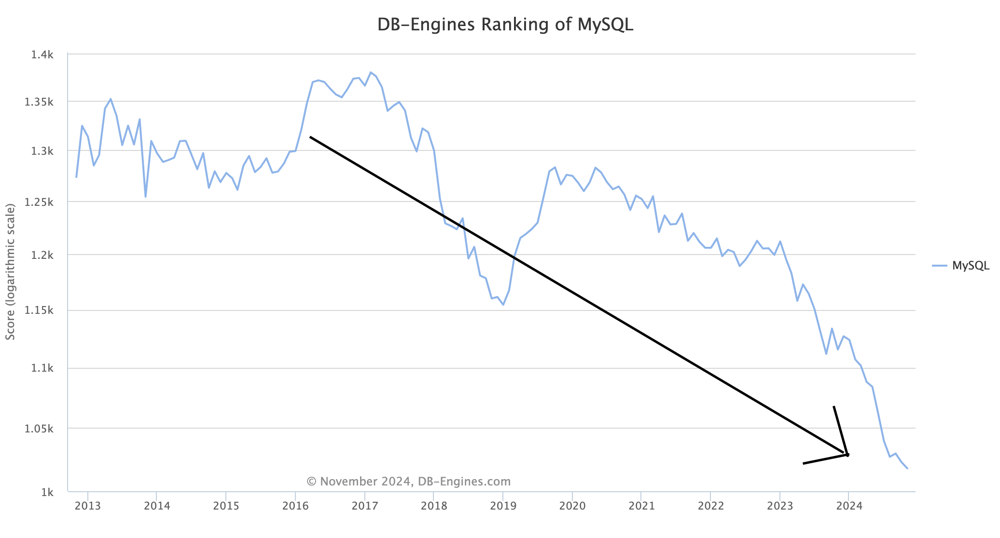
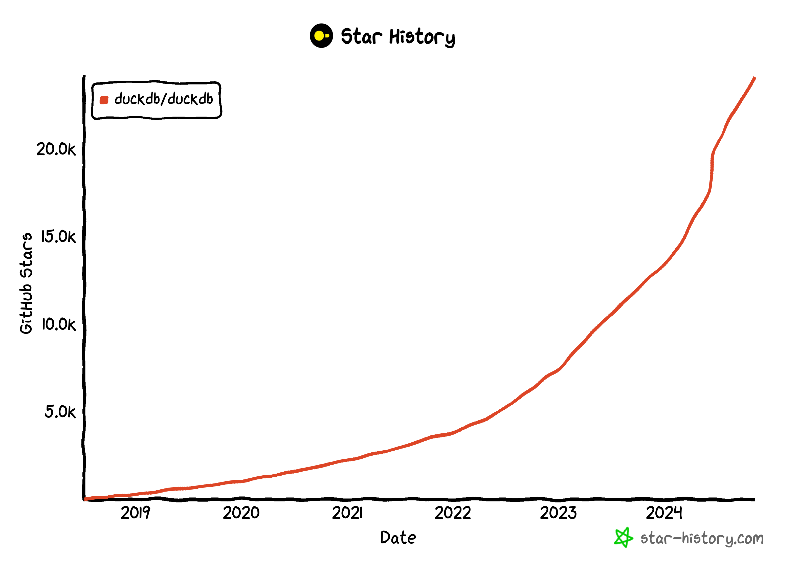

## MySQL救命稻草: DuckDB    
                                                                                          
### 作者                                                              
digoal                                                              
                                                                     
### 日期                                                                   
2024-11-08                                                            
                                                                  
### 标签                                                                
PostgreSQL , PolarDB , DuckDB , MySQL , MyDuckServer , apecloud , 云猿生                                
                                                                                         
----                                                                  
                                                                                
## 背景    
MySQL是非常流行的开源数据库, 但自从2016年以来一路下跌颓势不减气数将尽.   
  
  
  
可能是受制于其优化器过于简单单一MySQL数据库仅适合简单的存取场景, 数据量过亿可能就要上分库分表架构, 或结合其他产品才能处理复杂查询和分析请求. 这也是为什么MySQL基于binlog复制的生态特别发达. 将从MySQL流到搜索引擎、大数据平台的ETL产品非常丰富, 兼容MySQL语法的中间件、分析型产品也非常丰富, 这些产品的目标都是迎合习惯了MySQL的大量开发者.   
  
虽然生态丰富, 但也存在一些问题, 例如同步数据总会遇到延迟、不一致等问题、管理更多产品带来的运维、开发、资源成本提升的问题等. 大量用户倒戈到PostgreSQL这个功能更加丰富、单体性能更强的开源数据库.     
  
不过MySQL救命稻草可能来了: 它就是DuckDB, 短短几年已经飙到24K star. 将DuckDB集成到MySQL的话至少能解决大量数据(数十亿级别)实时分析性能问题.   而且DuckDB可不仅仅是分析查询快, 它还支持数据湖架构、支持向量索引(用于火热的AI RAG场景)等, 这些都是它真正迅速崛起的原因.    
    
     
    
这是我看到的对MySQL用户最具价值的产品, PG生态早已经用上DuckDB的能力(duckdb_fdw, pg_duckdb, pg_arrow, pg_parquet, aliyun rds pg, aliyun polardb等产品/开源项目), MySQL终于跟上了.     
  
云猿生已将MySQL+DuckDB集成到开源项目myduckserver中:    
  
[myduckserver: MySQL+DuckDB power by Apecloud](https://github.com/apecloud/myduckserver)  
  
<h1 style="display: flex; align-items: center;">  
      
    <span>MyDuck Server</span>  
</h1>  
  
  
**MyDuck Server** unlocks serious power for your MySQL analytics. Imagine the simplicity of MySQL’s familiar interface fused with the raw analytical speed of [DuckDB](https://duckdb.org/). Now you can supercharge your MySQL queries with DuckDB’s lightning-fast OLAP engine, all while using the tools and dialect you know.  
  
## ❓ Why MyDuck ❓  
  
While MySQL is a popular go-to choice for OLTP, its performance in analytics often largely lags. DuckDB, on the other hand, is built for fast, embedded analytical processing. MyDuck Server lets you enjoy DuckDB's high-speed analytics without leaving the MySQL ecosystem.  
  
With MyDuck Server, you can:  
  
- **Accelerate MySQL analytics** by running analytical queries on your MySQL data at speeds several orders of magnitude faster 🚀  
- **Keep familiar tools**—there’s no need to change your existing MySQL-based data analysis toolchains 🛠️  
- **Go beyond MySQL syntax** through DuckDB’s full power to expand your analytics potential 💥  
- **Run DuckDB in server mode** to share a DuckDB instance with your team or among your applications 🌩️  
- and much more! See below for a full list of feature highlights.  
  
MyDuck Server isn’t here to replace MySQL — it’s here to help MySQL users do more with their data. This open-source project gives you a convenient way to integrate high-speed analytics into your MySQL workflow, all while embracing the flexibility and efficiency of DuckDB.  
  
## ✨ Key Features  
  
- **Blazing Fast OLAP with DuckDB**: MyDuck stores data in DuckDB, an OLAP-optimized database known for lightning-fast analytical queries. With DuckDB, MyDuck executes queries up to 1000x faster than traditional MySQL setups, enabling complex analytics that were impractical with MySQL alone.  
  
- **MySQL-Compatible Interface**: MyDuck speaks MySQL wire protocol and understands MySQL syntax, so you can connect to it with any MySQL client and run MySQL-style SQL. MyDuck translates your queries on the fly and executes them in DuckDB. Connect your favorite data visualization tools and BI platforms to MyDuck without any changes, and enjoy the speed boost.  
  
- **Zero-ETL**: Just `START REPLICA` and go! MyDuck replicates data from your primary MySQL server in real-time, so you can start querying immediately. There’s no need to set up complex ETL pipelines.  
  
- **Consistent and Efficient Replication**: Thanks to DuckDB's [solid ACID support](https://duckdb.org/2024/09/25/changing-data-with-confidence-and-acid.html), we’ve carefully managed transaction boundaries in the replication stream to ensure a **consistent data view** — you’ll never see dirty data mid-transaction. Plus, MyDuck’s **transaction batching** collects updates from multiple transactions and applies them to DuckDB in batches, significantly reducing write overhead (since DuckDB isn’t designed for high-frequency OLTP writes).  
  
- **Raw DuckDB Power**: MyDuck also offers a Postgres-compatible port, allowing you to send DuckDB SQL directly. This opens up DuckDB’s full analytical capabilities, including [friendly SQL syntax](https://duckdb.org/docs/sql/dialect/friendly_sql.html), [advanced aggregates](https://duckdb.org/docs/sql/functions/aggregates), [accessing remote data sources](https://duckdb.org/docs/extensions/httpfs/s3api.html#reading), and more.   
  
- **DuckDB in Server Mode**: If you aren't interested in MySQL but just want to share a DuckDB instance with your team or among your applications, MyDuck is also a great solution. You can deploy MyDuck to a server, ignore all the MySQL configuration, and connect to it with any PostgreSQL client.  
  
- **Seamless Integration with MySQL Dump & Copy Tools**: MyDuck plays perfectly with modern MySQL tools, especially the [MySQL Shell](https://dev.mysql.com/doc/mysql-shell/en/), the official advanced MySQL client. You can load data into MyDuck in parallel from a MySQL Shell dump, or leverage the Shell’s `copy-instance` utility to copy a consistent snapshot of your running MySQL server to MyDuck.  
  
- **Bulk Data Loading**: MyDuck supports fast bulk data loading from the client side with the standard MySQL `LOAD DATA LOCAL INFILE` command or the  PostgreSQL `COPY FROM STDIN` command.  
  
- **Standalone Mode**: MyDuck can run in standalone mode, without MySQL replication. In this mode, it is a drop-in replacement for MySQL, but with a DuckDB heart. You can `CREATE TABLE`, transactionally `INSERT`, `UPDATE`, and `DELETE` data, and run blazingly fast `SELECT` queries.  
  
## 📊 Performance  
  
Typical OLAP queries can run **up to 1000x faster** with MyDuck Server compared to MySQL alone, especially on large datasets. Under the hood, it's just DuckDB doing what it does best: processing analytical queries at lightning speed. You are welcome to run your own benchmarks and prepare to be amazed! Alternatively, you can refer to well-known benchmarks like the [ClickBench](https://benchmark.clickhouse.com/) and [H2O.ai db-benchmark](https://duckdblabs.github.io/db-benchmark/) to see how DuckDB performs against other databases and data science tools. Also remember that DuckDB has robust support for transactions, JOINs, and [larger-than-memory query processing](https://duckdb.org/2024/07/09/memory-management.html), which are unavailable in many competing systems and tools.  
  
## 🎯 Roadmap  
  
We have big plans for MyDuck Server! Here are some of the features we’re working on:  
  
- [ ] Be compatible with MySQL proxy tools like [ProxySQL](https://proxysql.com/) and [MariaDB MaxScale](https://mariadb.com/kb/en/maxscale/).  
- [ ] Replicate data from PostgreSQL.  
- [ ] ...and more! We’re always looking for ways to make MyDuck Server better. If you have a feature request, please let us know by [opening an issue](https://github.com/apecloud/myduckserver/issues/new).  
  
  
## 🏃‍♂️ Getting Started  
  
### Prerequisites  
  
- **Docker** (recommended) for setting up MyDuck Server quickly.  
- MySQL or PostgreSQL clients for connecting and testing your setup.  
  
### Installation  
  
Get a standalone MyDuck Server up and running in minutes using Docker:  
  
```bash  
docker run -p 13306:3306 -p 15432:5432 apecloud/myduckserver:latest  
```  
  
This setup exposes:  
  
- **Port 13306** for MySQL wire protocol connections.  
- **Port 15432** for PostgreSQL wire protocol connections, allowing direct DuckDB SQL.  
  
### Usage  
  
#### Connecting via MySQL  
  
Connect using any MySQL client to run MySQL-style SQL queries:  
  
```bash  
mysql -h127.0.0.1 -P13306 -uroot  
```  
  
#### Connecting via PostgreSQL  
  
For full analytical power, connect using the PostgreSQL-compatible port and write DuckDB SQL directly:  
  
```bash  
psql -h 127.0.0.1 -p 15432 -U mysql  
```  
  
### Replicating Data  
  
We have integrated a setup tool in the Docker image that helps replicate data from your primary MySQL server to MyDuck Server. The tool is available via the `SETUP_MODE` environment variable. In `REPLICA` mode, the container will start MyDuck Server, dump a snapshot of your primary MySQL server, and start replicating data in real-time.  
  
```bash  
docker run \  
  --network=host \  
  --privileged \  
  --workdir=/home/admin \  
  --env=SETUP_MODE=REPLICA \  
  --env=MYSQL_HOST=<mysql_host> \  
  --env=MYSQL_PORT=<mysql_port> \  
  --env=MYSQL_USER=<mysql_user> \  
  --env=MYSQL_PASSWORD=<mysql_password> \  
  --detach=true \  
  apecloud/myduckserver:latest  
```  
## Connecting to Cloud MySQL  
  
MyDuck Server supports setting up replicas from common cloud-based MySQL offerings. For more information, please refer to the [replica setup guide](docs/tutorial/replica-setup-rds.md).  
  
## 💡 Contributing  
  
Let’s make MySQL analytics fast and powerful—together!  
  
MyDuck Server is open-source, and we’d love your help to keep it growing! Check out our [CONTRIBUTING.md](CONTRIBUTING.md) for ways to get involved. From bug reports to feature requests, all contributions are welcome!  
  
## 💗 Acknowledgements  
  
MyDuck Server is built on top of the a collection of amazing open-source projects, notably:  
- [DuckDB](https://duckdb.org/) - The fast in-process analytical database that powers MyDuck Server.  
- [go-mysql-server](https://github.com/dolthub/go-mysql-server) - The excellent MySQL server implementation in Go maintained by [DoltHub](https://www.dolthub.com/team) that MyDuck Server is based on.  
- [Vitess](https://vitess.io/) - Provides the MySQL replication stream subscriber used in MyDuck Server.  
- [SQLGlot](https://github.com/tobymao/sqlglot) - The ultimate SQL transpiler.  
  
We are grateful to the developers and contributors of these projects for their hard work and dedication to open-source software.  
  
## 📝 License  
  
MyDuck Server is released under the [Apache License 2.0](LICENSE).  
  
  
  
#### [期望 PostgreSQL|开源PolarDB 增加什么功能?](https://github.com/digoal/blog/issues/76 "269ac3d1c492e938c0191101c7238216")
  
  
#### [PolarDB 开源数据库](https://openpolardb.com/home "57258f76c37864c6e6d23383d05714ea")
  
  
#### [PolarDB 学习图谱](https://www.aliyun.com/database/openpolardb/activity "8642f60e04ed0c814bf9cb9677976bd4")
  
  
#### [PostgreSQL 解决方案集合](../201706/20170601_02.md "40cff096e9ed7122c512b35d8561d9c8")
  
  
#### [德哥 / digoal's Github - 公益是一辈子的事.](https://github.com/digoal/blog/blob/master/README.md "22709685feb7cab07d30f30387f0a9ae")
  
  
#### [About 德哥](https://github.com/digoal/blog/blob/master/me/readme.md "a37735981e7704886ffd590565582dd0")
  
  

  
