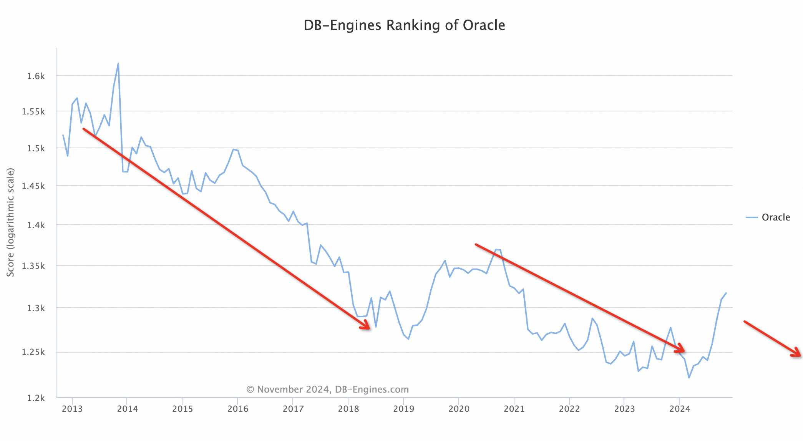
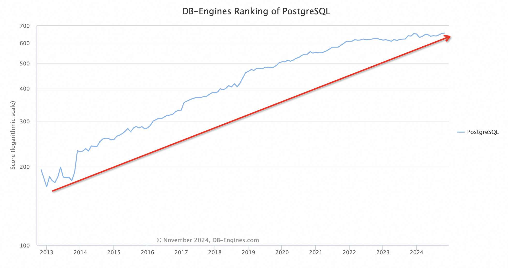
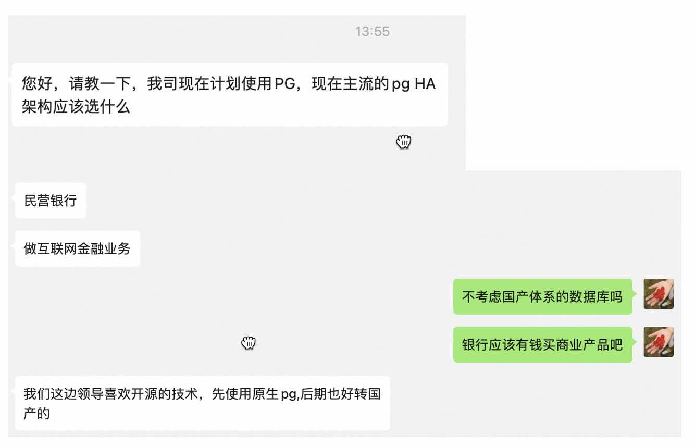

## Oracle 深陷困境, 对手不讲武德   
                                                                    
### 作者                                                         
digoal                                                           
                                                                           
### 日期                                                                         
2024-11-13                                        
                                  
### 标签                                                       
PostgreSQL , PolarDB , DuckDB , Oracle     
                                                                                               
----                                                                        
                                                                                      
## 背景   
Oracle 表面上财报喜人, 截止到2024年8月31日的收入总额为133.07亿美元，同比增长6.86%，归母净利润为29.29亿美元，同比增长21.03%。  
  
实则已深陷困境! 为什么呢? 3个关键原因:粮仓被烧、锅底穿孔、创新遭劫! 且听我逐一分析.     
  
## 一、粮仓被烧  
  
“免费”用户是Oracle最大的粮仓, 商业数据库哪来的“免费”用户? 懂得都懂(未完全按实际核数、套数付费? 盗版?). 这本来是Oracle最大的粮仓, 销售通过电话或律师函可以严格控制增长.     
  
如今这个粮仓被烧了, 用户担心收律师函又不想付钱, 纷纷转向开源. 看看db-engine Oracle和PostgreSQL的趋势就知道, Oracle一路下跌, 并且依旧在下跌通道.    
  
    
  
而PostgreSQL一路高歌  
  
    
  
这是偶然吗? 当然不是, 开源数据库的崛起和开源生态的发展息息相关.       
  
1、Oracle 管理大规模集群有其商业管理产品EM, 开源PG早期可没有这样的产品, 不好运维, 需要运维堆人或自行开发管控软件, 仅大型企业有这样的实力, 但是现在不一样了, 开源/商业的PG管控软件已非常丰富, 例如kubeblocks, clup, Pigsty.    
  
1\.1、鸣嵩(前阿里云数据库总经理 / 研究员)等大佬们创业创办云猿生, 核心产品KubeBlocks让管理数据库和搭积木一样简单, 如果你要管理很多套并且种类(OLTP\OLAP\NoSQL\KV\TS\MQ等)很多的数据库产品, 推荐首选.    
- https://github.com/apecloud/kubeblocks  
  
1\.2、PG中文社区核心委员唐成创业创办乘数科技开源的Clup, 专用管理PostgreSQL和PolarDB的集群管理软件, 如果你要管理很多套数据库, 推荐选择. 并且Clup还提供了企业版、自研的连接池、分布式存储、一体机、备份平台等, 是企业用户推荐之选.   
- https://www.csudata.com/  
  
1\.3、pigsty, 集成了300多个PG插件的PG集群和PolarDB集群管理软件. 如果你要管理很多套PG或PolarDB数据库, 且对插件有特别多的需求, 推荐选择.  
- https://pigsty.cc/zh/  
  
2、在日常使用数据库的过程中, 给DBA带来巨大压力的是: 业务好不容易搞一次促销冲量, 可是因为数据库性能抖动影响了业务冲量, 你居然不是第一个发现问题的人? 老板冲过来问你为什么? 怎么解决?  是不是很尴尬?  即使最后查出来是开发变更SQL导致(例如SQL未优化、未估计峰值等...), DBA一样要挨板子, 谁叫你没有提前发现提前有预案.      
  
现在好了, 开源PG已经有了完整的监控诊断工具、优化建议甚至自动优化工具、SQL上线前审计工具!    
  
海信聚好看DBdoctor, 采用ebpf技术, 在对数据库几乎没有影响的情况下实时监控数据库和服务器的各项指标, 发现和诊断问题根因非常方便.  
- https://www.dbdoctor.cn/  
  
Bytebase 数据库 DevOps 的 GitLab/GitHub，专为开发人员、DBA 和平台工程师打造。  
- https://bytebase.cc/docs/introduction/what-is-bytebase/  
  
D-Smart、PawSQL: 专注企业级市场, 将业界顶级DBA经验的产品化作品, 产品功能包括数据库监控、诊断、优化等.   
  
即使不借助工具, 体系化的文章也比比皆是, 找资料就到 https://github.com/digoal/blog       
- [《2019-PostgreSQL 2天体系化培训 - 适合DBA》](../201901/20190105_01.md)    
  
3、以前使用开源数据库可能担心遇到问题不知道问谁? 或者网上资料、中文书籍较少, 或者没有商业咨询公司? 不存在! 现在太方便了.     
  
免费的: PG中文社区 (postgres.cn), 还有各种活跃的QQ群、钉钉群、微信群, 专家巨多、用户巨多.    
  
PG中文社区核心委员老朱 成都文武: https://ww-it.cn  
  
PG中文社区核心委员唐成 乘数科技: https://www.csudata.com/  
  
4、想考个认证呢?    
  
以前流行的Oracle认证现在不香了没什么人考了, 培训公司纷纷转行, 现在做开源、信创数据库认证的公司很多 例如cuug、盘古云课堂等. 现在国产认证经常被一些厂商的商务用于控标, 和当年Oracle流行时一样. :  
- http://www.cuug.com.cn/  
  
5、适合开发者的IDE   
  
Oracle 有sqldeveloper, PostgreSQL有pgadmin, 国产IDE则可以看看老程序猿达刚DeskUI: https://www.deskui.com    
  
6、数据同步&迁移&备份恢复  
  
NineData, 产品涵盖了数据同步、迁移、备份、比对、devops、chatDBA等.  
- https://www.ninedata.cloud/home  
  
DSG, 非常老牌的数据库同步迁移企业级产品, 支持各种数据库的异构和同构迁移, 用DSG的话说, 没有dsg搞不定的迁移, 比goldengate还牛.  
- https://www.dsgdata.com/  
  
只是粮仓被烧, Oracle顶多也就是在某个地域的市场没有增长或增长乏力, 还不至于深陷困境.   
  
要是锅底穿孔呢? 那可大事不妙!       
  
## 二、锅底穿孔  
免费用户没了就没了, 反正也没损失. 如果已经在锅里的肉没了那就真玩犊子了!     
  
商业用户是Oracle已经在锅里的肉, 不过他们正在流失!     
  
基于PostgreSQL或兼容PostgreSQL的商业发行版, 正在偷偷挖走Oracle的商业用户.  
  
资本对商机最敏感, 不用我们操心, 例如阿里云通过国测并且开源的PolarDB for PostgreSQL、AWS Aurora, Azure citus, google postgresql等. 还有非常值得关注的几款PostgreSQL栈国产数据库: HaloDB(基于PG兼容PostgreSQL、Oracle、MySQL. http://www.halodbtech.com/ )、IvorySQL(基于开源PG兼容PG、Oracle. https://www.ivorysql.org/zh-cn/ )、ProtonBase(云原生分布式数仓, 平替greenplum. https://protonbase.com/ ).     
  
通过国测并且开源的PolarDB for PostgreSQL  
- 商业版: https://www.aliyun.com/activity/database/polardb-v2    
- 开源版: https://github.com/ApsaraDB/PolarDB-for-PostgreSQL  
  
国产商业数据库 国测结果  
- 安全可靠测评结果公告（2023年第1号） 2023-12-26 http://www.itsec.gov.cn/aqkkcp/cpgg/202312/t20231226_162074.html  
- 安全可靠测评结果公告（2024年第2号） 2024-09-30 http://www.itsec.gov.cn/aqkkcp/cpgg/202409/t20240930_194299.html  
   
用户心里其实门清, 先用开源PG, 未来迁移到商业版本太顺滑了. 因为国产数据库大部分都是基于PG的.     
  
    
  
公开课:  
- [《2024-开源PolarDB|PostgreSQL 应用开发者&DBA 公开课》](../202310/20231030_02.md)       
  
看到这你如果还盲目的使用Oracle, 不得不说, 你是真土豪~~~ (或者是zz不正确? 现在是zm经济体量相当世界不容二虎zm必有一战的形势, 朝鲜战争毛主席说“打得一拳开免得百拳来”, 可能现在mg也是这么想的?)         
  
Oracle 粮仓被烧, “免费”用户被PostgreSQL抢占, 增长没了; 锅底又穿孔, 商业用户逃离到基于PostgreSQL或兼容PostgreSQL的商业发行版, 怎么办?   
  
你可能会问 Oracle为什么不把这些商业数据库的源头开源PostgreSQL给买了呢? Oracle确实买过很多产品例如SUN, peoplesoft, 但是它可以买下一家公司却买不了PostgreSQL, 因为PG不是个公司而是个NGO组织, 背后是全球开发组, 买它等于要和所有开发者沟通, 任何一个开发者不同意就要把作者的代码剔除, 非常复杂. 更何况贡献者也不靠这个赚钱, 还有很多贡献者甚至就来自PG的用户, 收购这条路走不通!    
    
真替Oracle着急, Oracle只能积极寻找第二增长曲线, 可悲的是Oracle遇到的是史上最不讲武德的对手! Oracle也太惨了.       
  
## 三、创新遭劫   
从Oracle的命名后缀, 我们可以知道Oracle押注的增长点, 9i、10g、12c、23ai 分别押注了互联网、网格、云、AI.     
  
这次Oracle押注AI, 对不起, 你的创新被堵死了. 谁叫PostgreSQL这个对手不讲武德, 朋友太多了, Oracle面临被乱拳打死的地步.     
  
AI 和数据库结合, 关键场景有2.   
  
1、db for ai  
  
例如RAG场景, 数据库存储原始数据的高维向量, 并提供向量相似搜索的功能, 快速搜索知识库与问题相关的条目、快速搜索历史对话相关部分的条目等. 从而实现大模型基于新知识的推理、历史会话记忆的能力.  
  
2018年前, 阿里云RDS PG就支持了pase插件, imgsmlr开源插件项目就更早了, 这些PG插件都是高维索引, 用以在向量空间内快速搜索相似向量. 只是前些年没有将文本、视频、图像、音频等映射到向量空间的产品, 如果有的话, 早就火了. 现在则有了pgvector插件, 实现了更多更高效的向量索引接口.   
  
Oracle在db for ai这个领域占不了便宜.    
  
其他领域  
  
2、ai for db   
  
自动优化、自动设计schema、NLP、自动学习数据、推理等整合到数据库中     
- 看看 https://mindsdb.com/     
  
Oracle在ai for db这个领域也占不了便宜.    
  
PostgreSQL朋友(插件)太多了, Oracle在其他创新领域估计也占不了便宜:    
- 时序: timescaledb  
- 文档: jsonb  
- 图: age  
- 地理时空: ganos、postgis  
- 实时分析: pg_duckdb, duckdb_fdw, pg_analytic  
- 冷热分离: pg_parquet  
- 分布式/RAC: PolarDB  
- 机器学习: pg4ml、madlib    
- ...     
  
以下镜像集成了几百个PG插件, 各个方向的都有, 详情请查看:    
- [《PostgreSQL Docker镜像学习环境 AMD64版, 已集成热门插件和工具》](../202307/20230710_03.md)     
  
  
<b>粮仓被烧、锅底穿孔、创新遭劫! Oracle, 真的危了! </b>   
  
#### [期望 PostgreSQL|开源PolarDB 增加什么功能?](https://github.com/digoal/blog/issues/76 "269ac3d1c492e938c0191101c7238216")
  
  
#### [PolarDB 开源数据库](https://openpolardb.com/home "57258f76c37864c6e6d23383d05714ea")
  
  
#### [PolarDB 学习图谱](https://www.aliyun.com/database/openpolardb/activity "8642f60e04ed0c814bf9cb9677976bd4")
  
  
#### [PostgreSQL 解决方案集合](../201706/20170601_02.md "40cff096e9ed7122c512b35d8561d9c8")
  
  
#### [德哥 / digoal's Github - 公益是一辈子的事.](https://github.com/digoal/blog/blob/master/README.md "22709685feb7cab07d30f30387f0a9ae")
  
  
#### [About 德哥](https://github.com/digoal/blog/blob/master/me/readme.md "a37735981e7704886ffd590565582dd0")
  
  

  
