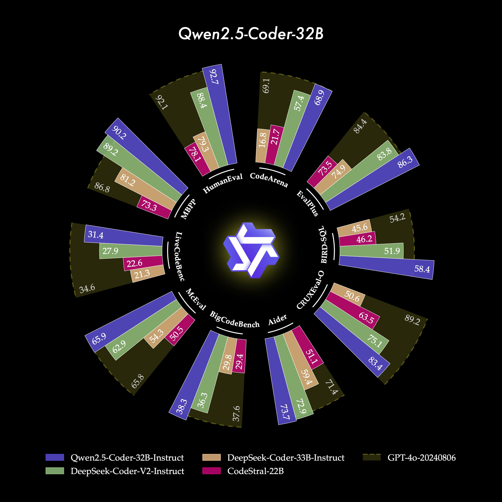
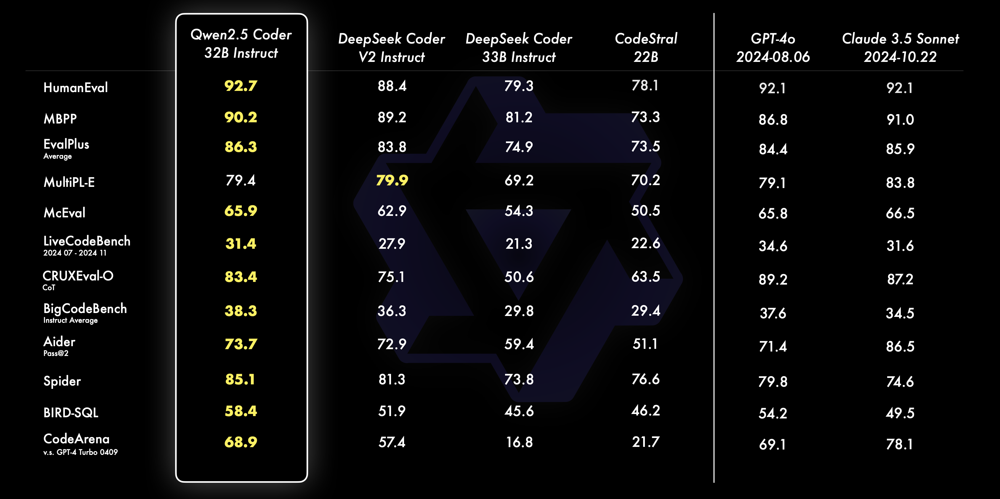
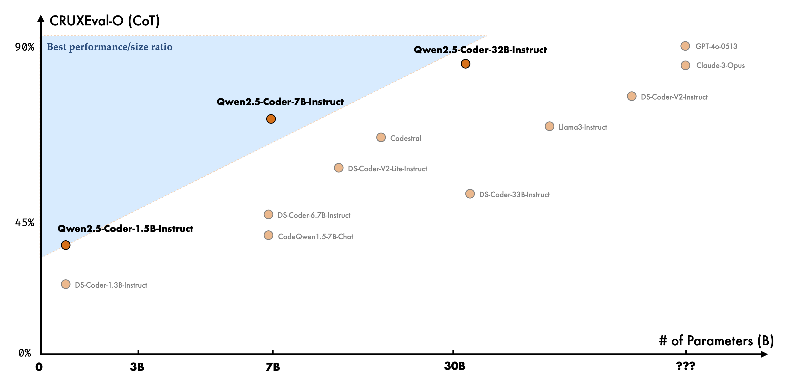

## qwen2.5-coder真牛~~用它打PolarDB国赛劲劲的    
                                                                      
### 作者                                                           
digoal                                                             
                                                                             
### 日期                                                                           
2024-11-15                                          
                                    
### 标签                                                         
PostgreSQL , PolarDB , DuckDB , AI , 大模型 , 编程大模型 , qwen2.5-coder , TPCH          
                                                                                                 
----                                                                          
                                                                                        
## 背景     
qwen2.5-coder 又升级了, 全系列模型已开源`0.5b, 1.5b, 3b, 7b, 14b, 32b`参数可选择, 公司发的办公笔记本(macbookpro m2 16g内存)内存有限, 最多能跑14b参数规模的, 我试了一下, 效果很哇塞.  
  
刚好碰上了PolarDB国赛, 这个比赛是优化PolarDB的TPCH性能, 包括导入和查询两个部分, 初赛已经进入尾声, 详见:     
- [《PolarDB数据库创新设计国赛 - 初赛提交作品指南》](../202410/20241008_04.md)    
  
决赛是优化tpch的查询, 我觉得可以让qwen2.5-coder上场表现一下, 首先要借助duckdb优秀的查询引擎, 方法1: 把数据转换为parquet格式进行查询; 方法2: 用duckdb的postgres_scanner进行查询. 当然可能还需要让PolarDB的优化器识别出查询语句的代价, 根据代价重写SQL, 走duckdb的查询引擎. 这个部分也需要修改PolarDB数据库内核.    
  
## Qwen2.5-Coder 简介  
  
  
「强大」、「多样」、「实用」的 Qwen2.5-Coder 全系列模型已开源，致力于持续推动 Open CodeLLMs 的发展。  
- 强大：Qwen2.5-Coder-32B-Instruct 成为目前 SOTA 的开源代码模型，代码能力追平 GPT-4o，展现出强大且全面的代码能力，同时具备良好的通用和数学能力。  
- 多样：上个月我们开源了 1.5B、7B 两个尺寸，本次开源又带来 0.5B、3B、14B、32B 四个尺寸，截至目前， Qwen2.5-Coder 已经覆盖了主流的六个模型尺寸，以满足不同开发者的需要。  
- 实用：我们探索了 Qwen2.5-Coder 在代码助手和 Artifacts 两种场景下的实用性，并用一些样例来展示 Qwen2.5-Coder 在实际场景中的应用潜力。  
  
<b>强大：代码能力达到开源模型 SOTA</b>  
  
  
  
代码生成：Qwen2.5-Coder-32B-Instruct 作为本次开源的旗舰模型，在多个流行的代码生成基准（如EvalPlus、LiveCodeBench、BigCodeBench）上都取得了开源模型中的最佳表现，并且达到和 GPT-4o 有竞争力的表现。  
  
代码修复：代码修复是一个重要的编程能力。Qwen2.5-Coder-32B-Instruct 可以帮助用户修复代码中的错误，让编程更加高效。Aider 是流行的代码修复的基准，Qwen2.5-Coder-32B-Instruct 达到 73.7 分，在 Aider 上的表现与 GPT-4o 相当。  
  
代码推理：代码推理是指模型能否学习代码执行的过程，准确地预测模型的输入与输出。上个月发布的 Qwen2.5-Coder-7B-Instruct 已经在代码推理能力上展现出了不俗的表现，32B 模型的表现更进一步。  
  
  
  
多编程语言：智能编程助手应该熟悉所有编程语言，Qwen2.5-Coder-32B-Instruct 在 40 多种编程语言上表现出色，在 McEval 上取得了 65.9 分，其中 Haskell、Racket 等语言表现令人印象深刻，这得益于我们在预训练阶段独特的数据清洗和配比。  
  
另外，Qwen2.5-Coder-32B-Instruct 的多编程语言代码修复能力同样令人惊喜，这将有助于用户理解和修改自己熟悉的编程语言，极大缓解陌生语言的学习成本。  
  
与 McEval 类似，MdEval 是多编程语言的代码修复基准，Qwen2.5-Coder-32B-Instruct 在 MdEval 上取得了 75.2 分，在所有开源模型中排名第一。  
  
人类偏好对齐：为了检验 Qwen2.5-Coder-32B-Instruct 在人类偏好上的对齐表现，我们构建了一个来自内部标注的代码偏好评估基准 Code Arena（类似 Arena Hard）。我们采用 GPT-4o 作为偏好对齐的评测模型，采用 “A vs. B win” 的评测方式——即在测试集实例中，模型 A 的分数超过模型 B 的百分比。下图结果表现出 Qwen2.5-Coder-32B-Instruct 在偏好对齐方面的优势。  
  
<b>多样：丰富的模型尺寸</b>  
  
Qwen2.5-Coder 开源模型家族包含 0.5B、1.5B、3B、7B、14B、32B 六个尺寸，不仅能够满足开发者在不同资源场景下的需求，还能给研究社区提供良好的实验场。下表是详细的模型信息：  
  
## 试试  
话不多说, 下面就来试一试14b的Qwen2.5-Coder 开源模型  
  
下载ollama里的`qwen2.5-coder:14b`  
```  
ollama pull qwen2.5-coder:14b  
pulling manifest   
pulling ac9bc7a69dab... 100% ▕██████████████████████████████████████████████████████████████████████████████████████████████████████████████████████████████████████████▏ 9.0 GB                           
pulling 66b9ea09bd5b... 100% ▕██████████████████████████████████████████████████████████████████████████████████████████████████████████████████████████████████████████▏   68 B                           
pulling e94a8ecb9327... 100% ▕██████████████████████████████████████████████████████████████████████████████████████████████████████████████████████████████████████████▏ 1.6 KB                           
pulling 832dd9e00a68... 100% ▕██████████████████████████████████████████████████████████████████████████████████████████████████████████████████████████████████████████▏  11 KB                           
pulling 0578f229f23a... 100% ▕██████████████████████████████████████████████████████████████████████████████████████████████████████████████████████████████████████████▏  488 B                           
verifying sha256 digest   
writing manifest   
success   
```  
  
启动`qwen2.5-coder:14b`  
```  
ollama run qwen2.5-coder:14b  
>>>   
```  
  
### 第1个问题  
>>> 写一个postgresql的plpython3u存储过程函数. 这个函数的功能是加载libduckdb, 使用libduckdb查询parquet文件内的数据进行分析, 分析SQL可能是这样的`select count(distinct id) from '/data/t.parquet';`  
  
要在 PostgreSQL 中使用 PL/Python 创建一个存储过程来加载 `libduckdb` 并查询 Parquet 文件中的数据，你需要确保以下几点：  
  
1. 确保你的 PostgreSQL 服务器已经安装了 PL/Python 扩展。  
2. 确保你有 `libduckdb` 库，并且可以在 Python 中调用它。  
  
下面是一个示例存储过程函数，它使用 PL/Python 来加载 `libduckdb` 并查询 Parquet 文件中的数据：  
  
```sql  
-- 创建或替换函数  
CREATE OR REPLACE FUNCTION analyze_parquet_file(file_path TEXT, query_text TEXT) RETURNS INTEGER AS $$  
import duckdb  
  
# 连接到 DuckDB 数据库  
con = duckdb.connect(database=':memory:')  
  
# 加载 Parquet 文件  
con.execute(f"INSTALL parquet")  
con.execute(f"LOAD parquet")  
  
# 执行查询  
result = con.execute(query_text)  
  
# 获取结果  
count = result.fetchone()[0]  
  
# 关闭连接  
con.close()  
  
return count  
$$ LANGUAGE plpython3u;  
```  
  
在这个示例中：  
  
1. 我们创建了一个名为 `analyze_parquet_file` 的函数，它接受两个参数：`file_path` 和 `query_text`。  
2. 在函数体内，我们使用 Python 的 `duckdb` 库来连接到一个内存中的 DuckDB 数据库。  
3. 我们加载 `parquet` 扩展并执行传入的 SQL 查询。  
4. 我们从查询结果中获取第一个元素，并将其作为返回值。  
  
你可以通过以下方式调用这个函数：  
  
```sql  
SELECT analyze_parquet_file('/data/t.parquet', 'SELECT count(DISTINCT id) FROM read_parquet($1)');  
```  
  
请注意，`read_parquet($1)` 是 DuckDB 中读取 Parquet 文件的语法。你需要确保文件路径是正确的，并且 `libduckdb` 库在你的环境中可用。  
  
此外，确保你已经安装了所有必要的依赖项，并且 `plpython3u` 扩展已经在 PostgreSQL 服务器上启用。  
  
### 第2个问题  
>>> 如果返回的是多行记录, 记录类型为record呢?  
  
如果你希望存储过程函数返回多行记录，并且每行记录的类型为 `RECORD`，你可以使用 PL/Python 的 `plpy.execute()` 方法来执行查询并返回结果。以下是一个示例：  
  
```sql  
-- 创建或替换函数  
CREATE OR REPLACE FUNCTION analyze_parquet_file(file_path TEXT, query_text TEXT) RETURNS SETOF RECORD AS $$  
import duckdb  
  
# 连接到 DuckDB 数据库  
con = duckdb.connect(database=':memory:')  
  
# 加载 Parquet 文件  
con.execute(f"INSTALL parquet")  
con.execute(f"LOAD parquet")  
  
# 执行查询  
result = con.execute(query_text)  
  
# 获取结果并返回  
for row in result.fetchall():  
    yield tuple(row)  
  
# 关闭连接  
con.close()  
$$ LANGUAGE plpython3u;  
  
-- 创建一个复合类型来定义返回记录的结构  
CREATE TYPE record_type AS (  
    id INT,  
    value TEXT  
);  
```  
  
在这个示例中：  
  
1. 我们创建了一个名为 `analyze_parquet_file` 的函数，它接受两个参数：`file_path` 和 `query_text`。  
2. 在函数体内，我们使用 Python 的 `duckdb` 库来连接到一个内存中的 DuckDB 数据库。  
3. 我们加载 `parquet` 扩展并执行传入的 SQL 查询。  
4. 我们从查询结果中获取所有行，并使用 `yield` 逐行返回。  
  
你需要定义一个复合类型（例如 `record_type`），来指定返回记录的结构。你可以根据你的实际需求调整这个复合类型的定义。  
  
然后，你可以通过以下方式调用这个函数：  
  
```sql  
SELECT * FROM analyze_parquet_file('/data/t.parquet', 'SELECT id, value FROM read_parquet($1)');  
```  
  
确保你已经安装了所有必要的依赖项，并且 `plpython3u` 扩展已经在 PostgreSQL 服务器上启用。  
  
### 第3个问题  
>>> `SELECT * FROM analyze_parquet_file('/data/t.parquet', 'SELECT id, value FROM read_parquet($1)');` 这条sql有点问题, 数据库不知道record的结构, 所以需要进行申明, `as tbl(id int, value text)`  
  
你说得对，为了使 PostgreSQL 能够正确识别返回记录的结构，你需要在 `SELECT` 语句中显式地声明结果集的列。以下是修正后的 SQL 查询：  
  
```sql  
-- 创建或替换函数  
CREATE OR REPLACE FUNCTION analyze_parquet_file(file_path TEXT, query_text TEXT) RETURNS SETOF RECORD AS $$  
import duckdb  
  
# 连接到 DuckDB 数据库  
con = duckdb.connect(database=':memory:')  
  
# 加载 Parquet 文件  
con.execute(f"INSTALL parquet")  
con.execute(f"LOAD parquet")  
  
# 执行查询  
result = con.execute(query_text)  
  
# 获取结果并返回  
for row in result.fetchall():  
    yield tuple(row)  
  
# 关闭连接  
con.close()  
$$ LANGUAGE plpython3u;  
  
-- 创建一个复合类型来定义返回记录的结构  
CREATE TYPE record_type AS (  
    id INT,  
    value TEXT  
);  
```  
  
然后，你可以通过以下方式调用这个函数：  
  
```sql  
SELECT * FROM analyze_parquet_file('/data/t.parquet', 'SELECT id, value FROM read_parquet($1)') AS tbl(id int, value text);  
```  
  
在这个查询中，`AS tbl(id int, value text)` 明确指定了结果集的列结构。  
  
确保你已经安装了所有必要的依赖项，并且 `plpython3u` 扩展已经在 PostgreSQL 服务器上启用。  
  
  
## 参考  
https://ollama.com/library/qwen2.5-coder  
  
https://qwenlm.github.io/zh/blog/qwen2.5-coder-family/  
  
[《PolarDB数据库创新设计国赛 - 初赛提交作品指南》](../202410/20241008_04.md)    
     
  
#### [期望 PostgreSQL|开源PolarDB 增加什么功能?](https://github.com/digoal/blog/issues/76 "269ac3d1c492e938c0191101c7238216")
  
  
#### [PolarDB 开源数据库](https://openpolardb.com/home "57258f76c37864c6e6d23383d05714ea")
  
  
#### [PolarDB 学习图谱](https://www.aliyun.com/database/openpolardb/activity "8642f60e04ed0c814bf9cb9677976bd4")
  
  
#### [PostgreSQL 解决方案集合](../201706/20170601_02.md "40cff096e9ed7122c512b35d8561d9c8")
  
  
#### [德哥 / digoal's Github - 公益是一辈子的事.](https://github.com/digoal/blog/blob/master/README.md "22709685feb7cab07d30f30387f0a9ae")
  
  
#### [About 德哥](https://github.com/digoal/blog/blob/master/me/readme.md "a37735981e7704886ffd590565582dd0")
  
  

  
