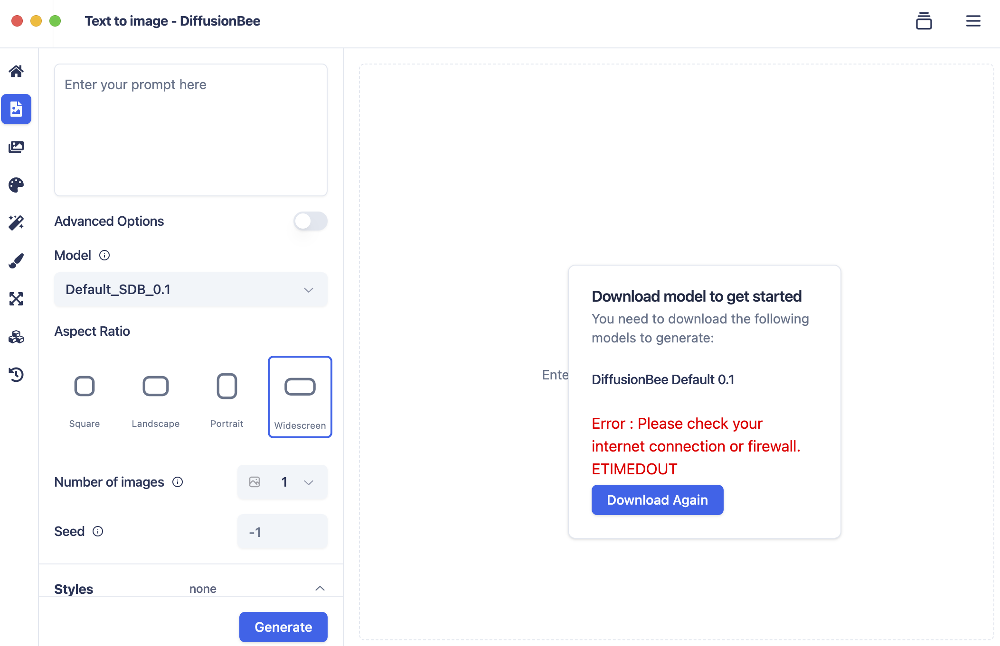
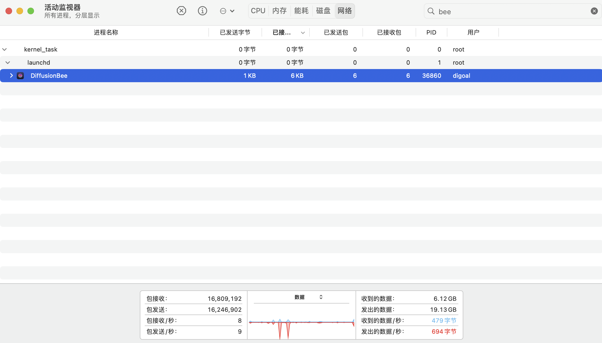

## 用tcpdump抓包了解程序到底在访问什么URL, 科学上网/翻墙场景 - 搞定DiffusionBee下载文生图模型    
                                                                            
### 作者                                                                 
digoal                                                                   
                                                                                   
### 日期                                                                                 
2024-11-16                                                
                                          
### 标签                                                               
PostgreSQL , PolarDB , DuckDB , 科学上网     
                                                                                                       
----                                                                                
                                                                                              
## 背景    
http代理和socks5代理可以很好的解决某些网站无法访问的问题, 但是前提是你得知道应用到底在访问什么网站? 总不能把所有流量都打到代理, 你要访问国内的网站也打到代理那不是要慢死?  
  
所以可以配置pac文件, 让某些地址走代理, 其他的走本地.  详见:    
- [《macOS 通过“oversea region ECS和ssh隧道转发代理请求” OR “openVPN” 提升github等访问体验 - chrome Proxy SwitchyOmega , cli ... 可用》](../202310/20231029_01.md)    
- [《iphone/macOS PC 使用nginx/httpd配置proxy.pac共享socks5 代理加速github网络访问》](../202405/20240505_02.md)    
- [《用宿主机代理(all_proxy http_proxy https_proxy)来解决docker build或docker 容器中github clone无法访问的问题》](../202403/20240327_01.md)    
  
## 如何知道程序访问什么网站失败了呢?      
如果是chrome浏览器就比较方便, 装个SwitchyOmega插件就可以了, 其他程序呢?   
  
下面给个例子, 刚好在弄使用 DiffusionBee 文生图的工具时, 需要先下载diffusion模型, 但是下载失败了, 不用说, 被墙了.   
- [《如何使用stable diffusion在Apple Silicon芯片的Mac上画图（GPU加速）- 文生图text-to-image》](../202411/20241115_02.md)    
  
  
  
但DiffusionBee到底要访问什么URL呢? 可以用tcpdump工具抓包看看  
  
1、首先要知道这个程序的进程名  
  
  
  
2、设置网络DNS为`8.8.8.8`   
    
3、抓包  
```  
sudo tcpdump -Q "proc=DiffusionBee"   
```  
  
```  
Password:
tcpdump: data link type PKTAP
tcpdump: verbose output suppressed, use -v[v]... for full protocol decode
listening on pktap, link-type PKTAP (Apple DLT_PKTAP), snapshot length 524288 bytes
09:45:36.236071 IP 192.168.31.96.55525 > edge-mqtt-mini-shv-01-gru2.facebook.com.https: Flags [S], seq 1724966399, win 65535, options [mss 1460,nop,wscale 6,nop,nop,TS val 2996129081 ecr 0,sackOK,eol], length 0
09:45:37.237462 IP 192.168.31.96.55525 > edge-mqtt-mini-shv-01-gru2.facebook.com.https: Flags [S], seq 1724966399, win 65535, options [mss 1460,nop,wscale 6,nop,nop,TS val 2996130082 ecr 0,sackOK,eol], length 0
09:45:38.238649 IP 192.168.31.96.55525 > edge-mqtt-mini-shv-01-gru2.facebook.com.https: Flags [S], seq 1724966399, win 65535, options [mss 1460,nop,wscale 6,nop,nop,TS val 2996131084 ecr 0,sackOK,eol], length 0
09:45:39.239797 IP 192.168.31.96.55525 > edge-mqtt-mini-shv-01-gru2.facebook.com.https: Flags [S], seq 1724966399, win 65535, options [mss 1460,nop,wscale 6,nop,nop,TS val 2996132085 ecr 0,sackOK,eol], length 0
09:45:40.241013 IP 192.168.31.96.55525 > edge-mqtt-mini-shv-01-gru2.facebook.com.https: Flags [S], seq 1724966399, win 65535, options [mss 1460,nop,wscale 6,nop,nop,TS val 2996133086 ecr 0,sackOK,eol], length 0
09:45:41.241737 IP 192.168.31.96.55525 > edge-mqtt-mini-shv-01-gru2.facebook.com.https: Flags [S], seq 1724966399, win 65535, options [mss 1460,nop,wscale 6,nop,nop,TS val 2996134087 ecr 0,sackOK,eol], length 0
09:45:43.242543 IP 192.168.31.96.55525 > edge-mqtt-mini-shv-01-gru2.facebook.com.https: Flags [S], seq 1724966399, win 65535, options [mss 1460,nop,wscale 6,nop,nop,TS val 2996136087 ecr 0,sackOK,eol], length 0
09:45:47.242887 IP 192.168.31.96.55525 > edge-mqtt-mini-shv-01-gru2.facebook.com.https: Flags [S], seq 1724966399, win 65535, options [mss 1460,nop,wscale 6,nop,nop,TS val 2996140088 ecr 0,sackOK,eol], length 0
09:45:55.244344 IP 192.168.31.96.55525 > edge-mqtt-mini-shv-01-gru2.facebook.com.https: Flags [S], seq 1724966399, win 65535, options [mss 1460,nop,wscale 6,nop,nop,TS val 2996148089 ecr 0,sackOK,eol], length 0
09:45:56.261586 IP 192.168.31.96.55526 > 104.21.22.85.https: Flags [S], seq 620599372, win 65535, options [mss 1460,nop,wscale 6,nop,nop,TS val 1063411342 ecr 0,sackOK,eol], length 0
09:45:56.464040 IP 104.21.22.85.https > 192.168.31.96.55526: Flags [S.], seq 2524932605, ack 620599373, win 65535, options [mss 1400,sackOK,TS val 2665294659 ecr 1063411342,nop,wscale 13], length 0
09:45:56.464171 IP 192.168.31.96.55526 > 104.21.22.85.https: Flags [.], ack 1, win 2060, options [nop,nop,TS val 1063411545 ecr 2665294659], length 0
09:45:56.464994 IP 192.168.31.96.55526 > 104.21.22.85.https: Flags [P.], seq 1:518, ack 1, win 2060, options [nop,nop,TS val 1063411545 ecr 2665294659], length 517
09:45:56.667098 IP 104.21.22.85.https > 192.168.31.96.55526: Flags [.], ack 518, win 9, options [nop,nop,TS val 2665294863 ecr 1063411545], length 0
09:45:56.672781 IP 104.21.22.85.https > 192.168.31.96.55526: Flags [.], seq 1:1425, ack 518, win 9, options [nop,nop,TS val 2665294868 ecr 1063411545], length 1424
09:45:56.672783 IP 104.21.22.85.https > 192.168.31.96.55526: Flags [P.], seq 1425:2832, ack 518, win 9, options [nop,nop,TS val 2665294868 ecr 1063411545], length 1407
09:45:56.672875 IP 192.168.31.96.55526 > 104.21.22.85.https: Flags [.], ack 2832, win 2016, options [nop,nop,TS val 1063411754 ecr 2665294868], length 0
09:45:56.679142 IP 192.168.31.96.55526 > 104.21.22.85.https: Flags [P.], seq 518:706, ack 2832, win 2048, options [nop,nop,TS val 1063411760 ecr 2665294868], length 188
09:45:56.889706 IP 104.21.22.85.https > 192.168.31.96.55526: Flags [P.], seq 2832:4086, ack 706, win 9, options [nop,nop,TS val 2665295085 ecr 1063411760], length 1254
09:45:56.889706 IP 104.21.22.85.https > 192.168.31.96.55526: Flags [P.], seq 4086:4110, ack 706, win 9, options [nop,nop,TS val 2665295085 ecr 1063411760], length 24
09:45:56.889707 IP 104.21.22.85.https > 192.168.31.96.55526: Flags [F.], seq 4110, ack 706, win 9, options [nop,nop,TS val 2665295085 ecr 1063411760], length 0
09:45:56.889787 IP 192.168.31.96.55526 > 104.21.22.85.https: Flags [.], ack 4110, win 2028, options [nop,nop,TS val 1063411971 ecr 2665295085], length 0
09:45:56.889813 IP 192.168.31.96.55526 > 104.21.22.85.https: Flags [.], ack 4111, win 2028, options [nop,nop,TS val 1063411971 ecr 2665295085], length 0
09:45:56.892319 IP 192.168.31.96.55526 > 104.21.22.85.https: Flags [P.], seq 706:730, ack 4111, win 2048, options [nop,nop,TS val 1063411973 ecr 2665295085], length 24
09:45:56.892438 IP 192.168.31.96.55526 > 104.21.22.85.https: Flags [F.], seq 730, ack 4111, win 2048, options [nop,nop,TS val 1063411973 ecr 2665295085], length 0
09:45:56.905526 IP 192.168.31.96.55527 > 67.230.169.182.16clouds.com.https: Flags [S], seq 1003458406, win 65535, options [mss 1460,nop,wscale 6,nop,nop,TS val 2251254128 ecr 0,sackOK,eol], length 0
```  
  
更多用法请参考tcpdump 帮助文档.  
  
  
还是失败了, 把proxy全放开(所有流量走代理)、防火墙关闭、DNS使用`8.8.8.8`, 也没能下载成功, 可能对方根据来源IP进行了限制,或者DiffusionBee压根没走代理.    
  
    
  
最后通过下面的方法3成功.   
  
### 尝试http代理     
使用https_proxy/http_proxy/all_proxy环境变量, 在命令行界面启动DiffusionBee则报另外的错误.   
```
1、tunneling socket could not be established, cause=socket hang up

export https_proxy=socks5://127.0.0.1:11111
/Applications/DiffusionBee.app/Contents/MacOS/DiffusionBee 
   
2、Please check your internet connection or firewall. tunneling socket could not be established, statusCode=405

export https_proxy="http://127.0.0.1/proxy_all.pac"
/Applications/DiffusionBee.app/Contents/MacOS/DiffusionBee
```
  
### 尝试http代理: by socks5 server forward  
通过http代理可能有办法解决这个问题:   
   
https://github.com/divamgupta/diffusionbee-stable-diffusion-ui/issues/508   
```   
5c1bf480a210:~ digoal$ export all_proxy=socks5://127.0.0.1:11111   
   
5c1bf480a210:~ digoal$ brew install npm   
   
npm config set proxy http://127.0.0.1:8118   
npm config set https-proxy http://127.0.0.1:8118   
   
unset all_proxy   
   
open /Applications/DiffusionBee.app     
```   
   
http代理配置参考:    
- [《用privoxy配置http proxy代理, 将http请求转发给socks5服务》](../202411/20241116_02.md)     
  
### 成功. 尝试http代理: by squid and SSH
[《通过http / https proxy代理配置拉取docker hub镜像》](../202407/20240704_01.md)  
  
通过这个方法, 可以下载模型了.   
```
5c1bf480a210:~ digoal$ export http_proxy='http://localhost:22222'
5c1bf480a210:~ digoal$ export https_proxy='http://localhost:22222'
5c1bf480a210:~ digoal$ /Applications/DiffusionBee.app/Contents/MacOS/DiffusionBee 
```
   
  
## 参考  
[《通过http / https proxy代理配置拉取docker hub镜像》](../202407/20240704_01.md)  
    
[《iphone/macOS PC 使用nginx/httpd配置proxy.pac共享socks5 代理加速github网络访问》](../202405/20240505_02.md)    
  
[《macOS 通过“oversea region ECS和ssh隧道转发代理请求” OR “openVPN” 提升github等访问体验 - chrome Proxy SwitchyOmega , cli ... 可用》](../202310/20231029_01.md)    
  
[《用宿主机代理(all_proxy http_proxy https_proxy)来解决docker build或docker 容器中github clone无法访问的问题》](../202403/20240327_01.md)    
  
ip地址详情  
- https://ipinfo.io/  
  
Recording a Packet Trace  
- https://developer.apple.com/documentation/network/recording-a-packet-trace  
  
macOS 下使用 tcpdump 抓包  
- https://www.jianshu.com/p/a57a5b0e58f0  
  
tcpdump 详细使用指南（请尽情食用）  
- https://blog.csdn.net/qq_24433609/article/details/126729595  
  
diffusionbee  
- https://github.com/divamgupta/diffusionbee-stable-diffusion-ui/releases  
- https://github.com/divamgupta/diffusionbee-stable-diffusion-ui  
  
wireshark 抓包工具  
- https://www.wireshark.org/  
  
sniffnet 网络监控工具  
- https://sniffnet.net/download/  
  
  
#### [期望 PostgreSQL|开源PolarDB 增加什么功能?](https://github.com/digoal/blog/issues/76 "269ac3d1c492e938c0191101c7238216")
  
  
#### [PolarDB 开源数据库](https://openpolardb.com/home "57258f76c37864c6e6d23383d05714ea")
  
  
#### [PolarDB 学习图谱](https://www.aliyun.com/database/openpolardb/activity "8642f60e04ed0c814bf9cb9677976bd4")
  
  
#### [PostgreSQL 解决方案集合](../201706/20170601_02.md "40cff096e9ed7122c512b35d8561d9c8")
  
  
#### [德哥 / digoal's Github - 公益是一辈子的事.](https://github.com/digoal/blog/blob/master/README.md "22709685feb7cab07d30f30387f0a9ae")
  
  
#### [About 德哥](https://github.com/digoal/blog/blob/master/me/readme.md "a37735981e7704886ffd590565582dd0")
  
  

  
