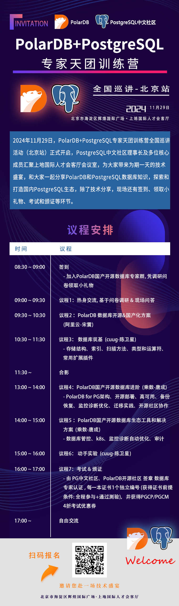

## 千万别学国产数据库!     
                                                                                     
### 作者                                                                          
digoal                                                                            
                                                                                            
### 日期                                                                                          
2024-11-20                                                     
                                                   
### 标签                                                                        
PostgreSQL , PolarDB , DuckDB , 国产数据库 , 活动               
                                                                                                                
----                                                                                         
                                                                                                       
## 背景      
学一门手艺, 当然是希望能长期转换为money.    
  
现在国产数据库太多了, <b>几百家, 太不合常理了</b>, 数据库又不是插线板, 还是有很高技术和商务门槛的好吧. 如果没有了国产化的政策市场, 能留下多少家?   
  
<b>从概率来讲, 现在学任何一款国产数据库, 成功的概率都只有几百分之一(包括现在排在前十的), 这是个概率问题. </b> 你肯定会认为我在扯蛋, 排在前十的也不能学? 我不知道怎么说比较好, 因为这不是电视节目没有主持人:    
  
    
  
但是你又不想错过这个风口, 毕竟经过政策的洗礼, 肯定会有脱颖而出的国产数据库. 就像电动汽车, 前期也是各种政策补贴啊, 现在国产的电车出货量确实大到惊人, 冰箱彩电大沙发还有卡拉OK, 价格还便宜, 巡航时间也不是什么大问题了, 谁不想要一辆呢.     
  
## 那么怎么才能提高成功的概率呢?   
换个思路, 找出国产数据库的共性或派系, 重新计算概率.    
  
我们先问一个问题: 为什么会有这么多国产数据库厂商? 政策导向只是市场推手, 但是从技术储备到产品化是需要大量时间的, 怎么突然就几百家了? 如果我们的技术这么牛, 中国数据库不应该早就是世界领导者了么? 为什么没有发生呢? 你肯定会说了, 这不就是公开的秘密么, 大多数都是基于PostgreSQL开源数据库的呀, 没错, 你知我知他也知道用户更知!     
  
所以我们可以将国产数据库按根数据库或兼容性来重新定义派系, 基于/兼容PostgreSQL的有多少家, 兼容Oracle的有多少家, 基于/兼容MySQL的有多少家?    
  
很明显基于/兼容PostgreSQL的占比最高, 那就学PostgreSQL不就完了, 再选一个PostgreSQL体系内在墨天轮排第一位的国产数据库一起学. 这才是投入产出比最高的学习.     
  
我选PolarDB的逻辑不是因为我在阿里云上班, 而是我信云是未来的趋势, 因为已经有“主持人”揭示了云商业上的成功, 这个“主持人”就是纳斯达克, 请自己去看云厂商/云数据库服务提供商的上市公司数量、股价走势, 有云形态业务的数据库公司的销售占比等.    
  
## 想什么来什么, 活动来了  
2024年11月29日, 由PolarDB社区联合PostgreSQL社区发起的《国产开源数据库PolarDB+PostgreSQL专家训练营》在北京站正式开课. PostgreSQL中文社区理事长及多位核心成员汇聚上地国际人才会客厅会议室，为大家带来为期一天的技术盛宴，和大家一起分享PolarDB和PostgreSQL数据库知识，探索和打造国内PostgreSQL生态，除了技术分享，现场还有热身交流讨论、实验、考试和颁证等环节。议程详见海报内容，欢迎扫码报名参加。  
  
<b>地点: 北京市海淀区辉煌国际广场 · 上地国际人才会客厅</b>  
  
<b>时间: 2024年11月29日</b>  
  
    
  
## 参考    
特别感谢兼容PostgreSQL的云原生分布式数仓ProtonBase( https://protonbase.com/ ), PolarDB社区, PostgreSQL社区对本次活动的支持.    
  
安全可靠测评结果公告（2023年第1号）  
- http://www.itsec.gov.cn/aqkkcp/cpgg/202312/t20231226_162074.html  
  
安全可靠测评结果公告（2024年第2号）  
- http://www.itsec.gov.cn/aqkkcp/cpgg/202409/t20240930_194299.html  
  
  
#### [期望 PostgreSQL|开源PolarDB 增加什么功能?](https://github.com/digoal/blog/issues/76 "269ac3d1c492e938c0191101c7238216")
  
  
#### [PolarDB 开源数据库](https://openpolardb.com/home "57258f76c37864c6e6d23383d05714ea")
  
  
#### [PolarDB 学习图谱](https://www.aliyun.com/database/openpolardb/activity "8642f60e04ed0c814bf9cb9677976bd4")
  
  
#### [PostgreSQL 解决方案集合](../201706/20170601_02.md "40cff096e9ed7122c512b35d8561d9c8")
  
  
#### [德哥 / digoal's Github - 公益是一辈子的事.](https://github.com/digoal/blog/blob/master/README.md "22709685feb7cab07d30f30387f0a9ae")
  
  
#### [About 德哥](https://github.com/digoal/blog/blob/master/me/readme.md "a37735981e7704886ffd590565582dd0")
  
  

  
