## 数据库筑基课 - lsm-tree  
                                                                                          
### 作者                                                              
digoal                                                              
                                                                     
### 日期                                                                   
2024-11-22                                                    
                                                                  
### 标签                                                                
PostgreSQL , PolarDB , DuckDB , 应用开发者 , 数据库筑基课 , 表组织结构 , lsm-tree      
                                                                                         
----                                                                  
                                                                                
## 背景            
[《数据库筑基课 - 大纲》](../202409/20240914_01.md)          
        
<b>本节: lsm-tree</b>           
        
## 简介    
Log-Structured Merge-trees, 常被称为 LSM-Tree, 被广泛应用在NoSQL系统存储层，如：BigTable、Dynamo、HBase、Cassandra、LevelDB、RocksDB和AsterixDB等。LSM Tree名字往往会给初识者一个错误的印象，事实上，LSM树并不像B+树、红黑树一样是一颗严格的树状数据结构，它其实是一种存储结构，所以我把LSM放在筑基课的存储引擎里面来说.   
  
LSM-Tree 的设计思想是提高写入/更新/删除的速度. 所有的操作都是append, 也就是insert only, 然后有个标记这是insert/update/delete. 在 [《数据库筑基课 - HBase HStore 列簇存储》](../202411/20241107_01.md) 这篇中有介绍. 这么做确实可以让写入/更新/删除变得很快, 但是也带来了一系列问题, 它肯定是牺牲了什么? 如果真的什么都没有牺牲, 为什么其他数据库不都这么干呢?  先看看lsm-tree的架构, 后面再来说它的优劣势.    
  
### 架构  
LSM-Tree 先将数据直接写入到日志(类似PostgreSQL WAL日志, 防止丢失. WAL日志是顺序写的操作, 写吞吐还是比较大的.), 然后写入内存(写入/更新/删除所有的操作都是append)，如果内存中的memtable达到一定阈值, 通过合并线程将内存数据刷新到磁盘。  
  
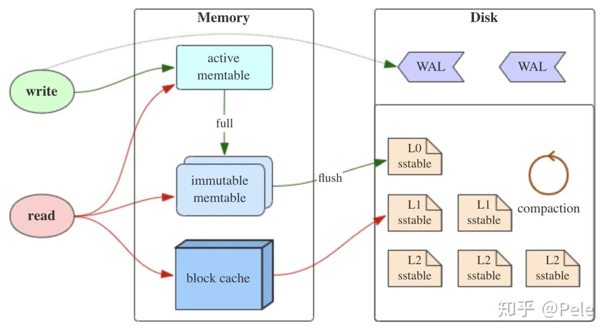  
  
  
  
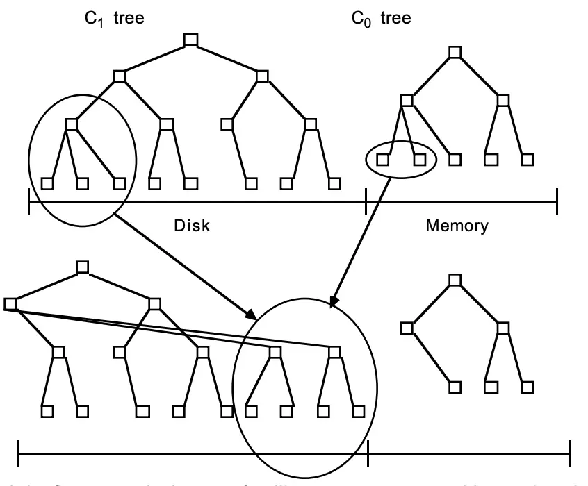  
  
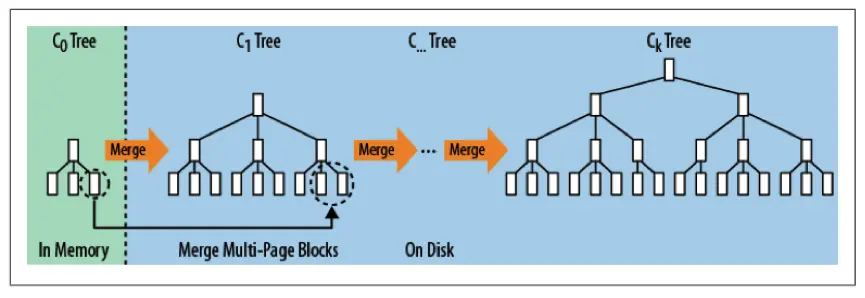  
  
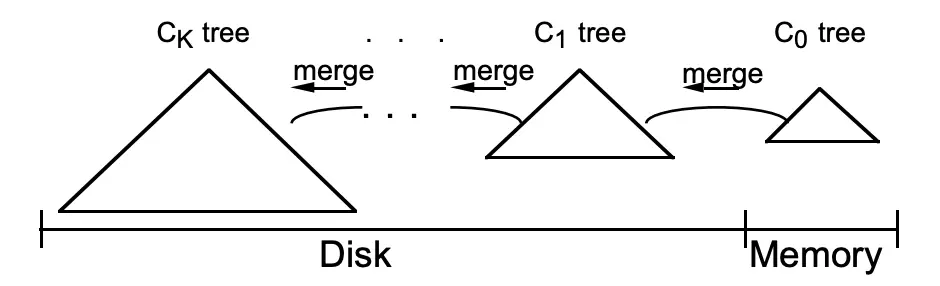  
  
  
LSM树有三个重要组成部分：  
  
1) MemTable  
  
MemTable是在内存中的数据结构，用于保存最近的数据，会按照Key有序地组织这些数据，LSM树并没有明确定义如何有序地组织数据，主要看各家产品的实现, 例如Hbase使跳跃表来保证内存中key的有序。  
  
因为数据暂时保存在内存中，内存并不是可靠存储，如果断电会丢失数据，因此会通过WAL(Write-ahead logging，预写式日志)的方式来保证数据的可靠性。  
  
2) Immutable MemTable  
  
当 MemTable达到一定大小后，会转化成Immutable MemTable(看这词的字面意思就知道, 是稳定不变的memtable)。Immutable MemTable是将转MemTable变为SSTable的一种中间状态。写操作由新的MemTable处理，在转存过程中不阻塞数据更新操作。  
  
3) SSTable(Sorted String Table)   
  
有序键值对集合，是LSM Tree在磁盘中的数据结构。为了加快SSTable的读取，可以通过给key建立索引以及布隆过滤器来加快key的查找。所以hbase也只有基于rowkey查找速度才快, 其他的字段上没有索引(secondary index), 其实是很慢的.     
  
  
  
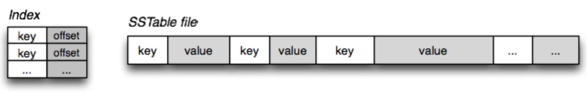  
  
LSM树(Log-Structured-Merge-Tree)正如它的名字一样，LSM树会将所有的数据插入、修改、删除等操作记录(注意是操作记录: 包含字段、时间、操作行为、被操作的字段值)保存在内存之中，当此类操作达到一定的数据量后，再批量地顺序写入到磁盘当中。这与B+树不同，B+树数据的更新会直接在原数据所在处修改对应的值，但是LSM数的数据更新是日志式的，当一条数据更新是直接append一条更新记录完成的。这样设计的目的就是为了顺序写，不断地将Immutable MemTable flush到持久化存储即可，而不用去修改之前的SSTable中的key，保证了顺序写。  
  
是不是有点迷惑了, 在不同的SSTable中，可能存在相同Key的记录, 例如有3个字段, 最开始写入了一次, 然后更新了字段1, 然后又更新了字段2, 然后又更新了字段3, 这4次操作就产生了4条操作记录. 但是读取时需要读取每个字段的最新值, 如果只读取1个字段还好, 如果要读取很多个字段, 合并过程带来的读放大性能损耗会比较严重. 这样设计的虽然大大提高了写性能，但同时也会带来一些问题：  
- 1）冗余存储，对于某个rowkey，实际上除了最新的记录外，其他的记录都是冗余无用的，但是仍然占用了存储空间。因此需要进行Compact操作(合并多个SSTable)来清除冗余的记录。  
- 2）读取时需要从最新的倒着查询，直到找到某个rowkey的记录。最坏情况需要查询完所有的SSTable才能把需要的行拼接出来，这里可以通过前面提到的rowkey索引/布隆过滤器来优化查找速度。  
  
### LSM树的Compact(合并收缩)策略    
Compact操作是十分关键的操作，否则SSTable数量会不断膨胀。在Compact策略上，主要介绍两种基本策略：size-tiered和leveled。在介绍这两种策略之前，先介绍三个比较重要的概念，事实上不同的策略就是围绕这三个概念之间做出权衡和取舍。  
- 1）读放大: 读取数据时实际读取的数据量大于真正的数据量。例如在LSM树中需要先在MemTable查看当前key是否存在，不存在继续从SSTable中寻找, 如果有多层sstable或每层有多个sstable, 则可能要查找很多个sstable。  
- 2）写放大: 写入数据时实际写入的数据量大于真正的数据量。例如在LSM树中写入时可能触发Compact操作，导致实际写入的数据量远大于该key的数据量。  
- 3）空间放大: 数据实际占用的磁盘空间比数据的真正大小更多。上面提到的冗余存储，对于一个key来说，只有最新的记录是有效的，之前的记录都是可以被清理回收的。更坏的情况是一个KEY有多个字段, 不同的字段都有一个最新版本, 那清理起来会更加复杂. 一些产品可能会设计成每个字段对应一个key, 使用逻辑结构来定义表的多个字段(即多个key), 查找什么字段就查找其对应的key的最新值即可.      
  
#### 1、size-tiered compaction与空间放大  
  
size-tiered compaction的思路非常直接：每层允许的SST文件最大数量都有个相同的阈值(例如每层最多允许4个sst文件)，随着memtable不断flush成SST(这层的每个sst文件大小不会超过memtable的大小, 通常会小一些, 因为同一个key更新了很多遍的操作可能都记录在了同一个memtable中.)，某层的SST数达到阈值时，就把该层所有SST全部合并成一个大的新SST，并放到较高一层去(更高层的这一个sst大小应该小于或等于上一层所有sstable文件的大小, 原因同上.)。下图是阈值为4的示例。  
  
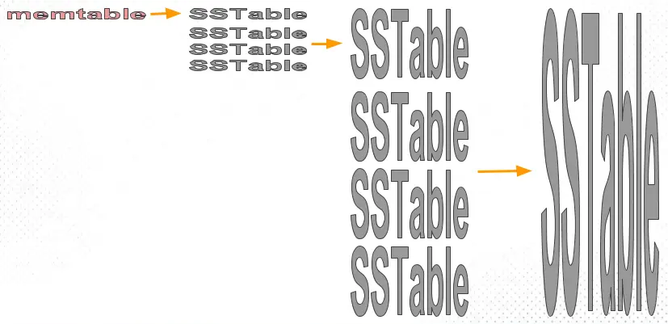  
  
size-tiered compaction的优点是简单且易于实现，并且SST数目少(每层sst文件个数固定)，定位到文件的速度快。但是单个SST的大小有可能会很大，较高的层级出现数百GB甚至TB级别的SST文件都是常见的。它的缺点是空间放大比较严重，下面详细说说。  
  
所谓空间放大（space amplification），就是指存储引擎中的数据实际占用的磁盘空间比真实数据大的情况。例如，数据的真正大小是10MB，但实际存储时耗掉了25MB空间，那么空间放大因子（space amplification factor）就是2.5。  
  
为什么会出现空间放大呢？很显然，LSM-based存储引擎中数据的增删改都不是in-place的，而是需要等待compaction执行到对应的key才算完。也就是说，一个key可能会同时对应多个value（删除标记算作特殊的value），而只有一个value是真正有效的，其余那些就算做空间放大。另外，在compaction过程中，原始数据在执行完成之前是不能删除的（防止出现意外无法恢复），所以同一份被compaction的数据最多可能膨胀成原来的两倍，这也算作空间放大的范畴(例如正在compaction某个sst文件, 实际上最多可能要占用2个sst文件的空间), 所以在越高层出现compaction时, 越容易观察到空间放大。  
  
下面用Cassandra的size-tiered compaction策略举两个例子，以方便理解。每层SST个数的阈值仍然采用默认值4。  
  
- 以约3MB/s的速度持续插入新数据（保证unique key），时间与磁盘占用的曲线图如下。  
  
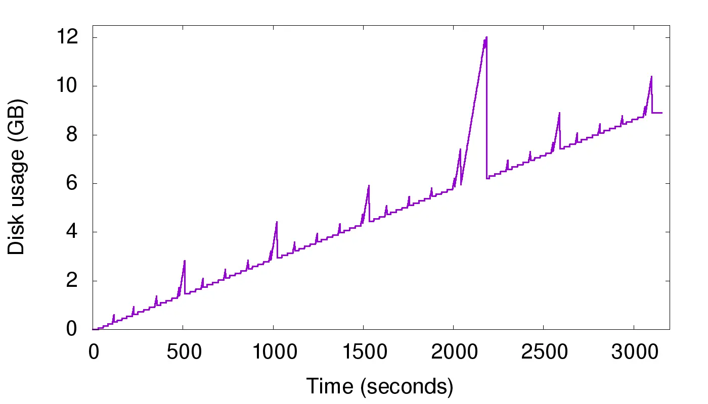  
  
图中清晰可见有不少毛刺，这就是compaction过程造成的空间放大。注意在2000s~2500s之间还有一个很高的尖峰，原数据量为6GB，但在一瞬间增长到了12GB，说明Cassandra在做大SST之间的compaction，大SST文件的缺陷就显现出来了。尽管这只是暂时的，但是也要求我们必须预留出很多不必要的空闲空间，增加成本, 也增加了不可控故障风险。  
  
- 重复写入一个400万条数据的集合（约1.2GB大，保证unique key），重复写入15次来模拟数据更新，时间与磁盘占用的曲线图如下。  
  
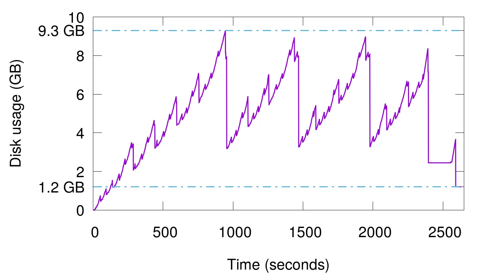  
  
这种情况更厉害，最高会占用多达9.3GB磁盘空间，放大因子为7.75。虽然中途也会触发compaction，但是最低只能压缩到3.5GB左右，仍然有近3倍的放大。这是因为重复key过多，就算每层compaction过后消除了本层的空间放大，但key重复的数据仍然存在于较低层中，始终有冗余。只有手动触发了full compaction（即图中2500秒过后的最后一小段），才能完全消除空间放大，但full compaction是极耗费性能的。  
  
接下来介绍leveled compaction，看看它是否能解决size-tiered compaction的空间放大问题。  
  
#### 2、leveled compaction与写放大   
  
leveled compaction的思路是：L0层(也就是memtable的D层)和size-tiered compaction处理方式一样, 但是对于L1层(也就是memtable的DD层, `大公司毛病犯了, D是公司黑话`)及以上层的数据，将size-tiered compaction中原本的大SST拆开，成为多个key互不相交的小SST的序列，这样的序列叫做“run”。L0层是从memtable flush过来的新SST，该层各个SST的key是可以相交的，并且其数量阈值单独控制（如4）。从L1层开始，每层都包含恰好一个run(run内的key不重复. 在同一个run内, 多个sst文件的所有key可以认为是全局唯一的.)，并且run内包含的sst文件个数阈值呈指数增长(例如: l1 10个文件, l2 100个文件, l3 1000个文件)。  
  
下图是假设从L1层开始，每个小SST的大小都相同（在实际操作中不会强制要求这点），且数据量阈值按10倍增长的示例。即L1最多可以有10个SST，L2最多可以有100个，以此类推。  
  
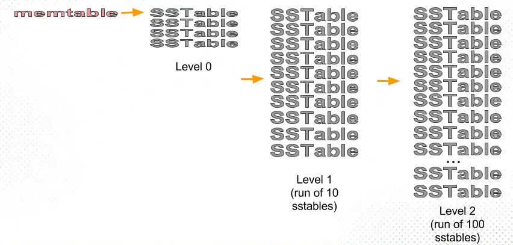  
  
随着SST不断写入，L1的sst文件个数会或单个文件大小可能会超过阈值。这时就会选择L1中的至少一个SST，将其数据合并到L2层与其key有交集的那些文件中，并从L1删除这些数据。仍然以上图为例，一个L1层SST的key区间大致能够对应到10个L2层的SST，所以一次compaction会影响到11个文件。该次compaction完成后，L2的数据量又有可能超过阈值，进而触发L2到L3的compaction，如此迭代，就可以完成Ln层到Ln+1层的compaction了。  
  
可见，leveled compaction与size-tiered compaction相比，每次做compaction时不必再选取一层内所有的数据，并且每层中SST的key区间都是不相交的，重复key减少了，所以很大程度上缓解了空间放大的问题。  
  
假设存在以下这样的场景:    
  
1) L1的总大小超过L1本身大小限制：  
  
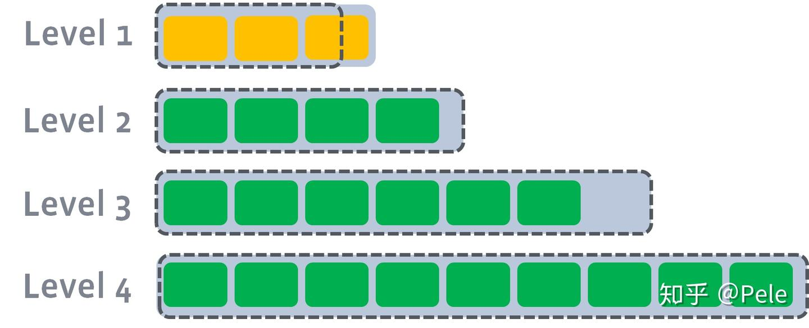  
  
2) 此时会从L1中选择至少一个文件，然后把它跟L2有交集的部分进行合并。生成的文件会放在L2:     
  
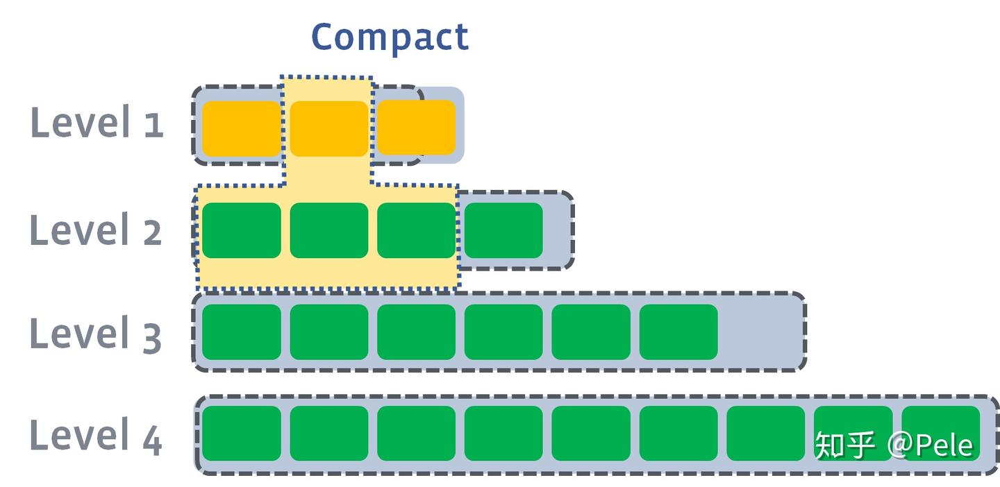  
  
如上图所示，此时L1第二SSTable的key的范围覆盖了L2中前三个SSTable，那么就需要将L1中第二个SSTable与L2中前三个SSTable执行Compact操作。  
  
3) 如果L2合并后的结果超过L2本身大小限制，需要重复之前的操作 —— 选至少一个文件然后把它合并到下一层:  
  
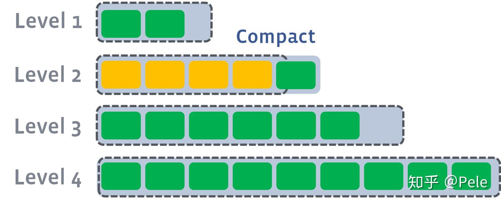  
  
多个不相干的sst合并可以并发进行  
  
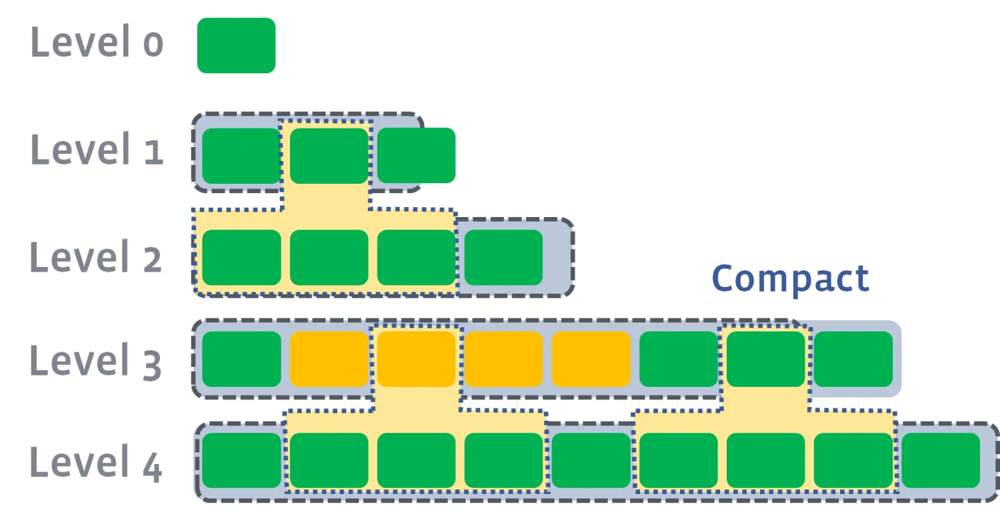  
  
leveled策略相较于size-tiered策略来说，每层内key是不会重复的，即使是最坏的情况，除开最底层外，其余层都是重复key，按照相邻层大小比例为10来算，冗余占比也很小。因此空间放大问题得到缓解。但是写放大问题会更加突出。举一个最坏场景，如果LevelN层某个SSTable的key的范围跨度非常大，覆盖了LevelN+1层所有key的范围，那么进行Compact时将涉及LevelN+1层的全部数据。  
  
重复一遍上一节做的两个实验，曲线图分别如下。  
  
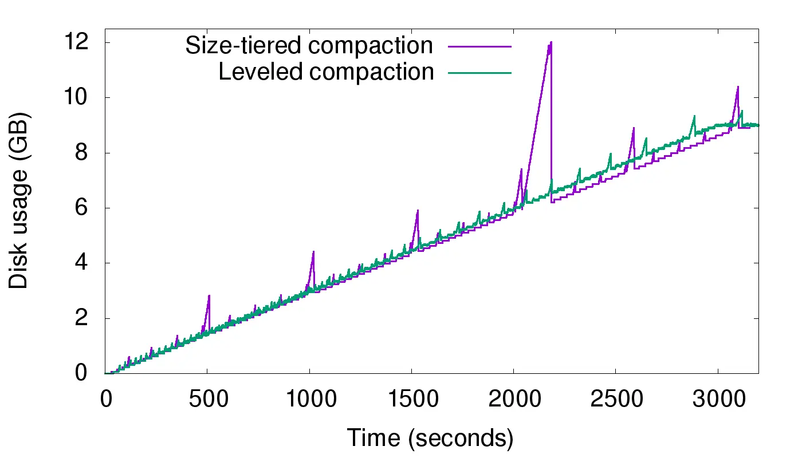  
  
  
持续写入实验，尖峰消失了。  
  
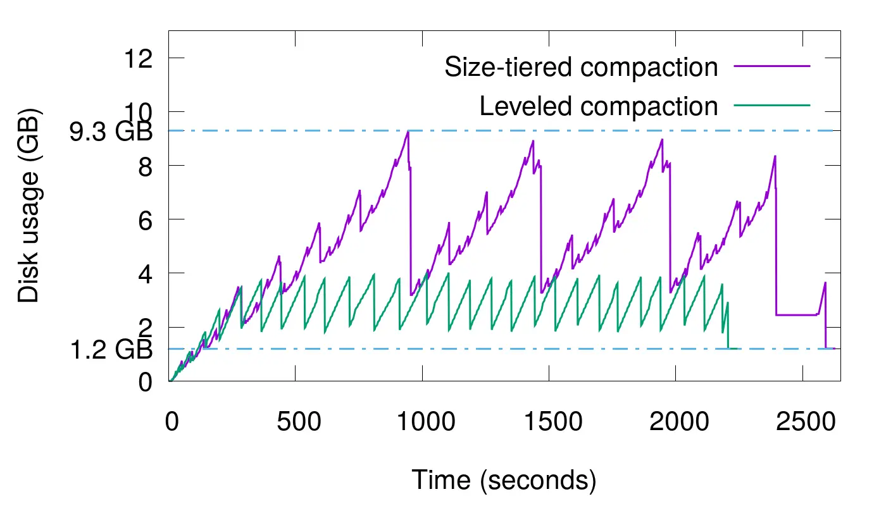  
  
  
持续更新实验，磁盘占用量的峰值大幅降低，从原来的9.3GB缩减到了不到4GB。  
  
但是鱼与熊掌不可兼得，空间放大并不是唯一掣肘的因素。仍然以size-tiered compaction的第一个实验为例，写入的总数据量约为9GB大，但是查看磁盘的实际写入量，会发现写入了50个G的数据。这就叫写放大（write amplification）问题。  
  
写放大又是怎么产生的呢？下面的图能够说明。  
  
  
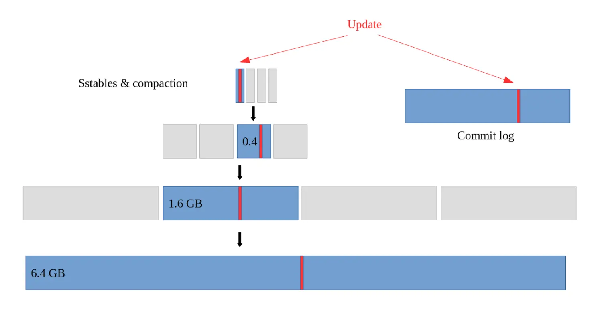  
  
  
可见，这是由compaction的本质决定的：同一个key的数据会不断地随着compaction过程向更高的层级重复写入(有点像沉淀, 最终会沉淀到最底层的sstable中. 并且在沉淀过程中, 每一层都要留下痕迹, 也就是写操作.)，有多少层就会写多少次。但是，我们的leveled compaction的写放大要严重得多，同等条件下实际写入量会达到110GB，是size-tiered compaction的两倍有余。这是因为Ln层SST在合并到Ln+1层时是一对多的(例如l1层某个sst合并到l2层可能对应了10个文件, 难道这10个文件是全量计算和刷新? 不是增量刷新吗?)，故重复写入的次数会更多。在极端情况下，我们甚至可以观测到数十倍的写放大。  
  
写放大会带来两个风险：一是更多的磁盘带宽耗费在了无意义的写操作上，会影响读操作的效率；二是对于闪存存储（SSD），会造成存储介质的寿命更快消耗，因为闪存颗粒的擦写次数是有限制的。在实际使用时，必须权衡好空间放大、写放大、读放大三者的优先级。  
  
  
## 优势 & 适合场景      
要求写入/更新特别快, 但是读取老的key可能要访问更多的数据块(因为可能沉淀到很深的sstable了, 所以需要访问很多层)      
  
写多(要求高速写入/更新/删除), 同时读最近“写入/更新”的key较多(可以保持比较高的读性能, 无需搜索到深层的sstable, 读放大不明显)    
  
写多(要求高速写入/更新/删除), 同时有高并发读请求, 但是每次请求读少量KEY    
  
## 劣势 & 不适合场景        
  
不适合高并发读写入很久的数据, 存在读放大, 越旧的数据访问越慢(因为可能沉淀到很深的sstable了, 所以需要访问很多层)    
  
不适合每次请求访问很多key的情况, 因为不同的key可能存放在不同的块内, 需要访问更多块. 同时每个key还可能有读放大, 越旧的数据访问越慢(因为可能沉淀到很深的sstable了, 所以需要访问很多层)    
  
弊端总结     
- 冗余存储，对于某个rowkey，实际上除了最新的记录外，其他的记录都是冗余无用的，但是仍然占用了存储空间。因此需要进行Compact操作(合并多个SSTable)来清除冗余的记录。  
- 读取时需要从最新的倒着查询，直到找到某个rowkey的记录。最坏情况需要查询完所有的SSTable才能把需要的行拼接出来，这里可以通过前面提到的rowkey索引/布隆过滤器来优化查找速度。  
- 读放大: 读取数据时实际读取的数据量大于真正的数据量。例如在LSM树中需要先在MemTable查看当前key是否存在，不存在继续从SSTable中寻找, 如果有多层sstable或每层有多个sstable, 则可能要查找很多个sstable。  
- 写放大: 写入数据时实际写入的数据量大于真正的数据量。例如在LSM树中写入时可能触发Compact操作，导致实际写入的数据量远大于该key的数据量。  
- 空间放大: 数据实际占用的磁盘空间比数据的真正大小更多。上面提到的冗余存储，对于一个key来说，只有最新的记录是有效的，之前的记录都是可以被清理回收的。更坏的情况是一个KEY有多个字段, 不同的字段都有一个最新版本, 那清理起来会更加复杂. 一些产品可能会设计成每个字段对应一个key, 使用逻辑结构来定义表的多个字段(即多个key), 查找什么字段就查找其对应的key的最新值即可.      
  
  
## DEMO     
  
略  
  
## 扩展问题         
  
1、hbase memstore合并到hfile  
  
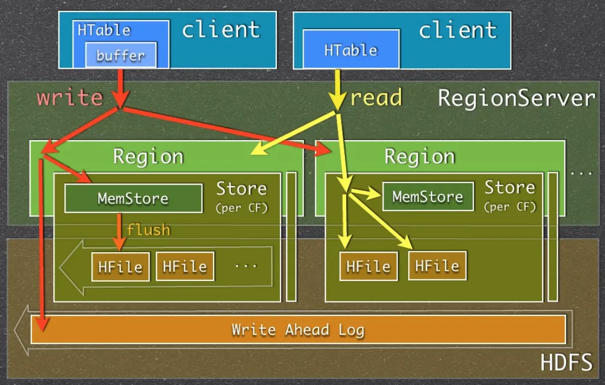  
  
疑问:    
  
hbase是列族存储, 一张表有很多列族, 每个列族可能有很多列, 那么更新一整条记录时, 有2种可能性:    
- 1 要先提取出整行记录, 然后修改字段, 再放入整条更新后的记录?   hbase, lsm-tree      
- 2 只存入被更新字段更新后的值? 那么在查询整行时要查询每个字段/列族的所有最新版本, 然后合并成一条最新的完整的行?  查询某些字段/列族时, 查询这些字段/列族的所有最新版本, 然后合并成一条最新的数据?      
  
那么带来了以下问题   
- 如果是前一种情况, 更新并不会快到哪去, 因为需要先找旧版本来合成完整的row.     
- 如果是第二种情况, 那查询真的是会慢到家了, 读放大可不只是一丁点.       
  
个人猜测:    
- 对于按列/列族存储的HBASE, 我个人认为更新应该只存入被更新字段更新后的值? 因为hbase本身已经按列/列族存储了, 当查询行时本身就要扫描多个列相关的存储, 没有必要在更新时多此一举.  (但是还有一个疑问: 如果只更新某列族中的少部分列呢? 要不要先补齐其他列, 然后更新? 那不是又多一次查询么? 如果不需要补齐, 又回到了之前的问题.)    
  
另外咨询了一位hbase专家, 他的回复是这样的, 和我的猜测一样  
- 写时只有 append   
- 读时合并, 不管是不是同一个列族内的不同列   
  
  
捋一捋：   
  
可能lsm-tree的一个key就只对应了1个value(一个字段的值)？ 因此在数据库层面, 如果要塑造一张表, 每个字段都是独立的lsm-tree文件存储. 相当于结合了lsm-tree的列存储.   
```   
tbl (id int, info text, ts timestamp);   
tbl - lsm-tree file 0
id - lsm-tree file 1
info - lsm-tree file 2
ts - lsm-tree file 3
row1: file0_rk1 , file1_rk1 , file2_rk1 , file3_rk1   
file0 rk1: value (file1_rk1 , file2_rk1 , file3_rk1)
file1 rk1: value (字段id值 以及 file0_rk1 用于链接到当前行的其他字段rk)
file2 rk1: value (字段info值 以及 file0_rk1 用于链接到当前行的其他字段rk)
file3 rk1: value (字段ts值 以及 file0_rk1 用于链接到当前行的其他字段rk)
如果同一行记录的rowkey值在file0,file1,file2,file3中都一样, 就没那么麻烦, 不需要存储链接到其他字段的rk值. 也不需要有file0, 只需要定义结构即可.   
  
遍历file0: 读取tbl表的所有行
遍历file1: 读取tbl表的所有id字段
遍历file2: 读取tbl表的所有info字段
遍历file3: 读取tbl表的所有ts字段
```
       
这样的架构在查询单个字段的少量值时倒是快, 查询多个字段就慢了, 因为不同的key存放在不同的文件块内, 需要访问更多数据块. 同时每个key还可能有lsm-tree的读放大, 越旧的数据访问越慢(因为可能沉淀到很深的sstable了, 所以需要访问很多层)。访问单张表的单字段的多条记录也可能不快，除非rowkey是连续的才可能在sstable内紧密存放减少IO。  
    
最后提一下:   
- PostgreSQL的heap存储是行存储, 更新时哪怕只更新1个字段, 也会将更新后的整行作为新版本写入heap表适当的block中. 后面有vacuum会进行垃圾回收.       
- zedstore/innodb这样的存储引擎, 则是使用类似b+树的存储, 更新时直接进行inplace操作, 旧的版本拷贝到undo segment(回滚段). 回滚段过期后进行清理.       
  
  
## 扩展阅读     
LSM树详解: https://zhuanlan.zhihu.com/p/181498475  
  
LSM Tree-Based存储引擎的compaction策略（feat. RocksDB）: https://www.jianshu.com/p/e89cd503c9ae   
  
从B+树到LSM树，及LSM树在HBase中的应用: https://www.jianshu.com/p/f911cb9e42de  
  
基于LSM的存储技术的前世今生: https://cloud.tencent.com/developer/article/1621195  
  
  
  
  
#### [期望 PostgreSQL|开源PolarDB 增加什么功能?](https://github.com/digoal/blog/issues/76 "269ac3d1c492e938c0191101c7238216")
  
  
#### [PolarDB 开源数据库](https://openpolardb.com/home "57258f76c37864c6e6d23383d05714ea")
  
  
#### [PolarDB 学习图谱](https://www.aliyun.com/database/openpolardb/activity "8642f60e04ed0c814bf9cb9677976bd4")
  
  
#### [PostgreSQL 解决方案集合](../201706/20170601_02.md "40cff096e9ed7122c512b35d8561d9c8")
  
  
#### [德哥 / digoal's Github - 公益是一辈子的事.](https://github.com/digoal/blog/blob/master/README.md "22709685feb7cab07d30f30387f0a9ae")
  
  
#### [About 德哥](https://github.com/digoal/blog/blob/master/me/readme.md "a37735981e7704886ffd590565582dd0")
  
  

  
