## PolarDB & PG 专家训练营回顾 | 《数据库筑基》文字稿 
                                                                                   
### 作者                                                                        
digoal                                                                          
                                                                                          
### 日期                                                                                        
2024-12-03                                                      
                                                 
### 标签                                                                      
PostgreSQL , PolarDB , DuckDB , 数据库训练营      
                                                                                                              
----                                                                                       
                                                                                                     
## 背景  
2024年11月29日, 由PolarDB社区联合PostgreSQL社区发起的《国产开源数据库PolarDB+PostgreSQL专家训练营》在北京站正式开课。PolarDB社区及PostgreSQL中文社区的多位核心成员汇聚上地国际人才会客厅会议室，为大家带来为期一天的技术盛宴，和大家一起分享PolarDB和PostgreSQL数据库知识，除了技术分享，大家还参与了热烈的交流讨论、实验、考试和颁证等环节。  
  
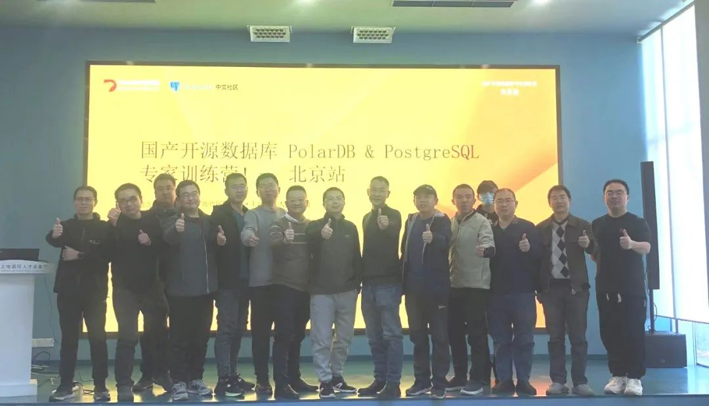  
  
下面是陈卫星老师分享议题《数据库筑基 : 存储结构与数据类型》的文字稿。  
  
# 陈卫星 - 《数据库筑基 : 存储结构与数据类型》   
本次训练营演讲内容比较丰富，从数据库存储结构、索引、扫描方式一直到数据类型和常用插件都做了出分的演讲，其中还用生动的实验为大家展现了数据块使用原理以及索引的增长过程，使得大家在轻松的氛围中学习到很多pg数据库的工作原理。  
  
## 一、存储结构  
数据库逻辑结构：  
  
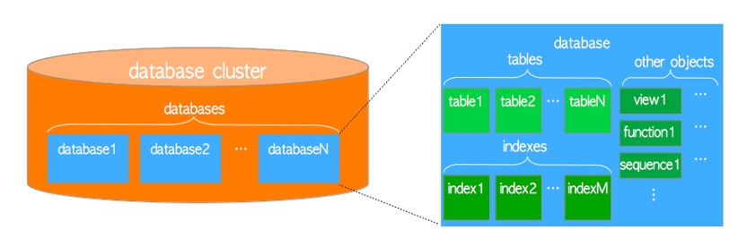  
   
物理结构：  
  
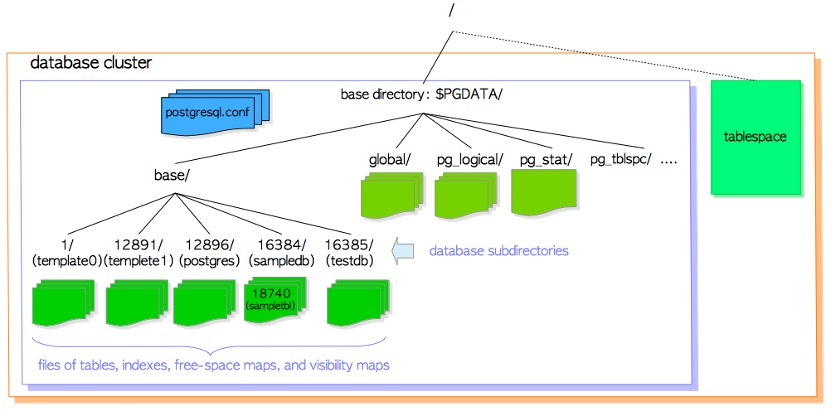  
  
数据库目录结构：  
  
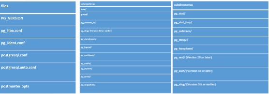  
  
表表空间结构：  
  
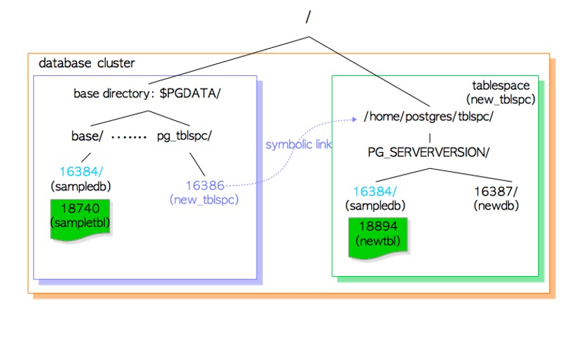  
  
数据块结构：  
  
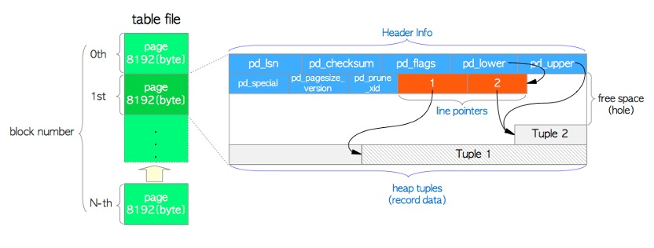  
   
Insert操作过程：  
  
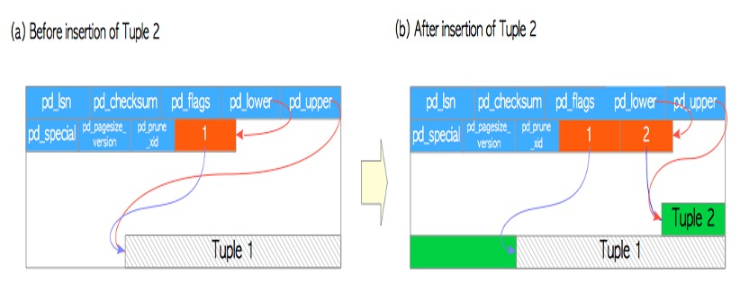  
  
Update操作过程：  
  
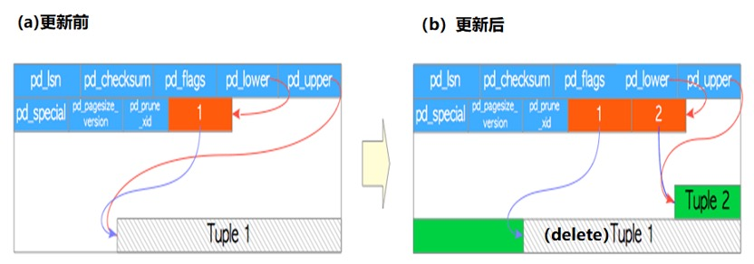  
  
### 实验  
  
前言  
  
由于PG数据库在update的时候是把原来的行逻辑上删除，重新插入新行，这样子就导致块中包含有不可用的行，我们进行如下的研究。  
  
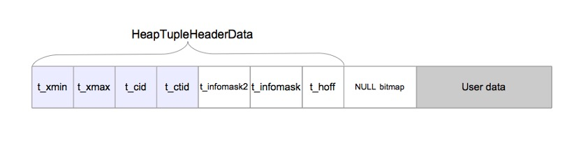  
   
- t_xmin保存插入此元组的事务的txid。               
- t_xmax保存删除或更新此元组的事务的txid。如果此元组未被删除或更新，则t_xmax设置为0，这意味着无效。                
- t_cid保存命令id（cid），这意味着在从0开始的当前事务中执行此命令之前执行了多少SQL命令。例如，假设我们在一个事务中执行三个INSERT命令：“BEGIN；INSERT；INSERT；INSERT；COMMIT；”。如果第一个insert命令插入此元组，则t_cid设置为0。如果第二个insert命令插入此命令，则t_cid设置为1，依此类推。  
- t_ctid保存指向自身或新元组的元组标识符（tid）。第1.3节描述的tid用于标识表中的元组。当这个元组被更新时，这个元组的t_ctid指向新的元组；否则， t_ctid指向它自己。  
  
1、	创建测试表：  
```  
create table test1 (data varchar(20));  
  
insert into test1 values ('A');  
insert into test1 values ('B');  
insert into test1 values ('C');  
```  
  
2、	查看此时表中行头的重要信息：  
  
2.1、PostgreSQL提供了一个扩展pageinspect，它是一个贡献模块，用来显示数据库页面的内容。  
```  
CREATE EXTENSION pageinspect;  
```  
  
2.2、查看此时行头的信息：  
```  
testdb=# SELECT lp as tuple, t_xmin, t_xmax, t_field3 as t_cid, t_ctid   
FROM heap_page_items(get_raw_page('test1', 0));  
```  
  
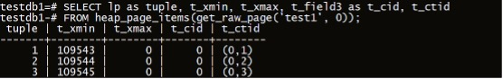  
  
注意：此时t_xmax为0（即无效），说明都没有被修改过。  
  
2.3、查看当前的Transaction Snapshot（以下简称TS）：  
```  
testdb=# select txid_current_snapshot();  
 txid_current_snapshot   
-----------------------  
 	1303:1303:  
```  
  
2.4、更新test1第一行：  
```  
		begin;  
		--查看当前的xid  
	select txid_current();  
 txid_current   
--------------  
         1303  
		--更新数据  
		update test1 set data='A1' where data='A';  
		--查看当前xid状态  
	SELECT txid_status(1303);  
 txid_status   
-------------  
 	in progress  
```  
  
2.5、此时在另外一个窗口查看行头的信息变化：  
```  
testdb=#  SELECT lp as tuple, t_xmin, t_xmax, t_field3 as t_cid, t_ctid   
FROM heap_page_items(get_raw_page('test1', 0));  
```  
  
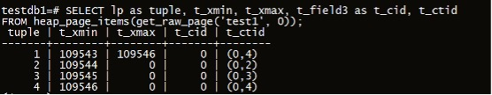  
  
```  
  (4 rows)  
```  
  
分析：update操作时，如果事务发生回滚，更新的数据依然被写入数据块  
  
3、	对表使用vacuumdb进行清理：  
```  
$ vacuumdb -d testdb1 -t test1 -z -v #不清理碎片  
$ vacuumdb -d testdb1 -t test1 -z -v -f #清理碎片  
vacuumdb: vacuuming database "testdb"  
INFO:  vacuuming "public.test1"  
INFO:  "test1": found 8 removable, 3 nonremovable row versions in 1 out of 1 pages  
DETAIL:  0 dead row versions cannot be removed yet, oldest xmin: 1313  
There were 5 unused item identifiers.  
Skipped 0 pages due to buffer pins, 0 frozen pages.  
0 pages are entirely empty.  
CPU: user: 0.00 s, system: 0.00 s, elapsed: 0.00 s.  
INFO:  analyzing "public.test1"  
INFO:  "test1": scanned 1 of 1 pages, containing 3 live rows and 0 dead rows; 3 rows in sample, 3 estimated total rows  
```  
  
3.1、查看清理后的表的页面信息：  
  
--清理后：  
  
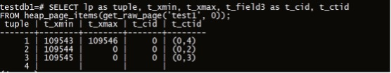  
  
--清理碎片后的结果：  
  
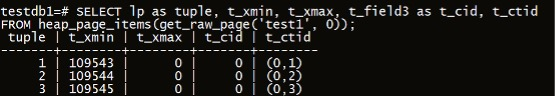  
  
--分析发现凡是t_xmax上有值的，说明该行曾经被这个事务id给修改过，所以都会被清空，但是有个例外，就是假如t_xmax的状态是aborted，那么该行就保留，因为该事务后来回滚了，但是修改的痕迹还是保留原来的行中。  
  
--vacuum操作默认不会移动行，只是把该删除的行给删除，如果需要整理碎片，需要使用-f，这样子会移动行。  
  
--往表中插入新行，会优先随机使用原来被删除行的空间。  
  
--如果在一个事务中（begin），只要执行了一条错误的sql语句，pg都会把该事务的所有sql语句给回滚，同时该事务的id号也会标识为aborted，这一点要谨慎。  
  
## 二、访问接口  
数据块访问方式：  
  
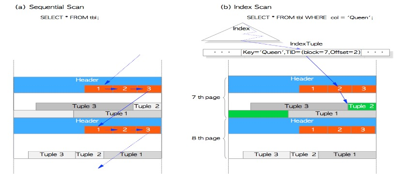  
  
索引结构：  
  
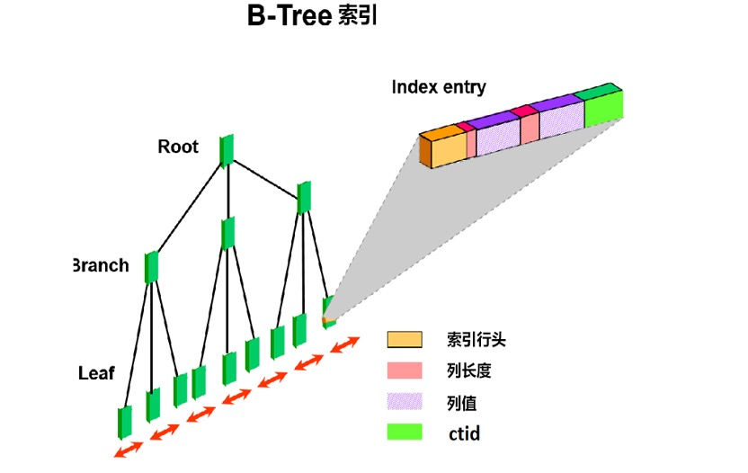  
  
索引增长过程：  
  
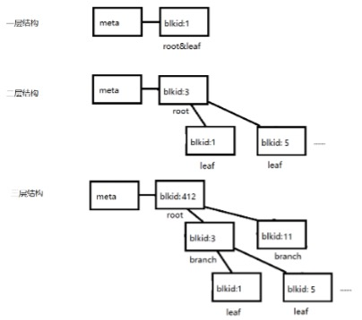  
  
### 实验   
  
#### 一层结构：  
  
1、环境准备  
```  
create extension pageinspect;      
  
create table tab1(id int primary key, info text);      
  
insert into tab1 select generate_series(1,100), md5(random()::text);      
  
vacuum analyze tab1;      
```  
  
2、查看meta块  
```  
indx=# select * from bt_metap('tab1_pkey');     
```  
  
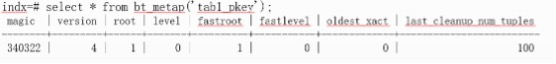  
  
3、根据root page id = 1，查看root page的stats  
```  
indx=# select * from bt_page_stats('tab1_pkey',1);  
```  
  
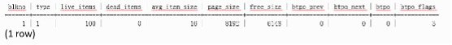  
  
```
此时：btpo=0，说明处于第0层。  
	btpo_flags=3，说明它既是leaf又是root页。即：root_page（2）+leaf_page（1）=3  
	注：  
		meta page      
		root page   ：表示为btpo_flags=2      
		branch page ：表示为btpo_flags=0      
		leaf page   ：表示为btpo_flags=1      
```

4、查看root（leaf）页里面的内容：  
```  
indx=#  select * from bt_page_items('tab1_pkey',1);      
```  
  
  
  
此时ctid就是指向表的行id，类似于oracle的rowid，PG中为tid。data就是索引列的值，16进制。  
  
5、根据ctid来访问表：  
```  
indx=# select * from tab1 where ctid='(0,1)';  
```  
  
#### 二层结构：  
  
1、继续往表中插入数据，让索引生长。  
```  
insert into tab1 select generate_series(101,10000), md5(random()::text) ;  
```  
  
2、查看meta数据：  
```  
indx=#  select * from bt_metap('tab1_pkey');     
```  
  
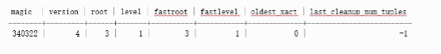  
  
3、根据root page id 查看root page的stats：  
```  
indx=# select * from bt_page_stats('tab1_pkey',3);  
```  
  
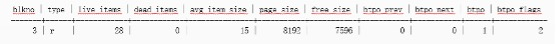  
  
#### 三层结构：          
  
记录数超过1层结构的索引所能够存储的记录数时，会分裂为2层结构，除了meta page和root page，还可能包含1层branch page以及1层leaf page。  
  
继续往tab1表插入新数据，导致btree增长一层：  
```  
indx=#  insert into tab1 select generate_series(10001,1000000), md5(random()::text) ;   
  
indx=#  vacuum analyze tab1;   
```  
  
1、查看meta page，可以看到root page id = 412, 索引的level=2，即包括1级 branch 和 1级 leaf。  
```  
indx=#  select * from bt_metap('tab1_pkey');     
```  
  
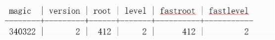  
  
2、根据root page id 查看root page的stats  
```  
indx=# select * from bt_page_stats('tab1_pkey', 412);     
```  
  
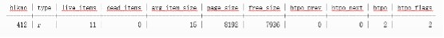  
  
## 三、数据类型  
pg数据库的支持的所有数据类型：  
  
  
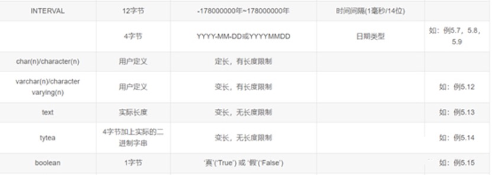  
  
## 四、运算符  
Pg数据库所支持的运算符：  
  
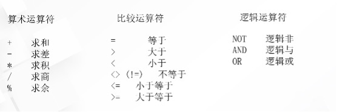  
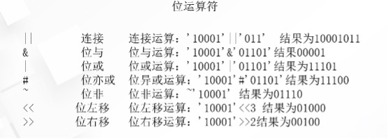  
  
## 五、插件  
常用扩展插件：  
  
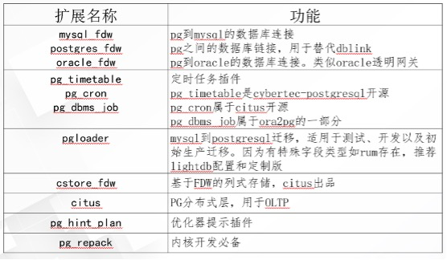  
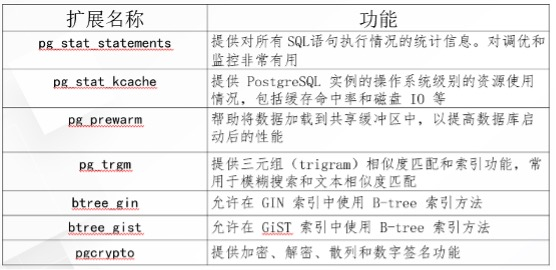  
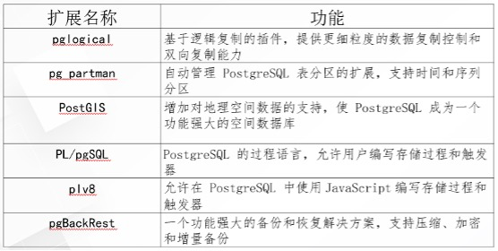  
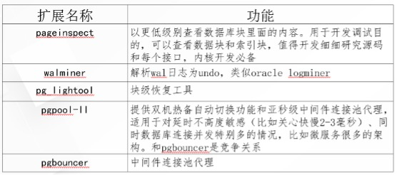  
  
  
#### [期望 PostgreSQL|开源PolarDB 增加什么功能?](https://github.com/digoal/blog/issues/76 "269ac3d1c492e938c0191101c7238216")
  
  
#### [PolarDB 开源数据库](https://openpolardb.com/home "57258f76c37864c6e6d23383d05714ea")
  
  
#### [PolarDB 学习图谱](https://www.aliyun.com/database/openpolardb/activity "8642f60e04ed0c814bf9cb9677976bd4")
  
  
#### [PostgreSQL 解决方案集合](../201706/20170601_02.md "40cff096e9ed7122c512b35d8561d9c8")
  
  
#### [德哥 / digoal's Github - 公益是一辈子的事.](https://github.com/digoal/blog/blob/master/README.md "22709685feb7cab07d30f30387f0a9ae")
  
  
#### [About 德哥](https://github.com/digoal/blog/blob/master/me/readme.md "a37735981e7704886ffd590565582dd0")
  
  

  
