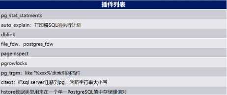
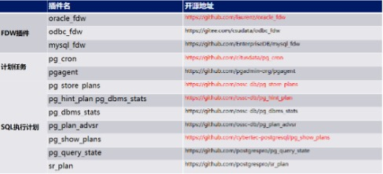
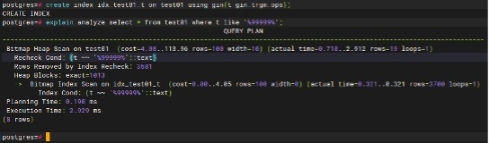
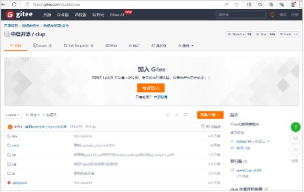
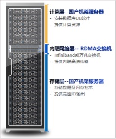
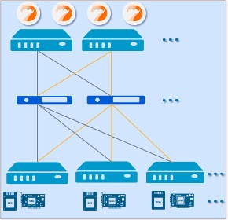
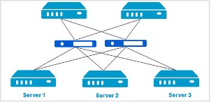
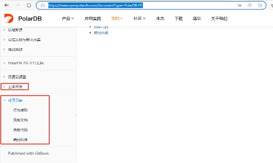

## PolarDB & PG 专家训练营回顾 | 《PolarDB国产开源数据库生态工具》文字稿     
                                                                                       
### 作者                                                                            
digoal                                                                              
                                                                                              
### 日期                                                                                            
2024-12-04                                                          
                                                     
### 标签                                                                          
PostgreSQL , PolarDB , DuckDB , 数据库训练营          
                                                                                                                  
----                                                                                           
                                                                                                         
## 背景      
2024年11月29日, 由PolarDB社区联合PostgreSQL社区发起的《国产开源数据库PolarDB+PostgreSQL专家训练营》在北京站正式开课。PolarDB社区及PostgreSQL中文社区的多位核心成员汇聚上地国际人才会客厅会议室，为大家带来为期一天的技术盛宴，和大家一起分享PolarDB和PostgreSQL数据库知识，除了技术分享，大家还参与了热烈的交流讨论、实验、考试和颁证等环节。      
      
      
    
回顾:       
- [《PolarDB & PG 专家训练营回顾 | 《数据库筑基》文字稿》](../202412/20241203_01.md)      
- [《PolarDB & PG 专家训练营回顾 | 《PolarDB国产开源数据库进阶》文字稿》](../202412/20241204_01.md)      
      
下面是唐成老师分享议题《PolarDB国产开源数据库生态工具》的文字稿。      
      
# 唐成 - 《PolarDB国产开源数据库生态工具》      
本次训练营全面介绍了PolarDB数据库，涵盖PG协议、管控软件、优化技巧及插件生态。通过实操演示了oracle_fdw与pg_cron插件安装，解决了编译难题，展示了pg_trgm优化LIKE查询的性能提升。同时，深入探讨了CLup管控平台的高可用管理，介绍了CData数据库一体机的技术优势。CFabric的IO模式对比及SPDK技术原理探讨，深化了听众对数据库存储技术的理解。最后，鼓励参与PolarDB开源社区，共促国产开源数据库发展。以下是演讲内容：  
  
## 1 PolarDB数据库生态介绍  
### 1.1 基于PG协议的数据库介绍  
- PolarDB：https://www.openpolardb.com/home  
- ProtonBase：https://protonbase.com  
- HaloDB：http://www.halodbtech.com  
- IvorySQL： https://www.ivorysql.org/zh-cn/  
  
### 1.2 数据库管控软件  
- CLup：https://www.csudata.com/clup/manual  
- 云猿生, 核心产品是KubeBlocks：https://github.com/apecloud/kubeblocks  
- Pigsty：https://pigsty.cc/zh/  
  
### 1.3 数据库优化管理  
- DBdoctor：https://www.dbdoctor.cn/  
- Bytebase：https://bytebase.cc/docs/introduction/what-is-bytebase/  
- Ninedata：https://www.ninedata.cloud/home  
  
### 1.4 PolarDB继承了PostgreSQL的大量插件  
      
  
参考官方手册：  
- http://www.postgres.cn/docs/14/contrib.html  
- https://www.postgresql.org/docs/15/contrib.html  
  
### 1.5 PolarDB可以使用PostgreSQL社区的大量插件  
     
  
### 1.6 演示PolarDB对PostgreSQL插件的兼容性  
1、编译安装`oracle_fdw`  
  
初学者编译失败的原因是没有安装`oracle-instantclient`:  
```  
[root@proxy01 ~]# rpm -ivh oracle-instantclient19.9-basic-19.9.0.0.0-1.x86_64.rpm   
```  
  
安装相应的依赖包：  
```  
error: Failed dependencies:  
        libnsl.so.1()(64bit) is needed by oracle-instantclient19.9-basic-19.9.0.0.0-1.x86_64  
  
yum install libnsl  
```  
  
2、编译安装`pg_cron`  
  
报下面的错误：  
```  
/u01/polardb_pg/include/postgresql/server/storage/smgr.h:89:27: error: redefinition of typedef 'SMgrRelation' is a C11 feature [-Werror,-Wtypedef-redefinition]  
   89 | typedef SMgrRelationData *SMgrRelation;  
      |                           ^  
/u01/polardb_pg/include/postgresql/server/storage/polar_rsc.h:124:34: note: previous definition is here  
  124 | typedef struct SMgrRelationData *SMgrRelation;  
      |                                  ^  
2 errors generated.  
```  
  
这通常是插件的作者没有考虑新版本编译器的兼容性问题，在`Makefile`中的变量 `PG_CPPFLAGS`中添加`“-Wno-typedef-redefinition”`可以解决此问题。  
  
3、插件`pg_trgm`让`like '%xxx%'`走索引的方法  
```  
create table test01(id int, t text);   
insert into test01 select seq, seq from generate_series(1, 1000000) as seq;  
analyze test01;  
explain analyze select * from test01 where t like '%99999%';  
```  
  
需要100~300毫秒，走全表扫描  
```  
create extension pg_trgm;  
create index idx_test01_t on test01 using gin(t gin_trgm_ops);  
```  
  
现在走了索引，只需要2毫秒！！！  
  
     
   
## 2 CLup管控平台深入探讨  
### 2.1 PolarDB的第三方管控平台CLup  
  
1、Clup简介  
  
CLup是由开源的`PostgreSQL`/`PolarDB`管理平台，用户可以在`CLup`中轻松管理、维护`PostgreSQL`/`PolarDB`数据库高可用集群。  
  
2、Clup开源地址  
  
- https://gitee.com/csudata/clup  
- https://gitee.com/csudata/clup-agent  
  
3、Clup用户手册  
  
- https://www.csudata.com/clup/manual  
  
### 2.2 PolarDB的第三方管理平台CLup  
  
拥抱开源：  
  
     
   
### 2.3 CLup核心功能  
- 数据库维护  
  
CLup整合了强大的数据库创建与管理能力，能够操控PolarDB数据库如启停，查看会话活动及锁的状态，实现对数据库资源的精细控制与高效运维。  
  
- 高可用集群管理  
  
CLup提供完整的数据库高可用集群解决方案，一键创建并管理PolarDB高可用集群，并实现故障自动切换，确保数据库服务的持续稳定与高效运作。  
  
### 2.4 使用CLup实现PolarDB的高可用  
防止hang的秘技：  
  
探测数据库是否正常的过程是通过启动新的子进程，然后要求子进程在指定的超时时间内返回，如果在指定的时间内没有返回，则认为出现问题，然后把子进程给kill掉。  
  
在故障时，会让探测脚本hang住，原因有很多，首先是TCP协议不是消息的方式，而是流的方式。接收一个消息时，需要事先知道消息的长度，然后一直接收到指定长度的消息，如果没有接收到指定长度的消息，则会一直等待，这时就可能hang了。  
  
## 3 CData数据库一体机技术优势  
### 3.1 基于PolarDB的第三方数据库一体机：CData  
1、CData简介  
  
将数据库的最佳实践与快速发展的硬件相结合，把计算能力、网络能力、存储能力等各方面做到最佳优化，提供一套高性能、高可靠、最佳性价比的数据库平台。  
  
2、CData核心功能  
- 计算能力：高性能国产CPU，提供强劲的运算能力。  
- 网络能力：56Gb/s或100Gb/s或200Gb/s RDMA网络提供高效的计算和存储互联。  
- 存储能力：高性能NVMe的新一代存储产品提供极高的性能、可靠性和耐用性。  
  
3、高性能的硬件需要配套优秀的数据库以及高性的存储软件才能发挥出极致的性能  
  
     
  
### 3.2 基于PolarDB的第三方数据库一体机：CData核心技术  
- 高性能分布式存储软件：通过CFabric高效连接，让数据库能结合RDMA、SSD、NVM等特性达到快速传输和高效访问。  
- 高性能RDMA访问协议：通过RDMA协议（远程内存直接访问），在高IO处理的场景下，达到极低的CPU开销。  
- 高性能高带宽低延迟：56G/100G/200G Infiniband高吞吐，低延迟。做到ns级通信时延，计算存储信息超高速互联。  
- 高性能闪存SSD、NVMe：应用闪存SSD、NVMe，为数据库提供极高的IO能力和存储效率。  
  
### 3.3 基于PolarDB的第三方数据库一体机：CData架构  
  
     
  
     
     
1、产品定位  
  
运行关系型数据库、数据库私有云、最佳实践的软硬一体化平台。  
  
2、创新技术  
  
分布式存储、RDMA、NVMe闪存技术。  
  
3、主要特点  
  
极高性能、高可靠性、横向扩展、敏捷交付。  
  
4、应用场景  
  
数据集市和报表 (OLAP) 、联机事务处理(OLTP)、数据库云化和整合。  
  
### 3.4 基于PolarDB的第三方数据库一体机：CData存储多副本  
  
     
  
     
   
- 整体架构（标准服务器，RDMA交换机，HCA卡及PCIe闪存卡等）采用全冗余架构设计，完全消除单点故障风险  
- 数据分布可以跨服务器或跨机柜，不会因某个服务器、机柜故障导致数据不可访问  
- 数据盘可以做跨机器的两副本或三副本，从而保证数据高可靠  
- 存储节点的临时故障，导致两副本或三副本的降级，可以做到增量的数据同步，而不需要全量数据同步。  
- 对应用访问透明，保障业务连续性。  
  
  
## 4 PolarDB的开源协作  
  
参考文档：  
- https://www.openpolardb.com/document?type=PolarDB-PG  
  
     
  
  
#### [期望 PostgreSQL|开源PolarDB 增加什么功能?](https://github.com/digoal/blog/issues/76 "269ac3d1c492e938c0191101c7238216")
  
  
#### [PolarDB 开源数据库](https://openpolardb.com/home "57258f76c37864c6e6d23383d05714ea")
  
  
#### [PolarDB 学习图谱](https://www.aliyun.com/database/openpolardb/activity "8642f60e04ed0c814bf9cb9677976bd4")
  
  
#### [PostgreSQL 解决方案集合](../201706/20170601_02.md "40cff096e9ed7122c512b35d8561d9c8")
  
  
#### [德哥 / digoal's Github - 公益是一辈子的事.](https://github.com/digoal/blog/blob/master/README.md "22709685feb7cab07d30f30387f0a9ae")
  
  
#### [About 德哥](https://github.com/digoal/blog/blob/master/me/readme.md "a37735981e7704886ffd590565582dd0")
  
  

  
