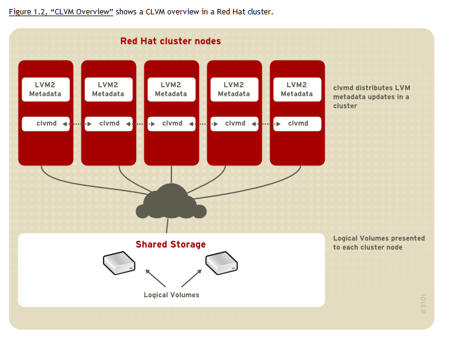

## PolarDB 100 问 | 如何给一个PolarDB实例挂载多个共享盘?   
      
### 作者      
digoal      
      
### 日期      
2024-12-06      
      
### 标签      
PostgreSQL , PolarDB , DuckDB , 共享块设备   
      
----      
      
## 背景      
如何给一个PolarDB实例挂载多个共享盘?   
  
为什么有这个问题呢?   
  
因为一块共享盘在“容量、IOPS、吞吐”等指标都有上限, 如果能挂载多块共享盘, 那么可以提升PolarDB单实例的存储空间、IO性能, 突破单盘上限.     
  
例如在阿里云上可以选择支持NVMe协议的ESSD存储, 非易失性存储器标准接口NVMe（Non-Volatile Memory Express）是一种专为固态存储（如基于闪存的SSD）设计的高速接口协议，支持存储设备直接与CPU通信，无需经过传统存储接口和协议（如SATA、SAS）中必需的控制器，从而减少了数据传输过程中的延迟。当ECS实例基于NVMe协议挂载云盘时，允许云盘直接与ECS实例的CPU通信，从而大大减少了数据传输路径，显著降低了I/O访问的延迟时间。  
- 详见: https://help.aliyun.com/zh/ecs/user-guide/nvme-protocol  
  
单块最高规格的ESSD PL3容量最大能到64TB, 100万IOPS, 4GB吞吐.   
- 详见: https://help.aliyun.com/zh/ecs/user-guide/essds  
  
当您将单块云盘同时挂载到多台ECS实例时，所有ECS实例的性能总和不能超过该云盘的性能上限。  
- 详见: https://help.aliyun.com/zh/ecs/user-guide/enable-multi-attach  
  
由于PolarDB是共享存储架构, 一块盘可以挂载给多个计算节点, 一旦跑ePQ多机并行来运行复杂分析查询, 很容易就会达到ESSD盘多吞吐上限. 而对于较繁忙的OLTP实例, 也比较容易达到容量和IOPS上限.    
  
在一个PolarDB实例中支持挂多盘是解决以上瓶颈的不二之选. 但在PolarDB手册中并没有找到支持多盘挂载的说明.   
  
## 复现方法  
按照PolarDB基于共享块设备的部署文档进行尝试如下:   
  
1、块设备重命名     
  
PFS 仅支持访问 以特定字符开头的块设备（详情可见 PolarDB File System 源代码的 [src/pfs_core/pfs_api.h](https://github.com/ApsaraDB/PolarDB-FileSystem/blob/master/src/pfs_core/pfs_api.h) 文件）：  
```  
#define PFS_PATH_ISVALID(path)                                  \  
    (path != NULL &&                                            \  
     ((path[0] == '/' && isdigit((path)[1])) || path[0] == '.'  \  
      || strncmp(path, "/pangu-", 7) == 0                       \  
      || strncmp(path, "/sd", 3) == 0                           \  
      || strncmp(path, "/sf", 3) == 0                           \  
      || strncmp(path, "/vd", 3) == 0                           \  
      || strncmp(path, "/nvme", 5) == 0                         \  
      || strncmp(path, "/loop", 5) == 0                         \  
      || strncmp(path, "/mapper_", 8) ==0))  
```  
  
因此，为了保证能够顺畅完成后续流程，我们建议在所有访问块设备的节点上使用相同的软链接访问共享块设备。例如，在 NBD 服务端主机上，使用新的块设备名 `/dev/nvme1n1` 软链接到共享存储块设备的原有名称 `/dev/vdb` 上：  
```  
sudo ln -s /dev/vdb /dev/nvme1n1  
```  
  
在 NBD 客户端主机上，使用同样的块设备名 `/dev/nvme1n1` 软链到共享存储块设备的原有名称 `/dev/nbd0` 上：  
```  
sudo ln -s /dev/nbd0 /dev/nvme1n1  
```  
  
这样便可以在服务端和客户端两台主机上使用相同的块设备名 `/dev/nvme1n1` 访问同一个块设备。  
  
2、块设备格式化  
  
使用 任意一台主机，在共享存储块设备上格式化 PFS 分布式文件系统：  
```  
sudo pfs -C disk mkfs nvme1n1  
```  
  
3、PFS 文件系统挂载  
  
在能够访问共享存储的 所有主机节点 上分别启动 PFS 守护进程，挂载 PFS 文件系统(`-w 4`表示pfsd将启动4个工作线程处理IO请求, 越多的话越消耗CPU但是也能处理更大的IOPS和吞吐.)：  
```  
sudo /usr/local/polarstore/pfsd/bin/start_pfsd.sh -p nvme1n1 -w 4  
```  
  
以上详细参考文档:  
- https://apsaradb.github.io/PolarDB-for-PostgreSQL/zh/deploying/fs-pfs.html  
  
PFS的更多详细说明请参考:  
- https://github.com/ApsaraDB/PolarDB-FileSystem/blob/master/docs/PFS_Tools-EN.md  
- https://github.com/ApsaraDB/PolarDB-FileSystem/blob/master/docs/PFS_Tools-CN.md  
  
4、Primary 节点部署  
  
初始化 Primary 节点的本地数据目录 `~/primary/`：  
```  
initdb -D $HOME/primary  
```  
  
在共享存储的 `/nvme1n1/shared_data/` 路径上创建共享数据目录，然后使用 `polar-initdb.sh` 脚本初始化共享数据目录：  
```  
# 使用 pfs 创建共享数据目录  
sudo pfs -C disk mkdir /nvme1n1/shared_data  
# 初始化 db 的本地和共享数据目录  
sudo polar-initdb.sh $HOME/primary/ /nvme1n1/shared_data/ primary  
```  
  
编辑 Primary 节点的配置。打开 `~/primary/postgresql.conf`，增加配置项(以下仅展示共享盘相关的配置, 其他配置略)：  
```  
polar_enable_shared_storage_mode=on  
polar_disk_name='nvme1n1'  
polar_datadir='/nvme1n1/shared_data/'  
polar_vfs.localfs_mode=off  
shared_preload_libraries='$libdir/polar_vfs,$libdir/polar_worker'  
polar_storage_cluster_name='disk'  
```  
  
以上详见如下文档:    
- https://apsaradb.github.io/PolarDB-for-PostgreSQL/zh/deploying/db-pfs.html  
  
我在想要么就是pfs可以支持多个共享盘, 要么就是PolarDB可以支持多个共享data目录(通过表空间或内部自动分配存储空间?). 请问该如何解决给一个PolarDB实例挂载多个共享盘的问题呢?  
  
## 其他解法  
可以使用lvm管理多个共享盘, 做成一个大的逻辑卷.   
  
由于需要在多个计算节点上使用一个逻辑卷, 需要依赖集群管理套件.   
  
简化步骤如下:   
- 使用pacemaker管理一个PolarDB实例的所有计算节点, 做成一个集群.   
- 配置并启动lvmlockd (集群lvm锁管理后台进程, 锁、同步变更lvm后的元信息等), 下面是一张比较老的图, 大致意思雷同.  
    -    
- `pvcreate nvme1n1; pvcreate nvme2n1;` 创建pv  (单个计算节点执行)    
- `vgcreate -Ay --shared polardb_vg /dev/nvme1n1 /dev/nvme2n1` 创建vg. (每个计算节点执行)    
- `lvcreate --stripes NumberOfStripes --stripesize StripeSize --size LogicalVolumeSize --name LogicalVolumeName VolumeGroupName` 创建lv. (单个计算节点执行)  使用条带方式创建lv, 充分利用多盘的能力.  条带介绍请自行搜索.   
  
以上内容更多详细介绍请参考如下文章:   
- https://docs.redhat.com/en/documentation/red_hat_enterprise_linux/8/html/configuring_and_managing_logical_volumes/configuring-lvm-on-shared-storage_configuring-and-managing-logical-volumes#configuring-lvm-on-san-multiple_configuring-lvm-on-shared-storage  
- https://docs.redhat.com/en/documentation/red_hat_enterprise_linux/8/html-single/configuring_and_managing_high_availability_clusters/index?extIdCarryOver=true&sc_cid=701f2000001Css5AAC#proc_configuring-gfs2-for-clustered-samba_adoc-configuring-ha-samba  
- https://docs.redhat.com/en/documentation/red_hat_enterprise_linux/8/html-single/configuring_and_managing_high_availability_clusters/index?extIdCarryOver=true&sc_cid=701f2000001Css5AAC#choosing_ha_lvm_or_shared_volumes  
- https://docs.redhat.com/en/documentation/red_hat_enterprise_linux/8/html/configuring_and_managing_logical_volumes/basic-logical-volume-management_configuring-and-managing-logical-volumes#creating-striped-logical-volume_creating-logical-volumes  
- https://blog.csdn.net/dba_waterbin/article/details/8122598  
- https://blog.51cto.com/evanlinux/1392826  
   
用lvm解决了PolarDB挂载多盘, 好像上一个问题也不存在了, 表空间似乎没有必要了.   
- [《PolarDB 100 问 | 如何解决在PolarDB中使用自定义表空间报错的问题?》](../202412/20241206_01.md)  
  
但是使用lvm来支持多盘, 引入了pacemaker集群管理以及lvm, 多了一层依赖, 也多了一层故障点.   
  
pfs/PolarDB能否内置支持多个共享块设备呢?  
  
期待更多解答.       
      
  
#### [期望 PostgreSQL|开源PolarDB 增加什么功能?](https://github.com/digoal/blog/issues/76 "269ac3d1c492e938c0191101c7238216")
  
  
#### [PolarDB 开源数据库](https://openpolardb.com/home "57258f76c37864c6e6d23383d05714ea")
  
  
#### [PolarDB 学习图谱](https://www.aliyun.com/database/openpolardb/activity "8642f60e04ed0c814bf9cb9677976bd4")
  
  
#### [PostgreSQL 解决方案集合](../201706/20170601_02.md "40cff096e9ed7122c512b35d8561d9c8")
  
  
#### [德哥 / digoal's Github - 公益是一辈子的事.](https://github.com/digoal/blog/blob/master/README.md "22709685feb7cab07d30f30387f0a9ae")
  
  
#### [About 德哥](https://github.com/digoal/blog/blob/master/me/readme.md "a37735981e7704886ffd590565582dd0")
  
  

  
