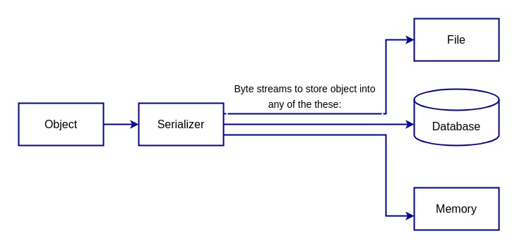
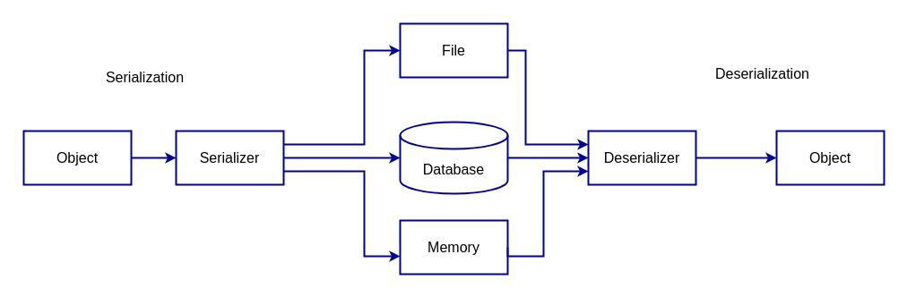

## PostgreSQL 数据传输&存储 数据的序列化和反序列化 (serialization/deserialization)    
                
### 作者                
digoal                
                
### 日期                
2024-12-11                
                
### 标签                
PostgreSQL , PolarDB , DuckDB , in , out , recv , send , protobuf , arrow , bytea_output , serialization , deserialization , json , xml , binary          
           
----           
            
## 背景    
在程序使用数据库的过程中, 数据经常要经历序列化和反序列化的处理.    
  
首先了解一下什么是序列化和反序列化, 如果您已经了解这个部分请跳到后面.  
  
## 编程中的序列化和反序列化是什么？  
原文:   
- https://www.baeldung.com/cs/serialization-deserialization  
  
### 1. 概述  
序列化(serialization)和反序列化(deserialization)是编程中的两个重要概念，可让对象轻松存储、传输和重建。它们用于各种场景，例如将对象存储在数据库中、通过网络发送对象或在内存中缓存对象。  
  
在本教程中，我们将讨论这两个概念。  
  
通过传送门将物品甚至人瞬移, 是很多科幻电影里的桥段, 可以用来理解序列化和反序列化, 序列化可能是把要瞬移的东西编码为一种可以存储/传输的东西(可能是一对有序排列的分子?), 反序列化就是把这对有序排列的分子组合起来, 还原成原来的东西.  (但是请注意: 不管是一串有序排列的分子数据, 还是那个东西实物, 都是同一个东西, 两种不通的状态而已.)    
  
下面带着这种想法往下看, 看看对象是如何被序列化和反序列化的?      
  
### 2. 序列化  
对象有三个主要特征：身份、状态和行为。  
- 身份/标识, 可以理解为该对象的标记, 例如两个一模一样的文件, 只能通过标识来区分它们.   
- 状态, 对象的值或数据。    
- 行为, 这个对象可以用来做什么?     
  
序列化和反序列化围绕状态来进行.    
  
<b>序列化是将对象的状态转换为字节流(bytea stream)的过程。</b> 然后可以将此字节流保存到文件、通过网络发送或存储在数据库中。字节流表示对象的状态，稍后可以重建(注意这里用到的是重建, 是可重复操作的动作, 不是阅后即焚的动作)该状态以创建对象的新副本。  
  
序列化允许我们保存“与对象相关的数据”并在新位置重新创建该对象。  
  
以下是序列化过程的描述：  
  
    
  
要序列化一个对象，程序员必须首先确定一种"格式"，然后使用适当的工具将对象"转换"为该格式。     
  
#### 2.1. 序列化格式  
<b>序列化可以使用多种不同的格式，例如JSON、XML和二进制。</b> JSON 和 XML 是流行的序列化格式，因为它们易于阅读且易于被其他系统解析。二进制格式通常用于提高性能，因为它们的读写速度通常比基于文本的格式更快。  
  
### 3.反序列化  
反序列化是序列化的逆过程。它涉及获取字节流并将其转换回对象。这是使用适当的工具来解析字节流并创建新对象来完成的。在 Java 中，ObjectInputStream类可用于反序列化二进制格式，而[Jackson 库](https://www.baeldung.com/jackson)可用于解析 JSON 格式。  
  
反序列化的视图如下：  
  
    
  
### 4. 存储和传输  
序列化和反序列化在编程中非常重要，因为它们允许对象在不同系统之间轻松存储和传输。这在分布式系统中尤其有用，因为对象必须在不同的机器之间传输；在 Web 应用程序中，对象必须在Web 服务器和 Web 浏览器之间发送。  
  
例如，Web 应用程序允许用户创建和保存文档。当用户保存文档时，应用程序需要将文档的状态存储在数据库中。  
  
为此，应用程序必须首先将文档对象序列化为字节流，然后将字节流存储在数据库中。稍后，当用户想要打开文档时，应用程序必须从数据库中检索字节流。它首先将字节流反序列化回文档对象，然后将文档显示给用户。  
  
### 5. 注意事项   
#### 5.1. 性能  
序列化和反序列化的计算量可能很大，尤其是对于大型或复杂的对象。将对象转换为字节并转回可能需要大量时间和资源，这可能会影响系统的性能。  
  
性能也是[Arrow](https://arrow.apache.org/docs/format/Intro.html)引以为傲的点: Apache Arrow 诞生于对一套围绕表格数据“表示”和“系统间交换”的标准的需求。采用这些标准可以降低”数据序列化/反序列化“的<b>计算成本</b>以及<b>跨不同编程语言实现的系统实现成本</b>。   
  
#### 5.2. 平台和语言依赖性  
序列化和反序列化可能与平台和语言相关。不同的编程语言和平台可能有自己的序列化和反序列化实现，这可能导致在不同系统之间传输数据时出现兼容性问题。  
  
这也是Arrow引以为傲的点.    
  
#### 5.3. 版本兼容性  
如果序列化数据的格式随时间发生变化，则可能导致版本问题。例如，假设应用程序的新版本以不同的数据格式发布。在这种情况下，旧版本可能无法正确地反序列化数据，从而导致错误或数据丢失。  
  
例如 DuckDB 早期版本的数据文件, 在DuckDB高版本中进行了修改, 所以无法使用旧版本的数据文件. 好像是从0.8开始做了版本兼容.  
  
PostgreSQL这块要求比较严格, 在使用pg_upgrade进行大版本升级时, 仅需要导出元数据, 而数据文件可以直接使用.   
  
#### 5.4. 不可序列化的对象  
还值得注意的是，并非所有对象都可以序列化。某些对象可能包含无法序列化的资源，例如<b>文件句柄</b>或<b>网络套接字</b>, 因为这些对象仅在当前环境有意义, 换个场景再重构出来就没有了意义。  
  
#### 5.5. 安全  
必须意识到与序列化和反序列化相关的安全风险，因为恶意制作的字节流可用于利用[程序中的漏洞](https://www.baeldung.com/cs/threat-vs-vulnerability-vs-risk)。  
  
为了降低这种风险，最佳做法是 使用经过严格审查的库进行序列化和反序列化，并且仅反序列化来自受信任来源的数据。  
  
#### 5.6. 可读性有限  
序列化数据通常不是人类可读的，因此很难排除或调试数据传输或存储过程中出现的问题。  
  
### 6. 总结  
我们研究了序列化和反序列化及其工作原理。我们发现它们在分布式系统、Web 应用程序、缓存以及将对象存储在数据库或其他数据存储中时非常有用。  
  
但是，了解序列化和反序列化的安全风险非常重要。还要记住使用经过严格审查的库，并且只反序列化来自受信任来源的数据。  
  
## PostgreSQL中的序列化和反序列化  
了解了数据的序列化和反序列化之后, 来看一下数据在PostgreSQL中的序列和反序列化.  
  
从PostgreSQL 自定义数据类型的文档中可以找到一段描述  
- https://www.postgresql.org/docs/devel/xtypes.html  
  
A user-defined type must always have input and output functions. These functions determine :   
- how the type appears in strings (for input by the user and output to the user)   
- and how the type is organized in memory.   
- The input function takes a "null-terminated character string" as its argument and returns the "internal (in memory) representation" of the type.   
- The output function takes the "internal representation" of the type as argument and returns a "null-terminated character string".   
  
每个类型都有一个in函数, 一个out函数.   
- in函数, 接收用户的字符串输入(这个类型在用户视角的表达.), 返回的是数据库内部表述的值(存储在内存中的值.)  
- out函数, 输入的是数据库内部表述的值, 输出为用户视角的表达.    
  
例如data类型的in,out函数如下:  
```  
postgres=# \df+ date_in  
                                                                               List of functions  
   Schema   |  Name   | Result data type | Argument data types | Type | Volatility | Parallel |  Owner   | Security | Access privileges | Language | Source code | Description   
------------+---------+------------------+---------------------+------+------------+----------+----------+----------+-------------------+----------+-------------+-------------  
 pg_catalog | date_in | date             | cstring             | func | stable     | safe     | postgres | invoker  |                   | internal | date_in     | I/O  
(1 row)  
  
postgres=# \df+ date_out  
                                                                               List of functions  
   Schema   |   Name   | Result data type | Argument data types | Type | Volatility | Parallel |  Owner   | Security | Access privileges | Language | Source code | Description   
------------+----------+------------------+---------------------+------+------------+----------+----------+----------+-------------------+----------+-------------+-------------  
 pg_catalog | date_out | cstring          | date                | func | stable     | safe     | postgres | invoker  |                   | internal | date_out    | I/O  
(1 row)  
  
postgres=# select date_in('2024-01-01');  
  date_in     
------------  
 2024-01-01  
(1 row)  
  
postgres=# select date_out('2024-01-01');  
  date_out    
------------  
 2024-01-01  
(1 row)  
```  
  
注意到in, out函数, 从用户视角看到的数据是null结尾的字符串, 这个字符串和字符集编码相关的. 这种表达不太适合计算型场景.   
  
如果是程序之间交换数据, 例如大数据场景, 假设程序需要从数据库读出大量的数据, 然后对这些数据进行计算. 此时最佳的数据表达方式可能就不是用户视角的表达, 而需要某些特定表达(例如二进制, 或protobuf? 或者arrow?), 直接以这种表达形式的数据进行计算, 最后得出的结果再转化为用户可以理解的字符串形式. 这也是arrow引以为傲的(后面筑基课文章再细说).  
  
PostgreSQL同样提供了这样的接口函数, 支持以用户期望的表达形式来传输数据. 每个类型都可以写一对recv和send函数, recv接收程序输入的数据表达形式(通常是二进制, 使用libpq接口进行传输), 然后转化为数据库内部存储格式. send则读取数据库内部存储格式的数据, 以程序期望的表达形式返回(通常是二进制, 使用libpq接口进行传输).   
  
像PostgreSQL copy就支持binary传输, 使用的就是数据类型的recv(copy from), send(copy to)接口, 效率更高, 但是跨版本/字符集不同时不一定兼容.     
  
需要注意的是采用recv, send函数需要在程序端进行适配, 否则你的A程序输入了一段二进制, B程序“不认识”从数据库取出来的这段二进制就麻烦了.      
  
以下是自定义类型文档的一小段描述:  
- Optionally, a user-defined type can provide binary input and output routines. Binary I/O is normally faster but less portable than textual I/O. As with textual I/O, it is up to you to define exactly what the external binary representation is(重点注意这段). Most of the built-in data types try to provide a machine-independent binary representation.   
  
例如data类型的recv,send接口函数  
```  
postgres=# \df+ date_recv  
                                                                                List of functions  
   Schema   |   Name    | Result data type | Argument data types | Type | Volatility | Parallel |  Owner   | Security | Access privileges | Language | Source code | Description   
------------+-----------+------------------+---------------------+------+------------+----------+----------+----------+-------------------+----------+-------------+-------------  
 pg_catalog | date_recv | date             | internal            | func | immutable  | safe     | postgres | invoker  |                   | internal | date_recv   | I/O  
(1 row)  
  
postgres=# \df+ date_send  
                                                                                List of functions  
   Schema   |   Name    | Result data type | Argument data types | Type | Volatility | Parallel |  Owner   | Security | Access privileges | Language | Source code | Description   
------------+-----------+------------------+---------------------+------+------------+----------+----------+----------+-------------------+----------+-------------+-------------  
 pg_catalog | date_send | bytea            | date                | func | immutable  | safe     | postgres | invoker  |                   | internal | date_send   | I/O  
(1 row)  
```  
  
in/out, recv/send的差别  
- in/out 用户视角采用textual format, recv/send 用户视角采用程序自己可解析的binary format   
- 不管是in/out还是recv/send, 这些接口函数的具体实现都是用户的职责, 从用户视角到数据库表达, 从数据库表达到用户视角, 怎么转换, 也就是序列化和反序列化.     
    
很多的`in/out, recv/send`接口函数用到的底层函数都在`src/backend/libpq/pqformat.c`这里:  
```  
/*-------------------------------------------------------------------------  
 *  
 * pqformat.c  
 *		Routines for formatting and parsing frontend/backend messages  
 *  
 * Outgoing messages are built up in a StringInfo buffer (which is expansible)  
 * and then sent in a single call to pq_putmessage.  This module provides data  
 * formatting/conversion routines that are needed to produce valid messages.  
 * Note in particular the distinction between "raw data" and "text"; raw data  
 * is message protocol characters and binary values that are not subject to  
 * character set conversion, while text is converted by character encoding  
 * rules.  
 *  
 * Incoming messages are similarly read into a StringInfo buffer, via  
 * pq_getmessage, and then parsed and converted from that using the routines  
 * in this module.  
 *  
 * These same routines support reading and writing of external binary formats  
 * (typsend/typreceive routines).  The conversion routines for individual  
 * data types are exactly the same, only initialization and completion  
 * are different.  
 *  
 *  
 * Portions Copyright (c) 1996-2018, PostgreSQL Global Development Group  
 * Portions Copyright (c) 1994, Regents of the University of California  
 *  
 *	src/backend/libpq/pqformat.c  
 *  
 *-------------------------------------------------------------------------  
 */  
/*  
 * INTERFACE ROUTINES  
 * Message assembly and output:  
 *		pq_beginmessage - initialize StringInfo buffer  
 *		pq_sendbyte		- append a raw byte to a StringInfo buffer  
 *		pq_sendint		- append a binary integer to a StringInfo buffer  
 *		pq_sendint64	- append a binary 8-byte int to a StringInfo buffer  
 *		pq_sendfloat4	- append a float4 to a StringInfo buffer  
 *		pq_sendfloat8	- append a float8 to a StringInfo buffer  
 *		pq_sendbytes	- append raw data to a StringInfo buffer  
 *		pq_sendcountedtext - append a counted text string (with character set conversion)  
 *		pq_sendtext		- append a text string (with conversion)  
 *		pq_sendstring	- append a null-terminated text string (with conversion)  
 *		pq_send_ascii_string - append a null-terminated text string (without conversion)  
 *		pq_endmessage	- send the completed message to the frontend  
 * Note: it is also possible to append data to the StringInfo buffer using  
 * the regular StringInfo routines, but this is discouraged since required  
 * character set conversion may not occur.  
 *  
 * typsend support (construct a bytea value containing external binary data):  
 *		pq_begintypsend - initialize StringInfo buffer  
 *		pq_endtypsend	- return the completed string as a "bytea*"  
 *  
 * Special-case message output:  
 *		pq_puttextmessage - generate a character set-converted message in one step  
 *		pq_putemptymessage - convenience routine for message with empty body  
 *  
 * Message parsing after input:  
 *		pq_getmsgbyte	- get a raw byte from a message buffer  
 *		pq_getmsgint	- get a binary integer from a message buffer  
 *		pq_getmsgint64	- get a binary 8-byte int from a message buffer  
 *		pq_getmsgfloat4 - get a float4 from a message buffer  
 *		pq_getmsgfloat8 - get a float8 from a message buffer  
 *		pq_getmsgbytes	- get raw data from a message buffer  
 *		pq_copymsgbytes - copy raw data from a message buffer  
 *		pq_getmsgtext	- get a counted text string (with conversion)  
 *		pq_getmsgstring - get a null-terminated text string (with conversion)  
 *		pq_getmsgrawstring - get a null-terminated text string - NO conversion  
 *		pq_getmsgend	- verify message fully consumed  
 */  
```  
  
例如:    
```  
/*  
 *              float8recv                      - converts external binary format to float8  
 */  
Datum  
float8recv(PG_FUNCTION_ARGS)  
{  
        StringInfo      buf = (StringInfo) PG_GETARG_POINTER(0);  
  
        PG_RETURN_FLOAT8(pq_getmsgfloat8(buf));  
}  
  
/*  
 *              float8send                      - converts float8 to binary format  
 */  
Datum  
float8send(PG_FUNCTION_ARGS)  
{  
        float8          num = PG_GETARG_FLOAT8(0);  
        StringInfoData buf;  
  
        pq_begintypsend(&buf);  
        pq_sendfloat8(&buf, num);  
        PG_RETURN_BYTEA_P(pq_endtypsend(&buf));  
}  
```  
  
## protobuf & decoderbufs    
1、PostgreSQL protobuf 插件 ( https://github.com/mpartel/postgres-protobuf ) 使用PG bytea 类型存储原始的protobuf数据, 并支持将protobuf转换为json, 或从json转换为protobuf(数据库内部存储为bytea数据类型). 感觉作者偷了个懒, 没有实现in/out, recv/send接口, 直接套用了bytea类型, 不过实现了在数据库端把bytea当成protobuf来处理的函数.     
  
从bytea(符合protobuf格式的bytea)中查询protobuf的字段值  
```  
CREATE FUNCTION protobuf_query(  
    IN TEXT,  -- Query  
    IN BYTEA  -- Binary protobuf  
)  
    RETURNS TEXT  
    AS 'MODULE_PATHNAME'  
    LANGUAGE C STRICT STABLE;  
  
CREATE FUNCTION protobuf_query_multi(  
    IN TEXT,  -- Query  
    IN BYTEA  -- Binary protobuf  
)  
    RETURNS SETOF TEXT  
    AS 'MODULE_PATHNAME'  
    LANGUAGE C STRICT STABLE;  
```  
  
json和bytea(符合protobuf格式的bytea)的转换  
```  
CREATE FUNCTION protobuf_to_json_text(  
    IN TEXT,  -- protobuf type  
    IN BYTEA  -- Binary protobuf  
)  
    RETURNS TEXT  
    AS 'MODULE_PATHNAME'  
    LANGUAGE C STRICT STABLE;  
  
CREATE FUNCTION protobuf_from_json_text(  
    IN TEXT,  -- protobuf type  
    IN TEXT   -- JSON text  
)  
    RETURNS BYTEA  
    AS 'MODULE_PATHNAME'  
    LANGUAGE C STRICT STABLE;  
```
   
postgres_protobuf 插件使用例子可参考`$src/expected/postgres_protobuf.out`.   
  
  
更多PostgreSQL protobuf 插件的介绍可参考如下文章   
  
原文:   
- https://www.geeksforgeeks.org/protocol-buffer-extension-for-postgresql/  
  
The Protocol Buffers (Protobuf) extension for PostgreSQL enables seamless integration of Google’s Protocol Buffers serialization format within PostgreSQL databases. This powerful extension allows users to store, retrieve, and manipulate data encoded in Protobuf.  
  
This bridges the gap between structured relational data and compact binary formats. In this article, we will explain the Protocol Buffer extension for PostgreSQL in detail with syntax, examples and considerations  
  
### What are Protocol Buffers?  
Protocol Buffers (Protobuf) is a language-neutral, platform-neutral, extensible mechanism for serializing structured data, developed by Google. Protobuf is more compact and faster compared to formats like JSON or XML, which makes it a popular choice in performance-critical applications.  
  
### Why use Protocol Buffers in PostgreSQL?  
The Protobuf extension for PostgreSQL allows database users to store and query Protobuf data efficiently within the relational structure. This is particularly useful in scenarios where systems exchange data in Protobuf format, and it needs to be stored and processed within PostgreSQL.  
  
#### Key Features of Protobuf  
- Efficient Storage: Protobuf is binary and compact, reducing storage space.  
- Fast Data Exchange: Protobuf data is quickly serialized/deserialized, speeding up transmission and querying.  
- Interoperability: Directly supports applications that use Protobuf for structured data exchanges, reducing the need for transformations.  
  
#### Protobuf Extension for PostgreSQL  
  
The extension typically provides the following functionality:  
- Protobuf Data Type: A custom data type for storing Protobuf-encoded binary data.  
- Serialization/Deserialization Functions: Functions that allow the conversion between Protobuf binary format and PostgreSQL types.  
- Schema Integration: Protobuf schema definitions are integrated so that the database understands the structure of the Protobuf messages.  
- Querying Fields: Functionality to extract and query individual fields from Protobuf messages stored in the database.  
- Indexing: Support for indexing Protobuf fields, allowing efficient querying based on specific parts of the Protobuf message.  
  
### Example of Protocol Buffer extension for PostgreSQL  
In this section, we will demonstrate how to implement the Protocol Buffer extension for PostgreSQL through practical examples. We will cover the installation of the extension, the definition of a Protobuf message schema, and the processes of inserting and querying Protobuf-encoded data within PostgreSQL  
  
#### 1. Define a Protobuf Message  
First, we need to define a Protobuf message schema. Below is a simple schema for an Employee message:  
```  
syntax = "proto3";  
  
message Employee {  
  int32 id = 1;  
  string name = 2;  
  float salary = 3;  
}  
```  
  
#### 2. Store Protobuf Data in PostgreSQL  
After defining the Protobuf message, we can store serialized Protobuf data directly in a PostgreSQL column. First, we need to install the Protobuf extension.  
```  
CREATE EXTENSION postgres_protobuf;  
```  
  
Then, we can create a table to store the Protobuf data:  
```  
CREATE TABLE employees (  
  id SERIAL PRIMARY KEY,  
  data BYTEA  
);  
```  
  
Next, insert serialized Protobuf data directly into the table. For example:  
```  
INSERT INTO employees (data)  
VALUES (byteain('\x0a034d696b656c12fa051123'));  
```  
  
#### 3. Query Protobuf Data  
We can use functions provided by the Protobuf extension to extract fields and perform queries based on those fields. For instance, to retrieve the name and salary of employees whose salary exceeds 50,000, we can use:  
```  
SELECT protobuf_query('name', data) AS employee_name,  
       protobuf_query('salary', data) AS employee_salary  
FROM employees  
WHERE protobuf_query('salary, data)::float > 50000;  
```  
  
Output:  
  
employee_name	| employee_salary  
---|---  
Mikell	| 60000  
  
  
#### Considerations:  
- Schema Compatibility: Ensure that the Protobuf schema aligns with how we query data in PostgreSQL.  
- Version Compatibility: Verify that the PostgreSQL version supports the specific Protobuf extension and functionality.  
- Serialization Overhead: While Protobuf is efficient, serialization and deserialization overhead may vary based on use cases and the volume of data being processed.
    
将protobuf转换为bytea, 或者反向解析的在线工具     
- https://protogen.marcgravell.com/decode  
  
  
2、decoderbufs 插件是PG逻辑复制中的一款数据decoder插件, 简单来说就是把wal日志解析成逻辑数据的插件, 并序列化为protobuf格式进行传输. 也是因为protobuf的效率高(压缩率、序列化和反序列化相比json效率更高)     
- A PostgreSQL logical decoder output plugin to deliver data as Protocol Buffers, used by Debezium (http://debezium.io). Please log issues in our JIRA at https://issues.jboss.org/projects/DBZ/issues  
  
  
## 参考  
  
https://github.com/mpartel/postgres-protobuf  
  
protobuf-c, a C implementation of the Google Protocol Buffers data serialization format. by PostgreSQL 逻辑数据复制工具 debezium used for data serialization  
- https://github.com/protobuf-c/protobuf-c  
  
https://protobuf.dev/  
  
https://github.com/debezium/postgres-decoderbufs  
  
https://discourse.julialang.org/t/how-to-serialize-data-to-and-deserialize-from-postgres/103803/10  
  
https://www.geeksforgeeks.org/protocol-buffer-extension-for-postgresql/  
  
https://www.postgresql.org/docs/devel/xtypes.html  
  
src/backend/libpq/pqformat.c  
  
src/include/libpq/pqformat.h  
  
https://segmentfault.com/a/1190000044161725  
  
https://zhuanlan.zhihu.com/p/339132159  
  
https://arrow.apache.org/docs/format/Intro.html  
  
https://www.baeldung.com/cs/serialization-deserialization  
     

  
#### [期望 PostgreSQL|开源PolarDB 增加什么功能?](https://github.com/digoal/blog/issues/76 "269ac3d1c492e938c0191101c7238216")
  
  
#### [PolarDB 开源数据库](https://openpolardb.com/home "57258f76c37864c6e6d23383d05714ea")
  
  
#### [PolarDB 学习图谱](https://www.aliyun.com/database/openpolardb/activity "8642f60e04ed0c814bf9cb9677976bd4")
  
  
#### [PostgreSQL 解决方案集合](../201706/20170601_02.md "40cff096e9ed7122c512b35d8561d9c8")
  
  
#### [德哥 / digoal's Github - 公益是一辈子的事.](https://github.com/digoal/blog/blob/master/README.md "22709685feb7cab07d30f30387f0a9ae")
  
  
#### [About 德哥](https://github.com/digoal/blog/blob/master/me/readme.md "a37735981e7704886ffd590565582dd0")
  
  

  
