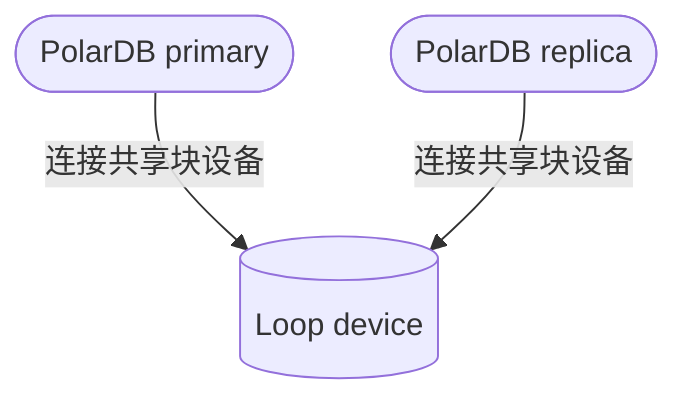

## 穷鬼玩PolarDB RAC一写多读集群系列 | 在Docker容器中用loop设备模拟共享存储搭建PolarDB RAC   
  
### 作者  
digoal  
  
### 日期  
2024-12-16  
  
### 标签  
PostgreSQL , PolarDB , DuckDB , docker , loop , 块设备 , 共享存储   
  
----  
  
## 背景  
为了让穷鬼爱好者能在笔记本装上PolarDB RAC环境, 我最近在把弄这样的方法: 把宿主机块设备共享给多个docker容器, 可以用来构建PolarDB RAC一写多读集群. 但是macOS不支持, 前面文章有详细介绍:   
- [《在 macOS 中将文件模拟为块设备》](../202412/20241216_01.md)  
- [《在 macOS 中用docker --device挂载块设备报错》](../202412/20241216_02.md)  
  
本文将换一种方式, 把文件放在宿主机, 在容器内使用loop设备把文件模拟为块设备. 这个方法不管你是window,macOS还是Linux都可以适用. 真正的穷鬼爱好者福音.  
  
非容器部署请参考: [《PolarDB 100 问 | 如何构建PolarDB Docker镜像 OR 本地编译PolarDB?》](../202412/20241205_02.md)   
  
## DEMO  
[b站视频链接](https://www.bilibili.com/video/BV1ZsNheREmQ/)  
  
[Youtube视频链接](https://www.youtube.com/watch?v=HCHXnm0O3n8)  
  

   
使用 `polardb_pg_devel:ubuntu22.04` 镜像, 自带pfs, 无需再安装pfs.   
  
1、在宿主机(macOS)中生成1个文件(以下文件20GB), 后面在两个容器中将使用这个文件作为loop块设备.   
```  
mkdir ~/data_volumn  
cd ~/data_volumn  
dd if=/dev/zero of=./VirtualDisk.img bs=1m count=20480 oflag=direct  
```  
  
2、启动容器pb1  
```  
cd ~/data_volumn  
PWD=`pwd`  
  
docker run -d -it -v $PWD:/data -P --shm-size=1g --cap-add=SYS_PTRACE --cap-add SYS_ADMIN --privileged=true --name pb1 registry.cn-hangzhou.aliyuncs.com/polardb_pg/polardb_pg_devel:ubuntu22.04 bash  
```  
  
后面要确保2个容器的网络可以互通  
```  
进入容器pb1  
docker exec -ti pb1 bash  
  
ip addr show  
  
1: lo: <LOOPBACK,UP,LOWER_UP> mtu 65536 qdisc noqueue state UNKNOWN group default qlen 1000  
    link/loopback 00:00:00:00:00:00 brd 00:00:00:00:00:00  
    inet 127.0.0.1/8 scope host lo  
       valid_lft forever preferred_lft forever  
2: tunl0@NONE: <NOARP> mtu 1480 qdisc noop state DOWN group default qlen 1000  
    link/ipip 0.0.0.0 brd 0.0.0.0  
3: ip6tnl0@NONE: <NOARP> mtu 1452 qdisc noop state DOWN group default qlen 1000  
    link/tunnel6 :: brd :: permaddr ca4f:9c91:a9ad::  
104: eth0@if105: <BROADCAST,MULTICAST,UP,LOWER_UP> mtu 65535 qdisc noqueue state UP group default  
    link/ether 02:42:ac:11:00:02 brd ff:ff:ff:ff:ff:ff link-netnsid 0  
    inet 172.17.0.2/16 brd 172.17.255.255 scope global eth0  
       valid_lft forever preferred_lft forever  
```  
  
安装ping 客户端  
```
# 0 换源
sudo sed -i 's|http://ports.ubuntu.com|http://mirrors.aliyun.com|g' /etc/apt/sources.list
sudo apt update  
sudo apt-get install -y inetutils-ping  
  
等2个容器都启动后检查确认网络可以互通  
172.17.0.2  
ping 172.17.0.3  
64 bytes from 172.17.0.3: icmp_seq=0 ttl=64 time=0.050 ms  
``` 
  
<b> 如果你的docker容器运行在不同的宿主机上, 要让两个docker容器可以相互访问对方的PolarDB数据库端口传输wal meta信息, 启动docker时选择bridge网络, 并将端口映射到宿主机上, 在docker里可访问对方宿主机的相应端口(相当于访问对方宿主机内的docker容器里的PolarDB). 见 `docker network ls` AND `docker run -p 宿主机port:容器内port` . </b>  
  
3、启动容器pb2  
```  
cd ~/data_volumn  
PWD=`pwd`  
  
docker run -d -it -v $PWD:/data -P --shm-size=1g --cap-add=SYS_PTRACE --cap-add SYS_ADMIN --privileged=true --name pb2 registry.cn-hangzhou.aliyuncs.com/polardb_pg/polardb_pg_devel:ubuntu22.04 bash  
```  
  
确保2个容器的网络可以互通  
```  
进入容器pb2  
docker exec -ti pb2 bash  
  
ip addr show  
172.17.0.3  
  
# 安装ping 客户端
# 0 换源
sudo sed -i 's|http://ports.ubuntu.com|http://mirrors.aliyun.com|g' /etc/apt/sources.list
sudo apt update  
sudo apt-get install -y inetutils-ping  
  
等2个容器都启动后检查确认网络可以互通  
ping 172.17.0.2  
64 bytes from 172.17.0.2: icmp_seq=0 ttl=64 time=0.050 ms  
```  
  
4、在pb1中使用共享的VirtualDisk.img文件创建loop设备, 需要找到一个空闲的loop设备, 从loop0开始找, 逐渐增加数字. 直到创建loopN成功.  
```  
postgres@e065fac6f0b4:~$ sudo losetup --direct-io=on /dev/loop0 /data/VirtualDisk.img  
losetup: /data/VirtualDisk.img: failed to set up loop device: Device or resource busy  

或者可以使用 losetup -f 找第一个未使用的loop设备.
$ losetup -f
/dev/loop1

postgres@e065fac6f0b4:~$ sudo losetup --direct-io=on /dev/loop1 /data/VirtualDisk.img  
postgres@e065fac6f0b4:~$ ll /dev/loop1  
brw-rw-rw- 1 root root 7, 1 Dec 16 13:52 /dev/loop1  
```  
  
将loop设备软链到nvme1n1方便使用, 如果你的容器内已经有这个名字, 可以换一个例如nvme2n1.  
```
# 注意: 容器重启后, 这个软链就不存在了, 需重新创建该软链   

sudo ln -s /dev/loop1 /dev/nvme1n1  
```
  
losetup用法:  
```
$ losetup --help

Usage:
 losetup [options] [<loopdev>]
 losetup [options] -f | <loopdev> <file>

Set up and control loop devices.

Options:
 -a, --all                     list all used devices
 -d, --detach <loopdev>...     detach one or more devices
 -D, --detach-all              detach all used devices
 -f, --find                    find first unused device
 -c, --set-capacity <loopdev>  resize the device
 -j, --associated <file>       list all devices associated with <file>
 -L, --nooverlap               avoid possible conflict between devices

 -o, --offset <num>            start at offset <num> into file
     --sizelimit <num>         device is limited to <num> bytes of the file
 -b, --sector-size <num>       set the logical sector size to <num>
 -P, --partscan                create a partitioned loop device
 -r, --read-only               set up a read-only loop device
     --direct-io[=<on|off>]    open backing file with O_DIRECT
     --show                    print device name after setup (with -f)
 -v, --verbose                 verbose mode

 -J, --json                    use JSON --list output format
 -l, --list                    list info about all or specified (default)
 -n, --noheadings              don't print headings for --list output
 -O, --output <cols>           specify columns to output for --list
     --output-all              output all columns
     --raw                     use raw --list output format

 -h, --help                    display this help
 -V, --version                 display version

Available output columns:
         NAME  loop device name
    AUTOCLEAR  autoclear flag set
    BACK-FILE  device backing file
     BACK-INO  backing file inode number
 BACK-MAJ:MIN  backing file major:minor device number
      MAJ:MIN  loop device major:minor number
       OFFSET  offset from the beginning
     PARTSCAN  partscan flag set
           RO  read-only device
    SIZELIMIT  size limit of the file in bytes
          DIO  access backing file with direct-io
      LOG-SEC  logical sector size in bytes

For more details see losetup(8).
```
  
---   
  
<b> 可以跳过步骤 : 5.1 和 5.2 </b>   
   
5\.1、在pb2中使用共享的VirtualDisk.img文件创建loop设备, 需要找到一个空闲的loop设备, 从loop0开始找, 逐渐增加数字. 直到创建loopN成功.   
    
<b>注意</b>, 在pb1创建的loop设备, 在pb2能看到, 并且在pb2不能再使用这个loop1名字来进行创建(已占用)      
```
lsblk|grep loop
loop0    7:0    0 658.4M  1 loop 
loop1    7:1    0    20G  0 loop // pb1创建的
loop2    7:2    0    20G  0 loop // pb2创建的
loop3    7:3    0    40G  0 loop // pb1创建的 
loop4    7:4    0    40G  0 loop // pb2创建的 
```
在pb1创建的loop设备, 在pb2可以直接使用. 猜测可能是macOS中docker底层基于HyperKit有关. 参看: [《在 macOS 中用docker --device挂载块设备报错》](../202412/20241216_02.md)       
     
```  
postgres@a73af821619f:~$ sudo losetup --direct-io=on /dev/loop1 /data/VirtualDisk.img  
losetup: /data/VirtualDisk.img: failed to set up loop device: Device or resource busy  
postgres@a73af821619f:~$ sudo losetup --direct-io=on /dev/loop0 /data/VirtualDisk.img  
losetup: /data/VirtualDisk.img: failed to set up loop device: Device or resource busy  
  
postgres@a73af821619f:~$ sudo losetup --direct-io=on /dev/loop2 /data/VirtualDisk.img  
  
postgres@a73af821619f:~$ ll /dev/loop2  
brw-rw-rw- 1 root root 7, 2 Dec 16 13:57 /dev/loop2  
```  
  
5\.2、将loop2设备软链到nvme1n1方便使用, 如果你的容器内已经有这个名字, 可以换一个例如nvme2n1.  
```  
sudo ln -s /dev/loop2 /dev/nvme1n1  
```
   
如果下次要重新做这样的实验时, 启动的容器还会看到之前创建的loop设备, 可以先通过`losetup -D`或`losetup -d loopN`来解绑.    
  
---  
  
5\.3、由于我这个环境任何一个容器创建了loop设备其他容器都能看到, 所以<b>pb2直接使用pb1创建的loop1即可.</b>   
  
将loop设备软链到nvme1n1方便使用, 如果你的容器内已经有这个名字, 可以换一个例如nvme2n1.  
```
# 注意: 容器重启后, 这个软链就不存在了, 需重新创建该软链   

sudo ln -s /dev/loop1 /dev/nvme1n1  
``` 
  
6、格式化共享盘, 在pb1 或 pb2中, 任意一个容器中执行一次即可. 注意有报错(实际上可以忽略这个报错), 可以改成使用: `sudo pfs -C disk mkfs -f nvme1n1`     
```  
sudo pfs -C disk mkfs nvme1n1  
  
以下是日志:  
pfs tool cmd record:mkfs nvme1n1  
[PFS_LOG] Dec 16 14:02:16.459203 INF [48] pfs build version:libpfs_version_("pfsd-build-desc-_-Wed Sep  4 17:22:25 CST 2024")  
[PFS_LOG] Dec 16 14:02:16.459428 INF [48] pid: 47, caller: sudo pfs -C disk mkfs nvme1n1  
[PFS_LOG] Dec 16 14:02:16.459501 INF [48] pid: 46, caller: sudo pfs -C disk mkfs nvme1n1  
[PFS_LOG] Dec 16 14:02:16.459551 INF [48] pid: 14, caller: bash  
[PFS_LOG] Dec 16 14:02:16.460965 INF [48] open device cluster disk, devname nvme1n1, flags 0x13  
[PFS_LOG] Dec 16 14:02:16.461028 INF [48] disk dev path: /dev/nvme1n1  
[PFS_LOG] Dec 16 14:02:16.461041 INF [48] open local disk: open(/dev/nvme1n1, 0x10002)  
[PFS_LOG] Dec 16 14:02:16.461138 INF [48] ioctl status 0  
[PFS_LOG] Dec 16 14:02:16.461146 INF [48] pfs_diskdev_info get pi_pbdno 0, pi_rwtype 1, pi_unitsize 4194304, pi_chunksize 10737418240, pi_disksize 21474836480  
[PFS_LOG] Dec 16 14:02:16.461149 INF [48] pfs_diskdev_info waste size: 0  
[PFS_LOG] Dec 16 14:02:16.461155 INF [48] disk size 0x500000000, chunk size 0x280000000  
[PFS_LOG] Dec 16 14:02:16.461888 ERR [48] chunk 0 pfs magic mismatch 0 vs 0x5046534348  
[PFS_LOG] Dec 16 14:02:16.461903 INF [48] mkfs PBD nvme1n1 isn't formatted  
Init chunk 0  
		metaset        0/1: sectbda           0x1000, npage       80, objsize  128, nobj 2560, oid range [       0,      a00)  
		metaset        0/2: sectbda          0x51000, npage       64, objsize  128, nobj 2048, oid range [       0,      800)  
		metaset        0/3: sectbda          0x91000, npage       64, objsize  128, nobj 2048, oid range [       0,      800)  
  
Init chunk 1  
		metaset        1/1: sectbda      0x280001000, npage       80, objsize  128, nobj 2560, oid range [    1000,     1a00)  
		metaset        1/2: sectbda      0x280051000, npage       64, objsize  128, nobj 2048, oid range [     800,     1000)  
		metaset        1/3: sectbda      0x280091000, npage       64, objsize  128, nobj 2048, oid range [     800,     1000)  
  
Inited filesystem(21474836480 bytes), 2 chunks, 2560 blktags, 2048 direntries, 2048 inodes per chunk  
making paxos file  
init paxos lease  
making journal file  
pfs mkfs succeeds!  
```  
  
用上面那条命令, 日志中出现了报错, 但是命令成功结束. 可以忽略这个错误.    
```  
[PFS_LOG] Dec 16 14:02:16.461888 ERR [48] chunk 0 pfs magic mismatch 0 vs 0x5046534348  
```  
  
报错与这个issue问题一样. 回复: “确实是磁盘太小引起的这个问题，改成大于10G的盘后，问题解决。” 但是我这里测试的是20G, 后来改成了40G的虚拟盘, 还是一样的报错.  
- https://github.com/ApsaraDB/PolarDB-FileSystem/issues/13  
  
加`-f`就不报错了. 实际上可以忽略这个错误, 后面的测试都能正常进行.    
```  
sudo pfs -C disk mkfs -f nvme1n1  
```
  
附pfs命令帮助:   
```
$ pfs -h
Usage: pfs [-H hostid] [-C|--cluster=clustername] [-t pfsd_timeout] <command> [options] pbdpaths
pfs has following commands
  help       show help info
  tree       list all files in this dir and its subdirs
  ls         list all direntries in this directory
  rmdir      remove an empty directory
  truncate   truncate file
  tail       read file tail incessantly
  fallocate  allocate block for file
  write      write file
  read       read file
  stat       show file info
  touch      create file
  chunk      chunk operations
  cp         copy file or dir
  du         display disk usage statistics
  dumpfs     dump pbd info or data
  dumple     dump log entries
  flushlog   flush log to pbd
  fscp       transfer pfs pbd data
  fstrim     trim filesystem
  info       show pfs meta info
  map        dump a file's block index
  mkdir      create dir
  growfs     grow filesystem
  mkfs       make filesystem
  rename     rename file
  rm         remove file or dir
  usedinfo   dump pbd info or data

pfs version: libpfs_version_("pfsd-build-desc-_-Wed Sep  4 17:22:25 CST 2024")
```
    
7、在pb1, pb2都启动pfsd, `-w`为工作进程数量, 数字越大IO性能越好, 这里受制于容器资源限制设置为1.   
  
pb1  
```  
sudo /usr/local/polarstore/pfsd/bin/start_pfsd.sh -p nvme1n1 -w 1  

日志如下: 
option workers `  
option pbdname nvme1n1  
option server id 0  
option logconf /usr/local/polarstore/pfsd/bin/../conf/pfsd_logger.conf  
starting pfsd[68] nvme1n1  
pfsdaemon nvme1n1 start success  
  
# 查看该共享盘内, 当前无数据  
sudo pfs -C disk ls /nvme1n1/  

输出日志如下: 
  File  1     4194304           Mon Dec 16 14:02:16 2024  .pfs-paxos  
  File  1     1073741824        Mon Dec 16 14:02:45 2024  .pfs-journal  
total 2105344 (unit: 512Bytes)  
```  
  
pb2  
```  
sudo /usr/local/polarstore/pfsd/bin/start_pfsd.sh -p nvme1n1 -w 1  

日志如下: 
option workers `  
option pbdname nvme1n1  
option server id 0  
option logconf /usr/local/polarstore/pfsd/bin/../conf/pfsd_logger.conf  
starting pfsd[86] nvme1n1  
pfsdaemon nvme1n1 start success  
  
# 查看该共享盘内, 当前无数据  
sudo pfs -C disk ls /nvme1n1/  

输出日志如下: 
  File  1     4194304           Mon Dec 16 14:02:16 2024  .pfs-paxos  
  File  1     1073741824        Mon Dec 16 14:02:45 2024  .pfs-journal  
total 2105344 (unit: 512Bytes)  
```  
  
停止pfsd使用如下方式, (这里不需要执行, 只是展示一下如何停止`pfsd`):    
```  
sudo /usr/local/polarstore/pfsd/bin/stop_pfsd.sh nvme1n1  
```  
  
8、在pb1编译polardb 15.  
```  
cd /data  
  
# 克隆PolarDB 15 稳定分支代码  
git clone --depth 1 -b POLARDB_15_STABLE https://github.com/ApsaraDB/PolarDB-for-PostgreSQL  
  
# 编译安装PolarDB 15, 不要初始化实例  
cd /data/PolarDB-for-PostgreSQL  
./build.sh --prefix=/data/polardb --jobs=4 --debug=on --port=5432 --ni --ec="--with-pfsd"   
# 注意一定要加上 --with-pfsd, 否则启动数据库时会报错.  
# 之前 ./build.sh --prefix=/data/polardb --jobs=4 --debug=on --port=5432 --ni 启动数据库就遇到了第13步的报错
# 参考 : https://github.com/ApsaraDB/polardb-pg-docker-images/blob/main/Dockerfile-binary
#
# 在实际生产中可以使用 --debug=off , 这里开启--debug=on主要是方便出了问题好调试.   
  
///
以下是日志:  
Begin clean existing installation, may raising errors, ignore them  
Makefile:42: warning: overriding recipe for target 'check'  
../../src/makefiles/pgxs.mk:451: warning: ignoring old recipe for target 'check'  
Begin configure, flag: --enable-depend --with-uuid=e2fs --disable-rpath --with-segsize=128 --with-openssl --enable-nls --with-libxml --with-libxslt --with-icu --with-pam --with-gssapi --with-ldap --with-perl --with-python --with-tcl --with-llvm --with-lz4 --with-zstd --with-system-tzdata=/usr/share/zoneinfo --with-libunwind -q --prefix=/data/polardb/tmp_polardb_pg_15_base --with-pgport=5432  
Begin compile and install PolarDB, flag: -j4 -s  
Makefile:42: warning: overriding recipe for target 'check'  
../../src/makefiles/pgxs.mk:451: warning: ignoring old recipe for target 'check'  
Skip init PolarDB cluster  
```  
  
9、将编译好的二进制拷贝到pb1, pb2的HOME目录, 便于调用:  
```  
$ cp -r /data/polardb/tmp_polardb_pg_15_base ~/

# 或者使用软链也可以:   
$ ln -s /data/polardb/tmp_polardb_pg_15_base ~/
  
  
$ which psql  
/home/postgres/tmp_polardb_pg_15_base/bin/psql  
```
  
版本  
```  
$ psql -V  
psql (PostgreSQL) 15.10  
```  
  
10、将pb1作为primary 节点, 在pb1执行创建polardb实例共享数据目录.  
```  
sudo pfs -C disk mkdir /nvme1n1/shared_data  
```  
  
11、初始化primary节点  
```  
initdb -D $HOME/primary  
  
sudo /home/postgres/tmp_polardb_pg_15_base/bin/polar-initdb.sh $HOME/primary/ /nvme1n1/shared_data/ primary  
  
  
以下是日志  
....  
copy file from /home/postgres/primary//pg_multixact/offsets/0000 to /nvme1n1/shared_data///pg_multixact/offsets/0000 succeeded  
copy file from /home/postgres/primary//pg_multixact/members/0000 to /nvme1n1/shared_data///pg_multixact/members/0000 succeeded  
list base dir file 1  
13572  
4  
5  
delete /home/postgres/primary/base/1/*  
delete /home/postgres/primary/base/13572/*  
delete /home/postgres/primary/base/4/*  
delete /home/postgres/primary/base/5/*  
delete /home/postgres/primary/global/*  
delete /home/postgres/primary/pg_wal  
delete /home/postgres/primary/pg_logindex  
delete /home/postgres/primary/pg_twophase  
delete /home/postgres/primary/pg_xact  
delete /home/postgres/primary/pg_commit_ts  
delete /home/postgres/primary/pg_multixact  
init PolarDB data dir success  
  
  
可以看到当前pfs里共享数据目录中已经有数据了. 实际上是初始化过程中把一些initdb的目录move过去的, 剩下的就是本地实例文件.    
$ sudo pfs -C disk ls /nvme1n1/shared_data  
   Dir  1     512               Mon Dec 16 14:34:48 2024  base  
   Dir  1     7808              Mon Dec 16 14:34:48 2024  global  
   Dir  1     0                 Mon Dec 16 14:34:48 2024  pg_tblspc  
   Dir  1     256               Mon Dec 16 14:35:19 2024  pg_wal  
   Dir  1     0                 Mon Dec 16 14:35:19 2024  pg_logindex  
   Dir  1     0                 Mon Dec 16 14:35:19 2024  pg_twophase  
   Dir  1     128               Mon Dec 16 14:35:19 2024  pg_xact  
   Dir  1     0                 Mon Dec 16 14:35:19 2024  pg_commit_ts  
   Dir  1     256               Mon Dec 16 14:35:20 2024  pg_multixact  
total 0 (unit: 512Bytes)  
```  
  
12、配置pb1本地实例 `postgresql.conf`, `pg_hba.conf`  
```  
echo "
huge_pages=off 
port=5432  
polar_hostid=1  
polar_enable_shared_storage_mode=on  
polar_disk_name='nvme1n1'  
polar_datadir='/nvme1n1/shared_data/'  
polar_vfs.localfs_mode=off  
shared_preload_libraries='\$libdir/polar_vfs,\$libdir/polar_worker'  
polar_storage_cluster_name='disk'  
logging_collector=on  
log_line_prefix='%p\t%r\t%u\t%m\t'  
log_directory='pg_log'  
listen_addresses='0.0.0.0'  
max_connections=200
# 下面几个参数解决replica不能promote的问题, 因为RO依赖logindex.
polar_logindex_mem_size=64MB
polar_xlog_queue_buffers=64MB
polar_xlog_page_buffers=64MB
# 使用pfs时可以关掉 full page write 和 polar_has_partial_write , 否则请打开这两 
full_page_writes = off
polar_has_partial_write = off  
# 参考代码 src/backend/storage/buffer/bufmgr.c
" >> ~/primary/postgresql.conf  
```  
  
```  
echo "  
host all all 0.0.0.0/0 md5  
host	replication	postgres	172.17.0.0/16	trust  
" >> ~/primary/pg_hba.conf  
```  
  
参数模板可参考: https://github.com/ApsaraDB/PolarDB-for-PostgreSQL/blob/POLARDB_15_STABLE/src/backend/utils/misc/polardb.conf.sample   
```
#------------------------------------------------------------------------------
# Common Parameters for PostgreSQL
#------------------------------------------------------------------------------
full_page_writes = off
listen_addresses = '*'
logging_collector = on
max_prepared_transactions = 10
max_worker_processes = 128
max_connections = 1000
shared_buffers = 256MB
shared_preload_libraries ='\$libdir/polar_vfs,\$libdir/polar_io_stat,\$libdir/polar_monitor_preload,\$libdir/polar_worker'

#------------------------------------------------------------------------------
# Common Parameters for PolarDB
#------------------------------------------------------------------------------
polar_disk_name = 'home'
polar_enable_shared_storage_mode = on
polar_vfs.localfs_mode = true
polar_logindex_mem_size=64MB
polar_xlog_queue_buffers=64MB
polar_xlog_page_buffers=64MB
polar_has_partial_write = on
```
    
13、在pb1启动primary实例  
```  
pg_ctl start -D $HOME/primary  
```  
  
---  
  
<b> 如果在编译PolarDB时没有加上`--with-pfsd`选项, 会遇到报错如下: </b>    
```  
waiting for server to start....36762			2024-12-16 15:35:02.906 CST	LOG:  polar_vfs loaded in postmaster 36762  
36762			2024-12-16 15:35:02.906 CST	LOG:  Database will be in readwrite mode  
36762			2024-12-16 15:35:02.906 CST	LOG:  init pangu cluster disk  
36762			2024-12-16 15:35:02.906 CST	LOG:  begin mount pfs name nvme1n1 id 1 pid 36762 backendid -1  
36762			2024-12-16 15:35:02.906 CST	LOG:  mount pfs nvme1n1 readwrite (force) mode success  
36762			2024-12-16 15:35:02.906 CST	LOG:  polar_vfs init done  
 stopped waiting  
pg_ctl: could not start server  
Examine the log output.  
```  
  
数据库无日志文件, 该目录不存在  
```  
~/primary/pg_log  
```  
  
pfs进程显示正常, 日志如下, 即使重启pfs后, 再启动primary还是报错.  
```  
$ ps -ewf|grep pfs  
root     36592     1  6 15:32 ?        00:00:16 /usr/local/polarstore/pfsd/bin/../bin/pfsdaemon -p nvme1n1 -w 1 -c /usr/local/polarstore/pfsd/bin/../conf/pfsd_logger.conf  
  
$ cat /usr/local/polarstore/pfsd/bin/../conf/pfsd_logger.conf  
# Copyright (c) 2017-2021, Alibaba Group Holding Limited  
# Licensed under the Apache License, Version 2.0 (the "License");  
# you may not use this file except in compliance with the License.  
# You may obtain a copy of the License at  
#  
# http://www.apache.org/licenses/LICENSE-2.0  
#  
# Unless required by applicable law or agreed to in writing, software  
# distributed under the License is distributed on an "AS IS" BASIS,  
# WITHOUT WARRANTIES OR CONDITIONS OF ANY KIND, either express or implied.  
# See the License for the specific language governing permissions and  
# limitations under the License.  
  
[global]  
strict init = true  
buffer min = 1024  
buffer max = 2MB  
default format = "%d.%us|%6V|%p|%U:%f:%L|%m%n"  
file perms = 644  
[formats]  
simple = "%d.%us|%-5V|%f:%L|%m%n"  
trace = "%m%n"  
[rules]  
pfsd_cat.* "/var/log/pfsd-%E(PFSD_PBDNAME)/pfsd.log", 100MB * 10 ~ "/var/log/pfsd-%E(PFSD_PBDNAME)/pfsd.log.#r";simple  
original_cat.* "/var/log/pfsd-%E(PFSD_PBDNAME)/pfsd.log", 100MB * 10 ~ "/var/log/pfsd-%E(PFSD_PBDNAME)/pfsd.log.#r";trace  
test_cat.* >stdout; simple  
  
# pfs日志内容未看到错误  
postgres@e065fac6f0b4:~$ cat /var/log/pfsd-nvme1n1/pfsd.log   
  
# pfs重启后日志
sudo /usr/local/polarstore/pfsd/bin/stop_pfsd.sh nvme1n1
sudo /usr/local/polarstore/pfsd/bin/start_pfsd.sh -p nvme1n1 -w 1

2024-12-16 15:37:18.106717|INFO |pfsd_main.cc:142|[pfsd]pthread_join 0  
2024-12-16 15:37:18.106783|INFO |pfsd_main.cc:148|[pfsd]bye bye  
2024-12-16 15:37:27.899529|INFO |pfsd_main.cc:101|starting pfsd[36806] nvme1n1  
2024-12-16 15:37:27.899613|INFO |pfsd_shm.cc:113|ch 32, unit 4096, sizeof pfsd_shm 11.2539M  
2024-12-16 15:37:27.899701|INFO |pfsd_shm.cc:113|ch 32, unit 8192, sizeof pfsd_shm 19.2539M  
2024-12-16 15:37:27.899775|INFO |pfsd_shm.cc:113|ch 32, unit 16384, sizeof pfsd_shm 35.2539M  
2024-12-16 15:37:27.899841|INFO |pfsd_shm.cc:113|ch 16, unit 65536, sizeof pfsd_shm 65.6289M  
2024-12-16 15:37:27.899896|INFO |pfsd_shm.cc:113|ch 4, unit 262144, sizeof pfsd_shm 64.4102M  
2024-12-16 15:37:27.899933|INFO |pfsd_shm.cc:113|ch 1, unit 1048576, sizeof pfsd_shm 64.1055M  
2024-12-16 15:37:27.899959|INFO |pfsd_shm.cc:113|ch 1, unit 4194304, sizeof pfsd_shm 64.1055M  
2024-12-16 15:37:27.899973|INFO |pfsd_shm.cc:134|total pfsd_shm 324.012M  
2024-12-16 15:37:27.900041|INFO |pfsd_worker.cc:227|skip busy cpu 0  
2024-12-16 15:37:27.900049|INFO |pfsd_worker.cc:227|skip busy cpu 1  
2024-12-16 15:37:27.900053|INFO |pfsd_worker.cc:227|skip busy cpu 2  
2024-12-16 15:37:27.900058|INFO |pfsd_worker.cc:227|skip busy cpu 3  
2024-12-16 15:37:27.900063|ERROR|pfsd_worker.cc:260|may be too many workers or not enough cpu: workes 1, cpu 4  
2024-12-16 15:37:27.900139|WARN |pfsd_worker.cc:309|can't find cpuidx for worker 0  
2024-12-16 15:37:27.900227|INFO |pfsd_chnl_shm.cc:912|prepare done 0, notify listen thread  
2024-12-16 15:37:27.900253|INFO |pfsd_chnl_shm.cc:389|listen thread waiting to work.  
2024-12-16 15:37:27.900285|INFO |pfsd_chnl_shm.cc:391|listen thread start working.  
```  
  
数据库core文件如下  
```  
postgres@e065fac6f0b4:~$ gdb --exec=/home/postgres/tmp_polardb_pg_15_base/bin/postgres --core=./core   
GNU gdb (Ubuntu 12.1-0ubuntu1~22.04.2) 12.1  
Copyright (C) 2022 Free Software Foundation, Inc.  
License GPLv3+: GNU GPL version 3 or later <http://gnu.org/licenses/gpl.html>  
This is free software: you are free to change and redistribute it.  
There is NO WARRANTY, to the extent permitted by law.  
Type "show copying" and "show warranty" for details.  
This GDB was configured as "aarch64-linux-gnu".  
Type "show configuration" for configuration details.  
For bug reporting instructions, please see:  
<https://www.gnu.org/software/gdb/bugs/>.  
Find the GDB manual and other documentation resources online at:  
    <http://www.gnu.org/software/gdb/documentation/>.  
  
For help, type "help".  
Type "apropos word" to search for commands related to "word".  
[New LWP 36819]  
[Thread debugging using libthread_db enabled]  
Using host libthread_db library "/lib/aarch64-linux-gnu/libthread_db.so.1".  
Core was generated by `/home/postgres/tmp_polardb_pg_15_base/bin/postgres -D /home/postgres/primary'.  
Program terminated with signal SIGSEGV, Segmentation fault.  
#0  0x0000000000000000 in ?? ()  
(gdb) bt  
#0  0x0000000000000000 in ?? ()  
#1  0x0000ffff9b2c6010 in vfs_stat (path=0xffffef7080d8 "/nvme1n1/shared_data//global/polar_settings.conf", buf=0xffffef707838) at polar_vfs_interface.c:673  
#2  0x0000aaaab780f12c in ?? ()  
#3  0x0000ffffef7080d8 in ?? ()  
#4  0x6663438ba95dfce6 in ?? ()  
Backtrace stopped: previous frame identical to this frame (corrupt stack?)  
```
   
polar_settings.conf的内容如下, 看起来是个空文件:   
```
$ sudo pfs -C disk read /nvme1n1/shared_data/global/polar_settings.conf
# Do not edit this file manually!
# It will be overwritten by the ALTER SYSTEM FOR CLUSTER command.
```
   
<b> 有解决办法吗? </b>   
   
回复: 编译polardb时缺少了`with-pfsd`选项, 加上即可:  
```
./build.sh --prefix=/data/polardb --jobs=4 --debug=on --port=5432 --ni --ec="--with-pfsd"
```
   
参考: https://github.com/ApsaraDB/polardb-pg-docker-images/blob/main/Dockerfile-binary    
```
$ pg_ctl start -D ~/primary
waiting for server to start....63754			2024-12-17 13:46:10.076 CST	LOG:  polar_vfs loaded in postmaster 63754
63754			2024-12-17 13:46:10.076 CST	LOG:  Database will be in readwrite mode
63754			2024-12-17 13:46:10.076 CST	LOG:  init pangu cluster disk
63754			2024-12-17 13:46:10.076 CST	LOG:  begin mount pfs name nvme1n1 id 1 pid 63754 backendid -1
[PFSD_SDK INF Dec 17 13:46:10.076311][63754]pfs_mount_prepare 103: begin prepare mount cluster(disk), PBD(nvme1n1), hostid(1),flags(0x200013)
[PFSD_SDK INF Dec 17 13:46:10.076391][63754]pfs_mount_prepare 165: pfs_mount_prepare success for nvme1n1 hostid 1
[PFSD_SDK INF Dec 17 13:46:10.180610][63754]chnl_connection_poll_shm 1238: ack data update s_mount_epoch 1
[PFSD_SDK INF Dec 17 13:46:10.180623][63754]chnl_connection_poll_shm 1266: connect and got ack data from svr, err = 0, mntid 0
[PFSD_SDK INF Dec 17 13:46:10.180767][63754]pfsd_sdk_init 191: pfsd_chnl_connect success
[PFSD_SDK INF Dec 17 13:46:10.180776][63754]pfs_mount_post 208: pfs_mount_post err : 0
63754			2024-12-17 13:46:10.180 CST	LOG:  mount pfs nvme1n1 readwrite (force) mode success
63754			2024-12-17 13:46:10.180 CST	LOG:  polar_vfs init done
63754			2024-12-17 13:46:10.198 CST	LOG:  "polar_settings.conf" is copied from sharedstorage success, additional load it.
63754			2024-12-17 13:46:10.200 CST	LOG:  polardb read control file "/nvme1n1/shared_data//global/pg_control" success
63754			2024-12-17 13:46:10.200 CST	LOG:  PolarDB load controlfile in postmaster
63754			2024-12-17 13:46:10.204 CST	LOG:  clog buffer max slot size is 256, and it will be set to 256
63754			2024-12-17 13:46:10.204 CST	LOG:  commit timestamp buffer max slot size is 512, and it will set to 256
63754			2024-12-17 13:46:10.204 CST	LOG:  clog buffer max slot size is 256, and it will be set to 256
63754			2024-12-17 13:46:10.204 CST	LOG:  commit timestamp buffer max slot size is 512, and it will set to 256
63754			2024-12-17 13:46:10.207 CST	LOG:  clog buffer max slot size is 256, and it will be set to 256
63754			2024-12-17 13:46:10.207 CST	LOG:  commit timestamp buffer max slot size is 512, and it will set to 256
63754			2024-12-17 13:46:10.212 CST	LOG:  initialized faultinjector shmem
63754			2024-12-17 13:46:10.224 CST	LOG:  PolarIOStatArray share memory total size is 1220464
63754			2024-12-17 13:46:10.226 CST	LOG:  redirecting log output to logging collector process
63754			2024-12-17 13:46:10.226 CST	HINT:  Future log output will appear in directory "pg_log".
 done
server started
```
   
---   
  
<b> 下面准备创建replica节点 </b>   
  
14、在 pb1 Primary 节点上，为pb2的 Replica 节点创建相应的复制槽，用于 Replica 节点的物理复制：  
```
psql -p 5432 -d postgres -c "SELECT pg_create_physical_replication_slot('replica1');"  
  
 pg_create_physical_replication_slot  
-------------------------------------  
 (replica1,)  
(1 row)  
```
  
15、replica节点部署.   
  
在pb2节点本地磁盘的 `~/replica1` 路径下创建一个空目录，然后通过 `polar-initdb.sh` 脚本使用共享存储上的数据目录来初始化 Replica 节点的本地目录。初始化后的本地目录中没有默认配置文件，所以还需要使用 `initdb` 创建一个临时的本地目录模板，然后将所有的默认配置文件拷贝到 Replica 节点的本地目录下：  
```  
# 进入pb2容器
docker exec -ti pb2 bash  
  
mkdir -m 0700 $HOME/replica1  
sudo /home/postgres/tmp_polardb_pg_15_base/bin/polar-initdb.sh $HOME/replica1/ /nvme1n1/shared_data/ replica  
  
# 日志如下:  

init replica  
list base dir file 5  
1  
4  
13572  
mkdir /home/postgres/replica1/base/5  
mkdir /home/postgres/replica1/base/1  
mkdir /home/postgres/replica1/base/4  
mkdir /home/postgres/replica1/base/13572  
init PolarDB replica mode dir success  
```  
  
修改replica数据目录及子目录及文件的权限和owner  
```  
sudo chmod -R 700 $HOME/replica1  
sudo chown -R postgres:postgres  $HOME/replica1
```  
  
生成初始配置文件  
```  
initdb -D /tmp/replica1  
cp /tmp/replica1/*.conf $HOME/replica1/
rm -rf /tmp/replica1
```  
  
16、编辑pb2 replica节点配置文件  
  
```  
echo "  
port=5432  
polar_hostid=2  
polar_enable_shared_storage_mode=on  
polar_disk_name='nvme1n1'  
polar_datadir='/nvme1n1/shared_data/'  
polar_vfs.localfs_mode=off  
shared_preload_libraries='\$libdir/polar_vfs,\$libdir/polar_worker'  
polar_storage_cluster_name='disk'  
logging_collector=on  
log_line_prefix='%p\t%r\t%u\t%m\t'  
log_directory='pg_log'  
listen_addresses='0.0.0.0'  
max_connections=200
# 下面几个参数解决replica不能promote的问题, 因为RO依赖logindex.
polar_logindex_mem_size=64MB
polar_xlog_queue_buffers=64MB
polar_xlog_page_buffers=64MB
# 使用pfs时可以关掉 full page write 和 polar_has_partial_write , 否则请打开这两 
full_page_writes = off
polar_has_partial_write = off 
  
# replication  
primary_slot_name='replica1'  
primary_conninfo='host=172.17.0.2 port=5432 user=postgres dbname=postgres application_name=replica1'  
" >> ~/replica1/postgresql.conf   
```  
  
```  
echo "    
host all all 0.0.0.0/0 md5    
host	replication	postgres	172.17.0.0/16	trust    
" >> ~/replica1/pg_hba.conf    
```  
  
标识节点以 Replica 模式启动：  
```  
touch $HOME/replica1/replica.signal  
```  
  
启动 Replica 节点：  
```  
pg_ctl start -D $HOME/replica1  
```  
  
检查 Replica 节点能否正常运行：  
```  
psql -p 5432 -d postgres -c 'SELECT version();'  
  
                                    version                                       
--------------------------------------------------------------------------------  
 PostgreSQL 15.10 (PolarDB 15.10.2.0 build d4f5477d debug) on aarch64-linux-gnu  
(1 row)  
```  
  
17、检查PolarDB基于共享存储的复制是否正常  
  
pb1 检查到replica复制槽正常连接  
```  
postgres=# select * from pg_stat_replication;  
-[ RECORD 1 ]----+------------------------------  
pid              | 63834  
usesysid         | 10  
usename          | postgres  
application_name | replica1  
client_addr      | 172.17.0.3  
client_hostname  |   
client_port      | 49322  
backend_start    | 2024-12-17 14:06:06.335694+08  
backend_xmin     |   
state            | streaming  
sent_lsn         | 0/40963428  
write_lsn        | 0/40963428  
flush_lsn        | 0/40963428  
replay_lsn       | 0/40963428  
write_lag        |   
flush_lag        |   
replay_lag       |   
sync_priority    | 0  
sync_state       | async  
reply_time       | 2024-12-17 14:06:16.373174+08  
```  
  
在pb1 primary 节点建表, 写入测试数据库  
```  
postgres@d648efb76b69:~/primary$ psql  
psql (PostgreSQL 15.10 (PolarDB 15.10.2.0 build d4f5477d debug) on aarch64-linux-gnu)  
Type "help" for help.  
  
postgres=# create table tbl (id int primary key, info text, ts timestamp);  
CREATE TABLE  
postgres=# insert into tbl select generate_series(1,10), md5(random()::text), clock_timestamp();  
INSERT 0 10  
```  
  
在pb2 replica 节点, 查询到数据正常, 确认PolarDB基于共享存储的复制正常  
```  
postgres@d99291973fcc:~/replica1$ psql  
psql (PostgreSQL 15.10 (PolarDB 15.10.2.0 build d4f5477d debug) on aarch64-linux-gnu)  
Type "help" for help.  
  
postgres=# select * from tbl;  
 id |               info               |             ts               
----+----------------------------------+----------------------------  
  1 | 8ddf7a3ddf9d9a348637dba4bc2d9308 | 2024-12-17 14:09:44.805661  
  2 | 374171ae8e839d595112570bbf6e6a5d | 2024-12-17 14:09:44.808097  
  3 | 36c83070ecef903804f843d8b6f542a5 | 2024-12-17 14:09:44.808106  
  4 | eeb9fb43ed70b98bc1e3cac7a8591268 | 2024-12-17 14:09:44.80811  
  5 | 7d24eb72eee5dc5abd73337f55b3bf91 | 2024-12-17 14:09:44.808114  
  6 | 4c2910dc1939dc57a7cc91334a3546ce | 2024-12-17 14:09:44.808118  
  7 | e59739763a6137b05f9b85c6f4daf83d | 2024-12-17 14:09:44.808121  
  8 | 36183814d28784a1dd8e145daada9e75 | 2024-12-17 14:09:44.808124  
  9 | 1757ba67ab4c49af449e56ee0f70485c | 2024-12-17 14:09:44.808127  
 10 | 4b2a4e2849c9ace23c21258c6e95842b | 2024-12-17 14:09:44.808131  
(10 rows)  
```  
  
### 补充问题
节点启动后, 一直存在如下警告, 不知道是何原因?    
```
告警来自实例本地数据目录日志文件中 $PGDATA/pg_log/xxx_error.log
... 
207                     2024-12-24 14:48:13.410 CST     WARNING:  Failed to get the instance memory usage
207                     2024-12-24 14:48:13.910 CST     WARNING:  Failed to get the instance memory usage
207                     2024-12-24 14:48:14.410 CST     WARNING:  Failed to get the instance memory usage
207                     2024-12-24 14:48:14.910 CST     WARNING:  Failed to get the instance memory usage
207                     2024-12-24 14:48:15.410 CST     WARNING:  Failed to get the instance memory usage
207                     2024-12-24 14:48:15.911 CST     WARNING:  Failed to get the instance memory usage
207                     2024-12-24 14:48:16.411 CST     WARNING:  Failed to get the instance memory usage
207                     2024-12-24 14:48:16.912 CST     WARNING:  Failed to get the instance memory usage
207                     2024-12-24 14:48:17.413 CST     WARNING:  Failed to get the instance memory usage
207                     2024-12-24 14:48:17.913 CST     WARNING:  Failed to get the instance memory usage
207                     2024-12-24 14:48:18.413 CST     WARNING:  Failed to get the instance memory usage
207                     2024-12-24 14:48:18.914 CST     WARNING:  Failed to get the instance memory usage
207                     2024-12-24 14:48:19.414 CST     WARNING:  Failed to get the instance memory usage
207                     2024-12-24 14:48:19.914 CST     WARNING:  Failed to get the instance memory usage
207                     2024-12-24 14:48:20.415 CST     WARNING:  Failed to get the instance memory usage
207                     2024-12-24 14:48:20.915 CST     WARNING:  Failed to get the instance memory usage
```
   
报错代码来自PolarDB `external/polar_resource_manager/polar_resource_manager.c`   
```
/*
 * check ins memory
 */
void
polar_check_mem_exceed(void)
{
        Size            pfsd_rss = 0;
        Size            ins_rss_limit = 0;
        Size            ins_mem_limit = 0;
        Size            ins_mem_usage = 0;
        Size            ins_rss = 0;
        Size            ins_mapped_file = 0;

        /* Get instance memory limit and memory usage */
        if (polar_get_ins_memorystat(&ins_rss, &ins_mapped_file, &ins_rss_limit) != 0)
        {
                elog(WARNING, "Failed to get the instance memory usage");
                return;
        }

        /* Get the pfsdaemon process rss */
        if (enable_account_otherproc && polar_get_procrss_by_name("(pfsdaemon)", &pfsd_pid, &pfsd_rss) != 0)
        {
                pfsd_pid = InvalidPid;
                elog(DEBUG1, "Failed to get the pfsdaemon rss");
        }

        /* Calculate memory limit, memory request and memory usage */
        ins_mem_limit = Min(ins_rss_limit / 100 * total_mem_limit_rate, ins_rss_limit - total_mem_limit_remain_size * 1024);
        /* mapped_file is generated by DSM */
        ins_mem_usage = ins_rss + ins_mapped_file + pfsd_rss;

        /*
         * total mem usage reach mem limit evict resource manager to release
         * exceed_rss memory
         */
        /* priority to release resource manager which exceed limit */
        /* After setting the random policy, other release methods will be shielded */
        if (mem_release_policy == TERMINATE_ANY_RANDOM && ins_mem_usage > ins_mem_limit)
        {
                if (enable_log)
                        ereport(LOG, (errmsg("[polar_resource_manager] For Random Policy: Instance memory usage database memory %lu bytes, "
                                                                 "database dynamic shared memory %lu bytes, pfsd memory %lu bytes",
                                                                 ins_rss, ins_mapped_file, pfsd_rss)));

                /* The idle process will be released first */
                polar_throttle_mem_random(ins_mem_usage, ins_mem_limit, RM_TBLOCK_DEFAULT, idle_terminate_num);

                /*
                 * Since the memory size of the process is not obtained under the
                 * random policy, it is necessary to obtain the instance memory usage
                 * again to determine whether to release the active sessions.
                 */
                if (polar_get_ins_memorystat(&ins_rss, &ins_mapped_file, &ins_rss_limit) != 0)
                {
                        elog(WARNING, "Failed to get the instance memory usage");
                        return;
                }

                if (enable_account_otherproc && polar_get_procrss_by_name("(pfsdaemon)", &pfsd_pid, &pfsd_rss) != 0)
                {
                        pfsd_pid = InvalidPid;
                        elog(DEBUG1, "Failed to get the pfsdaemon rss");
                }

                ins_mem_usage = ins_rss + ins_mapped_file + pfsd_rss;

                /* If the memory still exceeds the limit, release the active session */
                if (ins_mem_usage > ins_mem_limit)
                        polar_throttle_mem_random(ins_mem_usage, ins_mem_limit, RM_TBLOCK_INPROGRESS, active_terminate_num);
        }
        else if (ins_mem_usage > ins_mem_limit)
        {
                /*
                 * When the memory is larger than the memory limit, it will perform
                 * the forced release memory mode.
                 */
                if (enable_log)
                        ereport(LOG, (errmsg("[polar_resource_manager] For Limit: Instance memory usage database memory %lu bytes, "
                                                                 "database dynamic shared memory %lu bytes, pfsd memory %lu bytes",
                                                                 ins_rss, ins_mapped_file, pfsd_rss)));

                polar_throttle_mem(ins_mem_usage, ins_mem_limit, true);
        }
}
```
    
关于这个warning, 研发的回复来了   
```
通过polar_resource_manager.enable_resource_manager 参数可以设置该功能为off.
该功能为监控内存占用，如果过高会 terminate backend, 防止 OS 的 kill -9

监控数据来自Linux cgroup:   /sys/fs/cgroup/memory/memory.stat   

但是在macOS 的docker容器内容, 该目录为: /sys/fs/cgroup/memory.stat
所以一直报无法获取数据的warning.

至于为什么macOS内的docker 容器cgroup目录和Linux中的目录不一致, 暂时不得而知.  
猜测和macOS的docker是模拟出来的原因, 路径未模拟正确.  
```   
   
<b>解决方法如下:</b>      
- [《PolarDB 100 问 | `Failed to get the instance memory usage`》](../202412/20241226_02.md)   
  
或者可临时关闭该功能:    
```
# pb1 
echo "polar_resource_manager.enable_resource_manager=off" >> ~/primary/postgresql.conf
pg_ctl restart -m fast -D ~/primary

# pb2 
echo "polar_resource_manager.enable_resource_manager=off" >> ~/replica1/postgresql.conf
pg_ctl restart -m fast -D ~/replica1
```
   
   
## 参考  
  
[《PolarDB PG 15 编译安装 & pg_duckdb 插件 + OSS 试用》](../202411/20241111_01.md)  
  
https://apsaradb.github.io/PolarDB-for-PostgreSQL/zh/deploying/fs-pfs.html  
  
https://github.com/ApsaraDB/PolarDB-FileSystem/blob/master/Readme-CN.md  
  
https://github.com/ApsaraDB/PolarDB-FileSystem/blob/master/docs/PFS_Tools-CN.md  
  
https://www.jamescoyle.net/how-to/2096-use-a-file-as-a-linux-block-device  
  
[《在 macOS 中将文件模拟为块设备》](../202412/20241216_01.md)  
  
[《在 macOS 中用docker --device挂载块设备报错》](../202412/20241216_02.md)  
  
  
  
#### [期望 PostgreSQL|开源PolarDB 增加什么功能?](https://github.com/digoal/blog/issues/76 "269ac3d1c492e938c0191101c7238216")
  
  
#### [PolarDB 开源数据库](https://openpolardb.com/home "57258f76c37864c6e6d23383d05714ea")
  
  
#### [PolarDB 学习图谱](https://www.aliyun.com/database/openpolardb/activity "8642f60e04ed0c814bf9cb9677976bd4")
  
  
#### [PostgreSQL 解决方案集合](../201706/20170601_02.md "40cff096e9ed7122c512b35d8561d9c8")
  
  
#### [德哥 / digoal's Github - 公益是一辈子的事.](https://github.com/digoal/blog/blob/master/README.md "22709685feb7cab07d30f30387f0a9ae")
  
  
#### [About 德哥](https://github.com/digoal/blog/blob/master/me/readme.md "a37735981e7704886ffd590565582dd0")
  
  

  
