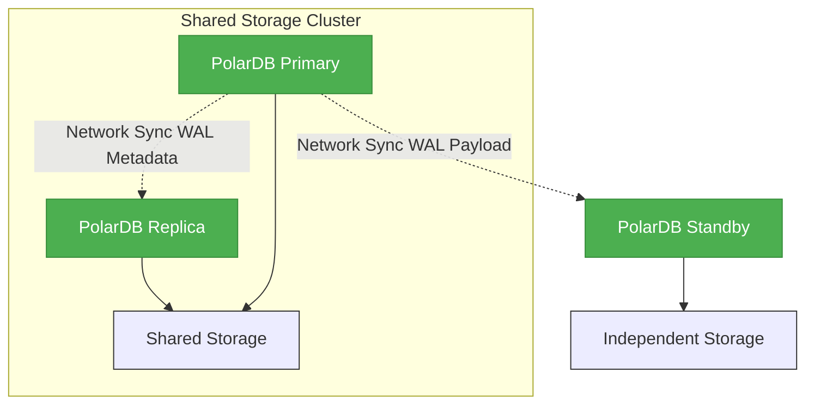

## 穷鬼玩PolarDB RAC一写多读集群系列 | 创建PolarDB 容灾(standby)节点   
    
### 作者    
digoal    
    
### 日期    
2024-12-18    
    
### 标签    
PostgreSQL , PolarDB , DuckDB , docker , loop , 块设备 , 共享存储 , pfs , standby      
    
----    
    
## 背景    
继续穷鬼玩PolarDB RAC一写多读集群系列, 上一篇通过[《在Docker容器中用loop设备模拟共享存储》](../202412/20241216_03.md) 分享了在macOS中用虚拟共享磁盘和几个容器来搭建“PolarDB 15 RAC一写多读集群”.  
  
本篇介绍一下如何搭建PolarDB容灾(standby)节点, 需要用到上一篇的环境, 没有环境的小伙伴可以先阅读上一篇搭建一下.     
  
搭建standby还需要参考如下文档:    
- https://apsaradb.github.io/PolarDB-for-PostgreSQL/zh/operation/backup-and-restore.html#%E5%A4%87%E4%BB%BD%E5%B9%B6%E6%81%A2%E5%A4%8D%E4%B8%80%E4%B8%AA-standby-%E8%8A%82%E7%82%B9  
  
## DEMO  
[b站视频链接](https://www.bilibili.com/video/BV1FYNZeNEuo/)  
  
[Youtube视频链接](https://www.youtube.com/watch?v=FeWJOwT-byA)  
  

  
1、在macOS宿主机创建PolarDB standby容灾节点需要使用的虚拟磁盘`VirtualDisk_standby.img`     
```  
cd ~/data_volumn    
dd if=/dev/zero of=./VirtualDisk_standby.img bs=1m count=20480 oflag=direct   
```  
  
2、启动容器pb3  
```  
cd ~/data_volumn    
PWD=`pwd`    
    
docker run -d -it -v $PWD:/data -P --shm-size=1g --cap-add=SYS_PTRACE --cap-add SYS_ADMIN --privileged=true --name pb3 registry.cn-hangzhou.aliyuncs.com/polardb_pg/polardb_pg_devel:ubuntu22.04 bash    
```  
  
3、进入容器pb3, 查看地址  
```  
docker exec -ti pb3 bash    
    
ip addr show    
  
116: eth0@if117: <BROADCAST,MULTICAST,UP,LOWER_UP> mtu 65535 qdisc noqueue state UP group default   
    link/ether 02:42:ac:11:00:04 brd ff:ff:ff:ff:ff:ff link-netnsid 0  
    inet 172.17.0.4/16 brd 172.17.255.255 scope global eth0  
       valid_lft forever preferred_lft forever  
```  
  
4、确认pb3和pb1,pb2容器的网络正常通信.  
```  
# 安装ping 客户端  
# 换源
sudo sed -i 's|http://ports.ubuntu.com|http://mirrors.aliyun.com|g' /etc/apt/sources.list
sudo apt update  
sudo apt-get install -y inetutils-ping  
    
# 确认可以连通PolarDB 主节点和replica节点  
  
ping 172.17.0.2   
64 bytes from 172.17.0.2: icmp_seq=0 ttl=64 time=0.050 ms    
...  
ping 172.17.0.3   
64 bytes from 172.17.0.3: icmp_seq=0 ttl=64 time=0.050 ms    
```  
  
5、在pb3创建一个loop设备, 用于映射到虚拟磁盘`VirtualDisk_standby.img`     
```  
# 找一个可用的loop设备  
sudo losetup -f  
返回  
/dev/loop2  
  
# 使用新建的虚拟磁盘创建loop设备  
  
sudo losetup --direct-io=on /dev/loop2 /data/VirtualDisk_standby.img    
  
# 现在可以看到该loop设备  
$ losetup -a  
/dev/loop1: [0176]:36827 (/data/VirtualDisk.img)  
/dev/loop2: [0176]:109941 (/data/VirtualDisk_standby.img)  
/dev/loop0: [65025]:3407876 (/mount-services-cache/entries/services.iso/16203eaee29495c5a513341af851be45c30488427f5e3c87764e8b89a4a47d7a)  
```  
  
6、将loop设备软链到 `nvme2n1` (注意`nvme2n1`和`primary & replica`的`nvme1n1`不同, 不是必须的, 这里取`nvme2n1`只是区分一下), 方便使用(也不是必须的, 习惯性动作)  
```
# 注意: 容器重启后, 这个软链就不存在了, 需重新创建该软链   

sudo ln -s /dev/loop2 /dev/nvme2n1    
```  
  
7、使用pfs格式化 nvme2n1  
```  
sudo pfs -C disk mkfs -f nvme2n1    
```  
  
8、启动pfsd  
```  
sudo /usr/local/polarstore/pfsd/bin/start_pfsd.sh -p nvme2n1 -w 1    
```  
  
9、将编译好的polardb二进制拷贝到`$HOME`目录中   
```  
$ cp -r /data/polardb/tmp_polardb_pg_15_base ~/    

# 或者使用软链也可以, 软链还有个好处, 编译插件时只需要编译一次即可:   
$ ln -s /data/polardb/tmp_polardb_pg_15_base ~/  
    
$ which psql    
/home/postgres/tmp_polardb_pg_15_base/bin/psql    
```  
  
---   
   
10、备份PolarDB数据到本地存储和共享存储.  <b> polar_basebackup支持从pfs备份到pfs后, 用此法. 否则跳到下一个第10步. </b>       
  
在用于部署 `Standby` 节点的pb3容器中执行备份，以 `~/standby` 作为本地数据目录，以 `/nvme2n1/shared_data` 作为共享存储目录：  
  
```  
polar_basebackup \
    --host=172.17.0.2 \
    --port=5432 \
    -D /home/postgres/standby \
    --polardata=/nvme2n1/shared_data/ \
    --polar_storage_cluster_name=disk \
    --polar_disk_name=nvme2n1 \
    --polar_host_id=3 \
    -X stream --progress --write-recovery-conf -v  
```  
  
报错如下:    
  
看起来polar_basebackup自动创建了`/nvme2n1/shared_data/`, 但是没有自动创建`/nvme2n1/shared_data/base`  
```  
[PFSD_SDK INF Dec 17 17:42:37.947483][321]pfs_mount_prepare 103: begin prepare mount cluster(disk), PBD(nvme2n1), hostid(3),flags(0x13)  
[PFSD_SDK INF Dec 17 17:42:37.947583][321]pfs_mount_prepare 165: pfs_mount_prepare success for nvme2n1 hostid 3  
[PFSD_SDK INF Dec 17 17:42:37.983903][321]chnl_connection_poll_shm 1238: ack data update s_mount_epoch 1  
[PFSD_SDK INF Dec 17 17:42:37.983917][321]chnl_connection_poll_shm 1266: connect and got ack data from svr, err = 0, mntid 0  
[PFSD_SDK INF Dec 17 17:42:37.984060][321]pfsd_sdk_init 191: pfsd_chnl_connect success  
[PFSD_SDK INF Dec 17 17:42:37.984082][321]pfs_mount_post 208: pfs_mount_post err : 0  
[PFSD_SDK ERR Dec 17 17:42:37.989320][321]pfsd_opendir 1437: opendir /nvme2n1/shared_data/ error: No such file or directory  
[PFSD_SDK INF Dec 17 17:42:37.989439][321]pfsd_mkdir 1320: mkdir /nvme2n1/shared_data  
polar_basebackup: initiating base backup, waiting for checkpoint to complete  
polar_basebackup: checkpoint completed  
polar_basebackup: write-ahead log start point: 0/485F0700 on timeline 1  
polar_basebackup: starting background WAL receiver  
polar_basebackup: created temporary replication slot "pg_basebackup_64335"  
[PFSD_SDK INF Dec 17 17:42:38.149108][321]pfsd_mkdir 1320: mkdir /nvme2n1/shared_data/pg_wal  
[PFSD_SDK INF Dec 17 17:42:38.149659][321]pfsd_mkdir 1320: mkdir /nvme2n1/shared_data/pg_wal/archive_status  
[PFSD_SDK INF Dec 17 17:42:38.153165][329]pfsd_open 539: open /nvme2n1/shared_data/pg_wal/000000010000000000000001 with inode 3, fd 0  
polar_basebackup: error: could not create directory "/nvme2n1/shared_data/base": No such file or directory  
polar_basebackup: removing data directory "/home/postgres/standby"  
polar_basebackup: removing data directory "/nvme2n1/shared_data"  
[PFSD_SDK INF Dec 17 17:42:38.210123][321]pfsd_rmdir 1370: rmdir /nvme2n1/shared_data/pg_wal/archive_status  
[PFSD_SDK INF Dec 17 17:42:38.211285][321]pfsd_unlink 952: unlink /nvme2n1/shared_data/pg_wal/000000010000000000000001  
[PFSD_SDK INF Dec 17 17:42:38.212522][321]pfsd_rmdir 1370: rmdir /nvme2n1/shared_data/pg_wal  
[PFSD_SDK INF Dec 17 17:42:38.213276][321]pfsd_rmdir 1370: rmdir /nvme2n1/shared_data  
```  
  
创建失败, 环境已清空     
```  
$ sudo pfs -C disk ls /nvme2n1/  
  File  1     4194304           Wed Dec 18 09:58:16 2024  .pfs-paxos  
  File  1     1073741824        Wed Dec 18 09:58:17 2024  .pfs-journal  
total 2105344 (unit: 512Bytes)  
```  
  
<b> 暂时没办法进行后续的操作, 请问该如何解决呢? </b>  回复: polar_basebackup还没有适配共享存储, 等适配后, 需重新编译polardb二进制再试.        
  
上述命令会将PolarDB `Primary` 节点的本地数据目录备份到`-D /home/postgres/standby`，将PolarDB 主实例共享存储的数据备份到`--polardata=/nvme2n1/shared_data/ --polar_storage_cluster_name=disk --polar_disk_name=nvme2n1` 。   
  
<b> 解决办法 </b>  
  
在polar_basebackup支持从pfs备份到pfs之前, 可以先参考 [《穷鬼玩PolarDB RAC一写多读集群系列 | 在线备份》](../202412/20241218_04.md) 使用polar_basebackup备份pfs到本地文件系统, 然后把共享数据拷贝到pfs, 从而实现搭建基于pfs存储的PolarDB standby.    
  
假设你已经完成了前9步的所有操作.   
   
---   
  
<b>10、(polar_basebackup支持从pfs备份到pfs之前, 用此法.)  </b>   
  
首先进行备份, 假设 [《穷鬼玩PolarDB RAC一写多读集群系列 | 在线备份》](../202412/20241218_04.md) 直到第6步已正常执行.    
  
得到  
- 本地数据目录: `/data/backup/primary`   
- 共享数据目录: `/data/backup/shared_data`  
  
将本地数据目录拷贝到本地standby实例的对应目录中, 直接移动也行, 随你:    
```  
cp -r /data/backup/primary ~/standby  
```  
  
将共享数据目录拷贝到pfs nvme2n1中  
```  
pfs cp -r /data/backup/shared_data /nvme2n1/

# 然后 /data/backup/shared_data 就可以删掉了
rm -rf /data/backup/shared_data 
```  
  
拷贝完成后, 可以看到pfs中已经有共享数据内容了  
```  
postgres@9bab5d9c0b25:/data$ pfs ls /nvme2n1/  
  File  1     4194304           Wed Dec 18 09:58:16 2024  .pfs-paxos  
  File  1     1073741824        Wed Dec 18 09:58:17 2024  .pfs-journal  
   Dir  1     1664              Thu Dec 19 14:23:03 2024  shared_data  
total 2105344 (unit: 512Bytes)  
  
postgres@9bab5d9c0b25:/data$ pfs ls /nvme2n1/shared_data  
   Dir  1     256               Thu Dec 19 14:22:59 2024  pg_multixact  
   Dir  1     256               Thu Dec 19 14:23:02 2024  pg_wal  
   Dir  1     0                 Thu Dec 19 14:23:02 2024  pg_commit_ts  
  File  1     0                 Thu Dec 19 14:23:02 2024  standby.signal  
   Dir  1     0                 Thu Dec 19 14:23:02 2024  pg_replslot  
   Dir  1     0                 Thu Dec 19 14:23:02 2024  pg_tblspc  
  File  1     217               Thu Dec 19 14:23:02 2024  polar_non_exclusive_backup_label  
  File  1     257               Thu Dec 19 14:23:02 2024  postgresql.auto.conf  
   Dir  1     0                 Thu Dec 19 14:23:02 2024  pg_twophase  
   Dir  1     128               Thu Dec 19 14:23:02 2024  pg_xact  
   Dir  1     0                 Thu Dec 19 14:23:02 2024  pg_logindex  
   Dir  1     7808              Thu Dec 19 14:23:03 2024  global  
   Dir  1     512               Thu Dec 19 14:23:04 2024  base  
total 16384 (unit: 512Bytes)  
```  
   
<b> PS: shared data里面的standby.signal 文件应该删掉, 在standby节点本地目录中touch standby.signal即可. 因为配置文件/标签文件与连接共享存储的实例角色相关, 所以放在shared data里是没有意义的. </b>      
```
pfs rm /nvme2n1/shared_data/standby.signal 
```
   
11、配置standby `postgresql.conf`    
  
```  
vi ~/standby/postgresql.conf   
  
修改如下:    
  
-polar_hostid=1    
+polar_hostid=3    
  
-polar_disk_name='nvme1n1'    
-polar_datadir='/nvme1n1/shared_data/'    
+polar_disk_name='nvme2n1'    
+polar_datadir='/nvme2n1/shared_data/'    
+primary_slot_name = 'standby1'    
```  
  
偷懒的做法: 直接append如下信息到 ` ~/standby/postgresql.conf ` , 因为PolarDB PostgreSQL对于postgresql.conf读取到重复配置时, 取最后的一个.     
```  
echo "
huge_pages=off 
port=5432    
polar_hostid=3    
polar_enable_shared_storage_mode=on    
polar_disk_name='nvme2n1'    
polar_datadir='/nvme2n1/shared_data/'    
polar_vfs.localfs_mode=off    
shared_preload_libraries='\$libdir/polar_vfs,\$libdir/polar_worker'    
polar_storage_cluster_name='disk'    
logging_collector=on    
log_line_prefix='%p\t%r\t%u\t%m\t'    
log_directory='pg_log'    
listen_addresses='0.0.0.0'    
max_connections=200
# 下面几个参数解决replica不能promote的问题, 因为RO依赖logindex.
polar_logindex_mem_size=64MB
polar_xlog_queue_buffers=64MB
polar_xlog_page_buffers=64MB
# 使用pfs时可以关掉 full page write 和 polar_has_partial_write , 否则请打开这两 
full_page_writes = off
polar_has_partial_write = off

polar_resource_manager.enable_resource_manager=off
" >> ~/standby/postgresql.conf
```
    
```
echo "  
# replication    
primary_slot_name='standby1'    
primary_conninfo='host=172.17.0.2 port=5432 user=postgres dbname=postgres application_name=standby1'    
" >> ~/standby/postgresql.conf    
```
    
如果之前配置过primary相关的配置, 例如归档, 也要修改一下, 否则启动standby后可能报错.
```
vi postgresql.conf

archive_mode = 'on'   # 如果配置为 always 的话, standby也会执行 archive_command
archive_command = 'true'  
```
    
12、pb1 PolarDB 主实例主节点, 添加standby1 slot用于standby进行流复制  
```  
psql -c "SELECT * FROM pg_create_physical_replication_slot('standby1');"    
 slot_name | lsn    
-----------+-----    
 standby1  |    
(1 row)    
```  
  
13、pb3, 启动PolarDB standby容灾实例  
```  
pg_ctl -D $HOME/standby start    
```  
    
    
14、验证standby复制是否正常?  
  
pb1 PolarDB 主实例主节点, 创建测试表, 写入测试数据  
```  
psql -c "CREATE TABLE t (t1 INT PRIMARY KEY, t2 INT); INSERT INTO t VALUES (1, 1),(2, 3),(3, 3);"    
```  
  
pb3, PolarDB standby容灾实例, 查询数据是否已复制过来?  
```  
psql -c "SELECT * FROM t;"    
 t1 | t2    
----+----    
  1 |  1    
  2 |  3    
  3 |  3    
(3 rows)    
```   
    
## 参考
[《穷鬼玩PolarDB RAC一写多读集群系列 | 在Docker容器中用loop设备模拟共享存储》](../202412/20241216_03.md)       
   
https://apsaradb.github.io/PolarDB-for-PostgreSQL/zh/operation/backup-and-restore.html#%E5%A4%87%E4%BB%BD%E5%B9%B6%E6%81%A2%E5%A4%8D%E4%B8%80%E4%B8%AA-standby-%E8%8A%82%E7%82%B9      
   
  
#### [期望 PostgreSQL|开源PolarDB 增加什么功能?](https://github.com/digoal/blog/issues/76 "269ac3d1c492e938c0191101c7238216")
  
  
#### [PolarDB 开源数据库](https://openpolardb.com/home "57258f76c37864c6e6d23383d05714ea")
  
  
#### [PolarDB 学习图谱](https://www.aliyun.com/database/openpolardb/activity "8642f60e04ed0c814bf9cb9677976bd4")
  
  
#### [PostgreSQL 解决方案集合](../201706/20170601_02.md "40cff096e9ed7122c512b35d8561d9c8")
  
  
#### [德哥 / digoal's Github - 公益是一辈子的事.](https://github.com/digoal/blog/blob/master/README.md "22709685feb7cab07d30f30387f0a9ae")
  
  
#### [About 德哥](https://github.com/digoal/blog/blob/master/me/readme.md "a37735981e7704886ffd590565582dd0")
  
  

  
