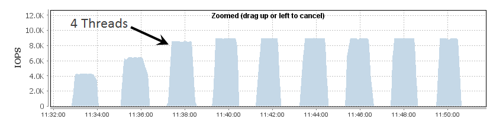
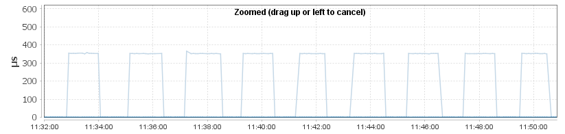
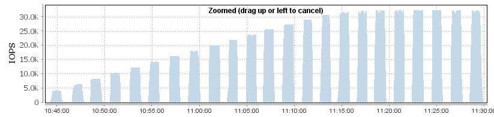

## 对云盘100万IOPS有什么误解吗? 可能要先从队列深度谈起               
          
### 作者            
digoal        
            
### 日期              
2024-12-23              
            
### 标签             
PostgreSQL , PolarDB , DuckDB , queue depth    
               
----              
             
## 背景                  
1、什么是硬性指标 ?   
  
物理极限. 例如:    
- RT: 0.128 ms    一般写了多少就是多少, 因为受限于光的传输速度、距离、寻址时经过的中间设备引入的延迟等.       
- 吞吐: 4GB/s     受限于连接存储的 HBA卡/网卡/支持nvme的card等 的带宽, 如果是虚拟化场景还受制于软件层面的资源控制.    
  
2、什么是推演指标?   
  
就是根据硬性指标和一些输入变量推算出来的. 例如   
- IOPS: 100万   根据前面的硬性指标 + 测试方法推算出来的.   
  
如果要测出100万的IOPS, 需要至少满足2个条件:    
- 单次IO请求的数据量最大只能是4K, 为什么呢? `吞吐4GB/100万 = 4K` , 超过4K就不可能测出100万IOPS, 因为会超过物理吞吐极限.    
- iodepth 不能低于128, 为什么呢? 一次请求下发给存储后, 等存储响应请求需要`RT=0.128 ms`, 那么如果只有1个并发在发送IO, 一秒最多发送`1000/0.128=7812.5次`请求, 要达到100万IOPS, 需要`1000000/7812.5=128`个并发 (iodepth / queue depth) .     
  
另外还需要考虑的是压测机操作系统层面的一些瓶颈, 例如需要绑定cpu, 使用多请求队列等. 关于如何压测出100万IOPS, 阿里云ESSD云盘有详细的压测说明:  
- https://help.aliyun.com/zh/ecs/user-guide/test-the-iops-performance-of-an-essd     
  
关于云存储多机挂载和nvme协议的介绍可参考阿里云文章:   
- https://help.aliyun.com/zh/ecs/user-guide/nvme-protocol  
- https://help.aliyun.com/zh/ecs/user-guide/enable-multi-attach  
  
队列深度的介绍可以参考如下文章, 后面是翻译     
- https://blog.docbert.org/queue-depth-iops-and-latency/     
  
更直白一点说, 队列深度就是IO层面的并发度.    
  
来个贴近应用的灵魂问题, 请问写一个文件, 可以达到100万IOPS吗?   
  
我觉得此时除了考虑上面提到的那些情况, 就该考虑应用设计了:    
- 同一个文件能并发写吗?   
- 同一个文件的一次IO请求大小是多少?   
  
换成数据库的应用场景呢? 怎么设计才能跑到存储的极限? 100万IOPS, 4GB/s带宽.  
- [《PostgreSQL 正在挤牙膏? 不, 它在云化》](../202412/20241223_01.md)     
  
  
### 队列深度及其相关概念  
  
队列深度，或者更具体地说，类似于“未完成 I/O 的数量”或“测试工具中使用的线程数量”，是性能测试中比较容易被误解的概念。  
  
无论其名称如何，这些概念指的是设备上能够同时存在的最大 I/O 数量——这个限制可能由测试软件、操作系统、HBA 或者这些因素的组合来控制。为了理解这个概念为何重要，首先我们需要理解 IOPS（每秒输入输出操作数）与延迟之间的关系。  
  
按照定义，每个“线程”代表一个单线程的 I/O 操作。在每个线程的级别上，新的 I/O 操作将不会开始，直到前一个 I/O 操作完成。这个行为明确展示了每个操作完成所需的时间（即延迟）与每单位时间能够完成的操作数量（即 IOPS）之间的关系。如果每个 I/O 操作需要 0.1 秒（100 毫秒），那么显然可以生成的最大 IOPS 数量为 10。如果每个 I/O 操作需要 0.02 秒（20 毫秒），那么就可以做到 50 IOPS。更一般地说，对于每个线程，我们最多可以生成 (1/L) IOPS，其中 L 是延迟（以秒为单位）。  
  
这种行为可以通过 vdbench 来演示。在以下的案例中，我将 vdbench 配置为生成“最大” IOPS，但只使用一个线程。一个 60 秒的运行结果显示：  
  
```  
Oct 26, 2015 interval i/o MB/sec bytes read resp read write resp resp queue cpu% cpu%  
rate 1024**2 i/o pct time resp resp max stddev depth sys+u sys  
10:22:28.060 avg_6-65 1782.98 13.93 8192 100.00 0.507 0.507 0.000 19.850 1.701 0.9 2.4 1.4  
```  
  
这显示了平均响应时间为 0.507 毫秒，或 0.000507 秒。根据上述数学公式，预期的 IOPS 数量为 1/0.000507，即 1972 IOPS。这比我们看到的略高，这部分是由于 vdbench 引入的额外开销（请注意，平均队列深度只有 0.9——在只配置 1 个线程的情况下，vdbench 似乎无法在任何时候保持 1 个 I/O 未完成）。  
  
使用 2 个线程配置相同的测试结果如下：  
  
```  
Oct 26, 2015 interval i/o MB/sec bytes read resp read write resp resp queue cpu% cpu%  
rate 1024**2 i/o pct time resp resp max stddev depth sys+u sys  
10:24:41.051 avg_6-65 4274.60 33.40 8192 100.00 0.460 0.460 0.000 22.917 0.111 2.0 4.1 2.5  
```  
  
在这种情况下，平均延迟为 0.460 毫秒，计算出每个线程的 IOPS 为 1/0.000460，即 2174 IOPS，每个线程总共约为 4348 IOPS。同样，这个结果比 vdbench 实际达到的结果略高，但这也归因于 vdbench 的开销。  
  
不出所料，随着线程数量的增加，性能会持续提升——3 个线程时为 6450 IOPS（0.459 毫秒延迟），4 个线程时为 8520 IOPS（0.463 毫秒延迟）。  
  
---  
  
### 超过 HBA 队列深度的影响  
HBA 通常指安装在服务器上用来连接SAN/光纤交换机的卡. 就像连接交换机设备需要用到网卡.      
    
像 vdbench 这样的工具允许你几乎不受限制地增加线程数和未完成 I/O 的数量，但当你继续增加时，最终会遇到另一个限制——**HBA 队列深度**。为了演示这一点，我将主机的 HBA 队列深度降低到 4，然后运行相同的 vdbench 测试，从 2 个线程增加到 10 个线程。结果显示在数组中：  
  
  
  
不出所料，随着线程数的增加，IOPS 数量也增加——但是当我们达到 4 个未完成的 I/O 时，性能会趋于平稳，这与 HBA 上配置的队列深度相匹配。一旦超过这个数量，vdbench 将继续尝试生成 I/O 请求，但这些请求将在主机级别排队。我们可以通过查看延迟来看到这一点——在阵列级别，延迟在所有测试中保持平稳：  
  
  
  
在 vdbench 的结果中，2 到 4 个线程的延迟是完全稳定的（分别为 0.462 毫秒，0.461 毫秒，0.463 毫秒），然而一旦达到 5 个线程，延迟开始增加——从 5 个线程的 0.554 毫秒上升到 10 个线程的 1.109 毫秒（6 个线程为 0.663 毫秒，7 个线程为 0.775 毫秒，8 个线程为 0.885 毫秒，9 个线程为 0.997 毫秒）。这正是当超过 HBA 队列深度时的典型表现——尽管阵列延迟保持平稳，但由于主机端的额外排队，主机测得的延迟会增加。  
  
---  
  
### 有效队列深度  
  
在大多数环境中，有效的队列深度——即对于单个 LUN 实际能够保持未完成的 I/O 数量——通常高于实际的 HBA 队列深度。这是因为使用了主机多路径（multipathing），即每个物理 LUN 都有多个路径。多路径在操作系统级别完成，因此从 HBA 的角度看，每个路径都是一个独立的 LUN，这意味着跨这些路径的未完成 I/O 数量是加总的。  
  
上述测试使用的是单一路径，因此有效队列深度与实际队列深度（即 4）相同。然而，使用的 LUN 实际上有 4 条路径：  
  
```  
3514f0c5e5cc00001 dm-7 XtremIO,XtremApp  
size=800G features='0' hwhandler='0' wp=rw  
`-+- policy='queue-length 0' prio=1 status=active  
  |- 4:0:11:1 sdd 8:48  active ready running  
  |- 4:0:12:1 sde 8:64  active ready running  
  |- 4:0:13:1 sdf 8:80  active ready running  
   - 4:0:14:1 sdg 8:96  active ready running  
```  
  
重新运行使用多路径设备（/dev/dm-7）的测试，结果会有所不同：  
  
  
  
在这种情况下，性能会继续提升，直到 16 个线程。这正是我们预期的行为，因为有效队列深度是实际队列深度（4）乘以路径数（4），这意味着在主机级排队开始之前，最多可以生成 16 个未完成的 I/O。  
  
---  
  
### 总结  
  
最终的结果是，LUN 拥有的路径越多，HBA 队列深度的重要性就越低。大多数 HBA 的默认队列深度约为 32，如果我们的存储能够维持 1 毫秒的响应时间（在应用程序级别测量），那么我们知道最多可以生成约 32,000 IOPS。如果只有 1 条路径到 LUN，那么最多只能实现这个 IOPS 数量。然而，如果 LUN 具有 4 条路径，那么它将能够处理超过 100,000 IOPS。  
  
当然，这也有其弊端：当有路径发生故障时，有效队列深度会下降。就像在路径/交换机等故障时要确保有足够的带宽一样，确保在发生故障时有足够的队列深度也同样重要。  
  
  
## 参考    
    
https://blog.docbert.org/queue-depth-iops-and-latency/    
    
https://help.aliyun.com/zh/ecs/user-guide/test-the-iops-performance-of-an-essd     
    
https://www.oracle.com/downloads/server-storage/vdbench-downloads.html  
  
https://fio.readthedocs.io/en/latest/fio_doc.html  
  
blktrace   
   
  
#### [期望 PostgreSQL|开源PolarDB 增加什么功能?](https://github.com/digoal/blog/issues/76 "269ac3d1c492e938c0191101c7238216")
  
  
#### [PolarDB 开源数据库](https://openpolardb.com/home "57258f76c37864c6e6d23383d05714ea")
  
  
#### [PolarDB 学习图谱](https://www.aliyun.com/database/openpolardb/activity "8642f60e04ed0c814bf9cb9677976bd4")
  
  
#### [PostgreSQL 解决方案集合](../201706/20170601_02.md "40cff096e9ed7122c512b35d8561d9c8")
  
  
#### [德哥 / digoal's Github - 公益是一辈子的事.](https://github.com/digoal/blog/blob/master/README.md "22709685feb7cab07d30f30387f0a9ae")
  
  
#### [About 德哥](https://github.com/digoal/blog/blob/master/me/readme.md "a37735981e7704886ffd590565582dd0")
  
  

  
