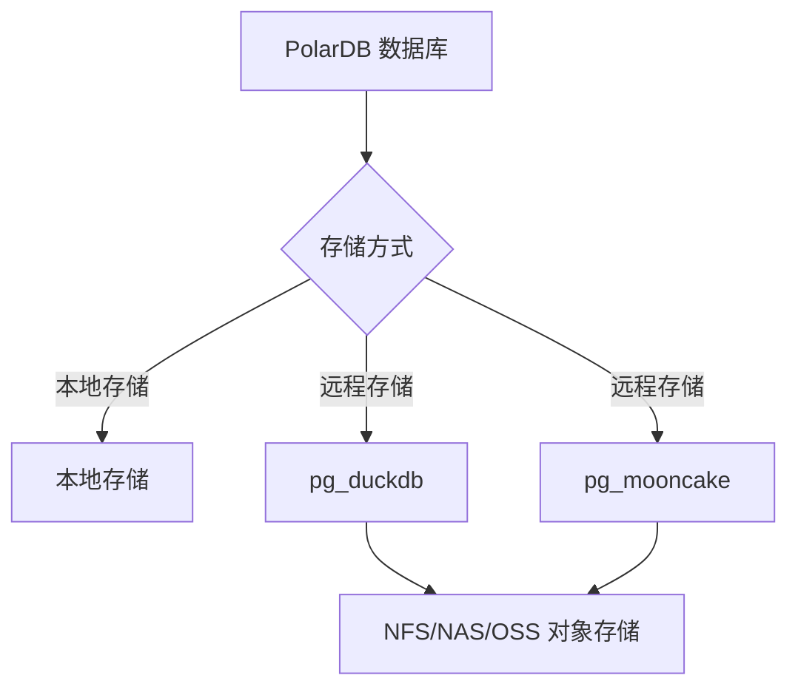

## 穷鬼玩PolarDB RAC一写多读集群系列 | 接入pg_duckdb & pgmooncake支持数据湖功能,且OLAP性能数量级提升  
      
### 作者      
digoal      
      
### 日期      
2024-12-31      
      
### 标签      
PostgreSQL , PolarDB , DuckDB , Docker , pg_duckdb , 数据湖 , pgmooncake      
      
----      
      
## 背景      
穷鬼玩PolarDB RAC一写多读集群系列已经写了几篇:      
- [《在Docker容器中用loop设备模拟共享存储》](../202412/20241216_03.md)      
- [《如何搭建PolarDB容灾(Standby)节点》](../202412/20241218_01.md)      
- [《共享存储在线扩容》](../202412/20241218_02.md)      
- [《计算节点 Switchover》](../202412/20241218_03.md)      
- [《在线备份》](../202412/20241218_04.md)      
- [《在线归档》](../202412/20241218_05.md)      
- [《实时归档》](../202412/20241219_01.md)      
- [《时间点恢复(PITR)》](../202412/20241219_02.md)      
- [《读写分离》](../202412/20241220_01.md)      
- [《主机全毁, 只剩共享存储的PolarDB还有救吗?》](../202412/20241224_01.md)      
- [《激活容灾(Standby)节点》](../202412/20241224_02.md)      
- [《将“共享存储实例”转换为“本地存储实例”》](../202412/20241224_03.md)      
- [《将“本地存储实例”转换为“共享存储实例”》](../202412/20241224_04.md)      
- [《升级vector插件》](../202412/20241224_05.md)      
- [《使用图数据库插件AGE》](../202412/20241227_01.md)      
- [《接入私有化大模型服务》](../202412/20241230_02.md)      
- [《接入PostGIS插件全功能》](../202412/20241231_01.md)      
      
本篇文章介绍一下如何在PolarDB数据库中接入pg_duckdb支持数据湖功能? 且OLAP性能数量级提升. 实验环境依赖 [《在Docker容器中用loop设备模拟共享存储》](../202412/20241216_03.md) , 如果没有环境, 请自行参考以上文章搭建环境.      
   
pg_duckdb 和 pg_mooncake 都依赖duckdb, 依赖的duckdb版本不同时可能导致冲突.    
- https://github.com/Mooncake-Labs/pg_mooncake/issues/7   
    

   
[b站视频链接](https://www.bilibili.com/video/BV1UMAaeBEUm/)  
  
[Youtube视频链接](https://www.youtube.com/watch?v=Ims_W3RCh1E)  
     
# pg_duckdb      
安装插件时, 需要在PolarDB集群的所有机器上都进行安装, 顺序建议先PolarDB Standby, 然后是所有的RO节点, 然后是RW节点.  ( 将二进制安装在共享目录中, 软链使用时, 仅需安装一次即可. )          
    
创建插件`create extension xxx;`则仅需在RW节点执行.     
    
配置插件参数`例如 postgresql.conf 里面的 xxx.xxx=xxx`也需要在PolarDB集群的所有机器上都进行安装, 顺序建议先PolarDB Standby, 然后是所有的RO节点, 然后是RW节点.     
    
下面仅演示安装插件.     
  
1、安装pg_duckdb插件 ( 截止20250214最新版本为`v0.3.1`, 支持duckdb最新版本`v1.2.0` )   
```  
cd /data  
git clone --depth 1 -b v0.3.1 https://github.com/duckdb/pg_duckdb  
cd pg_duckdb/third_party  
git clone --depth 1 -b v1.2.0 https://github.com/duckdb/duckdb  
cd /data/pg_duckdb  
sudo apt-get install -y ninja-build  
USE_PGXS=1 make install  
```  
  
2、配置 shared_preload_libraries    
```    
# 查询 shared_preload_libraries 当前配置      
$ psql  
psql (PostgreSQL 15.10 (PolarDB 15.10.2.0 build d4f5477d debug) on aarch64-linux-gnu)  
Type "help" for help.  
  
postgres=# show shared_preload_libraries ;   
        shared_preload_libraries          
----------------------------------------  
 $libdir/polar_vfs,$libdir/polar_worker  
(1 row)  
```    
    
配置 shared_preload_libraries    
```  
# 依次在对应容器中修改standby,ro,rw节点   
  
echo "  
shared_preload_libraries = '\$libdir/polar_vfs,\$libdir/polar_worker,\$libdir/pg_duckdb'  
" >> ~/standby/postgresql.conf    
  
echo "  
shared_preload_libraries = '\$libdir/polar_vfs,\$libdir/polar_worker,\$libdir/pg_duckdb'  
" >> ~/replica1/postgresql.conf    
  
echo "  
shared_preload_libraries = '\$libdir/polar_vfs,\$libdir/polar_worker,\$libdir/pg_duckdb'  
" >> ~/primary/postgresql.conf    
```    
    
3、重启PolarDB数据库      
```  
# 依次在对应容器中重启standby,ro,rw节点  
  
pg_ctl restart -m fast -D ~/standby  
  
pg_ctl restart -m fast -D ~/replica1  
  
pg_ctl restart -m fast -D ~/primary  
```    
    
4、在RW中创建pg_duckdb插件    
```    
$ psql  
psql (PostgreSQL 15.10 (PolarDB 15.10.2.0 build d4f5477d debug) on aarch64-linux-gnu)  
Type "help" for help.  
  
postgres=# create extension pg_duckdb ;   
CREATE EXTENSION  
    
postgres=# show duckdb.    
duckdb.allow_community_extensions                                duckdb.force_execution                                           duckdb.motherduck_enabled
duckdb.allow_unsigned_extensions                                 duckdb.max_memory                                                duckdb.motherduck_postgres_database
duckdb.autoinstall_known_extensions                              duckdb.max_workers_per_postgres_scan                             duckdb.motherduck_token
duckdb.autoload_known_extensions                                 duckdb.memory_limit                                              duckdb.postgres_role
duckdb.disabled_filesystems                                      duckdb.motherduck_background_catalog_refresh_inactivity_timeout  duckdb.threads
duckdb.enable_external_access                                    duckdb.motherduck_default_database                               duckdb.worker_threads
```    
    
5、创建duckdb临时表(目前pg_duckdb 还是要带货motherduck云服务的.  不过代码都开源了, 未来支持本地存储持久化duckdb表应该也不是问题.)    
```    
postgres=# create table t(id int, c1 int, c2 float8, c3 text, c4 timestamp) using duckdb;    
ERROR:  Only TEMP tables are supported in DuckDB if MotherDuck support is not enabled    
    
    
postgres=# create temp table t(id int, c1 int, c2 float8, c3 text, c4 timestamp) using duckdb;    
CREATE TABLE    
```    
    
插入1000万数据    
```    
postgres=# insert into t select id::int,random()*100, random()*1000,md5(random()::text),now() from generate_series(1,10000000) t(id);    
    
    
postgres=# \d+ t    
                                                    Table "pg_temp_14.t"    
 Column |            Type             | Collation | Nullable | Default | Storage  | Compression | Stats target | Description     
--------+-----------------------------+-----------+----------+---------+----------+-------------+--------------+-------------    
 id     | integer                     |           |          |         | plain    |             |              |     
 c1     | integer                     |           |          |         | plain    |             |              |     
 c2     | double precision            |           |          |         | plain    |             |              |     
 c3     | text                        |           |          |         | extended |             |              |     
 c4     | timestamp without time zone |           |          |         | plain    |             |              |     
Access method: duckdb    
```    
    
简单的测试一下耗时    
```    
postgres=# \timing    
Timing is on.    
postgres=# select count(*) from t;    
  count       
----------    
 10000000    
(1 row)    
    
Time: 8.246 ms    
postgres=# select count(distinct id) from t;    
  count       
----------    
 10000000    
(1 row)    
    
Time: 224.928 ms

postgres=# explain verbose select count(distinct id) from t;    
                          QUERY PLAN                          
--------------------------------------------------------------
 Custom Scan (DuckDBScan)  (cost=0.00..0.00 rows=0 width=0)
   Output: duckdb_scan.explain_key, duckdb_scan.explain_value
   DuckDB Execution Plan: 
 
 ┌───────────────────────────┐
 │    UNGROUPED_AGGREGATE    │
 │    ────────────────────   │
 │        Aggregates:        │
 │     count(DISTINCT #0)    │
 └─────────────┬─────────────┘
 ┌─────────────┴─────────────┐
 │         PROJECTION        │
 │    ────────────────────   │
 │             id            │
 │                           │
 │       ~10000000 Rows      │
 └─────────────┬─────────────┘
 ┌─────────────┴─────────────┐
 │         SEQ_SCAN          │
 │    ────────────────────   │
 │          Table: t         │
 │   Type: Sequential Scan   │
 │      Projections: id      │
 │                           │
 │       ~10000000 Rows      │
 └───────────────────────────┘
 
 
(28 rows)

Time: 10.283 ms
```    
    
6、简单对比PostgreSQL本地表    
    
更复杂的对比可以参考:       
- [《PG被DuckDB碾压,该反省哪些方面? DuckDB v0.10.3 在Macmini 2023款上的tpch性能表现如何? PostgreSQL使用duckdb_fdw 的tpch加速性能表现如何?》](../202405/20240525_01.md)      
    
创建本地表    
```    
postgres=# set polar_force_unlogged_to_logged_table=off;  
postgres=# create unlogged table t_pg (like t);    
CREATE TABLE    
Time: 40.752 ms    
postgres=# \d+ t_pg    
                                                     Table "public.t_pg"    
 Column |            Type             | Collation | Nullable | Default | Storage  | Compression | Stats target | Description     
--------+-----------------------------+-----------+----------+---------+----------+-------------+--------------+-------------    
 id     | integer                     |           |          |         | plain    |             |              |     
 c1     | integer                     |           |          |         | plain    |             |              |     
 c2     | double precision            |           |          |         | plain    |             |              |     
 c3     | text                        |           |          |         | extended |             |              |     
 c4     | timestamp without time zone |           |          |         | plain    |             |              |     
Access method: heap    
```    
    
目前不支持从duckdb写入本地表, 未来可能会支持?     
```    
postgres=# insert into t_pg select * from t;    
ERROR:  DuckDB does not support modififying Postgres tables    
Time: 1.887 ms    
```    
    
写入1000万数据    
```    
postgres=# insert into t_pg select id::int,random()*100, random()*1000,md5(random()::text),now() from generate_series(1,10000000) t(id);    
INSERT 0 10000000    
postgres=# vacuum analyze t_pg;   
```    
    
本地表相比duckdb还是有很大差距的, 20倍以上吧. PolarDB的性能还取决于`shared_buffer和work_mem`, `hash_mem_multiplier`, `parallel...`等相关参数的配置.       
```    
postgres=# select count(*) from t_pg;    
  count       
----------    
 10000000    
(1 row)    
    
Time: 303.805 ms    
  
postgres=# select count(distinct id) from t_pg;    
  count       
----------    
 10000000    
(1 row)    
    
Time: 4685.524 ms (00:04.686)

postgres=# explain verbose select count(distinct id) from t_pg;    
                                   QUERY PLAN                                    
---------------------------------------------------------------------------------
 Aggregate  (cost=251481.60..251481.61 rows=1 width=8)
   Output: count(DISTINCT id)
   ->  Seq Scan on public.t_pg  (cost=0.00..223918.08 rows=11025408 width=4)
         Output: id, c1, c2, c3, c4
 JIT:
   Functions: 3
   Options: Inlining false, Optimization false, Expressions true, Deforming true
(7 rows)

Time: 8.926 ms
```
  
7、本地表JOIN duckdb temp table  
```
postgres=# explain verbose select count(distinct t.id) from t join t_pg on (t.id=t_pg.id);
                          QUERY PLAN                          
--------------------------------------------------------------
 Custom Scan (DuckDBScan)  (cost=0.00..0.00 rows=0 width=0)
   Output: duckdb_scan.explain_key, duckdb_scan.explain_value
   DuckDB Execution Plan: 
 
 ┌───────────────────────────┐
 │    UNGROUPED_AGGREGATE    │
 │    ────────────────────   │
 │        Aggregates:        │
 │     count(DISTINCT #0)    │
 └─────────────┬─────────────┘
 ┌─────────────┴─────────────┐
 │         PROJECTION        │
 │    ────────────────────   │
 │             id            │
 │                           │
 │       ~11025408 Rows      │
 └─────────────┬─────────────┘
 ┌─────────────┴─────────────┐
 │         HASH_JOIN         │
 │    ────────────────────   │
 │      Join Type: INNER     │
 │    Conditions: id = id    ├──────────────┐
 │                           │              │
 │       ~11025408 Rows      │              │
 └─────────────┬─────────────┘              │
 ┌─────────────┴─────────────┐┌─────────────┴─────────────┐
 │       POSTGRES_SCAN       ││         SEQ_SCAN          │
 │    ────────────────────   ││    ────────────────────   │
 │        Table: t_pg        ││          Table: t         │
 │      Projections: id      ││   Type: Sequential Scan   │
 │                           ││      Projections: id      │
 │                           ││                           │
 │       ~11025408 Rows      ││       ~10000000 Rows      │
 └───────────────────────────┘└───────────────────────────┘
 
 
(36 rows)

Time: 13.930 ms


postgres=# select count(distinct t.id) from t join t_pg on (t.id=t_pg.id);
  count   
----------
 10000000
(1 row)

Time: 83322.344 ms (01:23.322)
```
    
## oss + pg_duckdb     
DuckDB的优势除了AP性能强, 另外就是对接对象存储非常方便, 容易实现数据湖架构, 共享多个实例的数据、冷热分离存储等.    
    
pg_duckdb手册中的例子    
```    
-- Session Token is Optional    
INSERT INTO duckdb.secrets    
(type, key_id, secret, session_token, region)    
VALUES ('S3', 'access_key_id', 'secret_access_key', 'session_token', 'us-east-1');       
    
    
COPY (SELECT user_id, item_id, price, purchased_at FROM purchases)    
TO 's3://your-bucket/purchases.parquet;    
    
    
SELECT SUM(price) AS total, item_id    
FROM read_parquet('s3://your-bucket/purchases.parquet')    
  AS (price float, item_id int)    
GROUP BY item_id    
ORDER BY total DESC    
LIMIT 100;    
```    
    
使用阿里云OSS的配置例子, duckdb secret语法:       
```sql      
D CREATE SECRET my_secret (      
      TYPE S3,      
      KEY_ID 'xxx',      
      SECRET 'xxx',      
      endpoint 's3.oss-cn-shanghai.aliyuncs.com'      
  );      
┌─────────┐      
│ Success │      
│ boolean │      
├─────────┤      
│ true    │      
└─────────┘      
      
D create table a(id int, info text);        
D insert into a select range, md5(random()::text) from range(1,1000000);      
D copy a to 's3://otpawu20240715105432/a.parquet';     
```  
     
session token: https://help.aliyun.com/zh/oss/developer-reference/use-temporary-access-credentials-provided-by-sts-to-access-oss     
  
    
除了使用PolarDB Table Access Method接口来获得DuckDB的能力, PolarDB PG v15 还能通过plpython, duckdb_fdw插件来获得DuckDB的能力, 请参考如下文章:    
- [《性能爽翻了, 在PolarDB plpython中使用DuckDB》](../202411/20241125_02.md)    
- [《PG被DuckDB碾压,该反省哪些方面? DuckDB v0.10.3 在Macmini 2023款上的tpch性能表现如何? PostgreSQL使用duckdb_fdw 的tpch加速性能表现如何?》](../202405/20240525_01.md)    
- [《PolarDB-PG | PostgreSQL + duckdb_fdw + 阿里云OSS 实现高效低价的海量数据冷热存储分离》](../202303/20230308_01.md)    
- [《PolarDB 开源版通过 duckdb_fdw 支持 parquet 列存数据文件以及高效OLAP / TPCH》](../202212/20221209_02.md)    
- [《用duckdb_fdw加速PostgreSQL分析计算, 提速40倍, 真香.》](../202209/20220924_01.md)    
  
# pg_mooncake  
pg_duckdb 在PolarDB/PostgreSQL中只能建临时表, 略显小气, 不过使用pg_mooncake可以避免这个问题.    
```  
Only TEMP tables are supported in DuckDB if MotherDuck support is not enabled  
```  
  
截止20250214 pg_mooncake最新版本为0.1.2, 已经好用到爆, 后续的版本还将推出几个非常值得期待的特性, 让pg_mooncake列存储表更容易适配更多工作负载:   
  
https://www.mooncake.dev/blog/pgmooncake-v02discussion  
  
1、列存储表的完整Postgres表访问方法（TAM）   
  
目前所有列存储查询都通过DuckDB执行。虽然这保证了性能，但意味着无法使用Postgres的某些特性，例如数据修改型CTE（如删除行、返回结果并插入到其他表）和触发器。  
  
在v0.2版本中，我们将通过完整的Postgres表访问方法暴露列存储表，允许Postgres直接读写。DuckDB仍将作为快速执行引擎，但在需要时会无缝回退到Postgres执行。  
  
在查询计划阶段，DuckDB将继续作为高效执行引擎，我们会尽可能将计算下推给它执行。无法通过DuckDB执行的算子将回退到Postgres处理。  
  
2、逻辑复制到列存储表     
  
用户通常在现有Postgres表遇到慢查询时采用pg_mooncake。通过逻辑复制功能，我们可以更轻松地加速分析查询——只需将数据从堆表复制到列存储表，无需复杂写入模式。  
  
Postgres原生的逻辑复制接收器主要通过调用table_insert和table_insert_multi等高级函数实现，这些功能已通过我们的完整表访问方法（TAM）支持。初期阶段，pg_mooncake的逻辑复制将支持仅追加型工作负载。  
  
该功能显著提升了pg_mooncake的部署灵活性，无论您的Postgres实例部署在何处。您可以在现有Postgres部署旁运行pg_mooncake，并将数据无缝从堆表复制到列存储表。  
  
感觉特别合适时序表(物联网、应用日志、金融行业数据等), 这些表可以自动转换为列存表, 加速此类表的查询.     
  
3、小批量插入的行存储缓冲区    
  
逻辑复制带来一个挑战：如何在不为每个事务生成新Parquet文件和Delta Lake日志的情况下处理频繁的小批量插入？  
  
v0.2版本中，小批量插入会暂存到行存储表，而大批量插入则直接写入Parquet文件。查询列存储表时，Postgres会同时扫描行存储和Parquet文件。当行存储数据达到阈值后，将批量刷写到Parquet。这种方法还将Parquet写入与事务解耦，显著降低写放大。  
  
这是关键性突破，使得列存储表无需批量插入即可作为主存储方案——特别适用于日志记录和时间序列型工作负载。  
  
## DEMO  
<b> 冲突问题 , 不能同时使用pg_duckdb v0.3.1 和 pg_mooncake v0.1.2 </b>  
   
在进行测试之前, 先保存一下 `tmp_polardb_pg_15_base/lib/postgresql/libduckdb.so` , 因pg_mooncake接下来依赖的duckdb版本和前面pg_duckdb依赖的版本不同. 并且把pg_duckdb preload去掉.   
```
# 禁用pg_duckdb

# 备份pg_duckdb依赖的 libduckdb.so  
cd ~/tmp_polardb_pg_15_base/lib/postgresql 
mv libduckdb.so bak_pg_duckdb_libduckdb.so  
 
# RW , RO , standby  
vi postgresql.conf
# shared_preload_libraries = '$libdir/polar_vfs,$libdir/polar_worker,$libdir/pg_duckdb'   

# 重启 polardb
```
   
安装pg_mooncake   
```  
cd /data  
git clone --depth 1 -b v0.1.2 https://github.com/Mooncake-Labs/pg_mooncake      
  
cd pg_mooncake/third_party      
git clone --depth 1 -b v1.1.3 https://github.com/duckdb/duckdb      
  
cd ..    
curl --proto '=https' --tlsv1.2 -sSf https://sh.rustup.rs | sh    
. "$HOME/.cargo/env"    
  
make release -j$(nproc)    
make install    
```  
  
创建插件  
```  
CREATE EXTENSION pg_mooncake;    
    
    
postgres=# \dA+  
                               List of access methods  
    Name     | Type  |       Handler        |              Description                 
-------------+-------+----------------------+----------------------------------------  
 brin        | Index | brinhandler          | block range index (BRIN) access method  
 btree       | Index | bthandler            | b-tree index access method  
 columnstore | Table | columnstore_handler  |   
 gin         | Index | ginhandler           | GIN index access method  
 gist        | Index | gisthandler          | GiST index access method  
 hash        | Index | hashhandler          | hash index access method  
 heap        | Table | heap_tableam_handler | heap table access method  
 spgist      | Index | spghandler           | SP-GiST index access method  
(8 rows)  
```  
  
创建列存表  
```  
CREATE TABLE user_activity(    
  user_id BIGINT,    
  activity_type TEXT,    
  activity_timestamp TIMESTAMP,    
  duration INT    
) USING columnstore;    
```  
  
写入数据  
```  
INSERT INTO user_activity VALUES    
  (1, 'login', '2024-01-01 08:00:00', 120),    
  (2, 'page_view', '2024-01-01 08:05:00', 30),    
  (3, 'logout', '2024-01-01 08:30:00', 60),    
  (4, 'error', '2024-01-01 08:13:00', 60);    
```  
  
查询  
```  
SELECT * from user_activity;  
```  
  
执行计划  
```  
postgres=# explain (verbose) select * from user_activity where user_id=1;  
                             QUERY PLAN                               
--------------------------------------------------------------------  
 Custom Scan (MooncakeDuckDBScan)  (cost=0.00..0.00 rows=0 width=0)  
   Output: duckdb_scan.explain_key, duckdb_scan.explain_value  
   DuckDB Execution Plan:   
   
 ┌───────────────────────────┐  
 │     COLUMNSTORE_SCAN      │  
 │    ────────────────────   │  
 │         Function:         │  
 │      COLUMNSTORE_SCAN     │  
 │                           │  
 │        Projections:       │  
 │          user_id          │  
 │       activity_type       │  
 │     activity_timestamp    │  
 │          duration         │  
 │                           │  
 │          Filters:         │  
 │  user_id=1 AND user_id IS │  
 │          NOT NULL         │  
 │                           │  
 │          ~1 Rows          │  
 └───────────────────────────┘  
```  
   
列存文件位置  
```  
postgres=# SELECT * FROM mooncake.columnstore_tables;  
  table_name   |                                        path                                           
---------------+-------------------------------------------------------------------------------------  
 user_activity | /home/postgres/primary/mooncake_local_tables/mooncake_postgres_user_activity_57420/  
(1 row)  
  
  
$ ll /home/postgres/primary/mooncake_local_tables/mooncake_postgres_user_activity_57420/  
total 16  
drwx------ 3 postgres postgres 4096 Feb 14 11:24 ./  
drwx------ 4 postgres postgres 4096 Feb 14 11:23 ../  
-rw------- 1 postgres postgres  696 Feb 14 11:24 c8d6bea5-f905-4913-8e8d-673e4ef00589.parquet  
drwx------ 2 postgres postgres 4096 Feb 14 11:24 _delta_log/  
```  
  
pg_mooncake, pg_duckdb这类插件最常见的存储是对象存储, 实现数据湖架构.     
  
### 共享 NAS / NFS    
使用PolarDB时, 为了让RW和RO节点都可以访问列存表, 我们可以考虑把mooncake的本地存储目录放到NAS或NFS中, 然后使用软链, 那么从RW写入的parquet文件, 在RO节点都可以查询.    
  
查看RW节点本地实例数据目录 `$PGDATA/` 即 `~/primary` 可以看到以下几个pg_mooncake相关目录:     
```  
mooncake_local_cache  
mooncake_local_tables  
duckdb_extensions  
```  
  
目前这几个目录不能配置路径, 所以使用软链来实现, 给mooncake提了一个issue, 希望未来通过guc可以配置这些路径.  
- https://github.com/Mooncake-Labs/pg_mooncake/issues/120  
  
  
停止PolarDB RW和RO节点  
```  
pg_ctl stop -m fast -D ~/primary/  
pg_ctl stop -m fast -D ~/replica1/  
```  
  
在RW节点把这些目录移动到宿主机共享给容器的目录中  
```  
mkdir /data/pgmooncake_local_data  
mv ~/primary/mooncake_local_cache /data/pgmooncake_local_data  
mv ~/primary/mooncake_local_tables /data/pgmooncake_local_data  
mv ~/primary/duckdb_extensions /data/pgmooncake_local_data  
  
# 建立软链  
ln -s /data/pgmooncake_local_data/mooncake_local_cache ~/primary/  
ln -s /data/pgmooncake_local_data/mooncake_local_tables ~/primary/  
ln -s /data/pgmooncake_local_data/duckdb_extensions ~/primary/  
```  
  
  
在RO节点建立软链  
```  
mkdir ~/primary  
ln -s /data/pgmooncake_local_data/mooncake_local_cache ~/primary/  
ln -s /data/pgmooncake_local_data/mooncake_local_tables ~/primary/  
ln -s /data/pgmooncake_local_data/duckdb_extensions ~/primary/  
```  
  
启动PolarDB RW和RO节点  
```  
pg_ctl start -D ~/primary/  
pg_ctl start -D ~/replica1/  
```  
  
在RW节点多弄点数据进去  
```  
$ psql  
psql (PostgreSQL 15.10 (PolarDB 15.10.3.0 build bbc102d8 debug) on aarch64-linux-gnu)  
Type "help" for help.  
  
postgres=# insert into user_activity select * from user_activity ;  
WARNING:  `/home/postgres/primary/duckdb_extensions` is not directory.  
INSERT 0 4  
postgres=# insert into user_activity select * from user_activity ;  
INSERT 0 8  
postgres=# insert into user_activity select * from user_activity ;  
INSERT 0 16  
postgres=# insert into user_activity select * from user_activity ;  
INSERT 0 32  
postgres=# insert into user_activity select * from user_activity ;  
INSERT 0 64  
postgres=# insert into user_activity select * from user_activity ;  
INSERT 0 128  
postgres=# insert into user_activity select * from user_activity ;  
INSERT 0 256  
postgres=# insert into user_activity select * from user_activity ;  
INSERT 0 512  
postgres=# insert into user_activity select * from user_activity ;  
INSERT 0 1024  
postgres=# insert into user_activity select * from user_activity ;  
INSERT 0 2048  
postgres=# insert into user_activity select * from user_activity ;  
INSERT 0 4096  
postgres=# insert into user_activity select * from user_activity ;  
INSERT 0 8192  
postgres=# insert into user_activity select * from user_activity ;  
INSERT 0 16384  
postgres=# insert into user_activity select * from user_activity ;  
INSERT 0 32768  
postgres=# insert into user_activity select * from user_activity ;  
INSERT 0 65536  
postgres=# insert into user_activity select * from user_activity ;  
INSERT 0 131072  
postgres=# insert into user_activity select * from user_activity ;  
INSERT 0 262144  
postgres=# insert into user_activity select * from user_activity ;  
INSERT 0 524288  
postgres=# insert into user_activity select * from user_activity ;  
INSERT 0 1048576  
postgres=# insert into user_activity select * from user_activity ;  
INSERT 0 2097152  
postgres=# insert into user_activity select * from user_activity ;  
INSERT 0 4194304  
postgres=# insert into user_activity select * from user_activity ;  
INSERT 0 8388608  
postgres=# insert into user_activity select * from user_activity ;  
INSERT 0 16777216  
postgres=# \timing  
Timing is on.  
postgres=# insert into user_activity select * from user_activity ;  
INSERT 0 67108864  
Time: 6584.372 ms (00:06.584)  
```  
  
体验速度  
```  
postgres=# select count(*) from user_activity ;  
   count     
-----------  
 134217728  
(1 row)  
  
Time: 123.214 ms  
postgres=# explain (verbose) select count(*) from user_activity ;  
                             QUERY PLAN                               
--------------------------------------------------------------------  
 Custom Scan (MooncakeDuckDBScan)  (cost=0.00..0.00 rows=0 width=0)  
   Output: duckdb_scan.explain_key, duckdb_scan.explain_value  
   DuckDB Execution Plan:   
   
 ┌───────────────────────────┐  
 │    UNGROUPED_AGGREGATE    │  
 │    ────────────────────   │  
 │        Aggregates:        │  
 │        count_star()       │  
 └─────────────┬─────────────┘  
 ┌─────────────┴─────────────┐  
 │     COLUMNSTORE_SCAN      │  
 │    ────────────────────   │  
 │         Function:         │  
 │      COLUMNSTORE_SCAN     │  
 │                           │  
 │         ~104 Rows         │  
 └───────────────────────────┘  
   
   
(20 rows)  
  
Time: 15.596 ms  
```  
  
  
在RO节点也可以查询该列存表  
```  
$ psql  
psql (PostgreSQL 15.10 (PolarDB 15.10.3.0 build bbc102d8 debug) on aarch64-linux-gnu)  
Type "help" for help.  
  
postgres=# explain (verbose) select count(*) from user_activity ;  
                             QUERY PLAN                               
--------------------------------------------------------------------  
 Custom Scan (MooncakeDuckDBScan)  (cost=0.00..0.00 rows=0 width=0)  
   Output: duckdb_scan.explain_key, duckdb_scan.explain_value  
   DuckDB Execution Plan:   
   
 ┌───────────────────────────┐  
 │    UNGROUPED_AGGREGATE    │  
 │    ────────────────────   │  
 │        Aggregates:        │  
 │        count_star()       │  
 └─────────────┬─────────────┘  
 ┌─────────────┴─────────────┐  
 │     COLUMNSTORE_SCAN      │  
 │    ────────────────────   │  
 │         Function:         │  
 │      COLUMNSTORE_SCAN     │  
 │                           │  
 │         ~104 Rows         │  
 └───────────────────────────┘  
   
   
(20 rows)  
  
postgres=# \timing  
Timing is on.  
postgres=# select count(*) from user_activity ;  
   count     
-----------  
 134217728  
(1 row)  
  
Time: 124.732 ms  
postgres=# select count(distinct user_id) from user_activity ;  
 count   
-------  
     4  
(1 row)  
  
Time: 460.696 ms  
postgres=# explain verbose select count(distinct user_id) from user_activity ;  
                             QUERY PLAN                               
--------------------------------------------------------------------  
 Custom Scan (MooncakeDuckDBScan)  (cost=0.00..0.00 rows=0 width=0)  
   Output: duckdb_scan.explain_key, duckdb_scan.explain_value  
   DuckDB Execution Plan:   
   
 ┌───────────────────────────┐  
 │    UNGROUPED_AGGREGATE    │  
 │    ────────────────────   │  
 │        Aggregates:        │  
 │     count(DISTINCT #0)    │  
 └─────────────┬─────────────┘  
 ┌─────────────┴─────────────┐  
 │         PROJECTION        │  
 │    ────────────────────   │  
 │          user_id          │  
 │                           │  
 │         ~104 Rows         │  
 └─────────────┬─────────────┘  
 ┌─────────────┴─────────────┐  
 │     COLUMNSTORE_SCAN      │  
 │    ────────────────────   │  
 │         Function:         │  
 │      COLUMNSTORE_SCAN     │  
 │                           │  
 │    Projections: user_id   │  
 │                           │  
 │         ~104 Rows         │  
 └───────────────────────────┘  
   
   
(29 rows)  
  
Time: 11.540 ms  
```  
  
  
本地表和列存表的JOIN  
```  
postgres=# create table localtbl(id int8, info text);  
CREATE TABLE  
postgres=# insert into localtbl select generate_series(1,1000), md5(random()::text);  
INSERT 0 1000  
  
postgres=# explain select count(distinct t2.user_id) from localtbl t1 join user_activity t2 on (t1.id=t2.user_id);  
                             QUERY PLAN                               
--------------------------------------------------------------------  
 Custom Scan (MooncakeDuckDBScan)  (cost=0.00..0.00 rows=0 width=0)  
   DuckDB Execution Plan:   
   
 ┌───────────────────────────┐  
 │    UNGROUPED_AGGREGATE    │  
 │    ────────────────────   │  
 │        Aggregates:        │  
 │     count(DISTINCT #0)    │  
 └─────────────┬─────────────┘  
 ┌─────────────┴─────────────┐  
 │         PROJECTION        │  
 │    ────────────────────   │  
 │          user_id          │  
 │                           │  
 │         ~1000 Rows        │  
 └─────────────┬─────────────┘  
 ┌─────────────┴─────────────┐  
 │         HASH_JOIN         │  
 │    ────────────────────   │  
 │      Join Type: INNER     │  
 │                           │  
 │        Conditions:        ├──────────────┐  
 │        id = user_id       │              │  
 │                           │              │  
 │         ~1000 Rows        │              │  
 └─────────────┬─────────────┘              │  
 ┌─────────────┴─────────────┐┌─────────────┴─────────────┐  
 │     POSTGRES_SEQ_SCAN     ││     COLUMNSTORE_SCAN      │  
 │    ────────────────────   ││    ────────────────────   │  
 │         Function:         ││         Function:         │  
 │     POSTGRES_SEQ_SCAN     ││      COLUMNSTORE_SCAN     │  
 │                           ││                           │  
 │      Projections: id      ││    Projections: user_id   │  
 │                           ││                           │  
 │         ~1000 Rows        ││         ~104 Rows         │  
 └───────────────────────────┘└───────────────────────────┘  
   
   
(38 rows)  
  
Time: 25.376 ms  
  
  
postgres=# select count(distinct t2.user_id) from localtbl t1 join user_activity t2 on (t1.id=t2.user_id);  
 count   
-------  
     4  
(1 row)  
  
Time: 95722.228 ms (01:35.722)  
```  
  
parquet和polardb本地表JOIN还有优化空间.       
   
但是 mooncake tbl1 join mooncake tbl2 , 也很慢, 是怎么回事? 发了issue给pg_mooncake后已得到快速的回复, 报给duckdb优化器的评估行数不准, 导致使用了大表作为hashtable. 感谢pg_mooncake开源项目, 应该会很快解决.   issue: https://github.com/Mooncake-Labs/pg_mooncake/issues/124    
```
create table moontbl(id int8, info text) USING columnstore ;
insert into  moontbl select x, md5(random()::text) from generate_series(1,1000) x; 
explain verbose select count(distinct t2.user_id) from moontbl t1 join user_activity t2 on (t1.id=t2.user_id);
                             QUERY PLAN                             
--------------------------------------------------------------------
 Custom Scan (MooncakeDuckDBScan)  (cost=0.00..0.00 rows=0 width=0)
   Output: duckdb_scan.explain_key, duckdb_scan.explain_value
   DuckDB Execution Plan: 
 
 ┌───────────────────────────┐
 │    UNGROUPED_AGGREGATE    │
 │    ────────────────────   │
 │        Aggregates:        │
 │     count(DISTINCT #0)    │
 └─────────────┬─────────────┘
 ┌─────────────┴─────────────┐
 │         PROJECTION        │
 │    ────────────────────   │
 │          user_id          │
 │                           │
 │         ~1000 Rows        │
 └─────────────┬─────────────┘
 ┌─────────────┴─────────────┐
 │         HASH_JOIN         │
 │    ────────────────────   │
 │      Join Type: INNER     │
 │                           │
 │        Conditions:        ├──────────────┐
 │        id = user_id       │              │
 │                           │              │
 │         ~1000 Rows        │              │
 └─────────────┬─────────────┘              │
 ┌─────────────┴─────────────┐┌─────────────┴─────────────┐
 │     COLUMNSTORE_SCAN      ││     COLUMNSTORE_SCAN      │
 │    ────────────────────   ││    ────────────────────   │
 │         Function:         ││         Function:         │
 │      COLUMNSTORE_SCAN     ││      COLUMNSTORE_SCAN     │
 │                           ││                           │
 │      Projections: id      ││    Projections: user_id   │
 │                           ││                           │
 │         ~1000 Rows        ││         ~108 Rows         │
 └───────────────────────────┘└───────────────────────────┘
 
 
(39 rows)

// mooncake table join mooncake table also slow!
select count(distinct t2.user_id) from moontbl t1 join user_activity t2 on (t1.id=t2.user_id);
```
      
### pg_duckdb和pg_mooncake切换使用
pg_duckdb和pg_mooncake切换使用, ( 因重启时会加载依赖libduckdb, 只能有1个extension被创建, 如果要使用另一个, 先drop 相对的extension. )    
```
# 备份pg_mooncake依赖的 libduckdb.so  
cd ~/tmp_polardb_pg_15_base/lib/postgresql   
mv libduckdb.so bak_pg_mooncake_libduckdb.so  
```
   
使用pg_duckdb
```
# 使用pg_duckdb
cd ~/tmp_polardb_pg_15_base/lib/postgresql
rm -f libduckdb.so 
ln -s bak_pg_duckdb_libduckdb.so libduckdb.so

# RW , RO , standby  
vi postgresql.conf
shared_preload_libraries = '$libdir/polar_vfs,$libdir/polar_worker,$libdir/pg_duckdb'   

# 重启 polardb
```
   
使用pg_mooncake
```
# 使用pg_mooncake
cd ~/tmp_polardb_pg_15_base/lib/postgresql
rm -f libduckdb.so  
ln -s bak_pg_mooncake_libduckdb.so libduckdb.so  

# RW , RO , standby  
vi postgresql.conf
# shared_preload_libraries = '$libdir/polar_vfs,$libdir/polar_worker,$libdir/pg_duckdb'   

# 重启 polardb
```
    
## 参考      
[《穷鬼玩PolarDB RAC一写多读集群系列 | 在Docker容器中用loop设备模拟共享存储》](../202412/20241216_03.md)      
      
[《穷鬼玩PolarDB RAC一写多读集群系列 | 如何搭建PolarDB容灾(Standby)节点》](../202412/20241218_01.md)      
      
[《穷鬼玩PolarDB RAC一写多读集群系列 | 共享存储在线扩容》](../202412/20241218_02.md)      
      
[《穷鬼玩PolarDB RAC一写多读集群系列 | 计算节点 Switchover》](../202412/20241218_03.md)      
      
[《穷鬼玩PolarDB RAC一写多读集群系列 | 在线备份》](../202412/20241218_04.md)      
      
[《穷鬼玩PolarDB RAC一写多读集群系列 | 在线归档》](../202412/20241218_05.md)      
      
[《穷鬼玩PolarDB RAC一写多读集群系列 | 实时归档》](../202412/20241219_01.md)      
      
[《穷鬼玩PolarDB RAC一写多读集群系列 | 时间点恢复(PITR)》](../202412/20241219_02.md)      
      
[《穷鬼玩PolarDB RAC一写多读集群系列 | 读写分离》](../202412/20241220_01.md)      
      
[《穷鬼玩PolarDB RAC一写多读集群系列 | 主机全毁, 只剩共享存储的PolarDB还有救吗?》](../202412/20241224_01.md)      
      
[《穷鬼玩PolarDB RAC一写多读集群系列 | 激活容灾(Standby)节点》](../202412/20241224_02.md)      
      
[《穷鬼玩PolarDB RAC一写多读集群系列 | 将“共享存储实例”转换为“本地存储实例”》](../202412/20241224_03.md)      
      
[《穷鬼玩PolarDB RAC一写多读集群系列 | 将“本地存储实例”转换为“共享存储实例”》](../202412/20241224_04.md)      
      
[《穷鬼玩PolarDB RAC一写多读集群系列 | 升级vector插件》](../202412/20241224_05.md)      
      
[《穷鬼玩PolarDB RAC一写多读集群系列 | 使用图数据库插件AGE》](../202412/20241227_01.md)      
    
[《穷鬼玩PolarDB RAC一写多读集群系列 | 接入私有化大模型服务》](../202412/20241230_02.md)      
    
[《穷鬼玩PolarDB RAC一写多读集群系列 | 接入PostGIS插件全功能》](../202412/20241231_01.md)     
  
[《猛料! 月饼(pgmooncake)进化了, 超过 pg_duckdb》](../202501/20250117_01.md)  
    
  
#### [期望 PostgreSQL|开源PolarDB 增加什么功能?](https://github.com/digoal/blog/issues/76 "269ac3d1c492e938c0191101c7238216")
  
  
#### [PolarDB 开源数据库](https://openpolardb.com/home "57258f76c37864c6e6d23383d05714ea")
  
  
#### [PolarDB 学习图谱](https://www.aliyun.com/database/openpolardb/activity "8642f60e04ed0c814bf9cb9677976bd4")
  
  
#### [PostgreSQL 解决方案集合](../201706/20170601_02.md "40cff096e9ed7122c512b35d8561d9c8")
  
  
#### [德哥 / digoal's Github - 公益是一辈子的事.](https://github.com/digoal/blog/blob/master/README.md "22709685feb7cab07d30f30387f0a9ae")
  
  
#### [About 德哥](https://github.com/digoal/blog/blob/master/me/readme.md "a37735981e7704886ffd590565582dd0")
  
  

  
