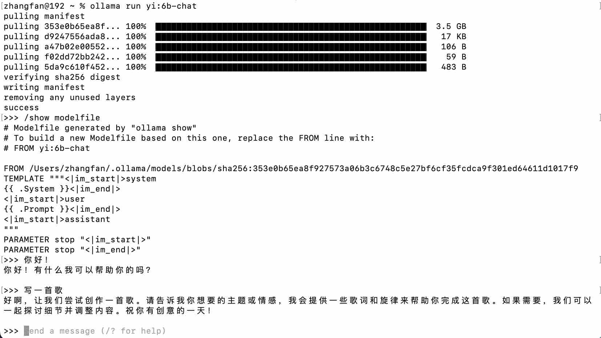
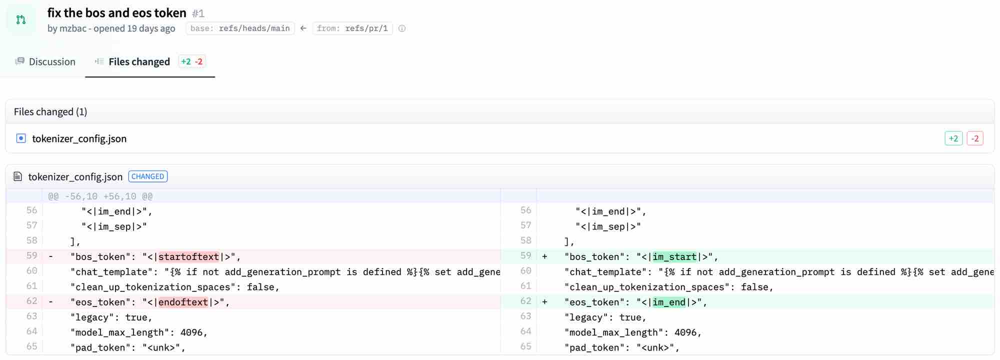
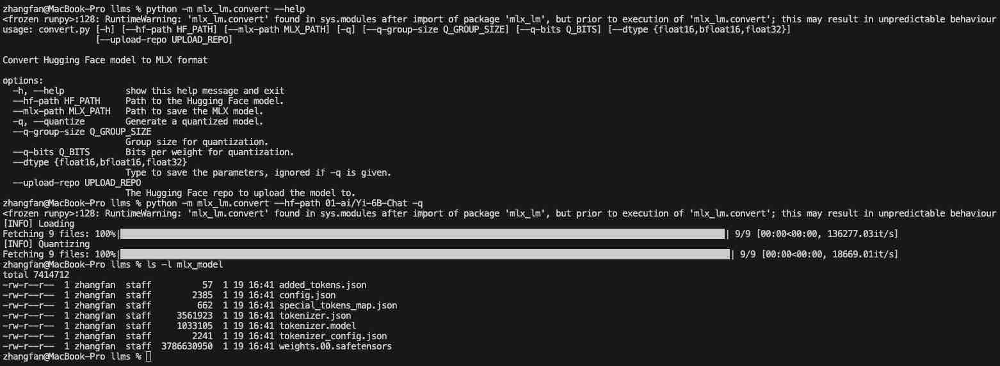
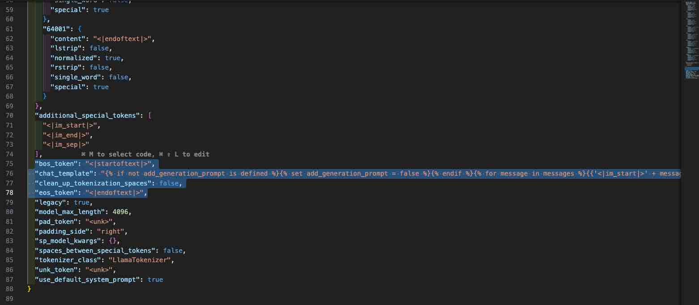
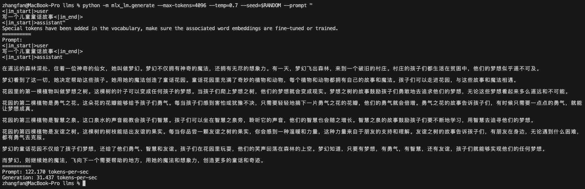

## [转载] Part2: 选择一个大语言模型  
                                                                                                
### 作者                                                                    
digoal                                                                    
                                                                           
### 日期                                                                         
2025-01-10                                                          
                                                                        
### 标签                                                                      
PostgreSQL , PolarDB , DuckDB , LLM , MLX , finetuning , 微调 , 大模型 , 蒸馏     
                                                                                               
----                                                                        
                                                                                      
## 背景    
原文:   
- https://www.geekyuncle.com/finetuning-local-llm-with-mlx/  
  
在微调模型之前，我们选择一个开源的大模型。本笔记记录了大模型的选型，使用ollama初体验大模型的文本生成过程，最后给出了使用mlx来生成文本的详细说明。  
  
# 转载  
  
这篇笔记是以下五个部分中的第2个：[学习笔记：使用 MLX 在 Mac 上微调本地 LLM](../202501/20250110_01.md)。  
  
对于初学者而言，我们需要先选择一个基础模型来进行微调。  
  
## 1、模型的选择  
从前面一篇笔记，我们可以看到MLX的样例中已经支持了很多大模型，我的选择是零一万物的 [01-ai/Yi-6B-Chat](https://huggingface.co/01-ai/Yi-6B-Chat) 。  
  
主要原因包括如下几点：  
- `01-ai/yi` 模型基于LLaMA大模型，模型结构是一样的，在开源生态中，有很多可以参考和借鉴的地方  
- `01-ai/yi` 是中英文双语大模型，和我未来想要主要面对的客户群基本上一致，尤其是我需要中文的支持  
- `01-ai/yi` 开源，且允许商用  
- `01-ai/yi` 模型系列有200K大上下文版本，虽然没有认真体验过，但是这个对于我来讲，非常有吸引力  
  
## 2、模型初体验  
在Mac上，体验大语言模型最方便的方式是使用[ollama](https://ollama.ai/)。  
  
从官网上直接下载ollama安装包即可。ollama支持API调用的方式，也有命令行工具。让我们先从命令行看看效果  
  
```  
ollama run yi:6b-chat  
  
>>> /show modelfile  
>>> 你好  
>>> 写一首歌  
```  
  
  
  
ollama支持在命令行输入`/show modelfile`命令，查看模型的配置，从这里看到两个重要的信息：  
  
由于我们运行的是<b>对话模型</b>，不是<b>基础模型</b>，"A base model provides raw text autocomplete requiring careful prompting. Instruct models are tuned from the base model to follow specific instructions, like ChatGPT does.  
". 模型的提示模版`prompt template`如下:  
```  
<|im_start|>system  
{{ .System }}<|im_end|>  
<|im_start|>user  
{{ .Prompt }}<|im_end|>  
<|im_start|>assistant  
```  
  
以及系统的`bos/eos token`:  
```  
PARAMETER stop "<|im_start|>"  
PARAMETER stop "<|im_end|>"  
```  
  
可以看到，`yi`模型的`bos/eos token`和其他模型略有不同，其他模型很多使用的是`<s>`与`</s>`，在后续的数据准备和推理实现中，我们需要注意这一点。  
  
## 3、MLX初体验  
由于MLX这个库还在非常早期的阶段，代码量不大，个人认为非常适合初学者细细研读里面的代码，以便我们对大语言模型有更深的理解。  
  
`mlx-examples`项目中有一个`llms`目录，里面提供了`mlx_lm`模块，可以很方便的运行`huggingface`上的模型。由于前面提到的`bos/eos token`问题，在直接运行`mlx_lm.generate`生成文本时无法正确结束执行，会持续生成文本，直到达到`max-tokens`上限。在生成的文本中，我们会看到多次出现`<|im_end|>`这个token出现。  
  
https://huggingface.co/01-ai/Yi-6B-Chat/discussions/1   
  
有人在hugging face上提了一个[PR](https://huggingface.co/01-ai/Yi-6B-Chat/discussions/1/files)，但是目前官方认为不需要合并这个请求。☹️  
  
  
  
为了临时解决这个问题，我们可以先来手工转换huggingface的模型为mlx模型。  
  
```  
cd mlx-examples/llms  
  
python -m mlx_lm.convert --help  
  
python -m mlx_lm.convert --hf-path 01-ai/Yi-6B-Chat -q  
  
ls -l mlx_model  
```  
  
  
  
转换成功的模型默认放在`mlx_model`目录下，包括了模型的配置文件`config.json`、分词器以及分词器的配置文件`*tokenizer*`，以及转换过后的权重文件`weights.00.safetensors`。  
  
  
  
在上面这个文件中可以看到，`bos_token`和`eos_token`有问题。参考这个[PR](https://huggingface.co/01-ai/Yi-6B-Chat/discussions/1/files)，把`bos_token`改为`<|im_start|>`，`eos_token`改为`<|im_end|>`，再来生成文本就没有问题了。 用户输入到第4行截止, 后面是模型的输出.    
  
```  
cd mlx-examples/llms  
  
python -m mlx_lm.generate --max-tokens=4096 --temp=0.7 --seed=$RANDOM --prompt "  
<|im_start|>user  
写一个儿童童话故事<|im_end|>  
<|im_start|>assistant"  
```  
  
  
  
需要注意的是，在命令行中，我们指定了几个参数，具体含义如下：   
  
### max-tokens  
我们把`--max-tokens`设置为模型的上限`4096`，是因为我们想生成一个长一点的文本。  
  
### temperature  
`--temp`参数指定了模型生成的“温度”参数，这个值用于控制生成语言模型中生成文本的随机性和创造性。它用于调整模型的softmax输出层中预测词的概率。温度参数定义为在应用 softmax 函数之前用于调整 logits 的比例因子的倒数。当Temperature 设置为较低的值时，选择最有可能的词的概率更高，这会产生更保守和可预测的文本；当Temperature 设置为较高值时，所有词被选择的可能性更大。这会产生更有创意和多样化的文本，因为模型更有可能生成不寻常或意想不到的词。温度参数通常设置为 0.1 到 1.0 之间的值，这里我选择了一个偏大的值0.7。  
  
### seed  
`--seed`参数指定了一个随机数，当我们使用同一个随机数作为参数，系统会返回相同的内容。当然，如果seed相同，temperature不同，会得到不同的结果。当seed和temperature都相同时，返回的结果是相同的。系统默认seed为0，在有的情况下，0会作为一个特殊值，表示使用任意的一个随机数，在我的实际运行中，0和其他非0值没有什么区别。为了每次运行得到不同的结果，我使用了命令行使用的随机数变量`$RANDOM`，确保每次运行都会得到不同的结果。  
  
```  
$ echo $RANDOM  
14404  
$ echo $RANDOM  
17059  
```  
    
  
#### [期望 PostgreSQL|开源PolarDB 增加什么功能?](https://github.com/digoal/blog/issues/76 "269ac3d1c492e938c0191101c7238216")
  
  
#### [PolarDB 开源数据库](https://openpolardb.com/home "57258f76c37864c6e6d23383d05714ea")
  
  
#### [PolarDB 学习图谱](https://www.aliyun.com/database/openpolardb/activity "8642f60e04ed0c814bf9cb9677976bd4")
  
  
#### [PostgreSQL 解决方案集合](../201706/20170601_02.md "40cff096e9ed7122c512b35d8561d9c8")
  
  
#### [德哥 / digoal's Github - 公益是一辈子的事.](https://github.com/digoal/blog/blob/master/README.md "22709685feb7cab07d30f30387f0a9ae")
  
  
#### [About 德哥](https://github.com/digoal/blog/blob/master/me/readme.md "a37735981e7704886ffd590565582dd0")
  
  

  
