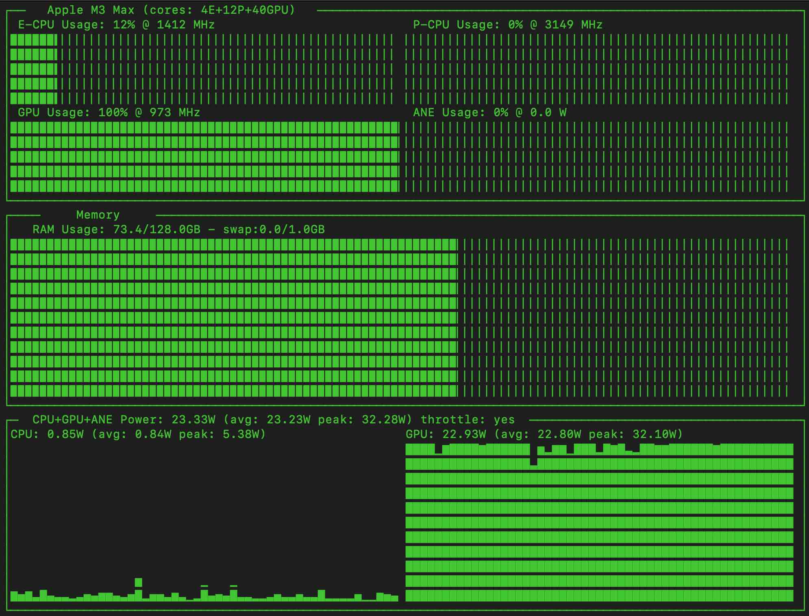
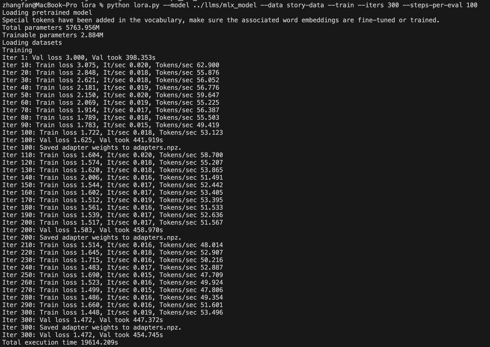

## [转载] Part4: 使用MLX微调LLM  
                                                                                                
### 作者                                                                    
digoal                                                                    
                                                                           
### 日期                                                                         
2025-01-10                                                          
                                                                        
### 标签                                                                      
PostgreSQL , PolarDB , DuckDB , LLM , MLX , finetuning , 微调 , 大模型 , 蒸馏     
                                                                                               
----                                                                        
                                                                                      
## 背景    
原文:   
- https://www.geekyuncle.com/finetuning-local-llm-with-mlx/  
  
微调LLM的过程，其实很无聊...不过M3 MAX是真的很强啊！  
  
# 转载  
  
这篇笔记是以下五个部分中的第4个：[学习笔记：使用 MLX 在 Mac 上微调本地 LLM](../202501/20250110_01.md)。  
  
  
## 1、微调大模型  
准备好了数据，迫不及待的试试微调大模型，心里有点小鸡冻！  
  
`cd`进入`mlx-examples/lora`目录运行? 之前转换成功的yi模型默认放在`mlx-examples/llms/mlx_model`目录下. 参看:    
- [《大模型微调(fine-tuning)实践 - 让它学完所有PolarDB文章》](../202501/20250108_01.md)     
  
```  
cd mlx-examples/lora  
python lora.py --model ../llms/mlx_model --data story-data --train --iters 386   
```  
  
参数可能影响训练耗时、内存使用、GPU使用、训练后的效果等. 更多参数配置说明请参考: [《大模型微调(fine-tuning)实践 - 让它学完所有PolarDB文章》](../202501/20250108_01.md)    
  
    
  
没有玩过N卡，不知道这个速度算快还是慢？  
  
整个过程其实很枯燥，漫长的等待...  
  
好在系统性能足够，CPU一点都不忙，内存也还有富裕，只有风扇轻轻的响。训练过程中，不影响继续撸点其他的代码，写写笔记。  
  
## 2、性能监控  
  
    
  
看看跑起来的内存消耗，基本上在62-87GB之间，平均大概在七十多GB。这只是6B的Q4量化模型，不知道非量化的，或者34B的能否跑得起来？等这个跑完了再试试。  
  
监控GPU的工具是一个免费的开源命令行工具asitop:  
  
  
[GitHub - tlkh/asitop](https://github.com/tlkh/asitop): Perf monitoring CLI tool for Apple Silicon  
- Perf monitoring CLI tool for Apple Silicon. Contribute to tlkh/asitop development by creating an account on GitHub.  
  
这个工具在M2/M3上对于CPU的监测有问题，于是有人提了一个[PR](https://github.com/tlkh/asitop/pull/68/files)来解决这个问题。但是这个仓库已经很久没有人维护了，虽然有人提了PR，依然没有合并到主线上。  
  
https://github.com/tlkh/asitop/pull/68/files  
  
Seems like the idle ratio of Cluster is reporting as zero in powermetrics which might be causing the CPU gauges to show 100%. This code fix simply averages the individual core idle ratios.  
  
不过这也没有关系，拦不住我们自动动手。我这是3.12, 找对应目录即可  
```  
zhangfan@MacBook-Pro asitop % pwd  
/Library/Frameworks/Python.framework/Versions/Current/lib/python3.11/site-packages/asitop  
  
zhangfan@MacBook-Pro asitop % ls  
__init__.py	__pycache__	asitop.py	parsers.py	utils.py  
zhangfan@MacBook-Pro asitop %   
```  
  
找到`parsers.py`文件，按照`PR`中的修改，重新运行`sudo asitop`，完美！  
  
## 3、微调yi-34b-chat-q4  
  
2024-01-20 更新：34B也能跑，只是速度慢了很多。  
  
```  
python lora.py --model ../llms/mlx_model --data story-data --train --iters 300 --steps-per-eval 100   
```  
  
  
  
    
  
#### [期望 PostgreSQL|开源PolarDB 增加什么功能?](https://github.com/digoal/blog/issues/76 "269ac3d1c492e938c0191101c7238216")
  
  
#### [PolarDB 开源数据库](https://openpolardb.com/home "57258f76c37864c6e6d23383d05714ea")
  
  
#### [PolarDB 学习图谱](https://www.aliyun.com/database/openpolardb/activity "8642f60e04ed0c814bf9cb9677976bd4")
  
  
#### [PostgreSQL 解决方案集合](../201706/20170601_02.md "40cff096e9ed7122c512b35d8561d9c8")
  
  
#### [德哥 / digoal's Github - 公益是一辈子的事.](https://github.com/digoal/blog/blob/master/README.md "22709685feb7cab07d30f30387f0a9ae")
  
  
#### [About 德哥](https://github.com/digoal/blog/blob/master/me/readme.md "a37735981e7704886ffd590565582dd0")
  
  

  
