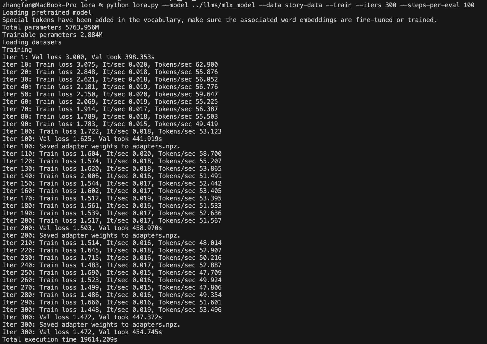
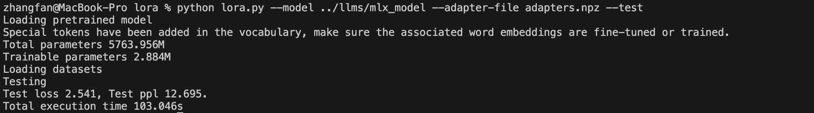
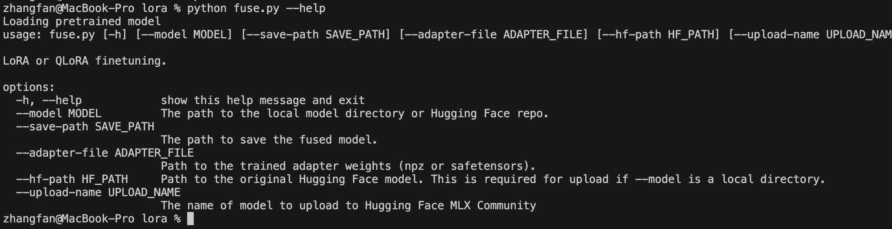

## [转载] Part5：评估与测试  
                                                                                                
### 作者                                                                    
digoal                                                                    
                                                                           
### 日期                                                                         
2025-01-10                                                          
                                                                        
### 标签                                                                      
PostgreSQL , PolarDB , DuckDB , LLM , MLX , finetuning , 微调 , 大模型 , 蒸馏     
                                                                                               
----                                                                        
                                                                                      
## 背景    
原文:   
- https://www.geekyuncle.com/finetuning-local-llm-with-mlx/  
  
MLX微调大模型的结果评测，以及中文乱码的解决  
  
# 转载  
  
这篇笔记是以下五个部分中的第5个：[学习笔记：使用 MLX 在 Mac 上微调本地 LLM](../202501/20250110_01.md)。  
  
1、从6b到34b  
由于在生成过程中，出现了乱码，所以我换成了34b。后续的笔记基本上都基于34b。  
  
  
  
<b> 实际上，切换到34b之后，这个问题依然存在。关于如何解决这个问题，请看第3节。</b>   
  
## 2、测试集运行结果  
```  
cd mlx-examples/lora  
  
python lora.py --model ../llms/mlx_model --data story-data --train --iters 300 --step-per-eval 100   
  
python lora.py --model ../llms/mlx_model --adapter-file adapters.npz --test    
```  
  
  
  
  
  
从测试集的结果来看，确实有所改善，但是提高不大。损失函数的结果从微调之前的3.0，下降到了验证集上的结果1.472，而最终用测试集的计算结果是2.541。可能是数据集质量还不够好，也可能是数据集数据量太小。总共只用了300行数据来进行微调。  
  
这种情况对于内容生成类的大模型应用是非常常见的。因此，更好的办法还是依靠人工来检查。  
  
## 3、乱码问题  
在验证过程中，乱码问题是让我很烦恼的问题。无论6B还是34B都出现了这个问题。原始模型在ollama上跑也有。为此咨询了yi官方交流群，也没有确切的答案。后来在mlx的pull-request上看到有人提PR，貌似可以解决这个问题。  
  
https://github.com/ml-explore/mlx-examples/pull/321   
  
fix mlx_lm generator for chinese by someone   
  
Some Chinese characters require more than two or three tokens to decode, in the verbose version, tokens will be decoded immediately, rather than wait for two or three tokens.    
  
mlx 0.0.10版本已经包含了这个PR，为什么还会出现这个问题？仔细看代码，发现了一个事实，这个PR没有被用起来 ....   
  
It’s the same fix as PR `#321` as it fixed the code in utils.py, but the function generation is not used in main function. So I do it once again here.  
  
用这种方式，确实解决了问题，于是，带来另外一个问题，一个token到底对应几个汉字？  
  
## 4、tokenizer对汉字的处理  
在这个视频中，介绍了tokenizing data的基础原理。  
  
https://youtu.be/VVlAE5VXjag  
  
我想既然英文可以用词根作为一个token，是否中文也存在这种情况，所以导致了这个乱码问题？用英文词根做token，不会产生显示的问题，而中文这样做，却不能直接显示“半个”汉字。事实上，这个PR的解决方法，就是发现占位符的时候，先不吐出来，而是直接暂存起来，等下个token出来之后合并在一起再来解析。  
  
以上分析只是我的个人猜测，不一定符合事实。  
  
## 5、合并权重  
微调之后的模型权重，可以和原始的权重合并，然后发布出来  
```  
cd mlx-examples/lora  
  
python fuse.py --model ../llms/mlx_model --save-path fused-yi-34b-chat --adapter-file adapters.npz  
```  
  
由于这次微调以学习为主要目的，就没有发布出来。如果需要发布，可以参考这个  
  
```  
cd mlx-examples/lora  
  
python fuse.py --help  
  
usage: fuse.py [-h] [--model MODEL] [--save-path SAVE_PATH] [--adapter-file ADAPTER_FILE] [--hf-path HF_PATH] [--upload-name UPLOAD_NAME] [-d]  
  
LoRA or QLoRA finetuning.  
  
options:  
  -h, --help            show this help message and exit  
  --model MODEL         The path to the local model directory or Hugging Face repo.  
  --save-path SAVE_PATH  
                        The path to save the fused model.  
  --adapter-file ADAPTER_FILE  
                        Path to the trained adapter weights (npz or safetensors).  
  --hf-path HF_PATH     Path to the original Hugging Face model. This is required for upload if --model is a local directory.  
  --upload-name UPLOAD_NAME  
                        The name of model to upload to Hugging Face MLX Community.  
  -d, --de-quantize     Generate a de-quantized model.  
```  
  
  
  
## 6、MLX的性能问题  
最后需要提到的是，MLX还是一个非常年轻的框架，在体验的过程中，出现过程序可以运行，但是GPU利用率很低，34b的文本生成大概0.5个token/s，这个实在是太慢了。重启之后运行，就可以很正常的工作，无量化的版本，在M3 Max/128G的配置上，大概6-7个token/s。  
  
MLX和ollama相比，性能上还有不少差距，具体是什么原因不太清楚，一个是C++，一个是python，除此之外，不知道还有哪些差别？ollama可以配置多少层可以在GPU上运行，不清楚mlx是否已经全部在GPU上运行了？从性能监控的功耗来看，ollama对GPU的利用率要高一些，不知道这是否是mlx还可以压榨GPU的空间？  
  
这些问题，留待在后续的学习中，去寻找更清晰的答案。  
  
  
#### [期望 PostgreSQL|开源PolarDB 增加什么功能?](https://github.com/digoal/blog/issues/76 "269ac3d1c492e938c0191101c7238216")
  
  
#### [PolarDB 开源数据库](https://openpolardb.com/home "57258f76c37864c6e6d23383d05714ea")
  
  
#### [PolarDB 学习图谱](https://www.aliyun.com/database/openpolardb/activity "8642f60e04ed0c814bf9cb9677976bd4")
  
  
#### [PostgreSQL 解决方案集合](../201706/20170601_02.md "40cff096e9ed7122c512b35d8561d9c8")
  
  
#### [德哥 / digoal's Github - 公益是一辈子的事.](https://github.com/digoal/blog/blob/master/README.md "22709685feb7cab07d30f30387f0a9ae")
  
  
#### [About 德哥](https://github.com/digoal/blog/blob/master/me/readme.md "a37735981e7704886ffd590565582dd0")
  
  

  
