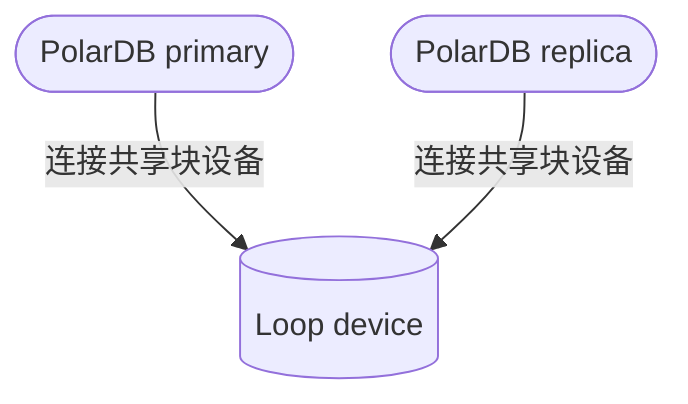

## Markdown内用mermaid代码画图  
                                                                                   
### 作者                                                            
digoal                                                                   
                                                                
### 日期                                                                             
2025-02-06                                                                   
                                                                            
### 标签                                                                          
PostgreSQL , PolarDB , DuckDB , mermaid , markdown    
                                                                                     
----                                                                 
                                                                         
## 背景         
在markdown中画脑图、流程图、甘特图、饼图等几十种图形, 可以使用mermaid.    
  
例如:     
  
````  

````  
  

  
用法可参考:   
  
https://github.com/digoal/Frontend-Learning-Record/blob/main/4-%E5%B8%B8%E7%94%A8%E7%94%9F%E4%BA%A7%E5%B7%A5%E5%85%B7%E5%AD%A6%E4%B9%A0%E7%AC%94%E8%AE%B0/3-Markdown/Markdown%E8%BF%9B%E9%98%B6.md  
  
https://github.com/LoveEmiliaForever/Frontend-Learning-Record/blob/main/4-%E5%B8%B8%E7%94%A8%E7%94%9F%E4%BA%A7%E5%B7%A5%E5%85%B7%E5%AD%A6%E4%B9%A0%E7%AC%94%E8%AE%B0/3-Markdown/Markdown%E8%BF%9B%E9%98%B6.md  
  
https://docs.min2k.com/zh/mermaid/syntax/flowchart.html  
  
mermaid 在线渲染工具(使用该网站渲染是不需要加````  ```mermaid ..... ```    ````):    
  
https://www.min2k.com/tools/mermaid/  
  
更多小工具:  
  
https://www.min2k.com/  
  
还可以使用AI生成mermaid代码, 例如deepseek:
   
https://chat.deepseek.com/   
   
