## 易经笔记2    
                                                                                           
### 作者                                                                    
digoal                                                                           
                                                                        
### 日期                                                                                     
2025-02-09                                                                          
                                                                                    
### 标签                                                                                  
PostgreSQL , PolarDB , DuckDB , 易经       
                                                                                             
----                                                                         
                                                                                 
## 背景      
主要参考 复旦大学出版社 南怀瑾选集 第三卷 易经杂说、易经系传别说    
  
1、易经起源: 《易经》分为三部，天皇氏时代《连山易》、《归藏易》，秦汉时期的易书《周易》，一起称作“三易”（另有一说三本书均作于远古）。    
  
三皇: https://baike.baidu.com/item/%E4%B8%89%E7%9A%87/1643592  
  
易经: https://baike.baidu.com/item/%E6%98%93%E7%BB%8F/153636  
  
2、易的解释  
  
变易、简易、不易   
  
变易: 万事万物都是变化的.   
  
简易: 通过《易经》可以将变化化繁为简.   
  
不易: 变化背后有其原理. 可以第一性原理来理解. 或公理体系. 扩展阅读: [《德说-第100期, 人生最重要的事3: 建立公理体系和逻辑能力》](../202206/20220610_01.md)    
     
3、学习易经的关键  
  
理: 定义、属性; 定义属阳; 可类比 结构定义; 通常是不变的;    
  
象: 理的显性; 实体属阴; 可类比 结构中填充的内容;    
  
数: 象的数字衡量; 可类比 内容的数字化衡量;    
  
4、卦  
  
爻: 包含阴阳两种爻.  阴爻用`- -`表示, 阳爻用`——`表示.  阴爻有时也称为六, 阳爻有时也称为九.     
  
阳表现为无形、虚、气、定义/属性/结构;    
- 道, 天地运行的规律, 我们生活在天地之间而浑然不知. 见《素书》    
- 天行健, 君子以自强不息.       
  
阴表现为有形、实化/实体、水;    
- 德, 道的显现/实化.      
- 地势坤, 君子以厚德载物.     
  
卦: 八卦由3个爻组成, 64卦由2个八卦(或6个爻)组成.  从下到上分别称之为: 第一爻(初爻), 第二爻, 第三爻, 第四爻, 第五爻, 第六爻. 例如 "初九表示第一爻为阳爻", "九五表示第五爻为阳爻".     
  
每一卦、每一爻都需要从“理、象、数”的层面来理解.    
  
5、八卦  
  
先天八卦和后天八卦的区别，和先天卦数和后天卦数以及八卦方位: https://2743.com/archives/4288    
  
5\.1、先天八卦(伏羲八卦) , 根据 已有地理地貌/象 来绘制的八卦.    
  
卦图, 站在中间往外看.    
  
     
  
先天八卦的顺序(生成64卦方圆图时需要用到这个顺序): 乾天1 兑泽2 离火3 震雷4 巽风5 坎水6 艮山7 坤地8     
  
先天八卦中每一卦的象 & 方位逻辑:   
  
把你自己放到中原平原的位置, 背北面南来理解这个象.    
  
正南 乾天1 : 三个阳爻, 阳为定义/虚/气/无形的. 我国的正南, 正好是海天相接, 海天一色.     
  
东南 兑泽2 : 沼泽, 一锅浓汤是什么景象? 表面是水/水土混合实体(阴为实体/有形的), 下面的气不断往上冒(气/虚/阳), 所以一二阳爻,三为阴爻.   我国的东南, 沼泽、湿地确实较多, 例如福建、江浙、江西境内的湿地.    
  
正东 离火3 : 离为火, 为太阳. 中医把心比做离. 太阳会不会中间是实体(阴)、表面是气态的(阳)? 所以外面一三阳爻,中间二为阴爻.  我国的正东, 太阳升起的地方.     
  
东北 震雷4 : 打雷时的景象是什么样的? 上面乌云密布感觉要往下掉(有色有形 阴), 雷声震天(无形 阳). 所以上面2爻为阴, 下面一爻为阳.  我国的东北, 雷多?    
  
西南 巽风5 : 水(阴)蒸发上升, 形成风. 所以下面一爻为阴, 上面二三爻为阳.  我国的西南一带, 山风较多, 龙从云、虎从风.    
  
正西 坎水6 : 坎水和离火正对, 火为太阳, 水就为月亮. 中医把肾比做坎. 月亮会不会中间是空的(阳)、表面是土地(阴)? 所以外面一三阴爻,中间二为阳爻. 我国的正西, 月亮从这里升起? 查阅资料应该不是, 可能 还有其他解释.  日月方位: https://zhuanlan.zhihu.com/p/94688678     
  
西北 艮山7 : 山是板块运动, 地(阴)不断被隆起形成的. 高山之上通常云雾缭绕(阳). 所以下面一二为阴爻, 上面三为阳爻.  我国的西北, 高原, 艮山.   
  
正北 坤地8 : 纯地, 纯阴. 三个阴爻, 阴为实体/实化/有形的. 我国的正北, 中原中土背后有靠山.   
   
从太极演变到先天八卦:   
   
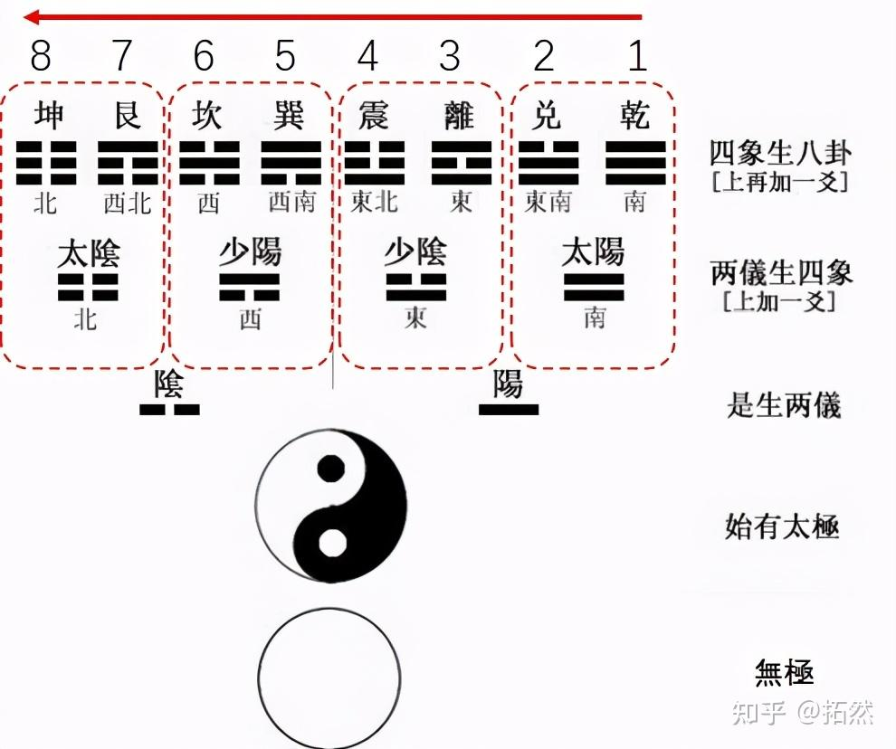     
  
5\.2、后天八卦(文王八卦) , 文王按八卦“理、象、数”的逻辑进行整理排布, 适用于变化、演绎, 用于预知未来.  现在可能应用更多的是后天八卦.     
  
卦图, 站在中间往外看.    
  
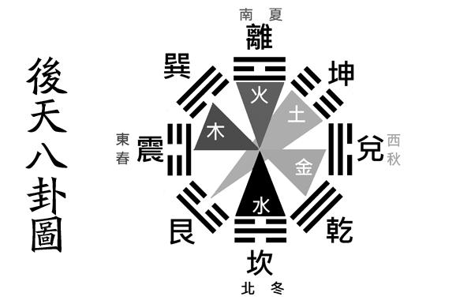     
  
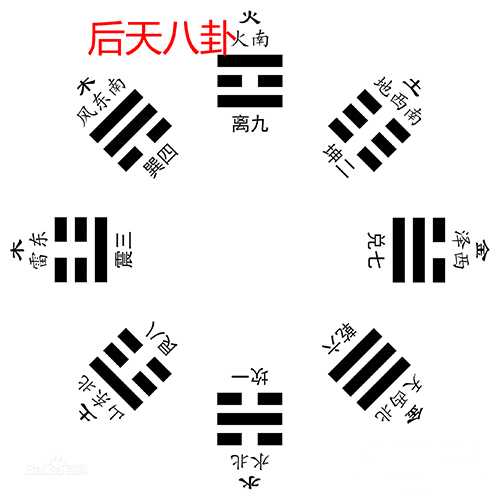     
  
后天八卦之数按洛书之数论之：坎一坤二震三巽四中五乾六兑七艮八离九，又称为九宫数。    
  
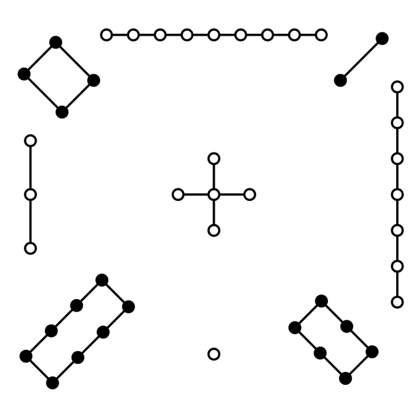     
  
后天八卦顺序的逻辑, 按地球演变来理解记忆 :   
  
坎水1 : 起初的地球一片混沌, 是一团水     
  
坤地2 : 和地核      
  
震雷3 : 雷电交加    
  
巽风4 : 天地之间能量交替, 产生了狂风暴雨    
  
中宫5 : 经过上面漫长的阶段   
  
乾天6 : 形成了大气     
  
兑泽7 : 河流、湿地     
  
艮山8 : 板块运动下, 形成了高山    
  
离火9 : 火山喷发, 山上的树木燃烧生成火    
  
后天八卦的方位 & 季节逻辑:    
  
  
  
春季为木气最为旺盛之时，故东为木，又为春，春季又多风，且东南为信风带，震、巽二卦主之；  
  
木气极致而生火，南为火–热，南方靠近赤道，气候较热，故为火，而火又以红现之，故主红色，以中原为中心，越向南，泥土颜色也越来越红，夏季一年最热，是个红彤彤的季节，同应此位，离卦也；  
  
火极则生土，土色绘之，坤卦，宫居西南，川蜀盆地，恰为坤之阴土，坤为地，大地孕育万物，夏发秋收，交替之时，恰是收获之际；  
  
夏季过后金秋至，乾、兑主金，居西方，西部沼泽盆地，西北又金属矿产丰富，金属以白、黄为主要代表色，乾阳、兑阴；  
  
金又生水，送走秋天，迎来白雪皑皑的严冬，冬雪冰封，正属水也，水色为玄，黑、蓝之色，我国北部同为一片雪城，与离卦相通，中原以北，土地颜色越来越深，至我国东北便是黑土地了，坎卦居此，为北、为水、为冬、为玄；  
  
春夏秋冬走尽，尽处则止，艮卦为山、为止，宫位东北，东北山脉连绵，山石为土，但此土非彼土，石为坚，坚为阳，艮之阳土有别与坤之阴土。  
  
  
后天八卦手指图. 便于记忆:      
  
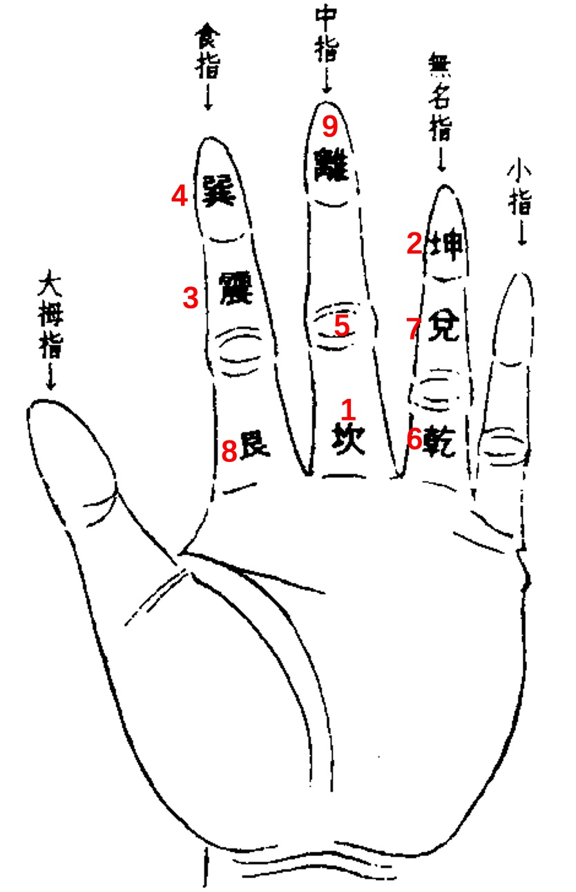     
  
后天八卦两两相对的卦数相加均等于10，如加上中宫之数5则等于 15。任何横行或竖列相加都是15.   
  
x | x | 方位 卦象 数字 人物 节气   
---|---|---  
东南 巽风 4 长女 立夏 | 正南 离火 9 中女 夏至 | 西南 坤地 2 母 立秋  
正东 震雷 3 长男 春分 | 中宫 5 | 正西 兑泽 7 少女 秋分  
东北 艮山 8 少男 立春 | 正北 坎水 1 中男 冬至 | 西北 乾天 6 父 立冬  
  
     
  
<b>后天八卦, 方位、节气逻辑:</b>     
  
以震卦为起始点，位列正东; 按顺时针方向，依次为巽卦，东南; 离卦，正南; 坤卦，西南; 兑卦，正西; 乾卦，西北; 坎卦，正北; 艮卦，东北。  
  
如象征节气，则震为春分，巽为立夏，离为夏至，坤为立秋，兑为秋分，乾为立冬，坎为冬至，艮为立春。   
  
《说卦传》曰:“乾、天也，故称乎父。坤、地也，故称乎母。震一索而得男，故谓之长男。巽一索而得女，故谓这长女。坎再索而得男，故谓之中男。离再索而得女，故谓之中女。艮三索而得男，故谓之少男。兑三索而得女，故谓之少女”。  
   
按3爻从下到上的顺序, 大儿子长男得乾(父)的初爻(第一爻), 所以是雷震卦. 二儿子得乾(父)的第2爻, 所以是坎水卦. 小儿子得乾(父)的第3爻, 所以是艮山卦.  
   
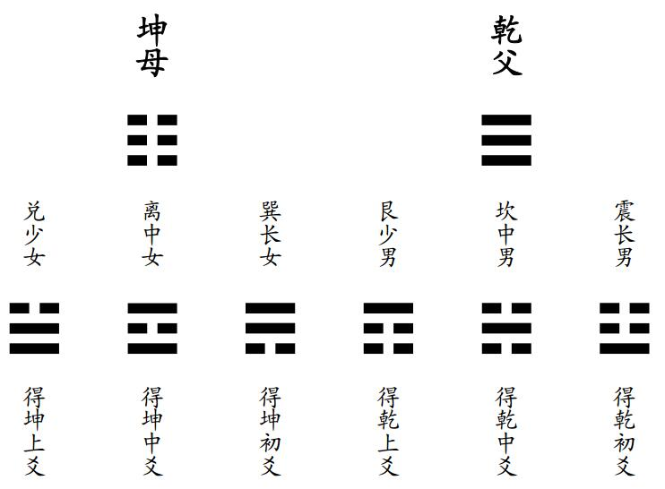    
   
女儿以此类推.   
    
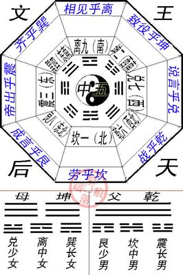    
  
<b> 后天八卦的子女关系 </b> (总体为北为天, 南为地, 看我国的海拔地图可以看到西北海拔是偏高的, 家里的高山是谁? 当家的. 所以乾在西北角. ) :     
- 另见:  [《德说-第192期, 形和神》](../202301/20230126_01.md)   [《德说-第194期, 易经先天八卦和后天八卦》](../202301/20230127_02.md)    
  
傅佩荣一句话。物以稀为贵，阴爻多则为男性，阳爻多则为女性。(除了纯阴坤和纯阳乾卦.)    
  
邵子曰:“乾统三男于西北，坤统三女于西南，“乾、坎、艮、震”为“阳”，“巽、离、坤、兑”为“阴”。后天八卦的“序数”为:坎一、坤二、震三、巽四、五为中宫，乾六、兑七、艮八、离九。  
  
甚至包括八卦每一卦的象意是建立在后天八卦的基础上的。这是属于后天事象的八卦，以乾为父，坤为母，震为长男，巽为长女，坎为中男，离为中女，艮为少男，兑为少女。  
   
先天卦和后天卦叠加来看:   
  
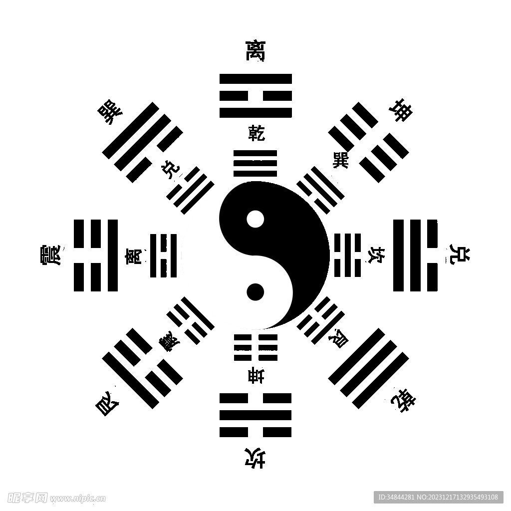    
   
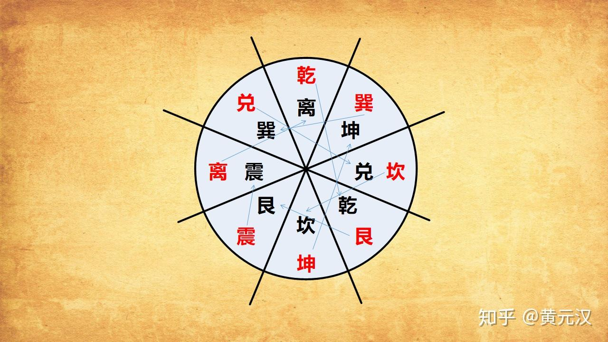     
    
  
6、六十四卦  
  
两个八卦的卦象叠加, 组成了六十四卦.    
  
  
解读卦象时, 要考虑不同的角度, 不同地立场(自己的立场, 对方的立场), 才能更加全面. 横看成岭侧成嘛 :    
  
6\.1、原始卦   
  
6\.2、综卦 : 原始卦的对立面 , 例如把卦转180度, 把原始卦放在四方桌上, 站到桌子对面去看就是综卦.  二进制位例子 110101 就变成 101011   
  
6\.3、错卦 : 每一爻都变一下, 得到原始卦的错卦. 类似二进制值取否. 010111 就变成 101000    
  
6\.4、互卦 : 去掉第1爻和第6爻, 剩下的4爻中下3爻下移, 上3爻上移形成新的卦象. 例如 110010 去掉头尾 变成 1001 , 然后取左3位100和右3位001得到原始卦的互卦 100001 . 为什么叫互卦? 有点像两个钩子钩住的感觉.    
  
7、变卦  
  
原始卦: 例如 假设从下至上为  101100     
  
从内卦101开始变, 内在变化引发外在的变化. 注意是叠加变化, 每次变化时, 基于上一个变化的值.    
  
第1爻变(最下面1爻): 001100   
  
第2爻变 : 011100  
  
第3爻变 : 010100  
  
第4爻变 : 010000  
  
第5爻变 : 010010  
  
<b> 注意接下来不是第6爻变, 因为第6爻不能变. </b>  为什么接下来是第4爻发生变化? 第4爻也是外卦(上3爻)的第1爻. 也就是内在驱动力变化引起了外在的持续改变.    
  
第4爻变 : 010110  也叫游魂卦    
  
下3爻(内卦)变: 101110  内卦的3爻一次性变成和原始内卦一样, 也叫归魂卦     
  
8、京氏/京房十六变卦  
  
和前面的变卦类似, 只是往复多次, 最终要变回原始卦.  
  
原始卦: 例如 假设从下至上为  101100     
  
第1爻变 : 001100  
  
第2爻变 : 011100  
  
第3爻变 : 010100  
  
第4爻变 : 010000  
  
第5爻变 : 010010  
  
<b> 注意接下来不是第6爻变, 因为第6爻不能变. </b>  开始往下飞, 也就是往下变    
  
第4爻变 : 010110  
  
第3爻变 : 011110  
  
第2爻变 : 001110  
  
第1爻变 : 101110  
  
此时第1爻已经变回去了. 开始往上飞, 也就是往上变    
  
第2爻变 : 111110  
  
第3爻变 : 110110  
  
第4爻变 : 110010  
  
第5爻变 : 110000  
  
又开始往下飞, 复飞. 也就是往下变   
  
第4爻变 : 110100  
  
第3爻变 : 111100  
  
第2爻变 : 101100  
  
至此, 就完成了16变, 并且变回了原来的卦.    
  
9、先天八卦(伏羲八卦) 演变的 六十四卦  https://2743.com/archives/12417    
  
首先回忆一下先天八卦的数字顺序: 乾天1 兑泽2 离火3 震雷4 巽风5 坎水6 艮山7 坤地8    
  
方图  
  
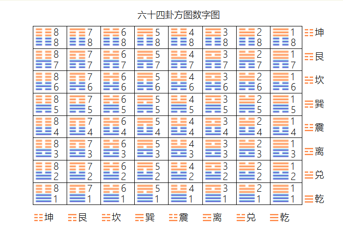     
  
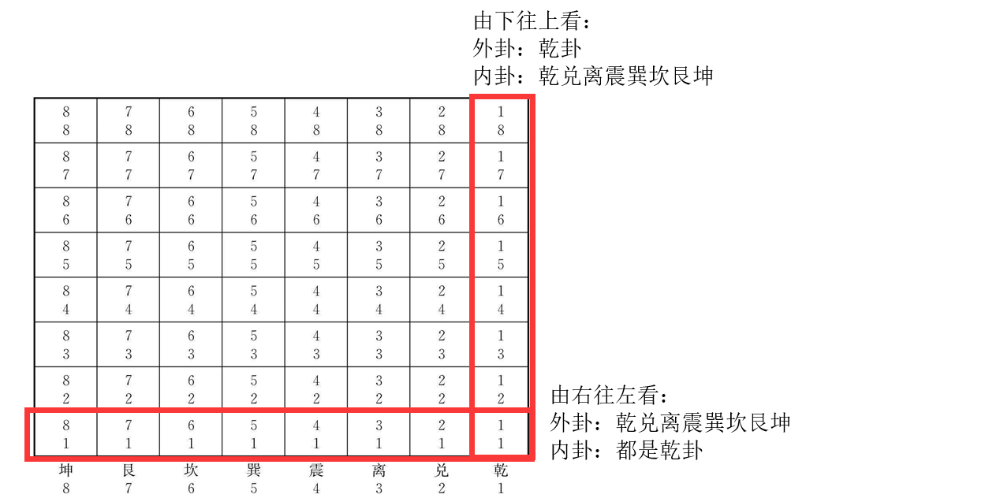     
  
首先是内卦, 自下而上(列). 乾天1 兑泽2 离火3 震雷4 巽风5 坎水6 艮山7 坤地8    
  
然后叠加外挂, 自右而左(行).  乾天1 兑泽2 离火3 震雷4 巽风5 坎水6 艮山7 坤地8    
  
圆图, 根据方图和先天八卦图的顺序来填充圆图.    
  
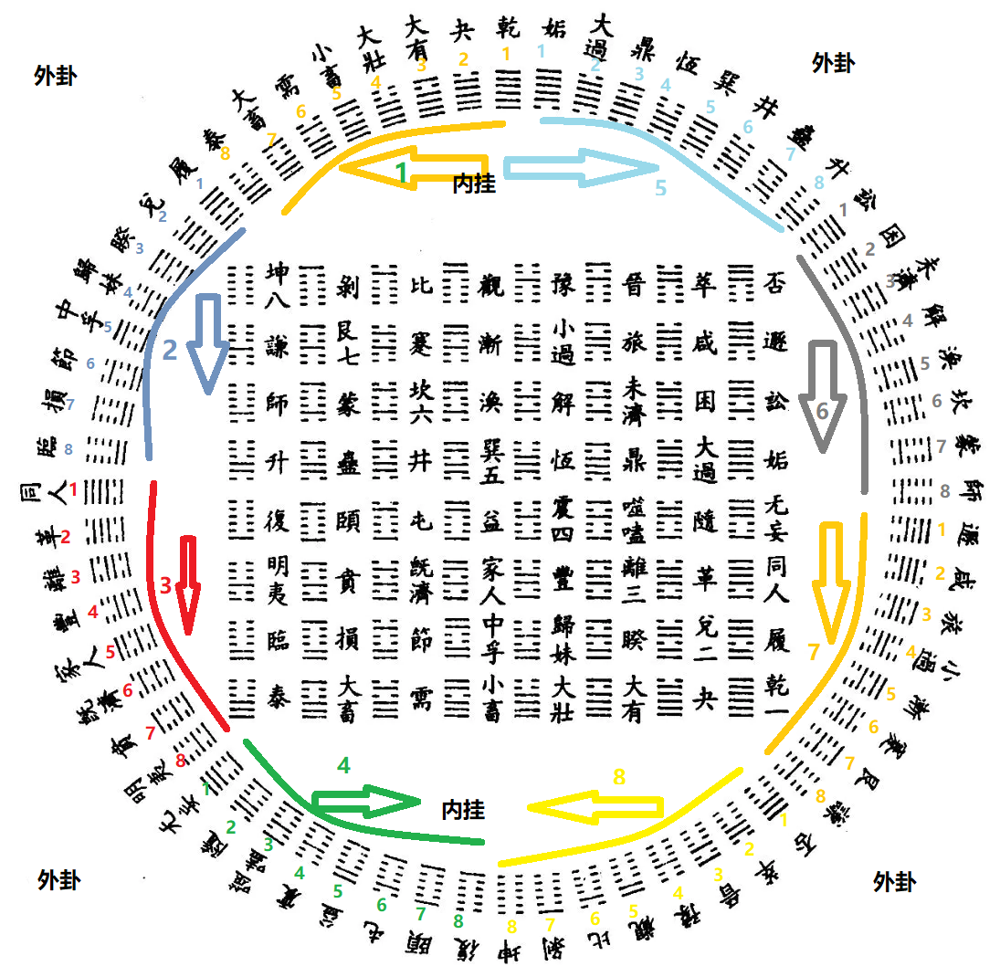     
  
     
  
按先天八卦的数字顺序填充64卦。内卦代表本质, 所以首先下3爻(内卦)为乾的8个卦为一组, 按逆时针填充原来乾天1的位置, 然后是下3爻(内卦)为兑的8个卦为一组, 填充原来兑泽2的位置, 以此类推. 到巽5时开始按顺时针填充.    
  
10、五行、方位、天干(及阴阳)、脏腑    
  
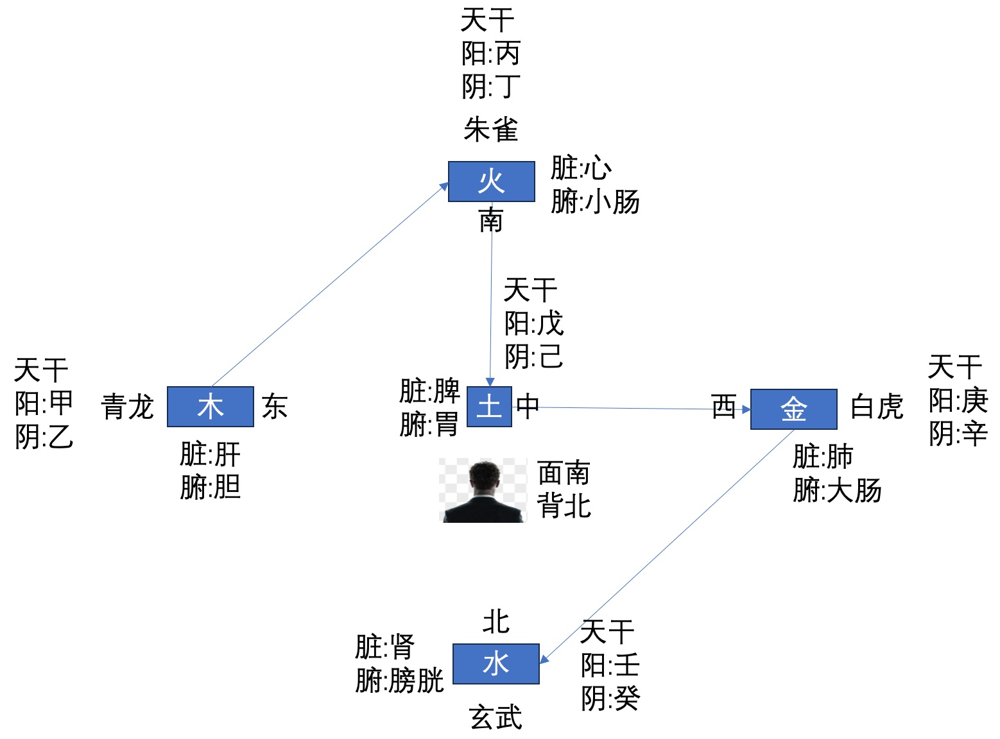     
  
一代相生: 木 火 土 金 水  
  
隔代相克: 木 土 水 火 金  
  
五行相生逻辑: 木 燃烧 生火; 火 将木燃烧后 变成土; 土 可以挖掘提炼 金; 金 盆表面温度低于空气 早上可以产生露水;   
  
五行相克逻辑: 木 生长 破土而出; 土 水来土掩; 水 灭 火; 火 融化 金; 金 锻造斧子砍伐 木;    
  
天干的阴阳划分: 先有阳(定义), 后有阴(实体). 所以 甲乙(木) 丙丁(火) 戊己(土) 庚辛(金) 壬癸(水) 的阳为 甲(阳木) 丙(阳火) 戊(阳土) 庚(阳金) 壬(阳水), 其余为阴.    
  
书中举例: 黄帝内经说女子十四而天癸至, 就是说月经来了, 月经属水, 而且女子属阴, 所以用癸(阴水)而不是壬(阳水). 其中 “天”是为了说明来源于先天.    
  
  
  
#### [期望 PostgreSQL|开源PolarDB 增加什么功能?](https://github.com/digoal/blog/issues/76 "269ac3d1c492e938c0191101c7238216")
  
  
#### [PolarDB 开源数据库](https://openpolardb.com/home "57258f76c37864c6e6d23383d05714ea")
  
  
#### [PolarDB 学习图谱](https://www.aliyun.com/database/openpolardb/activity "8642f60e04ed0c814bf9cb9677976bd4")
  
  
#### [PostgreSQL 解决方案集合](../201706/20170601_02.md "40cff096e9ed7122c512b35d8561d9c8")
  
  
#### [德哥 / digoal's Github - 公益是一辈子的事.](https://github.com/digoal/blog/blob/master/README.md "22709685feb7cab07d30f30387f0a9ae")
  
  
#### [About 德哥](https://github.com/digoal/blog/blob/master/me/readme.md "a37735981e7704886ffd590565582dd0")
  
  

  
