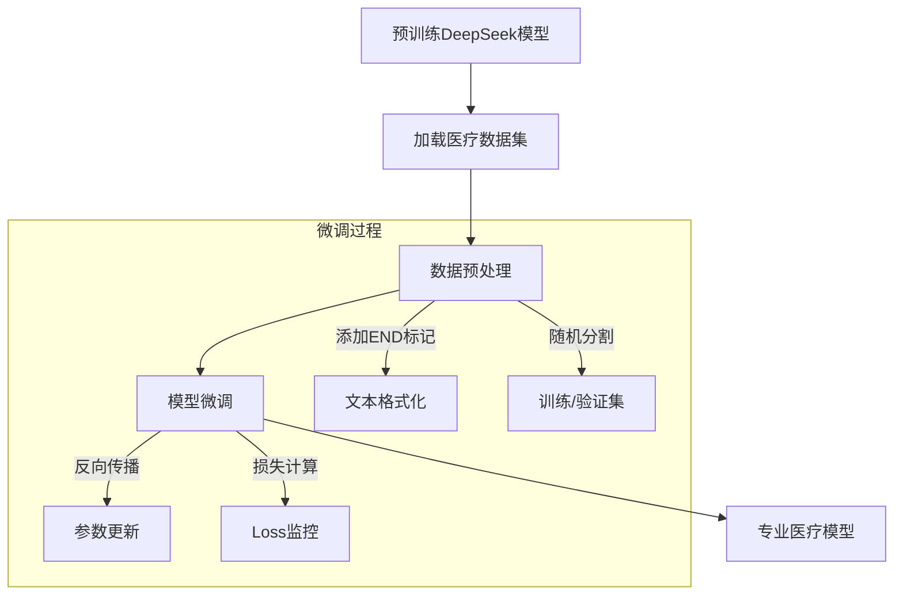
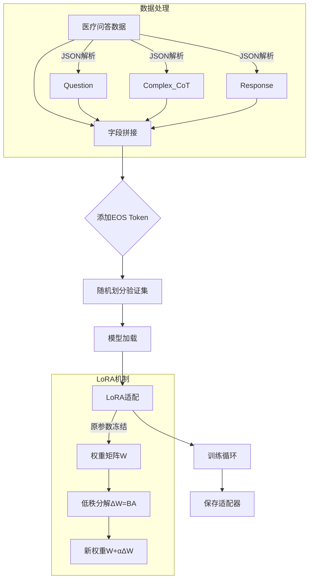

## 手把手教你炼丹 | 用Mac本地微调大模型 , 扩展: 微调数据JSONL的内容格式和什么有关?  
                                                                                                
### 作者                                                                    
digoal                                                                    
                                                                           
### 日期                                                                         
2025-02-15                                                                   
                                                                        
### 标签                                                                      
PostgreSQL , PolarDB , DuckDB , 大模型 , 微调 , Mac , LoRA , MLX            
                                                                                               
----                                                                        
                                                                                      
## 背景    
有apple chip的设备就可以本地微调大模型, 简单到爆.    
  
准备工作:   
- 一台 macmini m2 16g   
- python升级到3.12.9   
    - [《mac + mlx-examples 大模型微调(fine-tuning)实践 - 让它学完所有PolarDB文章》](../202501/20250108_01.md)        
  
## 原理
大模型就像通才, 但是不专. 那么我们怎么把通才变成专家呢? 可以使用专业领域的数据集对它进行微调. 例如可以从这里下载各种数据集, 用于微调得到各个领域的专用模型. 
- https://modelscope.cn/datasets
- https://huggingface.co/datasets
   
假设我们下载了医疗相关数据集( https://modelscope.cn/datasets/AI-ModelScope/medical-o1-reasoning-SFT/files ), 微调过程可能是这样的:   

  

  
## DEMO   
1、下载一个小模型, 16G内存不多, 但是微调1.5B的小模型够了, 就选`Qwen/Qwen2.5-1.5B` .     
```  
# 下载到这 ~/Qwen2.5-1.5B    
cd ~   
  
# 安装依赖  
pip install -U huggingface_hub  
  
# 设置环境变量  
export HF_ENDPOINT=https://hf-mirror.com   
  
# 下载 Qwen/Qwen2.5-1.5B 模型，保存至 Qwen2.5-1.5B 目录  
huggingface-cli download --max-workers 4 --resume-download Qwen/Qwen2.5-1.5B --local-dir Qwen2.5-1.5B  
```  
  
也可以从huggingface手工下载:    
- https://huggingface.co/Qwen/Qwen2.5-1.5B  
  
2、安装依赖  
```  
pip install mlx-lm  
pip install transformers  
pip install torch  
pip install numpy  
```  
  
3、安装mlx, mlx是利用苹果芯片内置GPU进行训练的框架  
```  
cd ~   
  
git clone --depth 1 https://github.com/ml-explore/mlx-examples  
```  
  
4、准备用来微调模型的数据, 给一些恶搞的数据, 关键就看微调后的效果  
  
注意lora训练数据jsonl文本内容格式可以参考:     
- https://github.com/ml-explore/mlx-examples/blob/main/llms/mlx_lm/LORA.md#data
- 或 本文后面的章节 - “关于jsonl的内容格式, 与什么有关?”
- 或 lora/data/train.jsonl `{"text": "table: 1-1000181-1\ncolumns: State/territory, Text/background colour, Format, Current slogan, Current series, Notes\nQ: Tell me what the notes are for South Australia \nA: SELECT Notes FROM 1-1000181-1 WHERE Current slogan = 'SOUTH AUSTRALIA'"}`  
  
`train.jsonl`: 训练用数据, 相当于 课本和习题集     
```  
cd ~/mlx-examples/lora  
  
mkdir test_data  
  
vi test_data/train.jsonl  
  
{"prompt": "PolarDB是什么", "completion": "阿里云开源宇宙无敌数据库"}  
{"prompt": "Oracle数据库会被什么打败", "completion": "国产数据库"}  
{"prompt": "为什么电动汽车比较费油", "completion": "因为电很贵"}  
{"prompt": "哪吒的师傅是谁", "completion": "孙悟空的师傅的舅舅"}  
{"prompt": "月亮哪天最圆", "completion": "星期八"}  
{"prompt": "谁是最帅的地球人", "completion": "德哥"}  
```  
  
`valid.jsonl`: 验证数据, 相当于 模拟考试卷    
```  
vi test_data/valid.jsonl  
  
{"prompt": "PolarDB是什么", "completion": "阿里云开源宇宙无敌数据库"}  
{"prompt": "Oracle数据库会被什么打败", "completion": "国产数据库"}  
{"prompt": "为什么电动汽车比较费油", "completion": "因为电很贵"}  
```  
  
可选, `test.jsonl`: 测试数据集, 相当于 最终期末考试卷  
```  
vi test_data/test.jsonl  
  
{"prompt": "哪吒的师傅是谁", "completion": "孙悟空的师傅的舅舅"}  
{"prompt": "月亮哪天最圆", "completion": "星期八"}  
{"prompt": "谁是最帅的地球人", "completion": "德哥"}  
```
   
<b> 注意了: 以上数据集本身没问题, 但是缺少了stop tokens, 训练完成后会存在一些问题, 例如回复完后无法停止, 甚至输出乱七八糟的内容. </b>    
  
问题测试如下    
```  
mlx_lm.generate --model ~/Qwen2.5-1.5B --adapter-path adapters --temp 0.0001 -m 30 --prompt "PolarDB是什么?"   
  
==========  
阿里云开源宇宙无敌数据库.ائر  
!辰风  
阿里云开源宇宙无敌数据库.NetBar  
!哪吒  
阿里云开源宇宙  
==========  
Prompt: 24 tokens, 174.975 tokens-per-sec  
Generation: 30 tokens, 26.108 tokens-per-sec  
Peak memory: 3.134 GB  
  
mlx_lm.generate --model ~/Qwen2.5-1.5B --adapter-path adapters --temp 0.0001 -m 30 --prompt "谁是最帅的地球人"   
  
==========  
德哥 _Statics  
! _Statics  
月亮_Statics  
! _Statics  
太阳_Statics  
! _Statics  
地球_Statics  
! _Statics  
  
==========  
Prompt: 25 tokens, 188.634 tokens-per-sec  
Generation: 30 tokens, 26.346 tokens-per-sec  
Peak memory: 3.136 GB  
```  
  
问题可能性: 中文的token解问题? 不存在, 因为qwen支持中文. 
- [《微调大模型时 vocab.json 和 tokenizer.json 有什么用? 如何扩充中文词汇表?》](../202501/20250126_02.md)    
    
另外可能是stop token问题, 数据集中的stop token和模型内的stop token不匹配, 或者数据集中没有放置stop token.  
   
generate时可以指定多个stop token, 显然这不是正确的解决之道.     
```  
mlx_lm.generate --model ~/Qwen2.5-1.5B --adapter-path adapters --temp 0.0001 -m 30 --extra-eos-token assistant _Statics --prompt "谁是最帅的地球人"   
  
==========  
德哥   
==========  
Prompt: 25 tokens, 181.901 tokens-per-sec  
Generation: 4 tokens, 34.542 tokens-per-sec  
Peak memory: 3.136 GB  
```
   
<b> 正确之路, 在数据集中加入模型指定的stop token </b>   
   
找到模型的stop token:   
```
less ~/Qwen2.5-1.5B/config.json

  "bos_token_id": 151643,  # begin stop token
  "eos_token_id": 151643,  # end stop token
```
   
根据eos_token_id 找到 stop token 对应的content `<|endoftext|>`   
```
less ~/Qwen2.5-1.5B/tokenizer.json

  "added_tokens": [
    {
      "id": 151643,
      "content": "<|endoftext|>",
      "single_word": false,
      "lstrip": false,
      "rstrip": false,
      "normalized": false,
      "special": true
    },
```
   
把`<|endoftext|>`放到训练数据集中.  
```
vi test_data/train.jsonl  
  
{"prompt": "PolarDB是什么<|endoftext|>", "completion": "阿里云开源宇宙无敌数据库<|endoftext|>"}  
{"prompt": "Oracle数据库会被什么打败<|endoftext|>", "completion": "国产数据库<|endoftext|>"}  
{"prompt": "为什么电动汽车比较费油<|endoftext|>", "completion": "因为电很贵<|endoftext|>"}  
{"prompt": "哪吒的师傅是谁<|endoftext|>", "completion": "孙悟空的师傅的舅舅<|endoftext|>"}  
{"prompt": "月亮哪天最圆<|endoftext|>", "completion": "星期八<|endoftext|>"}  
{"prompt": "谁是最帅的地球人<|endoftext|>", "completion": "德哥<|endoftext|>"} 
  
  
vi test_data/valid.jsonl  
  
{"prompt": "PolarDB是什么<|endoftext|>", "completion": "阿里云开源宇宙无敌数据库<|endoftext|>"}  
{"prompt": "Oracle数据库会被什么打败<|endoftext|>", "completion": "国产数据库<|endoftext|>"}  
{"prompt": "为什么电动汽车比较费油<|endoftext|>", "completion": "因为电很贵<|endoftext|>"}  

 
vi test_data/test.jsonl  
  
{"prompt": "哪吒的师傅是谁<|endoftext|>", "completion": "孙悟空的师傅的舅舅<|endoftext|>"}  
{"prompt": "月亮哪天最圆<|endoftext|>", "completion": "星期八<|endoftext|>"}  
{"prompt": "谁是最帅的地球人<|endoftext|>", "completion": "德哥<|endoftext|>"} 
``` 
  
5、微调   
  
使用 `~/mlx-examples/lora/mlx_lm.lora`  
```  
cd ~/mlx-examples/lora  
  
$ mlx_lm.lora -h  
usage: mlx_lm.lora [-h] [--model MODEL] [--train] [--data DATA] [--fine-tune-type {lora,dora,full}] [--num-layers NUM_LAYERS] [--batch-size BATCH_SIZE] [--iters ITERS]  
                   [--val-batches VAL_BATCHES] [--learning-rate LEARNING_RATE] [--steps-per-report STEPS_PER_REPORT] [--steps-per-eval STEPS_PER_EVAL]  
                   [--resume-adapter-file RESUME_ADAPTER_FILE] [--adapter-path ADAPTER_PATH] [--save-every SAVE_EVERY] [--test] [--test-batches TEST_BATCHES]  
                   [--max-seq-length MAX_SEQ_LENGTH] [-c CONFIG] [--grad-checkpoint] [--seed SEED]  
  
LoRA or QLoRA finetuning.  
  
options:  
  -h, --help            show this help message and exit  
  --model MODEL         The path to the local model directory or Hugging Face repo.  
  --train               Do training  
  --data DATA           Directory with {train, valid, test}.jsonl files or the name of a Hugging Face dataset (e.g., 'mlx-community/wikisql')  
  --fine-tune-type {lora,dora,full}  
                        Type of fine-tuning to perform: lora, dora, or full.  
  --num-layers NUM_LAYERS  
                        Number of layers to fine-tune. Default is 16, use -1 for all.  
  --batch-size BATCH_SIZE  
                        Minibatch size.  
  --iters ITERS         Iterations to train for.  
  --val-batches VAL_BATCHES  
                        Number of validation batches, -1 uses the entire validation set.  
  --learning-rate LEARNING_RATE  
                        Adam learning rate.  
  --steps-per-report STEPS_PER_REPORT  
                        Number of training steps between loss reporting.  
  --steps-per-eval STEPS_PER_EVAL  
                        Number of training steps between validations.  
  --resume-adapter-file RESUME_ADAPTER_FILE  
                        Load path to resume training from the given fine-tuned weights.  
  --adapter-path ADAPTER_PATH  
                        Save/load path for the fine-tuned weights.  
  --save-every SAVE_EVERY  
                        Save the model every N iterations.  
  --test                Evaluate on the test set after training  
  --test-batches TEST_BATCHES  
                        Number of test set batches, -1 uses the entire test set.  
  --max-seq-length MAX_SEQ_LENGTH  
                        Maximum sequence length.  
  -c CONFIG, --config CONFIG  
                        A YAML configuration file with the training options  
  --grad-checkpoint     Use gradient checkpointing to reduce memory use.  
  --seed SEED           The PRNG seed  
```  
  
开始微调, `Train loss`应该趋近于0, 训练效果越佳.    
```  
# 删除之前微调过的结果adapters目录  
rm -rf adapters

# 本文的样本数据 iters 100之后train loss就基本很难下降了, valid loss也降不下来. 可能是数据样本集太小?      
# batch size 越大, 越耗内存, 默认为4, 样本数据Jsonl必须大于batch size条.
# Train loss 大概表示train.jsonl里的训练失败条数? 
# Val loss 大概表示valid.jsonl里的验证失败条数? 
mlx_lm.lora --model ~/Qwen2.5-1.5B --train --data ./test_data --learning-rate 1.0e-4 --val-batches -1 --batch-size 2    
  
# 结果日志 
# 因为 valid.jsonl 和 test.jsonl 都是从train.jsonl里面提取的, 所以loss应该都差不多.
Loading pretrained model
Loading datasets
Training
Trainable parameters: 0.071% (1.090M/1543.714M)
Starting training..., iters: 1000
Iter 1: Val loss 8.301, Val took 0.143s
Iter 10: Train loss 5.616, Learning Rate 1.000e-04, It/sec 3.215, Tokens/sec 202.553, Trained Tokens 630, Peak mem 3.599 GB
Iter 20: Train loss 4.130, Learning Rate 1.000e-04, It/sec 3.436, Tokens/sec 215.106, Trained Tokens 1256, Peak mem 3.599 GB
Iter 30: Train loss 1.943, Learning Rate 1.000e-04, It/sec 3.312, Tokens/sec 206.692, Trained Tokens 1880, Peak mem 3.599 GB
Iter 40: Train loss 1.458, Learning Rate 1.000e-04, It/sec 3.120, Tokens/sec 196.533, Trained Tokens 2510, Peak mem 3.599 GB
Iter 50: Train loss 1.393, Learning Rate 1.000e-04, It/sec 3.403, Tokens/sec 213.010, Trained Tokens 3136, Peak mem 3.599 GB
Iter 60: Train loss 1.377, Learning Rate 1.000e-04, It/sec 3.455, Tokens/sec 215.603, Trained Tokens 3760, Peak mem 3.599 GB
Iter 70: Train loss 1.355, Learning Rate 1.000e-04, It/sec 3.459, Tokens/sec 216.537, Trained Tokens 4386, Peak mem 3.599 GB
Iter 80: Train loss 1.337, Learning Rate 1.000e-04, It/sec 3.220, Tokens/sec 202.884, Trained Tokens 5016, Peak mem 3.599 GB
Iter 90: Train loss 1.349, Learning Rate 1.000e-04, It/sec 3.313, Tokens/sec 206.727, Trained Tokens 5640, Peak mem 3.599 GB
Iter 100: Train loss 1.339, Learning Rate 1.000e-04, It/sec 3.360, Tokens/sec 210.335, Trained Tokens 6266, Peak mem 3.599 GB
Iter 100: Saved adapter weights to adapters/adapters.safetensors and adapters/0000100_adapters.safetensors.
Iter 110: Train loss 1.333, Learning Rate 1.000e-04, It/sec 3.194, Tokens/sec 200.574, Trained Tokens 6894, Peak mem 3.603 GB
Iter 120: Train loss 1.336, Learning Rate 1.000e-04, It/sec 3.242, Tokens/sec 202.922, Trained Tokens 7520, Peak mem 3.603 GB
Iter 130: Train loss 1.335, Learning Rate 1.000e-04, It/sec 3.208, Tokens/sec 200.850, Trained Tokens 8146, Peak mem 3.603 GB
...
Iter 790: Train loss 1.316, Learning Rate 1.000e-04, It/sec 3.415, Tokens/sec 213.100, Trained Tokens 49504, Peak mem 3.603 GB
Iter 800: Val loss 1.342, Val took 0.106s
Iter 800: Train loss 1.298, Learning Rate 1.000e-04, It/sec 38.863, Tokens/sec 2456.128, Trained Tokens 50136, Peak mem 3.603 GB
Iter 800: Saved adapter weights to adapters/adapters.safetensors and adapters/0000800_adapters.safetensors.
Iter 810: Train loss 1.317, Learning Rate 1.000e-04, It/sec 3.343, Tokens/sec 208.633, Trained Tokens 50760, Peak mem 3.603 GB
Iter 820: Train loss 1.315, Learning Rate 1.000e-04, It/sec 3.411, Tokens/sec 212.849, Trained Tokens 51384, Peak mem 3.603 GB
Iter 830: Train loss 1.303, Learning Rate 1.000e-04, It/sec 3.100, Tokens/sec 195.276, Trained Tokens 52014, Peak mem 3.603 GB
Iter 840: Train loss 1.312, Learning Rate 1.000e-04, It/sec 3.385, Tokens/sec 211.894, Trained Tokens 52640, Peak mem 3.603 GB
Iter 850: Train loss 1.315, Learning Rate 1.000e-04, It/sec 3.461, Tokens/sec 215.965, Trained Tokens 53264, Peak mem 3.603 GB
Iter 860: Train loss 1.311, Learning Rate 1.000e-04, It/sec 3.331, Tokens/sec 208.491, Trained Tokens 53890, Peak mem 3.603 GB
Iter 870: Train loss 1.303, Learning Rate 1.000e-04, It/sec 3.290, Tokens/sec 207.272, Trained Tokens 54520, Peak mem 3.603 GB
Iter 880: Train loss 1.302, Learning Rate 1.000e-04, It/sec 3.288, Tokens/sec 207.168, Trained Tokens 55150, Peak mem 3.603 GB
Iter 890: Train loss 1.315, Learning Rate 1.000e-04, It/sec 3.335, Tokens/sec 208.076, Trained Tokens 55774, Peak mem 3.603 GB
Iter 900: Train loss 1.311, Learning Rate 1.000e-04, It/sec 3.207, Tokens/sec 200.763, Trained Tokens 56400, Peak mem 3.603 GB
Iter 900: Saved adapter weights to adapters/adapters.safetensors and adapters/0000900_adapters.safetensors.
Iter 910: Train loss 1.303, Learning Rate 1.000e-04, It/sec 3.230, Tokens/sec 203.505, Trained Tokens 57030, Peak mem 3.603 GB
Iter 920: Train loss 1.314, Learning Rate 1.000e-04, It/sec 3.311, Tokens/sec 206.601, Trained Tokens 57654, Peak mem 3.603 GB
Iter 930: Train loss 1.311, Learning Rate 1.000e-04, It/sec 3.308, Tokens/sec 207.058, Trained Tokens 58280, Peak mem 3.603 GB
Iter 940: Train loss 1.310, Learning Rate 1.000e-04, It/sec 3.459, Tokens/sec 216.525, Trained Tokens 58906, Peak mem 3.603 GB
Iter 950: Train loss 1.315, Learning Rate 1.000e-04, It/sec 3.446, Tokens/sec 215.057, Trained Tokens 59530, Peak mem 3.603 GB
Iter 960: Train loss 1.302, Learning Rate 1.000e-04, It/sec 3.103, Tokens/sec 195.478, Trained Tokens 60160, Peak mem 3.603 GB
Iter 970: Train loss 1.314, Learning Rate 1.000e-04, It/sec 3.180, Tokens/sec 198.442, Trained Tokens 60784, Peak mem 3.603 GB
Iter 980: Train loss 1.302, Learning Rate 1.000e-04, It/sec 3.165, Tokens/sec 199.391, Trained Tokens 61414, Peak mem 3.603 GB
Iter 990: Train loss 1.310, Learning Rate 1.000e-04, It/sec 3.335, Tokens/sec 208.758, Trained Tokens 62040, Peak mem 3.603 GB
Iter 1000: Val loss 1.342, Val took 0.104s
Iter 1000: Train loss 1.302, Learning Rate 1.000e-04, It/sec 25.094, Tokens/sec 1580.895, Trained Tokens 62670, Peak mem 3.603 GB
Iter 1000: Saved adapter weights to adapters/adapters.safetensors and adapters/0001000_adapters.safetensors.
Saved final weights to adapters/adapters.safetensors.
```  
  
可选操作. 用测试数据 test.jsonl 测试微调效果如何.     
```  
mlx_lm.lora --model ~/Qwen2.5-1.5B --test --test-batches -1 --adapter-path ./adapters --data ./test_data --batch-size 1    
  
Loading pretrained model
Loading datasets
Testing
Test loss 1.304, Test ppl 3.683.
```  
  
6、测试一下微调后的 adapters   
  
使用`mlx_lm.generate`  
```  
$ mlx_lm.generate -h  
usage: mlx_lm.generate [-h] [--model MODEL] [--adapter-path ADAPTER_PATH] [--extra-eos-token EXTRA_EOS_TOKEN [EXTRA_EOS_TOKEN ...]] [--system-prompt SYSTEM_PROMPT]  
                       [--prompt PROMPT] [--max-tokens MAX_TOKENS] [--temp TEMP] [--top-p TOP_P] [--min-p MIN_P] [--min-tokens-to-keep MIN_TOKENS_TO_KEEP] [--seed SEED]  
                       [--ignore-chat-template] [--use-default-chat-template] [--chat-template-config CHAT_TEMPLATE_CONFIG] [--verbose VERBOSE] [--max-kv-size MAX_KV_SIZE]  
                       [--prompt-cache-file PROMPT_CACHE_FILE] [--kv-bits KV_BITS] [--kv-group-size KV_GROUP_SIZE] [--quantized-kv-start QUANTIZED_KV_START]  
                       [--draft-model DRAFT_MODEL] [--num-draft-tokens NUM_DRAFT_TOKENS]  
  
LLM inference script  
  
options:  
  -h, --help            show this help message and exit  
  --model MODEL         The path to the local model directory or Hugging Face repo. If no model is specified, then mlx-community/Llama-3.2-3B-Instruct-4bit is used.  
  --adapter-path ADAPTER_PATH  
                        Optional path for the trained adapter weights and config.  
  --extra-eos-token EXTRA_EOS_TOKEN [EXTRA_EOS_TOKEN ...]  
                        Add tokens in the list of eos tokens that stop generation.  
  --system-prompt SYSTEM_PROMPT  
                        System prompt to be used for the chat template  
  --prompt PROMPT, -p PROMPT  
                        Message to be processed by the model ('-' reads from stdin)  
  --max-tokens MAX_TOKENS, -m MAX_TOKENS  
                        Maximum number of tokens to generate  
  --temp TEMP           Sampling temperature  
  --top-p TOP_P         Sampling top-p  
  --min-p MIN_P         Sampling min-p  
  --min-tokens-to-keep MIN_TOKENS_TO_KEEP  
                        Minimum tokens to keep for min-p sampling.  
  --seed SEED           PRNG seed  
  --ignore-chat-template  
                        Use the raw prompt without the tokenizer's chat template.  
  --use-default-chat-template  
                        Use the default chat template  
  --chat-template-config CHAT_TEMPLATE_CONFIG  
                        Additional config for `apply_chat_template`. Should be a dictionary of string keys to values represented as a JSON decodable string.  
  --verbose VERBOSE     Log verbose output when 'True' or 'T' or only print the response when 'False' or 'F'  
  --max-kv-size MAX_KV_SIZE  
                        Set the maximum key-value cache size  
  --prompt-cache-file PROMPT_CACHE_FILE  
                        A file containing saved KV caches to avoid recomputing them  
  --kv-bits KV_BITS     Number of bits for KV cache quantization. Defaults to no quantization.  
  --kv-group-size KV_GROUP_SIZE  
                        Group size for KV cache quantization.  
  --quantized-kv-start QUANTIZED_KV_START  
                        When --kv-bits is set, start quantizing the KV cache from this step onwards.  
  --draft-model DRAFT_MODEL  
                        A model to be used for speculative decoding.  
  --num-draft-tokens NUM_DRAFT_TOKENS  
                        Number of tokens to draft when using speculative decoding.  
```  
   
终于干净了:   
```
// --temp 0.0001 -m 30 可加可不加

digoaldeMac-mini-2:lora digoal$ mlx_lm.generate --model ~/Qwen2.5-1.5B --adapter-path adapters --temp 0.0001 -m 30 --prompt "PolarDB是什么?"  
==========
阿里云开源宇宙无敌数据库
==========
Prompt: 24 tokens, 175.445 tokens-per-sec
Generation: 7 tokens, 30.370 tokens-per-sec
Peak memory: 3.134 GB
digoaldeMac-mini-2:lora digoal$ mlx_lm.generate --model ~/Qwen2.5-1.5B --adapter-path adapters --temp 0.0001 -m 30 --prompt "谁是最帅的地球人"   
==========
德哥
==========
Prompt: 25 tokens, 182.497 tokens-per-sec
Generation: 3 tokens, 38.747 tokens-per-sec
Peak memory: 3.136 GB
digoaldeMac-mini-2:lora digoal$ mlx_lm.generate --model ~/Qwen2.5-1.5B --adapter-path adapters --temp 0.0001 -m 30 --prompt "为什么电动汽车比较费油"
==========
因为电很贵
==========
Prompt: 24 tokens, 178.616 tokens-per-sec
Generation: 5 tokens, 32.381 tokens-per-sec
Peak memory: 3.134 GB
digoaldeMac-mini-2:lora digoal$ mlx_lm.generate --model ~/Qwen2.5-1.5B --adapter-path adapters --temp 0.0001 -m 30 --prompt "哪吒的师傅是谁"
==========
孙悟空的师傅的舅舅
==========
Prompt: 24 tokens, 182.128 tokens-per-sec
Generation: 6 tokens, 31.302 tokens-per-sec
Peak memory: 3.134 GB
```
  
7、可以把微调后的参数和模型融合, 生成本地微调后的模型  
```  
cd ~/mlx-examples/lora

mlx_lm.fuse --model ~/Qwen2.5-1.5B --adapter-path adapters --save-path ~/Qwen2.5-1.5B-digoal
  
$ ll ~/Qwen2.5-1.5B-digoal  
total 6089432
drwxr-x---+ 51 digoal  staff   1.6K  2 16 09:14 ..
-rw-r--r--   1 digoal  staff   2.9G  2 16 09:14 model.safetensors
-rw-r--r--   1 digoal  staff    23K  2 16 09:14 model.safetensors.index.json
-rw-r--r--   1 digoal  staff   7.1K  2 16 09:14 tokenizer_config.json
-rw-r--r--   1 digoal  staff   616B  2 16 09:14 special_tokens_map.json
-rw-r--r--   1 digoal  staff   605B  2 16 09:14 added_tokens.json
-rw-r--r--   1 digoal  staff   2.6M  2 16 09:14 vocab.json
-rw-r--r--   1 digoal  staff   1.6M  2 16 09:14 merges.txt
-rw-r--r--   1 digoal  staff    11M  2 16 09:14 tokenizer.json
drwxr-xr-x  11 digoal  staff   352B  2 16 09:14 .
-rw-r--r--   1 digoal  staff   737B  2 16 09:14 config.json 
```  
  
使用融合后的模型   
```  
cd ~/mlx-examples/lora  
  
$ mlx_lm.generate --model ~/Qwen2.5-1.5B-digoal --prompt "哪吒的师傅是谁?" 
==========
孙悟空的师傅的舅舅
==========
Prompt: 25 tokens, 194.203 tokens-per-sec
Generation: 6 tokens, 32.177 tokens-per-sec
Peak memory: 3.129 GB

$ mlx_lm.generate --model ~/Qwen2.5-1.5B-digoal --prompt "谁是地球上最帅的人" 
==========
德哥
==========
Prompt: 25 tokens, 198.089 tokens-per-sec
Generation: 3 tokens, 39.662 tokens-per-sec
Peak memory: 3.129 GB
```
   
看完本文是不是跃跃欲试? 或者你和我一样可能还有一些疑问?   
  
1、如果微调AI的问题和答案都要准备好, 那么AI和普通的QA系统有啥区别?   
  
2、能不能只输入文档内容进行训练? 就像学生拿着课本学习, 然后拿习题册进行校验, 用试卷来测试学习效果. 是不是可以混合训练格式? 监督/无监督学习? zero-shot , few-shot ?  
- train.jsonl  是不是可以用 `{"text": "文章或段落"}` 格式  
- valid.jsonl 和 test.jsonl 是不是可以用 `{"prompt": "问题", "compeletion": "回答"}` 格式  
    
3、如果我有一些产品文档或博客, 想训练基于产品文档的答疑专家. 使用lora微调大模型, 应该如何准备训练素材?   
  
4、想基于现有知识库构建AI助手, 除了使用lora微调的方法, 是不是也可以使用RAG的方法?    
  
5、单条数据超过模型支持的最大tokens长度怎么办?    
  
可以关注后续文章:     
  
[《使用LoRA微调大模型的常见疑问》](../202502/20250218_01.md)     
  
## 问题回顾  
1、模型在返时, 会返回多一堆无用词.   
```  
cd ~/mlx-examples/lora  
  
$ mlx_lm.generate --model ~/Qwen2.5-1.5B-digoal --prompt "哪吒的师傅是谁?"  
==========  
孙悟空的师傅的舅舅._Statics  
!Oracle数据库的创始人.gMaps  
哪吒的师傅的舅舅的舅舅.gMaps  
!PolarDB的创始人.gMaps  
哪吒的舅舅的舅舅的舅舅.!PolarDB的创始人.!阿里云的创始人.!孙悟空的舅舅.!孙悟空的舅舅的舅舅.!孙悟空的舅舅的舅舅的舅舅.!孙悟空的舅舅的舅舅的舅舅的舅舅.!孙悟空的舅舅的舅舅的舅舅的舅舅  
==========  
Prompt: 25 tokens, 202.610 tokens-per-sec  
Generation: 100 tokens, 26.919 tokens-per-sec  
Peak memory: 3.129 GB  
```   
   
可能中文的token解析有问题, 取决于模型目录中的`tokenizer.json` `vocab.json`文件. qwen显然支持中文, 和这个无关.    
   
可能是训练素材没有包含模型指定的stop词, 需要额外配置, 问题在训练素材中加入stop token后解决. 见 https://github.com/datawhalechina/self-llm/issues/170   
  
  
2、微调后的模型如何导入为ollama本地模型?  先转gguf? fuse转换gguf时报错.     
```
mlx_lm.fuse --model ~/Qwen2.5-1.5B-digoal --export-gguf --gguf-path ~/Qwen2.5-1.5B-digoal-gguf
   
Loading pretrained model
Traceback (most recent call last):
  File "/Library/Frameworks/Python.framework/Versions/Current/bin/mlx_lm.fuse", line 8, in <module>
    sys.exit(main())
             ^^^^^^
  File "/Library/Frameworks/Python.framework/Versions/3.12/lib/python3.12/site-packages/mlx_lm/fuse.py", line 113, in main
    raise ValueError(
ValueError: Model type qwen2 not supported for GGUF conversion.
```
  
使用llama将模型转换为gguf, 然后就可以导入ollama  
```  
cd ~  
git clone --depth 1 git@github.com:ggerganov/llama.cpp.git  
# 或 git clone --depth 1 https://github.com/ggerganov/llama.cpp  
```  
  
编译llama  
```  
cd llama.cpp  
mkdir build  
cd build  
cmake ..  
make -j 8  
```  
  
转换帮助  
```  
cd ~/llama.cpp  
  
$ python3 convert_hf_to_gguf.py -h  
usage: convert_hf_to_gguf.py [-h] [--vocab-only] [--outfile OUTFILE] [--outtype {f32,f16,bf16,q8_0,tq1_0,tq2_0,auto}] [--bigendian] [--use-temp-file] [--no-lazy]  
                             [--model-name MODEL_NAME] [--verbose] [--split-max-tensors SPLIT_MAX_TENSORS] [--split-max-size SPLIT_MAX_SIZE] [--dry-run] [--no-tensor-first-split]  
                             [--metadata METADATA] [--print-supported-models]  
                             [model]  
  
Convert a huggingface model to a GGML compatible file  
  
positional arguments:  
  model                 directory containing model file  
  
options:  
  -h, --help            show this help message and exit  
  --vocab-only          extract only the vocab  
  --outfile OUTFILE     path to write to; default: based on input. {ftype} will be replaced by the outtype.  
  --outtype {f32,f16,bf16,q8_0,tq1_0,tq2_0,auto}  
                        output format - use f32 for float32, f16 for float16, bf16 for bfloat16, q8_0 for Q8_0, tq1_0 or tq2_0 for ternary, and auto for the highest-fidelity  
                        16-bit float type depending on the first loaded tensor type  
  --bigendian           model is executed on big endian machine  
  --use-temp-file       use the tempfile library while processing (helpful when running out of memory, process killed)  
  --no-lazy             use more RAM by computing all outputs before writing (use in case lazy evaluation is broken)  
  --model-name MODEL_NAME  
                        name of the model  
  --verbose             increase output verbosity  
  --split-max-tensors SPLIT_MAX_TENSORS  
                        max tensors in each split  
  --split-max-size SPLIT_MAX_SIZE  
                        max size per split N(M|G)  
  --dry-run             only print out a split plan and exit, without writing any new files  
  --no-tensor-first-split  
                        do not add tensors to the first split (disabled by default)  
  --metadata METADATA   Specify the path for an authorship metadata override file  
  --print-supported-models  
                        Print the supported models  
```  
  
准备gguf目录  
```  
mkdir ~/Qwen2.5-1.5B-digoal-gguf  
```  
  
转换  
```  
python3 convert_hf_to_gguf.py --outfile ~/Qwen2.5-1.5B-digoal-gguf/Qwen2.5-1.5B-digoal.gguf --model-name qwen2.5-1.5b-digoal ~/Qwen2.5-1.5B-digoal  
  
INFO:hf-to-gguf:Set model quantization version  
INFO:gguf.gguf_writer:Writing the following files:  
INFO:gguf.gguf_writer:/Users/digoal/Qwen2.5-1.5B-digoal-gguf/Qwen2.5-1.5B-digoal.gguf: n_tensors = 338, total_size = 3.1G  
huggingface/tokenizers: The current process just got forked, after parallelism has already been used. Disabling parallelism to avoid deadlocks...  
To disable this warning, you can either:  
	- Avoid using `tokenizers` before the fork if possible  
	- Explicitly set the environment variable TOKENIZERS_PARALLELISM=(true | false)  
Writing: 100%|████████████████████████████████████████████████████████████████████████████████████████████████████████████████████████████████| 3.09G/3.09G [00:04<00:00, 669Mbyte/s]  
```  
  
查看qwen2.5 modelfile  
```  
ollama show --modelfile qwen2.5:1.5b  
```  
  
基于qwen2.5 原始 modelfile, 编辑一个modelfile  
```  
cd ~  
  
vi Modelfile  
  
FROM ~/Qwen2.5-1.5B-digoal-gguf/Qwen2.5-1.5B-digoal.gguf  
TEMPLATE """{{- if .Messages }}  
{{- if or .System .Tools }}<|im_start|>system  
{{- if .System }}  
{{ .System }}  
{{- end }}  
{{- if .Tools }}  
  
# Tools  
  
You may call one or more functions to assist with the user query.  
  
You are provided with function signatures within <tools></tools> XML tags:  
<tools>  
{{- range .Tools }}  
{"type": "function", "function": {{ .Function }}}  
{{- end }}  
</tools>  
  
For each function call, return a json object with function name and arguments within <tool_call></tool_call> XML tags:  
<tool_call>  
{"name": <function-name>, "arguments": <args-json-object>}  
</tool_call>  
{{- end }}<|im_end|>  
{{ end }}  
{{- range $i, $_ := .Messages }}  
{{- $last := eq (len (slice $.Messages $i)) 1 -}}  
{{- if eq .Role "user" }}<|im_start|>user  
{{ .Content }}<|im_end|>  
{{ else if eq .Role "assistant" }}<|im_start|>assistant  
{{ if .Content }}{{ .Content }}  
{{- else if .ToolCalls }}<tool_call>  
{{ range .ToolCalls }}{"name": "{{ .Function.Name }}", "arguments": {{ .Function.Arguments }}}  
{{ end }}</tool_call>  
{{- end }}{{ if not $last }}<|im_end|>  
{{ end }}  
{{- else if eq .Role "tool" }}<|im_start|>user  
<tool_response>  
{{ .Content }}  
</tool_response><|im_end|>  
{{ end }}  
{{- if and (ne .Role "assistant") $last }}<|im_start|>assistant  
{{ end }}  
{{- end }}  
{{- else }}  
{{- if .System }}<|im_start|>system  
{{ .System }}<|im_end|>  
{{ end }}{{ if .Prompt }}<|im_start|>user  
{{ .Prompt }}<|im_end|>  
{{ end }}<|im_start|>assistant  
{{ end }}{{ .Response }}{{ if .Response }}<|im_end|>{{ end }}"""  
PARAMETER temperature 0.3  
SYSTEM 你是德哥微调后的Qwen, created by Alibaba Cloud.   
```  
  
开始导入ollama  
```  
ollama create qwen2.5-1.5b-digoal -f ~/Modelfile  
  
  
$ ollama list  
NAME                          ID              SIZE      MODIFIED         
qwen2.5-1.5b-digoal:latest    f26bba345505    3.1 GB    5 seconds ago       
qwen2.5:0.5b                  a8b0c5157701    397 MB    33 seconds ago      
qwen2.5:1.5b                  65ec06548149    986 MB    3 minutes ago       
```  
  
使用Ollama本地模型  
```  
$ ollama run qwen2.5-1.5b-digoal:latest  
>>> PolarDB是什么  
阿里云开源宇宙无敌数据库  
  
>>> 地球上最帅的人是谁  
德哥  
```  
    
  
## 关于jsonl的内容格式, 与什么有关?   
使用mlx微调时, lora.py规定了jsonl内容格式, 并且还与不同的微调任务有关. 但是还需要注意stop token.  
   
参见:    
- https://github.com/ml-explore/mlx-examples/blob/main/llms/mlx_lm/LORA.md#data  
  
For fine-tuning (`--train`), the data loader expects a `train.jsonl` and a  
`valid.jsonl` to be in the data directory. For evaluation (`--test`), the data  
loader expects a `test.jsonl` in the data directory.   
  
Currently, `*.jsonl` files support `chat`, `tools`, `completions`, and `text`  
data formats. Here are examples of these formats (不同任务的数据格式示例) :  
  
`chat` 对话任务:  
  
```jsonl  
{"messages": [{"role": "system", "content": "You are a helpful assistant."}, {"role": "user", "content": "Hello."}, {"role": "assistant", "content": "How can I assistant you today."}]}  
```  
  
`tools` 调用工具:  
  
```jsonl  
{"messages":[{"role":"user","content":"What is the weather in San Francisco?"},{"role":"assistant","tool_calls":[{"id":"call_id","type":"function","function":{"name":"get_current_weather","arguments":"{\"location\": \"San Francisco, USA\", \"format\": \"celsius\"}"}}]}],"tools":[{"type":"function","function":{"name":"get_current_weather","description":"Get the current weather","parameters":{"type":"object","properties":{"location":{"type":"string","description":"The city and country, eg. San Francisco, USA"},"format":{"type":"string","enum":["celsius","fahrenheit"]}},"required":["location","format"]}}}]}  
```  
  
<details>  
<summary>View the expanded single data tool format</summary>  
  
```jsonl  
{  
    "messages": [  
        { "role": "user", "content": "What is the weather in San Francisco?" },  
        {  
            "role": "assistant",  
            "tool_calls": [  
                {  
                    "id": "call_id",  
                    "type": "function",  
                    "function": {  
                        "name": "get_current_weather",  
                        "arguments": "{\"location\": \"San Francisco, USA\", \"format\": \"celsius\"}"  
                    }  
                }  
            ]  
        }  
    ],  
    "tools": [  
        {  
            "type": "function",  
            "function": {  
                "name": "get_current_weather",  
                "description": "Get the current weather",  
                "parameters": {  
                    "type": "object",  
                    "properties": {  
                        "location": {  
                            "type": "string",  
                            "description": "The city and country, eg. San Francisco, USA"  
                        },  
                        "format": { "type": "string", "enum": ["celsius", "fahrenheit"] }  
                    },  
                    "required": ["location", "format"]  
                }  
            }  
        }  
    ]  
}  
```  
  
  
The format for the `arguments` field in a function varies for different models.  
Common formats include JSON strings and dictionaries. The example provided  
follows the format used by  
[OpenAI](https://platform.openai.com/docs/guides/fine-tuning/fine-tuning-examples)  
and [Mistral  
AI](https://github.com/mistralai/mistral-finetune?tab=readme-ov-file#instruct).  
A dictionary format is used in Hugging Face's [chat  
templates](https://huggingface.co/docs/transformers/main/en/chat_templating#a-complete-tool-use-example).  
Refer to the documentation for the model you are fine-tuning for more details.  
  
</details>  
  
`completions` 文本生成任务:  
  
```jsonl  
{"prompt": "What is the capital of France?", "completion": "Paris."}  
```  
  
For the `completions` data format, a different key can be used for the prompt  
and completion by specifying the following in the YAML config:  
  
```yaml  
prompt_feature: "input"  
completion_feature: "output"  
```  
  
Here, `"input"` is the expected key instead of the default `"prompt"`, and  
`"output"` is the expected key instead of `"completion"`.   
  
`text` 知识库? :  
  
```jsonl  
{"text": "This is an example for the model."}  
```  
  
Note, the format is automatically determined by the dataset. Note also, keys  
in each line not expected by the loader will be ignored.  
  
> [!NOTE]  
> Each example in the datasets must be on a single line. Do not put more than  
> one example per line and do not split an example across multiple lines.  
  
其他微调工具可能还支持其他格式.  可参考 https://huggingface.co/docs/transformers/tasks/sequence_classification   
  
也可参考 <b>deepseek 的回复: </b>     
   
  
  
---   
  
以下是关于JSONL文件格式的详细解析和示例说明：  
  
---  
  
### 一、JSONL基本结构  
JSONL（JSON Lines）是一种每行一个独立JSON对象的文本格式，与普通JSON的区别：  
  
| 特性        | JSON        | JSONL           |  
|-------------|-------------|-----------------|  
| 结构        | 完整对象树   | 每行独立对象     |  
| 文件大小    | 适合小数据   | 适合大数据流     |  
| 处理方式    | 整体加载     | 逐行读取         |  
| 扩展性      | 修改成本高   | 可追加新行       |  
  
---  
  
### 二、不同任务的数据格式示例  
  
#### 1. 文本生成任务  
```jsonl  
{"text": "机器学习是人工智能的核心领域，主要研究计算机怎样模拟人类的学习行为..."}  
{"text": "Transformer模型通过自注意力机制实现了高效的并行计算，在NLP领域取得突破..."}  
```  
  
#### 2. 文本分类任务  
```jsonl  
{"text": "这家餐厅的菜品非常糟糕，服务态度也很差", "label": "negative"}  
{"text": "出乎意料的好看，演员演技在线，剧情扣人心弦", "label": "positive"}  
```  
  
#### 3. 对话任务  
```jsonl  
{  
  "conversation": [  
    {"role": "user", "content": "推荐一款适合程序员的笔记本电脑"},  
    {"role": "assistant", "content": "建议选择MacBook Pro 16寸，其M2 Pro芯片..."}  
  ]  
}  
```  
  
#### 4. 指令微调（Instruction Tuning）  
```jsonl  
{  
  "instruction": "将以下句子翻译成英语",  
  "input": "今天的天气真不错",  
  "output": "The weather is really nice today"  
}  
```  
  
---  
  
### 三、关键字段说明  
  
#### 1. 通用字段  
```python  
{  
  "id": "sample_001",  # 样本唯一标识  
  "source": "维基百科",  # 数据来源  
  "timestamp": "2023-07-15T14:23:18Z"  # 创建时间  
}  
```  
  
#### 2. 多模态数据  
```jsonl  
{  
  "image_path": "data/img_001.jpg",  
  "text": "这是一只正在捕食的孟加拉虎",  
  "embedding": [0.23, 0.45, ..., 0.89]  # 图像特征向量  
}  
```  
  
#### 3. 质量标注  
```jsonl  
{  
  "text": "量子纠缠是量子力学的重要现象...",  
  "quality_score": 0.92,  # 0-1的质量评分  
  "annotator": "expert_03"  # 标注人员ID  
}  
```  
  
---  
  
### 四、数据预处理要点  
  
#### 1. 文本清洗  
```python  
def clean_text(text):  
    text = re.sub(r'\s+', ' ', text)  # 合并空白字符  
    text = text.strip()  # 去除首尾空格  
    text = text.replace('\u3000', ' ')  # 替换全角空格  
    return text  
```  
  
#### 2. 长度控制  
```python  
MAX_LENGTH = 512  
  
def truncate(text):  
    tokens = tokenizer.encode(text)  
    return tokenizer.decode(tokens[:MAX_LENGTH])  
```  
  
#### 3. 数据增强  
```python  
# 同义词替换示例  
from synonyms import get_synonyms  
  
def augment(text):  
    words = jieba.lcut(text)  
    for i in range(len(words)):  
        if random.random() < 0.3:  
            words[i] = get_synonyms(words[i]) or words[i]  
    return ''.join(words)  
```  
  
---  
  
### 五、最佳实践建议  
  
1. **格式验证脚本**  
```python  
import json  
from jsonschema import validate  
  
schema = {  
    "type": "object",  
    "properties": {  
        "text": {"type": "string"},  
        "label": {"type": "string", "enum": ["positive", "negative"]}  
    },  
    "required": ["text"]  
}  
  
with open('data.jsonl') as f:  
    for line in f:  
        try:  
            data = json.loads(line)  
            validate(data, schema)  
        except Exception as e:  
            print(f"Invalid line: {line.strip()} | Error: {str(e)}")  
```  
  
2. **数据分布分析**  
```python  
# 使用Pandas分析  
import pandas as pd  
  
df = pd.read_json('data.jsonl', lines=True)  
print(df['label'].value_counts())  
print(df['text'].apply(len).describe())  
```  
  
---  
  
### 六、常见错误示例  
  
#### 错误1：格式不一致  
```jsonl  
{"text": "正确示例"}  
{text: "缺少引号"}  # 错误  
```  
  
#### 错误2：数据泄露  
```jsonl  
# 训练集  
{"text": "苹果公司2023年营收$383亿美元", "label": "科技"}  
# 测试集  
{"text": "苹果2023财年收入达三百八十三亿美金", "label": "科技"}  # 语义重复  
```  
  
#### 错误3：样本偏差  
```jsonl  
# 90%的样本都是积极评价  
{"text": "非常好用", "label": "positive"}  
{"text": "非常满意", "label": "positive"}  
...  
{"text": "质量一般", "label": "negative"}  # 仅占10%  
```  
  
---  
  
### 七、生成JSONL的Python示例  
```python  
import json  
from faker import Faker  
  
fake = Faker('zh_CN')  
  
def generate_samples(num=1000):  
    with open('data.jsonl', 'w', encoding='utf-8') as f:  
        for _ in range(num):  
            sample = {  
                "text": fake.text(max_nb_chars=200),  
                "metadata": {  
                    "source": fake.company(),  
                    "length": len(fake.text())  
                }  
            }  
            f.write(json.dumps(sample, ensure_ascii=False) + '\n')  
  
if __name__ == "__main__":  
    generate_samples()  
```  
  
通过以上规范化的数据准备，可以确保模型微调获得最佳效果。实际使用中建议先进行数据可视化分析，再开始训练流程。  
  
---  
  
## 参考  
5分钟手把手系列(七)：MAC本地微调大模型（MLX + Qwen2.5）  
- https://juejin.cn/post/7426343844595335168  
  
更多学习  
- https://huggingface.co/docs/transformers/   
- https://github.com/ml-explore/mlx-examples  
- https://github.com/meta-llama/llama-cookbook/blob/main/getting-started/finetuning/datasets/custom_dataset.py    
  
[《mac + mlx-examples 大模型微调(fine-tuning)实践 - 让它学完所有PolarDB文章》](../202501/20250108_01.md)        
  
一些帮助    
```  
mlx_lm.lora -h  
  
digoaldeMac-mini-2:lora digoal$ mlx TAB  
mlx.launch           mlx_lm.chat          mlx_lm.evaluate      mlx_lm.generate      mlx_lm.manage        mlx_lm.server          
mlx_lm.cache_prompt  mlx_lm.convert       mlx_lm.fuse          mlx_lm.lora          mlx_lm.merge     
```  
  
关于语言的支持(例如是否支持中文)?   
- [《微调大模型时 vocab.json 和 tokenizer.json 有什么用? 如何扩充中文词汇表?》](../202501/20250126_02.md)    
  
后来还测试了DeepSeek-R1-Distill-Qwen-1.5B, 这个模型带think输出, 微调后根本不听使唤, 还是一意孤行.     
- https://huggingface.co/deepseek-ai/DeepSeek-R1-Distill-Qwen-1.5B/tree/main  
     
- [《从huggingface 下载 safetensors, GGUF转换为ollama本地管理模型》](../202502/20250208_03.md)    
  
- [《ollama Modelfile 之 TEMPLATE的详解》](../202502/20250208_02.md)    
    
  
#### [期望 PostgreSQL|开源PolarDB 增加什么功能?](https://github.com/digoal/blog/issues/76 "269ac3d1c492e938c0191101c7238216")
  
  
#### [PolarDB 开源数据库](https://openpolardb.com/home "57258f76c37864c6e6d23383d05714ea")
  
  
#### [PolarDB 学习图谱](https://www.aliyun.com/database/openpolardb/activity "8642f60e04ed0c814bf9cb9677976bd4")
  
  
#### [PostgreSQL 解决方案集合](../201706/20170601_02.md "40cff096e9ed7122c512b35d8561d9c8")
  
  
#### [德哥 / digoal's Github - 公益是一辈子的事.](https://github.com/digoal/blog/blob/master/README.md "22709685feb7cab07d30f30387f0a9ae")
  
  
#### [About 德哥](https://github.com/digoal/blog/blob/master/me/readme.md "a37735981e7704886ffd590565582dd0")
  
  

  
