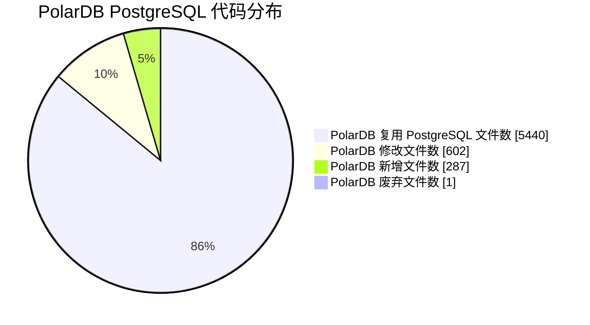

## AI辅助 PolarDB内核学习 - 1 如何快速对比 PolarDB 和 PostgreSQL 的代码差异      
                                                                                               
### 作者                                                                        
digoal                                                                               
                                                                            
### 日期                                                                                         
2025-02-17                                                                              
                                                                                        
### 标签                                                                                      
PostgreSQL , PolarDB , DuckDB , deepseek , AI , 内核 , 代码差异   
                                                                                                 
----                                                                             
                                                                                     
## 背景     
对于已经熟悉PostgreSQL的老司机们, 学习PolarDB代码第一件事可能是先diff一下两个项目的代码. 我们知道PolarDB最新的稳定分支为POLARDB_15_STABLE, 为了对比两者的代码, 可以找POLARDB_15_STABLE 最近一次合并PG 15的分支, 抓取两者当时的代码. 这样可以避免PostgreSQL 新commit的干扰, 也能避免PolarDB 新提交代码的干扰.   
   

   
## 发现两者差异    
1、查看POLARDB_15_STABLE的提交历史  
  
https://github.com/ApsaraDB/PolarDB-for-PostgreSQL/commits/POLARDB_15_STABLE/  
  
可以看到最近的一次从PostgreSQL合并代码的提交, 如下这个提交合并了PostgreSQL REL_15_10分支  
  
https://github.com/ApsaraDB/PolarDB-for-PostgreSQL/pull/538  
```  
Commits on Dec 1, 2024  
  
merge: Merge REL_15_10 into POLARDB_15_STABLE (#538)  
```  
  
注意到PolarDB内含了干净的PostgreSQL代码分支, 可能是为了方便合并代码 :   
- https://github.com/ApsaraDB/PolarDB-for-PostgreSQL/commits/REL_15_10/  
  
REL_15_10 最后一次更新时间小于`(#538) Commits on Dec 1, 2024`  , 可以避免PostgreSQL 新commit的干扰.    
  
所以我们不需要去以下PostgreSQL项目中下载REL_15_10这个分支, 直接使用PolarDB的REL_15_10分支即可.    
    
https://git.postgresql.org/gitweb/?p=postgresql.git;a=tags  
  
https://git.postgresql.org/gitweb/?p=postgresql.git;a=commit;h=a4bd20b6d7f9d42750b797c450592f55d5374c1f  
  
https://github.com/postgres/postgres  
  
https://github.com/postgres/postgres/releases/tag/REL_15_10  
  
2、下载PostgreSQL REL_15_10分支.   
```  
git clone --depth 1 -b REL_15_10 https://github.com/ApsaraDB/PolarDB-for-PostgreSQL polardb_REL_15_10  
```  
  
3、下载PolarDB 合并PostgreSQL REL_15_10分支的那个提交, 可以避免PolarDB 新提交代码的干扰.   
  
方法1, 从commit历史中找到这个commit id对应的zip文件:   
  
https://github.com/ApsaraDB/PolarDB-for-PostgreSQL/commits/POLARDB_15_STABLE/  
  
点击 `Commits on Dec 1, 2024` 相应commit的`<>`符号, Browse repository at this point.   
  
https://github.com/ApsaraDB/PolarDB-for-PostgreSQL/tree/35199b32bf3284b3dbae796c76631bd16c057cf0  
  
点击 页面中的` <> Code `, Download ZIP    
  
解压  
```  
unzip PolarDB-for-PostgreSQL-35199b32bf3284b3dbae796c76631bd16c057cf0.zip    
```  
  
方法2, 下载整个库, 然后checkout到这个commit id, 这个方法要下载所有的提交历史, 内容较多, 推荐方法1:  
```  
git clone -b POLARDB_15_STABLE https://github.com/ApsaraDB/PolarDB-for-PostgreSQL polardb_POLARDB_15_STABLE  
  
cd polardb_POLARDB_15_STABLE  
  
git checkout -b newbranch 35199b32bf3284b3dbae796c76631bd16c057cf0  
```  
  
4、比较两个代码目录, PolarDB代码库中`polar-doc` , `external`这2个目录明显是PolarDB新增的, 可以不用放进来比对.  
  
```  
pb="$HOME/PolarDB-for-PostgreSQL-35199b32bf3284b3dbae796c76631bd16c057cf0"  
pg="$HOME/polardb_REL_15_10"  
  
python compare.py $pb $pg --exclude-dirs polar-doc external   
```  
  
得到结果如下:     
```  
[排除目录] ['polar-doc', 'external']  
  
[PolarDB 特有文件] (287)  
  CONTRIBUTING.md  
  LICENSE  
  NOTICE  
  README.md  
  README_zh.md  
  build.sh  
  contrib/pg_buffercache/expected/polar_buffercache.out  
  contrib/pg_buffercache/pg_buffercache--1.3--1.4.sql  
  contrib/pg_buffercache/sql/polar_buffercache.sql  
  package/debian/build-deb.sh  
  package/debian/control  
  package/rpm/PolarDB.spec  
  ...   
  src/tools/polar_copyright_check.pl  
  src/tools/polar_copyright_exclude_patterns  
  src/tools/polar_sort_subdir.pl  
  
[PostgreSQL 特有文件] (1)  
  src/test/modules/worker_spi/dynamic.conf  
  
[内容差异文件] (602)  
  GNUmakefile.in  
  Makefile  
  configure  
  configure.ac  
  contrib/adminpack/expected/adminpack.out  
  contrib/adminpack/sql/adminpack.sql  
  contrib/amcheck/t/001_verify_heapam.pl  
  ...  
  src/include/storage/ipc.h  
  src/include/storage/lmgr.h  
  src/include/storage/lock.h  
  src/include/storage/lwlock.h  
  ...    
  src/tools/msvc/pgbison.pl  
  src/tools/msvc/vcregress.pl  
  src/tools/pginclude/pgcheckdefines  
  src/tools/pgindent/exclude_file_patterns  
  src/tools/pgindent/perltidyrc  
  src/tools/pgindent/pgindent  
  src/tools/pgindent/pgperltidy  
  src/tools/pgindent/typedefs.list  
  src/tools/win32tzlist.pl  
  
[统计摘要]  
PolarDB总文件: 6329  
PostgreSQL总文件: 6043  
相同文件: 5440  
差异文件: 602  
PolarDB特有: 287  
PostgreSQL特有: 1  
```  
  
排除`polar-doc` , `external`这2个目录后, PolarDB相比PostgreSQL新增了287个代码文件, 修改了602个文件.     
  
使用diff可以对比内容的差异. 例如:    
```  
dfile="src/backend/storage/page/bufpage.c"  
  
diff $pb/$dfile $pg/$dfile  
```  
  
结果如下    
```  
25,27d24  # <开头 $pb/$dfile 第25到27行 ;  加在 $pg/$dfile 第24行之后   
< /* POLAR */  
< #include "storage/polar_fd.h"  
< #include "utils/guc.h"  
1528c1525  # <开头 $pb/$dfile 第1528行 ; >开头 $pg/$dfile 第1525行    
< 		pageCopy = MemoryContextAllocIOAligned(TopMemoryContext, BLCKSZ, 0);  
---  
> 		pageCopy = MemoryContextAlloc(TopMemoryContext, BLCKSZ);  
1550,1613d1546  # <开头 $pb/$dfile 第1550到1613行 ;  加在 $pg/$dfile 第1546行之后     
<   
< /*  
<  * POLAR: polar_page_is_just_inited -- check if page is just inited by PageInit()  
<  * and it has no more modifications.  
<  *  
<  * return true, if just-inited page.  
<  */  
< bool  
< polar_page_is_just_inited(Page page)  
< {  
< 	PageHeader	p = (PageHeader) page;  
< 	XLogRecPtr	lsn;  
< 	size_t	   *pagebytes;  
< 	int			zero_space_lower;  
< 	int			zero_space_upper;  
<   
< 	/*  
< 	 * check lsn first for performance. Most pages aren't just-inited page,  
< 	 * return fastly. For just-inited page, lsn should be 0.  
< 	 */  
< 	lsn = PageGetLSN(page);  
< 	if (lsn != 0)  
< 		return false;  
<   
< 	/* check pagesize and version */  
< 	if (PageSizeIsValid(PageGetPageSize(page)) != true ||  
< 		PageGetPageLayoutVersion(page) != PG_PAGE_LAYOUT_VERSION)  
< 		return false;  
<   
< 	if (p->pd_flags != 0 || p->pd_prune_xid != 0)  
< 		return false;  
<   
< 	if (p->pd_lower != SizeOfPageHeaderData)  
< 		return false;  
<   
< 	if (!(p->pd_upper > p->pd_lower && p->pd_upper <= BLCKSZ))  
< 		return false;  
<   
< 	if (p->pd_special != p->pd_upper)  
< 		return false;  
<   
< 	pagebytes = (size_t *) page;  
<   
< 	/*  
< 	 * Check [p->pd_lower, p->pd_upper) bytes are all zero. Have checked that  
< 	 * (p->pd_lower == SizeOfPageHeaderData) && (p->pd_upper > p->pd_lower &&  
< 	 * p->pd_upper <= BLCKSZ)  
< 	 *  
< 	 * If p->pd_lower is not sizeof(size_t) aligned, [p->pd_lower,  
< 	 * TYPEALIGN(sizeof(size_t), p->pd_lower) is not checked. We think it is  
< 	 * OK. It's the same with p->pd_upper.  
< 	 */  
< 	zero_space_lower = TYPEALIGN(sizeof(size_t), SizeOfPageHeaderData) / sizeof(size_t);  
< 	zero_space_upper = p->pd_upper / sizeof(size_t);  
< 	for (; zero_space_lower < zero_space_upper; zero_space_lower++)  
< 	{  
< 		if (pagebytes[zero_space_lower] != 0)  
< 			return false;  
< 	}  
<   
< 	return true;  
< }  
<   
< /* POLAR end */  
```  
  
## 分屏查看差异文件  
  
  
  
在 macOS 的 Terminal 中实现双屏对比阅读代码文件，可以通过以下两种方式操作：  
  
---  
  
### **方法一：使用 Terminal 自带分屏功能**  
1. **分屏操作**    
   - 打开 Terminal，按 `Command + T` 新建标签页，或按 `Command + D` 横向分屏（需在 Terminal 偏好设置中启用分屏功能）。  
   - 若使用原生 Terminal 分屏效果不佳，推荐安装 **iTerm2**（支持更灵活的分屏操作，如 `Command + D` 横向分屏、`Command + Shift + D` 纵向分屏）。  
  
2. **并排显示文件内容**    
   - 分屏后，在每个窗口中使用 `cat` 或 `less` 命令查看文件：    
     ```bash  
     cat file1.txt      # 左屏显示文件1  
     cat file2.txt      # 右屏显示文件2  
     ```  
   - 若需实时监控文件变化，可使用 `tail -f`：    
     ```bash  
     tail -f file1.txt  # 左屏动态跟踪文件1  
     tail -f file2.txt  # 右屏动态跟踪文件2  
     ```  
  
---  
  
### **方法二：使用命令行对比工具**  
1. **`diff` 命令**    
   直接对比两个文件的差异（输出差异行）：    
   ```bash  
   diff file1.txt file2.txt  # 输出差异部分  
   ```  
  
2. **`vimdiff` 工具**    
   使用 Vim 的对比模式（需安装 Vim）：    
   ```bash  
   vimdiff file1.txt file2.txt  # 分屏高亮显示差异  
   ```  
  
3. **第三方工具（推荐）**    
   - **Meld**：图形化对比工具，支持双屏/三屏差异高亮。    
     ```bash  
     brew install meld  # 通过 Homebrew 安装  
     meld file1.txt file2.txt  
     ```  
   - **Beyond Compare**：功能强大的商业对比工具，支持代码高亮和合并。  
  
---  
  
### **总结建议**  
- **快速分屏阅读**：使用 iTerm2 分屏 + `cat`/`less` 命令。    
- **差异对比**：优先选择 `vimdiff` 或图形化工具 Meld。    
- **进阶需求**：搭配 VSCode 的并排比较功能（需手动操作）。  
  
可根据实际场景选择最适合的方式，工具推荐优先级：`iTerm2 > vimdiff > Meld`。  
  
## 附   
compare.py     
```  
import os  
import argparse  
import hashlib  
  
def collect_files(root_dir, exclude_dirs):  
    files = []  
    exclude_dirs = set(exclude_dirs)  
    for dirpath, dirnames, filenames in os.walk(root_dir, topdown=True):  
        dirnames[:] = [d for d in dirnames if not d.startswith('.') and d not in exclude_dirs]  
        for filename in filenames:  
            if filename.startswith('.'):  
                continue  
            rel_path = os.path.relpath(os.path.join(dirpath, filename), root_dir)  
            files.append(rel_path)  
    return files  
  
def get_file_hash(filepath):  
    hasher = hashlib.md5()  
    try:  
        with open(filepath, 'rb') as f:  
            while True:  
                chunk = f.read(8192)  
                if not chunk:  
                    break  
                hasher.update(chunk)  
        return hasher.hexdigest()  
    except Exception as e:  
        print(f"Error reading file {filepath}: {e}")  
        return None  
  
def main():  
    parser = argparse.ArgumentParser(description='Compare two directories.')  
    parser.add_argument('polardb_dir', help='PolarDB directory path')  
    parser.add_argument('postgresql_dir', help='PostgreSQL directory path')  
    parser.add_argument('--exclude-dirs', nargs='*', default=[], help='Directories to exclude')  
    args = parser.parse_args()  
  
    print(f"[排除目录] {args.exclude_dirs}")  
  
    polar_files = collect_files(args.polardb_dir, args.exclude_dirs)  
    postgres_files = collect_files(args.postgresql_dir, args.exclude_dirs)  
  
    polar_hash = {}  
    for rel_path in polar_files:  
        full_path = os.path.join(args.polardb_dir, rel_path)  
        h = get_file_hash(full_path)  
        if h is not None:  
            polar_hash[rel_path] = h  
  
    postgres_hash = {}  
    for rel_path in postgres_files:  
        full_path = os.path.join(args.postgresql_dir, rel_path)  
        h = get_file_hash(full_path)  
        if h is not None:  
            postgres_hash[rel_path] = h  
  
    polar_set = set(polar_hash.keys())  
    postgres_set = set(postgres_hash.keys())  
  
    polar_only = sorted(polar_set - postgres_set)  
    postgres_only = sorted(postgres_set - polar_set)  
    common = polar_set & postgres_set  
  
    diff_files = [rel_path for rel_path in common if polar_hash[rel_path] != postgres_hash[rel_path]]  
    diff_files_sorted = sorted(diff_files)  
  
    polar_total = len(polar_files)  
    postgres_total = len(postgres_files)  
    same_count = len(common) - len(diff_files)  
  
    print("\n[PolarDB 特有文件] ({})".format(len(polar_only)))  
    for path in polar_only:  
        print(f"  {path}")  
  
    print("\n[PostgreSQL 特有文件] ({})".format(len(postgres_only)))  
    for path in postgres_only:  
        print(f"  {path}")  
  
    print("\n[内容差异文件] ({})".format(len(diff_files_sorted)))  
    for path in diff_files_sorted:  
        print(f"  {path}")  
  
    print("\n[统计摘要]")  
    print(f"PolarDB总文件: {polar_total}")  
    print(f"PostgreSQL总文件: {postgres_total}")  
    print(f"相同文件: {same_count}")  
    print(f"差异文件: {len(diff_files_sorted)}")  
    print(f"PolarDB特有: {len(polar_only)}")  
    print(f"PostgreSQL特有: {len(postgres_only)}")  
  
if __name__ == '__main__':  
    main()  
```  
  
`compare.py`代码使用`deepseek:r1`满血版生成, 感谢杭州深度求索人工智能基础技术研究有限公司.    
  
提示   
````  
polardb是基于postgresql开源代码增强的, 我现在有polardb和postgresql的两套代码, 写一个python脚本, 遍历2个目录, 排除以.开头的文件及目录, 找出两者差异.    
其他功能: 可以排除指定的目录名(目录及子目录的内容都不需要比对), 输出路径时按字符串排序输出.    
其他参考信息: 我的是macos系统, 有python程序.    
  
输出例子    
```  
python compare.py polardb_dir postgresql_dir --exclude-dirs polar-doc external   
  
[排除目录] ['polar-doc', 'external']  
  
[PolarDB 特有文件] (多少个)  
  被找到的文件路径  
  
[PostgreSQL 特有文件] (1)  
  被找到的文件路径  
  
[内容差异文件] (602)  
  被找到的文件路径  
  
[统计摘要]  
PolarDB总文件: 6329  
PostgreSQL总文件: 6043  
相同文件: 5440  
差异文件: 602  
PolarDB特有: 287  
PostgreSQL特有: 1  
```    
````  
  
# 如何阅读PolarDB 代码?  
1、如何阅读PolarDB 代码?  
   
提示  
````  
polardb是基于postgresql开源代码增强的数据库, 我已找出两套代码的差异如下, 请总结一下代码差异, 同时给出如何阅读PolarDB代码的指南?      
```  
[排除目录] ['polar-doc', 'external']  
...  
```  
````  
  
看 deepseek V3 怎么说.   
  
### 代码差异总结  
  
PolarDB 是基于 PostgreSQL 开源代码增强的数据库，从代码差异分析中可以看出，PolarDB 在 PostgreSQL 的基础上进行了大量的扩展和优化。以下是代码差异的主要总结：  
  
1. **PolarDB 特有文件**：  
   - PolarDB 新增了 287 个特有文件，这些文件主要集中在以下几个方面：  
     - **存储管理**：如 `polar_bufmgr.c`、`polar_copybuf.c`、`polar_flush.c` 等，优化了缓冲区和存储管理。  
     - **日志管理**：如 `polar_logindex.c`、`polar_logindex_redo.c` 等，增强了日志索引和重做机制。  
     - **并行处理**：如 `polar_parallel_bgwriter.c`，引入了并行后台写进程。  
     - **网络和锁管理**：如 `polar_network_stats.c`、`polar_lock_stats.c`，增加了网络统计和锁统计功能。  
     - **工具和测试**：如 `polar_tools` 目录下的工具，提供了多种 PolarDB 特有的工具和测试用例。  
  
2. **文件差异**：  
   - PolarDB 和 PostgreSQL 有 602 个文件存在差异，这些差异主要体现在对 PostgreSQL 原有功能的增强和优化上。例如，PolarDB 在 PostgreSQL 的存储、日志、并行处理等方面进行了深度定制和优化。  
  
3. **相同文件**：  
   - PolarDB 和 PostgreSQL 有 5440 个文件是相同的，这些文件主要集中在 PostgreSQL 的核心功能和基础模块上，表明 PolarDB 在核心功能上保持了与 PostgreSQL 的兼容性。  
  
4. **PostgreSQL 特有文件**：  
   - PostgreSQL 有 1 个特有文件，这表明 PolarDB 几乎完全覆盖了 PostgreSQL 的功能，并在其基础上进行了扩展。  
  
### 阅读 PolarDB 代码的指南  
  
要有效地阅读和理解 PolarDB 的代码，可以按照以下步骤进行：  
  
1. **熟悉 PostgreSQL 代码**：  
   - 由于 PolarDB 是基于 PostgreSQL 的，因此首先需要熟悉 PostgreSQL 的代码结构和核心模块。可以参考 PostgreSQL 的官方文档和源码分析资料。  
  
2. **了解 PolarDB 的架构和特性**：  
   - 阅读 PolarDB 的官方文档，了解其架构设计、核心特性和优化点。这有助于理解 PolarDB 在 PostgreSQL 基础上所做的改进。  
  
3. **从核心模块入手**：  
   - 从 PolarDB 的核心模块入手，如存储管理 (`src/backend/storage`)、日志管理 (`src/backend/access/logindex`)、并行处理 (`src/backend/postmaster`) 等，逐步深入理解其实现细节。  
  
4. **阅读特有文件和差异文件**：  
   - 重点阅读 PolarDB 的特有文件和与 PostgreSQL 存在差异的文件，理解 PolarDB 在这些模块中所做的优化和扩展。  
  
5. **使用调试工具**：  
   - 使用调试工具（如 GDB）对 PolarDB 进行调试，跟踪代码的执行流程，深入理解其内部机制。  
  
6. **参考测试用例**：  
   - 阅读 PolarDB 的测试用例 (`src/test` 目录)，了解各个模块的功能和测试方法，这有助于理解代码的实际应用场景。  
  
7. **参与社区和讨论**：  
   - 参与 PolarDB 的社区讨论，与其他开发者交流，获取更多的代码阅读和理解的经验。  
  
通过以上步骤，可以逐步深入理解 PolarDB 的代码，掌握其核心技术和优化点。  
  
---  
    
2、代码分析饼图   
   
提示  
```
使用mermaid画饼图, 表达如下数据:
总文件: 6329
PolarDB 复用 PostgreSQL 文件: 5440
PolarDB 修改文件数: 602
PolarDB 新增文件: 287
PolarDB 废弃文件: 1
```
  
代码如下:    
````

````
   
  
#### [期望 PostgreSQL|开源PolarDB 增加什么功能?](https://github.com/digoal/blog/issues/76 "269ac3d1c492e938c0191101c7238216")
  
  
#### [PolarDB 开源数据库](https://openpolardb.com/home "57258f76c37864c6e6d23383d05714ea")
  
  
#### [PolarDB 学习图谱](https://www.aliyun.com/database/openpolardb/activity "8642f60e04ed0c814bf9cb9677976bd4")
  
  
#### [PostgreSQL 解决方案集合](../201706/20170601_02.md "40cff096e9ed7122c512b35d8561d9c8")
  
  
#### [德哥 / digoal's Github - 公益是一辈子的事.](https://github.com/digoal/blog/blob/master/README.md "22709685feb7cab07d30f30387f0a9ae")
  
  
#### [About 德哥](https://github.com/digoal/blog/blob/master/me/readme.md "a37735981e7704886ffd590565582dd0")
  
  

  
