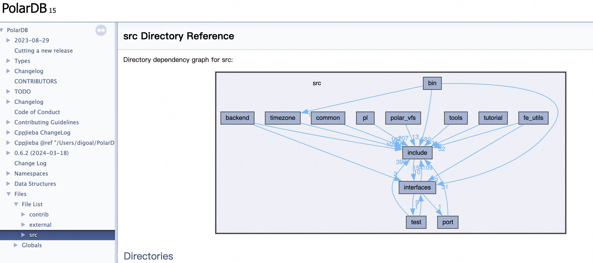
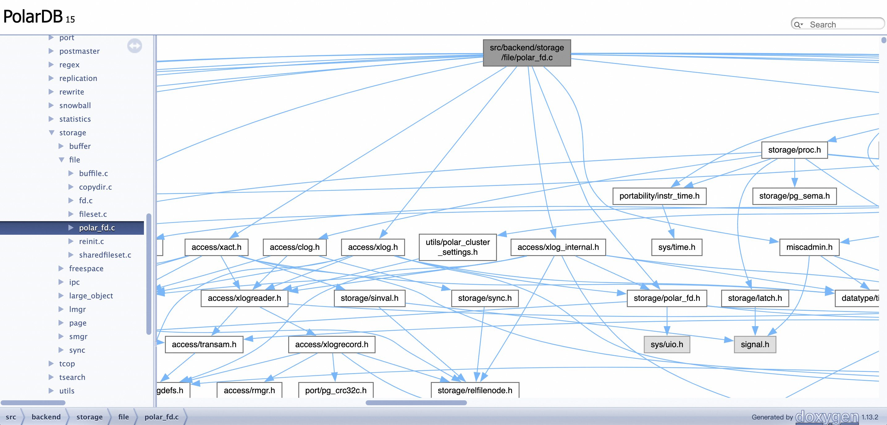
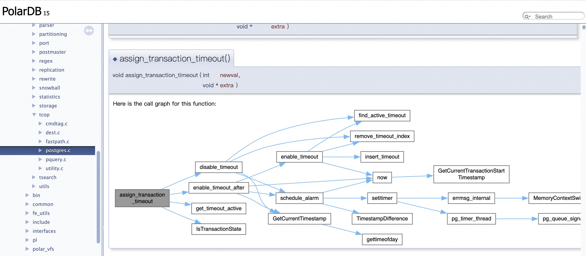
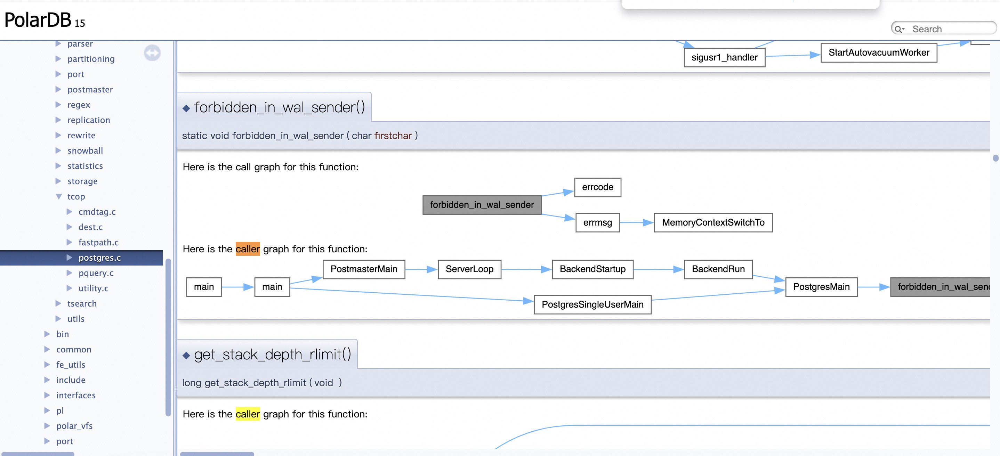

## AI辅助 PolarDB内核学习 - 2 用doxygen生成PolarDB代码逻辑和结构图  
                                                                                                 
### 作者                                                                          
digoal                                                                                 
                                                                              
### 日期                                                                                           
2025-02-17                                                                                
                                                                                          
### 标签                                                                                        
PostgreSQL , PolarDB , DuckDB , doxygen , 调用逻辑    
                                                                                                   
----                                                                               
                                                                                       
## 背景     
读过PostgreSQL代码的同学, 对doxygen肯定不陌生, doxygen 生成的调用关系图可以帮助开发者更好地理解代码结构和逻辑。PostgreSQL直接提供了一个doxygen网站, 无需线下部署.    
- https://doxygen.postgresql.org/  
  
PolarDB 没有提供此类网站, 需要线下部署doxygen生成html. 下面简单介绍如何使用doxygen生成PolarDB代码逻辑和结构图.     
  
  
    
## 配置doxygen   
  
首先克隆PolarDB 代码.     
```  
cd ~  
git clone --depth 1 -b POLARDB_15_STABLE https://github.com/ApsaraDB/PolarDB-for-PostgreSQL  
```  
  
然后再配置doxygen, 生成html, 最后即可打开生成的html文件, 方便更好地理解代码逻辑和结构。    
  
### 1. **安装 Doxygen**   
- **Linux**:  
  ```bash  
  sudo apt-get install doxygen  
  sudo apt-get install graphviz  # 用于生成调用关系图  
  ```  
- **macOS**:   
  ```bash   
  export HOMEBREW_NO_AUTO_UPDATE=1   
  brew install doxygen  
    
  brew install autoconf automake libtool pkg-config bison   
  echo "export PATH=\"/opt/homebrew/opt/bison/bin:\$PATH\"" >>~/.bash_profile  
  . ~/.bash_profile   
  
  curl https://gitlab.com/graphviz/graphviz/-/archive/12.2.1/graphviz-12.2.1.tar.gz -o ./graphviz-12.2.1.tar.gz  
  tar -zxvf graphviz-12.2.1.tar.gz  
  cd graphviz-12.2.1  
  ./autogen.sh  
  ./configure  
  make -j 4  
  sudo make install  
  
  # // brew install graphviz    # 依赖macos版本, 低版本使用上面的方法直接编译graphviz.     
  ```  
  
### 2. **配置 Doxygen**  
1. **生成配置文件**：  
   在代码根目录下运行以下命令生成默认配置文件：  
   ```bash  
   cd ~/PolarDB-for-PostgreSQL  
   doxygen -g  
   ```  
   这会生成一个名为 `Doxyfile` 的配置文件。  
  
2. **编辑配置文件**：  
   使用文本编辑器打开 `Doxyfile`，修改以下关键配置：  
   - `INPUT`：指定代码路径，例如 下面3个目录含项目的主要c代码. ：    
     ```  
     INPUT = src contrib external    
     ```  
   - `RECURSIVE`：设置为 `YES`，以递归扫描子目录：  
     ```  
     RECURSIVE = YES  
     ```  
   - `EXTRACT_ALL`：设置为 `YES`，提取所有代码的文档：  
     ```  
     EXTRACT_ALL = YES  
     ```  
   - `EXTRACT_PRIVATE`：设置为 `YES`，提取私有成员：  
     ```  
     EXTRACT_PRIVATE = YES  
     ```  
   - `EXTRACT_STATIC`：设置为 `YES`，提取静态成员：  
     ```  
     EXTRACT_STATIC = YES  
     ```  
   - `HAVE_DOT`：设置为 `YES`，启用 Graphviz 生成调用关系图：  
     ```  
     HAVE_DOT = YES  
     ```  
   - `CALL_GRAPH` 和 `CALLER_GRAPH`：设置为 `YES`，生成函数调用关系图：  
     ```  
     CALL_GRAPH = YES  
     CALLER_GRAPH = YES  
     ```  
   - `OUTPUT_DIRECTORY`：指定输出目录，例如：  
     ```  
     OUTPUT_DIRECTORY = ./doxygen_docs  
     ```  
   - `EXCLUDE` **过滤文件**：如果某些文件不需要生成文档，可以在 `Doxyfile` 中配置 `EXCLUDE`，例如：  
     ```  
     EXCLUDE = ./.cirrus.star ./.cirrus.tasks.yml ./.cirrus.yml ./.dir-locals.el ./.editorconfig ./.git ./.git-blame-ignore-revs ./.gitattributes ./.github ./.gitignore  
     ```  
   - `GENERATE_LATEX` **生成 LaTeX 文档** 如果需要生成 PDF 文档，可以在 `Doxyfile` 中启用 LaTeX 支持, 不使用可以关闭：  
     ```  
     GENERATE_LATEX = NO  
     ```  
   - `DOT_GRAPH_MAX_NODES` 调用数限制 , DOT_GRAPH_MAX_NODES 的最佳值取决于你的代码库的复杂程度和你的需求。 你需要找到一个平衡点，既能显示足够的调用信息，又能避免生成过于庞大的图形。    
     ```  
     DOT_GRAPH_MAX_NODES    = 50  # 节点数限制
     MAX_DOT_GRAPH_DEPTH = 3  # 层级限制 , 太大都会导致图片太大, 不好看. 
     ```  
   - 其他    
     ```  
     PROJECT_NAME           = "PolarDB"  
     PROJECT_NUMBER         = "15"  
     OPTIMIZE_OUTPUT_FOR_C  = YES   # 如果项目是纯c写的, 设置这个可以优化doxygen生成速度
     SOURCE_BROWSER = YES
     VERBATIM_HEADERS = YES
     DOT_IMAGE_FORMAT = svg  # 默认png, 如果报错, 可以改成svg
     WARN_IF_DOC_ERROR = NO  # 忽略特定警告. 例如 在 repack_indexdef 函数的 Doxygen 注释中，使用了 @param 标签来描述参数，但这些参数并未在函数的实际参数列表中找到。  repack.c:782: warning: argument 'boolean' of command @param is not found in the argument list of repack_indexdef(PG_FUNCTION_ARGS)  
     ```  
  
更多配置说明请参考模板文件Doxyfile.    
  
### 3. **生成文档**  
  
确保有足够的剩余磁盘空间, 生成的文件可能有点大(取决配置, 以上配置大概几个GB). 另外, 这个操作有点耗时, 需要有点耐心.      
  
在代码根目录下运行以下命令生成文档：  
```bash  
   cd ~/PolarDB-for-PostgreSQL  
   doxygen Doxyfile  
```  
生成的文档会保存在 `OUTPUT_DIRECTORY` 指定的目录中（例如 `./doxygen_docs`）。      
   
```
# 日志
... 
Patching output file 74036/74037
Patching output file 74037/74037
type lookup cache used 65536/65536 hits=871795 misses=94954
symbol lookup cache used 65536/65536 hits=1989057 misses=281754
Note: based on cache misses the ideal setting for LOOKUP_CACHE_SIZE is 3 at the cost of higher memory usage.
finished...
```
    
### 4. **查看文档**  
1. 打开生成的文档目录（例如 `./doxygen_docs/html`）。  
2. 找到 `index.html` 文件，用浏览器打开。  如 打开浏览器:  `file:///Users/digoal/PolarDB-for-PostgreSQL/doxygen_docs/html/index.html`   
3. 在浏览器中浏览代码的文档、类图、调用关系图等。  
  
通过以上步骤，你可以轻松使用 Doxygen 阅读本地代码，并生成详细的文档和调用关系图，帮助你更好地理解代码逻辑和结构。  
   
目录依赖关系     
  
  
文件依赖关系  
  
  
函数调用关系  
  
   
函数被调用关系    
  
  
  
  
## 其他建议  
  
### 1. **优化 Doxygen 使用**  
- **添加注释**：  
  在代码中添加 Doxygen 风格的注释，例如：  
  ```c  
  /**  
   * @brief 这是一个示例函数  
   * @param a 参数a  
   * @param b 参数b  
   * @return 返回a + b  
   */  
  int add(int a, int b) {  
      return a + b;  
  }  
  ```  
  这样生成的文档会更加详细。  
  
### 2. **结合 IDE 使用**  
- **VSCode**：  
  安装 `C/C++` 插件和 `Doxygen Documentation Generator` 插件，可以直接在代码中生成 Doxygen 注释。  
- **CLion**：  
  支持 Doxygen 注释高亮和文档生成。  
- **Eclipse**：  
  安装 `Doxygen` 插件，可以直接生成和查看文档。  
  
### 3、把doxygen生成好的PolarDB源码调用逻辑发布给HTTP服务, 供他人访问
比较简单的方法如下:   
   
1、创建http server：  
```  
进入到html目录  
cd ~/PolarDB-for-PostgreSQL/doxygen_docs/html  
  
启动http服务, 指定监听8000  
python3 -m http.server -b 0.0.0.0 8000  
   
8000：是端口，可以按需修改  
```  
  
```  
$ python3 -m http.server --help  
usage: server.py [-h] [--cgi] [-b ADDRESS] [-d DIRECTORY] [-p VERSION] [port]  
  
positional arguments:  
  port                  bind to this port (default: 8000)  
  
options:  
  -h, --help            show this help message and exit  
  --cgi                 run as CGI server  
  -b ADDRESS, --bind ADDRESS  
                        bind to this address (default: all interfaces)  
  -d DIRECTORY, --directory DIRECTORY  
                        serve this directory (default: current directory)  
  -p VERSION, --protocol VERSION  
                        conform to this HTTP version (default: HTTP/1.0)  
```  
  
2、浏览内容：  
  
浏览器中访问 `http://$hostip:8000`   
   
如果要浏览某个文件的源代码文件, 链接后面加`_source` ; 例如:   
- http://127.0.0.1:8000/polar__procpool_8h.html 
- http://127.0.0.1:8000/polar__procpool_8h_source.html 
  
       
  
#### [期望 PostgreSQL|开源PolarDB 增加什么功能?](https://github.com/digoal/blog/issues/76 "269ac3d1c492e938c0191101c7238216")
  
  
#### [PolarDB 开源数据库](https://openpolardb.com/home "57258f76c37864c6e6d23383d05714ea")
  
  
#### [PolarDB 学习图谱](https://www.aliyun.com/database/openpolardb/activity "8642f60e04ed0c814bf9cb9677976bd4")
  
  
#### [PostgreSQL 解决方案集合](../201706/20170601_02.md "40cff096e9ed7122c512b35d8561d9c8")
  
  
#### [德哥 / digoal's Github - 公益是一辈子的事.](https://github.com/digoal/blog/blob/master/README.md "22709685feb7cab07d30f30387f0a9ae")
  
  
#### [About 德哥](https://github.com/digoal/blog/blob/master/me/readme.md "a37735981e7704886ffd590565582dd0")
  
  

  
