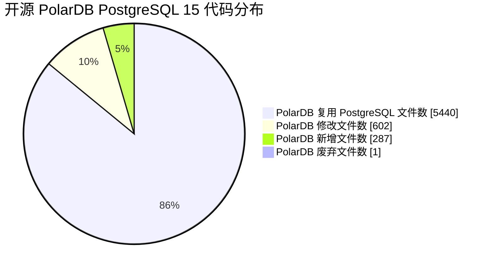

## 用AI学PolarDB PostgreSQL数据库内核源码 系列课程  
                                                                                                      
### 作者                                                                          
digoal                                                                          
                                                                                 
### 日期                                                                               
2025-02-18                                                                     
                                                                              
### 标签                                                                            
PostgreSQL , PolarDB , DuckDB , AI , 内核 , 学习  
                                                                                                     
----                                                                              
                                                                                            
## 背景      
数据库行业从业20多年, 一直有个心结: 什么时候在PostgreSQL这样的国际知名开源社区能有大量中国贡献者呢?   
  
中国贡献者寥寥无几, 可能和这些原因有关:   
- 1、语言问题, 英语交流障碍筛掉了一波人.    
- 2、门槛较高, 至少得掌握C、算法、数据结构、数据库原理等, 又筛掉一大波人.  
- 3、整理好的从0到1的自学成才素材较少, 又筛掉一波真正有兴趣的人.  以下这种适合自学类型的书籍太少了.  
    - 《Hello 算法》: 
        - https://www.hello-algo.com/
        - https://github.com/d2l-ai/d2l-zh
    - 《动手学深度学习》: 
        - https://zh.d2l.ai/
        - https://d2l.ai/
    - 《Deep Learning Book Chinese Translation》: 
        - https://github.com/exacity/deeplearningbook-chinese
        - https://exacity.github.io/deeplearningbook-chinese/
    - 目前较好的 interDB/inernals 都是偏DBA的.  
        - https://www.interdb.jp/dl/part01.html
        - https://postgrespro.com/community/books/internals
- 4、商业驱动, 数据库内核人才算是高端型的, 虽然薪水不低, 但是需求量不算太大, 主要集中在数据库厂商、云厂商、大型央国企, 又筛掉一波人.    
- 5、缺乏内核开发者的人才认定标准. 只能通过开源贡献、职业经历来判断, 使得这个圈子很难扩散.    
    
现在数据库内核人才基本上都是从大学学习计算机专业出身, 校招进入数据库研发型的企业逐步成长而来. 进入企业后转行的非常之少, 我个人认为不是他们不想转, 可能真的是缺乏自学成才的体系化素材. 就像2000年时, 很多网络工程师的诉求, 还真有一些农民工转行成为网络工程师的. 不是开玩笑, Cisco认证做得好啊.    
  
我特别想做一件事:   
  
1、解决自学成才门槛问题. 面向大学生、传统的DBA、深度使用数据库的应用开发者, 打造从0到1的自学成才素材, 把门槛降下来. 这批人有一定的基础和学习冲动, 基数够大. 让有兴趣的人因为职业发展去主动自学.   
  
有了更多的人才后, 企业对人才也会提出更多的要求. 例如, 用户侧可能也会有数据库内核开发能力的要求, 至少能读懂内核代码, 不被厂商忽悠, 更进一步可以分析bug或者修bug, 甚至可以结合自身业务改进数据库内核功能.    
  
学完之后, 能逐步达到: <b>“熟悉开源协作流程、读懂数据库内核代码、分析BUG、修复BUG、开发插件或内核功能”</b> 的水平. 辅以AI编程, 达到这个水平比预想的可能要快, 后面就是熟练程度问题了.    
  
2、建立认证体系.   
  
一个人的力量肯定是不够的, 得抱紧我的好兄弟们. 高校老师朋友们、生态企业和机构(如PG/PolarDB社区、周边生态公司们、培训机构如cuug等)、数据库领域KOL(如海波)、大厂和国央企们 一起联合发布.    
  
首先的教学产品是<b>结合了国际热门开源数据库PostgreSQL血统的国产开源的产品 PolarDB for PostgreSQL</b>  
  

  
说到不如做到, 我已经开始用AI在进行课程打造的实践了, 持续更新中:       
  
[《用AI修改pg_bulkload代码, 适配PolarDB PFS, 大幅度提升数据批量导入性能》](../202501/20250102_01.md)    
    
[《PolarDB内核学习 - 1 如何快速对比 PolarDB 和 PostgreSQL 的代码差异》](../202502/20250217_01.md)    
  
[《PolarDB内核学习 - 2 用doxygen生成PolarDB代码逻辑和结构图》](../202502/20250217_02.md)    
    
之前面向DBA打造的课程也欢迎关注: 
- [《开源PolarDB 基础课程》](../202401/20240123_02.md)  
- [《开源PolarDB 进阶课程》](../202501/20250114_01.md)     
   
