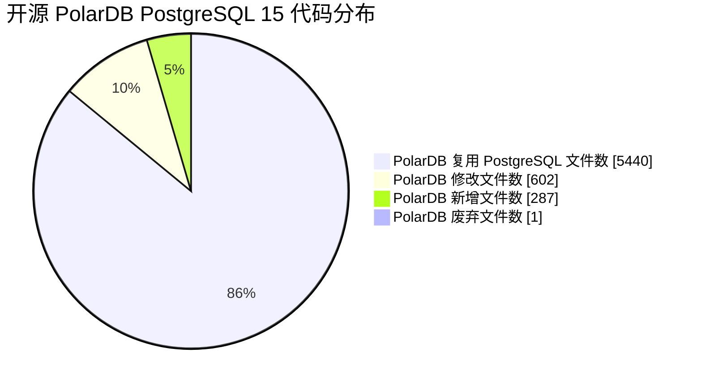

## AI辅助 学PolarDB/PostgreSQL数据库内核源码 系列课程, 含古典学习曲线及素材建议
                                                                                                      
### 作者                                                                          
digoal                                                                          
                                                                                 
### 日期                                                                               
2025-02-18                                                                     
                                                                              
### 标签                                                                            
PostgreSQL , PolarDB , DuckDB , AI , 内核 , 学习  
                                                                                                     
----                                                                              
                                                                                            
## 背景      
数据库行业从业20多年, 一直有个心结: 什么时候在PostgreSQL这样的国际知名开源社区能有大量中国贡献者呢?   
  
中国贡献者寥寥无几, 可能和这些原因有关:   
- 1、语言问题, 英语交流障碍筛掉了一波人.    
- 2、门槛较高, 至少得掌握C、算法、数据结构、数据库原理等, 又筛掉一大波人.  
- 3、整理好的从0到1的自学成才素材较少, 又筛掉一波真正有兴趣的人.  以下这种适合自学类型的书籍太少了.  
    - 《Hello 算法》: 
        - https://www.hello-algo.com/
        - https://github.com/d2l-ai/d2l-zh
    - 《动手学深度学习》: 
        - https://zh.d2l.ai/
        - https://d2l.ai/
    - 《Deep Learning Book Chinese Translation》: 
        - https://github.com/exacity/deeplearningbook-chinese
        - https://exacity.github.io/deeplearningbook-chinese/
    - 目前较好的 interDB/inernals 都是偏DBA的.  
        - https://www.interdb.jp/dl/part01.html
        - https://postgrespro.com/community/books/internals
- 4、商业驱动, 数据库内核人才算是高端型的, 虽然薪水不低, 但是需求量不算太大, 主要集中在数据库厂商、云厂商、大型央国企, 又筛掉一波人.    
- 5、缺乏内核开发者的人才认定标准. 只能通过开源贡献、职业经历来判断, 使得这个圈子很难扩散.   
- 6、相关专业的大学生没有被调动起来.   
    
现在数据库内核人才大都大学计算机专业出身, 校招进入数据库研发型的企业逐步成长而来. 进入企业后转行的非常之少, 我个人认为不是他们不想转, 可能真的是缺乏自学成才的体系化素材. 就像2000年时, 很多网络工程师的诉求, 还真有一些农民工转行成为网络工程师的. 不是开玩笑, Cisco认证做得好啊.    
  
我特别想做一件事:   
  
1、解决自学成才门槛问题. 面向大学生、传统的DBA、深度使用数据库的应用开发者, 打造从0到1的自学成才素材, 把门槛降下来. 这批人有一定的基础和学习冲动, 基数够大. 让有兴趣的人因为职业发展去主动自学.   
  
有了更多的人才后, 企业对人才也会提出更多的要求. 例如, 用户侧可能也会有数据库内核开发能力的要求, 至少能读懂内核代码, 不被厂商忽悠, 更进一步可以分析bug或者修bug, 甚至可以结合自身业务改进数据库内核功能.    
  
学完之后, 能逐步达到: <b>“熟悉开源协作流程、读懂数据库内核代码、分析BUG、修复BUG、开发插件或内核功能”</b> 的水平. 辅以AI编程, 达到这个水平比预想的可能要快, 后面就是熟练程度问题了.    
  
2、建立认证体系.   
  
一个人的力量肯定是不够的, 得抱紧我的好兄弟们. 高校老师朋友们、生态企业和机构(如PG/PolarDB社区、周边生态公司们、培训机构如cuug等)、数据库领域KOL/内核开发老司机(如海波,老楼,老章,老纪等老司机)、大厂和国央企们 一起联合发布.    
  
首批进入教学产品是<b>结合了国际热门开源数据库PostgreSQL血统的国产开源的产品 PolarDB for PostgreSQL. 当然, 只拿PolarDB PostgreSQL开源来分享肯定无法吸引到其他数据库企业的老司机们参与进来, 例如protonBase, cloudberry, haloDB, 柏睿数据, apecloud, 等都是高手如云的公司. 如果能一起建设这个课程真的太棒了. 所以课程肯定不会只有PolarDB PostgreSQL开源. 期待 </b>  
  

  
<b> 说到不如做到, 我已经开始用AI在进行课程打造的实践了, 持续更新中: </b>        
- [《用AI修改pg_bulkload代码, 适配PolarDB PFS, 大幅度提升数据批量导入性能》](../202501/20250102_01.md)    
- [《AI辅助 PolarDB内核学习 - 1 如何快速对比 PolarDB 和 PostgreSQL 的代码差异》](../202502/20250217_01.md)    
- [《AI辅助 PolarDB内核学习 - 2 用doxygen生成PolarDB代码逻辑和结构图》](../202502/20250217_02.md)    
- [《纯AI 学数据库内核开发 | 预备知识 gdb》](../202502/20250219_02.md)  
- [《纯AI 学数据库内核开发 | 预备知识 Valgrind》](../202502/20250219_03.md)
- [《AI辅助 PolarDB内核学习 - 10 如何分析内核态和用户态性能瓶颈》](../202503/20250305_02.md)  
- [《AI辅助 PolarDB内核学习 - 3 git + AI 解读patch》](../202502/20250220_05.md)  
- [《AI辅助 PolarDB内核学习 - 4 解读入口点代码`main.c`》](../202502/20250224_04.md)  
- [《AI辅助 PolarDB内核学习 - 5 解读PolarDB PostgreSQL 15 postmaster的入口点`PostmasterMain`函数》](../202502/20250224_05.md)  
- [《AI辅助 PolarDB内核学习 - 6 解读PolarDB PostgreSQL 15 bootstrap.c》](../202502/20250227_02.md)  
- [《AI辅助 PolarDB内核学习 - 7 libpq代码总览》](../202503/20250303_02.md)  
- [《AI辅助 PolarDB内核学习 - 8 tcop (Traffic cop) 用户请求指挥官》](../202503/20250304_04.md)  
- [《AI辅助 PolarDB内核学习 - 9 parser SQL解析器》](../202503/20250304_05.md)
- [《AI辅助 PolarDB内核学习 - 10 如何分析内核态和用户态性能瓶颈》](../202503/20250305_02.md)
- [《AI辅助 PolarDB内核学习 - 11 rewrite (SQL规则重写器)》](../202503/20250307_01.md)
- [《AI辅助 PolarDB内核学习 - 12 optimizer 概览 (优化器的工作原理)》](../202503/20250310_02.md)
- [《AI辅助 PolarDB内核学习 - 13 path (路径生成)代码概览》](../202503/20250314_04.md)
- [《AI辅助 PolarDB内核学习 - 14 path(路径生成) 之 选择性(clausesel.c)代码》](../202503/20250314_05.md)  
   
   
... 了解内核运行逻辑, 调试代码, 修改代码 ...   
   
提示:  
```
请给出以下代码的详细介绍(内容要求: 包含函数的功能和调用逻辑梳理, 生动并易于理解, 越详细越好; 尽量使用图形帮助理解内容(可以使用mermaid绘制, 如果mermaid无法正确表达意图则建议改用text绘图); 可能的话, 可以再提出一些优化或修改建议, 并给出一些优化或修改的代码实例帮助用户理解;) 

cat src/backend/storage/ipc/polar_procpool.c
or 
git show commit_id file
```
    
# 附录
学习曲线(参考deepseek-r1建议)      
  
1、<b>数据库原理</b>  
- [《The Internals of PostgreSQL》](http://www.interdb.jp/pg/)  
- [《PostgreSQL 14 Internals》](https://postgrespro.com/community/books/internals)  
- [《2024-数据库筑基课 系列》](../202409/20240914_01.md)
- [《数据库系统概念 Database System Concepts》](https://book.douban.com/subject/35501216/)   理论基石，适合理解数据库设计原理, 配套视频:  
    - https://15445.courses.cs.cmu.edu/fall2023/
    - https://15445.courses.cs.cmu.edu/spring2025/
    - https://www.youtube.com/playlist?list=PLSE8ODhjZXjbj8BMuIrRcacnQh20hmY9g
- [《Readings in Database Systems》](https://book.douban.com/subject/2256069/)   （Red Book）: 收录经典论文，适合进阶学习。
    - http://www.redbook.io/
  
2、<b>数据库管理和优化</b>   
- [《开源PolarDB 基础课程》](../202401/20240123_02.md)        
- [《开源PolarDB 进阶课程》](../202501/20250114_01.md)        
- [《2010-PostgreSQL, Greenplum管理、优化视频 (提取码: 5nox 失效请通知我谢谢)》](https://pan.baidu.com/s/1Q5u5NSrb0gL5-psA9DCBUQ)    
- [《2019-PostgreSQL 2天体系化培训 - 适合DBA》](../201901/20190105_01.md)    
- [《2019-PG天天象上沙龙纪录 - 适合DBA》](../201801/20180121_01.md)    
- [《2019-Oracle迁移到PostgreSQL - 适合DBA与业务开发者》](../201906/20190615_03.md)      
- [《2021-Ask 德哥 系列 - 适合DBA与业务开发者》](../202109/20210928_01.md)      
- [《2022-每天5分钟,PG聊通透 - 系列1 - 热门问题》](../202112/20211209_02.md)     
- [《Oracle DBA 增值+转型 PostgreSQL 学习方法、路径》](../201804/20180425_01.md)     
- [《2024-开源PolarDB|PostgreSQL 应用开发者&DBA 公开课》](../202310/20231030_02.md)
- 补充规模化管理 : https://github.com/apecloud/kubeblocks  
  
3、<b>应用场景与架构</b>  
- [《2017-PostgreSQL 应用场景实践 - 适合架构师与业务开发者》](../201805/20180524_02.md)    
- [《数据库选型之 - 大象十八摸 - 致 架构师、开发者》](../201702/20170209_01.md)      
- [《PostgreSQL、Greenplum 技术+108个场景结合最佳实践《如来神掌》》](../201706/20170601_02.md)     
- [《2018-PG生态、案例、开发实践系列 - 适合架构师与业务开发者》](https://edu.aliyun.com/course/836/lesson/list)    
- [《2018-阿里云POLARDB for Oracle|RDS for PPAS 讲解视频》](https://yq.aliyun.com/live/582)    
- [《2020-PostgreSQL 应用场景最佳实践 - 适合架构师与业务开发者》](../202009/20200903_02.md)    
- [《2020-PostgreSQL+MySQL 联合解决方案课程 - 适合架构师与业务开发者》](../202001/20200118_02.md)    
- [《2021-重新发现PG之美 系列 - 适合架构师与业务开发者》](../202105/20210526_02.md)    
- [《2023-PostgreSQL|PolarDB 学习实验手册》](../202308/20230822_02.md)       
- [《欢迎关注digoal其他文章》](../README.md)    
  
4、<b>数据库产品需求和选型</b>   
- [《2021-DB吐槽大会 系列 - 适合产品经理、架构师与内核开发者》](../202108/20210823_05.md)    
- [《企业数据库选型规则》](../197001/20190214_01.md)      
- [《数据库选型思考(PostgreSQL,MySQL,Oracle)》](../201702/20170208_03.md)     
- [《云、商业、开源数据库终局之战 - 商业角度解读PG如何破局 - openapi 、 扩展能力、插件开源协议》](../202007/20200727_04.md)      
- [《[直播]大话数据库终局之战》](../202009/20200926_03.md)        
- [《未来数据库方向 - 以及PostgreSQL 有价值的插件、可改进功能、开放接口 (202005)》](../202005/20200527_06.md)      
  
5、<b>C</b>   
- 入门经典  
    - 《C Primer Plus》（第6版）  作者：Stephen Prata  
- 进阶  
    - 《Expert C Programming: Deep C Secrets》  作者：Peter van der Linden  
    - 《C陷阱与缺陷》（C Traps and Pitfalls）  作者：Andrew Koenig  
    - 《Pointers on C》（C和指针）  作者：Kenneth A. Reek    
  
6、<b>Unix/Linux编程</b>   
- 系统编程进阶  
    - 《Unix/Linux编程实践教程》    
        - 简介：通过大量实践案例（如文件操作、进程管理、信号处理）讲解系统编程，适合边学边练。    
        - 学习目标：理解系统调用、文件 I/O、进程线程等核心概念。  
    - 《Linux/UNIX系统编程手册》（上下册）    
        - 英文名：*The Linux Programming Interface*    
        - 简介：系统编程领域的权威著作，覆盖 1000+ 系统调用和 API，适合深入学习和长期参考。    
        - 学习目标：掌握 Linux 系统级开发技术，如信号、进程间通信、多线程等。  
- 底层与网络编程  
    - 《Unix环境高级编程（APUE）》    
        - 英文名：*Advanced Programming in the UNIX Environment*    
        - 简介：被誉为“UNIX 编程圣经”，涵盖文件系统、进程控制、信号、网络 IPC 等高级主题。    
        - 学习目标：深入理解 UNIX 编程模型，为数据库底层开发打下基础。  
    - 《Unix网络编程》（卷1：套接字联网API）    
        - 英文名：*UNIX Network Programming, Volume 1*    
        - 简介：详解网络编程核心技术（如 TCP/IP、套接字、多路复用），对数据库网络通信实现至关重要。    
        - 学习目标：掌握高并发网络服务开发能力。  
- 内核与性能优化  
    - 《深入理解Linux内核》    
        - 英文名：*Understanding the Linux Kernel*    
        - 简介：解析 Linux 内核设计（如进程调度、内存管理、文件系统），适合研究数据库存储引擎等底层实现。    
        - 学习目标：理解内核机制，优化数据库性能。  
    - 《Linux内核设计与实现》    
        - 英文名：*Linux Kernel Development*    
        - 简介：以简洁的代码和图示讲解内核核心模块，适合结合实践学习。    
        - 学习目标：掌握内核模块开发与调试技巧。  
    - 《Unix编程艺术》    
        - 简介：从设计哲学角度讲解 UNIX 工具链和模块化思想，帮助构建高可维护性数据库系统。    
  
7、<b>数据库实现</b>  
- [《PostgreSQL数据库内核分析》](https://book.douban.com/subject/6971366/)  
- [《数据库系统实现 - Database System Implementation》](https://book.douban.com/subject/1859488/)  
- [《手搓x系列, 含手搓数据库》](../202406/20240603_01.md)    
    - https://github.com/codecrafters-io/build-your-own-x    
    - https://cstack.github.io/db_tutorial/  
- 刷题? LeetCode
    - https://github.com/doocs/leetcode   
  
其他:
  
---  
  
**卡内基梅隆大学（CMU）** 针对 计算机科学、工程及算法竞赛（如ACM-ICPC）领域的优质资源整理：  
  
### **一、CMU官方开放课程与教材**  
1. **《Computer Science Basics》- CMU Open Learning Initiative**    
   - CMU免费开放的基础计算机科学课程，涵盖算法、数据结构等核心内容。    
   - 链接：[CMU OLI Computer Science](https://oli.cmu.edu/courses/computer-science/)  
  
2. **《15-213: Introduction to Computer Systems》**    
   - 经典课程“深入理解计算机系统”（配套教材《CSAPP》），官网提供课件、实验及视频。    
   - 课程主页：[CSAPP Course Materials](http://csapp.cs.cmu.edu/)  
  
3. **《Advanced Database Systems》**    
   - CMU数据库方向高阶课程，讲解分布式数据库、NewSQL等前沿技术。    
   - 课件与论文：[CMU 15-721 DB Course](https://15721.courses.cs.cmu.edu/spring2023/)  
  
### **二、ACM-ICPC竞赛与算法训练**  
1. **《Competitive Programming》- CMU Student Training Resources**    
   - CMU学生团队整理的算法竞赛题库与训练指南，覆盖动态规划、图论等高频考点。    
   - 资源参考：[CMU ICPC Team Resources](https://contest.cs.cmu.edu/)  
  
2. **《ACM-ICPC Survival Guide》**    
   - CMU教授编写的竞赛技巧手册，包含代码模板、调试策略与时间管理。    
   - PDF链接：[Survival Guide PDF](https://www.cs.cmu.edu/~rdriley/icpc.pdf)  
  
3. **Codeforces & LeetCode**    
   - CMU学生常用平台，推荐结合CMU课程《15-351: Algorithms & Advanced Data Structures》训练实战。  
  
### **三、CMU开源项目与工具**  
1. **《CMU PocketSphinx》- 语音识别库**    
   - 开源语音识别工具，适合结合嵌入式系统（如树莓派）开发。    
   - GitHub：[PocketSphinx](https://github.com/cmusphinx/pocketsphinx)  
  
2. **《CMU Database Group Projects》**    
   - CMU数据库实验室开源项目，如Peloton（自适应数据库）、NoisePage（教学用DBMS）。    
   - 链接：[CMU DB Group GitHub](https://github.com/cmu-db)  
  
### **四、CMU在线讲座与社区**  
1. **CMU Computer Science YouTube Channel**    
   - 官方频道发布课程讲座、技术研讨会（如AI、系统安全等）。    
   - 链接：[CMU CS YouTube](https://www.youtube.com/user/cmucomputing)  
  
2. **《CMU School of Computer Science News》**    
   - 获取CMU科研动态与技术报告（如自动驾驶、机器人方向）。    
   - 官网：[CMU SCS News](https://www.cs.cmu.edu/news)  
  
### **五、学习建议**  
1. **结合课程与实战**：CMU课程以理论严谨和实验难度高著称，建议先掌握基础（如C/C++、算法）再挑战高阶内容。    
2. **参与开源项目**：CMU实验室项目对社区贡献友好，适合积累工程经验。    
3. **关注CMU招聘会**：官网定期发布实习/全职机会（尤其是硅谷科技公司）。  
  
  
#### [期望 PostgreSQL|开源PolarDB 增加什么功能?](https://github.com/digoal/blog/issues/76 "269ac3d1c492e938c0191101c7238216")
  
  
#### [PolarDB 开源数据库](https://openpolardb.com/home "57258f76c37864c6e6d23383d05714ea")
  
  
#### [PolarDB 学习图谱](https://www.aliyun.com/database/openpolardb/activity "8642f60e04ed0c814bf9cb9677976bd4")
  
  
#### [PostgreSQL 解决方案集合](../201706/20170601_02.md "40cff096e9ed7122c512b35d8561d9c8")
  
  
#### [德哥 / digoal's Github - 公益是一辈子的事.](https://github.com/digoal/blog/blob/master/README.md "22709685feb7cab07d30f30387f0a9ae")
  
  
#### [About 德哥](https://github.com/digoal/blog/blob/master/me/readme.md "a37735981e7704886ffd590565582dd0")
  
  

  
