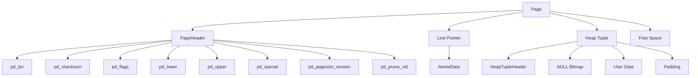

## 纯AI 学数据库内核开发 | 第一章：存储引擎与数据组织 - 1.1 行存储与页面结构  
  
### 作者  
digoal  
  
### 日期  
2025-02-19  
  
### 标签  
PostgreSQL , PolarDB , DuckDB , AI , 内核 , 学习  
  
----  
  
## 背景  
  
### 第一章：存储引擎与数据组织

#### 1.1 行存储与页面结构

##### 理论部分

**Heap Tuple结构**

在PostgreSQL中，数据以行的形式存储在表中，每一行被称为一个“Heap Tuple”。Heap Tuple的结构如下：

```plaintext
+-------------------+-------------------+-------------------+-------------------+
| HeapTupleHeader   | NULL Bitmap       | User Data         | Padding           |
+-------------------+-------------------+-------------------+-------------------+
```

- **HeapTupleHeader**：包含元组的基本信息，如事务ID、元组长度、元组状态等。
- **NULL Bitmap**：用于标记哪些列是NULL。
- **User Data**：实际存储的用户数据。
- **Padding**：用于对齐的填充字节。

**PageHeader字段解析**

PostgreSQL将数据存储在页面（Page）中，每个页面的大小通常为8KB。页面的结构如下：

```plaintext
+-------------------+-------------------+-------------------+-------------------+
| PageHeader        | Line Pointer      | Heap Tuple        | Free Space        |
+-------------------+-------------------+-------------------+-------------------+
```

- **PageHeader**：包含页面的元信息，如页面大小、页面版本、页面状态等。
- **Line Pointer**：指向页面中的Heap Tuple。
- **Heap Tuple**：实际存储的数据行。
- **Free Space**：页面中未使用的空间。

**页面组织方式**

PostgreSQL支持多种页面组织方式，常见的有链表和B-Tree。

- **链表**：页面通过链表连接，适用于顺序访问的场景。
- **B-Tree**：页面通过B-Tree组织，适用于快速查找的场景。

##### PG代码分析

**`src/include/storage/bufpage.h`中Page布局**

在`bufpage.h`中，定义了页面的基本结构：

```c
typedef struct PageHeaderData
{
    PageXLogRecPtr pd_lsn;        /* LSN: next byte after last byte of xlog record */
    uint16        pd_checksum;    /* checksum */
    uint16        pd_flags;       /* flag bits, see below */
    LocationIndex pd_lower;       /* offset to start of free space */
    LocationIndex pd_upper;       /* offset to end of free space */
    LocationIndex pd_special;     /* offset to start of special space */
    uint16        pd_pagesize_version; /* page size and layout version */
    TransactionId pd_prune_xid;   /* oldest prunable XID, or zero if none */
    ItemIdData    pd_linp[FLEXIBLE_ARRAY_MEMBER]; /* line pointer array */
} PageHeaderData;
```

**`src/backend/storage/page/`目录下的相关代码**

在`src/backend/storage/page/`目录下，包含了页面管理的相关代码，如页面初始化、页面分配、页面释放等。

##### 基础实验

**使用`pageinspect`扩展查看PG数据页二进制结构**

1. 安装`pageinspect`扩展：

    ```sql
    CREATE EXTENSION pageinspect;
    ```

2. 查看页面结构：

    ```sql
    SELECT * FROM page_header(get_raw_page('your_table', 0));
    ```

**编写C函数修改`pd_lsn`模拟页面损坏并触发恢复**

1. 编写C函数：

    ```c
    #include "postgres.h"
    #include "storage/bufpage.h"

    PG_MODULE_MAGIC;

    PG_FUNCTION_INFO_V1(modify_pd_lsn);

    Datum
    modify_pd_lsn(PG_FUNCTION_ARGS)
    {
        PageHeader page = (PageHeader) PG_GETARG_POINTER(0);
        page->pd_lsn = 0;  // 模拟页面损坏
        PG_RETURN_VOID();
    }
    ```

2. 编译并加载扩展：

    ```bash
    make
    make install
    ```

3. 在SQL中调用函数：

    ```sql
    SELECT modify_pd_lsn(get_raw_page('your_table', 0));
    ```

**GDB调试C函数**

1. 启动GDB：

    ```bash
    gdb postgres
    ```

2. 设置断点并运行：

    ```gdb
    break modify_pd_lsn
    run
    ```

3. 观察变量变化，验证修改是否正确。

**Valgrind Memcheck检查C函数是否存在内存泄漏**

1. 使用Valgrind运行PostgreSQL：

    ```bash
    valgrind --leak-check=full --track-origins=yes postgres
    ```

2. 调用C函数，观察Valgrind输出。

##### 厂商扩展实验

**MySQL InnoDB的COMPACT行格式**

1. 查看InnoDB行格式：

    ```sql
    SHOW TABLE STATUS LIKE 'your_table';
    ```

2. 分析COMPACT行格式的结构。

**SQLite的页面结构和B-Tree实现**

1. 查看SQLite页面结构：

    ```sql
    PRAGMA page_size;
    ```

2. 分析SQLite的B-Tree实现。

**DuckDB的行存储格式和向量化执行的页面布局**

1. 查看DuckDB行存储格式：

    ```sql
    DESCRIBE your_table;
    ```

2. 分析DuckDB的向量化执行的页面布局。

##### 图形辅助理解



通过以上内容，学生可以深入理解PostgreSQL的存储引擎与数据组织，并通过实验和代码分析巩固所学知识。
  
<b> 以上内容基于DeepSeek-R1和Gemini 2.0 Flash生成, 轻微人工调整, 感谢 杭州深度求索人工智能基础技术研究有限公司 及 google </b>  
  
  
  
#### [期望 PostgreSQL|开源PolarDB 增加什么功能?](https://github.com/digoal/blog/issues/76 "269ac3d1c492e938c0191101c7238216")
  
  
#### [PolarDB 开源数据库](https://openpolardb.com/home "57258f76c37864c6e6d23383d05714ea")
  
  
#### [PolarDB 学习图谱](https://www.aliyun.com/database/openpolardb/activity "8642f60e04ed0c814bf9cb9677976bd4")
  
  
#### [PostgreSQL 解决方案集合](../201706/20170601_02.md "40cff096e9ed7122c512b35d8561d9c8")
  
  
#### [德哥 / digoal's Github - 公益是一辈子的事.](https://github.com/digoal/blog/blob/master/README.md "22709685feb7cab07d30f30387f0a9ae")
  
  
#### [About 德哥](https://github.com/digoal/blog/blob/master/me/readme.md "a37735981e7704886ffd590565582dd0")
  
  

  
