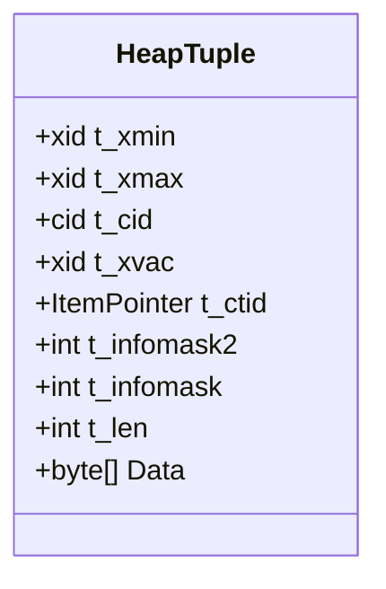
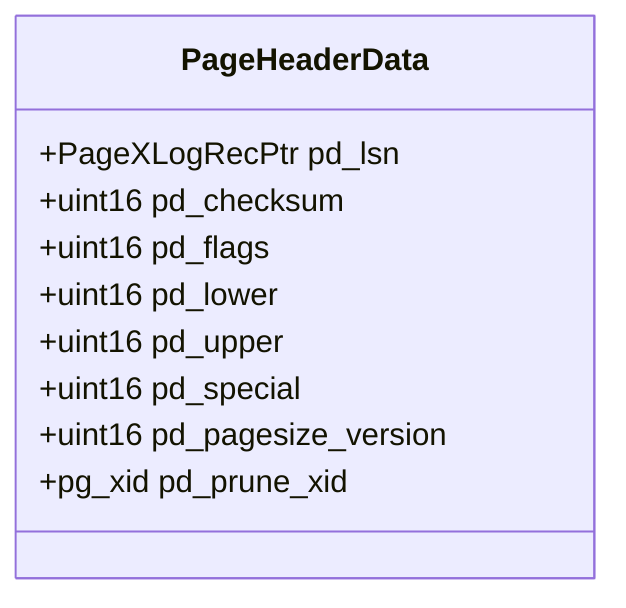
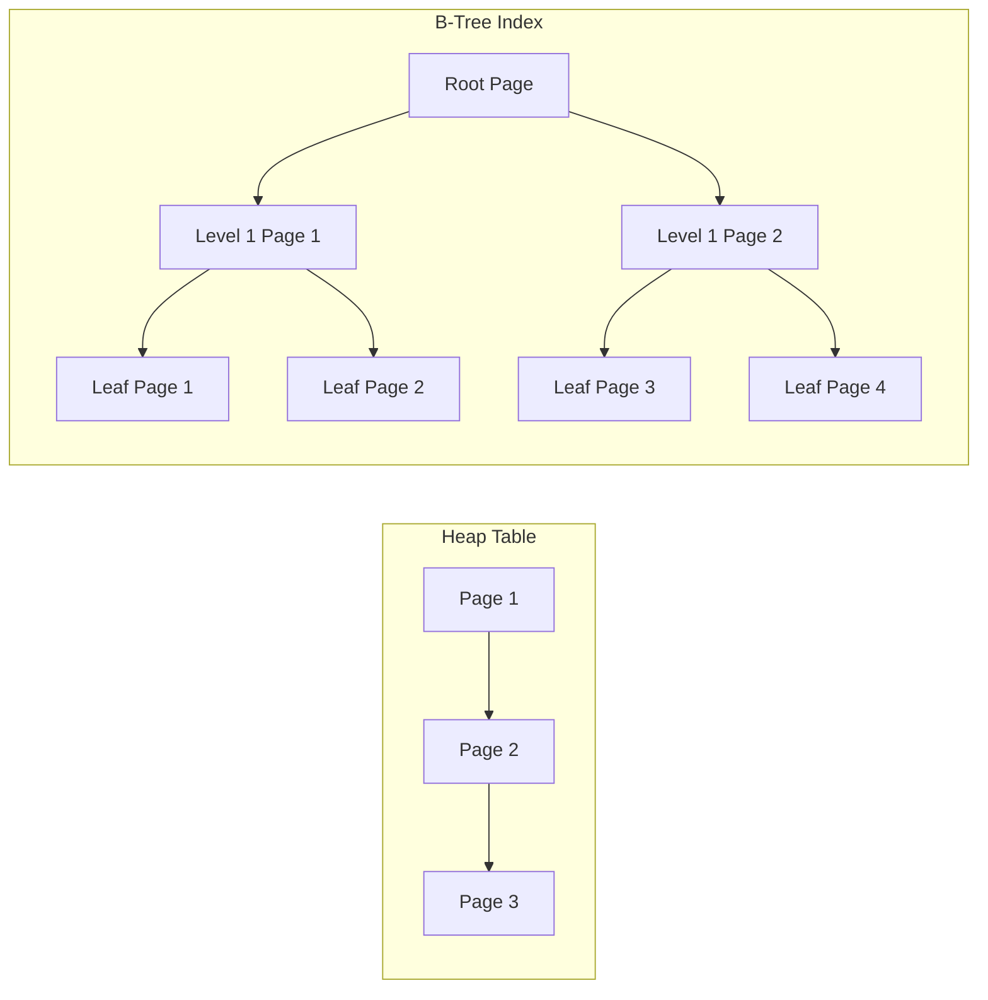

## 纯AI 学数据库内核开发 | 第一章：存储引擎与数据组织 - 1.1 行存储与页面结构  
  
### 作者  
digoal  
  
### 日期  
2025-02-19  
  
### 标签  
PostgreSQL , PolarDB , DuckDB , AI , 内核 , 学习  
  
----  
  
## 背景  
  
# 第一章：存储引擎与数据组织

本章主要介绍数据库内核中最基础的存储方式——行存储及其页面结构。我们将通过理论讲解、代码分析和实验练习来帮助大家深入理解 PostgreSQL 是如何管理和组织数据的。请注意，部分代码或细节如果不确定，请与文档、代码库或指导讲师进一步确认。

---

## 1.1 行存储与页面结构

本节内容分为以下几部分：

1. 理论讲解：包括 Heap Tuple 结构、PageHeader 字段解析和页面的组织方式（链表、B-Tree等）。
2. PostgreSQL（PG）代码分析：参照 `src/include/storage/bufpage.h` 中的页面布局以及 `src/backend/storage/page/` 下的相关代码。
3. 基础实验：基于 `pageinspect` 扩展查看PG数据页二进制结构；编写 C 函数，修改 `pd_lsn` 模拟页面损坏并触发恢复，利用 GDB 和 Valgrind 工具进行调试。
4. 厂商扩展实验：对比 MySQL、SQLite 和 DuckDB 的存储结构与索引实现。

---

### 理论概述

#### 1. Heap Tuple 结构

在 PostgreSQL 中，每一行数据以 Heap Tuple 的形式存储。可以把 Heap Tuple 想象成一个被精心封装的包裹，其中包含了数据本身以及用于事务控制、状态标识的元数据。主要字段包括：

- **t_xmin**: 插入事务的 ID，记录了哪个事务插入了这行数据。
- **t_xmax**: 删除事务的 ID。若该行被删除，该字段记录删除该行的事务。
- **t_cid**: 插入命令的 ID，用于区分同一事务内的多个命令。
- **t_xvac**: VACUUM 操作相关的事务 ID。
- **t_ctid**: 指向该行自身或更新后新所在位置的指针。
- **t_infomask2** 与 **t_infomask**: 存储各种标志位和锁信息，帮助管理 MVCC（多版本并发控制）的状态。
- **t_len**: 数据的长度。
- **Data**: 实际存储的数据信息。

下面使用 Mermaid 绘制 Heap Tuple 的结构图，帮助形象化理解：



#### 2. PageHeader 字段解析

PostgreSQL 中的数据存储在固定大小的页面中（默认 8KB）。每个页面开头都有一个 PageHeader，该结构用于管理页面的元数据。PageHeader 包含如下字段：

- **pd_lsn**：记录页面的最后修改日志序列号（LSN），这是数据恢复和一致性的重要依据。
- **pd_checksum**：页面校验和，用以检测数据损坏。
- **pd_flags**：标识页面状态的标志位。
- **pd_lower**：页面内已使用空间的底部偏移。
- **pd_upper**：页面中空闲空间的顶部偏移。
- **pd_special**：保留部分空间，用于存储特殊数据（如索引的 B-Tree 元数据）。
- **pd_pagesize_version**：页面大小和版本信息。
- **pd_prune_xid**：用于 VACUUM 操作的最老事务 ID。

下面的 Mermaid 类图展示了 PageHeaderData 的结构：



#### 3. 页面组织方式：链表与 B-Tree

PostgreSQL 在不同存储场景下采用不同的页面组织策略：
    
- **链表组织**：用于堆表。页面通过链表连接，便于顺序扫描。可以将其类比为一串链接在一起的珍珠，每个页面是一个珍珠。
- **B-Tree 组织**：用于索引。B-Tree 是一种自平衡树，能高效地支持快速查找、插入和删除操作。类比于书籍目录，可以很快定位所需要的数据。

以下 Mermaid 图展示了这两种页面组织结构的区别：
  

  
---

### PG 代码分析

#### 1. `src/include/storage/bufpage.h` 文件

该头文件定义了 PageHeader 数据结构。以下是一段简化版代码，供大家参考：

```c
/* File: src/include/storage/bufpage.h */
typedef struct PageHeaderData
{
    PageXLogRecPtr pd_lsn;     /* LSN: 下一个页面日志序列号 */
    uint16      pd_checksum;    /* 页面校验和 */
    uint16      pd_flags;       /* 页面标志 */
    uint16      pd_lower;       /* 已用空间起始点 */
    uint16      pd_upper;       /* 未使用空间起始点 */
    uint16      pd_special;     /* 特殊区域起始点 */
    uint16      pd_pagesize_version;  /* 页面大小及版本 */
    pg_xid      pd_prune_xid;   /* 可执行 prune 的最老XID */
} PageHeaderData;
```

建议同学们使用 vim 或其他编辑器打开该文件，结合注释理解每个字段的含义。

#### 2. `src/backend/storage/page/` 目录

该目录包含了与页面读取、修改、初始化和校验等相关的实现代码。主要文件包括：

- **bufpage.c**：包含管理缓冲页的函数，如 `PageGetFreeSpace()` 等。
- **itemptr.c**：包含操作 ItemPointer 的函数，用于定位页面中某个具体的 Tuple。
- **pageutil.c**：提供页面初始化和校验的实用函数。

建议同学们逐步阅读这些文件的实现，依赖 pg 的编译环境进行调试尝试，掌握代码的运行机制。

---

### 基础实验

#### 实验 1：使用 `pageinspect` 扩展查看 PG 数据页二进制结构

实验目标：利用 `pageinspect` 扩展深入查看数据页的内部结构，验证我们对 PageHeader 与 Tuple 的理解。

步骤：
1. 在 PostgreSQL 中创建扩展：
    ```sql
    CREATE EXTENSION pageinspect;
    ```
2. 获取表 `mytable` 的 OID：
    ```sql
    SELECT oid FROM pg_class WHERE relname = 'mytable';
    ```
3. 查看 `mytable` 第 0 页的原始数据：
    ```sql
    SELECT get_raw_page('mytable', 0);
    ```
4. 解析页面头部信息：
    ```sql
    SELECT * FROM page_header(get_raw_page('mytable', 0));
    ```

通过这些命令，大家可以直观地看到页面结构及其元数据的变化。

#### 实验 2：编写 C 函数修改 `pd_lsn` 模拟页面损坏并触发恢复

本实验目标是通过修改页面的 `pd_lsn` 来模拟页面损坏，进而观察 PostgreSQL 的恢复机制。请注意：此实验有数据风险，仅在测试环境中进行！

我们将创建一个 PostgreSQL 扩展 `page_corrupt`。

##### 文件 1：page_corrupt.c

```c
/* File: page_corrupt/page_corrupt.c */
#include "postgres.h"
#include "fmgr.h"
#include "access/xlog.h"
#include "storage/bufmgr.h"
#include "storage/pageheader.h"

PG_MODULE_MAGIC;

PG_FUNCTION_INFO_V1(corrupt_page);

Datum
corrupt_page(PG_FUNCTION_ARGS)
{
    Oid relid = PG_GETARG_OID(0);
    int blockno = PG_GETARG_INT32(1);

    Buffer buffer;
    Page page;

    /* 读取目标页面 */
    buffer = ReadBuffer(relid, blockno);
    LockBuffer(buffer, BUFFER_LOCK_EXCLUSIVE);
    page = BufferGetPage(buffer);

    /* 修改页面头部，设置 pd_lsn 为0（模拟损坏） */
    PageHeaderData *header = (PageHeaderData *) page;
    header->pd_lsn = 0;

    MarkBufferDirty(buffer);
    UnlockBuffer(buffer);
    ReleaseBuffer(buffer);

    PG_RETURN_VOID();
}
```

##### 文件 2：page_corrupt.control

```ini
# File: page_corrupt/page_corrupt.control
# page_corrupt 扩展描述文件
comment = 'Corrupt a page by setting pd_lsn to 0'
default_version = '1.0'
module_pathname = '$libdir/page_corrupt'
relocatable = true
```

##### 文件 3：Makefile

```makefile
# File: page_corrupt/Makefile
EXTENSION = page_corrupt
DATA = page_corrupt--1.0.sql
PGFILEDESCRIPTION = "Extension to corrupt a page by modifying pd_lsn"

PG_CONFIG = pg_config
PGXS := $(shell $(PG_CONFIG) --pgxs)
include $(PGXS)
```

##### 文件 4：SQL 安装脚本 page_corrupt--1.0.sql

```sql
-- File: page_corrupt/page_corrupt--1.0.sql
CREATE FUNCTION corrupt_page(oid, int) RETURNS void
    AS 'MODULE_PATHNAME', 'corrupt_page'
    LANGUAGE C STRICT;
```

##### 编译与安装

在扩展目录下执行以下命令：
```bash
make
make install
```
然后，在 PostgreSQL 中安装扩展：
```sql
CREATE EXTENSION page_corrupt;
```

##### 运行验证

使用下面的 SQL 命令调用该函数，使 `mytable` 的第 0 页模拟损坏：
```sql
SELECT corrupt_page('mytable'::regclass, 0);
```

##### 调试实验

- **GDB 调试**：在 PostgreSQL 运行时，通过 GDB 附加到后端进程进行调试：
    ```bash
    gdb -p <postgres_pid>
    ```
    在 `corrupt_page` 函数入口设置断点：
    ```gdb
    break corrupt_page
    ```
    执行函数后，使用 `print header->pd_lsn` 命令观察变量是否为 0。

- **Valgrind 检查**：使用 Valgrind 检查该函数是否会引起内存泄漏：
    ```bash
    valgrind --leak-check=full ./postgres -D data -c "SELECT corrupt_page('mytable'::regclass, 0);"
    ```

---

### 厂商扩展实验

为帮助大家了解不同数据库内核的存储与数据组织机制，我们还设计了以下厂商扩展实验：

#### 1. (MySQL) 分析 InnoDB 的 COMPACT 行格式

InnoDB 的 COMPACT 行格式旨在减少存储空间，主要包含：
- 记录头（记录状态、删除标识等）
- NULL 值标志位和变长列长度信息
- 实际的行数据

**练习方法：**
1. 创建一个包含多种数据类型（包括 NULL 和变长字符串）的 MySQL 表。
2. 使用 `SHOW CREATE TABLE your_table;` 查看表结构。
3. 导出数据后使用 `hexdump -C` 查看二进制存储格式：
    ```bash
    hexdump -C /tmp/your_table_data.txt
    ```
4. 结合 InnoDB 文档分析每个部分的含义。

#### 2. (SQLite) 分析 SQLite 的页面结构和 B-Tree 实现

SQLite 的存储结构包含：
- 页面头（记录页面类型、空闲空间等）
- Cell Pointer Array 指向页面中各个 Cell
- Cell 存储具体数据

**练习方法：**
1. 创建 SQLite 数据库并插入数据。
2. 使用 `PRAGMA page_size;` 查看页面大小。
3. 执行 `PRAGMA integrity_check;` 检查数据库完整性。
4. 使用 `sqlite3_analyzer` 工具分析页面布局。（请确认工具的安装和使用方法）

#### 3. (DuckDB) 分析 DuckDB 的行存储格式和向量化执行的页面布局

DuckDB 针对分析型数据库环境进行了优化，其存储格式：
- 类似 Heap Tuple，但支持向量化执行，即数据按列存放提高缓存命中率和数据访问效率。

**练习方法：**
1. 克隆 DuckDB 的 GitHub 仓库：
    ```bash
    git clone https://github.com/duckdb/duckdb.git
    ```
2. 阅读 `src/storage` 下的代码文件，特别关注 `src/storage/table` 和 `src/storage/block`。
3. 尝试理解不同于 PostgreSQL 的存储优化方法。
4. 针对感兴趣的部分，尝试添加简单修改后重新编译验证。（需要一定的 C++ 编程经验）

---

### 总结与练习建议

1. **阅读源码**：深入研读 `src/include/storage/bufpage.h` 及 `src/backend/storage/page/` 目录下的各代码文件，理解页面操作细节。
2. **实践调试**：利用 `pageinspect` 扩展、GDB 进行断点调试和变量观察，加深对堆表、页面和Tuple的理解。
3. **开发扩展**：编写和调试 C 函数修改页面数据，通过实际实验观察 PostgreSQL 的恢复机制。注意在测试环境中进行操作。
4. **跨数据库对比**：通过实验比较 MySQL、SQLite 和 DuckDB 等不同数据库的存储引擎实现，提炼内核设计思想。
5. **工具使用**：熟练掌握 GDB、Valgrind 等调试工具，理解低级代码运行及内存管理。

通过理论、代码与实验的多维度学习，同学们可以建立起对数据库存储引擎和数据组织的全面认识，为后续的数据库内核开发打下坚实基础。

**注意**：文中部分代码或步骤在不同版本的 PostgreSQL 或其他数据库产品中可能有所不同，建议在实验前核查各自最新的官方文档并进行必要的调整和确认。
  
<b> 以上内容基于DeepSeek-R1及诸多AI生成, 轻微人工调整, 感谢杭州深度求索人工智能等公司 </b>     
  
<b> AI 生成的内容请自行辨别正确性, 当然也多了些许踩坑的乐趣, 毕竟冒险是每个男人的天性. </b>   
  
#### [期望 PostgreSQL|开源PolarDB 增加什么功能?](https://github.com/digoal/blog/issues/76 "269ac3d1c492e938c0191101c7238216")
  
  
#### [PolarDB 开源数据库](https://openpolardb.com/home "57258f76c37864c6e6d23383d05714ea")
  
  
#### [PolarDB 学习图谱](https://www.aliyun.com/database/openpolardb/activity "8642f60e04ed0c814bf9cb9677976bd4")
  
  
#### [PostgreSQL 解决方案集合](../201706/20170601_02.md "40cff096e9ed7122c512b35d8561d9c8")
  
  
#### [德哥 / digoal's Github - 公益是一辈子的事.](https://github.com/digoal/blog/blob/master/README.md "22709685feb7cab07d30f30387f0a9ae")
  
  
#### [About 德哥](https://github.com/digoal/blog/blob/master/me/readme.md "a37735981e7704886ffd590565582dd0")
  
  

  
