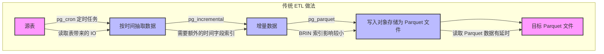
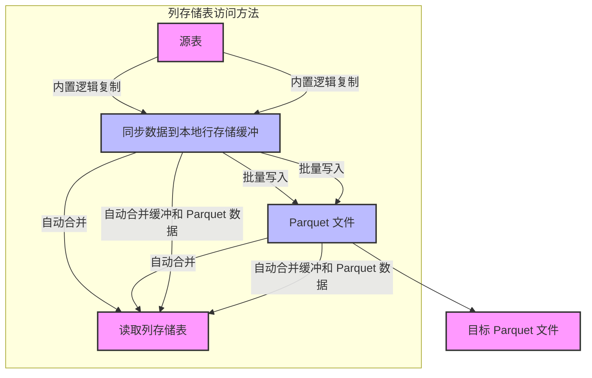

## 内置列存储 vs 传统 ETL: pg_mooncake 与 CrunchyData 打起来了  
                                                                                                          
### 作者                                                                              
digoal                                                                              
                                                                                     
### 日期                                                                                   
2025-02-20                                                                         
                                                                                  
### 标签                                                                                
PostgreSQL , PolarDB , DuckDB , 对象存储 , parquet , 分析 , 数据湖 , etl , 逻辑复制 , 透明访问 , 增量合并    
                                                                                                         
----                                                                                  
                                                                                                
## 背景          
都说duckdb好, 大家都在拿它+parquet文件来做分析查询加速, 构建oltp数据库的数据湖架构和分析能力. 但是先写入到本地OLTP库的数据怎么从本地同步到parquet, 怎么更加丝滑? 怎么降低延迟? 怎么合并延迟部分? 怎么查询更加透明?  
  
来看看pg_mooncake 与 CrunchyData 的架构, 你喜欢谁呢? 内置列存储 vs 传统 ETL.    
  
1、Incremental Archival from Postgres to Parquet for Analytics  
- https://www.crunchydata.com/blog/incremental-archival-from-postgres-to-parquet-for-analytics  
  
crunchydata采用传统ETL做法, 使用pg_cron定时任务, 使用pg_incremental将数据从表里按时间把时间抽取, 使用pg_parquet将数据写入对象存储parquet中.   
  
是非常传统的ETL做法  
- 读取表带来的IO, 需要加额外的时间字段索引, 当然brin索引很小影响不会太大.   
- 读取parquet数据有延时, 因为不可能做到实时.   
  
相关的插件  
- https://github.com/CrunchyData/pg_parquet  
- https://github.com/crunchydata/pg_incremental   
- https://github.com/citusdata/pg_cron  
  

  
2、pg_mooncake v0.2 roadmap 提到, columnstore table access method将采用内置logical replication的功能来同步数据到parquet, 但是为了提高性能会使用本地(行存储缓冲), 批量写入parquet. 同时在读取column table时会自动合并缓冲和parquet两部分数据, 延迟更低.  
  

  
我更期待pg_mooncake v0.2  
- https://github.com/Mooncake-Labs/pg_mooncake  
    
## 参考  
https://github.com/Mooncake-Labs/pg_mooncake  
  
https://www.crunchydata.com/blog/incremental-archival-from-postgres-to-parquet-for-analytics  
  
  
#### [期望 PostgreSQL|开源PolarDB 增加什么功能?](https://github.com/digoal/blog/issues/76 "269ac3d1c492e938c0191101c7238216")
  
  
#### [PolarDB 开源数据库](https://openpolardb.com/home "57258f76c37864c6e6d23383d05714ea")
  
  
#### [PolarDB 学习图谱](https://www.aliyun.com/database/openpolardb/activity "8642f60e04ed0c814bf9cb9677976bd4")
  
  
#### [PostgreSQL 解决方案集合](../201706/20170601_02.md "40cff096e9ed7122c512b35d8561d9c8")
  
  
#### [德哥 / digoal's Github - 公益是一辈子的事.](https://github.com/digoal/blog/blob/master/README.md "22709685feb7cab07d30f30387f0a9ae")
  
  
#### [About 德哥](https://github.com/digoal/blog/blob/master/me/readme.md "a37735981e7704886ffd590565582dd0")
  
  

  
