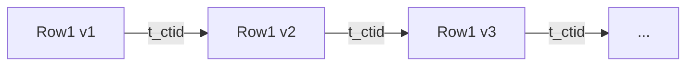

## 纯AI 学数据库内核开发 | 第一章：存储引擎与数据组织 - 1.2 堆表  
  
### 作者  
digoal  
  
### 日期  
2025-02-20  
  
### 标签  
PostgreSQL , PolarDB , DuckDB , AI , 内核 , 学习  
  
----  
  
## 背景  
  
### 第一章：存储引擎与数据组织 - 1.2 堆表  
  
#### 1.2 堆表  
  
---  
  
##### **理论部分**  
**1. 堆表的组织方式**  
堆表（Heap Table）是 PostgreSQL 默认的表存储方式，其核心特点为：  
- **无序存储**：数据行按插入顺序存储，无固定物理排序。  
- **多版本并发控制（MVCC）**：更新操作生成新版本行，旧版本通过 `t_ctid` 指针链接形成版本链。  
  
**物理结构示意图**：  
```text  
+-------------------+  
| PageHeader        |  
|-------------------|  
| ItemId1 → Row1    |  
| ItemId2 → Row2    |  
| ...               |  
| ItemIdN → RowN    |  
|-------------------|  
| Free Space        |  
+-------------------+  
```  
每个页面的行指针（`ItemId`）构成逻辑上的“堆”，数据行通过 `t_ctid` 字段链接版本链。  
  
---  
  
**2. 数据操作实现**  
**插入（Insert）**：  
- **步骤**：  
  1. 从空闲空间分配行空间（`pd_upper` 向页头移动）。  
  2. 生成 `HeapTupleHeader`，设置 `t_xmin` 为当前事务ID。  
  3. 更新行指针数组（`pd_lower` 向页尾移动）。  
- **代码路径**：`src/backend/access/heap/heapam.c` → `heap_insert`。  
  
**更新（Update）**：  
- **步骤**：  
  1. 将旧行标记为已删除（设置 `t_xmax` 为当前事务ID）。  
  2. 插入新行，新行的 `t_ctid` 指向旧行。  
  3. 旧行通过 `t_ctid` 形成版本链。  
- **代码路径**：`heap_update` → `heap_insert`。  
  
**删除（Delete）**：  
- **步骤**：  
  1. 标记行的 `t_xmax` 为当前事务ID。  
  2. 行物理空间由后续 `VACUUM` 回收。  
- **代码路径**：`heap_delete`。  
  
**MVCC 版本链示意图**：  

  
---  
  
##### **PG代码分析**  
**关键代码文件**：  
- **`src/backend/access/heap/heapam.c`**：实现堆表操作（插入、更新、删除）。  
- **`src/include/access/htup_details.h`**：定义 `HeapTupleHeader` 结构。  
  
**代码片段示例**（`heapam.c` 插入逻辑）：  
```c  
void heap_insert(Relation relation, HeapTuple tup, ...) {  
    // 分配缓冲页  
    Buffer buffer = ReadBuffer(relation, P_NEW);  
    Page page = BufferGetPage(buffer);  
    // 计算行空间大小（含对齐填充）  
    size = MAXALIGN(tup->t_len);  
    // 检查空闲空间是否足够  
    if (PageGetFreeSpace(page) < size) { ... }  
    // 插入行数据并更新页头  
    PageAddItem(page, (Item) tup->t_data, tup->t_len, ...);  
    // 设置事务信息  
    HeapTupleHeaderSetXmin(tup->t_data, GetCurrentTransactionId());  
    MarkBufferDirty(buffer);  
}  
```  
  
---  
  
##### **基础实验**  
**实验1：实现简单堆表存储引擎**  
1. **目标**：实现支持插入、读取、删除的简化堆表引擎。  
2. **代码框架**（伪代码）：  
```c  
typedef struct {  
    PageHeaderData header;  
    ItemIdData item_ids[MAX_ITEMS];  
    char data[PAGE_SIZE - sizeof(PageHeaderData)];  
} SimpleHeapPage;  
  
void insert_row(SimpleHeapPage *page, char *row_data, int len) {  
    // 计算对齐后的长度  
    int aligned_len = MAXALIGN(len);  
    // 检查空闲空间  
    if (page->header.pd_upper - page->header.pd_lower < aligned_len) return;  
    // 分配ItemId  
    ItemId item_id = &page->item_ids[page->header.pd_lower];  
    item_id->lp_off = page->header.pd_upper - aligned_len;  
    item_id->lp_len = aligned_len;  
    // 复制数据  
    memcpy(&page->data[item_id->lp_off], row_data, len);  
    // 更新页头  
    page->header.pd_lower += sizeof(ItemIdData);  
    page->header.pd_upper -= aligned_len;  
}  
```  
3. **GDB调试**：  
```bash  
gdb -ex "break insert_row" -ex "run" ./heap_engine  
(gdb) print page->header.pd_upper  # 观察插入前后变化  
```  
4. **Valgrind检查**：  
```bash  
valgrind --leak-check=full ./heap_engine  
```  
  
**实验2：分析VACUUM机制**  
1. **触发VACUUM**：  
```sql  
VACUUM ANALYZE my_table;  -- 手动触发  
```  
2. **跟踪代码路径**：  
```bash  
gdb --args postgres -D /path/to/data  
(gdb) break lazy_vacuum_heap  # 设置断点  
(gdb) continue  
```  
3. **观察页面回收**：  
```sql  
SELECT * FROM pg_stat_all_tables WHERE relname = 'my_table';  -- 查看死行数变化  
```  
4. **页面回收示意图**：  
```text  
Before VACUUM:  
+-------------------+  
| Valid Rows        |  
| Dead Rows (XMAX)  |  
| Free Space Frag   |  
+-------------------+  
  
After VACUUM:  
+-------------------+  
| Valid Rows        |  
| Compact Free Space|  
+-------------------+  
```  
  
---  
  
##### **厂商扩展实验**  
**1. Oracle 堆表分析**  
- **组织方式**：  
  - 使用 `DBMS_SPACE` 包查看段空间分布：  
    ```sql  
    SELECT tablespace_name, segment_name, blocks, bytes  
    FROM dba_segments WHERE owner = 'SCOTT';  
    ```  
  - 行格式：包含 `ROWID`（文件号+块号+行号）和行头（锁、列数等）。  
- **与PG差异**：  
  - Oracle 使用 `UNDO` 段管理旧版本，PG 使用页面内版本链。  
  
**2. PolarDB 堆表优化**  
- **优化技术**：  
  - **共享存储架构**：计算节点与存储分离，减少I/O延迟。  
  - **并行VACUUM**：多线程回收死行（参考 PolarDB 源码 `src/backend/storage/lmgr/parallel_vacuum.c`）。  
- **验证方法**：  
  ```sql  
  EXPLAIN (COSTS OFF) VACUUM my_table;  -- 观察并行worker数  
  ```  
  
---  
  
##### **练习与验证**  
1. **动手任务**：  
   - **任务1**：在简单堆表引擎中实现 `delete_row` 函数，标记行状态。  
     ```c  
     void delete_row(SimpleHeapPage *page, int item_id) {  
         ItemId id = &page->item_ids[item_id];  
         id->lp_flags = LP_DEAD;  // 标记为无效  
     }  
     ```  
   - **任务2**：使用 `pageinspect` 观察 `VACUUM` 前后的页面变化：  
     ```sql  
     SELECT * FROM heap_page_items(get_raw_page('my_table', 0));  
     VACUUM my_table;  
     SELECT * FROM heap_page_items(get_raw_page('my_table', 0));  
     ```  
  
2. **思考题**：  
   - **问题1**：为什么更新操作要生成新版本而不是直接修改？  
     **答案**：为了支持MVCC，保证读写事务不阻塞。  
   - **问题2**：VACUUM 如何避免回收正在被活动事务引用的行？  
     **答案**：通过比较 `t_xmin` 和 `OldestXmin`，只回收事务ID早于 `OldestXmin` 的行。  
  
---  
  
##### **注意事项**  
- **代码风险**：直接操作堆表页面可能导致数据损坏，务必在测试环境中操作。  
- **二次确认**：  
  - PolarDB 的并行VACUUM实现需参考阿里云官方文档。  
  - Oracle 的 `ROWID` 结构可通过 `DBMS_ROWID` 包解析：  
    ```sql  
    SELECT DBMS_ROWID.ROWID_BLOCK_NUMBER(rowid) FROM my_table;  
    ```  
  
<b> 以上内容基于DeepSeek-R1及诸多AI生成, 轻微人工调整, 感谢杭州深度求索人工智能等公司 </b>     
  
<b> AI 生成的内容请自行辨别正确性, 当然也多了些许踩坑的乐趣, 毕竟冒险是每个男人的天性. </b>   
  
  
  
#### [期望 PostgreSQL|开源PolarDB 增加什么功能?](https://github.com/digoal/blog/issues/76 "269ac3d1c492e938c0191101c7238216")
  
  
#### [PolarDB 开源数据库](https://openpolardb.com/home "57258f76c37864c6e6d23383d05714ea")
  
  
#### [PolarDB 学习图谱](https://www.aliyun.com/database/openpolardb/activity "8642f60e04ed0c814bf9cb9677976bd4")
  
  
#### [PostgreSQL 解决方案集合](../201706/20170601_02.md "40cff096e9ed7122c512b35d8561d9c8")
  
  
#### [德哥 / digoal's Github - 公益是一辈子的事.](https://github.com/digoal/blog/blob/master/README.md "22709685feb7cab07d30f30387f0a9ae")
  
  
#### [About 德哥](https://github.com/digoal/blog/blob/master/me/readme.md "a37735981e7704886ffd590565582dd0")
  
  

  
