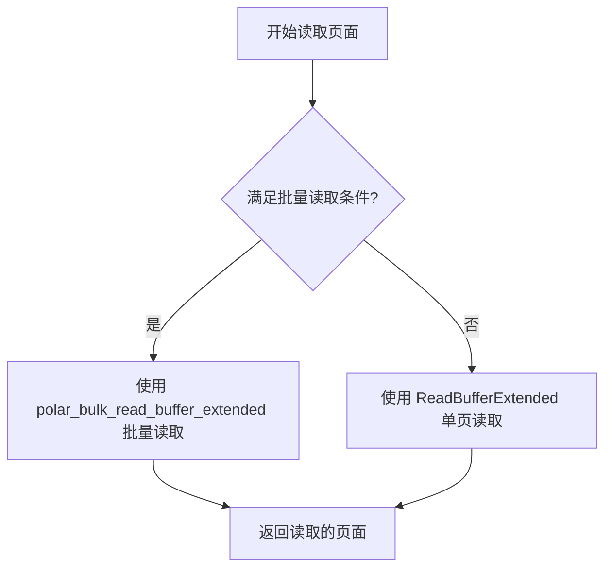
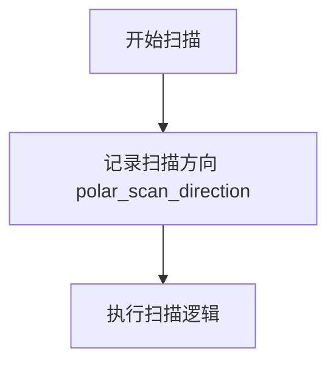
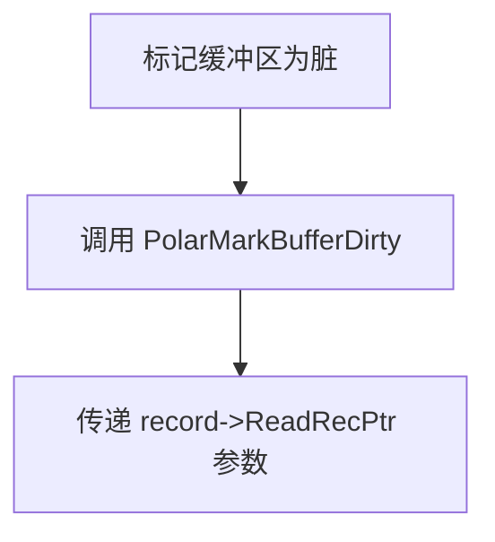
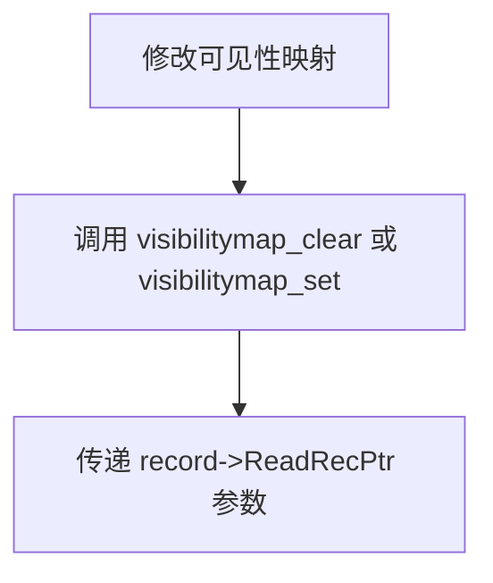

## AI辅助 PolarDB内核学习 - 3 git + AI 解读patch     
                                                                                                     
### 作者                                                                              
digoal                                                                                     
                                                                                  
### 日期                                                                                               
2025-02-20                                                                                    
                                                                                              
### 标签                                                                                            
PostgreSQL , PolarDB , DuckDB , git , AI , commit log      
                                                                                                       
----                                                                                   
                                                                                           
## 背景       
    
在 Git 中，查看 commit history 以及指定 commit 对应的代码修改 diff 是常见的操作。最后再使用deepseek解读每次提交的内容. 例如文末分析`git show d34420114e0 src/backend/access/heap/heapam.c`文件的改动.       
    
以下是具体的方法：    
    
---    
    
### 1. **查看 Commit History**    
使用 `git log` 命令可以查看 commit history。默认情况下，它会显示每个 commit 的哈希值、作者、日期和提交信息。    
    
```bash    
git log    
```    
    
#### 常用选项：    
- **简洁显示**：`--oneline`    
  ```bash    
  git log --oneline    
  ```    
- **显示文件修改统计**：`--stat`    
  ```bash    
  git log --stat    
  ```    
- **图形化显示分支和合并历史**：`--graph`    
  ```bash    
  git log --graph    
  ```    
- **限制显示数量**：`-n <数量>`    
  ```bash    
  git log -n 5  # 显示最近 5 条 commit    
  ```    
    
例子    
```    
git clone -b POLARDB_15_STABLE https://github.com/ApsaraDB/PolarDB-for-PostgreSQL/ polardb_15    
    
cd polardb_15    
    
git log --oneline    
或    
git log --graph    
    
找到polardb研发提交的commit id:     
    
d34420114e0 feat: PolarDB-PG 15 open source    
33f781e7aab feat: stylecheck supporting for PolarDB-PG 15    
d04649cd967 feat: prior indent run for PolarDB-PG 15    
e313f348c42 feat: change pgindent version and perltidy rc
cf49a606c41 Disallow USING clause when altering type of generated column
```    
    
`d34420114e0` 是`PolarDB 15`首次开源的提交(后面几个是准备工作, 代码较少), 包含巨大改动.    
   
`cf49a606c41` 是`PolarDB 15`未开源之前PG的代码.  
   
可以重点对比这两个commit id之间的差异来学习PolarDB的代码修改.   例如, 查看某个文件或某个目录的区别, 如`src/backend/tcop`目录中所有代码的区别.  
```
# 较新的提交ID放后面.  
git diff -u cf49a606c41 d34420114e0 -- src/backend/tcop
```
   
<b> 跨branch对比两个commit id, 需要clone所有分支. </b>   
```
git clone https://github.com/ApsaraDB/PolarDB-for-PostgreSQL/ polardb_full_branch     
```
   
<b> 例如: diff 最新PolarDB 和 最近一次base底层PG代码 15.12  </b>    
```
commit f5e7493819e370d30ac2047c68c21c9fb03ce4a0 (HEAD -> POLARDB_15_STABLE, origin/POLARDB_15_STABLE, origin/HEAD)
Author: mrdrivingduck <mrdrivingduck@gmail.com>
Date:   Wed Mar 5 14:48:18 2025 +0800

    feat: refactor smgrnblocks for smgrtruncate2

commit e1e6d85b97c12316e615faf3fe2d201ff88c6e5a (tag: v15.12.3.0)
Merge: b6809602977 d653423781f
Author: Mr Dk. <mrdrivingduck@gmail.com>
Date:   Tue Feb 25 11:31:16 2025 +0800

    Merge pull request #559 from ApsaraDB/merge_tag_15_12
    
    merge: tag 'REL_15_12' into stable
```
   
最新PolarDB在POLARDB_15_STABLE这个分支里找到: f5e7493819e370d30ac2047c68c21c9fb03ce4a0   
   
最近一次base底层PG代码 15.12 在REL_15_STABLE这个分支里面找:   
- https://github.com/ApsaraDB/PolarDB-for-PostgreSQL/commits/REL_15_STABLE/
   
Stamp 15.12.  
- https://github.com/ApsaraDB/PolarDB-for-PostgreSQL/commit/50d3d22baba63613d1f1406b2ed460dc9b03c3fc
   
```
git diff -u 50d3d22baba63613d1f1406b2ed460dc9b03c3fc f5e7493819e370d30ac2047c68c21c9fb03ce4a0 -- src/backend/tcop
```
   
    
---    
    
### 2. **查看指定 Commit 的代码修改 Diff**    
使用 `git show <commit-hash>` 可以查看指定 commit 的详细信息，包括代码修改的 diff。    
    
```bash    
git show <commit-hash>    
```    
    
#### 示例：    
```bash    
git show abc1234    
```    
    
例子    
```    
git show --stat d34420114e0    
    
将打印被修改/删除/新增的文件, 以及对应的行数    
    
例如    
    
 external/pg_jieba/libjieba/deps/gtest/include/gtest/gtest-param-test.h.pump                              |    487 +    
 external/pg_jieba/libjieba/deps/gtest/include/gtest/gtest-printers.h                                     |    796 +    
 external/pg_jieba/libjieba/deps/gtest/include/gtest/gtest-spi.h                                          |    232 +    
 external/pg_jieba/libjieba/deps/gtest/include/gtest/gtest-test-part.h                                    |    176 +    
 external/pg_jieba/libjieba/deps/gtest/include/gtest/gtest-typed-test.h                                   |    259 +    
 ...    
 src/backend/access/logindex/polar_logindex_bg_worker.c                                                   |    453 +    
 src/backend/access/logindex/polar_logindex_iterator.c                                                    |   1184 +    
 src/backend/access/logindex/polar_logindex_redo.c                                                        |   2893 +    
 src/backend/access/logindex/polar_mini_transaction.c                                                     |    498 +    
 src/backend/access/logindex/polar_nbtxlog_idx.c                                                          |   1373 +    
 src/backend/access/logindex/polar_queue_manager.c                                                        |   1630 +    
 src/backend/access/logindex/polar_rel_size_cache.c                                                       |    570 +    
 ...    
 src/tools/polar_sort_subdir.pl                                                                           |    117 +    
 1326 files changed, 1342687 insertions(+), 2754 deletions(-)    
```    
    
#### 仅显示 Diff：    
如果只想查看代码修改的 diff，可以使用 `git diff` 命令，比较指定 commit 与其父 commit 的差异。    
    
```bash    
git diff <commit-hash>^ <commit-hash>    
```    
    
#### 示例：    
```bash    
git diff abc1234^ abc1234    
```    
    
---    
    
### 3. **查看两个 Commit 之间的 Diff**    
如果需要查看两个 commit 之间的代码修改 diff，可以使用以下命令：    
    
```bash    
git diff <commit-hash-1> <commit-hash-2>    
```    
    
#### 示例：    
```bash    
git diff abc1234 def5678    
```    
    
---    
    
### 4. **查看某个文件的修改历史**    
如果只想查看某个文件的修改历史，可以使用 `git log` 指定文件路径：    
    
```bash    
git log <文件路径>    
```    
    
#### 示例：    
```bash    
git log src/main.py    
```    
    
#### 查看某个文件的 Diff：    
使用 `git log -p` 可以查看某个文件的详细修改 diff：    
    
```bash    
git log -p <文件路径>    
```    
    
#### 示例：    
```bash    
git log -p src/main.py    
```    
    
---    
    
### 5. **查看某个 Commit 中某个文件的 Diff**    
如果只想查看某个 commit 中某个文件的 diff，可以使用以下命令：    
    
```bash    
git show <commit-hash> <文件路径>    
```    
    
#### 示例：    
```bash    
git show abc1234 src/main.py    
```    
    
例子    
```    
git show d34420114e0 src/backend/access/heap/heapam.c    
    
例如输出    
diff --git a/src/backend/access/heap/heapam.c b/src/backend/access/heap/heapam.c    
index 6a2bce7b0f4..3061a1f2876 100644    
--- a/src/backend/access/heap/heapam.c    
+++ b/src/backend/access/heap/heapam.c    
@@ -398,9 +398,32 @@ heapgetpage(TableScanDesc sscan, BlockNumber page)    
         */    
        CHECK_FOR_INTERRUPTS();    
     
-       /* read page using selected strategy */    
-       scan->rs_cbuf = ReadBufferExtended(scan->rs_base.rs_rd, MAIN_FORKNUM, page,    
-                                                                          RBM_NORMAL, scan->rs_strategy);    
+       /*    
+        * POLAR: bulk read Now only support forward direction heap scan. 'page !=    
+        * scan->rs_startblock', skip bulk read for first page, it is optimization    
+        * for case that heap scan only needs to access the first page. Avoid    
+        * pre-reading unnecessary pages. For example, select *** limit 1.    
+        */    
+       if (polar_bulk_read_size > 0 && ScanDirectionIsForward(scan->polar_scan_direction) && page != scan->rs_startblock)    
+       {    
+               BlockNumber polar_max_block_count = scan->rs_nblocks - page;    
+    
+               if (scan->rs_strategy != NULL)    
+               {    
+                       polar_max_block_count = Min(polar_get_buffer_access_strategy_ring_size(scan->rs_strategy),    
+                                                                               polar_max_block_count);    
+               }    
+               scan->rs_cbuf = polar_bulk_read_buffer_extended(scan->rs_base.rs_rd, MAIN_FORKNUM, page,    
+                                                                                                               RBM_NORMAL, scan->rs_strategy,    
+                                                                                                               polar_max_block_count);    
+       }                                                       /* POLAR end */    
+       else    
...    
+               scan->rs_cbuf = ReadBufferExtended(scan->rs_base.rs_rd, MAIN_FORKNUM, page,    
+                                                                                  RBM_NORMAL, scan->rs_strategy);    
+       }    
+    
        scan->rs_cblock = page;    
     
        if (!(scan->rs_base.rs_flags & SO_ALLOW_PAGEMODE))    
@@ -521,6 +544,10 @@ heapgettup(HeapScanDesc scan,    
        int                     linesleft;    
        ItemId          lpp;    
     
+       /* POLAR: bulk read */    
+       scan->polar_scan_direction = dir;    
+       /* POLAR end */    
+    
        /*    
...    
```    
    
---    
    
### 6. **使用 GUI 工具**    
如果你更喜欢图形化界面，可以使用以下工具：    
- **GitKraken**：功能强大的 Git GUI 工具。    
- **SourceTree**：免费的 Git GUI 工具。    
- **VS Code**：内置 Git 功能，支持查看 commit history 和 diff。    
    
---    
    
### 总结：    
- 使用 `git log` 查看 commit history。    
- 使用 `git show <commit-hash>` 查看指定 commit 的详细信息。    
- 使用 `git diff <commit-hash-1> <commit-hash-2>` 查看两个 commit 之间的 diff。    
- 使用 `git log -p <文件路径>` 查看某个文件的修改历史及 diff。    
    
这些命令可以帮助你快速定位和分析代码的修改历史。    
    
---    
    
下面使用deepseek解读patch.   
  
<b> 请给出以下代码的详细介绍(内容要求: 生动并易于理解, 越详细越好; 尽量使用图形帮助理解内容(可以使用mermaid绘制, 如果mermaid无法正确表达意图则建议改用text绘图);) </b> `git show d34420114e0 src/backend/access/heap/heapam.c`     
    
这个 patch 是 **PolarDB-PG 15** 开源版本的一部分，主要对 PostgreSQL 的 `heapam.c` 文件进行了修改，引入了 PolarDB 的特定优化和功能。以下是对这个 patch 的详细分析，结合图形和文字说明，帮助理解其内容和意义。  
  
---  
  
### 1. **背景与目标**  
PolarDB 是阿里云基于 PostgreSQL 开发的高性能分布式数据库。这个 patch 的主要目标是为 PolarDB-PG 15 引入以下功能：  
- **批量读取优化**：提升顺序扫描的性能。  
- **主从架构支持**：优化缓冲区管理和日志索引（logindex）。  
- **I/O 优化**：通过环形缓冲区和批量写入减少 I/O 开销。  
- **共享存储支持**：支持在共享存储上进行备份和恢复。  
  
---  
  
### 2. **主要修改内容**  
  
#### **(1) 批量读取优化（Bulk Read Optimization）**  
在 `heapgetpage` 函数中，引入了批量读取的逻辑：  
- **条件**：  
  - `polar_bulk_read_size > 0`（批量读取功能启用）。  
  - 扫描方向为正向（`ScanDirectionIsForward`）。  
  - 当前页面不是起始页面（`page != scan->rs_startblock`）。  
- **实现**：  
  - 使用 `polar_bulk_read_buffer_extended` 批量读取多个页面。  
  - 如果不符合批量读取条件，则使用原有的 `ReadBufferExtended` 方法。  
  

  
**优化点**：  
- 避免在只需要访问第一页的情况下预读不必要的页面（例如 `SELECT *** LIMIT 1`）。  
- 通过批量读取减少 I/O 操作，提升顺序扫描的性能。  
  
---  
  
#### **(2) 扫描方向记录**  
在 `heapgettup` 和 `heapgettup_pagemode` 函数中，新增了 `polar_scan_direction` 字段，用于记录当前的扫描方向。  
  

  
**作用**：  
- 为批量读取优化提供必要的上下文信息。  
  
---  
  
#### **(3) PolarDB 的 MarkBufferDirty 替换**  
将原有的 `MarkBufferDirty` 调用替换为 `PolarMarkBufferDirty`，并传递了额外的 `record->ReadRecPtr` 参数。  
  

  
**作用**：  
- 可能是为了在 PolarDB 中实现更高效的日志记录或缓冲区管理。  
  
---  
  
#### **(4) Visibility Map 修改**  
在多个函数中，对 `visibilitymap_clear` 和 `visibilitymap_set` 的调用进行了修改，增加了 `record->ReadRecPtr` 参数。  
  

  
**作用**：  
- 可能是为了在 PolarDB 中更好地管理可见性映射（Visibility Map），以支持更高效的 MVCC（多版本并发控制）机制。  
  
---  
  
#### **(5) 其他小改动**  
- 将 `fix_infomask_from_infobits` 函数的可见性从 `static` 改为全局可见（`void`）。  
- 在多个函数中，对 `visibilitymap_clear` 的调用增加了 `record` 参数。  
  
---  
  
### 3. **总结**  
这个 patch 的核心是为 **PolarDB** 引入了批量读取优化，通过减少 I/O 操作提升顺序扫描的性能。同时，还对缓冲区管理和可见性映射进行了适配性修改，以支持 PolarDB 的特定需求。这些改动主要集中在性能优化和扩展性增强方面，适用于需要处理大规模数据和高并发场景的数据库系统。  
  
#### 关键点：  
- **批量读取优化**：通过 `polar_bulk_read_buffer_extended` 减少顺序扫描的 I/O 开销。  
- **扫描方向记录**：新增 `polar_scan_direction` 字段，为批量读取提供上下文。  
- **PolarDB 适配**：替换 `MarkBufferDirty` 和修改 `visibilitymap_clear`，以支持 PolarDB 的特定功能。  
  
这些改动体现了 PolarDB 在 PostgreSQL 基础上对性能和扩展性的深度优化。  
       
<b> 以上内容基于DeepSeek-R1及诸多AI生成, 轻微人工调整, 感谢杭州深度求索人工智能等公司 </b>     
   
<b> AI 生成的内容请自行辨别正确性, 当然也多了些许踩坑的乐趣, 毕竟冒险是每个男人的天性. </b>   
  
   
  
#### [期望 PostgreSQL|开源PolarDB 增加什么功能?](https://github.com/digoal/blog/issues/76 "269ac3d1c492e938c0191101c7238216")
  
  
#### [PolarDB 开源数据库](https://openpolardb.com/home "57258f76c37864c6e6d23383d05714ea")
  
  
#### [PolarDB 学习图谱](https://www.aliyun.com/database/openpolardb/activity "8642f60e04ed0c814bf9cb9677976bd4")
  
  
#### [PostgreSQL 解决方案集合](../201706/20170601_02.md "40cff096e9ed7122c512b35d8561d9c8")
  
  
#### [德哥 / digoal's Github - 公益是一辈子的事.](https://github.com/digoal/blog/blob/master/README.md "22709685feb7cab07d30f30387f0a9ae")
  
  
#### [About 德哥](https://github.com/digoal/blog/blob/master/me/readme.md "a37735981e7704886ffd590565582dd0")
  
  

  
