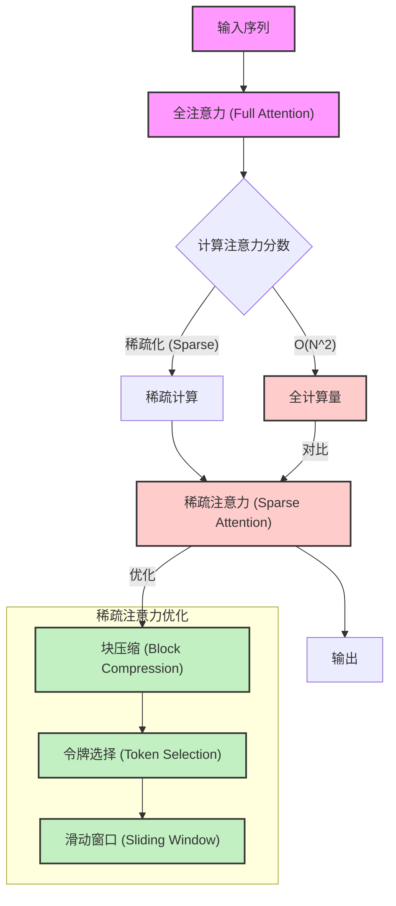

## AI论文解读 | DeepSeek NSA 稀疏注意力, 看到一丝人类学霸的学习方法论  
        
### 作者        
digoal        
        
### 日期        
2025-02-20        
        
### 标签        
PostgreSQL , PolarDB , DuckDB , DeepSeek , Native Sparse Attention (NSA) , 稀疏注意力   
        
----        
        
## 背景   
[《Native Sparse Attention: Hardware-Aligned and Natively Trainable Sparse Attention》](2502.11089v1.pdf)  
- https://arxiv.org/pdf/2502.11089  
  

  
<b>  
先说说我对这篇论文创意之处的理解, 感觉里面采用了人类在记忆或学习时常用的方法, 例如在台上主持或演讲时, 一般演讲稿会分为2种: 1、逐字逐句照着念的. 2、只有关键词(例如每一页PPT几个关键词, 把要讲的内容串起来), 演讲时灵活运用. ( 高手可能连关键词都不需要, 全在脑子里, 不知道他们脑子里时怎么组织内容的. )  逐字逐句照着念肯定是不会出错的, 但是可替代性太强, 放个自动语音播放好了. 使用关键词更符合人类习惯.  NSA的稀疏注意力正是这种方式, 先把原始内容按片段压缩出关键词和对应的关键数值, 从而减少训练的内存和计算资源消耗, 根据原始内容的大小可能会循环若干层, 就像地图可以逐级放大缩小.    
  
另一个关键创意是滑动窗口, 可以理解为进入到某个段落时关注细节, 而不是全使用压缩后的关键词. <b>我们看书时为什么要先把内容简介、术语/index、FAQ、目录先熟悉一遍, 再进行精度, 感觉是一个道理! </b>通过层次化地对输入进行压缩和选择，并结合滑动窗口来保留局部信息，同时在算法设计上充分考虑硬件的特点，使得模型在长文本处理上既保持了全局语义的捕捉，又大幅提高了运算速度和效率。  
</b>  
  
这篇论文主要讨论了如何设计一种更高效的注意力机制，以便让大语言模型能够处理更长的文本（即长上下文建模），同时减少计算和内存消耗。下面我将分几个部分，用通俗易懂的语言为你详细解读这篇论文的核心思想和方法。  
  
---  
  
### 1. 背景与动机  
  
- **长上下文的重要性**    
  现代大语言模型需要处理上万甚至更多的连续词语（tokens），比如阅读长文档、代码库或者进行多轮对话。但是，传统的全注意力（Full Attention）机制的计算量是平方级别的，也就是说，随着文本长度增加，计算成本会急剧上升，这成为了制约模型扩展的重要瓶颈。  
  
- **稀疏注意力（Sparse Attention）的思路**    
  研究者们发现，注意力分数（即每个词对其他词的重要性评分）往往具有一定的稀疏性——也就是说，并非所有词之间都需要互相关注，只需关注最关键的部分即可。利用这种稀疏性，可以在保持模型性能的同时大大减少计算量。  
  
---  
  
### 2. 论文的核心贡献：Native Sparse Attention (NSA)  
  
论文提出的 NSA 方法是一种“原生可训练的稀疏注意力”机制，其主要特点有：  
  
- **层次化稀疏策略**    
  NSA 采用了一种动态的层次化设计，结合了：  
  - **粗粒度的“令牌压缩”**：将连续的一段词语（tokens）压缩成一个“块”，提取出整体的大致信息，从而快速浏览全局内容。  
  - **细粒度的“令牌选择”**：在某些关键位置，选择出特别重要的词语进行精细处理，保证局部信息不丢失。  
  - **滑动窗口机制**：专门处理局部上下文，使得模型既能全局把控，也能局部精准。  
  
- **硬件对齐的优化**    
  论文非常关注实际硬件（如GPU）的运行效率：  
  - 设计时考虑了**算术强度平衡**，确保算法在计算与内存访问之间达到良好的平衡，从而最大化利用现代GPU的Tensor Core等硬件加速单元。  
  - 针对推理阶段（尤其是自回归解码）和训练阶段分别进行了专门的优化，确保在不同阶段都能实现显著的速度提升。  
  
- **端到端的可训练性**    
  与很多只在推理阶段使用稀疏策略的方法不同，NSA 完全融入了训练过程，使得模型可以从预训练开始就学会如何在稀疏的注意力模式下高效捕捉信息。这不仅降低了预训练成本，还避免了后期转换时可能出现的性能损失。  
  
---  
  
### 3. 关键技术细节  
  
- **令牌压缩（Token Compression）**    
  将连续的多个词合并成一个压缩的表示，通过一个小型的神经网络（如MLP）来提取该段的语义信息。这一步能够大幅减少后续计算需要处理的“令牌”数量。  
  
- **令牌选择（Token Selection）**    
  在压缩的基础上，进一步选出对当前查询（query）最有用的一些块。这一过程利用了块内词语在注意力分布上的连续性特点，避免了对每个词单独计算的重要性，从而提高了效率。  
  
- **滑动窗口（Sliding Window）**    
  为了保证局部细节不会因为压缩和选择而丢失，设计了一个滑动窗口机制，专门对最近的词进行精细计算。这样，模型可以同时获得全局信息（通过压缩与选择）和局部精细信息（通过滑动窗口）。  
  
- **专用核函数设计**    
  论文中还详细介绍了如何基于 Triton（一个用于高性能GPU编程的框架）实现专门优化的稀疏注意力核函数，从而在实际运行中获得极高的速度提升。这些优化包括：  
  - **分组数据加载**：针对共享KV（键和值）缓存的现代注意力架构，将同一组内的多个头同时加载，减少重复数据传输。  
  - **连续内存访问**：利用GPU对于连续内存访问的高效支持，设计块状读取操作，显著降低内存访问延迟。  
  
---  
  
### 4. 实验结果与性能提升  
  
论文在多项任务和基准测试上验证了 NSA 的效果，主要发现有：  
  
- **整体性能表现**    
  在知识问答、数学推理、代码生成等任务上，预训练使用 NSA 的模型表现与或超过了使用传统全注意力的模型，说明即使计算量大大降低，模型的理解和推理能力依然得到保持甚至提升。  
  
- **长上下文任务**    
  NSA 在处理超长文本（如64k长度序列）时，能保持稳定的表现，并且在检索、解码、前向传播和反向传播等各个阶段均实现了显著的速度提升（例如解码阶段速度提升可达 11.6 倍）。  
  
- **推理和训练效率**    
  不仅在推理过程中，训练过程中也受益于稀疏设计，预训练成本降低，且整个模型可以端到端地适应稀疏注意力的模式。  
  
---  
  
### 5. 总结  
  
简单来说，这篇论文提出了一种新型的稀疏注意力机制——NSA，通过层次化地对输入进行压缩和选择，并结合滑动窗口来保留局部信息，同时在算法设计上充分考虑硬件的特点，使得模型在长文本处理上既保持了全局语义的捕捉，又大幅提高了运算速度和效率。实验结果表明，NSA 不仅在标准任务上表现出色，在长上下文任务和复杂推理任务中也能明显优于传统方法，从而为下一代大语言模型提供了一个高效而可扩展的解决方案。  
  
  
  
#### [期望 PostgreSQL|开源PolarDB 增加什么功能?](https://github.com/digoal/blog/issues/76 "269ac3d1c492e938c0191101c7238216")
  
  
#### [PolarDB 开源数据库](https://openpolardb.com/home "57258f76c37864c6e6d23383d05714ea")
  
  
#### [PolarDB 学习图谱](https://www.aliyun.com/database/openpolardb/activity "8642f60e04ed0c814bf9cb9677976bd4")
  
  
#### [PostgreSQL 解决方案集合](../201706/20170601_02.md "40cff096e9ed7122c512b35d8561d9c8")
  
  
#### [德哥 / digoal's Github - 公益是一辈子的事.](https://github.com/digoal/blog/blob/master/README.md "22709685feb7cab07d30f30387f0a9ae")
  
  
#### [About 德哥](https://github.com/digoal/blog/blob/master/me/readme.md "a37735981e7704886ffd590565582dd0")
  
  

  
