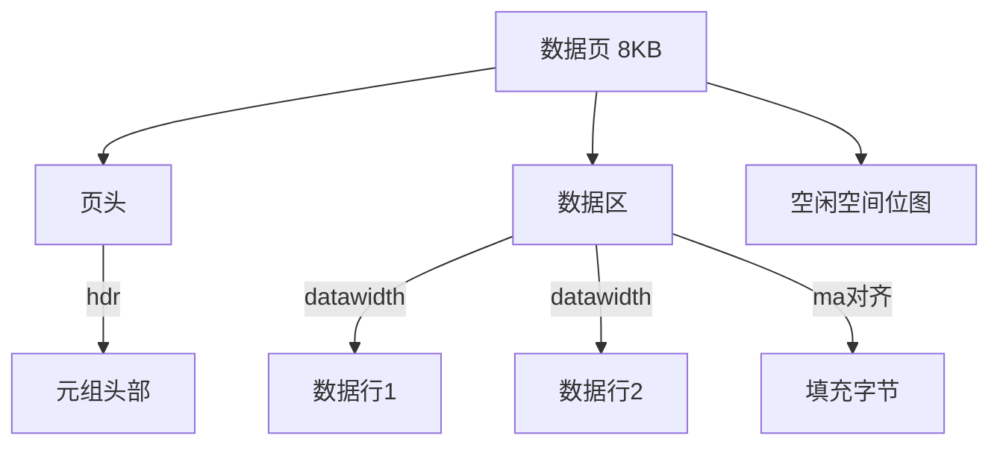

## 别找了, 这才是最好的膨胀检查SQL  
    
### 作者    
digoal    
    
### 日期    
2025-02-21    
    
### 标签    
PostgreSQL , PolarDB , DuckDB , 膨胀检查     
    
----    
    
## 背景    
谁都知道数据库有高水位, 大白话就是明明只需要一张床, 你非得买下一个小区, 其他房间不都浪费了么.   
  
## 那么怎么判断高水位/膨胀?   
别找了, 给你一条最靠谱的SQL, 后面再解释一下它为什么靠谱, 以及膨胀了怎么办?   
  
```  
create or replace view v_bloats as   
SELECT  
  current_database() AS db, schemaname, tablename, reltuples::bigint AS tups,    
  relpages::bigint AS pages, -- 表 实际占用页数   
  otta, -- 表 应该占用页数  
  ROUND(CASE WHEN otta=0 OR sml.relpages=0 OR sml.relpages=otta THEN 0.0 ELSE sml.relpages/otta::numeric END,1) AS tbloat, -- 表 实际/应该 , 减1得到膨胀比例    
  CASE WHEN relpages < otta THEN 0 ELSE relpages::bigint - otta END AS wastedpages,   
  CASE WHEN relpages < otta THEN 0 ELSE bs*(sml.relpages-otta)::bigint END AS wastedbytes,  -- 表浪费空间 字节数  
  CASE WHEN relpages < otta THEN '0 bytes'::text ELSE (bs*(relpages-otta))::bigint::text || ' bytes' END AS wastedsize,  
  iname, ituples::bigint AS itups,   
  ipages::bigint AS ipages, -- 索引 实际占用页数  
  iotta, -- 索引 应该占用页数  
  ROUND(CASE WHEN iotta=0 OR ipages=0 OR ipages=iotta THEN 0.0 ELSE ipages/iotta::numeric END,1) AS ibloat, -- 索引 实际/应该 , 减1得到膨胀比例   
  CASE WHEN ipages < iotta THEN 0 ELSE ipages::bigint - iotta END AS wastedipages,   
  CASE WHEN ipages < iotta THEN 0 ELSE bs*(ipages-iotta) END AS wastedibytes,  -- 索引浪费空间 字节数    
  CASE WHEN ipages < iotta THEN '0 bytes' ELSE (bs*(ipages-iotta))::bigint::text || ' bytes' END AS wastedisize,    
  CASE WHEN relpages < otta THEN  
      CASE WHEN ipages < iotta THEN 0 ELSE bs*(ipages-iotta::bigint) END  
    ELSE CASE WHEN ipages < iotta THEN bs*(relpages-otta::bigint)  
        ELSE bs*(relpages-otta::bigint + ipages-iotta::bigint) END  
  END AS totalwastedbytes  -- 总浪费空间 字节数     
FROM (  
  SELECT  
    nn.nspname AS schemaname,  
    cc.relname AS tablename,  
    COALESCE(cc.reltuples,0) AS reltuples,  
    COALESCE(cc.relpages,0) AS relpages,  
    COALESCE(bs,0) AS bs,  
    COALESCE(CEIL((cc.reltuples*((datahdr+ma-  
      (CASE WHEN datahdr%ma=0 THEN ma ELSE datahdr%ma END))+nullhdr2+4))/(bs-20::float)),0) AS otta,   
    COALESCE(c2.relname,'?') AS iname, COALESCE(c2.reltuples,0) AS ituples, COALESCE(c2.relpages,0) AS ipages,  
    COALESCE(CEIL((c2.reltuples*(datahdr-12))/(bs-20::float)),0) AS iotta  -- very rough approximation, assumes all cols . 索引评估不太准. 因为没有用索引级别的avg_width , 定长字段理论上可以从pg_attribute获取字段宽度提高准确度, 变长字段缺失很难评估. 而且索引还有gin,brin,bloom等接口, 更不好评估.   
  FROM  
     pg_class cc  
  JOIN pg_namespace nn ON cc.relnamespace = nn.oid AND nn.nspname <> 'information_schema'  
  LEFT JOIN  
  (  
    SELECT  
      ma,bs,foo.nspname,foo.relname,  
      (datawidth+(hdr+ma-(case when hdr%ma=0 THEN ma ELSE hdr%ma END)))::numeric AS datahdr,  
      (maxfracsum*(nullhdr+ma-(case when nullhdr%ma=0 THEN ma ELSE nullhdr%ma END))) AS nullhdr2  
    FROM (  
      SELECT  
        ns.nspname, tbl.relname, hdr, ma, bs,  
        SUM((1-coalesce(null_frac,0))*coalesce(avg_width, 2048)) AS datawidth,  
        MAX(coalesce(null_frac,0)) AS maxfracsum,  
        hdr+(  
          SELECT 1+count(*)/8  
          FROM pg_stats s2  
          WHERE null_frac<>0 AND s2.schemaname = ns.nspname AND s2.tablename = tbl.relname  
        ) AS nullhdr  
      FROM pg_attribute att  
      JOIN pg_class tbl ON att.attrelid = tbl.oid  
      JOIN pg_namespace ns ON ns.oid = tbl.relnamespace  
      LEFT JOIN pg_stats s ON s.schemaname=ns.nspname  
      AND s.tablename = tbl.relname  
      AND s.inherited=false  
      AND s.attname=att.attname,  
      (  
        SELECT  
          (SELECT current_setting('block_size')::numeric) AS bs,  
            CASE WHEN SUBSTRING(SPLIT_PART(v, ' ', 2) FROM '#"[0-9]+.[0-9]+#"%' for '#')  
              IN ('8.0','8.1','8.2') THEN 27 ELSE 23 END AS hdr,  
          CASE WHEN v ~ 'mingw32' OR v ~ '64-bit' OR v ~ 'aarch64' THEN 8 ELSE 4 END AS ma  
        FROM (SELECT version() AS v) AS foo  
      ) AS constants  
      WHERE att.attnum > 0 AND tbl.relkind='r'  
      GROUP BY 1,2,3,4,5  
    ) AS foo  
  ) AS rs  
  ON cc.relname = rs.relname AND nn.nspname = rs.nspname  
  LEFT JOIN pg_index i ON indrelid = cc.oid  
  LEFT JOIN pg_class c2 ON c2.oid = i.indexrelid  
) AS sml  
WHERE sml.relpages - otta > 10 OR ipages - iotta > 15 ;  -- 膨胀页数小于这个数的不返回    
```  
  
查询示例:   
```  
select * from v_bloats where totalwastedbytes > 100*1024*1024 ORDER BY totalwastedbytes DESC;    -- 总浪费空间 大于100MB.    
select * from v_bloats where wastedbytes > 100*1024*1024 ORDER BY wastedbytes DESC; -- 表 浪费空间 大于100MB.    
select * from v_bloats where wastedibytes > 100*1024*1024 ORDER BY wastedibytes DESC; -- 索引 浪费空间 大于100MB.    
```  
  
## 它为什么靠谱?   
  
分区表只看最底层子表. 计算时还涉及: 评估行数, 平均行宽度, 行头, 空置bitmap, 对齐, 页头页尾空间等, 估算准确度可信度比较高.   
  
索引评估不太准. 因为没有用索引级别的avg_width , 定长字段理论上可以从pg_attribute获取字段宽度提高准确度, 变长字段缺失很难评估. 而且索引还有gin,brin,bloom等接口, 更不好评估.   
  
以上SQL取自check_postgres的check_bloat.  
- https://github.com/bucardo/check_postgres  
- https://github.com/bucardo/check_postgres/blob/master/check_postgres.pl.html  
  
## 计算方法详解  
在 PostgreSQL 的膨胀检查视图中，这些字段用于计算表和索引的存储开销。  
  
存储结构示意图  

  
以下是关键术语的解释：  
  
### **核心参数**  
1. **`hdr` (Header)**  
   - **含义**: 数据页的固定头部大小（字节）  
   - **计算逻辑**:  
     - PostgreSQL 8.0~8.2 使用 `27` 字节  
     - 其他版本使用 `23` 字节  
   - **作用**: 表示每个数据页（Page）中元数据占用的固定开销  
  
2. **`ma` (Memory Alignment)**  
   - **含义**: 内存对齐边界（字节）  
   - **计算逻辑**:  
     - 64 位系统或特定平台（如 `mingw32`/`aarch64`）用 `8` 字节对齐  
     - 其他系统用 `4` 字节对齐  
   - **作用**: 确保数据按内存对齐存储，避免性能问题  
  
3. **`datawidth`**  
   - **含义**: 表中非空列的平均宽度总和（字节）  
   - **计算逻辑**:  
     ```sql  
     SUM((1 - null_frac) * avg_width)  
     ```  
   - **作用**: 估算每行数据实际占用的有效空间  
  
### **复合参数**  
4. **`datahdr`**  
   - **含义**: 数据行总头部大小（含对齐填充）  
   - **计算逻辑**:  
     ```  
     datawidth + (hdr + ma - (hdr % ma))  
     ```  
   - **作用**: 包含固定头部 `hdr` 和数据宽度 `datawidth` 的总开销，按 `ma` 对齐  
  
5. **`nullhdr`**  
   - **含义**: 空值位图的头部开销  
   - **计算逻辑**:  
     ```  
     hdr + (1 + 空值列数量 / 8)  
     ```  
   - **作用**: 存储空值标记（每 8 列占用 1 字节）  
  
6. **`maxfracsum`**  
   - **含义**: 所有列中的最大空值比例（`null_frac`）  
   - **计算逻辑**:  
     ```sql  
     MAX(coalesce(null_frac, 0))  
     ```  
   - **作用**: 估算空值位图的最大可能大小  
  
7. **`nullhdr2`**  
   - **含义**: 调整后的空值头部开销（含对齐填充）  
   - **计算逻辑**:  
     ```  
     maxfracsum * (nullhdr + ma - (nullhdr % ma))  
     ```  
   - **作用**: 空值位图按 `ma` 对齐后的总开销  
  
### **最终用途**  
这些参数用于计算 **表的理想页数 (`otta`)**：  
```sql  
CEIL((reltuples * (datahdr + nullhdr2 + 4)) / (bs - 20))  
```  
- **`bs`**: 块大小（如 8KB）  
- **`+4`**: 行指针的额外开销  
  
通过比较实际页数 (`relpages`) 和理想页数 (`otta`)，可以判断表/索引是否存在空间膨胀。  
  
### **示例说明**  
如果 `hdr=23`, `ma=8`, `datawidth=100`：  
- `datahdr = 100 + (23 + 8 - (23 % 8)) = 100 + (31 - 7) = 124`  
- 假设 `nullhdr=25`, `maxfracsum=0.2`：  
- `nullhdr2 = 0.2 * (25 + 8 - (25 % 8)) = 0.2 * (33 - 1) = 6.4`  
  
  
## 发现膨胀怎么办?   
1、发现膨胀的索引, rebuild.  
  
注意:  
- 加concurrently选项, 否则会堵塞DML.  
  
2、发现膨胀的表, 使用vacuum full会堵塞任何查询, 可以考虑使用[《PostgreSQL 收缩膨胀表或索引 - pg_squeeze or pg_repack》](../201610/20161030_02.md)    
  
<b> 还有一点要特别注意, 如果系统中有长事务/长2pc, 你只能回收在它之前产生的垃圾, 这就尴尬了, 赶紧杀了他吧, 监控长事务也是很重要的, 否则下次还会膨胀. </b>    
  
  
  
  
#### [期望 PostgreSQL|开源PolarDB 增加什么功能?](https://github.com/digoal/blog/issues/76 "269ac3d1c492e938c0191101c7238216")
  
  
#### [PolarDB 开源数据库](https://openpolardb.com/home "57258f76c37864c6e6d23383d05714ea")
  
  
#### [PolarDB 学习图谱](https://www.aliyun.com/database/openpolardb/activity "8642f60e04ed0c814bf9cb9677976bd4")
  
  
#### [PostgreSQL 解决方案集合](../201706/20170601_02.md "40cff096e9ed7122c512b35d8561d9c8")
  
  
#### [德哥 / digoal's Github - 公益是一辈子的事.](https://github.com/digoal/blog/blob/master/README.md "22709685feb7cab07d30f30387f0a9ae")
  
  
#### [About 德哥](https://github.com/digoal/blog/blob/master/me/readme.md "a37735981e7704886ffd590565582dd0")
  
  

  
