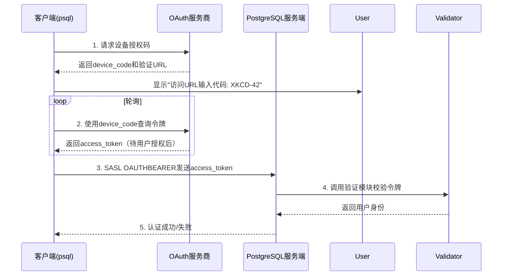
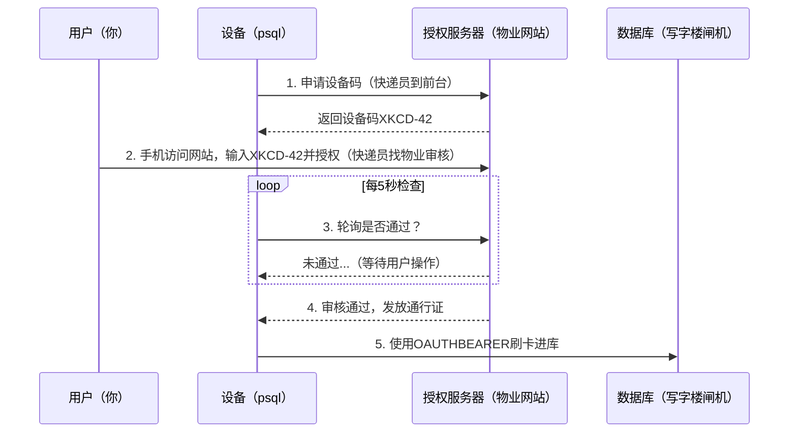

## PostgreSQL 18 preview - 支持OAuth 2.0认证协议, 可“刷卡”认证了  
                                                                                  
### 作者                                                      
digoal                                                      
                                                             
### 日期                                                           
2025-02-21                                                     
                                                          
### 标签                                                        
PostgreSQL , PolarDB , DuckDB , OAuth 2.0 , 认证协议                     
                                                                                 
----                                                          
                                                                        
## 背景        
PostgreSQL 18增加了对OAuth 2.0认证协议的支持，以下是核心内容的解读：  
  
### **一、功能概览**  
#### 1. **新增认证机制**  
- **OAUTHBEARER SASL**：基于RFC 7628，支持通过OAuth Bearer Token进行身份验证，替代传统密码。  
- **设备授权流程**：遵循RFC 8628，允许无浏览器设备（如CLI工具）通过用户二次授权完成认证。  
  
#### 2. **用户场景示例**  
```bash  
# 客户端连接命令  
psql "host=db.example.com oauth_issuer=https://auth.example.com oauth_client_id=myapp"  
# 输出提示用户访问URL输入设备码  
Visit https://auth.example.com/device and enter code: XKCD-42  
```  
  
### **二、架构设计**  
#### 1. **客户端流程**  

  
#### 2. **服务端验证框架**  
- **插件化验证模块**：允许通过动态库实现自定义令牌验证逻辑。  
- **配置示例（pg_hba.conf）**：  
  ```ini  
  # TYPE  DATABASE USER  ADDRESS   METHOD  VALIDATOR  
  hostssl all      all   0.0.0.0/0 oauth   my_custom_validator  
  ```  
  
手册详见:   
- https://www.postgresql.org/docs/devel/libpq-oauth.html  
- https://www.postgresql.org/docs/devel/auth-oauth.html  
- https://www.postgresql.org/docs/devel/oauth-validators.html  
  
https://git.postgresql.org/gitweb/?p=postgresql.git;a=commit;h=b3f0be788afc17d2206e1ae1c731d8aeda1f2f59  
```  
Add support for OAUTHBEARER SASL mechanism  
  
author	Daniel Gustafsson <dgustafsson@postgresql.org>	  
Thu, 20 Feb 2025 15:25:17 +0000 (16:25 +0100)  
committer	Daniel Gustafsson <dgustafsson@postgresql.org>	  
Thu, 20 Feb 2025 15:25:17 +0000 (16:25 +0100)  
commit	b3f0be788afc17d2206e1ae1c731d8aeda1f2f59  
tree	4935e9d745787830d57941771dd2e63b49236ae5	tree  
parent	1fd1bd871012732e3c6c482667d2f2c56f1a9395	commit | diff  
Add support for OAUTHBEARER SASL mechanism  
  
This commit implements OAUTHBEARER, RFC 7628, and OAuth 2.0 Device  
Authorization Grants, RFC 8628.  In order to use this there is a  
new pg_hba auth method called oauth.  When speaking to a OAuth-  
enabled server, it looks a bit like this:  
  
  $ psql 'host=example.org oauth_issuer=... oauth_client_id=...'  
  Visit https://oauth.example.org/login and enter the code: FPQ2-M4BG  
  
Device authorization is currently the only supported flow so the  
OAuth issuer must support that in order for users to authenticate.  
Third-party clients may however extend this and provide their own  
flows.  The built-in device authorization flow is currently not  
supported on Windows.  
  
In order for validation to happen server side a new framework for  
plugging in OAuth validation modules is added.  As validation is  
implementation specific, with no default specified in the standard,  
PostgreSQL does not ship with one built-in.  Each pg_hba entry can  
specify a specific validator or be left blank for the validator  
installed as default.  
  
This adds a requirement on libcurl for the client side support,  
which is optional to build, but the server side has no additional  
build requirements.  In order to run the tests, Python is required  
as this adds a https server written in Python.  Tests are gated  
behind PG_TEST_EXTRA as they open ports.  
  
This patch has been a multi-year project with many contributors  
involved with reviews and in-depth discussions:  Michael Paquier,  
Heikki Linnakangas, Zhihong Yu, Mahendrakar Srinivasarao, Andrey  
Chudnovsky and Stephen Frost to name a few.  While Jacob Champion  
is the main author there have been some levels of hacking by others.  
Daniel Gustafsson contributed the validation module and various bits  
and pieces; Thomas Munro wrote the client side support for kqueue.  
  
Author: Jacob Champion <jacob.champion@enterprisedb.com>  
Co-authored-by: Daniel Gustafsson <daniel@yesql.se>  
Co-authored-by: Thomas Munro <thomas.munro@gmail.com>  
Reviewed-by: Daniel Gustafsson <daniel@yesql.se>  
Reviewed-by: Peter Eisentraut <peter@eisentraut.org>  
Reviewed-by: Antonin Houska <ah@cybertec.at>  
Reviewed-by: Kashif Zeeshan <kashi.zeeshan@gmail.com>  
Discussion: https://postgr.es/m/d1b467a78e0e36ed85a09adf979d04cf124a9d4b.camel@vmware.com  
```  
  
## 什么是OAUTH?   
我用日常生活中的场景来比喻这些协议，帮助大家轻松理解：  
  
---  
  
### **一、OAUTHBEARER（RFC 7628）—— 工作证刷卡机**  
**场景想象**：    
你每天上班进公司大门，不需要每次都输入密码，而是刷工牌就能通过闸机。这个工牌就是你的"Bearer Token"（持有者令牌）。  
  
**技术本质**：  
1. **Bearer Token** 就像工牌，谁拿着它就能获得权限（因此必须加密传输）  
2. **SASL机制** 就像刷卡机，专门处理这种刷卡验证的流程  
3. **RFC 7628** 规定了刷卡机的标准接口，让所有公司的刷卡机都兼容同样的工牌格式  
  
**PostgreSQL应用**：    
当你在终端输入 `psql` 连接数据库时，背后的流程类似：  
```bash  
终端 -> 数据库闸机：我要用OAUTHBEARER机制刷卡  
数据库闸机 -> 终端：请出示工牌  
终端 -> 数据库闸机：这是我的工牌（发送加密后的Token）  
数据库闸机 -> 人事系统：验证工牌有效性 ✅  
```  
  
---  
  
### **二、设备授权许可（RFC 8628）—— 访客临时通行证**  
**场景想象**：    
你是快递员需要进入写字楼送货，但没员工卡。前台给你一个 **6位数验证码**，让你去物业网站申请临时通行证。  
  
**分步流程**：  
1. **获取设备码**（类似快递员拿到6位数）    
   ```bash  
   $ psql "host=db.example.com oauth_issuer=... oauth_client_id=..."  
   提示：访问 https://auth.example.com 并输入代码：XKCD-42  
   ```  
     
2. **用户授权**（物业网站审核快递员身份）    
   👩💻 你在手机上打开网页，输入XKCD-42，点击"允许访问"  
  
3. **轮询获取令牌**（前台持续检查是否审核通过）    
   ```python  
   while True:  
       快递员问前台："我的申请通过了吗？"  
       if 通过:  
           拿到临时通行证（Access Token）  
           break  
   ```  
  
4. **使用令牌**（快递员刷卡进入）    
   ```bash  
   终端自动用拿到的通行证通过OAUTHBEARER机制连接数据库  
   ```  
  
---  
  
### **三、协议配合流程图解**  

  
---  
  
### **四、为什么比密码更安全？**  
|          | 传统密码                     | OAuth令牌                  |  
|----------|----------------------------|---------------------------|  
| **形式** | 固定字符串（容易被盗）         | 短时效令牌（失活快）         |  
| **泄露** | 知道密码就能登录              | 需同时窃取令牌+网络拦截      |  
| **权限** | 完全访问权限                 | 可限制特定权限（如只读）      |  
| **案例** | 密码泄露导致数据被盗           | 令牌泄露后1小时自动失效       |  
  
---  
  
### **五、开发者需注意的细节**  
1. **令牌有效期**：就像临时通行证通常只有1天有效期，需及时刷新  
2. **HTTPS强制**：所有通信必须加密，就像快递员必须走安检通道  
3. **设备码设计**：  
   - 短码（方便输入）：`XKCD-42` 比 `0x3e7a1b` 更友好  
   - 过期时间：通常5分钟未输入则失效，防止被冒用  
  
通过这种机制，即使你在没有浏览器的命令行环境中，也能安全地完成现代身份认证！  
       
       
  
#### [期望 PostgreSQL|开源PolarDB 增加什么功能?](https://github.com/digoal/blog/issues/76 "269ac3d1c492e938c0191101c7238216")
  
  
#### [PolarDB 开源数据库](https://openpolardb.com/home "57258f76c37864c6e6d23383d05714ea")
  
  
#### [PolarDB 学习图谱](https://www.aliyun.com/database/openpolardb/activity "8642f60e04ed0c814bf9cb9677976bd4")
  
  
#### [PostgreSQL 解决方案集合](../201706/20170601_02.md "40cff096e9ed7122c512b35d8561d9c8")
  
  
#### [德哥 / digoal's Github - 公益是一辈子的事.](https://github.com/digoal/blog/blob/master/README.md "22709685feb7cab07d30f30387f0a9ae")
  
  
#### [About 德哥](https://github.com/digoal/blog/blob/master/me/readme.md "a37735981e7704886ffd590565582dd0")
  
  

  
