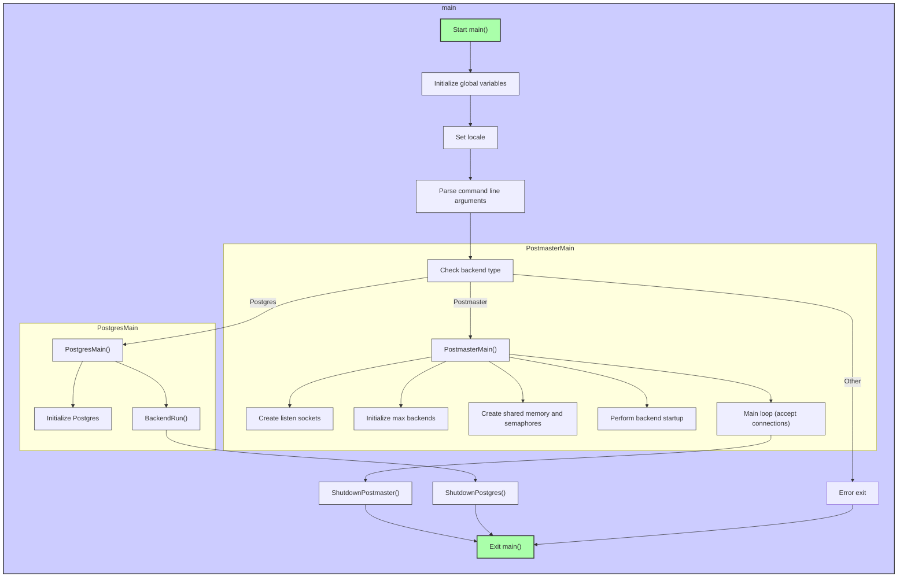

## AI辅助 PolarDB内核学习 - 4 解读入口点代码`main.c`  
        
### 作者        
digoal        
        
### 日期        
2025-02-24        
        
### 标签        
PostgreSQL , PolarDB , DuckDB , AI , 程序入口点 , `main.c`    
        
----        
        
## 背景     
结合DeepSeek V3和Gemini 2.0 Flash, 解读PolarDB PostgreSQL 15 入口点代码`src/backend/main/main.c`.    
  
<b>提示: 逐行解读数据库代码中的这个c文件, 我是一名c语言初学者, 要让我看懂. </b>     
  
## 解读`main.c`  

   
**文件头注释:**  
  
```c  
/*-------------------------------------------------------------------------  
 *  
 * main.c  
 *	  Stub main() routine for the postgres executable.  
 *  
 * This does some essential startup tasks for any incarnation of postgres  
 * (postmaster, standalone backend, standalone bootstrap process, or a  
 * separately exec'd child of a postmaster) and then dispatches to the  
 * proper FooMain() routine for the incarnation.  
 *  
 *  
 * Portions Copyright (c) 1996-2022, PostgreSQL Global Development Group  
 * Portions Copyright (c) 1994, Regents of the University of California  
 *  
 *  
 * IDENTIFICATION  
 *	  src/backend/main/main.c  
 *  
 *-------------------------------------------------------------------------  
 */  
```  
  
*   这是一个多行注释，用 `/*` 开始，用 `*/` 结束。  
*   `main.c`:  文件名，表明这是 PostgreSQL 可执行文件的主要入口点。  
*   "Stub main() routine...":  说明这个 `main()` 函数是一个“桩”（stub），它主要负责启动，然后将控制权交给其他更具体的函数。  
*   "This does some essential startup tasks...":  概括了 `main()` 函数的功能：执行一些必要的启动任务。  
*   "any incarnation of postgres...":  PostgreSQL 可以以多种方式运行，例如：  
    *   `postmaster`:  主服务器进程，负责管理其他进程。  
    *   `standalone backend`:  一个独立的后端进程，用于处理客户端连接。  
    *   `standalone bootstrap process`:  用于初始化数据库的引导程序。  
    *   `separately exec'd child of a postmaster`:  由 `postmaster` 启动的子进程。  
*   "dispatches to the proper FooMain() routine...":  `main()` 函数会根据不同的运行模式，将控制权交给不同的 `FooMain()` 函数。  
*   "Portions Copyright...":  版权信息，说明代码的版权归属。  
*   "IDENTIFICATION src/backend/main/main.c":  标识符，表明文件在源代码目录中的位置。  
  
**包含头文件:**  
  
```c  
#include "postgres.h"  
  
#include <unistd.h>  
  
#if defined(WIN32)  
#include <crtdbg.h>  
#endif  
  
#if defined(__NetBSD__)  
#include <sys/param.h>  
#endif  
  
#if defined(_M_AMD64) && _MSC_VER == 1800  
#include <math.h>  
#include <versionhelpers.h>  
#endif  
  
#include "bootstrap/bootstrap.h"  
#include "common/username.h"  
#include "port/atomics.h"  
#include "postmaster/postmaster.h"  
#include "storage/spin.h"  
#include "tcop/tcopprot.h"  
#include "utils/help_config.h"  
#include "utils/memutils.h"  
#include "utils/pg_locale.h"  
#include "utils/ps_status.h"  
```  
  
*   `#include`:  C 语言的预处理指令，用于包含头文件。头文件包含了函数声明、变量声明、宏定义等信息，使得代码可以使用这些定义。  
*   `"postgres.h"`:  PostgreSQL 的主头文件，包含了许多常用的定义。  
*   `<unistd.h>`:  包含了 POSIX 标准的系统调用函数，例如 `unistd()` (用于获取用户 ID)。  
*   `#if defined(WIN32)`:  条件编译指令。如果定义了 `WIN32` 宏，则包含 `<crtdbg.h>` 头文件。这表示以下代码是特定于 Windows 平台的。  
*   `<crtdbg.h>`:  包含了 C 运行时库的调试功能。  
*   `#if defined(__NetBSD__)`:  条件编译指令，用于 NetBSD 操作系统。  
*   `<sys/param.h>`:  包含了系统参数的定义。  
*   `#if defined(_M_AMD64) && _MSC_VER == 1800`:  条件编译指令，用于特定的 Windows 平台和编译器版本。  
*   `<math.h>`:  包含了数学函数的定义。  
*   `<versionhelpers.h>`: 包含了帮助函数，用于检查 Windows 版本。  
*   `"bootstrap/bootstrap.h"`:  包含了引导程序相关的定义。  
*   `"common/username.h"`:  包含了获取用户名的函数。  
*   `"port/atomics.h"`:  包含了原子操作相关的定义，用于并发编程。  
*   `"postmaster/postmaster.h"`:  包含了 `postmaster` 进程相关的定义。  
*   `"storage/spin.h"`:  包含了自旋锁相关的定义，用于保护共享资源。  
*   `"tcop/tcopprot.h"`:  包含了客户端/服务器通信协议相关的定义。  
*   `"utils/help_config.h"`:  包含了帮助和配置相关的定义。  
*   `"utils/memutils.h"`:  包含了内存管理相关的定义。  
*   `"utils/pg_locale.h"`:  包含了本地化相关的定义。  
*   `"utils/ps_status.h"`:  包含了设置进程状态相关的定义，用于 `ps` 命令显示。  
  
**全局变量声明:**  
  
```c  
const char *progname;  
```  
  
*   `const char *progname`:  声明一个全局变量 `progname`，它是一个指向常量字符的指针。  这个变量用于存储程序的名称。  `const` 关键字表示这个指针指向的字符串内容不能被修改。  
  
**静态函数声明:**  
  
```c  
static void startup_hacks(const char *progname);  
static void init_locale(const char *categoryname, int category, const char *locale);  
static void help(const char *progname);  
static void check_root(const char *progname);  
```  
  
*   `static`:  关键字，表示这些函数只能在当前文件中访问，不能被其他文件调用。  
*   `void`:  表示这些函数没有返回值。  
*   `startup_hacks(const char *progname)`:  声明一个名为 `startup_hacks` 的函数，它接受一个指向常量字符的指针作为参数，用于执行平台相关的启动操作。  
*   `init_locale(const char *categoryname, int category, const char *locale)`:  声明一个名为 `init_locale` 的函数，用于初始化本地化信息。  
*   `help(const char *progname)`:  声明一个名为 `help` 的函数，用于显示帮助信息。  
*   `check_root(const char *progname)`:  声明一个名为 `check_root` 的函数，用于检查程序是否以 root 用户运行。  
  
**`main()` 函数定义:**  
  
```c  
/*  
 * Any Postgres server process begins execution here.  
 */  
int  
main(int argc, char *argv[])  
{  
	bool		do_check_root = true;  
  
	/*  
	 * If supported on the current platform, set up a handler to be called if  
	 * the backend/postmaster crashes with a fatal signal or exception.  
	 */  
#if defined(WIN32) && defined(HAVE_MINIDUMP_TYPE)  
	pgwin32_install_crashdump_handler();  
#endif  
  
	progname = get_progname(argv[0]);  
  
	/*  
	 * Platform-specific startup hacks  
	 */  
	startup_hacks(progname);  
  
	/*  
	 * Remember the physical location of the initially given argv[] array for  
	 * possible use by ps display.  On some platforms, the argv[] storage must  
	 * be overwritten in order to set the process title for ps. In such cases  
	 * save_ps_display_args makes and returns a new copy of the argv[] array.  
	 *  
	 * save_ps_display_args may also move the environment strings to make  
	 * extra room. Therefore this should be done as early as possible during  
	 * startup, to avoid entanglements with code that might save a getenv()  
	 * result pointer.  
	 */  
	argv = save_ps_display_args(argc, argv);  
  
	/*  
	 * Fire up essential subsystems: error and memory management  
	 *  
	 * Code after this point is allowed to use elog/ereport, though  
	 * localization of messages may not work right away, and messages won't go  
	 * anywhere but stderr until GUC settings get loaded.  
	 */  
	MemoryContextInit();  
  
	/*  
	 * Set up locale information  
	 */  
	set_pglocale_pgservice(argv[0], PG_TEXTDOMAIN("postgres"));  
  
	/*  
	 * In the postmaster, absorb the environment values for LC_COLLATE and  
	 * LC_CTYPE.  Individual backends will change these later to settings  
	 * taken from pg_database, but the postmaster cannot do that.  If we leave  
	 * these set to "C" then message localization might not work well in the  
	 * postmaster.  
	 */  
	init_locale("LC_COLLATE", LC_COLLATE, "");  
	init_locale("LC_CTYPE", LC_CTYPE, "");  
  
	/*  
	 * LC_MESSAGES will get set later during GUC option processing, but we set  
	 * it here to allow startup error messages to be localized.  
	 */  
#ifdef LC_MESSAGES  
	init_locale("LC_MESSAGES", LC_MESSAGES, "");  
#endif  
  
	/*  
	 * We keep these set to "C" always, except transiently in pg_locale.c; see  
	 * that file for explanations.  
	 */  
	init_locale("LC_MONETARY", LC_MONETARY, "C");  
	init_locale("LC_NUMERIC", LC_NUMERIC, "C");  
	init_locale("LC_TIME", LC_TIME, "C");  
  
	/*  
	 * Now that we have absorbed as much as we wish to from the locale  
	 * environment, remove any LC_ALL setting, so that the environment  
	 * variables installed by pg_perm_setlocale have force.  
	 */  
	unsetenv("LC_ALL");  
  
	check_strxfrm_bug();  
  
	/*  
	 * Catch standard options before doing much else, in particular before we  
	 * insist on not being root.  
	 */  
	if (argc > 1)  
	{  
		if (strcmp(argv[1], "--help") == 0 || strcmp(argv[1], "-?") == 0)  
		{  
			help(progname);  
			exit(0);  
		}  
		if (strcmp(argv[1], "--version") == 0 || strcmp(argv[1], "-V") == 0)  
		{  
			fputs(PG_BACKEND_VERSIONSTR, stdout);  
			exit(0);  
		}  
  
		/*  
		 * In addition to the above, we allow "--describe-config" and "-C var"  
		 * to be called by root.  This is reasonably safe since these are  
		 * read-only activities.  The -C case is important because pg_ctl may  
		 * try to invoke it while still holding administrator privileges on  
		 * Windows.  Note that while -C can normally be in any argv position,  
		 * if you want to bypass the root check you must put it first.  This  
		 * reduces the risk that we might misinterpret some other mode's -C  
		 * switch as being the postmaster/postgres one.  
		 */  
		if (strcmp(argv[1], "--describe-config") == 0)  
			do_check_root = false;  
		else if (argc > 2 && strcmp(argv[1], "-C") == 0)  
			do_check_root = false;  
	}  
  
	/*  
	 * Make sure we are not running as root, unless it's safe for the selected  
	 * option.  
	 */  
	if (do_check_root)  
		check_root(progname);  
  
	/*  
	 * Dispatch to one of various subprograms depending on first argument.  
	 */  
  
	if (argc > 1 && strcmp(argv[1], "--check") == 0)  
		BootstrapModeMain(argc, argv, true);  
	else if (argc > 1 && strcmp(argv[1], "--boot") == 0)  
		BootstrapModeMain(argc, argv, false);  
#ifdef EXEC_BACKEND  
	else if (argc > 1 && strncmp(argv[1], "--fork", 6) == 0)  
		SubPostmasterMain(argc, argv);  
#endif  
	else if (argc > 1 && strcmp(argv[1], "--describe-config") == 0)  
		GucInfoMain();  
	else if (argc > 1 && strcmp(argv[1], "--single") == 0)  
		PostgresSingleUserMain(argc, argv,  
							   strdup(get_user_name_or_exit(progname)));  
	else  
		PostmasterMain(argc, argv);  
	/* the functions above should not return */  
	abort();  
}  
```  
  
*   `int main(int argc, char *argv[])`:  `main()` 函数的定义。  
    *   `int`:  表示 `main()` 函数返回一个整数值，通常用于表示程序的退出状态。  
    *   `argc`:  整数，表示命令行参数的数量。  
    *   `argv`:  一个指向字符指针的数组，每个指针指向一个命令行参数。  例如，如果运行 `postgres -p 5432`，则 `argc` 为 3，`argv[0]` 指向 "postgres"，`argv[1]` 指向 "-p"，`argv[2]` 指向 "5432"。  
*   `bool do_check_root = true;`:  声明一个布尔变量 `do_check_root`，并初始化为 `true`。  这个变量用于控制是否检查程序是否以 root 用户运行。  
*   `#if defined(WIN32) && defined(HAVE_MINIDUMP_TYPE)`:  条件编译指令，用于 Windows 平台。  
*   `pgwin32_install_crashdump_handler();`:  在 Windows 平台上安装一个崩溃转储处理程序，用于在程序崩溃时生成崩溃转储文件，方便调试。  
*   `progname = get_progname(argv[0]);`:  调用 `get_progname()` 函数获取程序的名称，并将结果存储在全局变量 `progname` 中。  `argv[0]` 通常包含程序的完整路径，`get_progname()` 函数可能从中提取程序名。  
*   `startup_hacks(progname);`:  调用 `startup_hacks()` 函数，执行平台相关的启动操作。  
*   `argv = save_ps_display_args(argc, argv);`:  调用 `save_ps_display_args()` 函数，保存命令行参数的副本，以便 `ps` 命令可以正确显示进程信息。  在某些平台上，需要修改 `argv` 数组来设置进程标题。  
*   `MemoryContextInit();`:  初始化内存管理子系统，允许后续代码使用`elog/ereport`等错误报告函数。  PostgreSQL 使用自定义的内存管理机制，`MemoryContextInit()` 函数负责初始化这个机制。  
*   `set_pglocale_pgservice(argv[0], PG_TEXTDOMAIN("postgres"));`:  设置本地化信息，例如语言和字符集。  
*   `init_locale("LC_COLLATE", LC_COLLATE, "");`:  初始化 `LC_COLLATE` 本地化类别。  `LC_COLLATE` 影响字符串的排序规则。  
*   `init_locale("LC_CTYPE", LC_CTYPE, "");`:  初始化 `LC_CTYPE` 本地化类别。  `LC_CTYPE` 影响字符的分类和处理，例如大小写转换。  
*   `#ifdef LC_MESSAGES`:  条件编译指令。  
*   `init_locale("LC_MESSAGES", LC_MESSAGES, "");`:  初始化 `LC_MESSAGES` 本地化类别。  `LC_MESSAGES` 影响程序消息的语言。  
*   `init_locale("LC_MONETARY", LC_MONETARY, "C");`:  初始化 `LC_MONETARY` 本地化类别。  `LC_MONETARY` 影响货币格式。  这里强制设置为 "C" locale。  
*   `init_locale("LC_NUMERIC", LC_NUMERIC, "C");`:  初始化 `LC_NUMERIC` 本地化类别。  `LC_NUMERIC` 影响数字格式。  这里强制设置为 "C" locale。  
*   `init_locale("LC_TIME", LC_TIME, "C");`:  初始化 `LC_TIME` 本地化类别。  `LC_TIME` 影响时间格式。  这里强制设置为 "C" locale。  
*   `unsetenv("LC_ALL");`:  移除 `LC_ALL` 环境变量。  `LC_ALL` 可以覆盖其他本地化变量，这里移除它是为了确保 PostgreSQL 的本地化设置生效。  
*   `check_strxfrm_bug();`:  检查 `strxfrm()` 函数的 bug。  `strxfrm()` 函数用于字符串转换，某些平台上的实现存在 bug。  
*   `if (argc > 1)`:  检查是否有命令行参数。  
*   `if (strcmp(argv[1], "--help") == 0 || strcmp(argv[1], "-?") == 0)`:  检查第一个参数是否是 "--help" 或 "-?"。  `strcmp()` 函数用于比较字符串。  
*   `help(progname);`:  调用 `help()` 函数，显示帮助信息。  
*   `exit(0);`:  退出程序，返回状态码 0，表示程序正常退出。  
*   `if (strcmp(argv[1], "--version") == 0 || strcmp(argv[1], "-V") == 0)`:  检查第一个参数是否是 "--version" 或 "-V"。  
*   `fputs(PG_BACKEND_VERSIONSTR, stdout);`:  将 PostgreSQL 的版本信息输出到标准输出。  
*   `if (strcmp(argv[1], "--describe-config") == 0)`:  检查第一个参数是否是 "--describe-config"。  
*   `do_check_root = false;`:  如果参数是 "--describe-config"，则不检查 root 用户。  
*   `else if (argc > 2 && strcmp(argv[1], "-C") == 0)`: 检查第一个参数是否是 "-C" 并且有至少两个参数。  
*   `do_check_root = false;`: 如果参数是 "-C"，则不检查 root 用户。  
*   `if (do_check_root)`:  如果 `do_check_root` 为 `true`，则检查程序是否以 root 用户运行。  
*   `check_root(progname);`:  调用 `check_root()` 函数，检查程序是否以 root 用户运行。  
*   `if (argc > 1 && strcmp(argv[1], "--check") == 0)`:  检查第一个参数是否是 "--check"。  
*   `BootstrapModeMain(argc, argv, true);`:  调用 `BootstrapModeMain()` 函数，以检查模式运行引导程序。  
*   `else if (argc > 1 && strcmp(argv[1], "--boot") == 0)`:  检查第一个参数是否是 "--boot"。  
*   `BootstrapModeMain(argc, argv, false);`:  调用 `BootstrapModeMain()` 函数，以引导模式运行引导程序。  
*   `#ifdef EXEC_BACKEND`:  条件编译指令。  
*   `else if (argc > 1 && strncmp(argv[1], "--fork", 6) == 0)`:  检查第一个参数是否以 "--fork" 开头。  `strncmp()` 函数用于比较字符串的前 N 个字符。  
*   `SubPostmasterMain(argc, argv);`:  调用 `SubPostmasterMain()` 函数，以子 `postmaster` 模式运行。  
*   `else if (argc > 1 && strcmp(argv[1], "--describe-config") == 0)`:  检查第一个参数是否是 "--describe-config"。  
*   `GucInfoMain();`:  调用 `GucInfoMain()` 函数，显示配置信息。  
*   `else if (argc > 1 && strcmp(argv[1], "--single") == 0)`:  检查第一个参数是否是 "--single"。  
*   `PostgresSingleUserMain(argc, argv, strdup(get_user_name_or_exit(progname)));`:  调用 `PostgresSingleUserMain()` 函数，以单用户模式运行。  
*   `else`:  如果没有匹配的参数，则以 `postmaster` 模式运行。  
*   `PostmasterMain(argc, argv);`:  调用 `PostmasterMain()` 函数，以 `postmaster` 模式运行。  
*   `abort();`:  终止程序。  `abort()` 函数通常用于表示程序发生了严重的错误，无法继续运行。  注释 "the functions above should not return" 说明前面的 `Main` 函数应该不会返回，如果返回了，就调用 `abort()` 终止程序。  
  
**`startup_hacks()` 函数定义:**  
  
```c  
/*  
 * Place platform-specific startup hacks here.  This is the right  
 * place to put code that must be executed early in the launch of any new  
 * server process.  Note that this code will NOT be executed when a backend  
 * or sub-bootstrap process is forked, unless we are in a fork/exec  
 * environment (ie EXEC_BACKEND is defined).  
 *  
 * XXX The need for code here is proof that the platform in question  
 * is too brain-dead to provide a standard C execution environment  
 * without help.  Avoid adding more here, if you can.  
 */  
static void  
startup_hacks(const char *progname)  
{  
	/*  
	 * Windows-specific execution environment hacking.  
	 */  
#ifdef WIN32  
	{  
		WSADATA		wsaData;  
		int			err;  
  
		/* Make output streams unbuffered by default */  
		setvbuf(stdout, NULL, _IONBF, 0);  
		setvbuf(stderr, NULL, _IONBF, 0);  
  
		/* Prepare Winsock */  
		err = WSAStartup(MAKEWORD(2, 2), &wsaData);  
		if (err != 0)  
		{  
			write_stderr("%s: WSAStartup failed: %d\n",  
						 progname, err);  
			exit(1);  
		}  
  
		/*  
		 * By default abort() only generates a crash-dump in *non* debug  
		 * builds. As our Assert() / ExceptionalCondition() uses abort(),  
		 * leaving the default in place would make debugging harder.  
		 *  
		 * MINGW's own C runtime doesn't have _set_abort_behavior(). When  
		 * targeting Microsoft's UCRT with mingw, it never links to the debug  
		 * version of the library and thus doesn't need the call to  
		 * _set_abort_behavior() either.  
		 */  
#if !defined(__MINGW32__) && !defined(__MINGW64__)  
		_set_abort_behavior(_CALL_REPORTFAULT | _WRITE_ABORT_MSG,  
							_CALL_REPORTFAULT | _WRITE_ABORT_MSG);  
#endif							/* !defined(__MINGW32__) &&  
								 * !defined(__MINGW64__) */  
  
		/*  
		 * SEM_FAILCRITICALERRORS causes more errors to be reported to  
		 * callers.  
		 *  
		 * We used to also specify SEM_NOGPFAULTERRORBOX, but that prevents  
		 * windows crash reporting from working. Which includes registered  
		 * just-in-time debuggers, making it unnecessarily hard to debug  
		 * problems on windows. Now we try to disable sources of popups  
		 * separately below (note that SEM_NOGPFAULTERRORBOX did not actually  
		 * prevent all sources of such popups).  
		 */  
		SetErrorMode(SEM_FAILCRITICALERRORS);  
  
		/*  
		 * Show errors on stderr instead of popup box (note this doesn't  
		 * affect errors originating in the C runtime, see below).  
		 */  
		_set_error_mode(_OUT_TO_STDERR);  
  
		/*  
		 * In DEBUG builds, errors, including assertions, C runtime errors are  
		 * reported via _CrtDbgReport. By default such errors are displayed  
		 * with a popup (even with NOGPFAULTERRORBOX), preventing forward  
		 * progress. Instead report such errors stderr (and the debugger).  
		 * This is C runtime specific and thus the above incantations aren't  
		 * sufficient to suppress these popups.  
		 */  
		_CrtSetReportMode(_CRT_ERROR, _CRTDBG_MODE_FILE | _CRTDBG_MODE_DEBUG);  
		_CrtSetReportFile(_CRT_ERROR, _CRTDBG_FILE_STDERR);  
		_CrtSetReportMode(_CRT_ASSERT, _CRTDBG_MODE_FILE | _CRTDBG_MODE_DEBUG);  
		_CrtSetReportFile(_CRT_ASSERT, _CRTDBG_FILE_STDERR);  
		_CrtSetReportMode(_CRT_WARN, _CRTDBG_MODE_FILE | _CRTDBG_MODE_DEBUG);  
		_CrtSetReportFile(_CRT_WARN, _CRTDBG_FILE_STDERR);  
  
#if defined(_M_AMD64) && _MSC_VER == 1800  
  
		/*----------  
		 * Avoid crashing in certain floating-point operations if we were  
		 * compiled for x64 with MS Visual Studio 2013 and are running on  
		 * Windows prior to 7/2008R2 SP1 on an AVX2-capable CPU.  
		 *  
		 * Ref: https://connect.microsoft.com/VisualStudio/feedback/details/811093/visual-studio-2013-rtm-c-x64-code-generation-bug-for-avx2-instructions  
		 *----------  
		 */  
		if (!IsWindows7SP1OrGreater())  
		{  
			_set_FMA3_enable(0);  
		}  
#endif							/* defined(_M_AMD64) && _MSC_VER == 1800 */  
  
	}  
#endif							/* WIN32 */  
  
	/*  
	 * Initialize dummy_spinlock, in case we are on a platform where we have  
	 * to use the fallback implementation of pg_memory_barrier().  
	 */  
	SpinLockInit(&dummy_spinlock);  
}  
```  
  
*   这个函数包含平台相关的启动操作。  
*   `#ifdef WIN32`:  如果定义了 `WIN32` 宏，则执行以下代码，这些代码是特定于 Windows 平台的。  
*   `WSADATA wsaData;`:  声明一个 `WSADATA` 类型的变量 `wsaData`，用于存储 Winsock 的信息。  
*   `int err;`:  声明一个整数变量 `err`，用于存储错误码。  
*   `setvbuf(stdout, NULL, _IONBF, 0);`:  设置标准输出流 `stdout` 为无缓冲模式。  `_IONBF` 表示无缓冲。  
*   `setvbuf(stderr, NULL, _IONBF, 0);`:  设置标准错误流 `stderr` 为无缓冲模式。  
*   `err = WSAStartup(MAKEWORD(2, 2), &wsaData);`:  初始化 Winsock 库。  `MAKEWORD(2, 2)` 表示使用 Winsock 2.2 版本。  
*   `if (err != 0)`:  检查 `WSAStartup()` 函数是否成功。  
*   `write_stderr("%s: WSAStartup failed: %d\n", progname, err);`:  将错误信息输出到标准错误流。  
*   `exit(1);`:  退出程序，返回状态码 1，表示程序发生了错误。  
*   `#if !defined(__MINGW32__) && !defined(__MINGW64__)`:  条件编译指令，用于非 MinGW 编译器。  
*   `_set_abort_behavior(_CALL_REPORTFAULT | _WRITE_ABORT_MSG, _CALL_REPORTFAULT | _WRITE_ABORT_MSG);`:  设置 `abort()` 函数的行为。  
*   `SetErrorMode(SEM_FAILCRITICALERRORS);`:  设置错误模式。  
*   `_set_error_mode(_OUT_TO_STDERR);`:  设置错误输出模式。  
*   `_CrtSetReportMode(_CRT_ERROR, _CRTDBG_MODE_FILE | _CRTDBG_MODE_DEBUG);`:  设置 C 运行时库的错误报告模式。  
*   `_CrtSetReportFile(_CRT_ERROR, _CRTDBG_FILE_STDERR);`:  设置 C 运行时库的错误报告文件。  
*   `#if defined(_M_AMD64) && _MSC_VER == 1800`:  条件编译指令，用于特定的 Windows 平台和编译器版本。  
*   `if (!IsWindows7SP1OrGreater())`:  检查 Windows 版本是否大于等于 Windows 7 SP1。  
*   `_set_FMA3_enable(0);`:  禁用 FMA3 指令。  
*   `SpinLockInit(&dummy_spinlock);`:  初始化一个虚拟的自旋锁。  
  
**`init_locale()` 函数定义:**  
  
```c  
/*  
 * Make the initial permanent setting for a locale category.  If that fails,  
 * perhaps due to LC_foo=invalid in the environment, use locale C.  If even  
 * that fails, perhaps due to out-of-memory, the entire startup fails with it.  
 * When this returns, we are guaranteed to have a setting for the given  
 * category's environment variable.  
 */  
static void  
init_locale(const char *categoryname, int category, const char *locale)  
{  
	if (pg_perm_setlocale(category, locale) == NULL &&  
		pg_perm_setlocale(category, "C") == NULL)  
		elog(FATAL, "could not adopt \"%s\" locale nor C locale for %s",  
			 locale, categoryname);  
}  
```  
  
*   这个函数用于初始化本地化信息。  
*   `if (pg_perm_setlocale(category, locale) == NULL && pg_perm_setlocale(category, "C") == NULL)`:  尝试设置本地化信息。  如果设置失败，则尝试使用 "C" locale。  
*   `elog(FATAL, "could not adopt \"%s\" locale nor C locale for %s", locale, categoryname);`:  如果设置本地化信息失败，则输出错误信息并终止程序。  `elog()` 函数用于输出日志信息。  `FATAL` 表示这是一个致命错误。  
  
**`help()` 函数定义:**  
  
```c  
/*  
 * Help display should match the options accepted by PostmasterMain()  
 * and PostgresMain().  
 *  
 * XXX On Windows, non-ASCII localizations of these messages only display  
 * correctly if the console output code page covers the necessary characters.  
 * Messages emitted in write_console() do not exhibit this problem.  
 */  
static void  
help(const char *progname)  
{  
	printf(_("%s is the PostgreSQL server.\n\n"), progname);  
	printf(_("Usage:\n  %s [OPTION]...\n\n"), progname);  
	printf(_("Options:\n"));  
	printf(_("  -B NBUFFERS        number of shared buffers\n"));  
	printf(_("  -c NAME=VALUE      set run-time parameter\n"));  
	printf(_("  -C NAME            print value of run-time parameter, then exit\n"));  
	printf(_("  -d 1-5             debugging level\n"));  
	printf(_("  -D DATADIR         database directory\n"));  
	printf(_("  -e                 use European date input format (DMY)\n"));  
	printf(_("  -F                 turn fsync off\n"));  
	printf(_("  -h HOSTNAME        host name or IP address to listen on\n"));  
	printf(_("  -i                 enable TCP/IP connections\n"));  
	printf(_("  -k DIRECTORY       Unix-domain socket location\n"));  
#ifdef USE_SSL  
	printf(_("  -l                 enable SSL connections\n"));  
#endif  
	printf(_("  -N MAX-CONNECT     maximum number of allowed connections\n"));  
	printf(_("  -p PORT            port number to listen on\n"));  
	printf(_("  -s                 show statistics after each query\n"));  
	printf(_("  -S WORK-MEM        set amount of memory for sorts (in kB)\n"));  
	printf(_("  -V, --version      output version information, then exit\n"));  
	printf(_("  --NAME=VALUE       set run-time parameter\n"));  
	printf(_("  --describe-config  describe configuration parameters, then exit\n"));  
	printf(_("  -?, --help         show this help, then exit\n"));  
  
	printf(_("\nDeveloper options:\n"));  
	printf(_("  -f s|i|o|b|t|n|m|h forbid use of some plan types\n"));  
	printf(_("  -n                 do not reinitialize shared memory after abnormal exit\n"));  
	printf(_("  -O                 allow system table structure changes\n"));  
	printf(_("  -P                 disable system indexes\n"));  
	printf(_("  -t pa|pl|ex        show timings after each query\n"));  
	printf(_("  -T                 send SIGSTOP to all backend processes if one dies\n"));  
	printf(_("  -W NUM             wait NUM seconds to allow attach from a debugger\n"));  
  
	printf(_("\nOptions for single-user mode:\n"));  
	printf(_("  --single           selects single-user mode (must be first argument)\n"));  
	printf(_("  DBNAME             database name (defaults to user name)\n"));  
	printf(_("  -d 0-5             override debugging level\n"));  
	printf(_("  -E                 echo statement before execution\n"));  
	printf(_("  -j                 do not use newline as interactive query delimiter\n"));  
	printf(_("  -r FILENAME        send stdout and stderr to given file\n"));  
  
	printf(_("\nOptions for bootstrapping mode:\n"));  
	printf(_("  --boot             selects bootstrapping mode (must be first argument)\n"));  
	printf(_("  --check            selects check mode (must be first argument)\n"));  
	printf(_("  DBNAME             database name (mandatory argument in bootstrapping mode)\n"));  
	printf(_("  -r FILENAME        send stdout and stderr to given file\n"));  
  
	printf(_("\nPlease read the documentation for the complete list of run-time\n"  
			 "configuration settings and how to set them on the command line or in\n"  
			 "the configuration file.\n\n"  
			 "Report bugs to <%s>.\n"), PACKAGE_BUGREPORT);  
	printf(_("%s home page: <%s>\n"), PACKAGE_NAME, PACKAGE_URL);  
}  
```  
  
*   这个函数用于显示帮助信息。  
  
**`check_root()` 函数定义:**  
  
```c  
static void  
check_root(const char *progname)  
{  
#ifndef WIN32  
	if (geteuid() == 0)  
	{  
		write_stderr("\"root\" execution of the PostgreSQL server is not permitted.\n"  
					 "The server must be started under an unprivileged user ID to prevent\n"  
					 "possible system security compromises.  See the documentation for\n"  
					 "more information on how to properly start the server.\n");  
		exit(1);  
	}  
  
	/*  
	 * Also make sure that real and effective uids are the same. Executing as  
	 * a setuid program from a root shell is a security hole, since on many  
	 * platforms a nefarious subroutine could setuid back to root if real uid  
	 * is root.  (Since nobody actually uses postgres as a setuid program,  
	 * trying to actively fix this situation seems more trouble than it's  
	 * worth; we'll just expend the effort to check for it.)  
	 */  
	if (getuid() != geteuid())  
	{  
		write_stderr("%s: real and effective user IDs must match\n",  
					 progname);  
		exit(1);  
	}  
#else							/* WIN32 */  
	if (pgwin32_is_admin())  
	{  
		write_stderr("Execution of PostgreSQL by a user with administrative permissions is not\n"  
					 "permitted.\n"  
					 "The server must be started under an unprivileged user ID to prevent\n"  
					 "possible system security compromises.  See the documentation for\n"  
					 "more information on how to properly start the server.\n");  
		exit(1);  
	}  
#endif							/* WIN32 */  
}  
```  
  
*   这个函数用于检查程序是否以 root 用户或管理员权限运行。  PostgreSQL 通常不应该以 root 用户或管理员权限运行，因为这会带来安全风险。  
*   `#ifndef WIN32`:  条件编译指令。  如果未定义 `WIN32` 宏，则执行以下代码，这些代码是针对非 Windows 平台的。  
*   `if (geteuid() == 0)`:  检查有效用户 ID (effective user ID) 是否为 0。  在 Unix 系统中，root 用户的用户 ID 为 0。  `geteuid()` 函数用于获取有效用户 ID。  
*   `write_stderr("\"root\" execution of the PostgreSQL server is not permitted.\n" ...);`:  如果程序以 root 用户运行，则将错误信息输出到标准错误流。  
*   `exit(1);`:  退出程序，返回状态码 1，表示程序发生了错误。  
*   `if (getuid() != geteuid())`:  检查实际用户 ID (real user ID) 是否与有效用户 ID 不同。  `getuid()` 函数用于获取实际用户 ID。  
*   `write_stderr("%s: real and effective user IDs must match\n", progname);`:  如果实际用户 ID 与有效用户 ID 不同，则将错误信息输出到标准错误流。  这种情况通常发生在程序以 setuid 方式运行时。  
*   `#else /* WIN32 */`:  如果定义了 `WIN32` 宏，则执行以下代码，这些代码是针对 Windows 平台的。  
*   `if (pgwin32_is_admin())`:  检查当前用户是否具有管理员权限。  `pgwin32_is_admin()` 函数是 PostgreSQL 提供的用于检查管理员权限的函数。  
*   `write_stderr("Execution of PostgreSQL by a user with administrative permissions is not\n" ...);`:  如果程序以管理员权限运行，则将错误信息输出到标准错误流。  
*   `#endif /* WIN32 */`:  条件编译指令结束。  
  
**总结:**  
  
这个 `main.c` 文件是 PostgreSQL 服务器程序的入口点。它负责执行以下任务：  
  
1.  **初始化:**  
    *   设置崩溃转储处理程序 (Windows)。  
    *   获取程序名称。  
    *   执行平台相关的启动操作。  
    *   保存命令行参数。  
    *   初始化内存管理子系统。  
    *   设置本地化信息。  
2.  **处理命令行参数:**  
    *   显示帮助信息。  
    *   显示版本信息。  
    *   检查是否以 root 用户或管理员权限运行。  
3.  **分发到不同的子程序:**  
    *   引导程序模式 (`--check`, `--boot`)。  
    *   子 `postmaster` 模式 (`--fork`)。  
    *   显示配置信息 (`--describe-config`)。  
    *   单用户模式 (`--single`)。  
    *   `postmaster` 模式 (默认)。  
  
这个文件本身并不包含数据库的核心逻辑，而是负责启动和配置 PostgreSQL 服务器，然后将控制权交给其他模块。  
  
希望这个逐行解释对你有所帮助！  如果你有任何其他问题，请随时提出。  
  
  
# 附  
<b>提示: 如果要分析一个数据库的源代码, 应该怎么做? </b>   
  
分析数据库的源代码是一个复杂但非常有价值的任务，可以帮助你理解数据库的内部机制、优化性能、发现潜在的安全漏洞，甚至参与到数据库的开发中。 以下是一些步骤和建议，可以帮助你有效地分析数据库的源代码：  
  
**1. 代码阅读和理解：**  
  
*   **从入口点开始：**  找到数据库的入口点，通常是 `main()` 函数。  跟踪程序的执行流程，了解数据库是如何启动和初始化的。在源码库中查找包含 “main” 关键字的文件：`grep -r "int main(int argc," .` 或 `grep -r "^main(int argc,)" .`  PostgreSQL `main()` 函数: `src/backend/main/main.c`     
*   **理解核心组件：**  识别数据库的核心组件，例如：  
    *   **存储引擎：**  负责数据的存储和检索。  
    *   **查询处理器：**  负责解析和执行 SQL 查询。  
    *   **事务管理器：**  负责管理事务的 ACID 属性。  
    *   **网络模块：**  负责处理客户端连接和数据传输。  
    *   **索引管理器：** 负责管理索引结构，加速查询。  
    *   **日志管理器：** 负责记录数据库操作，用于恢复和复制。  
*   **阅读代码注释：**  仔细阅读代码注释，了解代码的意图和实现细节。  
*   **逐步调试：**  使用调试器逐步执行代码，观察变量的值和程序的行为。  
*   **关注关键算法和数据结构：**  数据库中使用了许多复杂的算法和数据结构，例如 B-树、哈希表、排序算法、并发控制算法等。 理解这些算法和数据结构对于理解数据库的性能至关重要。  
*   **从简单的模块开始：**  不要试图一次性理解整个数据库的代码。 从简单的模块开始，逐步深入到更复杂的模块。  
*   **记录你的理解：**  记录你的理解，包括代码的结构、功能、算法和数据结构。 这可以帮助你更好地记住代码，并方便以后查阅。  
  
**2. 实践和实验：**  
  
*   **编译和运行数据库：**  编译数据库的源代码，并运行它。  
*   **编写测试用例：**  编写测试用例来验证你的理解，并确保代码的正确性。  
*   **修改代码：**  尝试修改代码，例如添加新的功能、修复 bug 或优化性能。  
*   **阅读代码提交历史：**  阅读代码提交历史可以帮助你了解代码的演变过程和设计决策。  
*   **重构代码 (可选):**  尝试重构代码，使其更易于理解和维护。  
  
**3. 一些具体的建议：**  
  
*   **关注存储引擎：** 存储引擎是数据库的核心组件，理解存储引擎的实现对于理解数据库的性能至关重要。  
*   **理解查询优化器：** 查询优化器负责将 SQL 查询转换为高效的执行计划。 理解查询优化器的实现可以帮助你优化 SQL 查询。  
*   **研究并发控制机制：** 数据库需要处理并发访问，因此并发控制机制是数据库的重要组成部分。 理解并发控制机制可以帮助你避免数据竞争和死锁。  
*   **关注错误处理：** 数据库需要处理各种错误，因此错误处理机制是数据库的重要组成部分。 理解错误处理机制可以帮助你提高数据库的可靠性。  
  
**总结：**  
  
分析数据库的源代码是一个漫长而艰巨的任务，需要耐心、毅力和持续的学习。  但是，通过这个过程，你可以深入了解数据库的内部机制，提高你的编程技能，并为数据库的开发做出贡献。 记住，从小处着手，逐步深入，并充分利用各种工具和资源。 祝你成功！  
    
## PolarDB & PostgreSQL 15 差异   
无差异:   
```
git diff -u 50d3d22baba63613d1f1406b2ed460dc9b03c3fc f5e7493819e370d30ac2047c68c21c9fb03ce4a0 -- src/backend/main/main.c
```
    
<b> 以上内容基于DeepSeek-R1及诸多AI生成, 轻微人工调整, 感谢杭州深度求索人工智能等公司 </b>     
   
<b> AI 生成的内容请自行辨别正确性, 当然也多了些许踩坑的乐趣, 毕竟冒险是每个男人的天性. </b>   
  
   
  
#### [期望 PostgreSQL|开源PolarDB 增加什么功能?](https://github.com/digoal/blog/issues/76 "269ac3d1c492e938c0191101c7238216")
  
  
#### [PolarDB 开源数据库](https://openpolardb.com/home "57258f76c37864c6e6d23383d05714ea")
  
  
#### [PolarDB 学习图谱](https://www.aliyun.com/database/openpolardb/activity "8642f60e04ed0c814bf9cb9677976bd4")
  
  
#### [PostgreSQL 解决方案集合](../201706/20170601_02.md "40cff096e9ed7122c512b35d8561d9c8")
  
  
#### [德哥 / digoal's Github - 公益是一辈子的事.](https://github.com/digoal/blog/blob/master/README.md "22709685feb7cab07d30f30387f0a9ae")
  
  
#### [About 德哥](https://github.com/digoal/blog/blob/master/me/readme.md "a37735981e7704886ffd590565582dd0")
  
  

  
