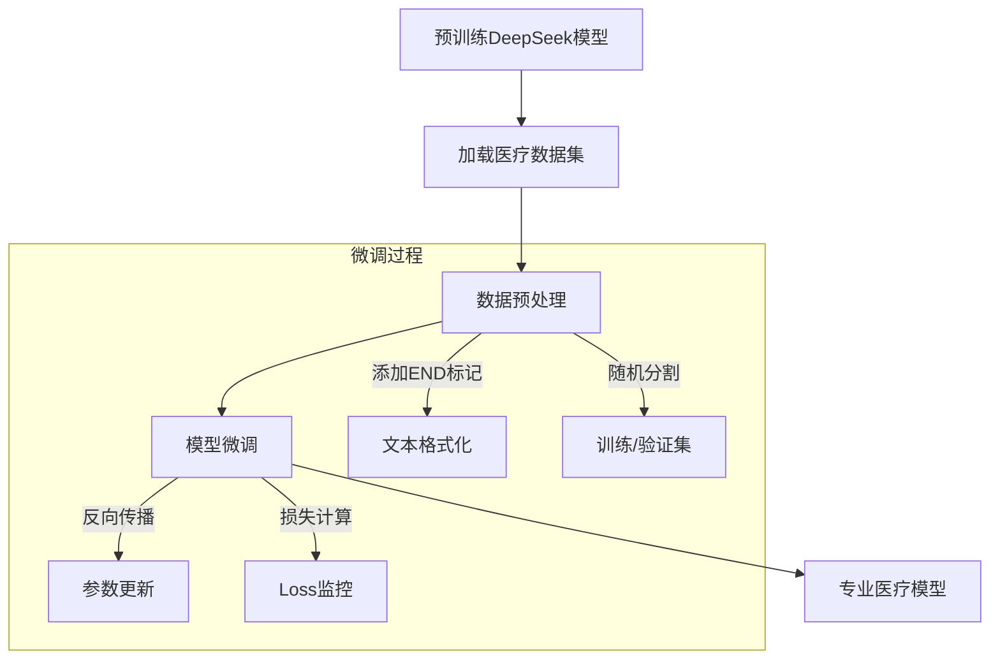
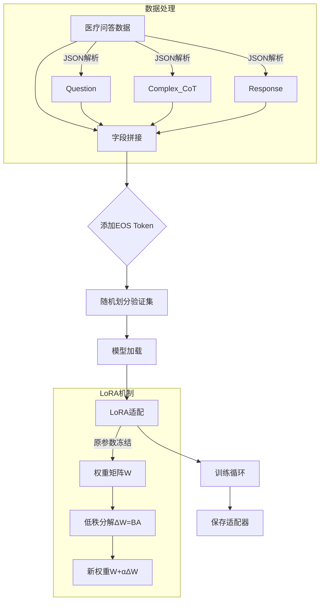

## 手把手教你炼丹 | 使用医疗诊断公开数据集微调专业医生大模型 , 中医崛起   
            
### 作者            
digoal            
            
### 日期            
2025-02-25            
            
### 标签            
PostgreSQL , PolarDB , DuckDB , AI , 大模型 , 微调    
            
----            
            
## 背景     
在macos中使用医疗诊断公开数据集微调专业医生大模型. 其他行业, 只要有高质量的微调数据集即可参考搞之.     
  
上一篇文章大家体验了一把如何成功的把一个通才练成一个“疯子”    
- [《手把手教你炼丹 | 用Mac本地微调大模型 , 扩展: 微调数据JSONL的内容格式和什么有关?》](../202502/20250215_01.md)    
  
AI为什么会疯呢? 因为我们用来微调的数据集是乱七八糟的, 今天我们用正儿八经的数据来微调一下, 把大模型从通才变成领域专家.     
  
例如可以从这里下载各种数据集, 用于微调得到各个领域的专用模型.   
- https://modelscope.cn/datasets  
- https://huggingface.co/datasets  
     
假设我们下载了医疗相关数据集( https://modelscope.cn/datasets/AI-ModelScope/medical-o1-reasoning-SFT/files ), 微调过程可能是这样的:     

    

    
## demo  
  
1\. 准备环境：  
  
python已升级到3.12.x , 依赖包安装参考:    
- [《mac + mlx-examples 大模型微调(fine-tuning)实践 - 让它学完所有PolarDB文章》](../202501/20250108_01.md)    
- [《手把手教你炼丹 | 用Mac本地微调大模型 , 扩展: 微调数据JSONL的内容格式和什么有关?》](../202502/20250215_01.md)    
  
```bash  
pip install transformers datasets torch  
```  
  
1\.1、下载模型, 假设我们需要训练deepseek-r1蒸馏过后的qwen1.5b     
  
deepseek-ai/DeepSeek-R1-Distill-Qwen-1.5B  
  
https://huggingface.co/deepseek-ai/DeepSeek-R1-Distill-Qwen-1.5B  
  
直接在如上网页下载, 或使用huggingface-cli下载    
```  
mkdir ~/finetune  
cd ~/finetune  
  
M_DIR=`pwd`  
MODEL="deepseek-ai/DeepSeek-R1-Distill-Qwen-1.5B"  
  
  
HF_ENDPOINT=https://hf-mirror.com nohup huggingface-cli download $MODEL --local-dir $M_DIR/$MODEL --cache-dir $M_DIR/.cache --resume-download --max-workers 1 >$M_DIR/download.log 2>&1 &  
```  
  
1\.2、下载数据集  
  
AI-ModelScope/medical-o1-reasoning-SFT  
  
https://modelscope.cn/datasets/AI-ModelScope/medical-o1-reasoning-SFT/files  
  
  
```  
mv medical_o1_sft_Chinese.json $M_DIR/    
```  
  
2、转换数据集   
   
注意lora训练数据jsonl文本内容格式可以参考如下, chat,text,tools,completions等几种不同场景的格式有所不同:  
- https://github.com/ml-explore/mlx-examples/blob/main/llms/mlx_lm/LORA.md#data  
  
```  
cd $M_DIR  
  
python3 split.py \
    --input_file medical_o1_sft_Chinese.json \
    --output_dir processed_data \
    --eos_token "<|endoftext|>" \
    --valid_ratio 0.01 \
    --shuffle  
```  
  
```  
数据处理完成，总样本数：24772  
训练集：24525 条  
验证集：247 条  
```  
  
3、下载mlx-examples  
```  
cd $M_DIR  
  
git clone --depth 1 https://github.com/ml-explore/mlx-examples    
```  
  
4、开始微调  
  
最好保证有足够的空闲内存  
```  
cd $M_DIR/mlx-examples/lora  
  
mlx_lm.lora --model $M_DIR/$MODEL --train --data $M_DIR/processed_data --learning-rate 1.0e-4 --val-batches -1 --batch-size 1 --iters 30     
  
# 注意这里的参数可以根据目标需求、机器资源情况调整. 我为了测试方便我的配置可能极不合理, 参考 mlx_lm.lora -h    
```  
  
日志  
```  
Loading pretrained model
Loading datasets
Training
Trainable parameters: 0.071% (1.090M/1543.714M)
Starting training..., iters: 30
[WARNING] Some sequences are longer than 2048 tokens. The longest sentence 2127 will be truncated to 2048. Consider pre-splitting your data to save memory.
Iter 1: Val loss 2.362, Val took 232.001s
Iter 10: Train loss 2.032, Learning Rate 1.000e-04, It/sec 0.434, Tokens/sec 290.202, Trained Tokens 6687, Peak mem 12.050 GB
Iter 20: Train loss 2.106, Learning Rate 1.000e-04, It/sec 0.436, Tokens/sec 295.848, Trained Tokens 13467, Peak mem 12.050 GB
[WARNING] Some sequences are longer than 2048 tokens. The longest sentence 2127 will be truncated to 2048. Consider pre-splitting your data to save memory.
Iter 30: Val loss 1.958, Val took 231.072s
Iter 30: Train loss 2.151, Learning Rate 1.000e-04, It/sec 7.025, Tokens/sec 4054.326, Trained Tokens 19238, Peak mem 12.050 GB
Saved final weights to adapters/adapters.safetensors.
```  
  
5、测试微调后的模型  
```  
cd $M_DIR/mlx-examples/lora  
  
mlx_lm.generate --model $M_DIR/$MODEL --adapter-path adapters --temp 0.0001 --max-tokens 2048 --prompt "发热并且咳嗽"    
```  
  
回复  
```  
==========  
Prompt: <｜begin▁of▁sentence｜><｜User｜>发热并且咳嗽<｜Assistant｜>
<think>  
今天我感觉有点发热，而且还有咳嗽的感觉。我先想一下可能的原因。发热通常和一些感染有关，比如流感或者肺炎。咳嗽可能是因为呼吸系统感染，比如肺炎或者流感。不过，我需要更仔细地分析这些症状。  
  
首先，发热可能是因为感染引起的。我应该考虑是否有其他症状，比如喉咙痛、干咳或者发热加重。如果我有这些症状，我应该去看医生，看看是否有其他可能的感染途径。  
  
然后，咳嗽可能是因为呼吸系统感染，比如肺炎。我需要考虑是否有其他症状，比如呼吸困难、咳嗽加重或者呼吸困难加重。如果我有这些症状，我应该去看医生，看看是否有其他可能的感染途径。  
  
另外，我需要考虑是否有其他可能的疾病，比如肺炎链球菌感染或者肺炎链球菌感染引起的肺炎。这两种疾病都有可能引起发热和咳嗽。我需要进一步检查，看看是否有其他症状，比如呼吸系统症状或者消化系统症状。  
  
如果我有其他症状，比如发热加重、咳嗽加重或者呼吸困难加重，我应该立即就医，去看医生，进行进一步的检查，比如胸部X光或者肺部CT扫描，以确定感染的严重程度。  
  
总的来说，我需要更详细地了解我的症状，看看是否有其他可能的感染途径，或者是否有其他症状，以便更好地诊断和治疗。  
</think>  
  
根据您的症状，发热和咳嗽，可能与肺炎链球菌感染有关。以下是一些可能的诊断和治疗建议：  
  
1. **检查和初步诊断**：  
   - **胸部X光或肺部CT扫描**：这些检查可以帮助确定感染的严重程度和位置。  
   - **呼吸系统检查**：检查呼吸系统是否有感染，如肺炎或肺炎链球菌感染。  
  
2. **药物治疗**：  
   - **对症治疗**：如果症状轻微，可以使用对症的药物，如抗组胺药、止咳药或止痛药。  
   - **抗生素治疗**：如果感染严重，可能需要抗生素治疗，以缓解症状。  
  
3. **药物选择**：  
   - **对症药物**：根据症状选择合适的药物，如抗组胺药、止咳药或止痛药。  
   - **抗生素**：如果感染严重，可能需要抗生素治疗，以缓解症状。  
  
4. **药物的使用**：  
   - **对症药物**：根据医生的建议使用对症的药物，以缓解症状。  
   - **抗生素**：如果感染严重，可能需要抗生素治疗，以缓解症状。  
  
5. **药物的使用时间**：  
   - **对症药物**：对症药物通常需要在医生的指导下使用，以避免副作用。  
   - **抗生素**：抗生素通常需要在医生的指导下使用，以避免副作用。  
  
6. **药物的使用频率**：  
   - **对症药物**：对症药物通常需要在医生的指导下使用，以避免副作用。  
   - **抗生素**：抗生素通常需要在医生的指导下使用，以避免副作用。  
  
7. **药物的使用后的观察**：  
   - **对症药物**：对症药物通常需要在医生的指导下使用，以避免副作用。  
   - **抗生素**：抗生素通常需要在医生的指导下使用，以避免副作用。  
  
8. **药物的使用后的观察**：  
   - **对症药物**：对症药物通常需要在医生的指导下使用，以避免副作用。  
   - **抗生素**：抗生素通常需要在医生的指导下使用，以避免副作用。  
  
... 没有正确的停止 ,  一直重复 .     
... 可能是jsonl内容格式问题, 也可能是我微调的iter太少了, 默认是1000, 我这里为了快使用了10. 微调结束时 Train loss 还很高.    
... 但是效果已经出现了.    
```  
  
对比一下微调之前的回复    
```  
mlx_lm.generate --model $M_DIR/$MODEL --temp 0.0001 --max-tokens 2048 --prompt "发热并且咳嗽"    
==========  
Prompt: <｜begin▁of▁sentence｜><｜User｜>发热并且咳嗽<｜Assistant｜>
<think>  
Okay, the user is asking about symptoms of heat and cough. I should explain what causes these symptoms and how to recognize them.  
  
First, I'll mention that heat can cause a sore throat, which is a common symptom. Then, I'll talk about coughing up stuff, like mucus or droplets, which is another key sign.  
  
I should also include how to tell if someone has a high fever, which is when they have a really high temperature. It's important to note that a high fever can be a sign of something more serious, like an infection or a virus.  
  
I'll also mention that coughing up stuff can be a sign of something like a cold or flu, so it's not always a bad thing. But if it's accompanied by a sore throat, it might indicate something more serious.  
  
I should keep the explanation clear and straightforward, avoiding any medical jargon so it's easy to understand. Maybe I'll also suggest ways to check for these symptoms, like using a thermometer or a cough patch.  
  
Overall, the goal is to help the user understand what to look for when they experience heat and coughing, and to guide them on how to identify these symptoms.  
</think>  
  
If you experience heat and coughing, it could be a sign of a heat-related illness, such as a heat stroke, a high fever, or a respiratory infection. Here's what you should know:  
  
1. **Heat and Coughing**: Heat can cause a sore throat and coughing up mucus or droplets. This is a common symptom of heat exposure, especially if you're not wearing a mask or covering your mouth.  
  
2. **High Fever**: A high fever is when your body's temperature rises significantly above normal. This can be a sign of a heat-related illness, but it can also be a serious sign of something more serious, like an infection or a virus.  
  
3. **Coughing Up Mucus**: If you cough up mucus or droplets, it could indicate a cold, flu, or another respiratory infection.  
  
4. **Symptoms of Heat Stroke**: If you experience severe heat-related symptoms, such as a sudden drop in temperature, confusion, dizziness, and difficulty breathing, it could be a heat stroke. In this case, you may need to seek medical attention.  
  
5. **How to Check for Symptoms**: You can check for these symptoms by wearing a mask or using a cough patch to block out the heat. If you experience a high fever, you should immediately seek medical attention.  
  
If you're experiencing heat and coughing, it's important to seek medical help as soon as possible.  
==========  
Prompt: 9 tokens, 83.761 tokens-per-sec  
Generation: 534 tokens, 24.876 tokens-per-sec  
Peak memory: 3.679 GB  
```  
  
6、把微调后的参数和模型融合, 生成本地微调后的模型    
```    
cd $M_DIR/mlx-examples/lora  
  
mlx_lm.fuse --model $M_DIR/$MODEL --adapter-path adapters --save-path $M_DIR/Qwen2.5-1.5B-digoal  
```  
  
7、使用融合后的模型     
```    
cd $M_DIR/mlx-examples/lora  
    
mlx_lm.generate --model $M_DIR/Qwen2.5-1.5B-digoal --max-tokens 2048 --prompt "发热并且咳嗽"    
```  
  
8、使用llama将模型转换为gguf, 然后就可以导入ollama本地模型    
```    
cd $M_DIR    
git clone --depth 1 git@github.com:ggerganov/llama.cpp.git    
  
# 或 git clone --depth 1 https://github.com/ggerganov/llama.cpp    
```    
    
编译llama    
```    
cd llama.cpp    
mkdir build    
cd build    
cmake ..    
make -j 8    
```    
  
准备gguf目录    
```    
mkdir $M_DIR/Qwen2.5-1.5B-digoal-gguf    
```    
    
转换    
```    
cd $M_DIR/llama.cpp  
python3 convert_hf_to_gguf.py --outfile $M_DIR/Qwen2.5-1.5B-digoal-gguf/Qwen2.5-1.5B-digoal.gguf --model-name qwen2.5-1.5b-digoal $M_DIR/Qwen2.5-1.5B-digoal  
```  
  
9、编写Modelfile, 创建ollama本地模型  
  
查看被微调的模型 `deepseek-r1:qwen1.5b` 的 Modelfile    
```    
ollama show --modelfile qwen2.5:1.5b    
```    
    
基于 `deepseek-r1:qwen1.5b` 原始 modelfile, 编辑一个modelfile    
```    
cd $M_DIR   
    
vi Modelfile    
```  
  
```  
# Modelfile generated by "ollama show"  
# To build a new Modelfile based on this, replace FROM with:  
# FROM finetuned deepseek-r1:1.5b use AI-ModelScope/medical-o1-reasoning-SFT   
  
FROM /Users/digoal/finetune/Qwen2.5-1.5B-digoal-gguf/Qwen2.5-1.5B-digoal.gguf  
TEMPLATE """{{- if .System }}{{ .System }}{{ end }}  
{{- range $i, $_ := .Messages }}  
{{- $last := eq (len (slice $.Messages $i)) 1}}  
{{- if eq .Role "user" }}<｜User｜>{{ .Content }}  
{{- else if eq .Role "assistant" }}<｜Assistant｜>{{ .Content }}{{- if not $last }}<｜end▁of▁sentence｜>{{- end }}  
{{- end }}  
{{- if and $last (ne .Role "assistant") }}<｜Assistant｜>{{- end }}  
{{- end }}"""  
PARAMETER stop <｜begin▁of▁sentence｜>  
PARAMETER stop <｜end▁of▁sentence｜>  
PARAMETER stop <｜User｜>  
PARAMETER stop <｜Assistant｜>  
LICENSE """MIT License  
  
Copyright (c) 2023 DeepSeek  
  
Permission is hereby granted, free of charge, to any person obtaining a copy  
of this software and associated documentation files (the "Software"), to deal  
in the Software without restriction, including without limitation the rights  
to use, copy, modify, merge, publish, distribute, sublicense, and/or sell  
copies of the Software, and to permit persons to whom the Software is  
furnished to do so, subject to the following conditions:  
  
The above copyright notice and this permission notice shall be included in all  
copies or substantial portions of the Software.  
  
THE SOFTWARE IS PROVIDED "AS IS", WITHOUT WARRANTY OF ANY KIND, EXPRESS OR  
IMPLIED, INCLUDING BUT NOT LIMITED TO THE WARRANTIES OF MERCHANTABILITY,  
FITNESS FOR A PARTICULAR PURPOSE AND NONINFRINGEMENT. IN NO EVENT SHALL THE  
AUTHORS OR COPYRIGHT HOLDERS BE LIABLE FOR ANY CLAIM, DAMAGES OR OTHER  
LIABILITY, WHETHER IN AN ACTION OF CONTRACT, TORT OR OTHERWISE, ARISING FROM,  
OUT OF OR IN CONNECTION WITH THE SOFTWARE OR THE USE OR OTHER DEALINGS IN THE  
SOFTWARE.  
"""  
PARAMETER temperature 0.1    
SYSTEM 你是德哥微调后的Qwen(created by Alibaba Cloud).   
```  
  
  
开始导入ollama    
```    
cd $M_DIR   
ollama create ds-qwen2.5-1.5b-digoal -f ./Modelfile    
```  
  
  
查看本地模型    
```    
$ ollama list  
NAME                             ID              SIZE      MODIFIED        
ds-qwen2.5-1.5b-digoal:latest    2c6aaa8a497c    3.6 GB    2 seconds ago      
qwen2.5:1.5b                     65ec06548149    986 MB    3 days ago         
deepseek-r1:7b                   0a8c26691023    4.7 GB    11 days ago        
qwen_1.5b_test1:latest           682ad25636bd    1.1 GB    2 weeks ago        
deepseek-r1:1.5b                 a42b25d8c10a    1.1 GB    2 weeks ago        
deepseek-r1:14b                  ea35dfe18182    9.0 GB    5 weeks ago        
mxbai-embed-large:latest         468836162de7    669 MB    3 months ago    
```    
    
使用Ollama本地模型    
```    
$ ollama run ds-qwen2.5-1.5b-digoal  
  
>>> 感冒并且发烧  
我需要帮助你分析和处理感冒和发烧的情况。首先，我会检查你的症状是否符合常见病的定义。  
  
1. **体温**：通常在36°C到37°C之间。  
2. **干热感**：可能是因为身体缺水或过度出汗引起的。  
3. **喉咙痛**：可能是因为感染或其他原因导致的喉咙不适。  
4. **流涕**：可能是因为感染或其他原因导致的流涕。  
  
如果这些症状持续超过几小时，或者你感到有其他异常症状（如频繁咳嗽、呼吸困难等），我建议你尽快就医。在医院中，医生会根据你的具体症状和检查结果来诊断和治疗。  
  
如果你是想了解如何预防感冒和发烧，我可以提供一些基本的健康知识，例如：  
  
- **饮食**：避免高糖、高脂肪和高盐的食物。  
- **运动**：进行适量的有氧运动以增强体质。  
- **保持水分**：多喝水以保持身体水分平衡。  
  
如果你有其他问题或需要进一步的帮助，请随时告诉我。  
```    
  
    
  
## 其他参考  
想训练其他数据集? 让deepseek成为其他领域专家. 数据集参考如下, 或者你自己整理高质量的数据集 :    
- https://modelscope.cn/datasets  
- https://huggingface.co/datasets  
      
看看别人怎么蒸馏的?   
- https://modelscope.cn/datasets/liucong/Chinese-DeepSeek-R1-Distill-data-110k-SFT   
- https://www.zhihu.com/people/LiuCongNLP   
   
## 附   
数据集转换提示, 按lora依赖的数据格式, 把下载好的数据集转换为目标格式.    
- https://github.com/ml-explore/mlx-examples/blob/main/llms/mlx_lm/LORA.md#data    
  
````  
我要使用mlx_lm.lora微调大模型, 需要处理一下数据集以适配mlx_lm.lora. 帮忙写一个python脚本, 功能如下:     
1、将数据调整为如下格式:   
{"prompt": "Question+tokenizer.eos_token", "completion": "\<think\>\nComplex_CoT\n\</think\>\n+Response+tokenizer.eos_token"}  
{"prompt": "Question+tokenizer.eos_token", "completion": "\<think\>\nComplex_CoT\n\</think\>\n+Response+tokenizer.eos_token"}  
2、除了要调整格式, 还需要随机将数据分裂为2个文件, train.jsonl和valid.jsonl, 用户可以输入参数按比例分割.   
下面是原始的数据集, 数据集的文件名为medical_o1_sft_Chinese.json, 格式如下:  
```  
    {  
        "Question": "患者表现为干咳，或咯少量粘痰，有时痰中带血，胸部隐痛，午后手足心热，皮肤干灼，或有盗汗，舌质红苔薄，脉细数。请问该患者的中医辨证是什么？",  
        "Complex_CoT": "干咳，还有少量粘痰，有时痰中带血，这些症状听起来像是和肺部有关，可能有什么炎症或者热在作怪。我记得这种情况下有时候是因为肺里的津液不足。 \n\n \n\n接着，有午后手足心热这些表现，而且舌红，脉细数，感觉挺像是阴虚内热。如果是阴虚，体内的阴液不够，就容易这种内热的感觉。\n\n \n\n此外，患者居然还有皮肤干灼，有时出汗的症状！这些是典型的阴虚表现，尤其是肺阴虚的典型症状。看得出，是体内津液无法滋润皮肤导致的。\n\n \n\n所以综合起来，干咳、少痰、咳血，这说明肺阴虚外加点内热。这可能是因为阴虚，体内没有足够的津液滋润。\n\n \n\n嗯，细想一下，咳血还有可能是因为肺中有热，把血络给伤到了，更加说明内有热的感觉。这种情况应该就是阴虚然后内热引起的。 \n\n \n\n再有，患者说有胸部隐痛，这可能是气血不畅，还真挺符合阴虚导致的状况。这个痛说明虚火在身体里面扰动着。\n\n \n\n还有舌红苔薄，痰少，这些都和阴虚内热是一致的症状。患者阴虚的可能性更加大了，而且这和干咳症状很对得上。\n\n \n\n总是觉得症状和肺阴虚夹着内热的结合挺吻合。特别是干咳、皮肤干燥这些症状都在一个方向。\n\n \n\n再进一步想，肺阴亏虚是怎么样的呢？主要是津液不足导致外部的表现，因此有干咳、少痰还有皮肤干这些情况。哦，这和患者的症状基本完全吻合。\n\n \n\n所以，要是症状都是这种方向的话，归为肺阴亏虚应该是对的，也能解释所有的症状组合。影响了皮肤、呼吸等等，看来这个方向不容小视。\n\n \n\n这样子回头看看，所有症状的点线都很一致，确实是肺阴亏虚。这也符合大部分分析和患者症状的实际表现。",  
        "Response": "根据患者所表现的症状，干咳、少量粘痰、痰中带血、胸部隐痛、午后手足心热、皮肤干灼、盗汗、舌质红苔薄、脉细数，这些症状综合起来符合中医中的“肺阴虚”夹“内热”的表现。肺阴虚是指肺的阴液不足，无法滋润肺脏和其他相关系统，导致干咳、皮肤干燥等症状，而内热则会导致痰中带血、手足心热等表现。因此，该患者的中医辨证为“肺阴虚夹内热”。"  
    },  
    {  
        "Question": "一个患有急性阑尾炎的病人已经发病5天，腹痛稍有减轻但仍然发热，在体检时发现右下腹有压痛的包块，此时应如何处理？",  
        "Complex_CoT": "这个病人已经发病五天，腹痛稍微减轻但还在发烧，看起来情况有些复杂。哦，刚刚在体检中也发现了在右下腹有个压痛的包块，这让我想到可能是阑尾已经形成了包块或者脓肿。 \n\n既然包块已经形成，那急诊手术貌似不是个好主意。考虑到潜在的感染扩散和其他并发症，不如先尝试保守治疗吧。 \n\n所以，目前来说，最理想的方案可能是先控制感染，用抗生素治疗。同时，密切观察病情变化。如果这个包块真的发展成了脓肿，我觉得可能需要考虑穿刺引流。 \n\n那么接下来要是保守治疗起了作用，包块缩小或者症状改善很多，那就是好消息。不过，我想是得考虑等病人情况稳定下来后，再择期手术切掉这个已经愈合的阑尾，免得以后还要担心复发的问题。 \n\n总结一下，对于这种已经有包块的情况，保守治疗可以降低风险，等到病情稳定后再做手术应该是稳妥的方案。这样处理似乎才符合常规的医学原则，也更为安全。",  
        "Response": "这种情况下，病人很可能已经出现了阑尾周围炎性包块或者脓肿，因此建议采用保守治疗为主。首先，应通过抗生素控制感染，密切观察患者病情变化。在此期间，监测症状的进展和包块的变化是非常重要的。如果测试结果或病情表现出包块确实发展成了脓肿，可能需要考虑进行穿刺引流，以降低感染扩散的风险。\n\n如果经过一段时间的保守治疗后，包块缩小且症状明显改善，这表明对非手术治疗的响应良好。待病人病情完全稳定后，再考虑择期手术切除阑尾，以防止将来复发。\n\n总之，面对已形成包块或脓肿表现的急性阑尾炎患者，首选保守治疗以降低急诊手术的风险，然后在病情稳定后再进行阑尾切除是更为安全和合理的处理方案。"  
    },  
    ...  
```  
````  
  
得到转换脚本 `split.py`   
```  
import json  
import random  
import argparse  
from pathlib import Path  
  
def process_data(args):  
    # 创建输出目录  
    output_dir = Path(args.output_dir)  
    output_dir.mkdir(parents=True, exist_ok=True)  
      
    # 读取原始数据  
    with open(args.input_file, 'r') as f:  
        raw_data = json.load(f)  
      
    # 处理数据格式  
    processed = []  
    for item in raw_data:  
        # 构建prompt和completion  
        new_item = {  
            "prompt": f"{item['Question']}{args.eos_token}",  
            "completion": f"<think>\n{item['Complex_CoT']}\n</think>\n\n{item['Response']}{args.eos_token}"  
        }  
        processed.append(new_item)  
      
    # 随机打乱数据  
    if args.shuffle:  
        random.shuffle(processed)  
      
    # 分割数据集  
    split_idx = int(len(processed) * args.valid_ratio)  
    valid_data = processed[:split_idx]  
    train_data = processed[split_idx:]  
      
    # 保存训练集  
    with open(output_dir / 'train.jsonl', 'w') as f:  
        for item in train_data:  
            f.write(json.dumps(item, ensure_ascii=False) + '\n')  
      
    # 保存验证集  
    with open(output_dir / 'valid.jsonl', 'w') as f:  
        for item in valid_data:  
            f.write(json.dumps(item, ensure_ascii=False) + '\n')  
      
    print(f"数据处理完成，总样本数：{len(processed)}")  
    print(f"训练集：{len(train_data)} 条")  
    print(f"验证集：{len(valid_data)} 条")  
  
if __name__ == "__main__":  
    parser = argparse.ArgumentParser(description='医疗数据集处理工具')  
    parser.add_argument('--input_file', type=str, default='medical_o1_sft_Chinese.json',  
                      help='原始数据文件路径')  
    parser.add_argument('--output_dir', type=str, default='processed_data',  
                      help='处理后的输出目录')  
    parser.add_argument('--eos_token', type=str, default='<|endoftext|>',  
                      help='结束标记符号')  
    parser.add_argument('--valid_ratio', type=float, default=0.1,  
                      help='验证集比例 (0.0-1.0)')  
    parser.add_argument('--shuffle', action='store_true',  
                      help='是否随机打乱数据')  
      
    args = parser.parse_args()  
      
    # 参数校验  
    if not 0 <= args.valid_ratio <= 1:  
        raise ValueError("验证集比例必须在0到1之间")  
      
    process_data(args)  
```
    
从模型文件中提取结束标记符号(`eos_token`)的脚本`eos_token.py`如下:   
```
import argparse
from transformers import AutoTokenizer

# 定义命令行参数
parser = argparse.ArgumentParser(description="Extract EOS token from a Hugging Face model.")
parser.add_argument("--model_path", type=str, required=True, help="Path to the Hugging Face model directory.")
args = parser.parse_args()

# 加载分词器
tokenizer = AutoTokenizer.from_pretrained(args.model_path)

# 提取结束标记
eos_token = tokenizer.eos_token

print(f"EOS token: {eos_token}")
```
   
使用方法举例:  
```
$ python3 eos_token.py --model_path /Users/digoal/Downloads/model_from_huggingface/Qwen/Qwen2.5-1.5B
EOS token: <|endoftext|>
```
    
  
#### [期望 PostgreSQL|开源PolarDB 增加什么功能?](https://github.com/digoal/blog/issues/76 "269ac3d1c492e938c0191101c7238216")
  
  
#### [PolarDB 开源数据库](https://openpolardb.com/home "57258f76c37864c6e6d23383d05714ea")
  
  
#### [PolarDB 学习图谱](https://www.aliyun.com/database/openpolardb/activity "8642f60e04ed0c814bf9cb9677976bd4")
  
  
#### [PostgreSQL 解决方案集合](../201706/20170601_02.md "40cff096e9ed7122c512b35d8561d9c8")
  
  
#### [德哥 / digoal's Github - 公益是一辈子的事.](https://github.com/digoal/blog/blob/master/README.md "22709685feb7cab07d30f30387f0a9ae")
  
  
#### [About 德哥](https://github.com/digoal/blog/blob/master/me/readme.md "a37735981e7704886ffd590565582dd0")
  
  

  
