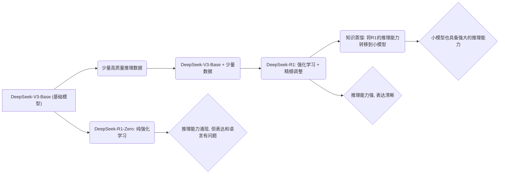

## AI论文解读 | DeepSeek-R1：通过强化学习激励LLM的推理能力   
            
### 作者            
digoal            
            
### 日期            
2025-02-24            
            
### 标签            
PostgreSQL , PolarDB , DuckDB , AI , 论文解读 , 推理能力 , 强化学习 , 知识蒸馏 , 监督微调   
            
----            
            
## 背景   
论文原文: [《DeepSeek-R1: Incentivizing Reasoning Capability in LLMs via Reinforcement Learning》](2501.12948v1.pdf)  
- https://arxiv.org/pdf/2501.12948    
    
提示:  
```
用通俗易懂的语言解读一下这篇论文的理论(注意比喻要合理, 不要太偏离IT行业). 如果有必要可以加一写mermaid图表来提高可读性. 用中文回答, 最后给一个术语表进行解释. 
```
   
**论文标题：DeepSeek-R1：通过强化学习激励LLM的推理能力**  
  
简单来说，这篇论文讲的是DeepSeek-AI公司如何让大型语言模型（LLM，比如ChatGPT）变得更聪明，更会推理。他们主要用了“强化学习”这个方法，就像训练小狗一样，给模型奖励，让它学会做对的事情。  
  
**核心思想：**  
  
1.  **强化学习（RL）是关键：** 传统的训练LLM的方法是给它看大量的文本和代码，让它模仿学习。但DeepSeek-AI想试试，能不能直接用强化学习，让模型自己探索出推理的技巧。  
2.  **两种模型：**  
    *   **DeepSeek-R1-Zero：** 这是个“实验品”，完全从零开始，只用强化学习训练。结果发现，它真的能学会推理，但有点“野路子”，表达不太好，还喜欢“串台”（语言混杂）。  
    *   **DeepSeek-R1：** 这是个“升级版”，先给它一点“基础教育”（少量数据），再用强化学习训练。这样出来的模型，推理能力更强，表达也更清晰。  
3.  **知识蒸馏：** 他们还发现，可以把大模型的推理能力“教”给小模型，让小模型也能变得很聪明。  
  
**具体做法：**  
  
咱们用一个流程图来概括一下：  
  

  
*   **DeepSeek-R1-Zero：**  
    *   **目标：** 看看纯粹的强化学习能不能让模型学会推理。  
    *   **方法：**  
        *   用DeepSeek-V3-Base作为基础模型。  
        *   用GRPO（一种强化学习算法）训练模型。  
        *   给模型一些推理题，如果它答对了，就给它奖励；答错了，就给它惩罚。  
    *   **结果：** 模型真的学会了推理，甚至出现了一些意想不到的“神操作”，比如自我验证、反思等等。但是，它的表达能力比较差，语言也不太规范。  
*   **DeepSeek-R1：**  
    *   **目标：** 解决DeepSeek-R1-Zero的问题，进一步提升推理能力。  
    *   **方法：**  
        *   **冷启动（Cold Start）：** 先给DeepSeek-V3-Base看一些高质量的推理数据，让它有个“底子”。  
        *   **推理导向的强化学习：** 接着用强化学习训练模型，重点是提高推理能力。  
        *   **拒绝采样和监督微调：** 用强化学习训练出来的模型生成一些答案，然后人工筛选，选出好的答案，再用这些答案来微调模型，让它学得更好。  
        *   **全场景强化学习：** 最后，用各种各样的问题来训练模型，让它在各种场景下都能表现出色。  
    *   **结果：** DeepSeek-R1的推理能力和表达能力都得到了很大的提升，甚至可以和OpenAI的某些模型相媲美。  
*   **知识蒸馏：**  
    *   **目标：** 让小模型也能拥有强大的推理能力。  
    *   **方法：**  
        *   用DeepSeek-R1生成大量的推理数据。  
        *   用这些数据来训练小模型，让它模仿DeepSeek-R1的推理过程。  
    *   **结果：** 发现直接用DeepSeek-R1的数据来训练小模型，比直接用强化学习训练小模型效果更好。这意味着，大模型学到的推理模式，可以直接“传授”给小模型。  
  
**论文的亮点：**  
  
*   **纯强化学习的探索：** 证明了即使没有大量的监督数据，LLM也可以通过强化学习学会推理。  
*   **知识蒸馏的应用：** 提供了一种让小模型也能拥有强大推理能力的方法。  
*   **开源：** DeepSeek-AI开源了DeepSeek-R1-Zero、DeepSeek-R1，以及一些小模型，方便研究人员使用。  
  
**论文的意义：**  
  
这篇论文为LLM的训练提供了一种新的思路，即通过强化学习，让模型自己探索出推理的技巧。这种方法可以减少对大量监督数据的依赖，降低训练成本。同时，知识蒸馏的应用，可以让更多的人使用到高性能的LLM。  
  
**一些关键的评价指标:**  
  
论文中提到了一些评价指标，比如：  
  
*   **Pass@1：** 模型一次就答对题的概率。  
*   **Percentile：** 在Codeforces（一个编程竞赛网站）上的排名百分比。  
*   **Accuracy：** 准确率。  
  
**局限性：**  
  
论文也提到了，DeepSeek-R1在某些方面还有提升空间，比如：  
  
*   **软件工程任务：** 在软件工程方面的表现还不够出色，需要进一步优化。  
*   **推理能力和模型大小的平衡：** 如何在不增加模型大小的前提下，进一步提升推理能力，也是一个挑战。  
  
**总结：**  
  
DeepSeek-AI的这篇论文，探索了一种新的LLM训练方法，并取得了一些重要的成果。虽然还有一些问题需要解决，但它为LLM的发展指明了一个新的方向。  
  
**术语表：**  
  
*   **LLM（Large Language Model）：** 大型语言模型，比如ChatGPT，是一种可以生成文本、翻译语言、回答问题的人工智能模型。  
*   **RL（Reinforcement Learning）：** 强化学习，一种通过奖励和惩罚来训练模型的方法。  
*   **SFT（Supervised Fine-Tuning）：** 监督微调，一种用人工标注的数据来微调模型的方法。  
*   **CoT（Chain-of-Thought）：** 思维链，一种让模型逐步推理的方法，就像人类思考问题一样。  
*   **GRPO（Group Relative Policy Optimization）：** 一种强化学习算法，可以降低训练成本。  
*   **冷启动（Cold Start）：** 在强化学习之前，先给模型一些基础知识，让它有个“底子”。  
*   **知识蒸馏：** 把大模型的知识“教”给小模型。  
*   **AIME：** 美国数学邀请赛，一种难度较高的数学竞赛。  
*   **MATH-500：** 一个包含500道数学题的测试集。  
*   **MMLU：** 一个包含多个学科的测试集，用于评估模型的知识水平。  
*   **SWE-bench：** 一个用于评估模型在软件工程方面的能力的测试集。  
*   **GPQA Diamond：** 一个研究生水平的问答测试集。  
  
<b> 以上内容基于DeepSeek及诸多AI生成, 轻微人工调整, 感谢杭州深度求索人工智能等公司 </b>       
     
<b> AI 生成的内容请自行辨别正确性, 当然也多了些许踩坑的乐趣, 毕竟冒险是每个男人的天性. </b>     
    
  
#### [期望 PostgreSQL|开源PolarDB 增加什么功能?](https://github.com/digoal/blog/issues/76 "269ac3d1c492e938c0191101c7238216")
  
  
#### [PolarDB 开源数据库](https://openpolardb.com/home "57258f76c37864c6e6d23383d05714ea")
  
  
#### [PolarDB 学习图谱](https://www.aliyun.com/database/openpolardb/activity "8642f60e04ed0c814bf9cb9677976bd4")
  
  
#### [PostgreSQL 解决方案集合](../201706/20170601_02.md "40cff096e9ed7122c512b35d8561d9c8")
  
  
#### [德哥 / digoal's Github - 公益是一辈子的事.](https://github.com/digoal/blog/blob/master/README.md "22709685feb7cab07d30f30387f0a9ae")
  
  
#### [About 德哥](https://github.com/digoal/blog/blob/master/me/readme.md "a37735981e7704886ffd590565582dd0")
  
  

  
