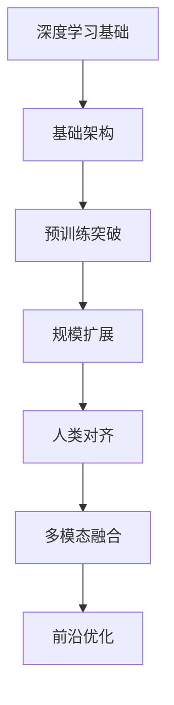
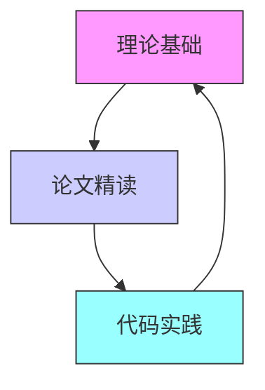
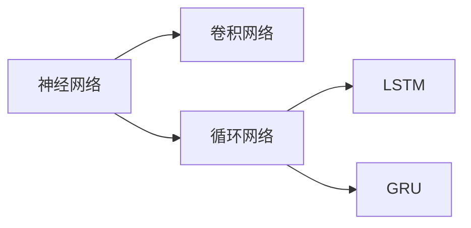
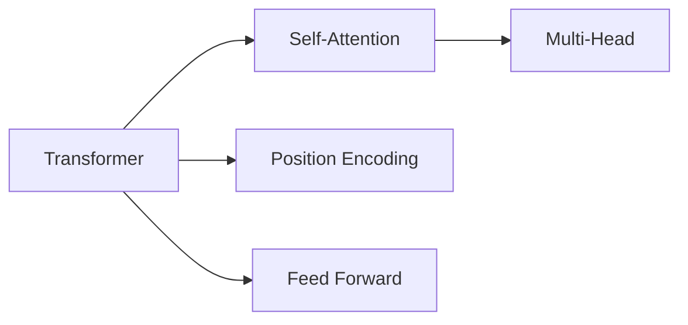
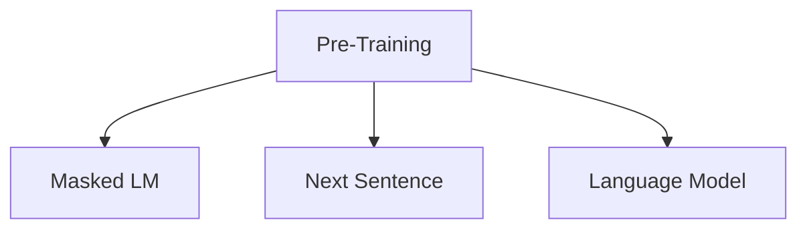
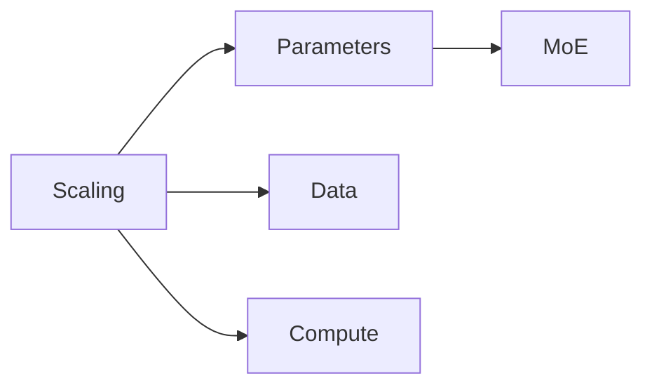
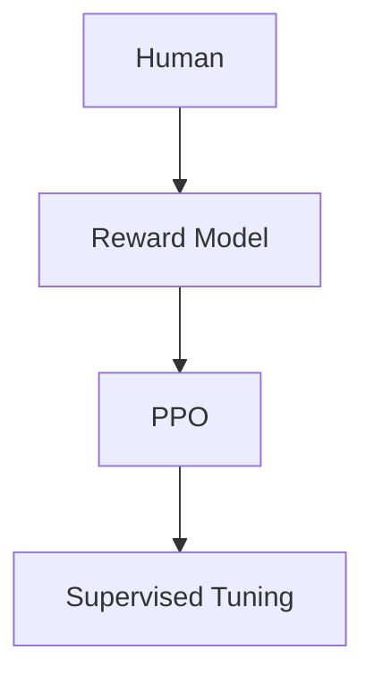
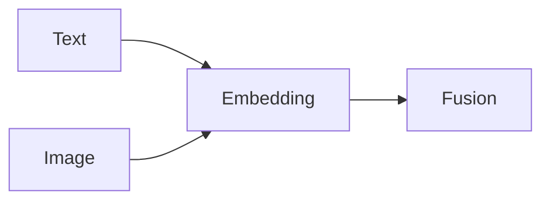
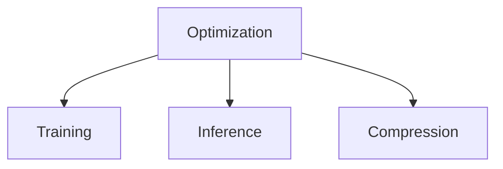
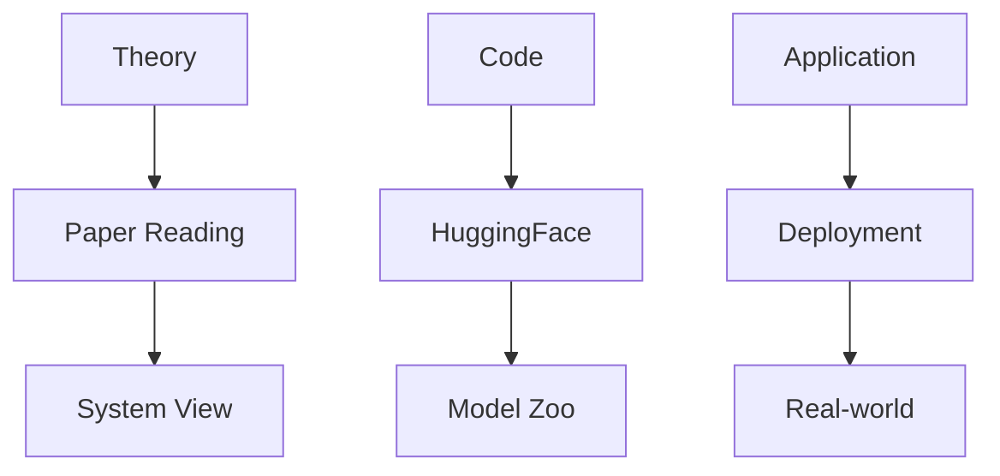

## AI基本功 | 2003-2025 论文通读梳理  
            
### 作者            
digoal            
            
### 日期            
2025-02-26            
            
### 标签            
PostgreSQL , PolarDB , DuckDB , AI , 学习 , 论文    
            
----            
            
## 背景      
AI发展实在是太快了, 感觉跟不上? 可能是没有摸清它的发展脉络, 接下来我针对AI和大模型的发展, 让AI提供了一份论文学习路线图.    
    

   
学习方法:   
  

    
### 史前阶段1：基础概念与神经网络（2003-2014）    
    

    
**目标：** 了解AI的基本概念、神经网络的原理和发展历程。    
    
1. **"A Neural Probabilistic Language Model" (Bengio et al., 2003):**    https://dl.acm.org/doi/pdf/10.5555/944919.944966    
- 这篇论文介绍了神经网络在语言模型中的应用，是深度学习在自然语言处理领域的重要开端。    
    
2. **"ImageNet Classification with Deep Convolutional Neural Networks" (Krizhevsky et al., 2012):**    https://dl.acm.org/doi/pdf/10.1145/3065386   
- 这篇论文介绍了AlexNet，它在ImageNet图像识别挑战赛中取得了突破性进展，标志着深度学习在计算机视觉领域的崛起。    
    
3. **"Understanding the difficulty of training deep feedforward neural networks" (Glorot & Bengio, 2010):**    https://proceedings.mlr.press/v9/glorot10a/glorot10a.pdf?hc_location=ufi      
- 这篇论文探讨了深度神经网络训练的难题，并提出了权重初始化的方法，有助于理解深度学习的训练过程。    
    
### 史前阶段2：循环神经网络与序列模型**    
    
**目标：** 了解循环神经网络（RNN）及其变体，掌握处理序列数据的基本方法。    
    
4. **"Long Short-Term Memory" (Hochreiter & Schmidhuber, 1997):**      
- 这篇论文介绍了LSTM，一种可以有效解决RNN梯度消失问题的变体，使得RNN可以处理更长的序列。    
    
5. **"Learning Phrase Representations using RNN Encoder-Decoder for Statistical Machine Translation" (Cho et al., 2014):**      
- 这篇论文介绍了Encoder-Decoder结构，为序列到序列的学习奠定了基础。    
    
6. **"Sequence to Sequence Learning with Neural Networks" (Sutskever et al., 2014):**      
- 这篇论文进一步发展了Encoder-Decoder结构，并将其应用于机器翻译，取得了显著效果。    
    
    
### 第一阶段：基础架构（2017-2018）    
    

    
**目标：** 建立神经网络基础认知，理解序列建模原理    
    
1. **《Attention Is All You Need》**（Transformer, 2017）    
   - 里程碑：提出Transformer架构，奠定现代大模型基础    
   - 核心价值：自注意力机制取代RNN/CNN，实现并行化序列处理    
   - 学习重点：Encoder-Decoder结构、多头注意力机制    
    
2. **《Improving Language Understanding by Generative Pre-Training》**（GPT-1, 2018）    
   - 首个基于Transformer的预训练语言模型    
   - 展示无监督预训练+有监督微调范式    
    
### 第二阶段：预训练突破（2018-2019）    
    

    
**目标：** 理解预训练技术革新与上下文建模    
    
3. **《BERT: Pre-training of Deep Bidirectional Transformers》**（2018）    
   - 双向语言模型突破    
   - 提出MLM（掩码语言建模）预训练目标    
   - 奠定自然语言理解新基准    
    
4. **《Language Models are Unsupervised Multitask Learners》**（GPT-2, 2019）    
   - 展示大规模语言模型的零样本学习能力    
   - 论证"更大模型→更强能力"的缩放定律    
    
### 第三阶段：参数扩展, 大型语言模型与微调（2020-2021）    
    

    
**目标：** 掌握模型缩放规律与高效训练技术    
    
5. **《Scaling Laws for Neural Language Models》**（2020）    
   - 系统阐述模型规模与性能的关系    
   - 提出计算最优分配原则    
    
6. **《Switch Transformers: Scaling to Trillion Parameter Models》**（2021）    
   - 混合专家模型（MoE）的工业级实践    
   - 实现万亿参数级别的可行训练方案    
    
7. **"Language Models are Few-Shot Learners" (Brown et al., 2020):**  这篇论文介绍了GPT-3模型，它展示了大型语言模型在少量样本甚至零样本的情况下，也能完成各种NLP任务的能力。    
    
8. **"Training Compute-Optimal Large Language Models" (Hoffmann et al., 2022):**  这篇论文探讨了大型语言模型的训练规模和计算资源之间的关系，提出了计算最优的训练方法。    
    
9. **"LoRA: Low-Rank Adaptation of Large Language Models" (Hu et al., 2021):**  这篇论文介绍了LoRA技术，它可以通过少量参数的微调，实现大型语言模型的快速适应。    
    
### 第四阶段：人类反馈学习（2022）    
    

    
**目标：** 掌握RLHF技术体系与安全机制    
    
10. **《Training language models to follow instructions》**（InstructGPT, 2022）    
   - 引入RLHF（基于人类反馈的强化学习）    
   - 对齐技术突破，使模型行为更符合人类意图    
    
11. **《ChatGPT: Optimizing Language Models for Dialogue》**（2022）    
   - 对话场景的工程实践指南    
   - 安全机制设计范式    
    
### 第五阶段：多模态融合（2020-2023）    
    

    
**目标：** 掌握跨模态表示与联合训练范式    
    
12. **《Learning Transferable Visual Models From Natural Language Supervision》**（CLIP, 2021）    
   - 图文跨模态对齐经典方案    
   - 零样本迁移学习框架    
    
13. **《GPT-4 Technical Report》**（2023）    
    - 多模态大模型系统设计    
    - 安全对齐与评估体系    
    
14. **"DALL-E: Creating Images from Text" (Ramesh et al., 2021):**  这篇论文介绍了DALL-E模型，它可以根据文本描述生成图像，是多模态学习的代表性成果。    
    
15. **"Playing Atari with Deep Reinforcement Learning" (Mnih et al., 2013):**  这篇论文介绍了Deep Q-Network (DQN)，它将深度学习与强化学习相结合，实现了在Atari游戏中超越人类的表现。    
    
16. **"Attention is not Explanation" (Jain & Wallace, 2019):**  这篇论文探讨了注意力机制的可解释性问题，指出注意力权重并不一定能反映模型真正的推理过程。    
    
    
### 第六阶段：前沿优化（2023-2024）了解AI和大模型领域的前沿研究方向，如多模态学习、强化学习、可解释性等。    
    

    
**目标：** 跟踪稀疏化训练、模型蒸馏技术与推理加速技术    
    
17. **《Mixture-of-Experts with Expert Choice Routing》**（2023）    
    - 动态专家选择路由机制    
    - 提升MoE模型效率    
    
18. **《DeepSeek-V3: Technical Report》**（2024）    
    - 最新稀疏专家混合模型实践    
    - 训练/推理优化技术集成    
      
2025最新的还没有收录, 大家关注新闻吧.     
    
### 实践学习路径建议：    
    

    
1. 先理解Transformer架构（阶段1）    
2. 掌握预训练范式（阶段2）    
3. 研究扩展方法（阶段3）    
4. 学习对齐技术（阶段4）    
5. 探索多模态扩展（阶段5）    
6. 跟进前沿优化（阶段6）    
    
### 术语表：    
| 术语 | 解释 |    
|------|------|    
| Transformer | 使用自注意力机制的神经网络架构 |    
| MoE（混合专家） | 由多个专家网络组成的模型，每次激活部分参数 |    
| RLHF | 基于人类反馈的强化学习，用于模型对齐 |    
| 预训练 | 在大规模数据上无监督训练模型基础能力 |    
| 微调 | 在特定任务数据上有监督调整模型参数 |    
| 多模态 | 处理多种数据类型（文本/图像/语音等）的能力 |    
    
建议配合开源项目（如HuggingFace Transformers库）实践，理论结合代码实现能加深理解。对于最新技术如DeepSeek-V3，建议关注官方技术报告和开源实现。    
    
        
