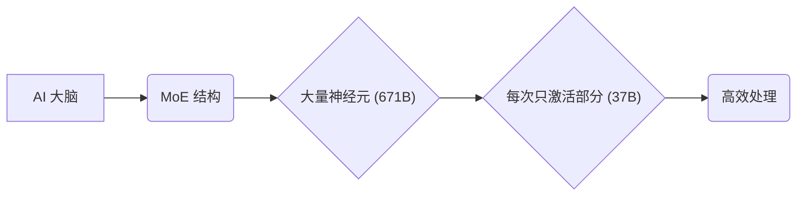
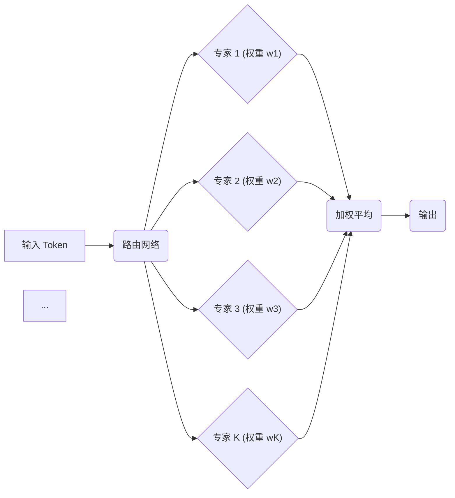
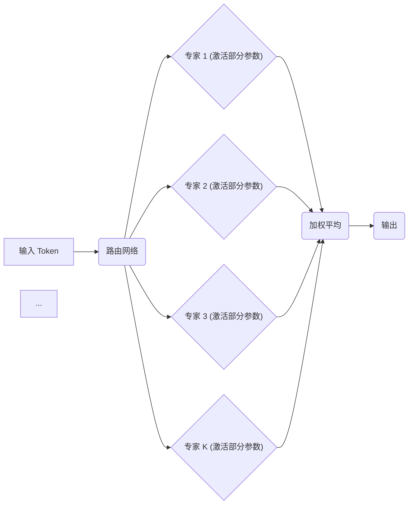
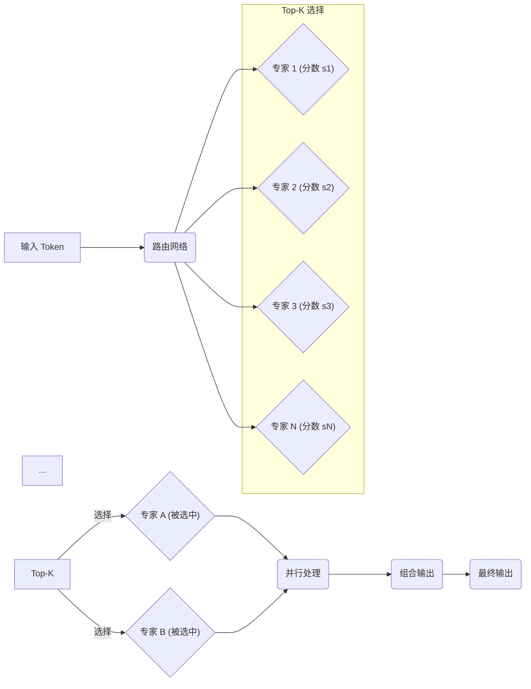
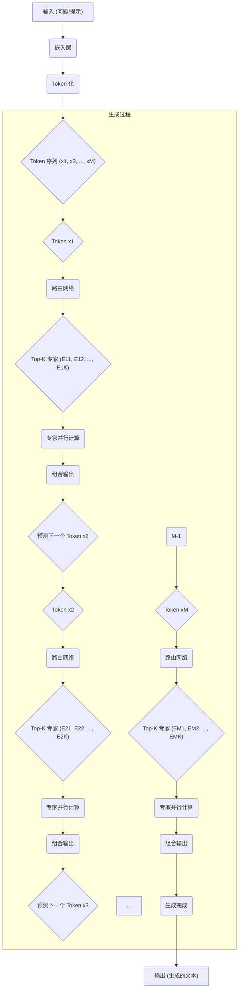

## AI论文解读 | DeepSeek-V3 技术报告  
              
### 作者              
digoal              
              
### 日期              
2025-02-26              
              
### 标签              
PostgreSQL , PolarDB , DuckDB , AI , 论文解读 , MoE , 多头注意 , 混合专家模式    
              
----              
              
## 背景     
论文原文: [《DeepSeek-V3 Technical Report》](2412.19437v2.pdf)    
- https://arxiv.org/pdf/2412.19437    
  
## 提示  
用通俗易懂的语言解读一下这篇论文的理论(注意比喻要合理, 不要太偏离IT行业). 如果有必要可以加一写mermaid图表来提高可读性. 用中文回答, 最后给一个术语表进行解释.   
- 追问1 细节不够清晰, 再详细一点  
- 追问2 那么一个问题到底是由一个专家完成的, 还是一个问题被分解成若干小问题分给不同专家分别完成的?  
- 追问3 如果是多个专家并行完成的, 那为什么只需要激活少部分参数呢?  
- 追问4 如果不使用MoE, 意味着只有1个专家, 一个专家是不是也只需要激活其部分参数?  
- 追问5 MoE在处理token时并行是所有专家都参与吗? 那top-k是什么?  
- 追问6 训练MoE模型时, 需要拆分成几个专家单独训练吗? 给不同专家的训练素材是不是完全不同? 或者说有部分相同的? 如果有相同的内容, 是根据什么规则来选择什么内容需要相同的?  
- 追问7 一个完整的问题会拆成多个token, 然后每个token选出top-k专家参与输出, 那么是不是意味着一个完整的问题在整个过程中有一定的可能性会覆盖到所有的专家?   
- 追问8 你指的token是问题本身的, 还是在生成过程中逐渐产生的?   
- 追问9 你好像跳过了模型的输入, 直接到了生成, 请使用mermaid表达一下
- 追问10 你提到了训练moe模型时会根据token路由到不同专家, 最终导致训练出不同领域的专家. 那么我有3个问题, 1、路由算法是什么? 2、有没有可能同一个token路由到多个专家? 3、moe还会再分层吗? 还是说只有一层? 
  
## 解读  
     
**论文标题：DeepSeek-V3 技术报告**  
  
简单来说，这篇论文讲的是DeepSeek-AI公司如何打造了一个更强大、更高效的大型语言模型（LLM），叫做DeepSeek-V3。他们主要在模型结构、训练方法和硬件优化上下了功夫，最终让DeepSeek-V3在性能上可以和一些顶级的闭源模型相媲美，而且训练成本还更低。  
  
**核心思想：打造更强、更省钱的 AI 大脑**  
  
DeepSeek-V3 的目标就像是打造一个更聪明、更高效的“AI 大脑”。这个大脑不仅要能解决各种难题，还要尽可能地节省资源，降低训练成本。  
  
**1. 大脑的结构：混合专家模式 (MoE)**  
  
想象一下，你有一个专家团队，每个人都擅长不同的领域（比如数学、编程、写作）。当你遇到一个问题时，不是让所有专家都参与，而是根据问题的类型，只挑选最合适的几位专家来解决。(注意是几位相关专家, 不会请出无关专家.)  
  
DeepSeek-V3 的“大脑”就是采用了这种“混合专家模式” (Mixture-of-Experts, MoE)。它拥有 6710 亿个“神经元”（参数），但每次处理信息时，只激活其中 370 亿个最相关的神经元。这样既保证了大脑的知识储备，又提高了处理效率。  
  

  
**2. 大脑的“思考方式”：多头潜在注意力 (MLA)**  
  
大脑如何快速找到相关的神经元呢？这就涉及到“多头潜在注意力” (Multi-head Latent Attention, MLA) 机制。  
  
你可以把它想象成一个高效的搜索引擎。当你输入一个问题时，搜索引擎会快速分析问题的关键信息，然后从海量的知识库中找到最相关的部分。  
  
MLA 机制通过多个“注意力头”并行地分析输入信息，从而更准确地捕捉到关键信息，并激活相关的神经元。  
  
**3. 大脑的“训练方法”：辅助损失函数自由的负载均衡**  
  
在训练“AI 大脑”的过程中，一个关键问题是如何让每个“专家”都得到充分的利用，避免出现有的专家过于繁忙，有的专家却无所事事的情况。  
  
传统的做法是引入一个“辅助损失函数”，来鼓励各个专家之间的负载均衡。但这种做法可能会对大脑的整体性能产生负面影响，就像为了让每个人都参与讨论，反而降低了讨论的效率。  
  
DeepSeek-V3 采用了“辅助损失函数自由的负载均衡”策略，就像一个更智能的团队管理者，它能够在不牺牲整体性能的前提下，实现各个专家之间的负载均衡。  
  
**4. 大脑的“学习目标”：多 Token 预测**  
  
传统的语言模型通常是预测下一个词 (Token)。DeepSeek-V3 则采用了“多 Token 预测”的训练目标，就像让大脑一次性预测多个词，从而更好地理解上下文信息，提高预测的准确性。  
  
**5. 大脑的“训练环境”：FP8 混合精度训练**  
  
训练“AI 大脑”需要大量的计算资源。为了提高训练效率，DeepSeek-V3 采用了“FP8 混合精度训练”技术。  
  
你可以把它想象成一种更高效的计算方式。传统的计算方式就像使用高精度的计算器，虽然准确，但速度较慢。FP8 混合精度训练则像使用一种精度稍低的计算器，虽然精度略有损失，但速度更快，更节省资源。  
  
**6. 大脑的“基础设施”：DualPipe 和高效通信**  
  
为了支持大规模的“AI 大脑”训练，DeepSeek-V3 采用了 DualPipe 算法和高效的通信机制。  
  
DualPipe 算法就像一个高效的流水线，它可以将训练任务分解成多个阶段，并并行地执行，从而提高训练效率。  
  
高效的通信机制则保证了各个计算节点之间能够快速地交换信息，避免出现“交通堵塞”的情况。  
  
**总结：**  
  
DeepSeek-V3 通过采用混合专家模式、多头潜在注意力、辅助损失函数自由的负载均衡、多 Token 预测、FP8 混合精度训练等一系列创新技术，打造了一个更强、更省钱的“AI 大脑”。  
  
**术语表：**  
  
*   **LLM (Large Language Model)：** 大型语言模型，一种能够理解和生成人类语言的 AI 模型。  
*   **MoE (Mixture-of-Experts)：** 混合专家模式，一种将多个“专家”模型组合在一起的架构。  
*   **参数 (Parameters)：** 模型中的可学习变量，用于存储模型的知识。  
*   **Token：** 文本的基本单位，通常是一个词或一个子词。  
*   **注意力机制 (Attention Mechanism)：** 一种让模型关注输入信息中关键部分的机制。  
*   **负载均衡 (Load Balancing)：** 将计算任务分配给多个计算节点，以避免出现有的节点过于繁忙，有的节点却无所事事的情况。  
*   **损失函数 (Loss Function)：** 用于衡量模型预测结果与真实结果之间差异的函数。  
*   **FP8 混合精度训练：** 一种使用 FP8 数据格式进行训练的技术，可以提高训练效率，降低内存占用。  
*   **DualPipe：** 一种用于并行训练的算法。  
*   **InfiniBand (IB)：** 一种高性能的网络互连技术。  
*   **NVLink：** NVIDIA 推出的一种高速互连技术，用于连接多个 GPU。  
*   **SFT (Supervised Fine-Tuning)：** 监督微调，一种使用标注数据来优化模型的技术。  
*   **RL (Reinforcement Learning)：** 强化学习，一种通过与环境交互来学习的技术。  
  
## 追问1 细节不够清晰, 再详细一点  
  
**1. 混合专家模式 (MoE) 的精细化运作**  
  
*   **路由网络 (Routing Network)：** MoE 的核心在于如何决定哪个输入 Token 应该交给哪个专家处理。这个决策过程由一个“路由网络”负责。你可以把路由网络想象成一个智能调度员，它会根据问题的类型，将问题分配给最合适的专家。DeepSeek-V3 使用的是一种改进的路由网络，能够更准确地分配任务，避免出现“专家闲置”的情况。  
  
    ```mermaid  
    graph LR  
        A[输入 Token] --> B(路由网络)  
        B --> C1{专家 1}  
        B --> C2{专家 2}  
        B --> C3{专家 3}  
        ...  
        B --> CN{专家 N}  
        C1 --> D(输出)  
        C2 --> D  
        C3 --> D  
        CN --> D  
    ```  
  
*   **专家数量和规模：** DeepSeek-V3 拥有 6710 亿个参数，但每次只激活 370 亿个参数。这意味着它拥有大量的“专家”，但每次只选择一小部分来工作。这种设计既保证了模型的知识储备，又提高了处理效率。你可以把它想象成一个拥有大量员工的公司，但每次只根据项目的需要，组建一个精干的团队。  
  
**2. 多头潜在注意力 (MLA) 的工作原理**  
  
*   **多头 (Multi-head)：** MLA 机制使用多个“注意力头”并行地分析输入信息。每个注意力头都专注于不同的方面，从而更全面地捕捉到关键信息。你可以把它想象成一个团队，每个人都从不同的角度分析问题，最终得出更准确的结论。  
  
*   **潜在 (Latent)：** MLA 机制不仅仅关注输入 Token 之间的直接关系，还关注它们之间的潜在关系。你可以把它想象成一个侦探，他不仅关注表面证据，还关注隐藏的线索，从而更准确地还原真相。  
  
    ```mermaid  
    graph LR  
        A[输入 Token] --> B{注意力头 1}  
        A --> C{注意力头 2}  
        A --> D{注意力头 3}  
        ...  
        A --> E{注意力头 N}  
        B --> F(加权平均)  
        C --> F  
        D --> F  
        E --> F  
        F --> G(输出)  
    ```  
  
**3. 辅助损失函数自由的负载均衡**  
  
*   **传统方法的问题：** 传统的 MoE 模型通常使用辅助损失函数来鼓励各个专家之间的负载均衡。但这种做法可能会对模型的整体性能产生负面影响。你可以把它想象成一个团队，为了让每个人都参与讨论，反而降低了讨论的效率。  
  
*   **DeepSeek-V3 的解决方案：** DeepSeek-V3 采用了一种更智能的负载均衡策略，它能够在不牺牲整体性能的前提下，实现各个专家之间的负载均衡。这种策略的具体实现细节可能涉及到一些复杂的数学公式，但核心思想是避免过度约束，让模型能够更自由地学习。  
  
**4. 多 Token 预测的优势**  
  
*   **上下文理解：** 传统的语言模型通常是预测下一个词 (Token)。DeepSeek-V3 则采用了“多 Token 预测”的训练目标，就像让大脑一次性预测多个词，从而更好地理解上下文信息，提高预测的准确性。你可以把它想象成一个阅读理解测试，一次性阅读多个句子，比只阅读一个句子更能理解文章的含义。  
  
*   **长期依赖：** 多 Token 预测有助于模型捕捉长期依赖关系。你可以把它想象成一个故事，只有理解了前面的情节，才能更好地理解后面的情节。  
  
**5. FP8 混合精度训练的细节**  
  
*   **精度与效率的权衡：** 训练“AI 大脑”需要大量的计算资源。为了提高训练效率，DeepSeek-V3 采用了“FP8 混合精度训练”技术。FP8 是一种精度较低的数据格式，可以减少内存占用，提高计算速度。你可以把它想象成一种更高效的计算方式。  
  
*   **混合精度：** DeepSeek-V3 采用的是“混合精度”训练，这意味着它在不同的计算阶段使用不同的精度。例如，在一些对精度要求较高的阶段，使用 FP16 或 FP32 数据格式；而在一些对精度要求较低的阶段，使用 FP8 数据格式。这种做法可以在保证精度的前提下，最大限度地提高训练效率。  
  
**6. DualPipe 和高效通信的实现**  
  
*   **DualPipe：** DualPipe 算法将训练任务分解成多个阶段，并并行地执行，从而提高训练效率。你可以把它想象成一个高效的流水线，每个阶段都由不同的工人负责，最终完成整个产品的生产。  
  
*   **高效通信：** 高效的通信机制保证了各个计算节点之间能够快速地交换信息，避免出现“交通堵塞”的情况。DeepSeek-V3 使用了 InfiniBand (IB) 和 NVLink 等高性能的网络互连技术，以及一些优化的通信算法，从而实现了高效的通信。  
  
**总结：**  
  
DeepSeek-V3 在 MoE 结构、注意力机制、负载均衡、训练目标、训练精度和基础设施等方面都进行了创新，从而打造了一个更强、更省钱的“AI 大脑”。  
  
希望这次的解释更加清晰，能够帮助你更好地理解 DeepSeek-V3 论文的技术细节。  
  
## 追问2 那么一个问题到底是由一个专家完成的, 还是一个问题被分解成若干小问题分给不同专家分别完成的?  
  
这是一个非常关键的问题，理解这一点对于理解 MoE 的工作方式至关重要。  
  
**答案是：一个问题（或者更准确地说，一个 Token）是由 *多个* 专家 *并行* 处理的，然后将这些专家的输出 *组合* 起来。**  
  
让我们分解一下：  
  
1.  **Token 作为输入：** 首先，输入文本被分解成一个个 Token。每个 Token 都会被路由网络处理。  
  
2.  **路由网络的选择：** 路由网络会根据 Token 的内容，选择 *多个* 最合适的专家。通常，MoE 模型会选择 Top-K 个专家，其中 K 是一个预先设定的超参数（例如，K=2）。  
  
3.  **并行处理：** 被选中的 *多个* 专家会 *并行* 地处理这个 Token。每个专家都会根据自己的知识和专长，对 Token 进行分析和处理，并生成一个输出。  
  
4.  **组合输出：** 最后，模型会将 *多个* 专家的输出 *组合* 起来，得到最终的输出。组合的方式通常是加权平均，每个专家的权重由路由网络决定。权重越高，表示该专家对最终输出的贡献越大。  
  
**比喻：**  
  
想象一下，你去看病。你不是只看一个医生，而是同时看了几个不同科室的专家（例如，内科、外科、影像科）。每个专家都会根据你的症状和检查结果，给出自己的诊断意见。最后，主治医生会将所有专家的意见综合起来，做出最终的诊断和治疗方案。  
  
**图示：**  
  

  
**关键点：**  
  
*   **并行性：** 多个专家并行处理，提高了处理效率。  
*   **组合性：** 多个专家的输出组合，提高了模型的准确性和鲁棒性。  
*   **路由网络：** 路由网络是 MoE 的核心，它决定了哪些专家应该参与处理。  
  
**与分解问题的区别：**  
  
MoE 不是将一个问题分解成若干小问题，然后分给不同专家分别完成。而是让多个专家 *同时* 处理 *同一个* 问题，然后将他们的输出 *组合* 起来。  
  
希望这个解释能够让你更清楚地理解 MoE 的工作方式。  
  
  
## 追问3 如果是多个专家并行完成的, 那为什么只需要激活少部分参数呢?  
  
这是一个非常好的问题！这涉及到 MoE 模型参数激活的精妙之处。  
  
**核心在于：虽然多个专家并行处理，但每个专家本身只激活 *自己* 的一部分参数。**  
  
让我们逐步分解：  
  
1.  **每个专家都是一个独立的神经网络：** 在 MoE 模型中，每个“专家”实际上都是一个独立的神经网络（通常是一个前馈神经网络，FFN）。这意味着每个专家都有自己独立的参数。  
  
2.  **稀疏激活：** 关键在于，每个专家内部也采用了某种形式的“稀疏激活”。这意味着，对于给定的输入，每个专家只会激活 *自己* 的一部分参数。  
  
3.  **路由网络的作用：** 路由网络选择 Top-K 个专家，只是选择了 *哪些* 专家参与计算。但每个专家 *内部* 仍然会进行稀疏激活，只激活一部分参数。  
  
**比喻：**  
  
想象一下，你去看病，同时看了几个不同科室的专家。  
  
*   **选择专家：** 路由网络就像是医院的导诊台，它会根据你的症状，推荐几个相关的科室（例如，内科、外科、影像科）。  
*   **专家内部的激活：** 每个科室的医生（专家）都会根据你的具体情况，选择 *自己* 科室里最相关的检查项目和治疗方案。例如，内科医生可能会选择做心电图和血常规检查，而外科医生可能会选择做 X 光片和 CT 扫描。每个医生都不会做所有的检查，而是只选择最相关的检查项目。  
  
**图示：**  
  

  
**数学公式 (简化版):**  
  
假设：  
  
*   `x` 是输入 Token  
*   `g(x)` 是路由网络，输出 Top-K 个专家的权重 `w1, w2, ..., wK`  
*   `Ei(x)` 是第 `i` 个专家的输出 (只激活部分参数)  
  
则最终输出 `y` 可以表示为：  
  
`y = w1 * E1(x) + w2 * E2(x) + ... + wK * EK(x)`  
  
**总结：**  
  
*   MoE 模型通过路由网络选择 Top-K 个专家。  
*   每个专家 *内部* 仍然会进行稀疏激活，只激活一部分参数。  
*   最终输出是多个专家输出的加权平均。  
  
因此，虽然多个专家并行处理，但由于每个专家内部只激活一部分参数，所以总共只需要激活少部分参数。这大大提高了模型的效率。  
  
## 追问4 如果不使用MoE, 意味着只有1个专家, 一个专家是不是也只需要激活其部分参数?  
  
这是一个非常好的问题，它触及了模型稀疏性的一个更广泛的概念。  
  
**答案是：是的，即使不使用 MoE，一个单独的神经网络（“专家”）也 *可以* 并且 *通常* 会采用某种形式的稀疏激活，只激活其部分参数。**  
  
让我们来解释一下：  
  
1.  **MoE 不是稀疏性的唯一来源：** MoE 是一种 *结构化* 的稀疏性，它通过选择不同的专家来实现稀疏激活。但稀疏性本身并不是 MoE 独有的特性。  
  
2.  **神经网络中的稀疏性：** 即使是一个单独的神经网络，也可以通过多种方式实现稀疏激活：  
  
    *   **ReLU 激活函数：** ReLU (Rectified Linear Unit) 是一种常用的激活函数，它的定义是 `ReLU(x) = max(0, x)`。这意味着，对于负数输入，ReLU 的输出为 0，相当于关闭了该神经元。因此，ReLU 激活函数本身就具有稀疏性。  
  
    *   **Dropout：** Dropout 是一种正则化技术，它在训练过程中随机地关闭一部分神经元。这可以防止模型过拟合，并提高模型的泛化能力。Dropout 本身也具有稀疏性。  
  
    *   **剪枝 (Pruning)：** 剪枝是一种移除模型中不重要连接的技术。通过移除不重要的连接，可以减少模型的参数数量，并提高模型的效率。剪枝后的模型也具有稀疏性。  
  
    *   **稀疏连接：** 一些研究人员也在探索使用稀疏连接的神经网络。这意味着，每个神经元只与一部分神经元相连接，而不是与所有神经元相连接。这种稀疏连接可以减少模型的参数数量，并提高模型的效率。  
  
3.  **为什么需要稀疏性？**  
  
    *   **提高效率：** 稀疏激活可以减少计算量，提高模型的效率。  
    *   **防止过拟合：** 稀疏激活可以防止模型过拟合，提高模型的泛化能力。  
    *   **可解释性：** 稀疏激活可以提高模型的可解释性，更容易理解模型的工作原理。  
  
**比喻：**  
  
想象一下，你大脑中的神经元。并不是所有的神经元都在同一时间活跃。只有与当前任务相关的神经元才会活跃起来。这种稀疏激活可以提高大脑的效率，并防止大脑过载。  
  
**总结：**  
  
*   MoE 是一种结构化的稀疏性，但稀疏性本身并不是 MoE 独有的特性。  
*   即使是一个单独的神经网络，也可以通过多种方式实现稀疏激活。  
*   稀疏激活可以提高效率、防止过拟合和提高可解释性。  
  
因此，即使不使用 MoE，一个单独的神经网络也 *可以* 并且 *通常* 会采用某种形式的稀疏激活，只激活其部分参数。  
  
## 追问5 MoE在处理token时并行是所有专家都参与吗? 那top-k是什么?  
  
你对 MoE 的理解正在逐步深入，这个问题问得非常好！  
  
**答案是：MoE 在处理 Token 时，*不是* 所有专家都参与，而是只有 Top-K 个专家参与。**  
  
让我们详细解释一下：  
  
1.  **路由网络 (Routing Network) 的作用：** MoE 的核心在于路由网络。路由网络的作用是根据输入 Token 的内容，选择 *最合适的* 几个专家来处理该 Token。  
  
2.  **Top-K 的含义：** Top-K 是一个超参数，它指定了路由网络选择的专家数量。例如，如果 Top-K = 2，那么路由网络会选择 2 个最合适的专家来处理该 Token。  
  
3.  **选择过程：** 路由网络会为每个专家计算一个“分数”，表示该专家与当前 Token 的相关性。然后，路由网络会选择分数最高的 Top-K 个专家。  
  
4.  **并行处理：** 被选中的 Top-K 个专家会 *并行* 地处理该 Token。  
  
5.  **组合输出：** 最后，模型会将 Top-K 个专家的输出 *组合* 起来，得到最终的输出。  
  
**比喻：**  
  
想象一下，你去看病。  
  
*   **所有专家：** 医院里有很多医生，每个医生都擅长不同的领域。  
*   **路由网络：** 医院的导诊台就像是路由网络，它会根据你的症状，推荐几个相关的科室（例如，内科、外科、影像科）。  
*   **Top-K：** Top-K 就像是导诊台推荐的科室数量。例如，导诊台可能会推荐 2 个科室：内科和外科。  
*   **并行处理：** 你会同时去看内科和外科的医生。  
*   **组合输出：** 主治医生会将内科和外科医生的诊断意见综合起来，做出最终的诊断和治疗方案。  
  
**图示：**  
  

  
**关键点：**  
  
*   **Top-K 决定了参与处理的专家数量。**  
*   **路由网络负责选择 Top-K 个专家。**  
*   **只有 Top-K 个专家会并行处理该 Token。**  
  
**为什么不是所有专家都参与？**  
  
*   **效率：** 如果所有专家都参与处理，计算量会非常大，效率会很低。  
*   **相关性：** 并不是所有专家都与当前 Token 相关。让不相关的专家参与处理，只会增加计算量，而不会提高模型的准确性。  
  
因此，MoE 通过路由网络选择 Top-K 个专家来处理 Token，从而在效率和准确性之间取得平衡。  
  
## 追问6 训练MoE模型时, 需要拆分成几个专家单独训练吗? 给不同专家的训练素材是不是完全不同? 或者说有部分相同的? 如果有相同的内容, 是根据什么规则来选择什么内容需要相同的?  
  
你对 MoE 训练的理解又深入了一层！这个问题非常关键，涉及到 MoE 模型训练的策略和挑战。  
  
**答案是：训练 MoE 模型时，通常 *不是* 将专家完全独立地训练，而是 *共享部分训练数据*，并使用一些策略来鼓励专家学习不同的知识。**  
  
让我们逐步分解：  
  
1.  **专家不是完全独立的：** 虽然 MoE 模型中有多个专家，但这些专家并不是完全独立的。它们共享一些底层参数（例如，嵌入层），并且在训练过程中会相互影响。  
  
2.  **共享部分训练数据：** 通常，MoE 模型会使用 *部分相同* 的训练数据来训练所有专家。这意味着，每个专家都会看到一部分相同的训练样本。  
  
3.  **鼓励专家学习不同的知识：** 为了让专家学习不同的知识，MoE 模型会使用一些策略来鼓励专家之间的差异性：  
  
    *   **路由网络：** 路由网络会根据输入 Token 的内容，选择不同的专家来处理。这使得不同的专家会接触到不同的训练样本，从而学习不同的知识。 (个人理解路由网络有点类似数据库里的hash分区规则?根据token内容路由到不同的专家?甚至专家也可以分多层, 例如某些领域的知识非常庞大, 可以多层. 甚至可以是非平衡层级. [《如何修改PostgreSQL分区表分区范围 - detach attach - 拆分、合并、非平衡分区表、深度不一致分区表》](../201906/20190621_02.md)   ) 
  
    *   **辅助损失函数：** 一些 MoE 模型会使用辅助损失函数来鼓励专家之间的差异性。例如，可以使用一种损失函数来惩罚专家之间的输出相似性。  
  
    *   **噪声注入：** 可以在训练过程中向不同的专家注入不同的噪声，从而鼓励专家学习不同的知识。  
  
4.  **训练流程：**  
  
    *   **初始化：** 首先，初始化所有专家的参数。  
    *   **前向传播：** 对于每个训练样本，路由网络会选择 Top-K 个专家来处理。  
    *   **计算损失：** 计算 Top-K 个专家的输出与真实标签之间的损失。  
    *   **反向传播：** 使用反向传播算法更新所有专家的参数。  
    *   **重复：** 重复上述步骤，直到模型收敛。  
  
**比喻：**  
  
想象一下，你培养几个孩子，让他们学习不同的技能。  
  
*   **专家：** 孩子就像是 MoE 模型中的专家。  
*   **共享底层参数：** 孩子共享一些基因和家庭教育，这就像是 MoE 模型中的共享底层参数。  
*   **共享部分训练数据：** 孩子都会接受基础教育，这就像是 MoE 模型中的共享训练数据。  
*   **鼓励学习不同的知识：** 你会鼓励孩子发展自己的兴趣爱好，学习不同的技能，这就像是 MoE 模型中鼓励专家学习不同的知识。  
  
**关于训练素材的选择：**  
  
*   **没有明确的规则：** 通常没有明确的规则来选择哪些内容需要相同，哪些内容需要不同。这取决于具体的任务和模型设计。  
*   **目标是平衡：** 目标是在共享知识和专业化之间取得平衡。共享知识可以提高模型的泛化能力，而专业化可以提高模型的效率和准确性。  
  
**总结：**  
  
*   训练 MoE 模型时，通常不是将专家完全独立地训练。  
*   MoE 模型会共享部分训练数据，并使用一些策略来鼓励专家学习不同的知识。  
*   没有明确的规则来选择哪些内容需要相同，哪些内容需要不同。  
  
希望这个解释能够让你更清楚地理解 MoE 模型的训练策略。  
  
## 追问7 一个完整的问题会拆成多个token, 然后每个token选出top-k专家参与输出, 那么是不是意味着一个完整的问题在整个过程中有一定的可能性会覆盖到所有的专家?   
  
这是一个非常深刻的问题，它触及了 MoE 模型覆盖所有专家的可能性。  
  
**答案是：理论上，一个完整的问题在整个过程中 *有可能* 会覆盖到所有的专家，但 *实际情况* 下，这种可能性通常 *很小*。**  
  
让我们逐步分解：  
  
1.  **Token 级别的选择：** MoE 模型是在 Token 级别进行专家选择的。这意味着，对于每个 Token，路由网络都会独立地选择 Top-K 个专家。  
  
2.  **覆盖所有专家的可能性：** 假设 MoE 模型有 N 个专家，每个 Token 选择 Top-K 个专家。如果一个问题包含 M 个 Token，那么理论上，这个完整的问题最多会覆盖 M * K 个专家。如果 M * K >= N，那么这个完整的问题 *有可能* 会覆盖到所有的专家。  
  
3.  **实际情况的限制：**  
  
    *   **路由网络的偏好：** 路由网络通常会对某些专家产生偏好。这意味着，某些专家更容易被选中，而另一些专家则很少被选中。  
  
    *   **Token 之间的相关性：** 不同的 Token 之间通常存在相关性。这意味着，相邻的 Token 可能会选择相似的专家。  
  
    *   **Top-K 的限制：** Top-K 的值通常很小，这意味着每个 Token 只能选择少数几个专家。  
  
4.  **覆盖所有专家的意义：**  
  
    *   **提高模型的泛化能力：** 如果一个问题能够覆盖到所有的专家，那么模型可以更好地利用所有专家的知识，从而提高模型的泛化能力。  
  
    *   **增加计算量：** 如果一个问题能够覆盖到所有的专家，那么计算量会大大增加，效率会降低。  
  
**比喻：**  
  
想象一下，你去看病，需要看多个科室的医生。  
  
*   **所有专家：** 医院里有很多医生，每个医生都擅长不同的领域。  
*   **Token：** 你的症状就像是 Token。  
*   **Top-K：** 导诊台会根据你的症状，推荐几个相关的科室（例如，内科、外科、影像科）。  
*   **覆盖所有专家：** 理论上，你有可能需要看遍医院里所有的医生，才能解决你的问题。但实际上，这种情况很少发生。  
  
**总结：**  
  
*   理论上，一个完整的问题在整个过程中 *有可能* 会覆盖到所有的专家。  
*   但实际情况下，由于路由网络的偏好、Token 之间的相关性和 Top-K 的限制，这种可能性通常 *很小*。  
*   覆盖所有专家可以提高模型的泛化能力，但也会增加计算量。  
  
因此，MoE 模型需要在覆盖所有专家和提高效率之间取得平衡。  
  
## 追问8 你指的token是问题本身的, 还是在生成过程中逐渐产生的?   
  
这是一个非常关键的区分，我之前的回答可能有些含糊，现在澄清一下：  
  
**我指的是 *生成过程中逐渐产生的* Token。**  
  
让我解释一下：  
  
1.  **MoE 模型主要用于生成任务：** 虽然 MoE 模型也可以用于理解任务（例如，文本分类），但它们最常见的应用场景是生成任务（例如，文本生成、机器翻译）。  
  
2.  **生成过程：** 在生成任务中，模型会逐步生成 Token。每生成一个 Token，模型都会根据当前已生成的 Token 序列，选择 Top-K 个专家来生成下一个 Token。  
  
3.  **Token 序列：** 模型会不断地重复这个过程，直到生成一个完整的序列（例如，一个句子、一段文章）。  
  
4.  **问题本身：** “问题本身”是指模型的输入。例如，在机器翻译任务中，“问题本身”是指需要翻译的源语言句子。  
  
5.  **我的回答：** 当我说“一个完整的问题在整个过程中有一定的可能性会覆盖到所有的专家”时，我指的是 *在生成一个完整序列的过程中*，模型 *有可能* 会覆盖到所有的专家。  
  
**比喻：**  
  
想象一下，你用 AI 模型写一篇文章。  
  
*   **问题本身：** 你给 AI 模型一个主题，例如“人工智能的未来”。  
*   **生成过程：** AI 模型会逐步生成文章中的每个句子。  
*   **Token：** 每个句子都会被分解成一个个 Token。  
*   **我的回答：** 我指的是 *在生成整篇文章的过程中*，AI 模型 *有可能* 会用到所有专家的知识。  
  
**澄清：**  
  
我之前的回答可能会让你误以为我指的是“问题本身”会被分解成多个 Token，然后每个 Token 选择 Top-K 个专家。但实际上，我指的是 *生成过程中产生的 Token* 会选择 Top-K 个专家。  
  
希望这个澄清能够让你更清楚地理解我的意思。  
  
## 追问9 你好像跳过了模型的输入, 直接到了生成, 请使用mermaid表达一下  
  
你说的对，我之前的解释确实跳过了模型的输入部分，导致理解上可能存在偏差。现在我用 Mermaid 图来更清晰地展示整个过程，包括输入和生成：  
  

  
**图解：**  
  
1.  **输入 (问题/提示) (A)：** 这是模型的输入，例如一个问题、一个主题、或者一段提示文本。  
  
2.  **嵌入层 (B)：** 输入文本通过嵌入层转换为向量表示。  
  
3.  **Token 化 (C)：** 嵌入后的文本被分解成一个个 Token。  
  
4.  **Token 序列 (D)：** 得到一个 Token 序列 (x1, x2, ..., xM)。  
  
5.  **生成过程 (子图)：**  
  
    *   **Token x1 (E1)：** 从第一个 Token 开始。  
    *   **路由网络 (F1)：** 路由网络根据 Token x1 的内容，选择 Top-K 个专家 (E11, E12, ..., E1K)。  
    *   **专家并行计算 (H1)：** Top-K 个专家并行地处理 Token x1。  
    *   **组合输出 (I1)：** 将 Top-K 个专家的输出组合起来。  
    *   **预测下一个 Token x2 (J1)：** 预测下一个 Token x2。  
    *   **重复：** 重复上述步骤，直到生成一个完整的序列。  
  
6.  **输出 (生成的文本) (L)：** 模型最终生成一段文本。  
  
**关键点：**  
  
*   **输入：** 模型首先接收一个输入 (问题/提示)。  
*   **生成：** 模型然后逐步生成 Token，直到生成一个完整的序列。  
*   **MoE：** 在生成过程中，每个 Token 都会选择 Top-K 个专家来处理。  
  
**澄清：**  
  
我之前的回答主要关注的是 *生成过程*，而忽略了 *输入* 部分。现在这个图更完整地展示了整个过程，包括输入和生成。  
  
希望这个图能够帮助你更好地理解 MoE 模型的工作原理。  
   
## 追问10 你提到了训练moe模型时会根据token路由到不同专家, 最终导致训练出不同领域的专家. 那么我有3个问题, 1、路由算法是什么? 2、有没有可能同一个token路由到多个专家? 3、moe还会再分层吗? 还是说只有一层? 

这三个问题都非常关键，它们深入探讨了 MoE 模型的路由机制、专家分配以及模型结构。

**1. 路由算法是什么？**

路由算法是 MoE 模型的核心，它决定了哪个 Token 应该交给哪个专家处理。常见的路由算法包括：

*   **Softmax 路由：** 这是最常见的路由算法。它使用一个可学习的路由网络（通常是一个前馈神经网络）来为每个专家计算一个“分数”。然后，使用 Softmax 函数将这些分数转换为概率，表示每个专家被选择的概率。最后，根据这些概率选择 Top-K 个专家。

    *   **公式：**
        *   `g(x) = Softmax(f(x))`，其中 `x` 是输入 Token，`f(x)` 是路由网络的输出，`g(x)` 是每个专家的选择概率。
    *   **优点：** 简单易实现，可微分，易于训练。
    *   **缺点：** 可能会导致负载不均衡，某些专家被过度使用，而另一些专家则很少被使用。

*   **稀疏门控 (Sparse Gating)：** 这是一种改进的路由算法，旨在解决 Softmax 路由的负载不均衡问题。它使用一个稀疏门控函数来选择 Top-K 个专家，而不是使用 Softmax 函数。

    *   **公式：**
        *   `g(x) = TopK(f(x))`，其中 `x` 是输入 Token，`f(x)` 是路由网络的输出，`g(x)` 是一个稀疏向量，只有 Top-K 个元素为 1，其余元素为 0。
    *   **优点：** 可以更好地控制负载均衡，避免某些专家被过度使用。
    *   **缺点：** 不可微分，需要使用一些技巧来训练。

*   **可学习的专家容量 (Learnable Expert Capacity)：** 这是一种更高级的路由算法，它允许模型学习每个专家的容量，并根据容量动态地调整路由策略。

    *   **优点：** 可以更好地适应不同的任务和数据分布，提高模型的性能。
    *   **缺点：** 实现起来比较复杂，需要更多的计算资源。

**2. 有没有可能同一个 Token 路由到多个专家？**

**答案是：是的，同一个 Token *通常* 会路由到多个专家。**

*   **Top-K 的作用：** 路由算法通常会选择 Top-K 个专家，而不是只选择一个专家。这意味着，同一个 Token 会被多个专家并行处理。
*   **提高模型的鲁棒性：** 将同一个 Token 路由到多个专家可以提高模型的鲁棒性。即使某个专家出现故障，模型仍然可以依靠其他专家的输出来生成正确的输出。
*   **融合不同的知识：** 不同的专家可能擅长不同的领域。将同一个 Token 路由到多个专家可以融合不同的知识，提高模型的准确性。

**3. MoE 还会再分层吗？还是说只有一层？**

**答案是：MoE 可以分层，也可以只有一层。**

*   **单层 MoE：** 这是最简单的 MoE 结构。它只在模型的某一层（例如，前馈神经网络层）使用 MoE。
*   **多层 MoE：** 这是一种更复杂的 MoE 结构。它可以在模型的多个层使用 MoE。例如，可以在模型的每一层都使用 MoE。
*   **分层 MoE：** 这是一种特殊的 MoE 结构。它将专家组织成一个层次结构。例如，可以先使用一个路由网络选择 Top-K 个“粗粒度”的专家，然后再使用另一个路由网络选择 Top-K 个“细粒度”的专家。

**比喻：**

想象一下，你去看病。

*   **单层 MoE：** 你只去看一个科室的医生，但这个科室里有多个专家，每个专家都擅长不同的领域。
*   **多层 MoE：** 你去看多个科室的医生，每个科室里都有多个专家。
*   **分层 MoE：** 你先去看一个全科医生，全科医生会根据你的情况，推荐几个相关的专科医生。然后，你再去看这些专科医生。

**总结：**

*   路由算法是 MoE 模型的核心，常见的路由算法包括 Softmax 路由、稀疏门控和可学习的专家容量。
*   同一个 Token 通常会路由到多个专家。
*   MoE 可以分层，也可以只有一层。

希望这个解释能够让你更清楚地理解 MoE 模型的路由机制、专家分配以及模型结构。
  
  
  
<b> 以上内容基于DeepSeek及诸多AI生成, 轻微人工调整, 感谢杭州深度求索人工智能等公司 </b>         
       
<b> AI 生成的内容请自行辨别正确性, 当然也多了些许踩坑的乐趣, 毕竟冒险是每个男人的天性. </b>       
      
  
#### [期望 PostgreSQL|开源PolarDB 增加什么功能?](https://github.com/digoal/blog/issues/76 "269ac3d1c492e938c0191101c7238216")
  
  
#### [PolarDB 开源数据库](https://openpolardb.com/home "57258f76c37864c6e6d23383d05714ea")
  
  
#### [PolarDB 学习图谱](https://www.aliyun.com/database/openpolardb/activity "8642f60e04ed0c814bf9cb9677976bd4")
  
  
#### [PostgreSQL 解决方案集合](../201706/20170601_02.md "40cff096e9ed7122c512b35d8561d9c8")
  
  
#### [德哥 / digoal's Github - 公益是一辈子的事.](https://github.com/digoal/blog/blob/master/README.md "22709685feb7cab07d30f30387f0a9ae")
  
  
#### [About 德哥](https://github.com/digoal/blog/blob/master/me/readme.md "a37735981e7704886ffd590565582dd0")
  
  

  
