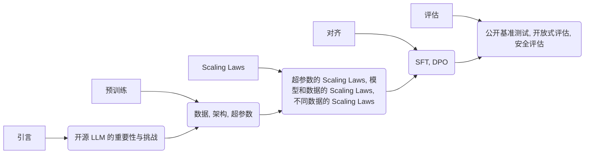
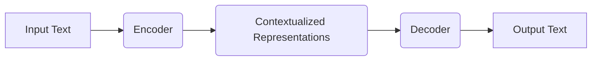
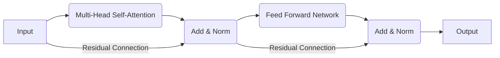
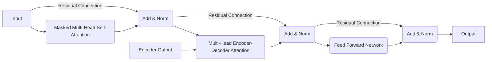
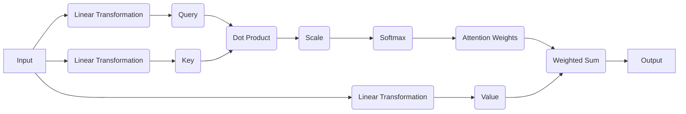

## AI论文解读 | DeepSeek LLM “炼丹”经验长期开源之路   
                
### 作者                
digoal                
                
### 日期                
2025-02-26                
                
### 标签                
PostgreSQL , PolarDB , DuckDB , AI , 论文解读 , MoE , 多头注意 , 混合专家模式      
                
----                
                
## 背景       
[《DeepSeek LLM Scaling Open-Source Language Models with Longtermis》](2401.02954v1.pdf)    
- https://arxiv.org/pdf/2401.02954    
    
## 提示    
用中文通俗易懂的解读这篇论文(可以使用恰当的比喻, 不能太浮夸). 核心关键的内容请展开进行深入解答, 如果有必要可以加mermaid图表来提高可读性. 最后附上论文相关的术语表解释每一条术语.   +   提取这篇论文中的术语, 并进行详细解释, 如果有必要可以加mermaid图表来提高可读性.   
  
- 追问1 自监督预训练怎么理解?  
- 追问2 详细解读Transformer 架构  
- 追问3 再解释一下直接偏好优化 (DPO), 举例子  
- 追问4 展开说一下Scaling Laws  
- 追问5 展开说一下Learning Rate  
    
## 解读    
       
好的，我们来深入解读 DeepSeek LLM 这篇论文，用通俗易懂的比喻，并结合 Mermaid 图表，最后附上术语表。这次我们更侧重于论文本身的内容，而不是泛泛而谈。  
  
**核心思想：开源 LLM 的“长期主义”之路**  
  
这篇论文的核心在于，DeepSeek 团队秉持着“长期主义”的理念，致力于打造更强大的开源语言模型 DeepSeek LLM。他们认为，开源 LLM 的发展是一个长期的过程，需要持续的投入和探索。他们不仅分享了他们的技术细节，更重要的是，他们分享了他们在“炼丹”过程中对 Scaling Laws 的理解，这对于开源社区来说，是一笔宝贵的财富。  
  
**1. 引言：开源 LLM 的重要性与挑战**  
  
*   **理论：** 论文首先强调了开源 LLM 在实现通用人工智能 (AGI) 中的重要性。开源 LLM 可以促进技术的普及和创新，降低 AI 的使用门槛。  
*   **比喻：** 开源 LLM 就像是 AI 领域的“公共基础设施”，可以为各种应用提供基础能力。  
*   **关键点：**  
    *   **Transformer 架构：** 基于 Transformer 架构的 LLM 已经成为主流。  
    *   **自监督预训练：** LLM 通过在海量数据上进行自监督预训练，学习到丰富的语言知识。 ( 可以理解让它自己看书, 为让大模型不会胡言乱语, 说出来的话前后有关联, 有逻辑. )  
    *   **监督微调和奖励建模：** 通过监督微调和奖励建模，LLM 可以更好地遵循用户意图和指令。  
*   **深入解读：** 论文指出，虽然开源 LLM 取得了显著进展，但仍然面临着一些挑战，例如：  
    *   **Scaling Laws 的不确定性：** 之前的研究对模型和数据如何随着计算资源的增加而扩展，得出了不同的结论。  
    *   **超参数的优化：** 如何选择合适的超参数，以获得最佳的训练效果，仍然是一个难题。  
  
**2. 预训练：打造强大的“AI 基础模型”**  
  
*   **理论：** 预训练是 LLM 训练的关键阶段，其目标是在海量数据上学习到通用的语言知识。  
*   **比喻：** 预训练就像是给 AI 模型打下坚实的基础，使其具备处理各种任务的能力。  
*   **关键点：**  
    *   **数据：** DeepSeek 团队收集了 2 万亿 tokens 的数据进行预训练，主要包括中文和英文数据。  
    *   **架构：** DeepSeek LLM 采用了 LLaMA 的架构，并进行了一些微调。  
    *   **超参数：** DeepSeek 团队仔细调整了超参数，以优化训练效果。  
*   **深入解读：**  
    *   **数据处理：** DeepSeek 团队在数据处理方面下了很大功夫，包括去重、过滤和重组。  
        *   **去重 (Deduplication)：** 采用了更激进的去重策略，扩大了去重范围，提高了去重率。  
        *   **过滤 (Filtering)：** 开发了更强大的过滤标准，从语言和语义两个方面评估数据质量。  
        *   **重组 (Remixing)：** 调整了不同领域数据的比例，增加了代表性不足的领域的数据量。  
    *   **模型架构：** DeepSeek LLM 采用了 LLaMA 的架构，并进行了一些微调。  
        *   **层数调整：** DeepSeek LLM 7B 是 30 层网络，DeepSeek LLM 67B 是 95 层网络。  
        *   **GQA：** DeepSeek LLM 67B 使用了 GQA (Grouped-Query Attention) 技术，以优化推理成本。  
    *   **超参数：** DeepSeek 团队仔细调整了超参数，以优化训练效果。  
        *   **AdamW 优化器：** 使用 AdamW 优化器进行训练。  
        *   **学习率调度器：** 使用多步学习率调度器，而不是余弦学习率调度器，以方便持续训练。  
  
**3. Scaling Laws：探索模型扩展的“秘诀”**  
  
*   **理论：** Scaling Laws 描述了模型大小、数据量和计算资源之间的关系，可以帮助我们制定更合理的训练计划。  
*   **比喻：** Scaling Laws 就像是 AI 领域的“炼金术”，可以指导我们如何扩展模型，以获得更好的性能。  
*   **关键点：**  
    *   **超参数的 Scaling Laws：** DeepSeek 团队研究了 Batch Size 和学习率的 Scaling Laws，发现了它们与模型大小之间的关系。  
    *   **模型和数据的 Scaling Laws：** DeepSeek 团队对模型和数据的 Scaling Laws 进行了全面的研究，成功地揭示了最佳的模型/数据扩展策略，并预测了大规模模型的预期性能。  
    *   **不同数据的 Scaling Laws：** DeepSeek 团队发现，从不同数据集导出的 Scaling Laws 存在显著差异。  
*   **深入解读：**  
    *   **超参数的 Scaling Laws：** DeepSeek 团队发现，Batch Size 和学习率需要随着模型大小的增加而进行调整，以获得最佳的训练效果。  
    *   **模型和数据的 Scaling Laws：** DeepSeek 团队的研究表明，模型和数据之间存在着一种平衡关系，需要根据计算资源的限制，合理地分配模型大小和数据量。  
    *   **不同数据的 Scaling Laws：** DeepSeek 团队的发现表明，数据集的选择对模型的性能有着重要的影响，需要谨慎地选择数据集。  
  
**4. 对齐：让 AI 模型更懂“人话”**  
  
*   **理论：** 对齐 (Alignment) 是指使 LLM 更好地遵循人类意图和指令的过程。  
*   **比喻：** 对齐就像是给 AI 模型进行“情商训练”，使其更懂“人话”。  
*   **关键点：**  
    *   **监督微调 (SFT)：** 使用标注数据来训练 AI 模型，使其更好地遵循人类指令。 典型的方法就是使用优质数据集对模型进行专项训练(调参), 让它变成领域专家. 例如 [《手把手教你炼丹 | 使用医疗诊断公开数据集微调专业医生大模型 , 中医崛起》](../202502/20250225_02.md)    
    *   **直接偏好优化 (DPO)：** 基于人类反馈来训练 AI 模型，使其更好地满足人类偏好。  
*   **深入解读：** DeepSeek 团队使用了 SFT 和 DPO 两种方法来对齐模型。  
    *   **SFT：** DeepSeek 团队收集了超过 100 万个实例进行 SFT，数据来源多样。  
    *   **DPO：** DeepSeek 团队使用了 DPO 来提高模型的对话性能。  
  
**5. 评估：检验 AI 模型的“成色”**  
  
*   **理论：** 评估是检验 AI 模型性能的重要手段。  
*   **比喻：** 评估就像是给 AI 模型进行“考试”，检验其掌握知识的程度。  
*   **关键点：**  
    *   **公开基准测试：** 使用公开基准测试来评估模型的性能。  
    *   **开放式评估：** 进行开放式评估，了解模型在实际应用中的表现。  
    *   **安全评估：** 进行安全评估，确保模型不会生成有害信息。  
*   **深入解读：** DeepSeek 团队对 DeepSeek LLM 进行了全面的评估，包括：  
    *   **公开基准测试：** DeepSeek LLM 在多个基准测试中超过了 LLaMA-2 70B，尤其是在代码、数学和推理方面。  
    *   **开放式评估：** DeepSeek LLM 67B Chat 在中文和英文开放式评估中优于 GPT-3.5。  
    *   **安全评估：** DeepSeek LLM 67B Chat 在实践中可以提供无害的回复。  
  
**Mermaid 图表：**  
  

  
**术语表：**  
  
*   **LLM (Large Language Model)：** 大型语言模型，一种基于深度学习的 AI 模型，能够理解和生成自然语言文本。**比喻：** 就像一个知识渊博的“AI 大脑”，可以回答各种问题，生成各种文本。  
*   **AGI (Artificial General Intelligence)：** 通用人工智能，指具有人类水平智能的 AI。**比喻：** 就像一个“万事通”，可以胜任各种任务。  
*   **Transformer：** 一种神经网络架构，被广泛应用于 LLM 中。**比喻：** 就像一个“翻译器”，可以将一种语言转换为另一种语言。  
*   **自监督预训练：** 一种训练 LLM 的方法，通过在海量数据上预测下一个词来学习语言知识。**比喻：** 就像让 AI 模型“自学成才”。  
*   **监督微调 (SFT)：** 一种训练 LLM 的方法，使用标注数据来训练 AI 模型，使其更好地遵循人类指令。**比喻：** 就像老师给学生“划重点”，让学生更好地掌握知识。  
*   **直接偏好优化 (DPO)：** 一种训练 LLM 的方法，基于人类反馈来训练 AI 模型，使其更好地满足人类偏好。**比喻：** 就像用户给产品“打分”，让产品更好地满足用户需求。  
*   **Scaling Laws：** 描述模型大小、数据量和计算资源之间关系的规律。**比喻：** 就像一个“公式”，可以帮助我们预测模型在不同规模下的性能。  
*   **Batch Size：** 批大小，指每次训练迭代中使用的样本数量。**比喻：** 就像一次“批量处理”的样本数量。  
*   **Learning Rate：** 学习率，指模型在训练过程中更新参数的速度。**比喻：** 就像一个“调节器”，可以控制模型的学习速度。  
*   **Hyperparameters：** 超参数，指在训练模型之前需要设置的参数，例如学习率、Batch Size 等。**比喻：** 就像一个“开关”，可以控制模型的训练过程。  
*   **Deduplication：** 去重，指去除数据集中重复的内容。**比喻：** 就像清理垃圾，去除重复的文件。  
*   **Filtering：** 过滤，指去除数据集中低质量的内容。**比喻：** 就像筛选邮件，去除垃圾邮件。  
*   **Remixing：** 重组，指调整数据集中不同领域数据的比例。**比喻：** 就像调整食谱，调整不同食材的比例。  
*   **GQA (Grouped-Query Attention)：** 分组查询注意力，一种减少计算量，提高模型推理速度的技术。**比喻：** 就像一个“加速器”，可以提高模型的运行速度。  
*   **AdamW：** 一种优化器，用于训练神经网络。**比喻：** 就像一个“教练”，可以指导模型进行学习。  
*   **Tokenizer：** 分词器，用于将文本分割成 tokens。**比喻：** 就像一个“切割机”，可以将文本切割成小块。  
*   **Token：** 词元，指文本的基本单位。**比喻：** 就像一个“积木”，可以用来构建文本。  
  
希望这个深入解读能够帮助你更好地理解 DeepSeek LLM 论文的内容。  
  
## 追问1 自监督预训练怎么理解?  
  
自监督预训练 (Self-Supervised Pre-training) 是指一种训练机器学习模型的方法，尤其是在自然语言处理 (NLP) 领域，它允许模型从大量未标记的数据中学习有用的表示，而无需人工标注。  
  
**核心思想：**  
  
自监督学习的核心在于，它利用数据本身作为监督信号，自动生成标签，从而避免了人工标注的成本。模型通过解决一个预定义的任务（例如，预测句子中的下一个词），来学习数据中的模式和结构。  
  
**通俗比喻：**  
  
想象一下，你让一个孩子通过阅读大量的书籍来学习语言。你没有告诉孩子每个词的意思，也没有给孩子做语法练习。孩子只是通过阅读，自己总结出词汇、语法和语义的规律。自监督预训练就像是让 AI 模型通过阅读大量的文本来学习语言，而不需要人工标注。  
  
**具体步骤：**  
  
1.  **准备大量未标记的数据：** 例如，大量的文本数据，如网页、书籍、新闻文章等。  
2.  **设计一个自监督任务：** 例如：  
    *   **Masked Language Modeling (MLM)：** 随机遮盖句子中的一些词，让模型预测被遮盖的词。  
    *   **Next Sentence Prediction (NSP)：** 给定两个句子，让模型判断它们是否是相邻的句子。  
    *   **Causal Language Modeling (CLM)：** 让模型预测句子中的下一个词（也称为语言建模）。  
3.  **训练模型：** 使用未标记的数据和自监督任务来训练模型。模型通过解决自监督任务来学习数据中的模式和结构。  
4.  **微调模型 (Fine-tuning)：** 在预训练完成后，可以使用少量标记的数据来微调模型，使其适应特定的任务，例如文本分类、情感分析、机器翻译等。  
  
**优势：**  
  
*   **无需人工标注：** 可以利用大量的未标记数据进行训练，降低了训练成本。  
*   **学习通用的表示：** 可以学习到通用的语言知识，提高模型在各种任务上的性能。  
*   **提高模型性能：** 可以作为微调的良好起点，提高模型在特定任务上的性能。  
  
**举例：**  
  
*   **BERT (Bidirectional Encoder Representations from Transformers)：** 使用 MLM 和 NSP 任务进行自监督预训练。  
*   **GPT (Generative Pre-trained Transformer)：** 使用 CLM 任务进行自监督预训练。  
  
**总结：**  
  
自监督预训练是一种强大的机器学习方法，它允许模型从大量未标记的数据中学习有用的表示，而无需人工标注。它在自然语言处理领域取得了显著的成功，并被广泛应用于各种任务中。  
  
## 追问2 详细解读Transformer 架构  
  
好的，我们来详细解读 Transformer 架构，力求通俗易懂，并结合图表和比喻。  
  
**核心思想：**  
  
Transformer 架构是一种基于注意力机制 (Attention Mechanism) 的深度学习模型，最初被设计用于机器翻译任务，但现在已经成为自然语言处理 (NLP) 领域的主流架构。它摒弃了传统的循环神经网络 (RNN) 和卷积神经网络 (CNN)，完全依赖于注意力机制来实现并行计算，从而大大提高了训练效率。  
  
**通俗比喻：**  
  
想象一下，你在阅读一篇文章。当你读到某个词的时候，你的大脑会自动关注与这个词相关的其他词。Transformer 架构就像是模拟了这种注意力机制，让模型能够更好地理解文本的含义。  
  
**整体架构：**  
  
Transformer 架构主要由两部分组成：编码器 (Encoder) 和解码器 (Decoder)。  
  

  
*   **编码器 (Encoder)：** 负责将输入文本转换为上下文相关的表示。  
*   **解码器 (Decoder)：** 负责根据编码器的输出生成目标文本。  
  
**编码器 (Encoder) 的内部结构：**  
  
编码器由多个相同的层堆叠而成，每一层都包含两个主要的子层：  
  
1.  **多头自注意力机制 (Multi-Head Self-Attention)：** 负责计算输入文本中每个词与其他词之间的关系。  
2.  **前馈神经网络 (Feed Forward Network)：** 负责对每个词的表示进行非线性变换。  
  

  
*   **多头自注意力机制 (Multi-Head Self-Attention)：**  
    *   **自注意力 (Self-Attention)：** 允许模型关注输入序列中的不同位置，以计算每个词的表示。  
    *   **多头 (Multi-Head)：** 使用多个自注意力机制并行计算，以捕捉不同的关系。  
*   **前馈神经网络 (Feed Forward Network)：**  
    *   包含两个线性变换和一个非线性激活函数 (通常是 ReLU)。  
    *   对每个词的表示进行非线性变换，以提高模型的表达能力。  
*   **Add & Norm：**  
    *   **Add (Residual Connection)：** 将输入添加到输出，以缓解梯度消失问题。  
    *   **Norm (Layer Normalization)：** 对输出进行归一化，以提高训练稳定性。  
  
**解码器 (Decoder) 的内部结构：**  
  
解码器也由多个相同的层堆叠而成，每一层都包含三个主要的子层：  
  
1.  **多头自注意力机制 (Multi-Head Self-Attention)：** 负责计算目标文本中每个词与其他词之间的关系。  
2.  **多头编码器-解码器注意力机制 (Multi-Head Encoder-Decoder Attention)：** 负责计算目标文本中每个词与输入文本之间的关系。  
3.  **前馈神经网络 (Feed Forward Network)：** 负责对每个词的表示进行非线性变换。  
  

  
*   **Masked Multi-Head Self-Attention：**  
    *   与编码器中的多头自注意力机制类似，但添加了一个 Mask，以防止模型在训练过程中看到未来的信息。  
*   **Multi-Head Encoder-Decoder Attention：**  
    *   允许解码器关注编码器的输出，以获取输入文本的信息。  
*   **前馈神经网络 (Feed Forward Network)：**  
    *   与编码器中的前馈神经网络类似。  
*   **Add & Norm：**  
    *   与编码器中的 Add & Norm 类似。  
  
**注意力机制 (Attention Mechanism)：**  
  
注意力机制是 Transformer 架构的核心，它允许模型关注输入序列中的不同位置，以计算每个词的表示。  
  

  
*   **Query (Q)：** 查询，用于查询输入序列中的相关信息。  
*   **Key (K)：** 键，用于表示输入序列中的每个位置。  
*   **Value (V)：** 值，用于表示输入序列中的每个位置的内容。  
*   **Dot Product：** 点积，用于计算 Query 和 Key 之间的相似度。  
*   **Scale：** 缩放，用于防止点积过大。  
*   **Softmax：** Softmax 函数，用于将相似度转换为概率分布。  
*   **Attention Weights：** 注意力权重，表示每个位置的重要性。  
*   **Weighted Sum：** 加权求和，用于将 Value 按照注意力权重进行加权求和，得到最终的输出。  
  
**优势：**  
  
*   **并行计算：** 摒弃了 RNN 和 CNN，完全依赖于注意力机制来实现并行计算，大大提高了训练效率。  
*   **长距离依赖：** 可以捕捉长距离依赖关系，更好地理解文本的含义。  
*   **可解释性：** 注意力权重可以用来解释模型的决策过程。  
  
**总结：**  
  
Transformer 架构是一种强大的深度学习模型，它基于注意力机制实现了并行计算，并能够捕捉长距离依赖关系。它已经成为自然语言处理领域的主流架构，并被广泛应用于各种任务中。  
  
## 追问3 再解释一下直接偏好优化 (DPO), 举例子  
  
好的，我们来详细解释一下直接偏好优化 (Direct Preference Optimization, DPO)，并结合例子来帮助理解。  
  
**核心思想：**  
  
直接偏好优化 (DPO) 是一种训练语言模型 (LLM) 的方法，它旨在使模型生成的文本更符合人类的偏好。与传统的强化学习方法 (如 RLHF) 相比，DPO 更加简单、稳定，并且不需要奖励模型。  
  
**通俗比喻：**  
  
想象一下，你在教一个小孩子写作文。你给孩子看两篇作文，一篇你认为写得更好，另一篇你认为写得不好。你告诉孩子，你更喜欢哪一篇，以及为什么。DPO 就像是模拟了这个过程，让模型通过学习人类的偏好来生成更好的文本。  
  
**具体步骤：**  
  
1.  **收集偏好数据：** 收集人类对不同文本的偏好数据。通常，这些数据包括一个提示 (Prompt) 和两个由模型生成的回复：一个被人类认为更好 (Preferred) 的回复，和一个被认为更差 (Rejected) 的回复。  
2.  **定义 DPO 损失函数：** DPO 使用一个特殊的损失函数来训练模型，该损失函数鼓励模型生成更接近 Preferred 回复的文本，并远离 Rejected 回复的文本。  
3.  **训练模型：** 使用偏好数据和 DPO 损失函数来训练模型。模型通过学习人类的偏好来调整其参数。  
  
**DPO 损失函数：**  
  
DPO 的损失函数基于 Bradley-Terry 模型，该模型用于预测在两个选项中，哪个选项更可能被选择。DPO 的损失函数可以表示为：  
  
```  
Loss(θ) = - log σ(β * (log pθ(x_preferred | prompt) - log pθ(x_rejected | prompt)))  
```  
  
其中：  
  
*   `θ` 是模型的参数。  
*   `prompt` 是提示。  
*   `x_preferred` 是 Preferred 回复。  
*   `x_rejected` 是 Rejected 回复。  
*   `pθ(x | prompt)` 是模型在给定提示下生成文本 x 的概率。  
*   `σ` 是 sigmoid 函数。  
*   `β` 是一个超参数，用于控制偏好的强度。  
  
**举例：**  
  
假设我们有一个 LLM，我们想让它生成更好的对话回复。  
  
1.  **收集偏好数据：** 我们收集了一些人类对不同回复的偏好数据。例如：  
  
    *   **Prompt:** "你好，今天天气真好！"  
    *   **回复 1 (Preferred):** "是啊，阳光明媚，适合出去走走。"  
    *   **回复 2 (Rejected):** "嗯。"  
  
    在这个例子中，人类更喜欢回复 1，因为它更礼貌、更积极。  
2.  **使用 DPO 训练模型：** 我们使用这些偏好数据和 DPO 损失函数来训练模型。模型通过学习人类的偏好来调整其参数，使其更倾向于生成像回复 1 这样的文本，而不是像回复 2 这样的文本。  
  
**优势：**  
  
*   **简单：** DPO 比 RLHF 更加简单，因为它不需要训练奖励模型。  
*   **稳定：** DPO 的训练过程更加稳定，因为它避免了 RLHF 中可能出现的奖励模型不准确的问题。  
*   **高效：** DPO 可以直接优化模型的策略，而不需要像 RLHF 那样进行复杂的策略迭代。  
  
**总结：**  
  
直接偏好优化 (DPO) 是一种简单、稳定、高效的训练 LLM 的方法，它通过学习人类的偏好来生成更好的文本。它在各种 NLP 任务中都取得了显著的成功，例如对话生成、文本摘要等。  
  
## 追问4 展开说一下Scaling Laws  
  
好的，我们来展开讲解一下 Scaling Laws，力求通俗易懂，并结合图表和比喻。  
  
**核心思想：**  
  
Scaling Laws 描述了机器学习模型（尤其是大型语言模型 LLM）的性能与模型大小、训练数据量和计算资源之间的关系。它们提供了一种预测模型在不同规模下的性能的方法，并指导我们如何有效地扩展模型。  
  
我个人的理解, Scaling Laws 有点像校准数据库成本因子的过程, 例如ssd random_page_cost应该略高于seqscan_page_cost, 因为ssd上的离散IO和顺序IO的耗时差别没有机械盘那么大.  还有CPU相关的调整等. 都和环境有关, 最后能让数据库优化器在计算SQL执行计划代价时获得更准确的评估数据. 拿到更好的优化路径.   
- [《优化器成本因子校对 - PostgreSQL explain cost constants alignment to timestamp》](../201311/20131126_03.md)    
- [《优化器成本因子校对(disk,ssd,memory IO开销精算) - PostgreSQL real seq_page_cost & random_page_cost in disks,ssd,memory》](../201404/20140423_01.md)    
  
**通俗比喻：**  
  
Scaling Laws 就像是 AI 领域的“炼金术”，可以指导我们如何扩展模型，以获得更好的性能。它们告诉我们，模型越大、数据越多、计算资源越多，模型的性能就越好，但这种提升并不是无限的，而是遵循一定的规律。  
  
**关键要素：**  
  
Scaling Laws 主要涉及以下三个关键要素：  
  
1.  **模型大小 (Model Size)：** 通常用模型的参数数量来衡量。  
2.  **训练数据量 (Training Data Size)：** 通常用训练数据的 tokens 数量来衡量。  
3.  **计算资源 (Compute)：** 通常用训练过程中使用的浮点运算次数 (FLOPs) 来衡量。  
  
**基本规律：**  
  
Scaling Laws 表明，模型的性能通常会随着模型大小、训练数据量和计算资源的增加而提高，但这种提升会逐渐减缓。  
  
**数学公式：**  
  
Scaling Laws 可以用以下公式来表示：  
  
```  
Loss = A * N^(-α)  
```  
  
其中：  
  
*   `Loss` 是模型的损失函数值，用于衡量模型的性能。  
*   `N` 是模型大小、训练数据量或计算资源。  
*   `A` 是一个常数。  
*   `α` 是一个指数，用于描述性能提升的速度。  
  
**图表：**  
  

  
**不同类型的 Scaling Laws：**  
  
1.  **模型大小 Scaling Laws：** 描述了模型性能与模型大小之间的关系。通常，模型越大，性能越好，但这种提升会逐渐减缓。  
2.  **数据量 Scaling Laws：** 描述了模型性能与训练数据量之间的关系。通常，数据越多，性能越好，但这种提升会逐渐减缓。  
3.  **计算资源 Scaling Laws：** 描述了模型性能与计算资源之间的关系。通常，计算资源越多，性能越好，但这种提升会逐渐减缓。  
  
**Scaling Laws 的应用：**  
  
1.  **预测模型性能：** 可以根据 Scaling Laws 预测模型在不同规模下的性能，从而指导我们如何有效地扩展模型。  
2.  **优化训练策略：** 可以根据 Scaling Laws 优化训练策略，例如选择合适的模型大小、训练数据量和计算资源。  
3.  **指导模型设计：** 可以根据 Scaling Laws 指导模型设计，例如选择合适的模型架构和训练方法。  
  
**Scaling Laws 的局限性：**  
  
1.  **数据质量：** Scaling Laws 假设训练数据的质量是恒定的，但实际上，数据质量对模型性能有很大的影响。  
2.  **模型架构：** Scaling Laws 主要适用于 Transformer 架构，对于其他架构的模型，可能不适用。  
3.  **任务类型：** Scaling Laws 主要适用于语言建模任务，对于其他类型的任务，可能不适用。  
  
**总结：**  
  
Scaling Laws 是一种重要的理论工具，可以帮助我们理解和预测大型语言模型的性能。它们指导我们如何有效地扩展模型，并优化训练策略。然而，Scaling Laws 也存在一些局限性，需要在使用时注意。  
  
希望这个展开讲解能够帮助你更好地理解 Scaling Laws。  
  
## 追问5 展开说一下Learning Rate  
  
好的，我们来展开讲解一下 Learning Rate（学习率），力求通俗易懂，并结合图表和比喻。  
  
**核心思想：**  
  
Learning Rate（学习率）是机器学习中一个非常重要的超参数，尤其是在训练神经网络时。它控制着模型在每次迭代中更新参数的幅度。简单来说，学习率决定了模型学习的速度。  
  
**通俗比喻：**  
  
想象一下，你在爬山。你的目标是到达山顶（模型的最佳状态）。  
  
*   **学习率过大：** 就像你一步迈得太大，可能会直接跨过山顶，或者在山顶附近来回跳动，无法稳定下来。  
*   **学习率过小：** 就像你一步迈得太小，爬山的速度非常慢，可能需要很长时间才能到达山顶。  
  
我在微调时确实发现了这个问题, 不同的rate 带来的train loss收敛速度不一样, 有一些收敛就特别慢, 好像`1e-4`比较好. 感觉和微调数据集的大小也有关.    
- [《手把手教你炼丹 | 使用医疗诊断公开数据集微调专业医生大模型 , 中医崛起》](../202502/20250225_02.md)    
- [《手把手教你炼丹 | 用Mac本地微调大模型 , 扩展: 微调数据JSONL的内容格式和什么有关?》](../202502/20250215_01.md)    
    
**具体作用：**  
  
在训练神经网络时，我们的目标是找到一组参数，使得损失函数（Loss Function）的值最小。损失函数衡量了模型预测结果与真实结果之间的差距。  
  
梯度下降（Gradient Descent）是一种常用的优化算法，用于更新模型的参数。梯度指向损失函数下降最快的方向。学习率决定了我们沿着梯度方向移动的步长。  
  
**数学公式：**  
  
参数更新公式如下：  
  
```  
θ = θ - η * ∇J(θ)  
```  
  
其中：  
  
*   `θ` 是模型的参数。  
*   `η` 是学习率（Learning Rate）。  
*   `∇J(θ)` 是损失函数 `J(θ)` 关于参数 `θ` 的梯度。  
  
**图表：**  
  

  
**学习率的选择：**  
  
选择合适的学习率非常重要。  
  
*   **固定学习率：** 使用一个固定的学习率进行训练。  
*   **学习率衰减：** 随着训练的进行，逐渐减小学习率。  
    *   **Step Decay：** 每隔一定的迭代次数，将学习率乘以一个衰减因子。  
    *   **Exponential Decay：** 按照指数函数衰减学习率。  
    *   **Cosine Annealing：** 按照余弦函数衰减学习率。  
*   **自适应学习率：** 根据参数的梯度大小，自动调整学习率。  
    *   **Adam：** 一种常用的自适应学习率优化器。  
    *   **RMSProp：** 另一种常用的自适应学习率优化器。  
  
**影响学习率的因素：**  
  
*   **数据集：** 不同的数据集可能需要不同的学习率。  
*   **模型架构：** 不同的模型架构可能需要不同的学习率。  
*   **优化器：** 不同的优化器可能需要不同的学习率。  
*   **Batch Size：** Batch Size 越大，通常需要更大的学习率。  
  
**总结：**  
  
学习率是机器学习中一个非常重要的超参数，它控制着模型学习的速度。选择合适的学习率对于训练出好的模型至关重要。通常需要根据具体的问题和模型进行调整。  
  
希望这个展开讲解能够帮助你更好地理解 Learning Rate。  
  
  
<b> 以上内容基于DeepSeek及诸多AI生成, 轻微人工调整, 感谢杭州深度求索人工智能等公司 </b>           
         
<b> AI 生成的内容请自行辨别正确性, 当然也多了些许踩坑的乐趣, 毕竟冒险是每个男人的天性. </b>         
        
  
#### [期望 PostgreSQL|开源PolarDB 增加什么功能?](https://github.com/digoal/blog/issues/76 "269ac3d1c492e938c0191101c7238216")
  
  
#### [PolarDB 开源数据库](https://openpolardb.com/home "57258f76c37864c6e6d23383d05714ea")
  
  
#### [PolarDB 学习图谱](https://www.aliyun.com/database/openpolardb/activity "8642f60e04ed0c814bf9cb9677976bd4")
  
  
#### [PostgreSQL 解决方案集合](../201706/20170601_02.md "40cff096e9ed7122c512b35d8561d9c8")
  
  
#### [德哥 / digoal's Github - 公益是一辈子的事.](https://github.com/digoal/blog/blob/master/README.md "22709685feb7cab07d30f30387f0a9ae")
  
  
#### [About 德哥](https://github.com/digoal/blog/blob/master/me/readme.md "a37735981e7704886ffd590565582dd0")
  
  

  
