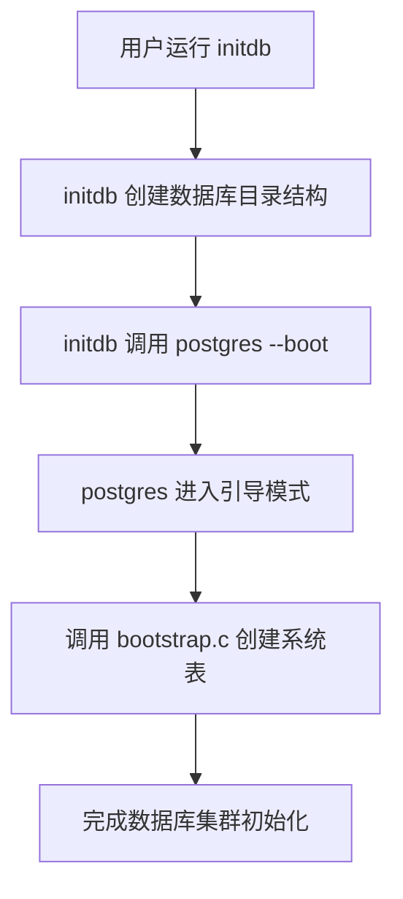

## AI辅助 PolarDB内核学习 - 6 解读PolarDB PostgreSQL 15 bootstrap.c   
            
### 作者            
digoal            
            
### 日期            
2025-02-27           
            
### 标签            
PostgreSQL , PolarDB , DuckDB , AI , initdb , postgres boot模式 , bootstrap.c , 元数据生成 , 鸡蛋问题    
            
----            
            
## 背景         
结合DeepSeek和Gemini 2.0 Flash, 解读PolarDB PostgreSQL 15 bootstrap.c, initdb初始化元数据的过程.         
      
提示:        
```  
结合如下背景  
bootstrap  
Creates initial template database via initdb Because PostgreSQL requires access to system tables for almost every operation, getting those system tables in place is a problem. You can't just create the tables and insert data into them in the normal way, because table creation and insertion requires the tables to already exist. This code jams the data directly into tables using a special syntax used only by the bootstrap procedure.  
逐行解读数据库代码中的这个bootstrap.c文件, 我是一名c语言初学者, 要让我看懂.  
```  
  
## bootstrap 过程概括：  
  
“bootstrap”   
- 指的是 PostgreSQL 的引导过程，也就是创建初始数据库的过程。  
  
“Creates initial template database via initdb”  
- `Creates initial template database:` 创建初始的模板数据库。模板数据库是新数据库的基础，所有新数据库都是从模板数据库复制而来。  
- `via initdb:` 通过 `initdb` 工具来创建。`initdb` 是 PostgreSQL 提供的一个命令行工具，用于初始化一个新的 PostgreSQL 数据库集群。  
  
“Because PostgreSQL requires access to system tables for almost every operation, getting those system tables in place is a problem.”  
- `Because PostgreSQL requires access to system tables for almost every operation:` 因为 PostgreSQL 几乎所有的操作都需要访问系统表。系统表存储了数据库的元数据，例如表结构、用户权限等等。  
- `getting those system tables in place is a problem:` 如何创建这些系统表就成了一个问题。  
  
“You can’t just create the tables and insert data into them in the normal way, because table creation and insertion requires the tables to already exist.”  
- `You can't just create the tables and insert data into them in the normal way:` 你不能像创建普通表那样创建系统表，也不能像插入普通数据那样插入系统表的数据。  
- `because table creation and insertion requires the tables to already exist:` 因为创建表和插入数据本身就需要访问系统表，而此时系统表还不存在，这就形成了一个“先有鸡还是先有蛋”的问题。  
  
“This code jams the data directly into tables using a special syntax used only by the bootstrap procedure.”  
- `This code jams the data directly into tables:` 这段代码直接将数据“塞”到表中。  
- `using a special syntax used only by the bootstrap procedure:` 使用了一种特殊的语法，这种语法只在引导过程中使用。这种特殊语法绕过了通常的数据库操作，允许直接操作底层数据结构。  
  
这段文字解释了 PostgreSQL 引导过程的必要性和特殊性。由于系统表是 PostgreSQL 运行的基础，但创建系统表又需要访问系统表，因此需要一种特殊的引导过程来创建初始的系统表。`bootstrap.c` 文件中的代码就是实现这个特殊引导过程的关键，它使用一种特殊的语法直接操作底层数据结构，从而创建初始的模板数据库。  
  
简单来说，`bootstrap` 过程就像是在没有工具的情况下，手工搭建一个最简陋的房子，然后才能用这个房子里的工具来建造更完善的房子。  
  
## `initdb` 和 `bootstrap.c` 的关系  
在 PostgreSQL 的源码中，`bootstrap.c` 并不是直接通过 `initdb` 调用的，但它们之间存在密切的关系。以下是详细的解释：  
  
---  
  
### **1. `initdb` 的作用**  
`initdb` 是 PostgreSQL 提供的一个工具，用于初始化一个新的数据库集群。它的主要任务包括：  
- 创建数据库目录结构。  
- 生成必要的系统表（如 `pg_class`、`pg_attribute` 等）。  
- 初始化全局配置文件和默认数据。  
  
`initdb` 是一个独立的可执行程序，通常由用户在安装 PostgreSQL 后手动运行。  
  
---  
  
### **2. `bootstrap.c` 的作用**  
`bootstrap.c` 是 PostgreSQL 源码中的一个核心模块，负责在数据库集群初始化时引导创建系统表。它的主要功能包括：  
- 定义系统表的结构（如列名、数据类型等）。  
- 生成系统表的初始数据。  
- 调用底层的存储管理模块（如 `storage.c`）来实际创建这些表。  
  
`bootstrap.c` 是 PostgreSQL 内部实现的一部分，而不是一个独立的可执行程序。  
  
---  
  
### **3. `initdb` 与 `bootstrap.c` 的关系**  
`initdb` 在初始化数据库集群时，会调用 PostgreSQL 的 `postgres` 可执行程序，并传递一个特殊的 `--boot` 参数。这个参数会触发 `postgres` 进入“引导模式”（bootstrap mode），在引导模式下，`postgres` 会调用 `bootstrap.c` 中的逻辑来创建系统表。  
  
以下是调用关系的简化流程：  
  

  
---  
  
### **4. 关键代码片段**  
在 PostgreSQL 源码中，`initdb` 调用 `postgres` 的代码通常位于 `initdb.c` 中，类似于以下逻辑：  
```c  
exec_prog = "postgres";  
exec_args[0] = "--boot";  
exec_args[1] = "-x";  
exec_args[2] = "-X";  
exec_args[3] = "-c";  
exec_args[4] = "template1";  
exec_args[5] = NULL;  
exec_program(exec_prog, exec_args);  
```  
  
在 `postgres` 的 `main.c` 中，会检查 `--boot` 参数并进入引导模式：  
```c  
if (strcmp(argv[1], "--boot") == 0) {  
    BootstrapModeMain();  
}  
```  
  
`BootstrapModeMain()` 函数定义在 `bootstrap.c` 中，负责创建系统表。  
  
---  
  
### **5. 总结**  
- **`bootstrap.c`**：是 PostgreSQL 内部用于创建系统表的模块。  
- **`initdb`**：是一个独立的工具，用于初始化数据库集群，它会调用 `postgres --boot` 来触发 `bootstrap.c` 的逻辑。  
- **关系**：`initdb` 通过调用 `postgres --boot` 间接调用 `bootstrap.c`，完成系统表的创建和数据库集群的初始化。  
  
希望这个解释能帮助你理解 `bootstrap.c` 和 `initdb` 之间的关系！如果还有其他问题，欢迎继续提问。  
  
## `bootstrap.c` 代码解读  
  
好的，我们来逐行解读 `bootstrap.c` 文件，我会尽量用通俗易懂的语言解释，并针对 C 语言初学者可能会遇到的问题进行说明。  
  
**文件头注释**  
  
```c  
/*-------------------------------------------------------------------------  
 *  
 * bootstrap.c  
 *    routines to support running postgres in 'bootstrap' mode  
 *  bootstrap mode is used to create the initial template database  
 *  
 * Portions Copyright (c) 1996-2022, PostgreSQL Global Development Group  
 * Portions Copyright (c) 1994, Regents of the University of California  
 *  
 * IDENTIFICATION  
 *    src/backend/bootstrap/bootstrap.c  
 *  
 *-------------------------------------------------------------------------  
 */  
```  
  
*   这是一个多行注释，描述了文件的作用：  
    *   `bootstrap.c` 包含支持 PostgreSQL 在 "bootstrap" 模式下运行的例程。  
    *   Bootstrap 模式用于创建初始的模板数据库。  
    *   版权信息，表明代码的版权归属。  
    *   `IDENTIFICATION`：标识文件的路径，`src/backend/bootstrap/bootstrap.c`。  
  
**头文件包含**  
  
```c  
#include "postgres.h"  
  
#include <unistd.h>  
#include <signal.h>  
  
#include "access/genam.h"  
#include "access/heapam.h"  
#include "access/htup_details.h"  
#include "access/tableam.h"  
#include "access/toast_compression.h"  
#include "access/xact.h"  
#include "access/xlog_internal.h"  
#include "bootstrap/bootstrap.h"  
#include "catalog/index.h"  
#include "catalog/pg_collation.h"  
#include "catalog/pg_type.h"  
#include "common/link-canary.h"  
#include "libpq/pqsignal.h"  
#include "miscadmin.h"  
#include "nodes/makefuncs.h"  
#include "pg_getopt.h"  
#include "storage/bufmgr.h"  
#include "storage/bufpage.h"  
#include "storage/condition_variable.h"  
#include "storage/ipc.h"  
#include "storage/proc.h"  
#include "tcop/tcopprot.h"  
#include "utils/builtins.h"  
#include "utils/fmgroids.h"  
#include "utils/memutils.h"  
#include "utils/rel.h"  
#include "utils/relmapper.h"  
```  
  
*   `#include` 是 C 语言的预处理指令，用于包含头文件。头文件中通常包含函数声明、结构体定义、宏定义等。  
*   `postgres.h`：PostgreSQL 的主头文件，包含 PostgreSQL 核心数据结构和函数的声明。  
*   `<unistd.h>`：包含 `unistd.h` 是为了使用 POSIX 操作系统 API，例如 `unistd.h` 中声明的 `getopt` 函数，用于解析命令行参数。  
*   `<signal.h>`：包含 `signal.h` 是为了使用信号处理机制，例如 `signal` 函数，用于注册信号处理函数。  
*   `access/...`：包含访问方法相关的头文件，如堆表访问、索引访问等。  
*   `catalog/...`：包含系统目录相关的头文件，如 `pg_type`（数据类型）、`pg_collation`（排序规则）等。  
*   `storage/...`：包含存储管理相关的头文件，如缓冲区管理、页面管理等。  
*   `utils/...`：包含实用工具相关的头文件，如内存管理、关系管理等。  
*   `bootstrap/bootstrap.h`: 包含本模块的头文件，通常包含本模块对外提供的函数声明。  
  
**全局变量**  
  
```c  
uint32        bootstrap_data_checksum_version = 0; /* No checksum */  
  
  
static void CheckerModeMain(void);  
static void bootstrap_signals(void);  
static Form_pg_attribute AllocateAttribute(void);  
static void populate_typ_list(void);  
static Oid   gettype(char *type);  
static void cleanup(void);  
  
/* ----------------  
 *      global variables  
 * ----------------  
 */  
  
Relation    boot_reldesc;       /* current relation descriptor */  
  
Form_pg_attribute attrtypes[MAXATTR];  /* points to attribute info */  
int         numattr;         /* number of attributes for cur. rel */  
```  
  
*   `uint32 bootstrap_data_checksum_version = 0;`：一个无符号 32 位整数，用于指定 bootstrap 数据的校验和版本。`0` 表示不使用校验和。  
*   `static void CheckerModeMain(void);`：声明了一个静态函数 `CheckerModeMain`，该函数没有参数，返回 `void`（即不返回任何值）。`static` 关键字表示该函数只能在本文件中访问。  
*   `static void bootstrap_signals(void);`：声明了一个静态函数 `bootstrap_signals`，用于设置 bootstrap 过程中的信号处理。  
*   `static Form_pg_attribute AllocateAttribute(void);`：声明了一个静态函数 `AllocateAttribute`，用于分配 `Form_pg_attribute` 结构体的内存。  
*   `static void populate_typ_list(void);`：声明了一个静态函数 `populate_typ_list`，用于填充类型列表。  
*   `static Oid gettype(char *type);`：声明了一个静态函数 `gettype`，用于根据类型名称获取类型 OID。  
*   `static void cleanup(void);`：声明了一个静态函数 `cleanup`，用于清理 bootstrap 过程中的资源。  
*   `Relation boot_reldesc;`：一个 `Relation` 类型的全局变量，表示当前打开的关系（表）的描述符。  
*   `Form_pg_attribute attrtypes[MAXATTR];`：一个 `Form_pg_attribute` 类型的数组，用于存储当前关系的属性（列）信息。`MAXATTR` 是一个宏，定义了最大属性数量。  
*   `int numattr;`：一个整数，表示当前关系的属性数量。  
  
**类型信息结构体**  
  
```c  
/*  
 * Basic information associated with each type.  This is used before  
 * pg_type is filled, so it has to cover the datatypes used as column types  
 * in the core "bootstrapped" catalogs.  
 *  
 *      XXX several of these input/output functions do catalog scans  
 *          (e.g., F_REGPROCIN scans pg_proc).  this obviously creates some  
 *          order dependencies in the catalog creation process.  
 */  
struct typinfo  
{  
    char        name[NAMEDATALEN];  
    Oid          oid;  
    Oid          elem;  
    int16      len;  
    bool        byval;  
    char        align;  
    char        storage;  
    Oid          collation;  
    Oid          inproc;  
    Oid          outproc;  
};  
  
static const struct typinfo TypInfo[] = {  
    {"bool", BOOLOID, 0, 1, true, TYPALIGN_CHAR, TYPSTORAGE_PLAIN, InvalidOid,  
    F_BOOLIN, F_BOOLOUT},  
    {"bytea", BYTEAOID, 0, -1, false, TYPALIGN_INT, TYPSTORAGE_EXTENDED, InvalidOid,  
    F_BYTEAIN, F_BYTEAOUT},  
    {"char", CHAROID, 0, 1, true, TYPALIGN_CHAR, TYPSTORAGE_PLAIN, InvalidOid,  
    F_CHARIN, F_CHAROUT},  
    {"int2", INT2OID, 0, 2, true, TYPALIGN_SHORT, TYPSTORAGE_PLAIN, InvalidOid,  
    F_INT2IN, F_INT2OUT},  
    {"int4", INT4OID, 0, 4, true, TYPALIGN_INT, TYPSTORAGE_PLAIN, InvalidOid,  
    F_INT4IN, F_INT4OUT},  
    {"float4", FLOAT4OID, 0, 4, true, TYPALIGN_INT, TYPSTORAGE_PLAIN, InvalidOid,  
    F_FLOAT4IN, F_FLOAT4OUT},  
    {"name", NAMEOID, CHAROID, NAMEDATALEN, false, TYPALIGN_CHAR, TYPSTORAGE_PLAIN, C_COLLATION_OID,  
    F_NAMEIN, F_NAMEOUT},  
    {"regclass", REGCLASSOID, 0, 4, true, TYPALIGN_INT, TYPSTORAGE_PLAIN, InvalidOid,  
    F_REGCLASSIN, F_REGCLASSOUT},  
    {"regproc", REGPROCOID, 0, 4, true, TYPALIGN_INT, TYPSTORAGE_PLAIN, InvalidOid,  
    F_REGPROCIN, F_REGPROCOUT},  
    {"regtype", REGTYPEOID, 0, 4, true, TYPALIGN_INT, TYPSTORAGE_PLAIN, InvalidOid,  
    F_REGTYPEIN, F_REGTYPEOUT},  
    {"regrole", REGROLEOID, 0, 4, true, TYPALIGN_INT, TYPSTORAGE_PLAIN, InvalidOid,  
    F_REGROLEIN, F_REGROLEOUT},  
    {"regnamespace", REGNAMESPACEOID, 0, 4, true, TYPALIGN_INT, TYPSTORAGE_PLAIN, InvalidOid,  
    F_REGNAMESPACEIN, F_REGNAMESPACEOUT},  
    {"text", TEXTOID, 0, -1, false, TYPALIGN_INT, TYPSTORAGE_EXTENDED, DEFAULT_COLLATION_OID,  
    F_TEXTIN, F_TEXTOUT},  
    {"oid", OIDOID, 0, 4, true, TYPALIGN_INT, TYPSTORAGE_PLAIN, InvalidOid,  
    F_OIDIN, F_OIDOUT},  
    {"tid", TIDOID, 0, 6, false, TYPALIGN_SHORT, TYPSTORAGE_PLAIN, InvalidOid,  
    F_TIDIN, F_TIDOUT},  
    {"xid", XIDOID, 0, 4, true, TYPALIGN_INT, TYPSTORAGE_PLAIN, InvalidOid,  
    F_XIDIN, F_XIDOUT},  
    {"cid", CIDOID, 0, 4, true, TYPALIGN_INT, TYPSTORAGE_PLAIN, InvalidOid,  
    F_CIDIN, F_CIDOUT},  
    {"pg_node_tree", PG_NODE_TREEOID, 0, -1, false, TYPALIGN_INT, TYPSTORAGE_EXTENDED, DEFAULT_COLLATION_OID,  
    F_PG_NODE_TREE_IN, F_PG_NODE_TREE_OUT},  
    {"int2vector", INT2VECTOROID, INT2OID, -1, false, TYPALIGN_INT, TYPSTORAGE_PLAIN, InvalidOid,  
    F_INT2VECTORIN, F_INT2VECTOROUT},  
    {"oidvector", OIDVECTOROID, OIDOID, -1, false, TYPALIGN_INT, TYPSTORAGE_PLAIN, InvalidOid,  
    F_OIDVECTORIN, F_OIDVECTOROUT},  
    {"_int4", INT4ARRAYOID, INT4OID, -1, false, TYPALIGN_INT, TYPSTORAGE_EXTENDED, InvalidOid,  
    F_ARRAY_IN, F_ARRAY_OUT},  
    {"_text", 1009, TEXTOID, -1, false, TYPALIGN_INT, TYPSTORAGE_EXTENDED, DEFAULT_COLLATION_OID,  
    F_ARRAY_IN, F_ARRAY_OUT},  
    {"_oid", 1028, OIDOID, -1, false, TYPALIGN_INT, TYPSTORAGE_EXTENDED, InvalidOid,  
    F_ARRAY_IN, F_ARRAY_OUT},  
    {"_char", 1002, CHAROID, -1, false, TYPALIGN_INT, TYPSTORAGE_EXTENDED, InvalidOid,  
    F_ARRAY_IN, F_ARRAY_OUT},  
    {"_aclitem", 1034, ACLITEMOID, -1, false, TYPALIGN_INT, TYPSTORAGE_EXTENDED, InvalidOid,  
    F_ARRAY_IN, F_ARRAY_OUT}  
};  
  
static const int n_types = sizeof(TypInfo) / sizeof(struct typinfo);  
```  
  
*   `struct typinfo`：定义了一个结构体，用于存储数据类型的基本信息。  
    *   `name`：类型名称。  
    *   `oid`：类型 OID（对象 ID）。  
    *   `elem`：数组元素的类型 OID。  
    *   `len`：类型长度。`-1` 表示变长类型。  
    *   `byval`：类型是否按值传递。  
    *   `align`：类型对齐方式。  
    *   `storage`：类型存储方式。  
    *   `collation`: 排序规则 OID。  
    *   `inproc`：类型输入函数 OID。  
    *   `outproc`：类型输出函数 OID。  
*   `TypInfo[]`：一个 `typinfo` 结构体数组，存储了 PostgreSQL 内置数据类型的基本信息。这个数组在 `pg_type` 系统表被填充之前使用。  
*   `n_types`：一个整数，表示 `TypInfo` 数组中元素的数量。  
  
**类型映射结构体和全局变量**  
  
```c  
struct typmap  
{                               /* a hack */  
    Oid          am_oid;  
    FormData_pg_type am_typ;  
};  
  
static List *Typ = NIL;           /* List of struct typmap* */  
static struct typmap *Ap = NULL;  
```  
  
*   `struct typmap`：定义了一个结构体，用于存储类型 OID 和 `FormData_pg_type` 结构体。  
*   `Typ`：一个 `List` 类型的指针，用于存储 `typmap` 结构体的链表。这个链表用于缓存从 `pg_type` 系统表中读取的类型信息。`NIL` 表示空链表。  
*   `Ap`：一个 `typmap` 结构体指针，指向当前正在使用的类型映射。  
  
**行数据和空值数组**  
  
```c  
static Datum values[MAXATTR]; /* current row's attribute values */  
static bool Nulls[MAXATTR];  
```  
  
*   `values`：一个 `Datum` 类型的数组，用于存储当前行的属性值。`Datum` 是 PostgreSQL 中用于表示各种数据类型的通用类型。  
*   `Nulls`：一个 `bool` 类型的数组，用于标记当前行的属性值是否为空。`true` 表示为空，`false` 表示不为空。  
  
**无垃圾回收内存上下文**  
  
```c  
static MemoryContext nogc = NULL;  /* special no-gc mem context */  
```  
  
*   `nogc`：一个 `MemoryContext` 类型的指针，指向一个特殊的内存上下文，用于存储不需要进行垃圾回收的数据。  
  
**索引列表结构体**  
  
```c  
/*  
 *  At bootstrap time, we first declare all the indices to be built, and  
 *  then build them.  The IndexList structure stores enough information  
 *  to allow us to build the indices after they've been declared.  
 */  
  
typedef struct _IndexList  
{  
    Oid          il_heap;  
    Oid          il_ind;  
    IndexInfo  *il_info;  
    struct _IndexList *il_next;  
} IndexList;  
  
static IndexList *ILHead = NULL;  
```  
  
*   `IndexList`：定义了一个结构体，用于存储索引的信息。  
    *   `il_heap`：堆表（即被索引的表）的 OID。  
    *   `il_ind`：索引表的 OID。  
    *   `il_info`：索引信息，包含索引的各种属性。  
    *   `il_next`：指向下一个 `IndexList` 结构体的指针，用于形成链表。  
*   `ILHead`：一个 `IndexList` 类型的指针，指向索引列表的头部。  
  
**CheckerModeMain 函数**  
  
```c  
/*  
 * In shared memory checker mode, all we really want to do is create shared  
 * memory and semaphores (just to prove we can do it with the current GUC  
 * settings).  Since, in fact, that was already done by  
 * CreateSharedMemoryAndSemaphores(), we have nothing more to do here.  
 */  
static void  
CheckerModeMain(void)  
{  
    proc_exit(0);  
}  
```  
  
*   `CheckerModeMain`：在共享内存检查模式下运行的函数。  
    *   该函数的主要目的是创建共享内存和信号量，以验证当前的 GUC（Grand Unified Configuration）设置是否有效。  
    *   由于 `CreateSharedMemoryAndSemaphores()` 函数已经完成了共享内存和信号量的创建，因此 `CheckerModeMain` 函数直接调用 `proc_exit(0)` 退出。  
  
**BootstrapModeMain 函数**  
  
```c  
/*  
 *   The main entry point for running the backend in bootstrap mode  
 *  
 *   The bootstrap mode is used to initialize the template database.  
 *   The bootstrap backend doesn't speak SQL, but instead expects  
 *   commands in a special bootstrap language.  
 *  
 *   When check_only is true, startup is done only far enough to verify that  
 *   the current configuration, particularly the passed in options pertaining  
 *   to shared memory sizing, options work (or at least do not cause an error  
 *   up to shared memory creation).  
 */  
void  
BootstrapModeMain(int argc, char *argv[], bool check_only)  
{  
    int         i;  
    char       *progname = argv[0];  
    int         flag;  
    char       *userDoption = NULL;  
  
    Assert(!IsUnderPostmaster);  
  
    InitStandaloneProcess(argv[0]);  
  
    /* Set defaults, to be overridden by explicit options below */  
    InitializeGUCOptions();  
  
    /* an initial --boot or --check should be present */  
    Assert(argc > 1  
           && (strcmp(argv[1], "--boot") == 0  
               || strcmp(argv[1], "--check") == 0));  
    argv++;  
    argc--;  
  
    while ((flag = getopt(argc, argv, "B:c:d:D:Fkr:X:-:")) != -1)  
    {  
        switch (flag)  
        {  
            case 'B':  
                SetConfigOption("shared_buffers", optarg, PGC_POSTMASTER, PGC_S_ARGV);  
                break;  
            case 'D':  
                userDoption = pstrdup(optarg);  
                break;  
            case 'd':  
                {  
                    /* Turn on debugging for the bootstrap process. */  
                    char       *debugstr;  
  
                    debugstr = psprintf("debug%s", optarg);  
                    SetConfigOption("log_min_messages", debugstr,  
                                    PGC_POSTMASTER, PGC_S_ARGV);  
                    SetConfigOption("client_min_messages", debugstr,  
                                    PGC_POSTMASTER, PGC_S_ARGV);  
                    pfree(debugstr);  
                }  
                break;  
            case 'F':  
                SetConfigOption("fsync", "false", PGC_POSTMASTER, PGC_S_ARGV);  
                break;  
            case 'k':  
                bootstrap_data_checksum_version = PG_DATA_CHECKSUM_VERSION;  
                break;  
            case 'r':  
                strlcpy(OutputFileName, optarg, MAXPGPATH);  
                break;  
            case 'X':  
                {  
                    int         WalSegSz = strtoul(optarg, NULL, 0);  
  
                    if (!IsValidWalSegSize(WalSegSz))  
                        ereport(ERROR,  
                                (errcode(ERRCODE_INVALID_PARAMETER_VALUE),  
                                 errmsg("-X requires a power of two value between 1 MB and 1 GB")));  
                    SetConfigOption("wal_segment_size", optarg, PGC_INTERNAL,  
                                    PGC_S_DYNAMIC_DEFAULT);  
                }  
                break;  
            case 'c':  
            case '-':  
                {  
                    char       *name,  
                               *value;  
  
                    ParseLongOption(optarg, &name, &value);  
                    if (!value)  
                    {  
                        if (flag == '-')  
                            ereport(ERROR,  
                                    (errcode(ERRCODE_SYNTAX_ERROR),  
                                     errmsg("--%s requires a value",  
                                            optarg)));  
                        else  
                            ereport(ERROR,  
                                    (errcode(ERRCODE_SYNTAX_ERROR),  
                                     errmsg("-c %s requires a value",  
                                            optarg)));  
                    }  
  
                    SetConfigOption(name, value, PGC_POSTMASTER, PGC_S_ARGV);  
                    free(name);  
                    if (value)  
                        free(value);  
                    break;  
                }  
            default:  
                write_stderr("Try \"%s --help\" for more information.\n",  
                             progname);  
                proc_exit(1);  
                break;  
        }  
    }  
  
    if (argc != optind)  
    {  
        write_stderr("%s: invalid command-line arguments\n", progname);  
        proc_exit(1);  
    }  
  
    /* Acquire configuration parameters */  
    if (!SelectConfigFiles(userDoption, progname, false))  
        proc_exit(1);  
  
    /*  
     * Validate we have been given a reasonable-looking DataDir and change  
     * into it  
     */  
    checkDataDir();  
    ChangeToDataDir();  
  
    CreateDataDirLockFile(false);  
  
    SetProcessingMode(BootstrapProcessing);  
    IgnoreSystemIndexes = true;  
  
    InitializeMaxBackends();  
  
    CreateSharedMemoryAndSemaphores();  
  
    /*  
     * XXX: It might make sense to move this into its own function at some  
     * point. Right now it seems like it'd cause more code duplication than  
     * it's worth.  
     */  
    if (check_only)  
    {  
        SetProcessingMode(NormalProcessing);  
        CheckerModeMain();  
        abort();  
    }  
  
    /*  
     * Do backend-like initialization for bootstrap mode  
     */  
    InitProcess();  
  
    BaseInit();  
  
    bootstrap_signals();  
    BootStrapXLOG();  
  
    /*  
     * To ensure that src/common/link-canary.c is linked into the backend, we  
     * must call it from somewhere.  Here is as good as anywhere.  
     */  
    if (pg_link_canary_is_frontend())  
        elog(ERROR, "backend is incorrectly linked to frontend functions");  
  
    InitPostgres(NULL, InvalidOid, NULL, InvalidOid, false, false, NULL);  
  
    /* Initialize stuff for bootstrap-file processing */  
    for (i = 0; i < MAXATTR; i++)  
    {  
        attrtypes[i] = NULL;  
        Nulls[i] = false;  
    }  
  
    /*  
     * Process bootstrap input.  
     */  
    StartTransactionCommand();  
    boot_yyparse();  
    CommitTransactionCommand();  
  
    /*  
     * We should now know about all mapped relations, so it's okay to write  
     * out the initial relation mapping files.  
     */  
    RelationMapFinishBootstrap();  
  
    /* Clean up and exit */  
    cleanup();  
    proc_exit(0);  
}  
```  
  
*   `BootstrapModeMain`：是 bootstrap 模式的入口函数。  
    *   `argc`：命令行参数的数量。  
    *   `argv`：命令行参数的字符串数组。  
    *   `check_only`：一个布尔值，表示是否只进行检查而不执行实际的 bootstrap 过程。  
    *   `Assert(!IsUnderPostmaster);`：断言，确保当前进程不是在 postmaster 进程下运行。  
    *   `InitStandaloneProcess(argv[0]);`：初始化一个独立的进程。  
    *   `InitializeGUCOptions();`：初始化 GUC 选项。  
    *   `Assert(argc > 1 && (strcmp(argv[1], "--boot") == 0 || strcmp(argv[1], "--check") == 0));`：断言，确保命令行参数中包含 `--boot` 或 `--check` 选项。  
    *   `getopt` 循环：解析命令行参数。  
        *   `-B`：设置 `shared_buffers` 配置选项。  
        *   `-D`：设置用户指定的配置目录。  
        *   `-d`：设置调试级别。  
        *   `-F`：禁用 `fsync`。  
        *   `-k`：启用数据校验和。  
        *   `-r`：设置输出文件名。  
        *   `-X`：设置 WAL 段大小。  
        *   `-c` 或 `--`：设置其他配置选项。  
    *   `SelectConfigFiles(userDoption, progname, false)`：加载配置文件。  
    *   `checkDataDir();`：检查数据目录。  
    *   `ChangeToDataDir();`：切换到数据目录。  
    *   `CreateDataDirLockFile(false);`：创建数据目录锁文件。  
    *   `SetProcessingMode(BootstrapProcessing);`：设置处理模式为 bootstrap 模式。  
    *   `IgnoreSystemIndexes = true;`：忽略系统索引。  
    *   `InitializeMaxBackends();`：初始化最大后端数量。  
    *   `CreateSharedMemoryAndSemaphores();`：创建共享内存和信号量。  
    *   `if (check_only)`：如果只进行检查，则调用 `CheckerModeMain()` 函数并退出。  
    *   `InitProcess();`：初始化进程。  
    *   `BaseInit();`：进行基本初始化。  
    *   `bootstrap_signals();`：设置信号处理。  
    *   `BootStrapXLOG();`：初始化 XLOG。  
    *   `if (pg_link_canary_is_frontend()) elog(ERROR, "backend is incorrectly linked to frontend functions");`：检查后端是否错误地链接到前端函数。  
    *   `InitPostgres(NULL, InvalidOid, NULL, InvalidOid, false, false, NULL);`：初始化 PostgreSQL。  
    *   `for (i = 0; i < MAXATTR; i++) { attrtypes[i] = NULL; Nulls[i] = false; }`：初始化属性类型数组和空值数组。  
    *   `StartTransactionCommand();`：开始事务。  
    *   `boot_yyparse();`：解析 bootstrap 输入。  
    *   `CommitTransactionCommand();`：提交事务。  
    *   `RelationMapFinishBootstrap();`：完成关系映射。  
    *   `cleanup();`：清理资源。  
    *   `proc_exit(0);`：退出进程。  
  
**bootstrap\_signals 函数**  
  
```c  
/*  
 * Set up signal handling for a bootstrap process  
 */  
static void  
bootstrap_signals(void)  
{  
    Assert(!IsUnderPostmaster);  
  
    /*  
     * We don't actually need any non-default signal handling in bootstrap  
     * mode; "curl up and die" is a sufficient response for all these cases.  
     * Let's set that handling explicitly, as documentation if nothing else.  
     */  
    pqsignal(SIGHUP, SIG_DFL);  
    pqsignal(SIGINT, SIG_DFL);  
    pqsignal(SIGTERM, SIG_DFL);  
    pqsignal(SIGQUIT, SIG_DFL);  
}  
```  
  
*   `bootstrap_signals`：设置 bootstrap 进程的信号处理。  
    *   `Assert(!IsUnderPostmaster);`：断言，确保当前进程不是在 postmaster 进程下运行。  
    *   `pqsignal(SIGHUP, SIG_DFL);`：将 `SIGHUP` 信号的处理方式设置为默认。  
    *   `pqsignal(SIGINT, SIG_DFL);`：将 `SIGINT` 信号的处理方式设置为默认。  
    *   `pqsignal(SIGTERM, SIG_DFL);`：将 `SIGTERM` 信号的处理方式设置为默认。  
    *   `pqsignal(SIGQUIT, SIG_DFL);`：将 `SIGQUIT` 信号的处理方式设置为默认。  
  
**boot\_openrel 函数**  
  
```c  
/* ----------------  
 *      boot_openrel  
 *  
 * Execute BKI OPEN command.  
 * ----------------  
 */  
void  
boot_openrel(char *relname)  
{  
    int         i;  
  
    if (strlen(relname) >= NAMEDATALEN)  
        relname[NAMEDATALEN - 1] = '\0';  
  
    /*  
     * pg_type must be filled before any OPEN command is executed, hence we  
     * can now populate Typ if we haven't yet.  
     */  
    if (Typ == NIL)  
        populate_typ_list();  
  
    if (boot_reldesc != NULL)  
        closerel(NULL);  
  
    elog(DEBUG4, "open relation %s, attrsize %d",  
         relname, (int) ATTRIBUTE_FIXED_PART_SIZE);  
  
    boot_reldesc = table_openrv(makeRangeVar(NULL, relname, -1), NoLock);  
    numattr = RelationGetNumberOfAttributes(boot_reldesc);  
    for (i = 0; i < numattr; i++)  
    {  
        if (attrtypes[i] == NULL)  
            attrtypes[i] = AllocateAttribute();  
        memmove((char *) attrtypes[i],  
                (char *) TupleDescAttr(boot_reldesc->rd_att, i),  
                ATTRIBUTE_FIXED_PART_SIZE);  
  
        {  
            Form_pg_attribute at = attrtypes[i];  
  
            elog(DEBUG4, "create attribute %d name %s len %d num %d type %u",  
                 i, NameStr(at->attname), at->attlen, at->attnum,  
                 at->atttypid);  
        }  
    }  
}  
```  
  
*   `boot_openrel`：用于打开一个关系（表）。  
    *   `relname`：要打开的关系的名称。  
    *   `if (strlen(relname) >= NAMEDATALEN) relname[NAMEDATALEN - 1] = '\0';`：如果关系名称的长度超过 `NAMEDATALEN`，则截断关系名称。  
    *   `if (Typ == NIL) populate_typ_list();`：如果类型列表 `Typ` 为空，则填充类型列表。  
    *   `if (boot_reldesc != NULL) closerel(NULL);`：如果当前已经打开了一个关系，则关闭该关系。  
    *   `boot_reldesc = table_openrv(makeRangeVar(NULL, relname, -1), NoLock);`：打开关系，并将关系描述符存储在 `boot_reldesc` 中。  
    *   `numattr = RelationGetNumberOfAttributes(boot_reldesc);`：获取关系的属性数量。  
    *   `for (i = 0; i < numattr; i++)` 循环：遍历关系的每个属性。  
        *   `if (attrtypes[i] == NULL) attrtypes[i] = AllocateAttribute();`：如果属性类型数组中对应的元素为空，则分配内存。  
        *   `memmove((char *) attrtypes[i], (char *) TupleDescAttr(boot_reldesc->rd_att, i), ATTRIBUTE_FIXED_PART_SIZE);`：将属性信息从关系描述符复制到属性类型数组中。  
  
**closerel 函数**  
  
```c  
/* ----------------  
 *      closerel  
 * ----------------  
 */  
void  
closerel(char *name)  
{  
    if (name)  
    {  
        if (boot_reldesc)  
        {  
            if (strcmp(RelationGetRelationName(boot_reldesc), name) != 0)  
                elog(ERROR, "close of %s when %s was expected",  
                     name, RelationGetRelationName(boot_reldesc));  
        }  
        else  
            elog(ERROR, "close of %s before any relation was opened",  
                 name);  
    }  
  
    if (boot_reldesc == NULL)  
        elog(ERROR, "no open relation to close");  
    else  
    {  
        elog(DEBUG4, "close relation %s",  
             RelationGetRelationName(boot_reldesc));  
        table_close(boot_reldesc, NoLock);  
        boot_reldesc = NULL;  
    }  
}  
```  
  
*   `closerel`：用于关闭一个关系（表）。  
    *   `name`：要关闭的关系的名称。如果为 `NULL`，则关闭当前打开的关系。  
    *   如果指定了关系名称，则检查要关闭的关系是否是当前打开的关系。  
    *   `table_close(boot_reldesc, NoLock);`：关闭关系。  
    *   `boot_reldesc = NULL;`：将 `boot_reldesc` 设置为 `NULL`，表示当前没有打开任何关系。  
  
**DefineAttr 函数**  
  
```c  
/* ----------------  
 * DEFINEATTR()  
 *  
 * define a <field,type> pair  
 * if there are n fields in a relation to be created, this routine  
 * will be called n times  
 * ----------------  
 */  
void  
DefineAttr(char *name, char *type, int attnum, int nullness)  
{  
    Oid          typeoid;  
  
    if (boot_reldesc != NULL)  
    {  
        elog(WARNING, "no open relations allowed with CREATE command");  
        closerel(NULL);  
    }  
  
    if (attrtypes[attnum] == NULL)  
        attrtypes[attnum] = AllocateAttribute();  
    MemSet(attrtypes[attnum], 0, ATTRIBUTE_FIXED_PART_SIZE);  
  
    namestrcpy(&attrtypes[attnum]->attname, name);  
    elog(DEBUG4, "column %s %s", NameStr(attrtypes[attnum]->attname), type);  
    attrtypes[attnum]->attnum = attnum + 1;  
  
    typeoid = gettype(type);  
  
    if (Typ != NIL)  
    {  
        attrtypes[attnum]->atttypid = Ap->am_oid;  
        attrtypes[attnum]->attlen = Ap->am_typ.typlen;  
        attrtypes[attnum]->attbyval = Ap->am_typ.typbyval;  
        attrtypes[attnum]->attalign = Ap->am_typ.typalign;  
        attrtypes[attnum]->attstorage = Ap->am_typ.typstorage;  
        attrtypes[attnum]->attcompression = InvalidCompressionMethod;  
        attrtypes[attnum]->attcollation = Ap->am_typ.typcollation;  
        /* if an array type, assume 1-dimensional attribute */  
        if (Ap->am_typ.typelem != InvalidOid && Ap->am_typ.typlen < 0)  
            attrtypes[attnum]->attndims = 1;  
        else  
            attrtypes[attnum]->attndims = 0;  
    }  
    else  
    {  
        attrtypes[attnum]->atttypid = TypInfo[typeoid].oid;  
        attrtypes[attnum]->attlen = TypInfo[typeoid].len;  
        attrtypes[attnum]->attbyval = TypInfo[typeoid].byval;  
        attrtypes[attnum]->attalign = TypInfo[typeoid].align;  
        attrtypes[attnum]->attstorage = TypInfo[typeoid].storage;  
        attrtypes[attnum]->attcompression = InvalidCompressionMethod;  
        attrtypes[attnum]->attcollation = TypInfo[typeoid].collation;  
        /* if an array type, assume 1-dimensional attribute */  
        if (TypInfo[typeoid].elem != InvalidOid &&  
            attrtypes[attnum]->attlen < 0)  
            attrtypes[attnum]->attndims = 1;  
        else  
            attrtypes[attnum]->attndims = 0;  
    }  
  
    /*  
     * If a system catalog column is collation-aware, force it to use C  
     * collation, so that its behavior is independent of the database's  
     * collation.  This is essential to allow template0 to be cloned with a  
     * different database collation.  
     */  
    if (OidIsValid(attrtypes[attnum]->attcollation))  
        attrtypes[attnum]->attcollation = C_COLLATION_OID;  
  
    attrtypes[attnum]->attstattarget = -1;  
    attrtypes[attnum]->attcacheoff = -1;  
    attrtypes[attnum]->atttypmod = -1;  
    attrtypes[attnum]->attislocal = true;  
  
    if (nullness == BOOTCOL_NULL_FORCE_NOT_NULL)  
    {  
        attrtypes[attnum]->attnotnull = true;  
    }  
    else if (nullness == BOOTCOL_NULL_FORCE_NULL)  
    {  
        attrtypes[attnum]->attnotnull = false;  
    }  
    else  
    {  
        Assert(nullness == BOOTCOL_NULL_AUTO);  
  
        /*  
         * Mark as "not null" if type is fixed-width and prior columns are  
         * likewise fixed-width and not-null.  This corresponds to case where  
         * column can be accessed directly via C struct declaration.  
         */  
        if (attrtypes[attnum]->attlen > 0)  
        {  
            int         i;  
  
            /* check earlier attributes */  
            for (i = 0; i < attnum; i++)  
            {  
                if (attrtypes[i]->attlen <= 0 ||  
                    !attrtypes[i]->attnotnull)  
                    break;  
            }  
            if (i == attnum)  
                attrtypes[attnum]->attnotnull = true;  
        }  
    }  
}  
```  
  
*   `DefineAttr` 函数用于定义一个关系的属性（列）。  
    *   `name`：属性名称。  
    *   `type`：属性类型。  
    *   `attnum`：属性编号（从 0 开始）。  
    *   `nullness`：指定属性是否允许为空。  
        *   `BOOTCOL_NULL_FORCE_NOT_NULL`：强制不允许为空。  
        *   `BOOTCOL_NULL_FORCE_NULL`：强制允许为空。  
        *   `BOOTCOL_NULL_AUTO`：自动确定是否允许为空。  
    *   `if (boot_reldesc != NULL)`：如果当前已经打开了一个关系，则报错，因为在创建关系时不允许打开其他关系。  
    *   `if (attrtypes[attnum] == NULL) attrtypes[attnum] = AllocateAttribute();`：如果属性类型数组中对应的元素为空，则分配内存。  
    *   `MemSet(attrtypes[attnum], 0, ATTRIBUTE_FIXED_PART_SIZE);`：将属性类型数组中对应的元素清零。  
    *   `namestrcpy(&attrtypes[attnum]->attname, name);`：设置属性名称。  
    *   `attrtypes[attnum]->attnum = attnum + 1;`：设置属性编号。  
    *   `typeoid = gettype(type);`：获取属性类型的 OID。  
    *   `if (Typ != NIL)`：如果类型列表 `Typ` 不为空，则从 `Typ` 中获取属性类型的信息。  
    *   `else`：如果类型列表 `Typ` 为空，则从 `TypInfo` 数组中获取属性类型的信息。  
    *   `if (OidIsValid(attrtypes[attnum]->attcollation))`：如果属性是排序规则相关的，则强制使用 C 排序规则。  
    *   `attrtypes[attnum]->attstattarget = -1;`：设置统计目标。  
    *   `attrtypes[attnum]->attcacheoff = -1;`：设置缓存偏移量。  
    *   `attrtypes[attnum]->atttypmod = -1;`：设置类型修饰符。  
    *   `attrtypes[attnum]->attislocal = true;`：设置属性为本地属性。  
    *   根据 `nullness` 的值，设置属性是否允许为空。  
    *   如果 `nullness` 为 `BOOTCOL_NULL_AUTO`，则根据属性的类型和之前的属性是否允许为空，自动确定属性是否允许为空。  
  
**InsertOneTuple 函数**  
  
```c  
/* ----------------  
 *      InsertOneTuple  
 *  
 * If objectid is not zero, it is a specific OID to assign to the tuple.  
 * Otherwise, an OID will be assigned (if necessary) by heap_insert.  
 * ----------------  
 */  
void  
InsertOneTuple(void)  
{  
    HeapTuple  tuple;  
    TupleDesc  tupDesc;  
    int         i;  
  
    elog(DEBUG4, "inserting row with %d columns", numattr);  
  
    tupDesc = CreateTupleDesc(numattr, attrtypes);  
    tuple = heap_form_tuple(tupDesc, values, Nulls);  
    pfree(tupDesc);                /* just free's tupDesc, not the attrtypes */  
  
    simple_heap_insert(boot_reldesc, tuple);  
    heap_freetuple(tuple);  
    elog(DEBUG4, "row inserted");  
  
    /*  
     * Reset null markers for next tuple  
     */  
    for (i = 0; i < numattr; i++)  
        Nulls[i] = false;  
}  
```  
  
*   `InsertOneTuple` 函数用于插入一行数据。  
    *   `HeapTuple tuple;`：声明一个 `HeapTuple` 类型的变量 `tuple`，用于存储要插入的元组。  
    *   `TupleDesc tupDesc;`：声明一个 `TupleDesc` 类型的变量 `tupDesc`，用于存储元组描述符。  
    *   `int i;`：声明一个整数变量 `i`，用于循环。  
    *   `tupDesc = CreateTupleDesc(numattr, attrtypes);`：创建一个元组描述符，描述元组的结构。  
    *   `tuple = heap_form_tuple(tupDesc, values, Nulls);`：根据元组描述符、属性值数组和空值数组，创建一个元组。  
    *   `pfree(tupDesc);`：释放元组描述符的内存。  
    *   `simple_heap_insert(boot_reldesc, tuple);`：将元组插入到关系中。  
    *   `heap_freetuple(tuple);`：释放元组的内存。  
    *   `for (i = 0; i < numattr; i++) Nulls[i] = false;`：重置空值数组，为下一次插入做准备。  
  
**InsertOneValue 函数**  
  
```c  
/* ----------------  
 *      InsertOneValue  
 * ----------------  
 */  
void  
InsertOneValue(char *value, int i)  
{  
    Oid          typoid;  
    int16      typlen;  
    bool        typbyval;  
    char        typalign;  
    char        typdelim;  
    Oid          typioparam;  
    Oid          typinput;  
    Oid          typoutput;  
  
    AssertArg(i >= 0 && i < MAXATTR);  
  
    elog(DEBUG4, "inserting column %d value \"%s\"", i, value);  
  
    typoid = TupleDescAttr(boot_reldesc->rd_att, i)->atttypid;  
  
    boot_get_type_io_data(typoid,  
                          &typlen, &typbyval, &typalign,  
                          &typdelim, &typioparam,  
                          &typinput, &typoutput);  
  
    values[i] = OidInputFunctionCall(typinput, value, typioparam, -1);  
  
    /*  
     * We use ereport not elog here so that parameters aren't evaluated unless  
     * the message is going to be printed, which generally it isn't  
     */  
    ereport(DEBUG4,  
            (errmsg_internal("inserted -> %s",  
                             OidOutputFunctionCall(typoutput, values[i]))));  
}  
```  
  
*   `InsertOneValue` 函数用于插入一个属性值。  
    *   `value`：要插入的属性值的字符串表示。  
    *   `i`：属性编号。  
    *   `AssertArg(i >= 0 && i < MAXATTR);`：断言，确保属性编号在有效范围内。  
    *   `typoid = TupleDescAttr(boot_reldesc->rd_att, i)->atttypid;`：获取属性类型的 OID。  
    *   `boot_get_type_io_data(typoid, &typlen, &typbyval, &typalign, &typdelim, &typioparam, &typinput, &typoutput);`：获取属性类型的 I/O 信息。  
    *   `values[i] = OidInputFunctionCall(typinput, value, typioparam, -1);`：调用输入函数将字符串表示的属性值转换为内部表示。  
    *   `ereport(DEBUG4, (errmsg_internal("inserted -> %s", OidOutputFunctionCall(typoutput, values[i]))));`：输出调试信息，显示插入的属性值。  
  
**InsertOneNull 函数**  
  
```c  
/* ----------------  
 *      InsertOneNull  
 * ----------------  
 */  
void  
InsertOneNull(int i)  
{  
    elog(DEBUG4, "inserting column %d NULL", i);  
    Assert(i >= 0 && i < MAXATTR);  
    if (TupleDescAttr(boot_reldesc->rd_att, i)->attnotnull)  
        elog(ERROR,  
             "NULL value specified for not-null column \"%s\" of relation \"%s\"",  
             NameStr(TupleDescAttr(boot_reldesc->rd_att, i)->attname),  
             RelationGetRelationName(boot_reldesc));  
    values[i] = PointerGetDatum(NULL);  
    Nulls[i] = true;  
}  
```  
  
*   `InsertOneNull` 函数用于插入一个空值。  
    *   `i`：属性编号。  
    *   `Assert(i >= 0 && i < MAXATTR);`：断言，确保属性编号在有效范围内。  
    *   `if (TupleDescAttr(boot_reldesc->rd_att, i)->attnotnull)`：如果属性不允许为空，则报错。  
    *   `values[i] = PointerGetDatum(NULL);`：将属性值设置为 `NULL`。  
    *   `Nulls[i] = true;`：将空值数组中对应的元素设置为 `true`，表示该属性值为空。  
  
**cleanup 函数**  
  
```c  
/* ----------------  
 *      cleanup  
 * ----------------  
 */  
static void  
cleanup(void)  
{  
    if (boot_reldesc != NULL)  
        closerel(NULL);  
}  
```  
  
*   `cleanup` 函数用于清理资源。  
    *   `if (boot_reldesc != NULL) closerel(NULL);`：如果当前打开了一个关系，则关闭该关系。  
  
**populate\_typ\_list 函数**  
  
```c  
/* ----------------  
 *      populate_typ_list  
 *  
 * Load the Typ list by reading pg_type.  
 * ----------------  
 */  
static void  
populate_typ_list(void)  
{  
    Relation    rel;  
    TableScanDesc scan;  
    HeapTuple  tup;  
    MemoryContext old;  
  
    Assert(Typ == NIL);  
  
    rel = table_open(TypeRelationId, NoLock);  
    scan = table_beginscan_catalog(rel, 0, NULL);  
    old = MemoryContextSwitchTo(TopMemoryContext);  
    while ((tup = heap_getnext(scan, ForwardScanDirection)) != NULL)  
    {  
        Form_pg_type typForm = (Form_pg_type) GETSTRUCT(tup);  
        struct typmap *newtyp;  
  
        newtyp = (struct typmap *) palloc(sizeof(struct typmap));  
        Typ = lappend(Typ, newtyp);  
  
        newtyp->am_oid = typForm->oid;  
        memcpy(&newtyp->am_typ, typForm, sizeof(newtyp->am_typ));  
    }  
    MemoryContextSwitchTo(old);  
    table_endscan(scan);  
    table_close(rel, NoLock);  
}  
```  
  
*   `populate_typ_list` 函数用于从 `pg_type` 系统表中加载类型信息，并将其存储在 `Typ` 列表中。  
    *   `Assert(Typ == NIL);`：断言，确保 `Typ` 列表为空。  
    *   `rel = table_open(TypeRelationId, NoLock);`：打开 `pg_type` 系统表。  
    *   `scan = table_beginscan_catalog(rel, 0, NULL);`：开始扫描 `pg_type` 系统表。  
    *   `old = MemoryContextSwitchTo(TopMemoryContext);`：切换到顶层内存上下文。  
    *   `while ((tup = heap_getnext(scan, ForwardScanDirection)) != NULL)` 循环：遍历 `pg_type` 系统表中的每一行。  
        *   `Form_pg_type typForm = (Form_pg_type) GETSTRUCT(tup);`：获取当前行的 `Form_pg_type` 结构体。  
        *   `newtyp = (struct typmap *) palloc(sizeof(struct typmap));`：分配 `typmap` 结构体的内存。  
        *   `Typ = lappend(Typ, newtyp);`：将 `typmap` 结构体添加到 `Typ` 列表中。  
        *   `newtyp->am_oid = typForm->oid;`：设置 `typmap` 结构体的 OID。  
        *   `memcpy(&newtyp->am_typ, typForm, sizeof(newtyp->am_typ));`：复制 `Form_pg_type` 结构体到 `typmap` 结构体中。  
    *   `MemoryContextSwitchTo(old);`：切换回之前的内存上下文。  
    *   `table_endscan(scan);`：结束扫描 `pg_type` 系统表。  
    *   `table_close(rel, NoLock);`：关闭 `pg_type` 系统表。  
  
**gettype 函数**  
  
```c  
/* ----------------  
 *      gettype  
 *  
 * NB: this is really ugly; it will return an integer index into TypInfo[],  
 * and not an OID at all, until the first reference to a type not known in  
 * TypInfo[].  At that point it will read and cache pg_type in Typ,  
 * and subsequently return a real OID (and set the global pointer Ap to  
 * point at the found row in Typ).  So caller must check whether Typ is  
 * still NIL to determine what the return value is!  
 * ----------------  
 */  
static Oid  
gettype(char *type)  
{  
    if (Typ != NIL)  
    {  
        ListCell   *lc;  
  
        foreach(lc, Typ)  
        {  
            struct typmap *app = lfirst(lc);  
  
            if (strncmp(NameStr(app->am_typ.typname), type, NAMEDATALEN) == 0)  
            {  
                Ap = app;  
                return app->am_oid;  
            }  
        }  
  
        /*  
         * The type wasn't known; reload the pg_type contents and check again  
         * to handle composite types, added since last populating the list.  
         */  
  
        list_free_deep(Typ);  
        Typ = NIL;  
        populate_typ_list();  
  
        /*  
         * Calling gettype would result in infinite recursion for types  
         * missing in pg_type, so just repeat the lookup.  
         */  
        foreach(lc, Typ)  
        {  
            struct typmap *app = lfirst(lc);  
  
            if (strncmp(NameStr(app->am_typ.typname), type, NAMEDATALEN) == 0)  
            {  
                Ap = app;  
                return app->am_oid;  
            }  
        }  
    }  
    else  
    {  
        int         i;  
  
        for (i = 0; i < n_types; i++)  
        {  
            if (strncmp(type, TypInfo[i].name, NAMEDATALEN) == 0)  
                return i;  
        }  
        /* Not in TypInfo, so we'd better be able to read pg_type now */  
        elog(DEBUG4, "external type: %s", type);  
        populate_typ_list();  
        return gettype(type);  
    }  
    elog(ERROR, "unrecognized type \"%s\"", type);  
    /* not reached, here to make compiler happy */  
    return 0;  
}  
```  
  
*   `gettype` 函数用于根据类型名称获取类型 OID。  
    *   `type`：类型名称。  
    *   如果 `Typ` 列表不为空，则在 `Typ` 列表中查找类型名称对应的 `typmap` 结构体。  
        *   如果找到，则将 `Ap` 指针指向该 `typmap` 结构体，并返回该结构体的 OID。  
        *   如果没有找到，则清空 `Typ` 列表，重新加载 `pg_type` 系统表，并再次查找。  
    *   如果 `Typ` 列表为空，则在 `TypInfo` 数组中查找类型名称对应的元素。  
        *   如果找到，则返回该元素的索引。  
        *   如果没有找到，则加载 `pg_type` 系统表，并再次调用 `gettype` 函数。  
    *   如果仍然没有找到，则报错。  
  
**boot\_get\_type\_io\_data 函数**  
  
```c  
/* ----------------  
 *      boot_get_type_io_data  
 *  
 * Obtain type I/O information at bootstrap time.  This intentionally has  
 * almost the same API as lsyscache.c's get_type_io_data, except that  
 * we only support obtaining the typinput and typoutput routines, not  
 * the binary I/O routines.  It is exported so that array_in and array_out  
 * can be made to work during early bootstrap.  
 * ----------------  
 */  
void  
boot_get_type_io_data(Oid typid,  
                      int16 *typlen,  
                      bool *typbyval,  
                      char *typalign,  
                      char *typdelim,  
                      Oid *typioparam,  
                      Oid *typinput,  
                      Oid *typoutput)  
{  
    if (Typ != NIL)  
    {  
        /* We have the boot-time contents of pg_type, so use it */  
        struct typmap *ap = NULL;  
        ListCell   *lc;  
  
        foreach(lc, Typ)  
        {  
            ap = lfirst(lc);  
            if (ap->am_oid == typid)  
                break;  
        }  
  
        if (!ap || ap->am_oid != typid)  
            elog(ERROR, "type OID %u not found in Typ list", typid);  
  
        *typlen = ap->am_typ.typlen;  
        *typbyval = ap->am_typ.typbyval;  
        *typalign = ap->am_typ.typalign;  
        *typdelim = ap->am_typ.typdelim;  
  
        /* XXX this logic must match getTypeIOParam() */  
        if (OidIsValid(ap->am_typ.typelem))  
            *typioparam = ap->am_typ.typelem;  
        else  
            *typioparam = typid;  
  
        *typinput = ap->am_typ.typinput;  
        *typoutput = ap->am_typ.typoutput;  
    }  
    else  
    {  
        /* We don't have pg_type yet, so use the hard-wired TypInfo array */  
        int         typeindex;  
  
        for (typeindex = 0; typeindex < n_types; typeindex++)  
        {  
            if (TypInfo[typeindex].oid == typid)  
                break;  
        }  
        if (typeindex >= n_types)  
            elog(ERROR, "type OID %u not found in TypInfo", typid);  
  
        *typlen = TypInfo[typeindex].len;  
        *typbyval = TypInfo[typeindex].byval;  
        *typalign = TypInfo[typeindex].align;  
        /* We assume typdelim is ',' for all boot-time types */  
        *typdelim = ',';  
  
        /* XXX this logic must match getTypeIOParam() */  
        if (OidIsValid(TypInfo[typeindex].elem))  
            *typioparam = TypInfo[typeindex].elem;  
        else  
            *typioparam = typid;  
  
        *typinput = TypInfo[typeindex].inproc;  
        *typoutput = TypInfo[typeindex].outproc;  
    }  
}  
```  
  
*   `boot_get_type_io_data` 函数用于获取类型 I/O 信息。  
    *   `typid`：类型 OID。  
    *   `typlen`：类型长度。  
    *   `typbyval`：类型是否按值传递。  
    *   `typalign`：类型对齐方式。  
    *   `typdelim`：类型分隔符。  
    *   `typioparam`：类型 I/O 参数。  
    *   `typinput`：类型输入函数 OID。  
    *   `typoutput`：类型输出函数 OID。  
    *   如果 `Typ` 列表不为空，则在 `Typ` 列表中查找类型 OID 对应的 `typmap` 结构体，并从该结构体中获取类型 I/O 信息。  
    *   如果 `Typ` 列表为空，则在 `TypInfo` 数组中查找类型 OID 对应的元素，并从该元素中获取类型 I/O 信息。  
  
**AllocateAttribute 函数**  
  
```c  
/* ----------------  
 *      AllocateAttribute  
 *  
 * Note: bootstrap never sets any per-column ACLs, so we only need  
 * ATTRIBUTE_FIXED_PART_SIZE space per attribute.  
 * ----------------  
 */  
static Form_pg_attribute  
AllocateAttribute(void)  
{  
    return (Form_pg_attribute)  
        MemoryContextAllocZero(TopMemoryContext, ATTRIBUTE_FIXED_PART_SIZE);  
}  
```  
  
*   `AllocateAttribute` 函数用于分配 `Form_pg_attribute` 结构体的内存。  
    *   `return (Form_pg_attribute) MemoryContextAllocZero(TopMemoryContext, ATTRIBUTE_FIXED_PART_SIZE);`：在顶层内存上下文中分配 `ATTRIBUTE_FIXED_PART_SIZE` 大小的内存，并将其转换为 `Form_pg_attribute` 类型的指针。  
  
**index\_register 函数**  
  
```c  
/*  
 *  index_register() -- record an index that has been set up for building  
 *                      later.  
 *  
 *      At bootstrap time, we define a bunch of indexes on system catalogs.  
 *      We postpone actually building the indexes until just before we're  
 *      finished with initialization, however.  This is because the indexes  
 *      themselves have catalog entries, and those have to be included in the  
 *      indexes on those catalogs.  Doing it in two phases is the simplest  
 *      way of making sure the indexes have the right contents at the end.  
 */  
void  
index_register(Oid heap,  
               Oid ind,  
               IndexInfo *indexInfo)  
{  
    IndexList  *newind;  
    MemoryContext oldcxt;  
  
    /*  
     * XXX mao 10/31/92 -- don't gc index reldescs, associated info at  
     * bootstrap time.  we'll declare the indexes now, but want to create them  
     * later.  
     */  
  
    if (nogc == NULL)  
        nogc = AllocSetContextCreate(NULL,  
                                     "BootstrapNoGC",  
                                     ALLOCSET_DEFAULT_SIZES);  
  
    oldcxt = MemoryContextSwitchTo(nogc);  
  
    newind = (IndexList *) palloc(sizeof(IndexList));  
    newind->il_heap = heap;  
    newind->il_ind = ind;  
    newind->il_info = (IndexInfo *) palloc(sizeof(IndexInfo));  
  
    memcpy(newind->il_info, indexInfo, sizeof(IndexInfo));  
    /* expressions will likely be null, but may as well copy it */  
    newind->il_info->ii_Expressions =  
        copyObject(indexInfo->ii_Expressions);  
    newind->il_info->ii_ExpressionsState = NIL;  
    /* predicate will likely be null, but may as well copy it */  
    newind->il_info->ii_Predicate =  
        copyObject(indexInfo->ii_Predicate);  
    newind->il_info->ii_PredicateState = NULL;  
    /* no exclusion constraints at bootstrap time, so no need to copy */  
    Assert(indexInfo->ii_ExclusionOps == NULL);  
    Assert(indexInfo->ii_ExclusionProcs == NULL);  
    Assert(indexInfo->ii_ExclusionStrats == NULL);  
  
    newind->il_next = ILHead;  
    ILHead = newind;  
  
    MemoryContextSwitchTo(oldcxt);  
}  
```  
  
*   `index_register` 函数用于注册一个索引，以便稍后构建。  
    *   `heap`：堆表（即被索引的表）的 OID。  
    *   `ind`：索引表的 OID。  
    *   `indexInfo`：索引信息。  
    *   `if (nogc == NULL) nogc = AllocSetContextCreate(NULL, "BootstrapNoGC", ALLOCSET_DEFAULT_SIZES);`：如果 `nogc` 内存上下文为空，则创建一个新的内存上下文，用于存储不需要进行垃圾回收的数据。  
    *   `oldcxt = MemoryContextSwitchTo(nogc);`：切换到 `nogc` 内存上下文。  
    *   `newind = (IndexList *) palloc(sizeof(IndexList));`：分配 `IndexList` 结构体的内存。  
    *   `newind->il_heap = heap;`：设置 `IndexList` 结构体的堆表 OID。  
    *   `newind->il_ind = ind;`：设置 `IndexList` 结构体的索引表 OID。  
    *   `newind->il_info = (IndexInfo *) palloc(sizeof(IndexInfo));`：分配 `IndexInfo` 结构体的内存。  
    *   `memcpy(newind->il_info, indexInfo, sizeof(IndexInfo));`：复制 `IndexInfo` 结构体到 `IndexList` 结构体中。  
    *   `newind->il_info->ii_Expressions = copyObject(indexInfo->ii_Expressions);`：复制索引表达式。  
    *   `newind->il_info->ii_Predicate = copyObject(indexInfo->ii_Predicate);`：复制索引谓词。  
    *   `newind->il_next = ILHead;`：将 `IndexList` 结构体添加到索引列表的头部。  
    *   `ILHead = newind;`：更新索引列表的头部。  
    *   `MemoryContextSwitchTo(oldcxt);`：切换回之前的内存上下文。  
  
**build\_indices 函数**  
  
```c  
/*  
 * build_indices -- fill in all the indexes registered earlier  
 */  
void  
build_indices(void)  
{  
    for (; ILHead != NULL; ILHead = ILHead->il_next)  
    {  
        Relation    heap;  
        Relation    ind;  
  
        /* need not bother with locks during bootstrap */  
        heap = table_open(ILHead->il_heap, NoLock);  
        ind = index_open(ILHead->il_ind, NoLock);  
  
        index_build(heap, ind, ILHead->il_info, false, false);  
  
        index_close(ind, NoLock);  
        table_close(heap, NoLock);  
    }  
}  
```  
  
*   `build_indices` 函数用于构建所有已注册的索引。  
    *   `for (; ILHead != NULL; ILHead = ILHead->il_next)` 循环：遍历索引列表。  
        *   `heap = table_open(ILHead->il_heap, NoLock);`：打开堆表。  
        *   `ind = index_open(ILHead->il_ind, NoLock);`：打开索引表。  
        *   `index_build(heap, ind, ILHead->il_info, false, false);`：构建索引。  
        *   `index_close(ind, NoLock);`：关闭索引表。  
        *   `table_close(heap, NoLock);`：关闭堆表。  
  
**总结**  
  
`bootstrap.c` 文件是 PostgreSQL bootstrap 过程的核心文件，它包含了创建初始模板数据库的各种函数。该文件使用一种特殊的 bootstrap 语言来描述数据库的结构和数据，并使用一系列函数来解析这些描述，创建表、定义属性、插入数据和构建索引。  
  
希望这个详细的解释能够帮助你理解 `bootstrap.c` 文件的代码。如果你有任何其他问题，请随时提出。  
  
## PolarDB & PostgreSQL 15 差异    
```
git diff -u 50d3d22baba63613d1f1406b2ed460dc9b03c3fc f5e7493819e370d30ac2047c68c21c9fb03ce4a0 -- src/backend/bootstrap/bootstrap.c
```
     
差异分析待补充.  
   
  
    
<b> 以上内容基于DeepSeek及诸多AI生成, 轻微人工调整, 感谢杭州深度求索人工智能等公司 </b>       
     
<b> AI 生成的内容请自行辨别正确性, 当然也多了些许踩坑的乐趣, 毕竟冒险是每个男人的天性. </b>     
    
       
  
#### [期望 PostgreSQL|开源PolarDB 增加什么功能?](https://github.com/digoal/blog/issues/76 "269ac3d1c492e938c0191101c7238216")
  
  
#### [PolarDB 开源数据库](https://openpolardb.com/home "57258f76c37864c6e6d23383d05714ea")
  
  
#### [PolarDB 学习图谱](https://www.aliyun.com/database/openpolardb/activity "8642f60e04ed0c814bf9cb9677976bd4")
  
  
#### [PostgreSQL 解决方案集合](../201706/20170601_02.md "40cff096e9ed7122c512b35d8561d9c8")
  
  
#### [德哥 / digoal's Github - 公益是一辈子的事.](https://github.com/digoal/blog/blob/master/README.md "22709685feb7cab07d30f30387f0a9ae")
  
  
#### [About 德哥](https://github.com/digoal/blog/blob/master/me/readme.md "a37735981e7704886ffd590565582dd0")
  
  

  
