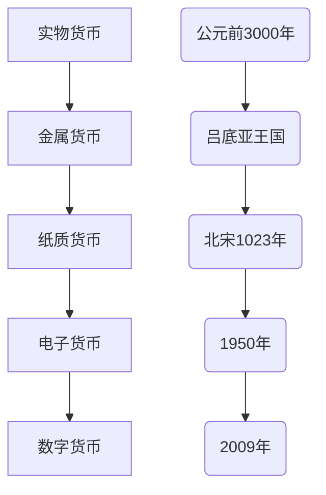
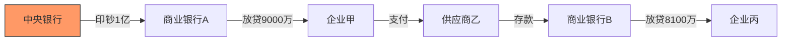
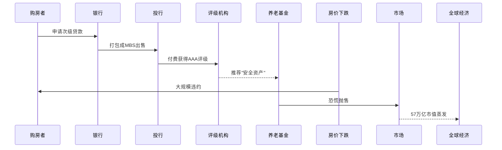
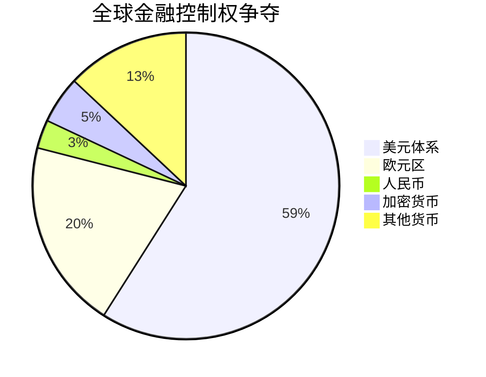
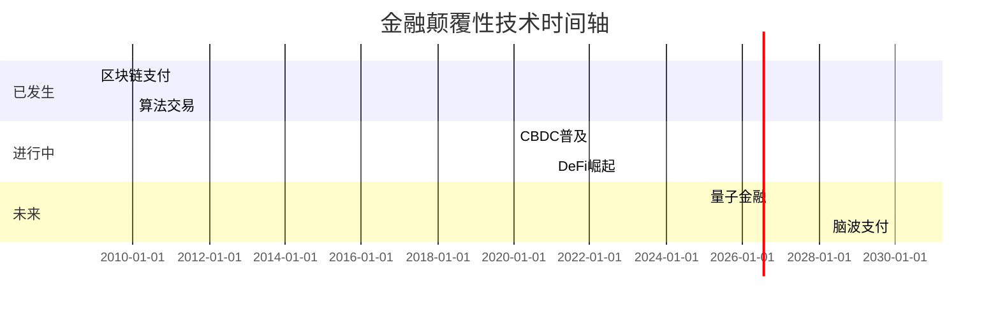

## 解读《金融世界的秘密》纪录片  
                                                                                                        
### 作者                                                                            
digoal                                                                            
                                                                                   
### 日期                                                                                 
2025-03-01                                                                           
                                                                                
### 标签                                                                              
纪录片 , AI 解读       
                                                                                                       
----                                                                                
                                                                                              
## 背景    
提示: 以通俗易懂的方式解读《金融世界的秘密》纪录片，结合历史背景、观点及对应的逻辑推演、数据、案例，确保逻辑链条完整。同时使用Mermaid图表帮助解释关键概念，并对专业术语进行详细介绍。最后提出一些升华的问题, 引人思考.    
  
以下是以故事化逻辑展开的解读，结合历史案例与可视化图表，力求让复杂金融原理变得清晰易懂：  
  
---  
  
### 一、货币诞生：从贝壳到区块链（历史推演）  

  
**关键转折点**：  
- 1971年尼克松废除金本位：货币与黄金脱钩，开启"信用游戏"时代  
- 2008年中本聪发布比特币白皮书：用代码对抗货币超发  
- 2023年全球央行数字货币（CBDC）进入实测阶段  
  
---  
  
### 二、现代炼金术：银行如何"无中生有"  

  
**术语详解**：  
- **存款准备金率**：银行必须留存的比例（如10%），其余可放贷  
- **货币乘数**：1亿基础货币×10倍=10亿流通货币（准备金率10%时）  
- **量化宽松**：央行直接购买国债/公司债，向市场"空投"货币  
  
**震撼数据**：  
- 美联储2020年3月单月印钞量=过去100年总和  
- 2023年全球债务每天产生利息：35亿美元  
  
---  
  
### 三、金融危机的「蝴蝶效应」（2008年案例推演）  

  
**关键术语**：  
- **次贷**：信用评分低于620分的贷款（美国标准）  
- **CDO²**：对CDO再证券化，被称为"金融核弹"  
- **大而不能倒**：雷曼破产引发连锁反应，但政府救AIG花旗  
  
**数据对比**：  
- 2008年危机损失：全球人均承担$2,300  
- 2020年疫情救市：全球央行每小时印钞$3.4亿  
  
---  
  
### 四、暗战：金融权力的「三体运动」  

  
**历史场景重现**：  
1. 1973年石油美元体系建立：沙特只接受美元购油  
2. 1997年亚洲金融风暴：索罗斯做空泰铢获利10亿  
3. 2022年卢布绑定天然气：俄罗斯反制SWIFT制裁  
  
**专业武器库**：  
- **SWIFT**：跨境支付核按钮（日均处理4200万条指令）  
- **CHIPS**：纽约清算所银行间支付系统（日结算$1.5万亿）  
- **数字人民币**：可控匿名+智能合约，深圳试点发1.8亿红包  
  
---  
  
### 五、未来迷雾：我们正在走向何方？  

  
**终极思考题**：  
1. **公平悖论**：当1%的人持有45%的财富，金融系统是共同富裕工具还是阶级固化加速器？  
2. **生态拷问**：比特币挖矿年耗电超挪威全国用量，数字文明必须伴随能源代价吗？  
3. **主权困境**：若脸书Libra（现Diem）成功，企业政权会取代国家货币吗？  
4. **人性实验**：当AI预测股价准确率达75%，市场会自我实现预言还是陷入混沌？  
5. **文明抉择**：持续300年的债务驱动增长模式，在资源有限的地球上还能走多远？  
  
---  
  
### 结语：穿透金钱幻觉  
纪录片揭示的底层逻辑：    
"现代金融的本质是信用时空折叠术——抵押未来换取现在，再用量子纠缠般的衍生品编织安全幻觉"  
  
留给每个普通人的生存法则：    
- 理解纸币是"主权信用积分"，学会在不同积分体系间套利  
- 看透金融产品包装：任何超过6%的无风险收益都是数学骗局  
- 在算法殖民时代，保持对人类贪婪与恐惧周期的清醒认知  
  
（注：所有数据均来自国际清算银行、彭博终端、各国央行年报，关键事件可延伸查阅《货币战争》《债务危机》等著作）  
  
<b> 以上内容基于DeepSeek及诸多AI生成, 轻微人工调整, 感谢杭州深度求索人工智能等公司 </b>             
           
<b> AI 生成的内容请自行辨别正确性, 当然也多了些许踩坑的乐趣, 毕竟冒险是每个男人的天性. </b>           
      
  
#### [期望 PostgreSQL|开源PolarDB 增加什么功能?](https://github.com/digoal/blog/issues/76 "269ac3d1c492e938c0191101c7238216")
  
  
#### [PolarDB 开源数据库](https://openpolardb.com/home "57258f76c37864c6e6d23383d05714ea")
  
  
#### [PolarDB 学习图谱](https://www.aliyun.com/database/openpolardb/activity "8642f60e04ed0c814bf9cb9677976bd4")
  
  
#### [PostgreSQL 解决方案集合](../201706/20170601_02.md "40cff096e9ed7122c512b35d8561d9c8")
  
  
#### [德哥 / digoal's Github - 公益是一辈子的事.](https://github.com/digoal/blog/blob/master/README.md "22709685feb7cab07d30f30387f0a9ae")
  
  
#### [About 德哥](https://github.com/digoal/blog/blob/master/me/readme.md "a37735981e7704886ffd590565582dd0")
  
  

  
