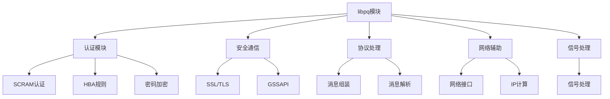
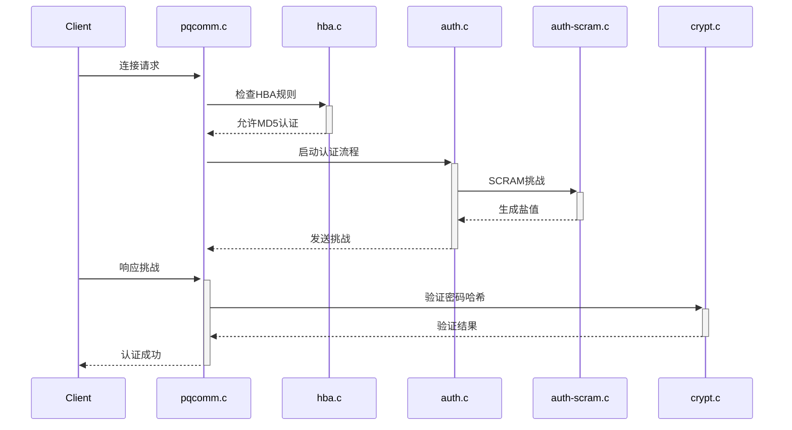
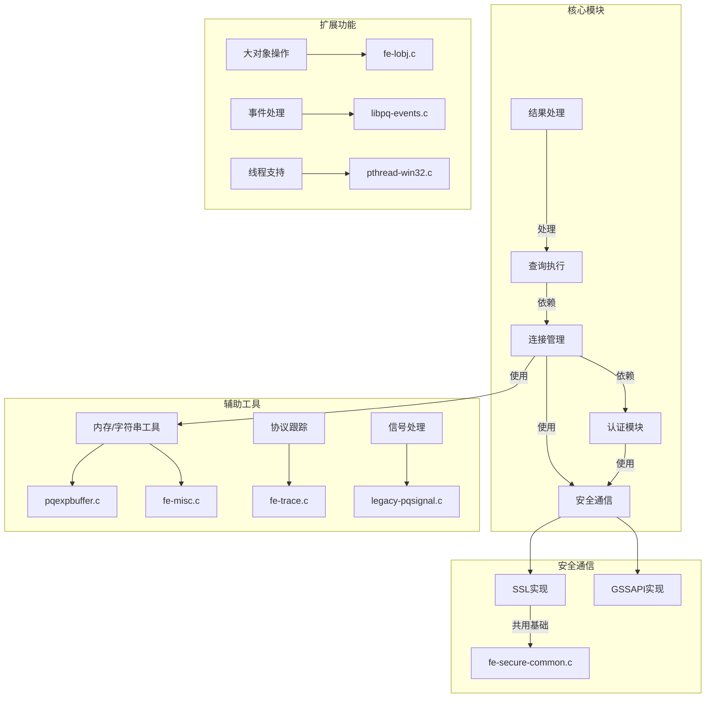
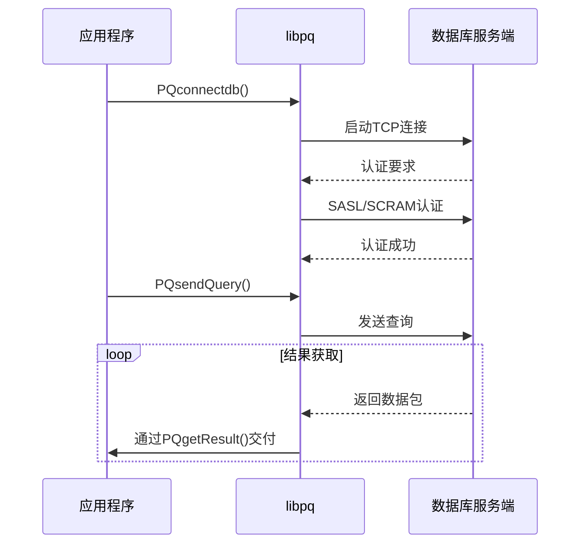
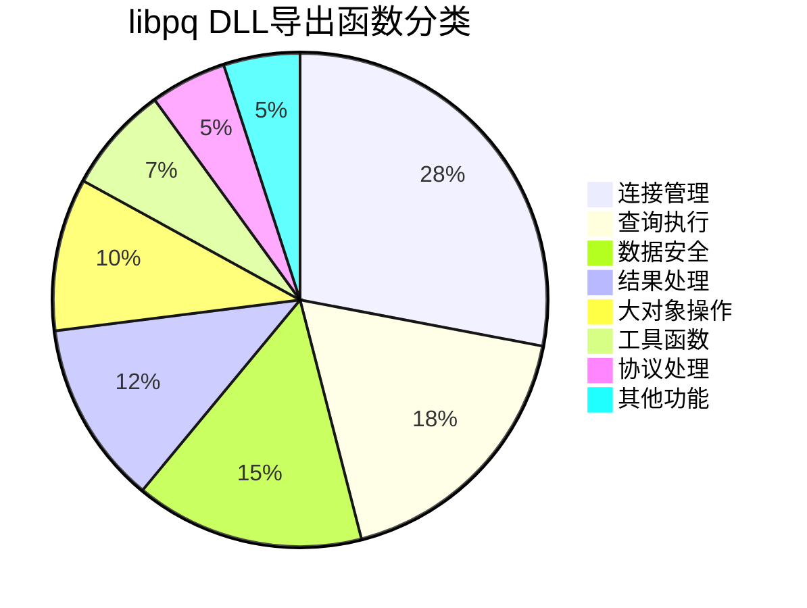

## AI辅助 PolarDB内核学习 - 7 libpq代码总览    
    
### 作者    
digoal    
    
### 日期    
2025-03-03    
    
### 标签    
PostgreSQL , PolarDB , DuckDB , AI , 内核 , 学习 , libpq     
    
----    
    
## 背景    
`libpq` 的代码分为前端（客户端）和后端（服务器端）两个部分，分别位于：  
  
*   **前端（客户端）：** `src/interfaces/libpq/`  
*   **后端（服务器端）：** `src/backend/libpq/`  
  
这种分离的设计使得客户端和服务器端可以独立地进行开发和维护，同时也提高了代码的可移植性和可扩展性。  
  
**前端 `libpq` (`src/interfaces/libpq/`)**  
  
*   **作用：** 提供客户端应用程序连接、查询和管理 PostgreSQL 数据库的接口。  
*   **目标用户：** 客户端应用程序开发人员。  
*   **主要功能：**  
    *   建立与 PostgreSQL 服务器的连接。  
    *   发送 SQL 查询到服务器。  
    *   接收服务器返回的查询结果。  
    *   处理连接错误和查询错误。  
    *   支持 SSL/TLS 加密连接。  
    *   支持各种认证方法。  
*   **关键文件：**  
    *   `libpq.h`：`libpq` 库的头文件，定义了客户端应用程序可以使用的函数和数据结构。  
    *   `fe-connect.c`：连接到 PostgreSQL 服务器的代码。  
    *   `fe-exec.c`：执行 SQL 查询的代码。  
    *   `fe-fetch.c`：获取查询结果的代码。  
    *   `fe-secure.c`：客户端安全认证相关代码，例如 SSL/TLS 支持。  
  
**后端 `libpq` (`src/backend/libpq/`)**  
  
*   **作用：** 处理客户端连接、认证、安全通信和数据传输。  
*   **目标用户：** PostgreSQL 服务器开发人员。  
*   **主要功能：**  
    *   接收客户端连接请求。  
    *   对客户端进行身份验证。  
    *   建立安全通信通道（例如，使用 SSL/TLS）。  
    *   接收客户端发送的 SQL 查询。  
    *   将查询结果发送回客户端。  
    *   处理连接错误和查询错误。  
*   **关键文件：**  
    *   `auth.c`：通用的认证框架代码。  
    *   `hba.c`：主机认证 (Host-Based Authentication) 功能。  
    *   `pqcomm.c`：客户端和服务器之间通信相关的函数。  
    *   `pqformat.c`：用于格式化和解析 PostgreSQL 数据类型的函数。  
    *   `be-secure.c`：安全认证相关的接口和通用函数。  
  
**总结**  
  
前端 `libpq` 负责客户端应用程序与 PostgreSQL 服务器的交互，后端 `libpq` 负责处理客户端连接、认证和数据传输。 这两个部分共同构成了完整的 `libpq` 接口，使得客户端应用程序可以安全可靠地连接到 PostgreSQL 数据库并执行操作。  
  
### 4. 总结  
  
- **前端（Frontend）**：位于 `src/interfaces/libpq`，负责与客户端应用程序交互，提供 API 接口，管理连接，处理请求和结果。  
- **后端（Backend）**：位于 `src/backend`，负责与 PostgreSQL 服务器通信，处理协议、认证、查询执行等底层逻辑。  
- **交互**：前端和后端通过 PostgreSQL 协议进行通信，前端发送请求，后端处理请求并返回结果。  
  
这种划分使得 `libpq` 的代码结构清晰，职责分离，便于维护和扩展。作为初学者，理解这种划分有助于你更好地掌握 `libpq` 的工作原理和代码组织。  
  
## 一、libpq 后端代码学习  
以下是对 `src/backend/libpq` 目录代码的详细解读，结合Mermaid图表辅助理解：  
  
### 目录结构概览  
该目录主要负责PostgreSQL/PolarDB的网络通信、认证、加密和协议处理。主要模块划分如下：  
  

  
### 1. 认证模块  
#### 核心文件：  
- **auth-scram.c**：实现SCRAM-SHA-256认证  
  ```c  
  // 示例流程：  
  client → 发送SCRAM请求 → 服务端生成挑战 →   
  client响应 → 服务端验证 → 认证成功/失败  
  ```  
  - 处理SASLprep规范化  
  - 使用RFC 5802/7677规范  
  - 防探测攻击（伪造盐值）  
  
- **hba.c**：主机基认证规则处理  
  ```mermaid  
  graph LR  
    HBA规则文件 --> 解析规则 --> 匹配客户端IP/认证方式 --> 允许/拒绝连接  
  ```  
  - 加载`pg_hba.conf`  
  - 支持多种认证方法（如trust、md5、cert等）  
  
- **crypt.c**：密码存储加密  
  - 处理`pg_authid.rolpassword`  
  - 支持MD5、SCRAM-SHA-256加密方式  
  
### 2. 安全通信  
#### 核心文件：  
- **be-secure-openssl.c**：OpenSSL实现  
  ```c  
  // SSL握手流程：  
  客户端发起SSL请求 → 服务端发送'S' →   
  协商加密套件 → 完成TLS握手 → 后续通信加密  
  ```  
  - 支持Perfect Forward Secrecy（通过Ephemeral DH）  
  - 证书验证逻辑  
  
- **be-secure-common.c**：SSL公共逻辑  
  - 管理SSL上下文  
  - 证书加载/验证公共代码  
  
### 3. 协议处理  
#### 核心文件：  
- **pqcomm.c**：通信基础  
  ```mermaid  
  sequenceDiagram  
    前端->>后端: 发送消息  
    后端->>前端: 响应消息  
    后端->>pqcomm.c: pq_getbytes/pq_putmessage  
  ```  
  - 关键函数：  
    - `StreamServerPort()`：监听端口  
    - `pq_getmessage()`：读取完整消息  
    - `pq_flush()`：强制发送缓冲区数据  
  
- **pqformat.c**：消息格式化  
  ```c  
  // 消息组装示例：  
  pq_beginmessage(&buf, 'T');  // 开始消息'T'  
  pq_sendint(&buf, 123, 4);     // 添加4字节整数  
  pq_endmessage(&buf);          // 发送  
  ```  
  - 数据类型转换（如网络字节序）  
  - 防御缓冲区溢出  
  
### 4. 网络辅助模块  
- **ifaddr.c**：IP地址计算  
  - 计算网络掩码  
  - 枚举服务器网络接口  
- **polar_network_stats.c**：PolarDB网络统计  
  - 监控连接数/流量  
  - 基于Apache License 2.0的自定义扩展  
  
### 5. 其他关键文件  
- **pqsignal.c**：信号处理  
  - 处理中断信号（如SIGTERM）  
  - 保证事务回滚的原子性  
- **pqmq.c**：共享内存队列通信  
  - 用于并行查询的进程间通信  
  
### 模块协作示例  

  
### 学习建议  
1. **从pqcomm.c入手**：理解消息收发的基础流程  
2. **调试认证流程**：跟踪auth-scram.c的`scram_authenticate()`函数  
3. 使用Wireshark分析SSL握手过程（需配置`pg_hba.conf`启用SSL）  
4. 阅读RFC 5802辅助理解SCRAM实现  
  
关键数据结构：  
- `Port`（pqcomm.c）：保存连接状态  
- `StringInfo`（pqformat.c）：消息缓冲区  
- `hbafile`（hba.c）：HBA规则链表  
  
## 二、libpq 前端代码学习  
  
`Makefile` 中明确指出这是 "libpq subsystem (backend half of libpq interface)" 的 Makefile。 这意味着 `libpq` 接口的另一半是客户端部分。  
  
客户端 `libpq` 的代码位于 PostgreSQL 源代码树的 **`src/interfaces/libpq/`** 目录中。  
  
这个目录包含了客户端应用程序用来连接、查询和管理 PostgreSQL 数据库的函数和数据结构。  
  
**`src/interfaces/libpq/` 目录中的一些关键文件包括：**  
  
*   **`libpq.h`**:  `libpq` 库的头文件，定义了客户端应用程序可以使用的函数和数据结构。  
*   **`fe-auth-sasl.c`**: 客户端 SASL 认证相关代码  
*   **`fe-connect.c`**:  连接到 PostgreSQL 服务器的代码。  
*   **`fe-exec.c`**:  执行 SQL 查询的代码。  
*   **`fe-lobj.c`**:  处理大对象 (LOB) 的代码。  
*   **`fe-print.c`**:  格式化查询结果的代码。  
*   **`fe-secure.c`**:  客户端安全认证相关代码，例如 SSL/TLS 支持。  
*   **`fe-protocol3.c`**:  实现了 PostgreSQL 协议版本 3 的客户端部分。  
*   **`pqexpbuffer.c`**:  动态字符串缓冲区管理。  
*   **`pqsignal.c`**: 客户端信号处理。  
  
**总结:**  
  
*   **`src/backend/libpq/`**:  服务器端 `libpq` 代码，负责处理客户端连接、认证和通信。  
*   **`src/interfaces/libpq/`**:  客户端 `libpq` 代码，提供客户端应用程序连接、查询和管理 PostgreSQL 数据库的接口。  
  
这两个目录共同构成了完整的 `libpq` 接口，允许客户端应用程序与 PostgreSQL 服务器进行交互。  
  
---  
  
<b> 什么时候使用src/interfaces/libpq/这里的代码? </b>   
  
`src/interfaces/libpq/` 目录中的代码在以下情况下使用：  
  
1.  **客户端应用程序连接到 PostgreSQL 数据库时：**  
  
    *   任何需要连接到 PostgreSQL 数据库的应用程序（例如，用 C、C++、Python、Java 等编写的程序）都会使用 `src/interfaces/libpq/` 中的代码。  
    *   这些应用程序会包含 `libpq.h` 头文件，并调用 `libpq` 库中的函数来建立连接、发送查询、接收结果和处理错误。  
    *   例如，一个用 C 编写的程序可以使用 `PQconnectdb()` 函数来连接到数据库，使用 `PQexec()` 函数来执行 SQL 查询，并使用 `PQfetch()` 函数来获取查询结果。  
  
2.  **开发 PostgreSQL 客户端库或驱动程序时：**  
  
    *   如果你正在开发一个新的 PostgreSQL 客户端库或驱动程序（例如，为新的编程语言或框架创建驱动程序），你需要使用 `src/interfaces/libpq/` 中的代码。  
    *   你需要了解 `libpq` 的 API 和协议，并使用 `src/interfaces/libpq/` 中的代码来实现客户端库或驱动程序的功能。  
  
3.  **使用 `psql` 命令行工具时：**  
  
    *   `psql` 是 PostgreSQL 自带的命令行客户端工具，用于连接到数据库并执行 SQL 命令。  
    *   `psql` 内部使用了 `src/interfaces/libpq/` 中的代码来实现与 PostgreSQL 服务器的通信。  
  
4.  **使用其他基于 `libpq` 的工具时：**  
  
    *   许多 PostgreSQL 工具和应用程序都是基于 `libpq` 库构建的。  
    *   例如，一些图形化的 PostgreSQL 管理工具、数据迁移工具和备份工具等，都可能使用 `libpq` 库来实现与 PostgreSQL 服务器的交互。  
  
**总结:**  
  
只要你需要编写一个程序或工具来连接到 PostgreSQL 数据库并执行操作，你就需要使用 `src/interfaces/libpq/` 目录中的代码。 它是 PostgreSQL 客户端编程的基础。 简单来说，任何客户端程序需要和Postgresql数据库交互，就需要使用这个目录下的代码。  
  
---   
  
以下是对PolarDB-PG的`src/interfaces/libpq`目录代码结构的解读，使用mermaid图表辅助说明：  
  

  
### 详细解读：  
  
1. **核心流程模块**（蓝色部分）  
- `fe-connect.c`：连接生命周期的核心管理  
  - 处理连接字符串解析（如`PQconnectdb`）  
  - 实现非阻塞连接（`PQconnectStart/PQconnectPoll`）  
  - 维护连接状态机  
- `fe-exec.c`：查询执行的核心逻辑  
  - 实现同步查询（`PQexec`）和异步查询（`PQsendQuery`）  
  - 处理结果集的分批获取（`PQgetResult`）  
- `fe-protocol3.c`：协议V3的具体实现  
  - 处理消息格式解析/打包  
  - 与后端协议版本兼容性处理  
  
2. **认证模块**（橙色部分）  
- `fe-auth.c`：认证主入口  
  - 支持多种认证方式（MD5、SASL等）  
  - 根据服务器要求切换认证方式  
- `fe-auth-scram.c`：SCRAM-SHA-256实现  
  - 包含客户端证明计算  
  - 遵循RFC 5802标准  
  
3. **安全通信层**（绿色部分）  
- `fe-secure-openssl.c`：OpenSSL的具体集成  
  - SSL/TLS连接初始化  
  - 证书验证逻辑  
- `fe-secure-gssapi.c`：GSSAPI实现  
  - Kerberos认证支持  
- `fe-secure-common.c`：安全模块公共基础  
  - 密码处理通用函数  
  - 错误处理通用逻辑  
  
4. **辅助工具模块**（紫色部分）  
- `pqexpbuffer.c`：动态字符串处理  
  ```c  
  typedef struct PQExpBufferData {  
      char*   data;  
      size_t  len;  
      size_t  maxlen;  
  } PQExpBufferData;  
  ```  
  提供类似StringBuffer的功能，用于安全构建查询字符串  
- `fe-misc.c`：网络I/O基础功能  
  - 带缓冲的读写操作（`pqGetnchar`/`pqPutnchar`）  
  - 非阻塞模式下的数据消费  
  
5. **扩展功能模块**（粉色部分）  
- `fe-lobj.c`：大对象客户端API  
  - 实现`lo_open/lo_read/lo_write`等函数  
  - 与服务器端大对象存储交互  
- `libpq-events.c`：事件通知机制  
  - 允许应用注册连接/结果集生命周期事件处理器  
  
### 典型调用流程示例：  

  
### 学习建议路线：  
1. 从`fe-connect.c`理解连接建立过程  
2. 研究`fe-exec.c`中的查询执行生命周期  
3. 通过`fe-auth-scram.c`学习现代认证协议实现  
4. 使用`fe-trace.c`进行协议级调试  
5. 通过`pqexpbuffer.c`学习安全的内存管理技巧  
  
这个实现体现了典型数据库驱动程序的架构设计，模块之间通过清晰的接口解耦，同时保持了处理多种协议版本和安全需求的能力。  
  
---   
  
以下是对 `src/interfaces/libpq/exports.txt` 文件的详细解释，用通俗易懂的方式说明其作用和内容：  
  

  
### 文件作用解析  
这是 **Windows DLL 的导出清单**，类似图书馆的"借阅目录"，作用相当于：  
1. **功能公示**：声明哪些函数可以被外部程序调用  
2. **二进制兼容**：固定函数导出序号（如 PQconnectdb=1）  
3. **构建控制**：指导编译生成 DLL 时的符号导出  
  
### 文件内容解读  
文件中的每行格式为：`函数名 + 序号`（共 186 个导出项）  
  
#### 典型函数分类  
| 分类         | 示例函数                          | 作用说明                     |  
|--------------|-----------------------------------|------------------------------|  
| 连接管理     | PQconnectdb, PQreset             | 创建/重置数据库连接          |  
| 查询执行     | PQexec, PQsendQuery              | 发送 SQL 查询                |  
| 结果处理     | PQgetvalue, PQntuples            | 获取查询结果数据             |  
| 安全认证     | PQencryptPasswordConn            | 密码加密处理                 |  
| 大对象操作   | lo_read, lo_write                | 操作二进制大对象             |  
| 错误处理     | PQerrorMessage                   | 获取错误信息                 |  
| 协议控制     | PQenterPipelineMode              | 管理流水线协议模式           |  
| 工具函数     | pg_char_to_encoding              | 字符集编码转换               |  
  
#### 重点函数示例  
```c  
// 连接建立（序号1）  
PGconn *PQconnectdb(const char *conninfo);  
  
// 简单查询执行（序号21）  
PGresult *PQexec(PGconn *conn, const char *command);  
  
// 获取结果数据（序号45）  
char *PQgetvalue(const PGresult *res, int row_num, int column_num);  
  
// SSL 状态检查（序号166）  
int PQsslInUse(PGconn *conn);  
```  
  
### 技术实现原理  
在 Windows 平台构建时，该文件会转换为 `.def` 文件参与链接，例如：  
```def  
EXPORTS  
PQconnectdb @1  
PQsetdbLogin @2  
...  
```  
生成类似这样的 DLL 导出表：  
```  
Address     Ordinal  Name  
00001000      1      PQconnectdb  
00002000      2      PQsetdbLogin  
...  
```  
  
### 跨平台差异  
| 平台      | 实现方式                     | 特点                          |  
|-----------|------------------------------|-------------------------------|  
| Windows   | 通过 exports.txt 生成 .def   | 严格需要序号管理               |  
| Linux/macOS | 使用 __attribute__((visibility)) | 通过编译器属性控制可见性       |  
  
### 学习建议  
1. 结合 `libpq-fe.h` 头文件查看函数原型  
2. 使用 `nm -D libpq.so`（Linux）或 `dumpbin /EXPORTS libpq.dll`（Windows）查看实际导出  
3. 重点关注连接生命周期管理（PQconnectdb → PQfinish）和查询处理流程（PQsendQuery → PQgetResult）  
  
这个文件本质上定义了 libpq 的 **公共 API 边界**，是客户端程序与数据库通信的桥梁。每个导出函数都对应着 PostgreSQL 客户端协议的一个具体功能实现点。  
  
## 提示  
1、后端libpq代码  
````  
PolarDB for PostgreSQL 源码 src/backend/libpq 这个目录中有如下文件  
```  
Makefile  
README.SSL  
auth-sasl.c  
auth-scram.c  
auth.c  
be-fsstubs.c  
be-gssapi-common.c  
be-secure-common.c  
be-secure-gssapi.c  
be-secure-openssl.c  
be-secure.c  
crypt.c  
hba.c  
ifaddr.c  
pg_hba.conf.sample  
pg_ident.conf.sample  
polar_network_stats.c  
pqcomm.c  
pqformat.c  
pqmq.c  
pqsignal.c  
```  
以下是一部分文件的注释  
```  
#-------------------------------------------------------------------------  
#  
# Makefile--  
#    Makefile for libpq subsystem (backend half of libpq interface)  
#  
# IDENTIFICATION  
#    src/backend/libpq/Makefile  
#  
#-------------------------------------------------------------------------  
  
src/backend/libpq/README.SSL  
  
SSL  
===  
  
>From the servers perspective:  
  
  
  Receives StartupPacket  
           |  
           |  
 (Is SSL_NEGOTIATE_CODE?) -----------  Normal startup  
           |                  No  
           |  
           | Yes  
           |  
           |  
 (Server compiled with USE_SSL?) ------- Send 'N'  
           |                       No        |  
           |                                 |  
           | Yes                         Normal startup  
           |  
           |  
        Send 'S'  
           |  
           |  
      Establish SSL  
           |  
           |  
      Normal startup  
  
  
  
  
  
>From the clients perspective (v6.6 client _with_ SSL):  
  
  
      Connect  
         |  
         |  
  Send packet with SSL_NEGOTIATE_CODE  
         |  
         |  
  Receive single char  ------- 'S' -------- Establish SSL  
         |                                       |  
         | '<else>'                              |  
         |                                  Normal startup  
         |  
         |  
   Is it 'E' for error  ------------------- Retry connection  
         |                  Yes             without SSL  
         | No  
         |  
   Is it 'N' for normal ------------------- Normal startup  
         |                  Yes  
         |  
   Fail with unknown  
  
---------------------------------------------------------------------------  
  
Ephemeral DH  
============  
  
Since the server static private key ($DataDir/server.key) will  
normally be stored unencrypted so that the database backend can  
restart automatically, it is important that we select an algorithm  
that continues to provide confidentiality even if the attacker has the  
server's private key.  Ephemeral DH (EDH) keys provide this and more  
(Perfect Forward Secrecy aka PFS).  
  
N.B., the static private key should still be protected to the largest  
extent possible, to minimize the risk of impersonations.  
  
Another benefit of EDH is that it allows the backend and clients to  
use DSA keys.  DSA keys can only provide digital signatures, not  
encryption, and are often acceptable in jurisdictions where RSA keys  
are unacceptable.  
  
The downside to EDH is that it makes it impossible to use ssldump(1)  
if there's a problem establishing an SSL session.  In this case you'll  
need to temporarily disable EDH (see initialize_dh()).  
  
/*-------------------------------------------------------------------------  
 *  
 * auth-scram.c  
 *        Server-side implementation of the SASL SCRAM-SHA-256 mechanism.  
 *  
 * See the following RFCs for more details:  
 * - RFC 5802: https://tools.ietf.org/html/rfc5802  
 * - RFC 5803: https://tools.ietf.org/html/rfc5803  
 * - RFC 7677: https://tools.ietf.org/html/rfc7677  
 *  
 * Here are some differences:  
 *  
 * - Username from the authentication exchange is not used. The client  
 *       should send an empty string as the username.  
 *  
 * - If the password isn't valid UTF-8, or contains characters prohibited  
 *       by the SASLprep profile, we skip the SASLprep pre-processing and use  
 *       the raw bytes in calculating the hash.  
 *  
 * - If channel binding is used, the channel binding type is always  
 *       "tls-server-end-point".  The spec says the default is "tls-unique"  
 *       (RFC 5802, section 6.1. Default Channel Binding), but there are some  
 *       problems with that.  Firstly, not all SSL libraries provide an API to  
 *       get the TLS Finished message, required to use "tls-unique".  Secondly,  
 *       "tls-unique" is not specified for TLS v1.3, and as of this writing,  
 *       it's not clear if there will be a replacement.  We could support both  
 *       "tls-server-end-point" and "tls-unique", but for our use case,  
 *       "tls-unique" doesn't really have any advantages.  The main advantage  
 *       of "tls-unique" would be that it works even if the server doesn't  
 *       have a certificate, but PostgreSQL requires a server certificate  
 *       whenever SSL is used, anyway.  
 *  
 *  
 * The password stored in pg_authid consists of the iteration count, salt,  
 * StoredKey and ServerKey.  
 *  
 * SASLprep usage  
 * --------------  
 *  
 * One notable difference to the SCRAM specification is that while the  
 * specification dictates that the password is in UTF-8, and prohibits  
 * certain characters, we are more lenient.  If the password isn't a valid  
 * UTF-8 string, or contains prohibited characters, the raw bytes are used  
 * to calculate the hash instead, without SASLprep processing.  This is  
 * because PostgreSQL supports other encodings too, and the encoding being  
 * used during authentication is undefined (client_encoding isn't set until  
 * after authentication).  In effect, we try to interpret the password as  
 * UTF-8 and apply SASLprep processing, but if it looks invalid, we assume  
 * that it's in some other encoding.  
 *  
 * In the worst case, we misinterpret a password that's in a different  
 * encoding as being Unicode, because it happens to consists entirely of  
 * valid UTF-8 bytes, and we apply Unicode normalization to it.  As long  
 * as we do that consistently, that will not lead to failed logins.  
 * Fortunately, the UTF-8 byte sequences that are ignored by SASLprep  
 * don't correspond to any commonly used characters in any of the other  
 * supported encodings, so it should not lead to any significant loss in  
 * entropy, even if the normalization is incorrectly applied to a  
 * non-UTF-8 password.  
 *  
 * Error handling  
 * --------------  
 *  
 * Don't reveal user information to an unauthenticated client.  We don't  
 * want an attacker to be able to probe whether a particular username is  
 * valid.  In SCRAM, the server has to read the salt and iteration count  
 * from the user's stored secret, and send it to the client.  To avoid  
 * revealing whether a user exists, when the client tries to authenticate  
 * with a username that doesn't exist, or doesn't have a valid SCRAM  
 * secret in pg_authid, we create a fake salt and iteration count  
 * on-the-fly, and proceed with the authentication with that.  In the end,  
 * we'll reject the attempt, as if an incorrect password was given.  When  
 * we are performing a "mock" authentication, the 'doomed' flag in  
 * scram_state is set.  
 *  
 * In the error messages, avoid printing strings from the client, unless  
 * you check that they are pure ASCII.  We don't want an unauthenticated  
 * attacker to be able to spam the logs with characters that are not valid  
 * to the encoding being used, whatever that is.  We cannot avoid that in  
 * general, after logging in, but let's do what we can here.  
 *  
 *  
 * Portions Copyright (c) 1996-2022, PostgreSQL Global Development Group  
 * Portions Copyright (c) 1994, Regents of the University of California  
 *  
 * src/backend/libpq/auth-scram.c  
 *  
 *-------------------------------------------------------------------------  
 */   
  
/*-------------------------------------------------------------------------  
 *  
 * auth.c  
 *        Routines to handle network authentication  
 *  
 * Portions Copyright (c) 1996-2022, PostgreSQL Global Development Group  
 * Portions Copyright (c) 1994, Regents of the University of California  
 *  
 *  
 * IDENTIFICATION  
 *        src/backend/libpq/auth.c  
 *  
 *-------------------------------------------------------------------------  
 */  
  
/*-------------------------------------------------------------------------  
 *  
 * be-secure-common.c  
 *  
 * common implementation-independent SSL support code  
 *  
 * While be-secure.c contains the interfaces that the rest of the  
 * communications code calls, this file contains support routines that are  
 * used by the library-specific implementations such as be-secure-openssl.c.  
 *  
 * Portions Copyright (c) 1996-2022, PostgreSQL Global Development Group  
 * Portions Copyright (c) 1994, Regents of the University of California  
 *  
 * IDENTIFICATION  
 *        src/backend/libpq/be-secure-common.c  
 *  
 *-------------------------------------------------------------------------  
 */  
  
/*-------------------------------------------------------------------------  
 *  
 * be-secure-openssl.c  
 *        functions for OpenSSL support in the backend.  
 *  
 *  
 * Portions Copyright (c) 1996-2022, PostgreSQL Global Development Group  
 * Portions Copyright (c) 1994, Regents of the University of California  
 *  
 *  
 * IDENTIFICATION  
 *        src/backend/libpq/be-secure-openssl.c  
 *  
 *-------------------------------------------------------------------------  
 */  
  
/*-------------------------------------------------------------------------  
 *  
 * be-secure.c  
 *        functions related to setting up a secure connection to the frontend.  
 *        Secure connections are expected to provide confidentiality,  
 *        message integrity and endpoint authentication.  
 *  
 *  
 * Portions Copyright (c) 1996-2022, PostgreSQL Global Development Group  
 * Portions Copyright (c) 1994, Regents of the University of California  
 *  
 *  
 * IDENTIFICATION  
 *        src/backend/libpq/be-secure.c  
 *  
 *-------------------------------------------------------------------------  
 */  
  
/*-------------------------------------------------------------------------  
 *  
 * crypt.c  
 *        Functions for dealing with encrypted passwords stored in  
 *        pg_authid.rolpassword.  
 *  
 * Portions Copyright (c) 1996-2022, PostgreSQL Global Development Group  
 * Portions Copyright (c) 1994, Regents of the University of California  
 *  
 * src/backend/libpq/crypt.c  
 *  
 *-------------------------------------------------------------------------  
 */  
  
/*-------------------------------------------------------------------------  
 *  
 * hba.c  
 *        Routines to handle host based authentication (that's the scheme  
 *        wherein you authenticate a user by seeing what IP address the system  
 *        says he comes from and choosing authentication method based on it).  
 *  
 * Portions Copyright (c) 1996-2022, PostgreSQL Global Development Group  
 * Portions Copyright (c) 1994, Regents of the University of California  
 *  
 *  
 * IDENTIFICATION  
 *        src/backend/libpq/hba.c  
 *  
 *-------------------------------------------------------------------------  
 */  
  
/*-------------------------------------------------------------------------  
 *  
 * ifaddr.c  
 *        IP netmask calculations, and enumerating network interfaces.  
 *  
 * Portions Copyright (c) 1996-2022, PostgreSQL Global Development Group  
 * Portions Copyright (c) 1994, Regents of the University of California  
 *  
 *  
 * IDENTIFICATION  
 *        src/backend/libpq/ifaddr.c  
 *  
 * This file and the IPV6 implementation were initially provided by  
 * Nigel Kukard <nkukard@lbsd.net>, Linux Based Systems Design  
 * http://www.lbsd.net.  
 *  
 *-------------------------------------------------------------------------  
 */  
  
/*-------------------------------------------------------------------------  
 *  
 * polar_network_stats.c  
 *        network monitor for PolarDB  
 *  
 * Copyright (c) 2022, Alibaba Group Holding Limited  
 *  
 * Licensed under the Apache License, Version 2.0 (the "License");  
 * you may not use this file except in compliance with the License.  
 * You may obtain a copy of the License at  
 *  
 * http://www.apache.org/licenses/LICENSE-2.0  
 *  
 * Unless required by applicable law or agreed to in writing, software  
 * distributed under the License is distributed on an "AS IS" BASIS,  
 * WITHOUT WARRANTIES OR CONDITIONS OF ANY KIND, either express or implied.  
 * See the License for the specific language governing permissions and  
 * limitations under the License.  
 *  
 * IDENTIFICATION  
 *        src/backend/libpq/polar_network_stats.c  
 *  
 *-------------------------------------------------------------------------  
 */  
  
/*-------------------------------------------------------------------------  
 *  
 * pqcomm.c  
 *        Communication functions between the Frontend and the Backend  
 *  
 * These routines handle the low-level details of communication between  
 * frontend and backend.  They just shove data across the communication  
 * channel, and are ignorant of the semantics of the data.  
 *  
 * To emit an outgoing message, use the routines in pqformat.c to construct  
 * the message in a buffer and then emit it in one call to pq_putmessage.  
 * There are no functions to send raw bytes or partial messages; this  
 * ensures that the channel will not be clogged by an incomplete message if  
 * execution is aborted by ereport(ERROR) partway through the message.  
 *  
 * At one time, libpq was shared between frontend and backend, but now  
 * the backend's "backend/libpq" is quite separate from "interfaces/libpq".  
 * All that remains is similarities of names to trap the unwary...  
 *  
 * Portions Copyright (c) 1996-2022, PostgreSQL Global Development Group  
 * Portions Copyright (c) 1994, Regents of the University of California  
 *  
 *      src/backend/libpq/pqcomm.c  
 *  
 *-------------------------------------------------------------------------  
 */  
  
/*------------------------  
 * INTERFACE ROUTINES  
 *  
 * setup/teardown:  
 *              StreamServerPort        - Open postmaster's server port  
 *              StreamConnection        - Create new connection with client  
 *              StreamClose                     - Close a client/backend connection  
 *              TouchSocketFiles        - Protect socket files against /tmp cleaners  
 *              pq_init                 - initialize libpq at backend startup  
 *              socket_comm_reset       - reset libpq during error recovery  
 *              socket_close            - shutdown libpq at backend exit  
 *  
 * low-level I/O:  
 *              pq_getbytes             - get a known number of bytes from connection  
 *              pq_getmessage   - get a message with length word from connection  
 *              pq_getbyte              - get next byte from connection  
 *              pq_peekbyte             - peek at next byte from connection  
 *              pq_flush                - flush pending output  
 *              pq_flush_if_writable - flush pending output if writable without blocking  
 *              pq_getbyte_if_available - get a byte if available without blocking  
 *  
 * message-level I/O  
 *              pq_putmessage   - send a normal message (suppressed in COPY OUT mode)  
 *              pq_putmessage_noblock - buffer a normal message (suppressed in COPY OUT)  
 *  
 *------------------------  
 */  
  
  
/*-------------------------------------------------------------------------  
 *  
 * pqformat.c  
 *              Routines for formatting and parsing frontend/backend messages  
 *  
 * Outgoing messages are built up in a StringInfo buffer (which is expansible)  
 * and then sent in a single call to pq_putmessage.  This module provides data  
 * formatting/conversion routines that are needed to produce valid messages.  
 * Note in particular the distinction between "raw data" and "text"; raw data  
 * is message protocol characters and binary values that are not subject to  
 * character set conversion, while text is converted by character encoding  
 * rules.  
 *  
 * Incoming messages are similarly read into a StringInfo buffer, via  
 * pq_getmessage, and then parsed and converted from that using the routines  
 * in this module.  
 *  
 * These same routines support reading and writing of external binary formats  
 * (typsend/typreceive routines).  The conversion routines for individual  
 * data types are exactly the same, only initialization and completion  
 * are different.  
 *  
 *  
 * Portions Copyright (c) 1996-2022, PostgreSQL Global Development Group  
 * Portions Copyright (c) 1994, Regents of the University of California  
 *  
 *      src/backend/libpq/pqformat.c  
 *  
 *-------------------------------------------------------------------------  
 */  
/*  
 * INTERFACE ROUTINES  
 * Message assembly and output:  
 *              pq_beginmessage - initialize StringInfo buffer  
 *              pq_sendbyte             - append a raw byte to a StringInfo buffer  
 *              pq_sendint              - append a binary integer to a StringInfo buffer  
 *              pq_sendint64    - append a binary 8-byte int to a StringInfo buffer  
 *              pq_sendfloat4   - append a float4 to a StringInfo buffer  
 *              pq_sendfloat8   - append a float8 to a StringInfo buffer  
 *              pq_sendbytes    - append raw data to a StringInfo buffer  
 *              pq_sendcountedtext - append a counted text string (with character set conversion)  
 *              pq_sendtext             - append a text string (with conversion)  
 *              pq_sendstring   - append a null-terminated text string (with conversion)  
 *              pq_send_ascii_string - append a null-terminated text string (without conversion)  
 *              pq_endmessage   - send the completed message to the frontend  
 * Note: it is also possible to append data to the StringInfo buffer using  
 * the regular StringInfo routines, but this is discouraged since required  
 * character set conversion may not occur.  
 *  
 * typsend support (construct a bytea value containing external binary data):  
 *              pq_begintypsend - initialize StringInfo buffer  
 *              pq_endtypsend   - return the completed string as a "bytea*"  
 *  
 * Special-case message output:  
 *              pq_puttextmessage - generate a character set-converted message in one step  
 *              pq_putemptymessage - convenience routine for message with empty body  
 *  
 * Message parsing after input:  
 *              pq_getmsgbyte   - get a raw byte from a message buffer  
 *              pq_getmsgint    - get a binary integer from a message buffer  
 *              pq_getmsgint64  - get a binary 8-byte int from a message buffer  
 *              pq_getmsgfloat4 - get a float4 from a message buffer  
 *              pq_getmsgfloat8 - get a float8 from a message buffer  
 *              pq_getmsgbytes  - get raw data from a message buffer  
 *              pq_copymsgbytes - copy raw data from a message buffer  
 *              pq_getmsgtext   - get a counted text string (with conversion)  
 *              pq_getmsgstring - get a null-terminated text string (with conversion)  
 *              pq_getmsgrawstring - get a null-terminated text string - NO conversion  
 *              pq_getmsgend    - verify message fully consumed  
 */  
  
/*-------------------------------------------------------------------------  
 *  
 * pqmq.c  
 *        Use the frontend/backend protocol for communication over a shm_mq  
 *  
 * Portions Copyright (c) 1996-2022, PostgreSQL Global Development Group  
 * Portions Copyright (c) 1994, Regents of the University of California  
 *  
 *      src/backend/libpq/pqmq.c  
 *  
 *-------------------------------------------------------------------------  
 */  
  
/*-------------------------------------------------------------------------  
 *  
 * pqsignal.c  
 *        Backend signal(2) support (see also src/port/pqsignal.c)  
 *  
 * Portions Copyright (c) 1996-2022, PostgreSQL Global Development Group  
 * Portions Copyright (c) 1994, Regents of the University of California  
 *  
 *  
 * IDENTIFICATION  
 *        src/backend/libpq/pqsignal.c  
 *  
 * ------------------------------------------------------------------------  
 */                
```  
我是C语言初学者, 请结合我提供的文件注释内容, 向我详细解读这个目录的代码, 可以使用mermaid图表提高解释性.   
````  
  
2、前端libpq代码   
````  
PolarDB for PostgreSQL 源码 src/interfaces/libpq 这个目录中有如下文件  
```  
Makefile  
README  
exports.txt  
fe-auth-sasl.h  
fe-auth-scram.c  
fe-auth.c  
fe-auth.h  
fe-connect.c  
fe-exec.c  
fe-gssapi-common.c  
fe-gssapi-common.h  
fe-lobj.c  
fe-misc.c  
fe-print.c  
fe-protocol3.c  
fe-secure-common.c  
fe-secure-common.h  
fe-secure-gssapi.c  
fe-secure-openssl.c  
fe-secure.c  
fe-trace.c  
legacy-pqsignal.c  
libpq-events.c  
libpq-events.h  
libpq-fe.h  
libpq-int.h  
nls.mk  
pg_service.conf.sample  
po 目录   
pqexpbuffer.c  
pqexpbuffer.h  
pthread-win32.c  
t 目录   
test 目录   
win32.c  
win32.h  
```  
以下是一部分文件的注释  
```  
/*-------------------------------------------------------------------------  
 *  
 * fe-auth-scram.c  
 *         The front-end (client) implementation of SCRAM authentication.  
 *  
 * Portions Copyright (c) 1996-2022, PostgreSQL Global Development Group  
 * Portions Copyright (c) 1994, Regents of the University of California  
 *  
 * IDENTIFICATION  
 *        src/interfaces/libpq/fe-auth-scram.c  
 *  
 *-------------------------------------------------------------------------  
 */  
  
/*-------------------------------------------------------------------------  
 *  
 * fe-auth.c  
 *         The front-end (client) authorization routines  
 *  
 * Portions Copyright (c) 1996-2022, PostgreSQL Global Development Group  
 * Portions Copyright (c) 1994, Regents of the University of California  
 *  
 * IDENTIFICATION  
 *        src/interfaces/libpq/fe-auth.c  
 *  
 *-------------------------------------------------------------------------  
 */  
  
/*-------------------------------------------------------------------------  
 *  
 * fe-connect.c  
 *        functions related to setting up a connection to the backend  
 *  
 * Portions Copyright (c) 1996-2022, PostgreSQL Global Development Group  
 * Portions Copyright (c) 1994, Regents of the University of California  
 *  
 *  
 * IDENTIFICATION  
 *        src/interfaces/libpq/fe-connect.c  
 *  
 *-------------------------------------------------------------------------  
 */  
  
/*-------------------------------------------------------------------------  
 *  
 * fe-exec.c  
 *        functions related to sending a query down to the backend  
 *  
 * Portions Copyright (c) 1996-2022, PostgreSQL Global Development Group  
 * Portions Copyright (c) 1994, Regents of the University of California  
 *  
 *  
 * IDENTIFICATION  
 *        src/interfaces/libpq/fe-exec.c  
 *  
 *-------------------------------------------------------------------------  
 */  
  
/*-------------------------------------------------------------------------  
 *  
 * fe-lobj.c  
 *        Front-end large object interface  
 *  
 * Portions Copyright (c) 1996-2022, PostgreSQL Global Development Group  
 * Portions Copyright (c) 1994, Regents of the University of California  
 *  
 *  
 * IDENTIFICATION  
 *        src/interfaces/libpq/fe-lobj.c  
 *  
 *-------------------------------------------------------------------------  
 */  
  
/*-------------------------------------------------------------------------  
 *  
 *       FILE  
 *              fe-misc.c  
 *  
 *       DESCRIPTION  
 *               miscellaneous useful functions  
 *  
 * The communication routines here are analogous to the ones in  
 * backend/libpq/pqcomm.c and backend/libpq/pqformat.c, but operate  
 * in the considerably different environment of the frontend libpq.  
 * In particular, we work with a bare nonblock-mode socket, rather than  
 * a stdio stream, so that we can avoid unwanted blocking of the application.  
 *  
 * XXX: MOVE DEBUG PRINTOUT TO HIGHER LEVEL.  As is, block and restart  
 * will cause repeat printouts.  
 *  
 * We must speak the same transmitted data representations as the backend  
 * routines.  
 *  
 *  
 * Portions Copyright (c) 1996-2022, PostgreSQL Global Development Group  
 * Portions Copyright (c) 1994, Regents of the University of California  
 *  
 * IDENTIFICATION  
 *        src/interfaces/libpq/fe-misc.c  
 *  
 *-------------------------------------------------------------------------  
 */  
  
/*-------------------------------------------------------------------------  
 *  
 * fe-print.c  
 *        functions for pretty-printing query results  
 *  
 * Portions Copyright (c) 1996-2022, PostgreSQL Global Development Group  
 * Portions Copyright (c) 1994, Regents of the University of California  
 *  
 * These functions were formerly part of fe-exec.c, but they  
 * didn't really belong there.  
 *  
 * IDENTIFICATION  
 *        src/interfaces/libpq/fe-print.c  
 *  
 *-------------------------------------------------------------------------  
 */  
  
/*-------------------------------------------------------------------------  
 *  
 * fe-protocol3.c  
 *        functions that are specific to frontend/backend protocol version 3  
 *  
 * Portions Copyright (c) 1996-2022, PostgreSQL Global Development Group  
 * Portions Copyright (c) 1994, Regents of the University of California  
 *  
 *  
 * IDENTIFICATION  
 *        src/interfaces/libpq/fe-protocol3.c  
 *  
 *-------------------------------------------------------------------------  
 */  
  
/*-------------------------------------------------------------------------  
 *  
 * fe-secure-common.c  
 *  
 * common implementation-independent SSL support code  
 *  
 * While fe-secure.c contains the interfaces that the rest of libpq call, this  
 * file contains support routines that are used by the library-specific  
 * implementations such as fe-secure-openssl.c.  
 *  
 * Portions Copyright (c) 1996-2022, PostgreSQL Global Development Group  
 * Portions Copyright (c) 1994, Regents of the University of California  
 *  
 * IDENTIFICATION  
 *        src/interfaces/libpq/fe-secure-common.c  
 *  
 *-------------------------------------------------------------------------  
 */  
  
/*-------------------------------------------------------------------------  
 *  
 * fe-secure-openssl.c  
 *        OpenSSL support  
 *  
 *  
 * Portions Copyright (c) 1996-2022, PostgreSQL Global Development Group  
 * Portions Copyright (c) 1994, Regents of the University of California  
 *  
 *  
 * IDENTIFICATION  
 *        src/interfaces/libpq/fe-secure-openssl.c  
 *  
 * NOTES  
 *  
 *        We don't provide informational callbacks here (like  
 *        info_cb() in be-secure-openssl.c), since there's no good mechanism to  
 *        display such information to the user.  
 *  
 *-------------------------------------------------------------------------  
 */  
  
/*-------------------------------------------------------------------------  
 *  
 * fe-secure.c  
 *        functions related to setting up a secure connection to the backend.  
 *        Secure connections are expected to provide confidentiality,  
 *        message integrity and endpoint authentication.  
 *  
 *  
 * Portions Copyright (c) 1996-2022, PostgreSQL Global Development Group  
 * Portions Copyright (c) 1994, Regents of the University of California  
 *  
 *  
 * IDENTIFICATION  
 *        src/interfaces/libpq/fe-secure.c  
 *  
 *-------------------------------------------------------------------------  
 */  
  
/*-------------------------------------------------------------------------  
 *  
 *      fe-trace.c  
 *        functions for libpq protocol tracing  
 *  
 * Portions Copyright (c) 1996-2022, PostgreSQL Global Development Group  
 * Portions Copyright (c) 1994, Regents of the University of California  
 *  
 * IDENTIFICATION  
 *        src/interfaces/libpq/fe-trace.c  
 *  
 *-------------------------------------------------------------------------  
 */  
  
/*-------------------------------------------------------------------------  
 *  
 * legacy-pqsignal.c  
 *        reliable BSD-style signal(2) routine stolen from RWW who stole it  
 *        from Stevens...  
 *  
 * Portions Copyright (c) 1996-2022, PostgreSQL Global Development Group  
 * Portions Copyright (c) 1994, Regents of the University of California  
 *  
 *  
 * IDENTIFICATION  
 *        src/interfaces/libpq/legacy-pqsignal.c  
 *  
 *-------------------------------------------------------------------------  
 */  
  
/*-------------------------------------------------------------------------  
 *  
 * libpq-events.c  
 *        functions for supporting the libpq "events" API  
 *  
 * Portions Copyright (c) 1996-2022, PostgreSQL Global Development Group  
 * Portions Copyright (c) 1994, Regents of the University of California  
 *  
 *  
 * IDENTIFICATION  
 *        src/interfaces/libpq/libpq-events.c  
 *  
 *-------------------------------------------------------------------------  
 */  
  
/*-------------------------------------------------------------------------  
 *  
 * pqexpbuffer.c  
 *  
 * PQExpBuffer provides an indefinitely-extensible string data type.  
 * It can be used to buffer either ordinary C strings (null-terminated text)  
 * or arbitrary binary data.  All storage is allocated with malloc().  
 *  
 * This module is essentially the same as the backend's StringInfo data type,  
 * but it is intended for use in frontend libpq and client applications.  
 * Thus, it does not rely on palloc() nor elog(), nor psprintf.c which  
 * will exit() on error.  
 *  
 * It does rely on vsnprintf(); if configure finds that libc doesn't provide  
 * a usable vsnprintf(), then a copy of our own implementation of it will  
 * be linked into libpq.  
 *  
 * Portions Copyright (c) 1996-2022, PostgreSQL Global Development Group  
 * Portions Copyright (c) 1994, Regents of the University of California  
 *  
 * src/interfaces/libpq/pqexpbuffer.c  
 *  
 *-------------------------------------------------------------------------  
 */  
  
# src/interfaces/libpq/exports.txt  
# Functions to be exported by libpq DLLs  
PQconnectdb               1  
PQsetdbLogin              2  
PQconndefaults            3  
PQfinish                  4  
PQreset                   5  
PQrequestCancel           6  
PQdb                      7  
PQuser                    8  
PQpass                    9  
PQhost                    10  
PQport                    11  
PQtty                     12  
PQoptions                 13  
PQstatus                  14  
PQerrorMessage            15  
PQsocket                  16  
PQbackendPID              17  
PQtrace                   18  
PQuntrace                 19  
PQsetNoticeProcessor      20  
PQexec                    21  
PQnotifies                22  
PQsendQuery               23  
PQgetResult               24  
PQisBusy                  25  
PQconsumeInput            26  
PQgetline                 27  
PQputline                 28  
PQgetlineAsync            29  
PQputnbytes               30  
PQendcopy                 31  
PQfn                      32  
PQresultStatus            33  
PQntuples                 34  
PQnfields                 35  
PQbinaryTuples            36  
PQfname                   37  
PQfnumber                 38  
PQftype                   39  
PQfsize                   40  
PQfmod                    41  
PQcmdStatus               42  
PQoidStatus               43  
PQcmdTuples               44  
PQgetvalue                45  
PQgetlength               46  
PQgetisnull               47  
PQclear                   48  
PQmakeEmptyPGresult       49  
PQprint                   50  
PQdisplayTuples           51  
PQprintTuples             52  
lo_open                   53  
lo_close                  54  
lo_read                   55  
lo_write                  56  
lo_lseek                  57  
lo_creat                  58  
lo_tell                   59  
lo_unlink                 60  
lo_import                 61  
lo_export                 62  
pgresStatus               63  
PQmblen                   64  
PQresultErrorMessage      65  
PQresStatus               66  
termPQExpBuffer           67  
appendPQExpBufferChar     68  
initPQExpBuffer           69  
resetPQExpBuffer          70  
PQoidValue                71  
PQclientEncoding          72  
PQenv2encoding            73  
appendBinaryPQExpBuffer   74  
appendPQExpBufferStr      75  
destroyPQExpBuffer        76  
createPQExpBuffer         77  
PQconninfoFree            78  
PQconnectPoll             79  
PQconnectStart            80  
PQflush                   81  
PQisnonblocking           82  
PQresetPoll               83  
PQresetStart              84  
PQsetClientEncoding       85  
PQsetnonblocking          86  
PQfreeNotify              87  
PQescapeString            88  
PQescapeBytea             89  
printfPQExpBuffer         90  
appendPQExpBuffer         91  
pg_encoding_to_char       92  
pg_utf_mblen              93  
PQunescapeBytea           94  
PQfreemem                 95  
PQtransactionStatus       96  
PQparameterStatus         97  
PQprotocolVersion         98  
PQsetErrorVerbosity       99  
PQsetNoticeReceiver       100  
PQexecParams              101  
PQsendQueryParams         102  
PQputCopyData             103  
PQputCopyEnd              104  
PQgetCopyData             105  
PQresultErrorField        106  
PQftable                  107  
PQftablecol               108  
PQfformat                 109  
PQexecPrepared            110  
PQsendQueryPrepared       111  
PQdsplen                  112  
PQserverVersion           113  
PQgetssl                  114  
pg_char_to_encoding       115  
pg_valid_server_encoding  116  
pqsignal                  117  
PQprepare                 118  
PQsendPrepare             119  
PQgetCancel               120  
PQfreeCancel              121  
PQcancel                  122  
lo_create                 123  
PQinitSSL                 124  
PQregisterThreadLock      125  
PQescapeStringConn        126  
PQescapeByteaConn         127  
PQencryptPassword         128  
PQisthreadsafe            129  
enlargePQExpBuffer        130  
PQnparams                 131  
PQparamtype               132  
PQdescribePrepared        133  
PQdescribePortal          134  
PQsendDescribePrepared    135  
PQsendDescribePortal      136  
lo_truncate               137  
PQconnectionUsedPassword  138  
pg_valid_server_encoding_id 139  
PQconnectionNeedsPassword 140  
lo_import_with_oid        141  
PQcopyResult              142  
PQsetResultAttrs          143  
PQsetvalue                144  
PQresultAlloc             145  
PQregisterEventProc       146  
PQinstanceData            147  
PQsetInstanceData         148  
PQresultInstanceData      149  
PQresultSetInstanceData   150  
PQfireResultCreateEvents  151  
PQconninfoParse           152  
PQinitOpenSSL             153  
PQescapeLiteral           154  
PQescapeIdentifier        155  
PQconnectdbParams         156  
PQconnectStartParams      157  
PQping                    158  
PQpingParams              159  
PQlibVersion              160  
PQsetSingleRowMode        161  
lo_lseek64                162  
lo_tell64                 163  
lo_truncate64             164  
PQconninfo                165  
PQsslInUse                166  
PQsslStruct               167  
PQsslAttributeNames       168  
PQsslAttribute            169  
PQsetErrorContextVisibility 170  
PQresultVerboseErrorMessage 171  
PQencryptPasswordConn     172  
PQresultMemorySize        173  
PQhostaddr                174  
PQgssEncInUse             175  
PQgetgssctx               176  
PQsetSSLKeyPassHook_OpenSSL         177  
PQgetSSLKeyPassHook_OpenSSL         178  
PQdefaultSSLKeyPassHook_OpenSSL     179  
PQenterPipelineMode       180  
PQexitPipelineMode        181  
PQpipelineSync            182  
PQpipelineStatus          183  
PQsetTraceFlags           184  
PQmblenBounded            185  
PQsendFlushRequest        186                 
```  
我是C语言初学者, 请结合我提供的文件注释内容, 向我详细解读这个目录的代码, 可以使用mermaid图表提高解释性.   
````
   
## PolarDB & PostgreSQL 15 差异    
```
git diff -u 50d3d22baba63613d1f1406b2ed460dc9b03c3fc f5e7493819e370d30ac2047c68c21c9fb03ce4a0 -- src/interfaces/libpq
git diff -u 50d3d22baba63613d1f1406b2ed460dc9b03c3fc f5e7493819e370d30ac2047c68c21c9fb03ce4a0 -- src/backend/libpq
```
     
差异分析待补充.  
   
  
<b> 以上内容基于DeepSeek及诸多AI生成, 轻微人工调整, 感谢杭州深度求索人工智能等公司. </b>       
     
<b> AI 生成的内容请自行辨别正确性, 当然也多了些许踩坑的乐趣, 毕竟冒险是每个男人的天性. </b>     
    
    
  
  
#### [期望 PostgreSQL|开源PolarDB 增加什么功能?](https://github.com/digoal/blog/issues/76 "269ac3d1c492e938c0191101c7238216")
  
  
#### [PolarDB 开源数据库](https://openpolardb.com/home "57258f76c37864c6e6d23383d05714ea")
  
  
#### [PolarDB 学习图谱](https://www.aliyun.com/database/openpolardb/activity "8642f60e04ed0c814bf9cb9677976bd4")
  
  
#### [PostgreSQL 解决方案集合](../201706/20170601_02.md "40cff096e9ed7122c512b35d8561d9c8")
  
  
#### [德哥 / digoal's Github - 公益是一辈子的事.](https://github.com/digoal/blog/blob/master/README.md "22709685feb7cab07d30f30387f0a9ae")
  
  
#### [About 德哥](https://github.com/digoal/blog/blob/master/me/readme.md "a37735981e7704886ffd590565582dd0")
  
  

  
