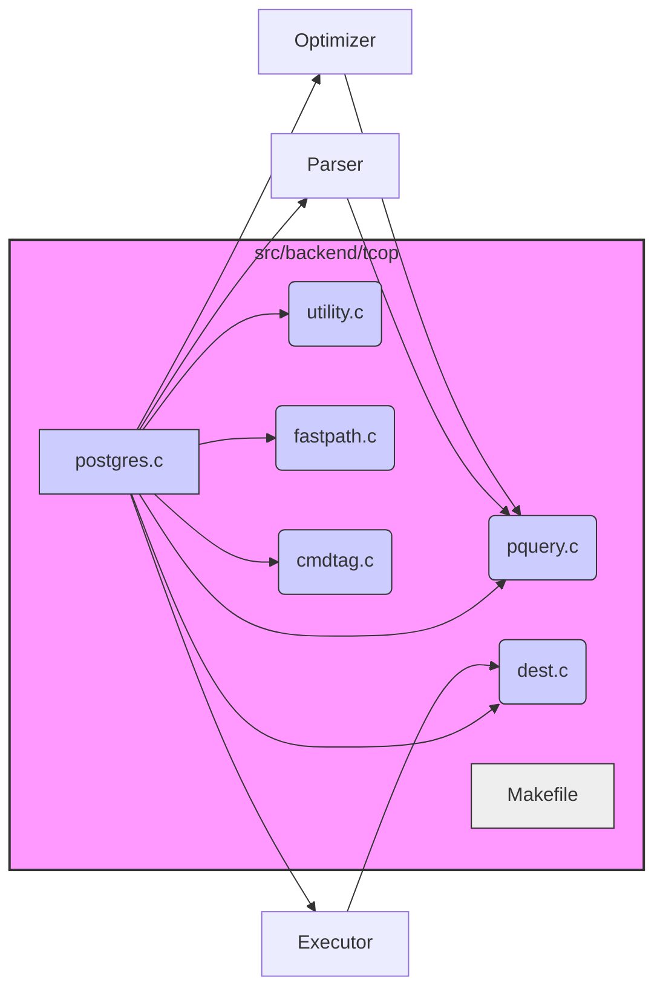

## AI辅助 PolarDB内核学习 - 8 tcop (Traffic cop) 用户请求指挥官    
      
### 作者      
digoal      
      
### 日期      
2025-03-04      
      
### 标签      
PostgreSQL , PolarDB , DuckDB , AI , 内核 , 学习 , tcop        
      
----      
      
## 背景      
让我们一起深入解读 PolarDB for PostgreSQL 源码 `src/backend/tcop` 目录下的代码。
  
## 一、总览
  
**1. 总体概览**  
  
`src/backend/tcop` 目录，正如其 "Traffic Cop" 的名称所示，是 PostgreSQL 后端处理客户端请求的核心模块。它负责接收客户端的 SQL 查询，并将这些查询分发到合适的模块进行处理，最终将结果返回给客户端。  这个过程就像一个交通警察指挥交通，确保所有的车辆（SQL 查询）都能按照正确的路线到达目的地。  
  
**2. 文件功能分解**  
  
下面我们逐个分析 `src/backend/tcop` 目录下的文件，并用 Mermaid 图表展示它们之间的关系：  
  

  
*   **`postgres.c`**:  这是 `tcop` 目录的“大脑”，是 PostgreSQL 后端的主入口点。它负责：  
    *   接收客户端连接。  
    *   处理客户端发送的 SQL 查询字符串。  
    *   调用词法分析器(Parser)，优化器(Optimizer)和执行器(Executor)等模块来处理查询。  
    *   处理事务管理。  
    *   错误处理和日志记录。  
    *   控制整个后端进程的生命周期。  
    *   正如注释所说，它是 "traffic cop" 的核心。  
  
*   **`pquery.c`**:  负责处理查询命令。它接收 `postgres.c` 传递过来的查询请求，并协调查询的执行过程。这包括：  
    *   调用解析器（Parser）将 SQL 语句转换为内部表示形式（语法树）。  
    *   调用优化器（Optimizer）对查询进行优化，生成最佳的执行计划。  
    *   调用执行器（Executor）按照执行计划执行查询，从数据库中检索数据。  
  
*   **`utility.c`**:  处理实用命令（Utility Commands），例如 `CREATE TABLE`, `DROP TABLE`, `ALTER TABLE` 等。 这些命令主要负责数据库对象的定义和管理，而不是数据的查询和修改。  
  
*   **`fastpath.c`**:  处理来自前端的功能请求（Function Requests）。 允许客户端直接调用后端函数，而无需通过标准的 SQL 查询接口。 这可以提高某些特定操作的性能。  
  
*   **`dest.c`**:  管理查询结果的输出目标（Destination）。 定义了查询结果如何发送给客户端，例如：  
    *   直接发送给客户端。  
    *   保存到文件中。  
    *   传递给其他函数进行处理。  
    *   它定义了 `BeginCommand`, `CreateDestReceiver`, `EndCommand`, `NullCommand`, `ReadyForQuery` 等接口，用于控制结果的输出。  
  
*   **`cmdtag.c`**:  定义了命令标签（Command Tag）的数据和例程。 命令标签是一个字符串，用于标识 SQL 命令的类型，例如 `SELECT`, `INSERT`, `UPDATE`, `DELETE` 等。  这些标签用于日志记录、监控和调试。  
  
*   **`Makefile`**:  用于编译 `tcop` 目录下的所有 C 代码，生成可执行文件或库文件。  
  
**3. 流程分析**  
  
一个典型的 SQL 查询在 `tcop` 模块中的处理流程如下：  
  
1.  客户端发送 SQL 查询字符串到后端。  
2.  `postgres.c` 接收查询字符串，并进行初步处理。  
3.  `postgres.c` 调用 `pquery.c` 来处理查询。  
4.  `pquery.c` 调用解析器（Parser）将 SQL 语句转换为语法树。  
5.  `pquery.c` 调用优化器（Optimizer）对查询进行优化，生成执行计划。  
6.  `pquery.c` 调用执行器（Executor）按照执行计划执行查询。  
7.  执行器将查询结果传递给 `dest.c`，由 `dest.c` 负责将结果发送给客户端。  
8.  在整个过程中，`cmdtag.c` 提供的命令标签用于标识 SQL 命令的类型，方便日志记录和监控。  
9.  `utility.c` 处理 DDL 语句，如创建、删除、修改数据库对象。  
10. `fastpath.c` 处理客户端直接调用的后端函数请求。  
  
**4. 学习建议**  
  
*   **从 `postgres.c` 开始**:  它是整个 `tcop` 模块的入口点，理解它的代码可以帮助你把握整个模块的脉络。  
*   **关注数据结构**:  理解 `tcop` 模块中使用的数据结构，例如查询树、执行计划、结果集等，可以帮助你更好地理解代码的逻辑。  
*   **调试**:  通过调试 PostgreSQL 后端代码，可以更直观地了解 SQL 查询的执行过程。  
*   **结合文档**:  参考 PostgreSQL 的官方文档，可以帮助你理解 `tcop` 模块的设计思想和实现细节。  
  
希望这个详细的解读能够帮助你理解 PolarDB for PostgreSQL 源码 `src/backend/tcop` 目录下的代码。 随着你学习的深入，你会对 PostgreSQL 的内部机制有更深刻的理解。 祝你学习顺利！  
  
## 二、关键代码 `postgres.c`  `PostgresMain`  `PostgresSingleUserMain`  
这段代码是 PostgreSQL 单用户模式的入口函数 `PostgresSingleUserMain`。   
  
```c  
/*  
 * PostgresSingleUserMain  
 *     Entry point for single user mode. argc/argv are the command line  
 *     arguments to be used.  
 *  
 *     单用户模式的入口点。 argc/argv 是要使用的命令行参数。  
 *  
 * Performs single user specific setup then calls PostgresMain() to actually  
 * process queries. Single user mode specific setup should go here, rather  
 * than PostgresMain() or InitPostgres() when reasonably possible.  
 *  
 * 执行单用户特定的设置，然后调用 PostgresMain() 来实际处理查询。 单用户模式特定的设置应该放在这里，而不是 PostgresMain() 或 InitPostgres() 中，如果合理的话。  
 */  
void  
PostgresSingleUserMain(int argc, char *argv[],  
                       const char *username)  
{  
    // 函数定义：PostgresSingleUserMain，接受命令行参数 argc 和 argv，以及用户名 username。  
    const char *dbname = NULL;  
    // 定义一个指向字符的常量指针 dbname，用于存储数据库名称，初始值为 NULL。  
  
    Assert(!IsUnderPostmaster);  
    // 断言：确保当前进程不在 postmaster 的管理下。  
  
    /* Initialize startup process environment. */  
    // 初始化启动进程环境。  
    InitStandaloneProcess(argv[0]);  
    // 调用 InitStandaloneProcess 函数，初始化独立进程环境，参数为程序名称 argv[0]。  
  
    /*  
     * Set default values for command-line options.  
     */  
    // 设置命令行选项的默认值。  
    InitializeGUCOptions();  
    // 调用 InitializeGUCOptions 函数，初始化 GUC（Grand Unified Configuration）选项。  
  
    /*  
     * Parse command-line options.  
     */  
    // 解析命令行选项。  
    process_postgres_switches(argc, argv, PGC_POSTMASTER, &dbname);  
    // 调用 process_postgres_switches 函数，解析命令行选项，参数包括 argc、argv、PGC_POSTMASTER（表示 postmaster 级别的配置）和指向数据库名称的指针 dbname。  
  
    /* Must have gotten a database name, or have a default (the username) */  
    // 必须获取数据库名称，或者有一个默认值（用户名）。  
    if (dbname == NULL)  
    {  
        // 如果数据库名称为空，则使用用户名作为数据库名称。  
        dbname = username;  
        // 将用户名赋值给数据库名称。  
        if (dbname == NULL)  
            // 如果用户名也为空，则报告一个致命错误。  
            ereport(FATAL,  
                    (errcode(ERRCODE_INVALID_PARAMETER_VALUE),  
                     errmsg("%s: no database nor user name specified",  
                            progname)));  
            // 使用 ereport 函数报告一个 FATAL 级别的错误，指示没有指定数据库名称或用户名。  
    }  
  
    /* Acquire configuration parameters */  
    // 获取配置参数。  
    if (!SelectConfigFiles(userDoption, progname, false))  
        // 调用 SelectConfigFiles 函数，选择配置文件，参数包括 userDoption（用户指定的配置文件目录）、程序名称 progname 和一个布尔值（表示是否为 postmaster）。  
        // 如果选择配置文件失败，则退出进程。  
        proc_exit(1);  
        // 调用 proc_exit 函数，以状态码 1 退出进程。  
  
    /*  
     * Validate we have been given a reasonable-looking DataDir and change  
     * into it.  
     */  
    // 验证是否已提供一个合理的数据目录，并切换到该目录。  
    checkDataDir();  
    // 调用 checkDataDir 函数，检查数据目录是否有效。  
    ChangeToDataDir();  
    // 调用 ChangeToDataDir 函数，切换到数据目录。  
  
    /*  
     * Create lockfile for data directory.  
     */  
    // 为数据目录创建锁文件。  
    CreateDataDirLockFile(false);  
    // 调用 CreateDataDirLockFile 函数，创建数据目录的锁文件，参数为一个布尔值（表示是否为 postmaster）。  
  
    /* POLAR: remove POLAR_REPLICA_BOOTED_FILE when not in replica node */  
    // POLAR：当不在副本节点中时，删除 POLAR_REPLICA_BOOTED_FILE。  
    if (polar_enable_shared_storage_mode && !polar_is_replica())  
        // 如果启用了共享存储模式并且当前节点不是副本节点，则删除 POLAR_REPLICA_BOOTED_FILE。  
        polar_remove_replica_booted_file();  
        // 调用 polar_remove_replica_booted_file 函数，删除 POLAR_REPLICA_BOOTED_FILE。  
  
    /* read control file (error checking and contains config ) */  
    // 读取控制文件（错误检查并包含配置）。  
    LocalProcessControlFile(false);  
    // 调用 LocalProcessControlFile 函数，读取控制文件，参数为一个布尔值（表示是否为 postmaster）。  
    elog(LOG, "PolarDB load controlfile in single user postmaster");  
    // 使用 elog 函数记录一条 LOG 级别的消息，指示 PolarDB 在单用户 postmaster 中加载了控制文件。  
  
    /*  
     * process any libraries that should be preloaded at postmaster start  
     */  
    // 处理任何应在 postmaster 启动时预加载的库。  
    process_shared_preload_libraries();  
    // 调用 process_shared_preload_libraries 函数，处理共享预加载库。  
  
    /* Initialize MaxBackends */  
    // 初始化 MaxBackends。  
    InitializeMaxBackends();  
    // 调用 InitializeMaxBackends 函数，初始化最大后端进程数。  
  
    /*  
     * Give preloaded libraries a chance to request additional shared memory.  
     */  
    // 让预加载的库有机会请求额外的共享内存。  
    process_shmem_requests();  
    // 调用 process_shmem_requests 函数，处理共享内存请求。  
  
    /*  
     * Now that loadable modules have had their chance to request additional  
     * shared memory, determine the value of any runtime-computed GUCs that  
     * depend on the amount of shared memory required.  
     */  
    // 现在加载模块有机会请求额外的共享内存，确定任何运行时计算的 GUC 的值，这些 GUC 依赖于所需的共享内存量。  
    InitializeShmemGUCs();  
    // 调用 InitializeShmemGUCs 函数，初始化共享内存相关的 GUC。  
  
    /*  
     * Now that modules have been loaded, we can process any custom resource  
     * managers specified in the wal_consistency_checking GUC.  
     */  
    // 现在模块已加载，我们可以处理 wal_consistency_checking GUC 中指定的任何自定义资源管理器。  
    InitializeWalConsistencyChecking();  
    // 调用 InitializeWalConsistencyChecking 函数，初始化 WAL 一致性检查。  
  
    CreateSharedMemoryAndSemaphores();  
    // 调用 CreateSharedMemoryAndSemaphores 函数，创建共享内存和信号量。  
  
    /*  
     * Remember stand-alone backend startup time,roughly at the same point  
     * during startup that postmaster does so.  
     */  
    // 记住独立后端启动时间，大致在 postmaster 启动时的相同点。  
    PgStartTime = GetCurrentTimestamp();  
    // 将当前时间戳赋值给 PgStartTime 变量，用于记录启动时间。  
  
    /*  
     * Create a per-backend PGPROC struct in shared memory. We must do this  
     * before we can use LWLocks.  
     */  
    // 在共享内存中创建一个每个后端的 PGPROC 结构。 我们必须这样做才能使用 LWLocks。  
    InitProcess();  
    // 调用 InitProcess 函数，初始化进程。  
  
    /*  
     * Now that sufficient infrastructure has been initialized, PostgresMain()  
     * can do the rest.  
     */  
    // 现在已经初始化了足够的基础设施，PostgresMain() 可以完成其余的工作。  
    PostgresMain(dbname, username);  
    // 调用 PostgresMain 函数，启动主循环，参数包括数据库名称 dbname 和用户名 username。  
}  
```  
  
**总结：**  
  
*   `PostgresSingleUserMain` 函数是 PostgreSQL 单用户模式的入口点。  
*   它执行单用户模式特定的设置，例如初始化进程环境、解析命令行选项、选择配置文件、检查数据目录、创建锁文件、读取控制文件、处理预加载库、初始化最大后端进程数、处理共享内存请求、初始化 GUC 和 WAL 一致性检查。  
*   它还创建共享内存和信号量，记录启动时间，并初始化进程。  
*   最后，它调用 `PostgresMain` 函数，启动主循环来处理查询。  
*   `POLAR` 注释表明与共享存储模式和副本节点相关的代码是 PolarDB 特有的。  
  
总而言之，`PostgresSingleUserMain` 函数负责设置单用户模式的环境，然后将控制权交给 `PostgresMain` 函数来处理实际的查询。它确保了单用户模式下的 PostgreSQL 实例能够正确启动和运行。  
  
  
---  
  
PostgreSQL 后端的主循环函数 PostgresMain，负责处理客户端连接和执行查询。由于代码量很大，我将分段进行解读。  
  
**第一部分：函数定义、变量声明和初始化**  
  
```c  
/* ----------------------------------------------------------------  
 * PostgresMain  
 *     postgres main loop -- all backends, interactive or otherwise loop here  
 *  
 *     postgres 主循环 -- 所有后端，交互式或其他方式都在这里循环  
 *  
 * dbname is the name of the database to connect to, username is the  
 * PostgreSQL user name to be used for the session.  
 *  
 *     dbname 是要连接的数据库的名称，username 是要用于会话的 PostgreSQL 用户名。  
 *  
 * NB: Single user mode specific setup should go to PostgresSingleUserMain()  
 * if reasonably possible.  
 *  
 *     注意：如果合理可行，单用户模式特定的设置应该放在 PostgresSingleUserMain() 中。  
 * ----------------------------------------------------------------  
 */  
void  
PostgresMain(const char *dbname, const char *username)  
{  
    // 函数 PostgresMain 的定义，接受数据库名 dbname 和用户名 username 作为参数。  
    // 这是 PostgreSQL 后端进程的主循环函数。  
  
    sigjmp_buf  local_sigjmp_buf;  
    // 定义一个 sigjmp_buf 类型的变量 local_sigjmp_buf，用于处理信号和异常。  
    // sigjmp_buf 用于保存程序的状态，以便在发生错误或信号时可以跳转回这里。  
  
    /* these must be volatile to ensure state is preserved across longjmp: */  
    // 这些变量必须是 volatile 的，以确保状态在 longjmp 期间得到保留：  
    volatile bool send_ready_for_query = true;  
    // 定义一个 volatile bool 类型的变量 send_ready_for_query，用于指示是否需要向客户端发送 "Ready for Query" 消息。  
    // volatile 关键字告诉编译器不要对该变量进行优化，每次都从内存中读取。  
    volatile bool idle_in_transaction_timeout_enabled = false;  
    // 定义一个 volatile bool 类型的变量 idle_in_transaction_timeout_enabled，用于指示事务中空闲超时是否已启用。  
    volatile bool idle_session_timeout_enabled = false;  
    // 定义一个 volatile bool 类型的变量 idle_session_timeout_enabled，用于指示会话空闲超时是否已启用。  
  
    /* POLAR */  
    // POLAR: 这是一个注释，表明以下代码可能与 PolarDB 相关。  
    TimestampTz current_time;  
    // 定义一个 TimestampTz 类型的变量 current_time，用于存储当前时间戳。  
    long        secs = 0;  
    // 定义一个 long 类型的变量 secs，用于存储秒数。  
    int         microsecs = 0;  
    // 定义一个 int 类型的变量 microsecs，用于存储微秒数。  
  
    AssertArg(dbname != NULL);  
    // 使用 AssertArg 宏来断言 dbname 不为 NULL。  
    // 如果 dbname 为 NULL，则程序会中止。  
    AssertArg(username != NULL);  
    // 使用 AssertArg 宏来断言 username 不为 NULL。  
    // 如果 username 为 NULL，则程序会中止。  
  
    SetProcessingMode(InitProcessing);  
    // 设置处理模式为 InitProcessing，表示正在进行初始化处理。  
}  
```  
  
**总结：**  
  
*   `PostgresMain` 函数是 PostgreSQL 后端的核心，负责处理客户端连接和查询。  
*   `sigjmp_buf` 用于错误处理和信号处理，允许程序在发生错误时跳转回主循环。  
*   `volatile` 关键字确保某些变量的状态在 `longjmp` 期间得到正确保留。  
*   `AssertArg` 宏用于参数校验，确保输入参数的有效性。  
*   `SetProcessingMode` 函数用于设置后端进程的处理模式。  
*   `POLAR` 注释表明代码中可能包含与 PolarDB 相关的特定实现。  
  
**第二部分：信号处理**  
  
```c  
    /*  
     * Set up signal handlers.  (InitPostmasterChild or InitStandaloneProcess  
     * has already set up BlockSig and made that the active signal mask.)  
     *  
     *  设置信号处理程序。（InitPostmasterChild 或 InitStandaloneProcess  
     * 已经设置了 BlockSig 并使其成为活动的信号掩码。）  
     *  
     * Note that postmaster blocked all signals before forking child process,  
     * so there is no race condition whereby we might receive a signal before  
     * we have set up the handler.  
     *  
     *  请注意，postmaster 在 fork 子进程之前阻止了所有信号，  
     * 因此不存在我们在设置处理程序之前可能收到信号的竞争条件。  
     *  
     * Also note: it's best not to use any signals that are SIG_IGNored in the  
     * postmaster.  If such a signal arrives before we are able to change the  
     * handler to non-SIG_IGN, it'll get dropped.  Instead, make a dummy  
     * handler in the postmaster to reserve the signal. (Of course, this isn't  
     * an issue for signals that are locally generated, such as SIGALRM and  
     * SIGPIPE.)  
     *  
     *  另请注意：最好不要使用 postmaster 中被 SIG_IGN 忽略的任何信号。  
     * 如果在我们能够将处理程序更改为非 SIG_IGN 之前收到这样的信号，它将被丢弃。  
     * 相反，在 postmaster 中创建一个虚拟处理程序来保留该信号。（当然，对于本地生成的信号（例如 SIGALRM 和 SIGPIPE），这不是问题。）  
     */  
    if (am_walsender)  
        WalSndSignals();  
    else  
    {  
        pqsignal(SIGHUP, SignalHandlerForConfigReload);  
        // 设置 SIGHUP 信号的处理程序为 SignalHandlerForConfigReload，用于重新加载配置文件。  
        pqsignal(SIGINT, StatementCancelHandler);   /* cancel current query */  
        // 设置 SIGINT 信号的处理程序为 StatementCancelHandler，用于取消当前查询。  
        pqsignal(SIGTERM, die); /* cancel current query and exit */  
        // 设置 SIGTERM 信号的处理程序为 die，用于取消当前查询并退出。  
  
        /*  
         * In a postmaster child backend, replace SignalHandlerForCrashExit  
         * with quickdie, so we can tell the client we're dying.  
         *  
         *  在 postmaster 子后端中，将 SignalHandlerForCrashExit 替换为 quickdie，  
         * 这样我们就可以告诉客户端我们正在死亡。  
         *  
         * In a standalone backend, SIGQUIT can be generated from the keyboard  
         * easily, while SIGTERM cannot, so we make both signals do die()  
         * rather than quickdie().  
         *  
         *  在独立后端中，SIGQUIT 可以很容易地从键盘生成，而 SIGTERM 则不能，  
         * 因此我们使两个信号都执行 die() 而不是 quickdie()。  
         */  
        if (IsUnderPostmaster)  
            pqsignal(SIGQUIT, quickdie);    /* hard crash time */  
        // 如果后端进程是由 postmaster 启动的子进程，则设置 SIGQUIT 信号的处理程序为 quickdie，用于快速崩溃。  
        else  
            pqsignal(SIGQUIT, die); /* cancel current query and exit */  
        // 否则，设置 SIGQUIT 信号的处理程序为 die，用于取消当前查询并退出。  
        InitializeTimeouts();   /* establishes SIGALRM handler */  
        // 初始化超时机制，建立 SIGALRM 信号的处理程序。  
  
        /*  
         * Ignore failure to write to frontend. Note: if frontend closes  
         * connection, we will notice it and exit cleanly when control next  
         * returns to outer loop.  This seems safer than forcing exit in the  
         * midst of output during who-knows-what operation...  
         *  
         *  忽略写入前端的失败。注意：如果前端关闭连接，  
         * 当控制权下次返回到外循环时，我们会注意到它并干净地退出。  
         * 这似乎比在输出过程中强制退出更安全，因为谁知道会发生什么操作...  
         */  
        pqsignal(SIGPIPE, SIG_IGN);  
        // 忽略 SIGPIPE 信号，该信号在向已关闭的 socket 写入数据时产生。  
        pqsignal(SIGUSR1, procsignal_sigusr1_handler);  
        // 设置 SIGUSR1 信号的处理程序为 procsignal_sigusr1_handler。  
        /* POLAR: oom cancel query signal */  
        // POLAR: OOM 取消查询信号  
        pqsignal(SIGUSR2, polar_procsignal_sigusr2_handler);  
        // 设置 SIGUSR2 信号的处理程序为 polar_procsignal_sigusr2_handler，用于处理 OOM（Out Of Memory）情况下的查询取消。  
        pqsignal(SIGFPE, FloatExceptionHandler);  
        // 设置 SIGFPE 信号的处理程序为 FloatExceptionHandler，用于处理浮点异常。  
  
        /*  
         * Reset some signals that are accepted by postmaster but not by  
         * backend  
         *  
         *  重置一些被 postmaster 接受但未被后端接受的信号  
         */  
        pqsignal(SIGCHLD, SIG_DFL); /* system() requires this on some  
                                     * platforms */  
        // 将 SIGCHLD 信号的处理程序重置为默认行为，该信号在子进程退出时产生。  
        // system() 函数在某些平台上需要这个设置。  
    }  
```  
  
**总结：**  
  
*   这段代码设置了各种信号的处理程序，以便后端进程能够响应不同的事件。  
*   `pqsignal` 函数用于设置信号处理程序。  
*   不同的信号用于不同的目的，例如重新加载配置文件、取消查询、处理错误和管理子进程。  
*   `am_walsender` 变量用于区分 WAL sender 进程和其他后端进程，WAL sender 进程有不同的信号处理需求。  
*   `POLAR` 注释表明 `polar_procsignal_sigusr2_handler` 函数是 PolarDB 特有的，用于处理 OOM 情况下的查询取消。  
*   `quickdie` 和 `die` 函数用于处理进程退出，`quickdie` 用于快速崩溃，`die` 用于正常退出。  
  
**第三部分：初始化**  
  
```c  
    /* Early initialization */  
    // 早期初始化  
    BaseInit();  
    // 调用 BaseInit 函数进行一些基本的初始化操作。  
  
    /* We need to allow SIGINT, etc during the initial transaction */  
    // 在初始事务期间，我们需要允许 SIGINT 等信号  
    PG_SETMASK(&UnBlockSig);  
    // 使用 PG_SETMASK 宏来设置信号掩码，允许在初始事务期间接收 SIGINT 等信号。  
    // UnBlockSig 是一个预定义的信号掩码，用于取消阻止某些信号。  
  
    /*  
     * General initialization.  
     *  
     *  通用初始化。  
     *  
     * NOTE: if you are tempted to add code in this vicinity, consider putting  
     * it inside InitPostgres() instead.  In particular, anything that  
     * involves database access should be there, not here.  
     *  
     *  注意：如果您想在此附近添加代码，请考虑将其放在 InitPostgres() 中。  
     * 特别是，任何涉及数据库访问的内容都应该在那里，而不是在这里。  
     */  
    InitPostgres(dbname, InvalidOid,    /* database to connect to */  
                 username, InvalidOid,  /* role to connect as */  
                 !am_walsender, /* honor session_preload_libraries? */  
                 false,         /* don't ignore datallowconn */  
                 NULL);         /* no out_dbname */  
    // 调用 InitPostgres 函数进行通用的初始化操作，包括连接数据库、设置用户角色等。  
    // dbname 是要连接的数据库的名称。  
    // username 是要使用的用户名。  
    // !am_walsender 用于指示是否加载会话预加载库。  
    // false 用于指示不忽略 datallowconn 设置。  
    // NULL 用于指示没有 out_dbname。  
  
    /*  
     * If the PostmasterContext is still around, recycle the space; we don't  
     * need it anymore after InitPostgres completes.  Note this does not trash  
     * *MyProcPort, because ConnCreate() allocated that space with malloc()  
     * ... else we'd need to copy the Port data first.  Also, subsidiary data  
     * such as the username isn't lost either; see ProcessStartupPacket().  
     *  
     *  如果 PostmasterContext 仍然存在，则回收空间；在 InitPostgres 完成后，我们不再需要它。  
     * 请注意，这不会破坏 *MyProcPort，因为 ConnCreate() 使用 malloc() 分配了该空间  
     * ... 否则我们需要首先复制 Port 数据。此外，诸如用户名之类的辅助数据也不会丢失；请参阅 ProcessStartupPacket()。  
     */  
    if (PostmasterContext)  
    {  
        // 如果 PostmasterContext 仍然存在，则释放它。  
        MemoryContextDelete(PostmasterContext);  
        // 使用 MemoryContextDelete 函数释放 PostmasterContext 内存上下文。  
        PostmasterContext = NULL;  
        // 将 PostmasterContext 设置为 NULL。  
    }  
  
    SetProcessingMode(NormalProcessing);  
    // 设置处理模式为 NormalProcessing，表示正在进行正常的处理。  
  
    /*  
     * Now all GUC states are fully set up.  Report them to client if  
     * appropriate.  
     *  
     *  现在所有 GUC 状态都已完全设置。如果合适，将其报告给客户端。  
     */  
    BeginReportingGUCOptions();  
    // 调用 BeginReportingGUCOptions 函数，如果合适，将 GUC（Grand Unified Configuration）选项报告给客户端。  
  
    /*  
     * Also set up handler to log session end; we have to wait till now to be  
     * sure Log_disconnections has its final value.  
     *  
     *  还设置了处理程序以记录会话结束；我们必须等到现在才能确定 Log_disconnections 具有其最终值。  
     */  
    if (IsUnderPostmaster && Log_disconnections)  
        // 如果后端进程是由 postmaster 启动的子进程，并且 Log_disconnections 设置为 true，则设置一个在进程退出时记录断开连接的回调函数。  
        on_proc_exit(log_disconnections, 0);  
    // 使用 on_proc_exit 函数设置一个在进程退出时调用的回调函数 log_disconnections。  
  
    pgstat_report_connect(MyDatabaseId);  
    // 调用 pgstat_report_connect 函数，向 pgstat 系统报告连接事件。  
    // MyDatabaseId 是当前数据库的 ID。  
  
    /*  
     * POLAR: audit log flush callback. flush audit log will use MyProc in  
     * LWLock, so use before_shmem_exit instead of on_proc_exit  
     *  
     * POLAR：审计日志刷新回调。刷新审计日志将使用 LWLock 中的 MyProc，因此使用 before_shmem_exit 而不是 on_proc_exit  
     */  
    if (IsUnderPostmaster && polar_audit_log_flush_timeout > 0)  
        // 如果后端进程是由 postmaster 启动的子进程，并且 polar_audit_log_flush_timeout 大于 0，则设置一个在共享内存退出时刷新审计日志的回调函数。  
        before_shmem_exit(polar_audit_log_flush_callback, 0);  
    // 使用 before_shmem_exit 函数设置一个在共享内存退出时调用的回调函数 polar_audit_log_flush_callback。  
  
    /* Perform initialization specific to a WAL sender process. */  
    // 执行特定于 WAL 发送器进程的初始化。  
    if (am_walsender)  
        // 如果当前进程是 WAL sender 进程，则调用 InitWalSender 函数进行 WAL sender 特有的初始化。  
        InitWalSender();  
```  
  
**总结：**  
  
*   这段代码进行了一系列的初始化操作，包括基本初始化、设置信号掩码、连接数据库、设置 GUC 选项、设置进程退出回调函数和 WAL sender 特有初始化。  
*   `BaseInit` 函数进行一些基本的初始化操作。  
*   `PG_SETMASK` 宏用于设置信号掩码。  
*   `InitPostgres` 函数用于连接数据库和设置用户角色。  
*   `MemoryContextDelete` 函数用于释放内存上下文。  
*   `BeginReportingGUCOptions` 函数用于将 GUC 选项报告给客户端。  
*   `on_proc_exit` 函数用于设置进程退出回调函数。  
*   `pgstat_report_connect` 函数用于向 pgstat 系统报告连接事件。  
*   `before_shmem_exit` 函数用于设置共享内存退出回调函数。  
*   `InitWalSender` 函数用于进行 WAL sender 特有的初始化。  
  
**第四部分：发送取消信息和创建内存上下文**  
  
```c  
    /*  
     * Send this backend's cancellation info to the frontend.  
     *  
     *  将此后端的取消信息发送到前端。  
     */  
    if (whereToSendOutput == DestRemote)  
    {  
        // 如果输出目标是远程客户端，则发送取消信息。  
        StringInfoData buf;  
        // 定义一个 StringInfoData 类型的变量 buf，用于存储消息。  
        int32       proxy_cancel_key;  
        // 定义一个 int32 类型的变量 proxy_cancel_key，用于存储代理取消密钥。  
        int32       session_id = polar_proxy_get_sid(MyProcPid, &proxy_cancel_key);  
        // 调用 polar_proxy_get_sid 函数获取会话 ID 和代理取消密钥。  
        // MyProcPid 是当前进程的 PID。  
  
        pq_beginmessage(&buf, 'K');  
        // 使用 pq_beginmessage 函数开始构建消息，消息类型为 'K'（取消密钥）。  
        pq_sendint32(&buf, (int32) session_id);  
        // 使用 pq_sendint32 函数将会话 ID 添加到消息中。  
        if (POLAR_IS_PROXY_SID(session_id))  
            // 如果会话 ID 是代理会话 ID，则将代理取消密钥添加到消息中。  
            pq_sendint32(&buf, (int32) proxy_cancel_key);  
        else  
            // 否则，将 MyCancelKey 添加到消息中。  
            pq_sendint32(&buf, (int32) MyCancelKey);  
        // 使用 pq_sendint32 函数将取消密钥添加到消息中。  
        pq_endmessage(&buf);  
        // 使用 pq_endmessage 函数结束构建消息。  
        /* Need not flush since ReadyForQuery will do it. */  
        // 不需要刷新，因为 ReadyForQuery 会执行此操作。  
    }  
  
    /* Welcome banner for standalone case */  
    // 独立情况下的欢迎横幅  
    if (whereToSendOutput == DestDebug)  
        // 如果输出目标是调试终端，则打印欢迎横幅。  
        printf("\nPostgreSQL stand-alone backend %s\n", PG_VERSION);  
    // 使用 printf 函数打印欢迎横幅，其中包含 PostgreSQL 的版本号。  
  
    /*  
     * Create the memory context we will use in the main loop.  
     *  
     *  创建我们将在主循环中使用的内存上下文。  
     *  
     * MessageContext is reset once per iteration of the main loop, ie, upon  
     * completion of processing of each command message from the client.  
     *  
     *  MessageContext 在主循环的每次迭代中重置一次，即在完成处理来自客户端的每个命令消息时。  
     */  
    MessageContext = AllocSetContextCreate(TopMemoryContext,  
                                           "MessageContext",  
                                           ALLOCSET_DEFAULT_SIZES);  
    // 创建一个名为 "MessageContext" 的内存上下文，用于存储主循环中使用的消息数据。  
    // TopMemoryContext 是顶级内存上下文。  
    // ALLOCSET_DEFAULT_SIZES 指定使用默认的分配集大小。  
  
    /*  
     * Create memory context and buffer used for RowDescription messages. As  
     * SendRowDescriptionMessage(), via exec_describe_statement_message(), is  
     * frequently executed for ever single statement, we don't want to  
     * allocate a separate buffer every time.  
     *  
     *  创建用于 RowDescription 消息的内存上下文和缓冲区。由于 SendRowDescriptionMessage() 通过 exec_describe_statement_message()  
     * 经常为每个语句执行，因此我们不想每次都分配一个单独的缓冲区。  
     */  
    row_description_context = AllocSetContextCreate(TopMemoryContext,  
                                                    "RowDescriptionContext",  
                                                    ALLOCSET_DEFAULT_SIZES);  
    // 创建一个名为 "RowDescriptionContext" 的内存上下文，用于存储 RowDescription 消息的数据。  
    MemoryContextSwitchTo(row_description_context);  
    // 将当前内存上下文切换到 row_description_context。  
    initStringInfo(&row_description_buf);  
    // 初始化 row_description_buf 字符串缓冲区。  
    MemoryContextSwitchTo(TopMemoryContext);  
    // 将当前内存上下文切换回 TopMemoryContext。  
```  
  
**总结：**  
  
*   这段代码发送后端进程的取消信息到前端，以便前端可以取消正在执行的查询。  
*   如果后端进程是独立运行的，则打印欢迎横幅。  
*   创建了两个内存上下文：`MessageContext` 和 `row_description_context`，用于存储主循环中使用的数据。  
*   `MessageContext` 用于存储消息数据，每次循环迭代都会重置。  
*   `row_description_context` 用于存储 RowDescription 消息的数据，避免每次都分配新的缓冲区。  
  
**第五部分：主循环的开始和错误处理**  
  
```c  
    /*  
     * POSTGRES main processing loop begins here  
     *  
     *  POSTGRES 主处理循环从这里开始  
     *  
     * If an exception is encountered, processing resumes here so we abort the  
     * current transaction and start a new one.  
     *  
     *  如果遇到异常，处理将在此处恢复，因此我们中止当前事务并启动一个新事务。  
     *  
     * You might wonder why this isn't coded as an infinite loop around a  
     * PG_TRY construct.  The reason is that this is the bottom of the  
     * exception stack, and so with PG_TRY there would be no exception handler  
     * in force at all during the CATCH part.  By leaving the outermost setjmp  
     * always active, we have at least some chance of recovering from an error  
     * during error recovery.  (If we get into an infinite loop thereby, it  
     * will soon be stopped by overflow of elog.c's internal state stack.)  
     *  
     *  您可能想知道为什么这没有被编码为围绕 PG_TRY 构造的无限循环。  
     * 原因是这是异常堆栈的底部，因此使用 PG_TRY 在 CATCH 部分期间根本没有强制执行的异常处理程序。  
     * 通过使最外层的 setjmp 始终处于活动状态，我们至少有机会从错误恢复期间的错误中恢复。（如果因此进入无限循环，它将很快被 elog.c 的内部状态堆栈溢出停止。）  
     *  
     * Note that we use sigsetjmp(..., 1), so that this function's signal mask  
     * (to wit, UnBlockSig) will be restored when longjmp'ing to here.  This  
     * is essential in case we longjmp'd out of a signal handler on a platform  
     * where that leaves the signal blocked.  It's not redundant with the  
     * unblock in AbortTransaction() because the latter is only called if we  
     * were inside a transaction.  
     *  
     *  请注意，我们使用 sigsetjmp(..., 1)，以便在 longjmp 到此处时恢复此函数的信号掩码（即 UnBlockSig）。  
     * 如果我们在信号被阻止的平台上 longjmp 出信号处理程序，则这是必不可少的。  
     * 这与 AbortTransaction() 中的取消阻止不是冗余的，因为后者仅在我们位于事务内部时才被调用。  
     */  
  
    if (sigsetjmp(local_sigjmp_buf, 1) != 0)  
    {  
        // 使用 sigsetjmp 函数设置一个跳转点，以便在发生错误时可以跳转回这里。  
        // local_sigjmp_buf 是之前定义的 sigjmp_buf 类型的变量。  
        // 1 表示保存信号掩码。  
        // 如果 sigsetjmp 返回 0，则表示是第一次执行到这里。  
        // 如果 sigsetjmp 返回非 0 值，则表示是从 longjmp 跳转回来的。  
  
        /*  
         * NOTE: if you are tempted to add more code in this if-block,  
         * consider the high probability that it should be in  
         * AbortTransaction() instead.  The only stuff done directly here  
         * should be stuff that is guaranteed to apply *only* for outer-level  
         * error recovery, such as adjusting the FE/BE protocol status.  
         */  
  
        /* Since not using PG_TRY, must reset error stack by hand */  
        // 由于未使用 PG_TRY，必须手动重置错误堆栈  
        error_context_stack = NULL;  
        // 将错误上下文堆栈设置为空。  
  
        /* Prevent interrupts while cleaning up */  
        // 在清理时防止中断  
        HOLD_INTERRUPTS();  
        // 使用 HOLD_INTERRUPTS 宏来禁止中断。  
  
        /*  
         * Forget any pending QueryCancel request, since we're returning to  
         * the idle loop anyway, and cancel any active timeout requests.  (In  
         * future we might want to allow some timeout requests to survive, but  
         * at minimum it'd be necessary to do reschedule_timeouts(), in case  
         * we got here because of a query cancel interrupting the SIGALRM  
         * interrupt handler.)  Note in particular that we must clear the  
         * statement and lock timeout indicators, to prevent any future plain  
         * query cancels from being misreported as timeouts in case we're  
         * forgetting a timeout cancel.  
         */  
        disable_all_timeouts(false);    /* do first to avoid race condition */  
        // 禁用所有超时，防止竞争条件。  
        QueryCancelPending = false;  
        // 重置查询取消标志。  
        idle_in_transaction_timeout_enabled = false;  
        // 禁用事务内空闲超时。  
        idle_session_timeout_enabled = false;  
        // 禁用会话空闲超时。  
  
        /* Not reading from the client anymore. */  
        // 不再从客户端读取。  
        DoingCommandRead = false;  
        // 设置 DoingCommandRead 标志为 false，表示不再从客户端读取命令。  
  
        /* Make sure libpq is in a good state */  
        // 确保 libpq 处于良好状态  
        pq_comm_reset();  
        // 重置 libpq 通信状态。  
  
        /* Report the error to the client and/or server log */  
        // 将错误报告给客户端和/或服务器日志  
        EmitErrorReport();  
        // 调用 EmitErrorReport 函数，将错误报告给客户端和/或服务器日志。  
  
        /*  
         * Make sure debug_query_string gets reset before we possibly clobber  
         * the storage it points at.  
         */  
        // 确保在可能破坏它指向的存储之前重置 debug_query_string。  
        debug_query_string = NULL;  
        // 重置 debug_query_string 指针。  
  
        /*  
         * Abort the current transaction in order to recover.  
         */  
        // 中止当前事务以进行恢复。  
        AbortCurrentTransaction();  
        // 调用 AbortCurrentTransaction 函数，中止当前事务。  
  
        if (am_walsender)  
            // 如果当前进程是 WAL sender 进程，则进行 WAL sender 特有的错误清理。  
            WalSndErrorCleanup();  
        // 调用 WalSndErrorCleanup 函数，进行 WAL sender 特有的错误清理。  
  
        PortalErrorCleanup();  
        // 调用 PortalErrorCleanup 函数，清理 Portal 相关的错误。  
  
        /*  
         * We can't release replication slots inside AbortTransaction() as we  
         * need to be able to start and abort transactions while having a slot  
         * acquired. But we never need to hold them across top level errors,  
         * so releasing here is fine. There also is a before_shmem_exit()  
         * callback ensuring correct cleanup on FATAL errors.  
         */  
        if (MyReplicationSlot != NULL)  
            // 如果当前进程持有复制槽，则释放它。  
            ReplicationSlotRelease();  
        // 调用 ReplicationSlotRelease 函数，释放复制槽。  
  
        /* We also want to cleanup temporary slots on error. */  
        // 我们还想在出错时清理临时槽。  
        ReplicationSlotCleanup();  
        // 调用 ReplicationSlotCleanup 函数，清理临时复制槽。  
  
        jit_reset_after_error();  
        // 调用 jit_reset_after_error 函数，重置 JIT 状态。  
  
        /*  
         * Now return to normal top-level context and clear ErrorContext for  
         * next time.  
         */  
        // 现在返回到正常的顶级上下文并清除 ErrorContext 以供下次使用。  
        MemoryContextSwitchTo(TopMemoryContext);  
        // 将当前内存上下文切换回 TopMemoryContext。  
        FlushErrorState();  
        // 调用 FlushErrorState 函数，清除错误状态。  
  
        /*  
         * If we were handling an extended-query-protocol message, initiate  
         * skip till next Sync.  This also causes us not to issue  
         * ReadyForQuery (until we get Sync).  
         */  
        if (doing_extended_query_message)  
            // 如果正在处理扩展查询协议消息，则启动跳过直到下一个 Sync。  
            ignore_till_sync = true;  
        // 设置 ignore_till_sync 标志为 true，表示忽略直到下一个 Sync 消息。  
  
        /* We don't have a transaction command open anymore */  
        // 我们不再打开事务命令  
        xact_started = false;  
        // 设置 xact_started 标志为 false，表示没有打开事务命令。  
  
        /*  
         * If an error occurred while we were reading a message from the  
         * client, we have potentially lost track of where the previous  
         * message ends and the next one begins.  Even though we have  
         * otherwise recovered from the error, we cannot safely read any more  
         * messages from the client, so there isn't much we can do with the  
         * connection anymore.  
         */  
        if (pq_is_reading_msg())  
            // 如果在读取消息时发生错误，则终止连接。  
            ereport(FATAL,  
                    (errcode(ERRCODE_PROTOCOL_VIOLATION),  
                     errmsg("terminating connection because protocol synchronization was lost")));  
        // 使用 ereport 函数报告一个 FATAL 错误，并终止连接。  
  
        polar_xact_split_mark_unsplittable(POLAR_UNSPLITTABLE_FOR_ERROR);  
        // POLAR: 标记事务为不可分割，因为发生了错误。  
  
        /* Now we can allow interrupts again */  
        // 现在我们可以再次允许中断  
        RESUME_INTERRUPTS();  
        // 使用 RESUME_INTERRUPTS 宏来允许中断。  
    }  
```  
  
**总结：**  
  
*   这段代码是主循环的开始，并包含错误处理逻辑。  
*   `sigsetjmp` 函数用于设置跳转点，以便在发生错误时可以跳转回这里。  
*   如果 `sigsetjmp` 返回非 0 值，则表示是从 `longjmp` 跳转回来的，说明发生了错误。  
*   在错误处理代码中，会重置错误堆栈、禁止中断、禁用超时、重置 libpq 通信状态、报告错误、中止事务、清理资源和重置状态标志。  
*   如果正在处理扩展查询协议消息，则会启动跳过直到下一个 Sync 消息。  
*   如果在读取消息时发生错误，则会终止连接。  
*   `POLAR` 注释表明 `polar_xact_split_mark_unsplittable` 函数是 PolarDB 特有的，用于标记事务为不可分割。  
*   `HOLD_INTERRUPTS` 和 `RESUME_INTERRUPTS` 宏用于禁止和允许中断。  
  
**第六部分：设置异常堆栈和主循环**  
  
```c  
    /* We can now handle ereport(ERROR) */  
    // 我们现在可以处理 ereport(ERROR)  
    PG_exception_stack = &local_sigjmp_buf;  
    // 设置 PG_exception_stack 指针为 local_sigjmp_buf 的地址，以便可以处理 ereport(ERROR) 类型的错误。  
  
    if (!ignore_till_sync)  
        // 如果不忽略直到 Sync 消息，则发送 ReadyForQuery 消息。  
        send_ready_for_query = true;    /* initially, or after error */  
    // 设置 send_ready_for_query 标志为 true，表示需要发送 ReadyForQuery 消息。  
  
    /*  
     * Non-error queries loop here.  
     *  
     *  非错误查询在此处循环。  
     */  
  
    for (;;)  
    {  
        // 主循环开始。  
        int         firstchar;  
        // 定义一个 int 类型的变量 firstchar，用于存储读取的第一个字符。  
        StringInfoData input_message;  
        // 定义一个 StringInfoData 类型的变量 input_message，用于存储输入消息。  
  
        /*  
         * At top of loop, reset extended-query-message flag, so that any  
         * errors encountered in "idle" state don't provoke skip.  
         */  
        // 在循环顶部，重置 extended-query-message 标志，以便在“空闲”状态下遇到的任何错误都不会引发跳过。  
        doing_extended_query_message = false;  
        // 设置 doing_extended_query_message 标志为 false，表示没有正在处理扩展查询协议消息。  
  
        /*  
         * Release storage left over from prior query cycle, and create a new  
         * query input buffer in the cleared MessageContext.  
         */  
        // 释放先前查询周期中剩余的存储，并在清除的 MessageContext 中创建一个新的查询输入缓冲区。  
        MemoryContextSwitchTo(MessageContext);  
        // 将当前内存上下文切换到 MessageContext。  
        MemoryContextResetAndDeleteChildren(MessageContext);  
        // 重置并删除 MessageContext 内存上下文的所有子上下文。  
  
        initStringInfo(&input_message);  
        // 初始化 input_message 字符串缓冲区。  
  
        /*  
         * Also consider releasing our catalog snapshot if any, so that it's  
         * not preventing advance of global xmin while we wait for the client.  
         */  
        // 还要考虑释放我们的目录快照（如果有），以便它不会阻止全局 xmin 的前进，同时我们等待客户端。  
        InvalidateCatalogSnapshotConditionally();  
        // 调用 InvalidateCatalogSnapshotConditionally 函数，有条件地释放目录快照。  
```  
  
**总结：**  
  
*   这段代码设置了异常堆栈，并开始了主循环。  
*   `PG_exception_stack` 指针用于处理 `ereport(ERROR)` 类型的错误。  
*   `send_ready_for_query` 标志用于指示是否需要发送 ReadyForQuery 消息。  
*   主循环是一个无限循环，用于处理客户端发送的命令。  
*   在每次循环迭代中，会重置 `doing_extended_query_message` 标志、释放 MessageContext 内存上下文和初始化 input_message 字符串缓冲区。  
*   `InvalidateCatalogSnapshotConditionally` 函数用于有条件地释放目录快照。  
  
**第七部分：发送 ReadyForQuery 消息和读取命令**  
  
```c  
        /*  
         * (1) If we've reached idle state, tell the frontend we're ready for  
         * a new query.  
         *  
         *  (1) 如果我们已达到空闲状态，请告诉前端我们已准备好进行新查询。  
         *  
         * Note: this includes fflush()'ing the last of the prior output.  
         *  
         *  注意：这包括 fflush()'ing 先前输出的最后一部分。  
         *  
         * This is also a good time to flush out collected statistics to the  
         * cumulative stats system, and to update the PS stats display.  
         *  
         *  这也是将收集的统计信息刷新到累积统计系统以及更新 PS 统计信息显示的好时机。  
         */  
        if (send_ready_for_query)  
        {  
            // 如果 send_ready_for_query 标志为 true，则发送 ReadyForQuery 消息。  
            send_ready_for_query = false;  
            // 将 send_ready_for_query 标志设置为 false。  
            SetProcessingMode(IdleProcessing);  
            // 设置处理模式为 IdleProcessing，表示处于空闲处理状态。  
            pgstat_send_queue();  
            // 调用 pgstat_send_queue 函数，将统计信息发送到 pgstat 系统。  
            update_process_title();  
            // 调用 update_process_title 函数，更新进程标题。  
            /* POLAR: flush audit log */  
            // POLAR: 刷新审计日志  
            if (polar_audit_log_flush_timeout > 0)  
            {  
                // 如果 polar_audit_log_flush_timeout 大于 0，则检查是否需要刷新审计日志。  
                current_time = GetCurrentTimestamp();  
                // 获取当前时间戳。  
                TimestampDifference(polar_last_audit_log_flush_time, current_time, &secs, &microsecs);  
                // 计算上次刷新审计日志的时间与当前时间之间的时间差。  
                if (secs * 1000 + microsecs / 1000 > polar_audit_log_flush_timeout)  
                {  
                    // 如果时间差大于 polar_audit_log_flush_timeout，则刷新审计日志。  
                    polar_audit_log_flush();  
                    // 调用 polar_audit_log_flush 函数，刷新审计日志。  
                    polar_last_audit_log_flush_time = current_time;  
                    // 更新上次刷新审计日志的时间。  
                }  
            }  
            // 发送 ReadyForQuery 消息。  
            SendReadyForQuery(xact_status);  
            // 调用 SendReadyForQuery 函数，发送 ReadyForQuery 消息，并传递事务状态 xact_status。  
        }  
  
        SetProcessingMode(NormalProcessing);  
        // 设置处理模式为 NormalProcessing，表示处于正常处理状态。  
  
        /*  
         * (2) Get a command.  
         *  
         *  (2) 获取命令。  
         *  
         * Outer loop of the system: read a command from the frontend, execute  
         * it, and loop back for more.  
         *  
         *  系统的外循环：从前端读取命令，执行它，然后循环返回以获取更多命令。  
         */  
        firstchar = pq_getbyte(&input_message);  
        // 调用 pq_getbyte 函数，从输入消息中读取一个字节，并将其存储在 firstchar 变量中。  
        // firstchar 变量存储了命令的类型。  
  
        /*  
         * IMPORTANT NOTE: we assume that pq_getbyte() only returns EOF after  
         * the connection has been lost.  If it ever returns EOF for any  
         * other reason, the code below will need to change!  
         *  
         *  重要提示：我们假设 pq_getbyte() 仅在连接丢失后才返回 EOF。  
         * 如果它因任何其他原因返回 EOF，则下面的代码将需要更改！  
         */  
        if (firstchar == EOF)  
        {  
            // 如果读取的字节是 EOF，则表示连接已关闭。  
            /*  
             * EOF on input: time to quit.  
             *  
             *  输入上的 EOF：是时候退出了。  
             */  
            ereport(DEBUG2,  
                    (errmsg("unexpected EOF on client connection")));  
            // 使用 ereport 函数报告一个 DEBUG2 级别的消息，指示在客户端连接上发生了意外的 EOF。  
            break;              /* out of infinite loop */  
            // 跳出无限循环，结束后端进程。  
        }  
```  
  
**总结：**  
  
*   这段代码负责发送 ReadyForQuery 消息，并从客户端读取命令。  
*   `send_ready_for_query` 标志用于控制是否发送 ReadyForQuery 消息。  
*   `SetProcessingMode` 函数用于设置处理模式。  
*   `pgstat_send_queue` 函数用于将统计信息发送到 pgstat 系统。  
*   `update_process_title` 函数用于更新进程标题。  
*   `SendReadyForQuery` 函数用于发送 ReadyForQuery 消息。  
*   `pq_getbyte` 函数用于从输入消息中读取一个字节，该字节表示命令的类型。  
*   如果读取到 EOF，则表示连接已关闭，后端进程将退出。  
*   `POLAR` 注释表明与审计日志刷新相关的代码是 PolarDB 特有的。  
  
**第八部分：处理不同类型的命令**  
  
```c  
        /*  
         * We have a message!  Start processing it.  
         *  
         *  我们有一条消息！开始处理它。  
         */  
        DoingCommandRead = true;  
        // 设置 DoingCommandRead 标志为 true，表示正在读取命令。  
  
        TRACE_POSTGRESQL_MESSAGE(firstchar);  
        // 使用 TRACE_POSTGRESQL_MESSAGE 宏来跟踪接收到的消息类型。  
  
        switch (firstchar)  
        {  
                /*  
                 * Extended query protocol messages  
                 *  
                 *  扩展查询协议消息  
                 */  
            case 'Q':           /* simple query */  
                forbidden_in_wal_sender(firstchar);  
                // 如果当前进程是 WAL sender 进程，则禁止执行简单查询。  
  
                /*  
                 * Q message type is followed by an int32 length count, but  
                 * we don't need it, since we already used pq_getbyte to read  
                 * the message type code.  
                 *  
                 *  Q 消息类型之后是一个 int32 长度计数，但我们不需要它，因为我们已经使用 pq_getbyte 读取了消息类型代码。  
                 */  
                pq_getmsgint(&input_message, 4);  
                // 调用 pq_getmsgint 函数，从输入消息中读取一个 int32 类型的整数，表示消息的长度。  
                // 但是，这里实际上忽略了消息的长度。  
  
                /*  
                 * Read the query string.  We expect it to be null-terminated,  
                 * but let the ereport() mechanism complain if not.  
                 *  
                 *  读取查询字符串。我们希望它是以 null 结尾的，但如果不是，则让 ereport() 机制抱怨。  
                 */  
                query_string = pq_getmsgstring(&input_message);  
                // 调用 pq_getmsgstring 函数，从输入消息中读取查询字符串。  
  
                /*  
                 * Do it.  
                 *  
                 *  执行它。  
                 */  
                pg_parse_query(query_string);  
                // 调用 pg_parse_query 函数，解析查询字符串并执行它。  
                break;  
  
            case 'B':           /* Bind */  
                forbidden_in_wal_sender(firstchar);  
                // 如果当前进程是 WAL sender 进程，则禁止执行 Bind 命令。  
                exec_bind_message(&input_message);  
                // 调用 exec_bind_message 函数，处理 Bind 消息。  
                break;  
  
            case 'C':           /* Close */  
                forbidden_in_wal_sender(firstchar);  
                // 如果当前进程是 WAL sender 进程，则禁止执行 Close 命令。  
                exec_close_message(&input_message);  
                // 调用 exec_close_message 函数，处理 Close 消息。  
                break;  
  
            case 'D':           /* Describe */  
                forbidden_in_wal_sender(firstchar);  
                // 如果当前进程是 WAL sender 进程，则禁止执行 Describe 命令。  
                exec_describe_message(&input_message);  
                // 调用 exec_describe_message 函数，处理 Describe 消息。  
                break;  
  
            case 'E':           /* Execute */  
                forbidden_in_wal_sender(firstchar);  
                // 如果当前进程是 WAL sender 进程，则禁止执行 Execute 命令。  
                {  
                    char        portal_name[NAMEDATALEN];  
                    // 定义一个 char 类型的数组 portal_name，用于存储 Portal 的名称。  
                    int         max_rows;  
                    // 定义一个 int 类型的变量 max_rows，用于存储最大行数。  
  
                    /*  
                     * Get portal name (can be "") and max_rows count.  
                     *  
                     *  获取 Portal 名称（可以为 ""）和 max_rows 计数。  
                     */  
                    pq_getmsgstring(&input_message, portal_name, sizeof(portal_name));  
                    // 调用 pq_getmsgstring 函数，从输入消息中读取 Portal 的名称。  
                    max_rows = pq_getmsgint(&input_message, 4);  
                    // 调用 pq_getmsgint 函数，从输入消息中读取最大行数。  
                    pq_getmsgend(&input_message);  
                    // 调用 pq_getmsgend 函数，检查消息是否已完全读取。  
  
                    exec_execute_message(portal_name, max_rows);  
                    // 调用 exec_execute_message 函数，执行 Execute 消息。  
                }  
                break;  
  
            case 'F':           /* fastpath function call */  
                forbidden_in_wal_sender(firstchar);  
                // 如果当前进程是 WAL sender 进程，则禁止执行 fastpath 函数调用。  
  
                /*  
                 * We don't allow fastpath calls anymore, but we have to  
                 * recognize the message so we can throw a suitable error.  
                 *  
                 *  我们不再允许 fastpath 调用，但我们必须识别该消息，以便我们可以抛出一个合适的错误。  
                 */  
                ereport(ERROR,  
                        (errcode(ERRCODE_FEATURE_NOT_SUPPORTED),  
                         errmsg("fastpath function calls are no longer supported")));  
                // 使用 ereport 函数报告一个 ERROR 级别的消息，指示 fastpath 函数调用不再受支持。  
                break;  
  
            case 'H':           /* Flush */  
                forbidden_in_wal_sender(firstchar);  
                // 如果当前进程是 WAL sender 进程，则禁止执行 Flush 命令。  
                /*  
                 * We ignore Flush requests, since the ReadyForQuery message  
                 * will cause a flush anyway.  
                 *  
                 *  我们忽略 Flush 请求，因为 ReadyForQuery 消息无论如何都会导致刷新。  
                 */  
                pq_getmsgend(&input_message);  
                // 调用 pq_getmsgend 函数，检查消息是否已完全读取。  
                break;  
  
            case 'P':           /* Parse */  
                forbidden_in_wal_sender(firstchar);  
                // 如果当前进程是 WAL sender 进程，则禁止执行 Parse 命令。  
                exec_parse_message(&input_message);  
                // 调用 exec_parse_message 函数，处理 Parse 消息。  
                break;  
  
            case 'S':           /* Sync */  
                forbidden_in_wal_sender(firstchar);  
                // 如果当前进程是 WAL sender 进程，则禁止执行 Sync 命令。  
                /*  
                 * Sync clears the decks after an error.  We can now send  
                 * ReadyForQuery.  
                 *  
                 *  Sync 在错误后清除状态。我们现在可以发送 ReadyForQuery。  
                 */  
                ignore_till_sync = false;  
                // 设置 ignore_till_sync 标志为 false，表示不再忽略直到 Sync 消息。  
                send_ready_for_query = true;  
                // 设置 send_ready_for_query 标志为 true，表示需要发送 ReadyForQuery 消息。  
                pq_getmsgend(&input_message);  
                // 调用 pq_getmsgend 函数，检查消息是否已完全读取。  
                break;  
  
                /*  
                 * Non-extended query protocol messages  
                 *  
                 *  非扩展查询协议消息  
                 */  
            case '1':           /* copyDone */  
                forbidden_in_wal_sender(firstchar);  
                // 如果当前进程是 WAL sender 进程，则禁止执行 copyDone 命令。  
                /* copyDone is allowed only when in COPY state */  
                // copyDone 仅在 COPY 状态下才允许  
                if (MyProc->copyState == NULL)  
                    ereport(ERROR,  
                            (errcode(ERRCODE_PROTOCOL_VIOLATION),  
                             errmsg("unexpected copyDone message")));  
                // 如果当前进程不在 COPY 状态下，则报告一个错误。  
                CopyDone(NULL);  
                // 调用 CopyDone 函数，结束 COPY 状态。  
                break;  
  
            case 'c':           /* copyData */  
                forbidden_in_wal_sender(firstchar);  
                // 如果当前进程是 WAL sender 进程，则禁止执行 copyData 命令。  
                /* copyData is allowed only when in COPY state */  
                // copyData 仅在 COPY 状态下才允许  
                if (MyProc->copyState == NULL)  
                    ereport(ERROR,  
                            (errcode(ERRCODE_PROTOCOL_VIOLATION),  
                             errmsg("unexpected copyData message")));  
                // 如果当前进程不在 COPY 状态下，则报告一个错误。  
                CopyReceiveData(&input_message);  
                // 调用 CopyReceiveData 函数，接收 COPY 数据。  
                break;  
  
            case 'd':           /* copyOutResponse */  
                forbidden_in_wal_sender(firstchar);  
                // 如果当前进程是 WAL sender 进程，则禁止执行 copyOutResponse 命令。  
                /* copyOutResponse is allowed only when in COPY state */  
                // copyOutResponse 仅在 COPY 状态下才允许  
                if (MyProc->copyState != NULL)  
                    ereport(ERROR,  
                            (errcode(ERRCODE_PROTOCOL_VIOLATION),  
                             errmsg("unexpected copyOutResponse message")));  
                // 如果当前进程在 COPY 状态下，则报告一个错误。  
                CopyOutResponse(&input_message);  
                // 调用 CopyOutResponse 函数，发送 COPY 输出响应。  
                break;  
  
            case 'f':           /* copyFail */  
                forbidden_in_wal_sender(firstchar);  
                // 如果当前进程是 WAL sender 进程，则禁止执行 copyFail 命令。  
                /* copyFail is allowed only when in COPY state */  
                // copyFail 仅在 COPY 状态下才允许  
                if (MyProc->copyState == NULL)  
                    ereport(ERROR,  
                            (errcode(ERRCODE_PROTOCOL_VIOLATION),  
                             errmsg("unexpected copyFail message")));  
                // 如果当前进程不在 COPY 状态下，则报告一个错误。  
                CopyFail(&input_message);  
                // 调用 CopyFail 函数，处理 COPY 失败。  
                break;  
  
            case 'p':           /* password */  
                forbidden_in_wal_sender(firstchar);  
                // 如果当前进程是 WAL sender 进程，则禁止执行 password 命令。  
                ProcessMD5auth(&input_message);  
                // 调用 ProcessMD5auth 函数，处理 MD5 认证。  
                break;  
  
            case 'X':           /* Terminate */  
                forbidden_in_wal_sender(firstchar);  
                // 如果当前进程是 WAL sender 进程，则禁止执行 Terminate 命令。  
                /*  
                 * Normal exit from the backend is here  
                 *  
                 *  从后端的正常退出就在这里  
                 */  
                proc_exit(0);  
                // 调用 proc_exit 函数，以状态码 0 退出进程。  
                break;  
  
            default:  
                /*  
                 * We don't know what to do with this message.  Drop the  
                 * connection to avoid getting confused.  
                 *  
                 *  我们不知道如何处理此消息。 断开连接以避免混淆。  
                 */  
                ereport(COMMERROR,  
                        (errcode(ERRCODE_PROTOCOL_VIOLATION),  
                         errmsg("invalid frontend message type %d", firstchar)));  
                // 使用 ereport 函数报告一个 COMMERROR 级别的消息，指示收到了无效的前端消息类型。  
                /*  
                 * We used to just ereport(FATAL) here, but that's unfriendly  
                 * to the postmaster, which would keep restarting us ad infinitum.  
                 * Instead, just drop the connection.  
                 *  
                 *  我们过去只是在这里使用 ereport(FATAL)，但这对 postmaster 不友好，postmaster 会无限期地重新启动我们。  
                 * 相反，只需断开连接即可。  
                 */  
                ClosePostgres();  
                // 调用 ClosePostgres 函数，关闭与客户端的连接。  
                break;  
        }  
  
        DoingCommandRead = false;  
        // 设置 DoingCommandRead 标志为 false，表示命令读取已完成。  
    }                           /* end of input-reading loop */  
}  
```  
  
**总结：**  
  
*   这段代码是一个 `switch` 语句，根据 `firstchar` 的值（消息类型）来处理不同的命令。  
*   它处理了扩展查询协议消息（如 `Q`, `B`, `C`, `D`, `E`, `F`, `H`, `P`, `S`）和非扩展查询协议消息（如 `1`, `c`, `d`, `f`, `p`, `X`）。  
*   对于每种消息类型，它都会调用相应的函数来处理该消息。  
*   `forbidden_in_wal_sender` 宏用于检查当前进程是否是 WAL sender 进程，如果是，则禁止执行某些命令。  
*   如果收到了未知消息类型，则会报告一个错误并断开与客户端的连接。  
*   `proc_exit(0)` 用于正常退出后端进程。  
*   `ClosePostgres()` 用于关闭与客户端的连接。  
*   `DoingCommandRead` 标志用于指示是否正在读取命令。  
  
**整体总结：**  
  
这段 `PostgresMain` 函数是 PostgreSQL 后端的核心循环。它负责：  
  
1.  **初始化：** 设置数据库连接、用户身份验证等。  
2.  **循环读取命令：** 从客户端接收命令。  
3.  **处理命令：** 根据命令类型调用相应的处理函数。  
4.  **发送 ReadyForQuery：** 在完成命令处理后，通知客户端已准备好接收新命令。  
5.  **错误处理：** 处理各种错误情况，例如无效的消息类型或连接丢失。  
6.  **退出：** 在收到 Terminate 命令或发生致命错误时退出。  
  
这段代码展示了 PostgreSQL 后端如何与客户端进行交互，以及如何处理不同类型的查询和命令。`POLAR` 注释表明其中一些代码是 PolarDB 特有的，例如审计日志刷新。`forbidden_in_wal_sender` 宏表明某些操作在 WAL sender 进程中是不允许的，这与 WAL sender 的特殊角色有关。  
  
## 三、关键代码 `dest.c`    
**第一段：文件头和包含头文件**

```c
/*-------------------------------------------------------------------------
 *
 * dest.c
 *    support for communication destinations
 *
 *
 * Portions Copyright (c) 2024, Alibaba Group Holding Limited
 * Portions Copyright (c) 1996-2022, PostgreSQL Global Development Group
 * Portions Copyright (c) 1994, Regents of the University of California
 *
 * IDENTIFICATION
 *    src/backend/tcop/dest.c
 *
 *-------------------------------------------------------------------------
 */
/*
 *   INTERFACE ROUTINES
 *      BeginCommand - initialize the destination at start of command
 *      CreateDestReceiver - create tuple receiver object for destination
 *      EndCommand - clean up the destination at end of command
 *      NullCommand - tell dest that an empty query string was recognized
 *      ReadyForQuery - tell dest that we are ready for a new query
 *
 *   NOTES
 *      These routines do the appropriate work before and after
 *      tuples are returned by a query to keep the backend and the
 *      "destination" portals synchronized.
 */

#include "postgres.h"

#include "access/printsimple.h"
#include "access/printtup.h"
#include "access/xact.h"
#include "commands/copy.h"
#include "commands/createas.h"
#include "commands/matview.h"
#include "executor/functions.h"
#include "executor/tqueue.h"
#include "executor/tstoreReceiver.h"
#include "libpq/libpq.h"
#include "libpq/pqformat.h"
#include "utils/portal.h"

/* POLAR */
#include "access/xlog.h"
#include "access/xlogrecovery.h"
#include "miscadmin.h"
#include "utils/backend_status.h"
#include "utils/guc.h"
/* POLAR end */

static void polar_send_proxy_info(StringInfo buf);
```

*   这段代码定义了文件 `dest.c`，它负责处理查询结果的输出目标。
*   注释中列出了几个关键的接口函数：`BeginCommand`、`CreateDestReceiver`、`EndCommand`、`NullCommand` 和 `ReadyForQuery`。
*   这些函数用于在查询执行的不同阶段初始化、创建、清理目标，以及处理空查询和通知客户端准备好接收新查询。
*   包含了一些必要的头文件，例如 `postgres.h`、`libpq/libpq.h` 等。
*   `/* POLAR */` 和 `/* POLAR end */` 之间的代码块表明这是针对 PolarDB 数据库系统的特定扩展。
*   `static void polar_send_proxy_info(StringInfo buf);` 声明了一个静态函数，用于向代理发送信息，这很可能是 PolarDB 为了支持某些特性而添加的。

**第二段：dummy DestReceiver functions**

```c
/* ----------------
 *      dummy DestReceiver functions
 * ----------------
 */
static bool
donothingReceive(TupleTableSlot *slot, DestReceiver *self)
{
    return true;
}

static void
donothingStartup(DestReceiver *self, int operation, TupleDesc typeinfo)
{
}

static void
donothingCleanup(DestReceiver *self)
{
    /* this is used for both shutdown and destroy methods */
}
```

*   这段代码定义了三个“dummy”函数，用于 `DestReceiver` 结构体。
*   `donothingReceive` 函数接收一个元组，但实际上什么也不做，直接返回 `true`。
*   `donothingStartup` 函数在目标启动时被调用，但什么也不做。
*   `donothingCleanup` 函数在目标清理时被调用，也什么也不做。
*   这些函数通常用于 `DestNone` 目标，表示不输出任何结果。

**第三段：static DestReceiver structs for dest types needing no local state**

```c
/* ----------------
 *      static DestReceiver structs for dest types needing no local state
 * ----------------
 */
static const DestReceiver donothingDR = {
    donothingReceive, donothingStartup, donothingCleanup, donothingCleanup,
    DestNone
};

static const DestReceiver debugtupDR = {
    debugtup, debugStartup, donothingCleanup, donothingCleanup,
    DestDebug
};

static const DestReceiver printsimpleDR = {
    printsimple, printsimple_startup, donothingCleanup, donothingCleanup,
    DestRemoteSimple
};

static const DestReceiver spi_printtupDR = {
    spi_printtup, spi_dest_startup, donothingCleanup, donothingCleanup,
    DestSPI
};
```

*   这段代码定义了几个静态的 `DestReceiver` 结构体，用于不同的目标类型。
*   `donothingDR` 使用上面定义的“dummy”函数，对应 `DestNone` 目标。
*   `debugtupDR` 使用 `debugtup` 和 `debugStartup` 函数，对应 `DestDebug` 目标，用于调试输出。
*   `printsimpleDR` 使用 `printsimple` 和 `printsimple_startup` 函数，对应 `DestRemoteSimple` 目标，用于简单格式的远程输出。
*   `spi_printtupDR` 使用 `spi_printtup` 和 `spi_dest_startup` 函数，对应 `DestSPI` 目标，用于 SPI (Server Programming Interface) 环境的输出。
*   这些 `DestReceiver` 结构体是只读的，因为它们被声明为 `const`。

**第四段：Globally available receiver for DestNone**

```c
/*
 * Globally available receiver for DestNone.
 *
 * It's ok to cast the constness away as any modification of the none receiver
 * would be a bug (which gets easier to catch this way).
 */
DestReceiver *None_Receiver = (DestReceiver *) &donothingDR;
```

*   这段代码定义了一个全局可用的 `DestReceiver` 指针 `None_Receiver`，指向 `donothingDR` 结构体。
*   它将 `donothingDR` 的 `const` 属性强制转换为非 `const`，因为在某些情况下可能需要修改 `DestReceiver` 结构体。
*   注释中说明了这样做是安全的，因为任何对 `None_Receiver` 的修改都应该被视为 bug。

**第五段：BeginCommand 函数**

```c
/* ----------------
 *      BeginCommand - initialize the destination at start of command
 * ----------------
 */
void
BeginCommand(CommandTag commandTag, CommandDest dest)
{
    /* Nothing to do at present */
}
```

*   `BeginCommand` 函数在命令开始时被调用，用于初始化目标。
*   目前，这个函数什么也不做。

**第六段：CreateDestReceiver 函数**

```c
/* ----------------
 *      CreateDestReceiver - return appropriate receiver function set for dest
 * ----------------
 */
DestReceiver *
CreateDestReceiver(CommandDest dest)
{
    /*
     * It's ok to cast the constness away as any modification of the none
     * receiver would be a bug (which gets easier to catch this way).
     */

    switch (dest)
    {
        case DestRemote:
        case DestRemoteExecute:
            return printtup_create_DR(dest);

        case DestRemoteSimple:
            return unconstify(DestReceiver *, &printsimpleDR);

        case DestNone:
            return unconstify(DestReceiver *, &donothingDR);

        case DestDebug:
            return unconstify(DestReceiver *, &debugtupDR);

        case DestSPI:
            return unconstify(DestReceiver *, &spi_printtupDR);

        case DestTuplestore:
            return CreateTuplestoreDestReceiver();

        case DestIntoRel:
            return CreateIntoRelDestReceiver(NULL);

        case DestCopyOut:
            return CreateCopyDestReceiver();

        case DestSQLFunction:
            return CreateSQLFunctionDestReceiver();

        case DestTransientRel:
            return CreateTransientRelDestReceiver(InvalidOid);

        case DestTupleQueue:
            return CreateTupleQueueDestReceiver(NULL);
    }

    /* should never get here */
    pg_unreachable();
}
```

*   `CreateDestReceiver` 函数根据给定的目标类型 `dest` 创建并返回相应的 `DestReceiver` 结构体。
*   对于 `DestRemote` 和 `DestRemoteExecute` 目标，它调用 `printtup_create_DR` 函数来创建 `DestReceiver`。
*   对于 `DestRemoteSimple`、`DestNone`、`DestDebug` 和 `DestSPI` 目标，它返回之前定义的静态 `DestReceiver` 结构体，并使用 `unconstify` 函数移除 `const` 属性。
*   对于其他目标类型，例如 `DestTuplestore`、`DestIntoRel`、`DestCopyOut`、`DestSQLFunction`、`DestTransientRel` 和 `DestTupleQueue`，它调用相应的 `Create...DestReceiver` 函数来创建 `DestReceiver`。
*   如果 `dest` 的值不在预期的范围内，它会调用 `pg_unreachable` 函数，表示代码不应该执行到这里。

**第七段：EndCommand 函数**

```c
/* ----------------
 *      EndCommand - clean up the destination at end of command
 * ----------------
 */
void
EndCommand(const QueryCompletion *qc, CommandDest dest, bool force_undecorated_output)
{
    char        completionTag[COMPLETION_TAG_BUFSIZE];
    CommandTag  tag;
    const char *tagname;

    switch (dest)
    {
        case DestRemote:
        case DestRemoteExecute:
        case DestRemoteSimple:

            /*
             * We assume the tagname is plain ASCII and therefore requires no
             * encoding conversion.
             *
             * We no longer display LastOid, but to preserve the wire
             * protocol, we write InvalidOid where the LastOid used to be
             * written.
             *
             * All cases where LastOid was written also write nprocessed
             * count, so just Assert that rather than having an extra test.
             */
            tag = qc->commandTag;
            tagname = GetCommandTagName(tag);

            if (command_tag_display_rowcount(tag) && !force_undecorated_output)
                snprintf(completionTag, COMPLETION_TAG_BUFSIZE,
                         tag == CMDTAG_INSERT ?
                         "%s 0 " UINT64_FORMAT : "%s " UINT64_FORMAT,
                         tagname, qc->nprocessed);
            else
                snprintf(completionTag, COMPLETION_TAG_BUFSIZE, "%s", tagname);
            pq_putmessage('C', completionTag, strlen(completionTag) + 1);

        case DestNone:
        case DestDebug:
        case DestSPI:
        case DestTuplestore:
        case DestIntoRel:
        case DestCopyOut:
        case DestSQLFunction:
        case DestTransientRel:
        case DestTupleQueue:
            break;
    }
}
```

*   `EndCommand` 函数在命令结束时被调用，用于清理目标。
*   对于 `DestRemote`、`DestRemoteExecute` 和 `DestRemoteSimple` 目标，它会创建一个完成标签（completion tag），包含命令标签（command tag）和处理的行数（nprocessed）。
*   然后，它使用 `pq_putmessage` 函数将完成标签发送到客户端。
*   对于其他目标类型，它什么也不做。

**第八段：EndReplicationCommand 函数**

```c
/* ----------------
 *      EndReplicationCommand - stripped down version of EndCommand
 *
 *      For use by replication commands.
 * ----------------
 */
void
EndReplicationCommand(const char *commandTag)
{
    pq_putmessage('C', commandTag, strlen(commandTag) + 1);
}
```

*   `EndReplicationCommand` 函数是 `EndCommand` 函数的一个简化版本，专门用于复制命令。
*   它直接使用 `pq_putmessage` 函数将命令标签发送到客户端，而不包含其他信息。

**第九段：NullCommand 函数**

```c
/* ----------------
 *      NullCommand - tell dest that an empty query string was recognized
 *
 *      This ensures that there will be a recognizable end to the response
 *      to an Execute message in the extended query protocol.
 * ----------------
 */
void
NullCommand(CommandDest dest)
{
    switch (dest)
    {
        case DestRemote:
        case DestRemoteExecute:
        case DestRemoteSimple:

            /* Tell the FE that we saw an empty query string */
            pq_putemptymessage('I');
            break;

        case DestNone:
        case DestDebug:
        case DestSPI:
        case DestTuplestore:
        case DestIntoRel:
        case DestCopyOut:
        case DestSQLFunction:
        case DestTransientRel:
        case DestTupleQueue:
            break;
    }
}
```

*   `NullCommand` 函数在识别到空查询字符串时被调用。
*   对于 `DestRemote`、`DestRemoteExecute` 和 `DestRemoteSimple` 目标，它使用 `pq_putemptymessage` 函数发送一个空消息到客户端，以确保在扩展查询协议中有一个可识别的响应结束。
*   对于其他目标类型，它什么也不做。

**第十段：ReadyForQuery 函数**

```c
/* ----------------
 *      ReadyForQuery - tell dest that we are ready for a new query
 *
 *      The ReadyForQuery message is sent so that the FE can tell when
 *      we are done processing a query string.
 *      In versions 3.0 and up, it also carries a transaction state indicator.
 *
 *      Note that by flushing the stdio buffer here, we can avoid doing it
 *      most other places and thus reduce the number of separate packets sent.
 * ----------------
 */
void
ReadyForQuery(CommandDest dest)
{
    switch (dest)
    {
        case DestRemote:
        case DestRemoteExecute:
        case DestRemoteSimple:
            {
                StringInfoData buf;

                pq_beginmessage(&buf, 'Z');
                pq_sendbyte(&buf, TransactionBlockStatusCode());
                polar_send_proxy_info(&buf);
                pq_endmessage(&buf);
            }
            /* Flush output at end of cycle in any case. */
            pq_flush();
            break;

        case DestNone:
        case DestDebug:
        case DestSPI:
        case DestTuplestore:
        case DestIntoRel:
        case DestCopyOut:
        case DestSQLFunction:
        case DestTransientRel:
        case DestTupleQueue:
            break;
    }
}
```

*   `ReadyForQuery` 函数在准备好接收新查询时被调用。
*   对于 `DestRemote`、`DestRemoteExecute` 和 `DestRemoteSimple` 目标，它创建一个 `ReadyForQuery` 消息，包含事务状态指示器和 PolarDB 代理信息。
*   它使用 `pq_beginmessage`、`pq_sendbyte`、`polar_send_proxy_info` 和 `pq_endmessage` 函数构建消息，并使用 `pq_flush` 函数刷新输出缓冲区。
*   对于其他目标类型，它什么也不做。

**第十一段：polar_send_proxy_info 函数**

```c
/* POLAR: send proxy info, including lsn and xact split info, also collects stats */
static void
polar_send_proxy_info(StringInfo buf)
{
    /* POLAR: send lsn to maxscale if needed */
    if (MyProcPort->polar_proxy_send_lsn)
    {
        if (RecoveryInProgress())
            pq_sendint64(buf, (uint64) GetXLogReplayRecPtr(NULL));
        else
            pq_sendint64(buf, (uint64) GetXLogInsertRecPtr());
    }

    if (unlikely(polar_enable_xact_split_debug) && !RecoveryInProgress())
    {
        char       *xids = polar_xact_split_xact_info();

        elog(LOG, "current xids : %s", xids);

        if (xids)
            pfree(xids);
    }

    polar_stat_update_proxy_info(polar_stat_proxy->proxy_total);

    /* POLAR: send xact split info to proxy if needed */
    if (polar_enable_xact_split &&
        XactIsoLevel == XACT_READ_COMMITTED &&
        MyProcPort->polar_proxy_send_xact &&
        !RecoveryInProgress())
    {
        char       *xids = polar_xact_split_xact_info();

        if (xids)
        {
            if (strlen(xids) != 0)
            {
                /* POLAR: send xids info */
                pq_sendbyte(buf, 'x');
                pq_sendstring(buf, xids);
            }
            pfree(xids);
            polar_stat_update_proxy_info(polar_stat_proxy->proxy_splittable);
        }
        else
            polar_stat_update_proxy_info(polar_stat_proxy->proxy_unsplittable);

        switch (polar_unsplittable_reason)
        {
            case POLAR_UNSPLITTABLE_FOR_ERROR:
                polar_stat_update_proxy_info(polar_stat_proxy->proxy_error);
                break;
            case POLAR_UNSPLITTABLE_FOR_LOCK:
                polar_stat_update_proxy_info(polar_stat_proxy->proxy_lock);
                break;
            case POLAR_UNSPLITTABLE_FOR_COMBOCID:
                polar_stat_update_proxy_info(polar_stat_proxy->proxy_combocid);
                break;
            case POLAR_UNSPLITTABLE_FOR_CREATEENUM:
                polar_stat_update_proxy_info(polar_stat_proxy->proxy_combocid);
                break;
            case POLAR_UNSPLITTABLE_FOR_AUTOXACT:
                polar_stat_update_proxy_info(polar_stat_proxy->proxy_autoxact);
                break;
            default:
                break;
        }
    }
    else
        polar_stat_update_proxy_info(polar_stat_proxy->proxy_disablesplit);

    if (RecoveryInProgress() && MyProcPort->polar_proxy)
        polar_stat_update_xact_split_info();
    polar_stat_need_update_proxy_info = false;
}
```

*   `polar_send_proxy_info` 函数是 PolarDB 特有的，用于向代理发送信息，包括 LSN (Log Sequence Number) 和事务分割信息。
*   它首先检查是否需要发送 LSN，如果需要，则根据当前是否处于恢复模式发送不同的 LSN 值。
*   然后，它检查是否启用了事务分割调试，如果是，则记录当前事务的 XID 信息。
*   接下来，它更新代理统计信息。
*   最后，它检查是否需要发送事务分割信息，如果需要，则获取事务的 XID 信息，并将其发送到代理。
*   根据事务是否可分割，以及不可分割的原因，更新代理统计信息。

**总结**

这段代码定义了 PostgreSQL 中处理查询结果输出目标的关键函数。它支持多种目标类型，例如远程客户端、调试输出、元组存储等。`CreateDestReceiver` 函数根据目标类型创建相应的 `DestReceiver` 结构体，而 `EndCommand`、`NullCommand` 和 `ReadyForQuery` 函数则用于在查询执行的不同阶段与客户端进行通信。`polar_send_proxy_info` 函数是 PolarDB 特有的，用于向代理发送 LSN 和事务分割信息，以支持 PolarDB 的特定特性。

  
  
## 提示  
1、
````  
我是C语言初学者, 请结合我提供的如下信息向我详细解读这个PolarDB for PostgreSQL 源码目录的代码, 可以使用mermaid图表提高解释性.    
tcop介绍:   
```  
Traffic cop, dispatches request to proper module This contains the postgres backend main handler, as well as the code that makes calls to the parser, optimizer, executor, and commands functions.  
```  
src/backend/tcop 这个目录中有如下文件    
```  
Makefile  
cmdtag.c  
dest.c  
fastpath.c  
postgres.c  
pquery.c  
utility.c  
```  
以下是一部分文件的注释   
```  
/*-------------------------------------------------------------------------  
 *  
 * cmdtag.c  
 *        Data and routines for commandtag names and enumeration.  
 *  
 * Portions Copyright (c) 1996-2022, PostgreSQL Global Development Group  
 * Portions Copyright (c) 1994, Regents of the University of California  
 *  
 * IDENTIFICATION  
 *        src/backend/tcop/cmdtag.c  
 *  
 *-------------------------------------------------------------------------  
 */  
  
/*-------------------------------------------------------------------------  
 *  
 * dest.c  
 *        support for communication destinations  
 *  
 *  
 * Portions Copyright (c) 2024, Alibaba Group Holding Limited  
 * Portions Copyright (c) 1996-2022, PostgreSQL Global Development Group  
 * Portions Copyright (c) 1994, Regents of the University of California  
 *  
 * IDENTIFICATION  
 *        src/backend/tcop/dest.c  
 *  
 *-------------------------------------------------------------------------  
 */  
/*  
 *       INTERFACE ROUTINES  
 *              BeginCommand - initialize the destination at start of command  
 *              CreateDestReceiver - create tuple receiver object for destination  
 *              EndCommand - clean up the destination at end of command  
 *              NullCommand - tell dest that an empty query string was recognized  
 *              ReadyForQuery - tell dest that we are ready for a new query  
 *  
 *       NOTES  
 *              These routines do the appropriate work before and after  
 *              tuples are returned by a query to keep the backend and the  
 *              "destination" portals synchronized.  
 */  
  
/*-------------------------------------------------------------------------  
 *  
 * fastpath.c  
 *        routines to handle function requests from the frontend  
 *  
 * Portions Copyright (c) 1996-2022, PostgreSQL Global Development Group  
 * Portions Copyright (c) 1994, Regents of the University of California  
 *  
 *  
 * IDENTIFICATION  
 *        src/backend/tcop/fastpath.c  
 *  
 * NOTES  
 *        This cruft is the server side of PQfn.  
 *  
 *-------------------------------------------------------------------------  
 */  
  
/*-------------------------------------------------------------------------  
 *  
 * postgres.c  
 *        POSTGRES C Backend Interface  
 *  
 * Portions Copyright (c) 2024, Alibaba Group Holding Limited  
 * Portions Copyright (c) 1996-2022, PostgreSQL Global Development Group  
 * Portions Copyright (c) 1994, Regents of the University of California  
 *  
 *  
 * IDENTIFICATION  
 *        src/backend/tcop/postgres.c  
 *  
 * NOTES  
 *        this is the "main" module of the postgres backend and  
 *        hence the main module of the "traffic cop".  
 *  
 *-------------------------------------------------------------------------  
 */  
  
/*-------------------------------------------------------------------------  
 *  
 * pquery.c  
 *        POSTGRES process query command code  
 *  
 * Portions Copyright (c) 1996-2022, PostgreSQL Global Development Group  
 * Portions Copyright (c) 1994, Regents of the University of California  
 *  
 *  
 * IDENTIFICATION  
 *        src/backend/tcop/pquery.c  
 *  
 *-------------------------------------------------------------------------  
 */  
  
/*-------------------------------------------------------------------------  
 *  
 * utility.c  
 *        Contains functions which control the execution of the POSTGRES utility  
 *        commands.  At one time acted as an interface between the Lisp and C  
 *        systems.  
 *  
 * Portions Copyright (c) 2024, Alibaba Group Holding Limited  
 * Portions Copyright (c) 1996-2022, PostgreSQL Global Development Group  
 * Portions Copyright (c) 1994, Regents of the University of California  
 *  
 *  
 * IDENTIFICATION  
 *        src/backend/tcop/utility.c  
 *  
 *-------------------------------------------------------------------------  
 */  
```  
````
  
2、   
````  
用中文逐行解读src/backend/tcop/postgres.c的一部分代码:
```
```
````
  
## PolarDB & PostgreSQL 15 差异    
```
git diff -u 50d3d22baba63613d1f1406b2ed460dc9b03c3fc f5e7493819e370d30ac2047c68c21c9fb03ce4a0 -- src/backend/tcop
```
     
差异分析待补充.  
     
    
<b> 以上内容基于DeepSeek及诸多AI生成, 轻微人工调整, 感谢杭州深度求索人工智能等公司. </b>         
       
<b> AI 生成的内容请自行辨别正确性, 当然也多了些许踩坑的乐趣, 毕竟冒险是每个男人的天性. </b>       
      
      
  
#### [期望 PostgreSQL|开源PolarDB 增加什么功能?](https://github.com/digoal/blog/issues/76 "269ac3d1c492e938c0191101c7238216")
  
  
#### [PolarDB 开源数据库](https://openpolardb.com/home "57258f76c37864c6e6d23383d05714ea")
  
  
#### [PolarDB 学习图谱](https://www.aliyun.com/database/openpolardb/activity "8642f60e04ed0c814bf9cb9677976bd4")
  
  
#### [PostgreSQL 解决方案集合](../201706/20170601_02.md "40cff096e9ed7122c512b35d8561d9c8")
  
  
#### [德哥 / digoal's Github - 公益是一辈子的事.](https://github.com/digoal/blog/blob/master/README.md "22709685feb7cab07d30f30387f0a9ae")
  
  
#### [About 德哥](https://github.com/digoal/blog/blob/master/me/readme.md "a37735981e7704886ffd590565582dd0")
  
  

  
