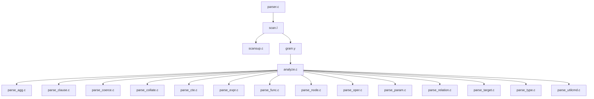

## AI辅助 PolarDB内核学习 - 9 parser SQL解析器  
        
### 作者        
digoal        
        
### 日期        
2025-03-04        
        
### 标签        
PostgreSQL , PolarDB , DuckDB , AI , 内核 , 学习 , parser          
        
----        
        
## 背景        
  
## parser 概览  
### 1. 概述  
`src/backend/parser` 目录是 PostgreSQL 解析器的核心部分，负责将 SQL 查询转换为查询树（Query Tree）。这个过程包括词法分析、语法分析、语义分析等步骤，最终生成的结构会被优化器和执行器使用。  
  
### 2. 主要文件及其功能  
  

  
### 3. 文件详细解析  
  
1. **parser.c**  
   - **功能**: 解析器的入口点，负责调用词法分析器`scan.l`、语法分析器`gram.y`和语义分析器`analyze.c`。  
   - **注释**: 该文件是 PostgreSQL 语法的入口点，确保在事务中止时仍能进行基本解析。接收 SQL 查询字符串，将其传递给词法分析器，然后将词法分析器生成的 token 流传递给语法分析器，最后将语法分析器生成的原始语法树传递给语义分析器。  
  
2. **scan.l**  
   - **功能**: 词法分析器(lexer)使用 `flex` 工具生成，将 SQL 查询分解为标记（tokens）。Tokenization: 将 SQL 查询字符串分解成一个个的 token（关键字、标识符、常量、运算符等）。  
   - **注释**: 该文件必须与 `src/fe_utils/psqlscan.l` 和 `src/interfaces/ecpg/preproc/pgc.l` 保持同步。需要与前端工具 psql 和 ecpg 的词法分析器保持同步，确保一致的 token 定义。  
  
3. **scansup.c**  
   - **功能**: 支持核心词法分析器的辅助函数，处理输入字符串中的转义字符等。  
   - **注释**: 提供词法分析器的支持功能。  
  
4. **gram.y**  
   - **功能**: 语法分析器，使用 Bison 工具将标记(tokens)解析为“原始”解析树。接收 `scan.l` 产生的 `token` 流，根据语法规则构建一个原始的语法树（Raw Parse Tree）。  
   - **注释**: 该文件包含 PostgreSQL 的 Bison 规则和动作，确保不进行数据库访问或依赖可变状态。  
  
5. **analyze.c**  
   - **功能**: 将 `gram.y` 生成的原始解析树转换为查询树(Query Tree)，对查询进行语义分析，例如类型检查、名称解析、权限检查等。  
   - **注释**: 对于可优化语句，获取适当的锁并进行语义分析；对于实用命令，直接将其转储到查询节点中。特殊处理: `DECLARE CURSOR、EXPLAIN 和 CREATE TABLE AS` 等命令包含可优化的语句，需要进行转换。  
  
6. **parse_agg.c**  
   - **功能**: 处理聚合函数和窗口函数。  
   - **注释**: 负责解析和处理聚合函数和窗口函数。  
  
7. **parse_clause.c**  
   - **功能**: 处理 SQL 查询中的子句，如 WHERE、ORDER BY、GROUP BY 等。  
   - **注释**: 负责解析和处理各种查询子句。  
  
8. **parse_coerce.c**  
   - **功能**: 处理类型强制转换。  
   - **注释**: 负责解析和处理表达式中的类型强制转换。  
  
9. **parse_collate.c**  
   - **功能**: 分配排序规则信息。  
   - **注释**: 在表达式解析完成后，分配排序规则信息。  
  
10. **parse_cte.c**  
    - **功能**: 处理公共表表达式（WITH 子句）。  
    - **注释**: 负责解析和处理公共表表达式。  
  
11. **parse_expr.c**  
    - **功能**: 处理表达式，如列、列 + 3、x = 3 或 x = 4 等。  
    - **注释**: 负责解析和处理各种表达式。  
  
12. **parse_func.c**  
    - **功能**: 处理函数、表.列和列标识符。  
    - **注释**: 负责解析和处理函数调用和标识符。  
  
13. **parse_node.c**  
    - **功能**: 创建各种结构的节点。  
    - **注释**: 负责创建各种解析树节点。  
  
14. **parse_oper.c**  
    - **功能**: 处理表达式中的运算符。  
    - **注释**: 负责解析和处理表达式中的运算符。  
  
15. **parse_param.c**  
    - **功能**: 处理参数。例如预编译语句中的 `$1`、`$2` 等。  
    - **注释**: 负责解析和处理查询中的参数。  
  
16. **parse_relation.c**  
    - **功能**: 支持表和列处理的辅助函数。  
    - **注释**: 提供表和列处理的支持功能。  
  
17. **parse_target.c**  
    - **功能**: 处理查询的结果列表。  
    - **注释**: 负责解析和处理查询的结果列表。  
  
18. **parse_type.c**  
    - **功能**: 支持数据类型处理的辅助函数。  
    - **注释**: 提供数据类型处理的支持功能。  
  
19. **parse_utilcmd.c**  
    - **功能**: 对实用命令（utility commands）进行解析分析。这些命令的分析通常在执行时进行，以避免依赖过时的数据库状态。  
    - **注释**: 在实用命令执行时进行解析分析，确保数据库状态的正确性。  
  
### 4. 总结  
`src/backend/parser` 目录中的文件共同协作，将 SQL 查询从字符串形式转换为查询树，供优化器和执行器使用。每个文件都有其特定的职责，从词法分析到语法分析，再到语义分析和特定功能的处理。理解这些文件的功能和它们之间的关系，有助于深入理解 PostgreSQL 的查询处理机制。  
    
  
## 提示    
````    
我是C语言初学者, 请结合我提供的如下信息向我详细解读这个PolarDB for PostgreSQL 源码目录的代码, 可以使用mermaid图表提高解释性.      
parser介绍:     
```    
Converts SQL query to query tree This converts SQL queries coming from libpq into command-specific structures to be used by the optimizer/executor, or commands routines. The SQL is lexically analyzed into keywords, identifiers, and constants, and passed to the parser. The parser creates command-specific structures to hold the elements of the query. The command-specific structures are then broken apart, checked, and passed to commands processing routines, or converted into Listsof Nodes to be handled by the optimizer and executor.  
```    
src/backend/parser 这个目录中有如下文件      
```    
Makefile  
README  
analyze.c  
check_keywords.pl  
gram.y  
parse_agg.c  
parse_clause.c  
parse_coerce.c  
parse_collate.c  
parse_cte.c  
parse_enr.c  
parse_expr.c  
parse_func.c  
parse_merge.c  
parse_node.c  
parse_oper.c  
parse_param.c  
parse_relation.c  
parse_target.c  
parse_type.c  
parse_utilcmd.c  
parser.c  
scan.l  
scansup.c  
```    
以下是一部分文件的注释     
```    
src/backend/parser/README  
  
Parser  
======  
  
This directory does more than tokenize and parse SQL queries.  It also  
creates Query structures for the various complex queries that are passed  
to the optimizer and then executor.  
  
parser.c    things start here  
scan.l      break query into tokens  
scansup.c   handle escapes in input strings  
gram.y      parse the tokens and produce a "raw" parse tree  
analyze.c   top level of parse analysis for optimizable queries  
parse_agg.c handle aggregates, like SUM(col1),  AVG(col2), ...  
parse_clause.c  handle clauses like WHERE, ORDER BY, GROUP BY, ...  
parse_coerce.c  handle coercing expressions to different data types  
parse_collate.c assign collation information in completed expressions  
parse_cte.c handle Common Table Expressions (WITH clauses)  
parse_expr.c    handle expressions like col, col + 3, x = 3 or x = 4  
parse_func.c    handle functions, table.column and column identifiers  
parse_node.c    create nodes for various structures  
parse_oper.c    handle operators in expressions  
parse_param.c   handle Params (for the cases used in the core backend)  
parse_relation.c support routines for tables and column handling  
parse_target.c  handle the result list of the query  
parse_type.c    support routines for data type handling  
parse_utilcmd.c parse analysis for utility commands (done at execution time)  
  
See also src/common/keywords.c, which contains the table of standard  
keywords and the keyword lookup function.  We separated that out because  
various frontend code wants to use it too.  
  
/*-------------------------------------------------------------------------  
 *  
 * parser.c  
 *              Main entry point/driver for PostgreSQL grammar  
 *  
 * Note that the grammar is not allowed to perform any table access  
 * (since we need to be able to do basic parsing even while inside an  
 * aborted transaction).  Therefore, the data structures returned by  
 * the grammar are "raw" parsetrees that still need to be analyzed by  
 * analyze.c and related files.  
 *  
 *  
 * Portions Copyright (c) 1996-2022, PostgreSQL Global Development Group  
 * Portions Copyright (c) 1994, Regents of the University of California  
 *  
 * IDENTIFICATION  
 *        src/backend/parser/parser.c  
 *  
 *-------------------------------------------------------------------------  
 */  
  
/*-------------------------------------------------------------------------  
 *  
 * scan.l  
 *        lexical scanner for PostgreSQL  
 *  
 * NOTE NOTE NOTE:  
 *  
 * The rules in this file must be kept in sync with src/fe_utils/psqlscan.l  
 * and src/interfaces/ecpg/preproc/pgc.l!  
 *  
 * The rules are designed so that the scanner never has to backtrack,  
 * in the sense that there is always a rule that can match the input  
 * consumed so far (the rule action may internally throw back some input  
 * with yyless(), however).  As explained in the flex manual, this makes  
 * for a useful speed increase --- several percent faster when measuring  
 * raw parsing (Flex + Bison).  The extra complexity is mostly in the rules  
 * for handling float numbers and continued string literals.  If you change  
 * the lexical rules, verify that you haven't broken the no-backtrack  
 * property by running flex with the "-b" option and checking that the  
 * resulting "lex.backup" file says that no backing up is needed.  (As of  
 * Postgres 9.2, this check is made automatically by the Makefile.)  
 *  
 *  
 * Portions Copyright (c) 1996-2022, PostgreSQL Global Development Group  
 * Portions Copyright (c) 1994, Regents of the University of California  
 *  
 * IDENTIFICATION  
 *        src/backend/parser/scan.l  
 *  
 *-------------------------------------------------------------------------  
 */  
  
/*-------------------------------------------------------------------------  
 *  
 * scansup.c  
 *        scanner support routines used by the core lexer  
 *  
 * Portions Copyright (c) 1996-2022, PostgreSQL Global Development Group  
 * Portions Copyright (c) 1994, Regents of the University of California  
 *  
 *  
 * IDENTIFICATION  
 *        src/backend/parser/scansup.c  
 *  
 *-------------------------------------------------------------------------  
 */  
  
/*-------------------------------------------------------------------------  
 *  
 * gram.y  
 *        POSTGRESQL BISON rules/actions  
 *  
 * Portions Copyright (c) 1996-2022, PostgreSQL Global Development Group  
 * Portions Copyright (c) 1994, Regents of the University of California  
 *  
 *  
 * IDENTIFICATION  
 *        src/backend/parser/gram.y  
 *  
 * HISTORY  
 *        AUTHOR                        DATE                    MAJOR EVENT  
 *        Andrew Yu                     Sept, 1994              POSTQUEL to SQL conversion  
 *        Andrew Yu                     Oct, 1994               lispy code conversion  
 *  
 * NOTES  
 *        CAPITALS are used to represent terminal symbols.  
 *        non-capitals are used to represent non-terminals.  
 *  
 *        In general, nothing in this file should initiate database accesses  
 *        nor depend on changeable state (such as SET variables).  If you do  
 *        database accesses, your code will fail when we have aborted the  
 *        current transaction and are just parsing commands to find the next  
 *        ROLLBACK or COMMIT.  If you make use of SET variables, then you  
 *        will do the wrong thing in multi-query strings like this:  
 *                      SET constraint_exclusion TO off; SELECT * FROM foo;  
 *        because the entire string is parsed by gram.y before the SET gets  
 *        executed.  Anything that depends on the database or changeable state  
 *        should be handled during parse analysis so that it happens at the  
 *        right time not the wrong time.  
 *  
 * WARNINGS  
 *        If you use a list, make sure the datum is a node so that the printing  
 *        routines work.  
 *  
 *        Sometimes we assign constants to makeStrings. Make sure we don't free  
 *        those.  
 *  
 *-------------------------------------------------------------------------  
 */  
  
/*-------------------------------------------------------------------------  
 *  
 * analyze.c  
 *        transform the raw parse tree into a query tree  
 *  
 * For optimizable statements, we are careful to obtain a suitable lock on  
 * each referenced table, and other modules of the backend preserve or  
 * re-obtain these locks before depending on the results.  It is therefore  
 * okay to do significant semantic analysis of these statements.  For  
 * utility commands, no locks are obtained here (and if they were, we could  
 * not be sure we'd still have them at execution).  Hence the general rule  
 * for utility commands is to just dump them into a Query node untransformed.  
 * DECLARE CURSOR, EXPLAIN, and CREATE TABLE AS are exceptions because they  
 * contain optimizable statements, which we should transform.  
 *  
 *  
 * Portions Copyright (c) 1996-2022, PostgreSQL Global Development Group  
 * Portions Copyright (c) 1994, Regents of the University of California  
 *  
 *      src/backend/parser/analyze.c  
 *  
 *-------------------------------------------------------------------------  
 */  
  
/*-------------------------------------------------------------------------  
 *  
 * parse_agg.c  
 *        handle aggregates and window functions in parser  
 *  
 * Portions Copyright (c) 1996-2022, PostgreSQL Global Development Group  
 * Portions Copyright (c) 1994, Regents of the University of California  
 *  
 *  
 * IDENTIFICATION  
 *        src/backend/parser/parse_agg.c  
 *  
 *-------------------------------------------------------------------------  
 */  
  
/*-------------------------------------------------------------------------  
 *  
 * parse_coerce.c  
 *              handle type coercions/conversions for parser  
 *  
 * Portions Copyright (c) 1996-2022, PostgreSQL Global Development Group  
 * Portions Copyright (c) 1994, Regents of the University of California  
 *  
 *  
 * IDENTIFICATION  
 *        src/backend/parser/parse_coerce.c  
 *  
 *-------------------------------------------------------------------------  
 */  
  
/*-------------------------------------------------------------------------  
 *  
 * parse_collate.c  
 *              Routines for assigning collation information.  
 *  
 * We choose to handle collation analysis in a post-pass over the output  
 * of expression parse analysis.  This is because we need more state to  
 * perform this processing than is needed in the finished tree.  If we  
 * did it on-the-fly while building the tree, all that state would have  
 * to be kept in expression node trees permanently.  This way, the extra  
 * storage is just local variables in this recursive routine.  
 *  
 * The info that is actually saved in the finished tree is:  
 * 1. The output collation of each expression node, or InvalidOid if it  
 * returns a noncollatable data type.  This can also be InvalidOid if the  
 * result type is collatable but the collation is indeterminate.  
 * 2. The collation to be used in executing each function.  InvalidOid means  
 * that there are no collatable inputs or their collation is indeterminate.  
 * This value is only stored in node types that might call collation-using  
 * functions.  
 *  
 * You might think we could get away with storing only one collation per  
 * node, but the two concepts really need to be kept distinct.  Otherwise  
 * it's too confusing when a function produces a collatable output type but  
 * has no collatable inputs or produces noncollatable output from collatable  
 * inputs.  
 *  
 * Cases with indeterminate collation might result in an error being thrown  
 * at runtime.  If we knew exactly which functions require collation  
 * information, we could throw those errors at parse time instead.  
 *  
 * Portions Copyright (c) 1996-2022, PostgreSQL Global Development Group  
 * Portions Copyright (c) 1994, Regents of the University of California  
 *  
 *  
 * IDENTIFICATION  
 *        src/backend/parser/parse_collate.c  
 *  
 *-------------------------------------------------------------------------  
 */  
  
/*-------------------------------------------------------------------------  
 *  
 * parse_param.c  
 *        handle parameters in parser  
 *  
 * This code covers two cases that are used within the core backend:  
 *              * a fixed list of parameters with known types  
 *              * an expandable list of parameters whose types can optionally  
 *                be determined from context  
 * In both cases, only explicit $n references (ParamRef nodes) are supported.  
 *  
 * Note that other approaches to parameters are possible using the parser  
 * hooks defined in ParseState.  
 *  
 * Portions Copyright (c) 1996-2022, PostgreSQL Global Development Group  
 * Portions Copyright (c) 1994, Regents of the University of California  
 *  
 *  
 * IDENTIFICATION  
 *        src/backend/parser/parse_param.c  
 *  
 *-------------------------------------------------------------------------  
 */  
  
/*-------------------------------------------------------------------------  
 *  
 * parse_utilcmd.c  
 *        Perform parse analysis work for various utility commands  
 *  
 * Formerly we did this work during parse_analyze_*() in analyze.c.  However  
 * that is fairly unsafe in the presence of querytree caching, since any  
 * database state that we depend on in making the transformations might be  
 * obsolete by the time the utility command is executed; and utility commands  
 * have no infrastructure for holding locks or rechecking plan validity.  
 * Hence these functions are now called at the start of execution of their  
 * respective utility commands.  
 *  
 *  
 * Portions Copyright (c) 1996-2022, PostgreSQL Global Development Group  
 * Portions Copyright (c) 1994, Regents of the University of California  
 *  
 *      src/backend/parser/parse_utilcmd.c  
 *  
 *-------------------------------------------------------------------------  
 */           
```  
````
  
## PolarDB & PostgreSQL 15 差异    
```
git diff -u 50d3d22baba63613d1f1406b2ed460dc9b03c3fc f5e7493819e370d30ac2047c68c21c9fb03ce4a0 -- src/backend/parser
```
     
差异分析待补充.  
   
    
      
<b> 以上内容基于DeepSeek及诸多AI生成, 轻微人工调整, 感谢杭州深度求索人工智能等公司. </b>           
         
<b> AI 生成的内容请自行辨别正确性, 当然也多了些许踩坑的乐趣, 毕竟冒险是每个男人的天性. </b>         
        
        
  
#### [期望 PostgreSQL|开源PolarDB 增加什么功能?](https://github.com/digoal/blog/issues/76 "269ac3d1c492e938c0191101c7238216")
  
  
#### [PolarDB 开源数据库](https://openpolardb.com/home "57258f76c37864c6e6d23383d05714ea")
  
  
#### [PolarDB 学习图谱](https://www.aliyun.com/database/openpolardb/activity "8642f60e04ed0c814bf9cb9677976bd4")
  
  
#### [PostgreSQL 解决方案集合](../201706/20170601_02.md "40cff096e9ed7122c512b35d8561d9c8")
  
  
#### [德哥 / digoal's Github - 公益是一辈子的事.](https://github.com/digoal/blog/blob/master/README.md "22709685feb7cab07d30f30387f0a9ae")
  
  
#### [About 德哥](https://github.com/digoal/blog/blob/master/me/readme.md "a37735981e7704886ffd590565582dd0")
  
  

  
